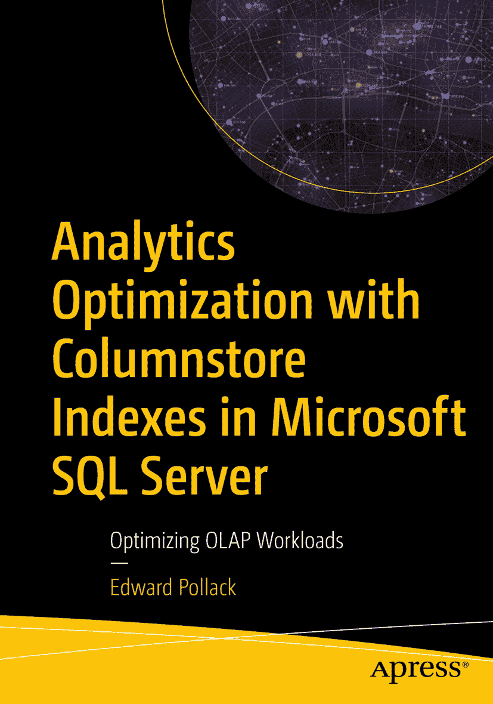

ISBN 978-1-4842-8047-8
电子书 ISBN 978-1-4842-8048-5
[`doi.org/10.1007/978-1-4842-8048-5`](https://doi.org/10.1007/978-1-4842-8048-5)
© Edward Pollack 2022
本作品受版权保护。无论涉及材料的全部或部分，出版方均拥有所有权利的唯一且排他性许可，特别是翻译权、转载权、插图再利用权、朗诵权、广播权、缩微胶片或其他物理方式的复制权，以及信息存储与检索、电子改编、计算机软件方面的传输权，或任何现在已知或未来开发的类似或不同的方法。在本出版物中使用通用描述性名称、注册商标、服务标志等，即使未作特别声明，也不意味着这些名称可不受相关保护性法律法规的约束而免费供通用使用。出版方、作者和编辑均合理相信本书中的建议和信息在出版时是真实准确的。出版方、作者或编辑均不就本文所含材料或可能存在的任何错误或遗漏提供任何明示或暗示的保证。出版方对出版地图中的管辖权主张以及机构从属关系保持中立。

此 Apress 标识版本由 Springer Nature 旗下注册公司 APress Media, LLC 出版。

注册公司地址为：1 New York Plaza, New York, NY 10004, U.S.A.

*献给 Theresa、Nolan 和 Oliver，没有你们，这一切都不可能实现。*

