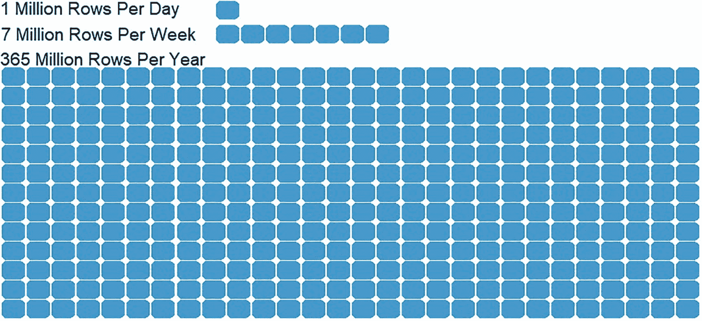

# 1. 事务数据库中的分析数据介绍

分析数据，就其本质而言，可能体量庞大、维护挑战重重，并且会随着时间的推移快速增长。同样，随着分析师和数据科学家发现更多处理它的方法，其使用量也会随之增加。将分析数据存储在靠近其底层事务源的地方，会带来极大的便利。为分析数据选择一个能够经得起时间考验的存储位置同样具有实用价值，这样可以避免在未来数据无法适当扩展时进行代价高昂的迁移。

## 分析数据应存放在何处？

在列存储索引出现之前，将分析数据存储在 SQL Server 的事务数据库中是件麻烦事，需要运用技巧和做出妥协才能使其性能足以应对严格的分析要求。为了绕开这些限制，人们引入了其他技术和服务。

分析数据可以存储在多种位置，例如：

*   数据仓库（SQL Server Analysis Services、RedShift 等）
*   非结构化数据（使用 Hadoop、Hive 等的数据湖）
*   第三方分析软件
*   关系/事务数据库中的 OLTP 表
*   关系/事务数据库中的 OLAP 表

这些选项各有优缺点，但在深入探讨细节之前，回顾一下分析数据及其形态是重要的。

请注意，`OLAP` 代表“联机分析处理”，指分析型表和数据；而 `OLTP` 代表“联机事务处理”，指事务型表和数据。

## 分析数据规模

典型的分析数据，其行数远高于其源事务数据。这可能是因为需要详细跟踪大量度量指标，也可能是因为需要在长时间内对这些细节进行重复采样跟踪。如果一个事务日志表每天新增一百万行，那么一年将捕获 3.65 亿行数据。图 1-1 展示了时间对数据可能产生的巨大影响，以及一个小数据集在定期采样时如何快速增长。



*图 1-1：加入时间维度后数据增长的图示说明*

分析数据也可能相当“宽”（列多）。即使是一个小表，也可能从中派生出许多计算度量指标，从而使其对应的 `OLAP` 表包含多得多的列。例如，考虑清单 1-1 中的假设销售订单表。

```sql
CREATE TABLE dbo.SalesOrder
(      SalesOrderId INT NOT NULL IDENTITY(1,1) CONSTRAINT PK_SalesOrder PRIMARY KEY CLUSTERED, ProductDetailList INT NOT NULL CONSTRAINT FK_SalesOrder_ProductDetail FOREIGN KEY REFERENCES dbo.ProductDetail,
CustomerId INT NOT NULL CONSTRAINT FK_SalesOrder_Customer FOREIGN KEY REFERENCES dbo.Customer,
OrderTime DATETIME2(3) NOT NULL,
SalesAmount DECIMAL(18,4) NOT NULL,
TaxRate DECIMAL(6,4) NOT NULL,
ShipTime DATETIME2(3) NULL,
ReceivedTime DATETIME2(3) NULL);
```
*清单 1-1：一个事务型销售订单表示例*

清单 1-1 中的表仅包含八列，提供了关于订单的信息，包括客户、产品详情以及时间和成本。经过一段时间和深思熟虑后，分析团队基于这个事务表创建了一个数据仓库风格的事实表，如清单 1-2 所示。

```sql
CREATE TABLE fact.SalesOrderMetrics
(      OrderDate DATE NOT NULL,
CustomerID INT NOT NULL,
OrderCount INT NOT NULL,
SalesAmountTotal DECIMAL(20,4) NOT NULL,
SalesAmountMin DECIMAL(20,4) NOT NULL,
SalesAmountMax DECIMAL(20,4) NOT NULL,
AverageTaxRate DECIMAL(6,4) NOT NULL,
MinTaxRate DECIMAL(6,4) NOT NULL,
MaxTaxRate DECIMAL(6,4) NOT NULL,
AverageHoursFromOrdertoShip DECIMAL(6,2) NULL,
AverageHoursFromShiptoReceive DECIMAL(6,2) NULL,
MinimumSecondsBetweenOrders INT NULL,
MaximumSecondsBetweenOrders INT NULL);
```
*清单 1-2：一个分析型销售订单表示例*

请注意，清单 1-2 中的分析表包含各种额外的度量指标，这些指标用于在源数据从明细数据转换为每日汇总数据时对数据元素进行汇总。如果组织存在相关需求，分析师可以轻松添加更多列。

由于这些细节，分析数据很容易增长，并在目标表中包含数百万或数十亿行。同样，一个分析表可能包含远多于其源事务数据的列。因此，分析表可能拥有许多行和/或许多列，这并不令人惊讶。即使是一个设计上不“宽”（列多）或不“深”（行多）的表，也会随着组织的成长和发展而随时间变化。因此，制定管理更大数据的计划是有益的，即使在分析项目最初完成时这些计划并未实施。

## 分析数据结构

分析数据通常由以下两种数据之一构成：

*   统计度量指标
*   详细数据

统计度量指标是可以聚合成有意义的派生度量的数值字段。这些可能是日期、时长、测量值、比率等。通常，这些数据类型使用定长数据类型，相对较小，并且具有可预测的存储占用空间。

详细数据由基于文本的数据类型组成，例如 `VARCHAR`、`JSON`、`XML` 和其他标记类型。这些数据通常不会直接用于度量或统计，而是在事后为进一步分析而进行深度处理。虽然详细数据很重要，但它不是本书的重点。如果某个维度存在大型基于文本的数据类型，值得考虑对该列进行规范化，以减少其占用空间，并允许更轻松地管理详细值。

例如，清单 1-3 中的表包含一个大型文本列。

```sql
CREATE TABLE dbo.WebAccessLog
(      LogId INT NOT NULL,
LogTime DATETIME2(3) NOT NULL,
LogSource VARCHAR(250) NOT NULL,
ErrorCode BIGINT NOT NULL);
```
*清单 1-3：一个带有宽文本列的表示例*

假设 `LogSource` 列中的数据经常重复，将其规范化为自己的维度表将节省计算资源，并在需要时更轻松地分析不同值或值子集。清单 1-4 展示了 `LogSource` 被规范化后的表。

```sql
CREATE TABLE dbo.LogSource
(      LogSourceId SMALLINT NOT NULL IDENTITY(1,1) CONSTRAINT PK_LogSource PRIMARY KEY CLUSTERED, LogSource VARCHAR(250) NOT NULL);
CREATE TABLE dbo.WebAccessLog
(      LogId INT NOT NULL,
LogTime DATETIME2(3) NOT NULL,
LogSourceId SMALLINT NOT NULL,
ErrorCode BIGINT NOT NULL);
```
*清单 1-4：将文本列规范化为查找表*

原本用 250 个字符字符串表示的 `LogSource` 列，现在改用一个 `SMALLINT` 来引用查找表 `LogSource`。规范化列时，要确保查找键的数据类型既不太小（可能耗尽取值），也不太大（浪费空间）。规范化维度并不总是必要的操作，但当维度值经常重复且需要频繁引用它们时，这样做可能是有益的。

## 分析数据源

分析数据可以存储在哪里？如何知道这个决策是有效做出的？在简要回顾了分析数据之后，我们可以更详细地探讨这个关于分析数据存储位置的问题。


