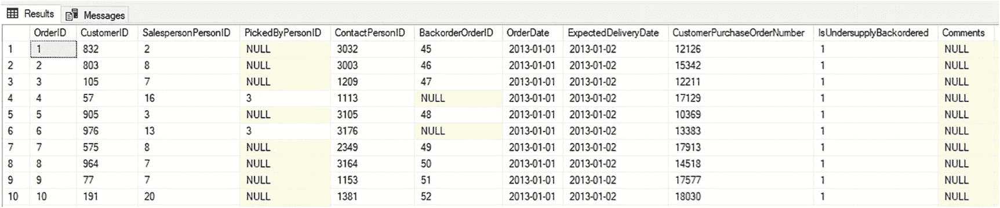
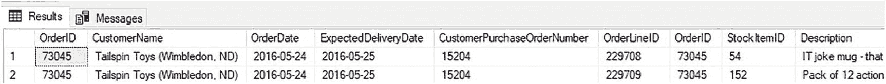
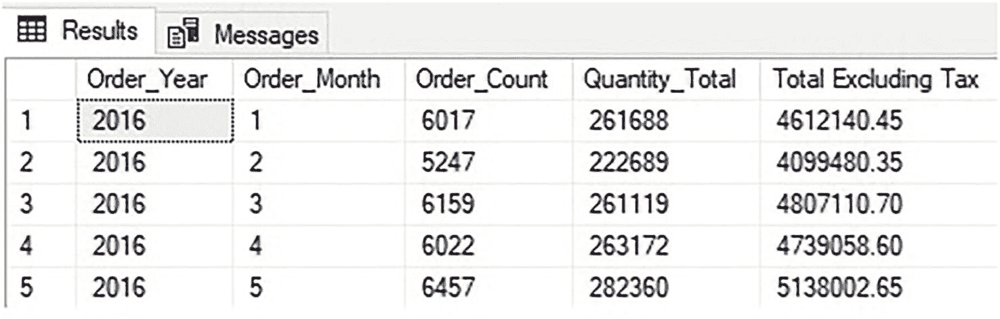
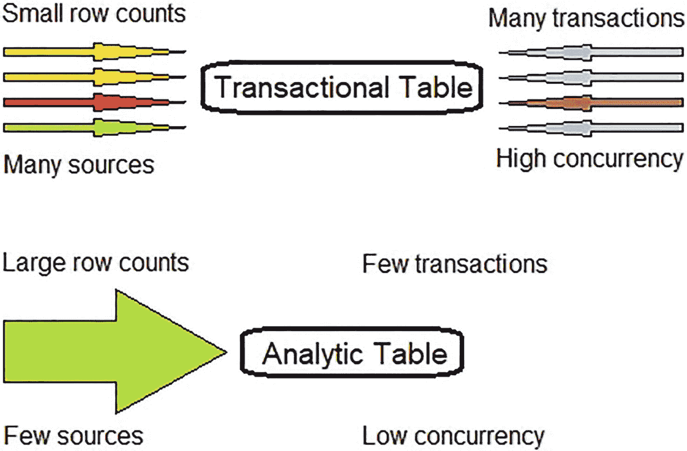

# 在事务型数据库的分析表中存储 **OLAP** 数据

存储分析数据的最后一个选项是在事务型数据库中使用 **OLAP** 表。这是本书剩余部分的重点，它将提供一种与目前所介绍方案不同的替代方案。

**OLAP** 表是一种表结构，专门设计用于服务通常需要访问大量行进行聚合的查询，同时不需要在任何时候返回所有列。**OLAP** 表预计将增长到数百万或数十亿行，并且可以轻松地处理一次处理数百万行的查询。

在 **`SQL Server`** 中使用 **OLAP** 表存储分析数据有许多好处，包括：

*   可以利用现有技术和许可来维护分析数据。
*   实施和使用的**学习曲线要小得多**。
*   数据完全由其所有者维护。
*   数据可以存储在非常靠近其事务数据源的地方。

这些并非微不足道的考虑因素，它们可以使分析解决方案的实施变得快速、经济，并且在需要时易于修改。此外，可以按需衡量和优化性能，以确保分析数据的最终用户享有可接受的访问速度。另外，将数据加载到分析表中的过程也可以被精细调整得**异常快速**。

考虑到其简单性和易于实施的特点，值得投入时间和资源来创建一个概念验证，以测试在 **`SQL Server`** 中使用列存储索引存储分析数据的可行性。

```
分析数据可能规模庞大，消耗大量资源，并且在需要变更时迁移起来颇具挑战。为分析数据选择正确的目标数据结构并做出尽可能最佳的初始决策，对于一个分析项目的长期成功至关重要。

本书将详细探讨分析工作负载的本质，以及为何 SQL Server 中的列存储索引能够提供一种兼具成本效益和高性能的解决方案。
```


## 2. 事务型与分析型工作负载

事务型数据和分析型数据在写入、读取、存储和管理方式上存在根本差异。要实现其中任一类数据的最优性能，都需要针对其各自的范式来设计数据结构和软件。

在大型、繁忙的生产系统中，选择最佳数据结构至关重要，因为重建现有系统的成本远高于从一开始就进行有效架构的成本。本章将探讨这些工作负载的差异，并有效引入`列存储`索引作为满足广泛分析型数据存储需求的最优解决方案。

### 事务型数据

应用程序随时创建、修改、删除和读取的数据即为事务型数据。这些数据可能并不总是存储在结构化数据库中，也不一定遵循`ACID`事务（**原子性**、**一致性**、**隔离性**、**持久性**）的原则，但在本文的讨论中，它们都将被视为事务型数据。

考虑一个处理来自网站和热门移动应用订单的订单系统。这显然是一个事务型系统。许多人定期访问该网站并创建订单、查看状态以及等待所订购商品的送达。`WideWorldImporters`示例数据库中包含一个`Orders`表，它代表了典型订单系统中会看到的结构，如图 2-1 所示。



图 2-1
繁忙订单处理系统使用的订单表示例

请注意，该表包含许多列，每一列都代表订单的一个细节，例如销售员、客户、联系人、订购日期和采购订单号。无论该表随时间变得多大，普通用户通常一次只希望查看少量行。访问的数据量通常很小，因为用户很少查看当前或近期订单之外的数据。即使需要，也会通过预先建立的筛选器和链接来确保数据能够快速提供。

通常，应用程序一次会返回许多列。在查看订单时，返回任何可能需要的列比被迫多次返回表来检索更多列要快得多、效率高得多。

由于用户是直接与应用程序交互，因此期望性能尽可能快。等待一两秒完成订单处理可能是可以接受的，而等待一两分钟则会立即引发投诉并导致业务损失。同样，由于许多用户同时访问站点，预期的争用会很高。因为许多人会同时访问他们的订单，所以存储这些数据的表需要能够进行快速读写，即使有成千上万（或数百万）个订单同时被访问也是如此。

一般来说，事务型查询往往比较简单。例如，用户检索当前订单信息可能会使用以下查询：

```sql
SELECT
    Orders.OrderID,
    Customers.CustomerName,
    Orders.OrderDate,
    Orders.ExpectedDeliveryDate,
    Orders.CustomerPurchaseOrderNumber,
    OrderLines.*
FROM Sales.Orders
INNER JOIN Sales.Customers
    ON Customers.CustomerID = Orders.CustomerID
INNER JOIN Sales.OrderLines
    ON OrderLines.OrderID = Orders.OrderID
WHERE Customers.CustomerID = 10
    AND Orders.OrderDate >= '5/20/2016'
    AND Orders.OrderDate < '5/27/2016';
```

这是一个相对简单的查询，从 3 个表中提取了 5 个特定的列以及所有 12 个订单行明细列。图 2-2 显示了此查询的结果。



图 2-2
示例事务型订单查询的结果

请注意，通过对客户和日期进行筛选，只返回了两行。该系统的用户不太可能一次性请求数百或数千个订单的数据。一次查看如此多的数据将具有挑战性，而且用户界面很可能也未构建为允许一次检索如此多的数据。

事务型系统提供的任何数据在运行时都需要准确无误。检查银行余额的人需要得到一个准确的数字，绝无例外。这意味着数据完整性必须在运行时通过数据库、应用程序或两者结合来强制执行。如果所讨论的应用程序属于医院、军队或气象学家，那么事务型系统中的不准确数据可能会带来灾难性的后果。

同样，如果事务型操作失败，需要立即处理该失败，以免用户的数据处于不确定状态。如果用户在线续签护照，但支付从未正确处理，他们的申请可能得不到应有的处理。更糟糕的是，用户可能没有简单的方法来修复它。因此，该系统能够将流程的每一步作为一个整体单元正确处理的能力非常重要。对于事务型数据使用`ACID`在很大程度上取决于数据及其用途。银行无法承受不一致的事务，但社交媒体网站可能可以。同样，在某些组织模型中最终一致的数据是完全可接受的，而在其他模型中则可能是破坏性的。

`OLTP`（联机事务处理）数据通常经过规范化，以协助确保关系完整性以及高效生成查找值列表。`规范化`可以在事务型应用程序中节省空间和内存，因为更冗长的文本列被数字查找所取代。它还允许通过直接查询规范化表在应用程序中进行轻松查找。

总之，事务型数据通常具有以下特征：

*   通常是`INSERT`、`UPDATE`和`DELETE`操作的目标。
*   一次返回多列，供应用程序使用。
*   单个用户一次访问的数据量通常较小。
*   事务速度至关重要。
*   预期存在高水平的争用。
*   数据在运行时需要时必须准确无误，绝无例外。
*   由应用程序最终用户访问。
*   通常经过规范化。

虽然这些特征对事务型数据通常是成立的，但分析型数据却大不相同，值得进一步详细探讨。


## 分析数据

事务数据存在于处理订单或银行业务的实时/繁忙系统中，而**分析数据**则存在于更靠后的环节。这类数据最常与报表、可视化和分析相关联。它驱动着商业智能、数据科学以及推动全球组织发展的决策制定。

OLAP 系统与事务系统有着根本性的不同。为确保最佳的速度和可靠性，两者需要在架构设计、实现和管理方式上采取截然不同的策略。

分析查询通常需要一次性访问大批量的数据，但为了计算出驱动结果所需的指标，实际用到的列则要少得多。例如，一个常见的财务需求可能是比较本季度与上季度的收入。完成这个查询所需的计算需要访问每个季度的所有收入数据，或者将这些数据预先计算好并存放在一个方便的位置。

以下查询是一个分析数据请求的示例，旨在了解订单数量和随时间变化的订单总额：

```sql
SELECT
Date.[Calendar Year] AS Order_Year,
Date.[Calendar Month Number] AS Order_Month,
COUNT(*) AS Order_Count,
SUM(Quantity) AS Quantity_Total,
SUM([Total Excluding Tax]) AS [Total Excluding Tax]
FROM Fact.[Order]
INNER JOIN Dimension.Date
ON Date.Date = [Order].[Order Date Key]
WHERE [Order].[Order Date Key] >= '1/1/2016'
AND [Order].[Order Date Key] < '1/1/2017'
GROUP BY Date.[Calendar Year], Date.[Calendar Month Number]
ORDER BY Date.[Calendar Year], Date.[Calendar Month Number];
```

请注意，查询只请求了少数几列，但为了返回如图 2-3 所示的结果，系统查询了近 3 万条订单记录。



图 2-3：一个分析查询示例的结果

一个更大的 OLAP 系统可以轻松地在单个请求中处理数百万行数据，得到类似的结果。一个有效的分析数据存储需要能够扩展，以支持任何给定表中的数百万（甚至数十亿）行数据，同时不会消耗过多的系统资源，也不会导致查询执行时间过长。

与数据从许多来源以小批量方式写入的事务系统不同，分析数据通常是通过一组有限的、有组织的数据加载流程，以较大的批量操作生成的。一次性插入数千（或数百万）行数据需要快速且高效，因为这将成为常态。图 2-4 中的图表说明了两种类型系统中数据写入方式的差异。



图 2-4：OLAP 与 OLTP 数据访问模式总结

需要注意的是，并非所有的 OLTP 和 OLAP 系统都严格遵循此模式，但大体上会遵循这些使用模式。

由于分析数据通常用于报表、分析和数据科学，因此对实时结果的需求不那么重要。许多分析过程是异步进行的，并不直接由最终使用结果数据的用户监控。因为 OLAP 数据变化不那么频繁，复杂的数据处理可以在数据使用前完成，这样如果需要交互式报表，就不必等待太长时间才能看到结果。

同样，因为访问数据的数据源、用户和应用程序数量较少，资源争用带来的挑战也小得多。一个查询可能需要从表中读取数百万行才能返回结果，但访问该表的查询数量将比繁忙的事务表少好几个数量级。

由于 OLAP 数据更新不频繁，通过约束来维护关系完整性的需求就较低。加载的新数据集可以在插入分析表之前进行独立的验证和确认。外键和约束可能仍会作为便利的连接或报表工具而被使用，但其采用与否将取决于它们对加载速度的影响。如何验证分析数据的决策取决于每个用例、其源事务数据的性质，以及在有组织的数据加载过程之外，OLAP 数据可能发生变化的量。

同样，OLAP 数据加载过程的设计者在处理故障时可以采取更灵活的方式。在事务性应用中，故障需要立即重试或回滚，不能有任何中间状态，以免导致错误或不一致的数据。而一个失败的分析加载过程，则可以通过更“强力”的方式解决，例如：

1.  排查并修复损坏的加载过程。
2.  识别并删除所有新加载的数据。
3.  重新运行加载过程。

很可能无需保留任何部分加载的数据，而且删除部分加载的数据也不复杂，因为它通常带有时间戳。许多 OLAP 数据加载过程会包含自动删除同一时间段内先前加载的任何数据的步骤。这样，失败的过程可以重新运行，而无需先执行清理步骤。

分析数据的消费者也与使用事务性应用的消费者大不相同。一个 OLTP 应用可能拥有范围广泛的终端用户，他们定期直接与软件交互；而分析数据的消费者往往是分析师、领域专家和业务领导者。领域专家是那些对数据足够熟悉，能够理解其含义和用途的人。例如，网络管理员是网络流量数据的领域专家，而首席财务官则是季度收益数据的领域专家。领域专家可能对数据的含义有清晰的理解，但他们不太熟悉数据是如何存储和处理的。

与 OLTP 数据不同，分析数据通常是非规范化的。可能会为了报表目的而维护查找表，但并非专门用作事实表的查找引用。在 OLAP 表中，规范化并不总能显著节省存储或内存资源。同样重要的是，在数据加载过程中连接查找表会大大增加延迟，导致新的分析数据可用时间变得更长。主流分析数据结构中使用的大多数压缩算法，在物理存储数据时利用字典查找来“规范化”数据。这意味着重复值占用的空间远少于事务表中的情况，而不论该列的具体宽度有多大。尽管如此，字典大小是有限的，更宽的数据类型会带来压缩挑战，这将在第 5 章中讨论。

分析数据可以总结如下：

*   **由大型、低频且受控的数据加载过程写入。**
*   **为用于分析，以大批量方式读取行数据。**
*   **每次操作通常读取的列较少。**
*   **预期争用程度较低。**
*   **数据完整性可通过验证来强制执行，而非依赖约束。**
*   **由业务领导者、分析师和领域专家访问。**
*   **通常是非规范化的。**

分析数据的特征与事务数据截然不同。这些不同的特征往往导致需要使用不同的系统来分别存储它们。


## 对两套系统的必要性

由于事务型系统和分析型系统的工作负载差异巨大，随着数据量增长，为其维护独特数据结构的需求就变得愈加明显。

虽然上千行数据在任何结构中都能快速访问，但若数据达到十亿行，除非其数据结构是针对预期服务的工作负载类型而构建的，否则将变得异常笨重。

许多应用程序试图混合分析型和事务型工作负载以保持便利性并避免创建新系统。这在两类数据之间的各种差异开始相互冲突之前是可行的。例如，混合使用 `OLAP` 和 `OLTP` 工作负载时一个常见的陷阱是：大型、缓慢的分析查询会导致对应用程序用户正尝试写入的对象产生锁定和阻塞。如果销售人员运行年度报告时阻塞了试图购买新产品的用户，结果将是销售损失和用户不满。

同样地，那些大型报告可能消耗大量内存，迫使常见的事务型数据让出缓冲池空间给报表数据。这将进一步加剧应用程序用户的操作迟滞。

一般来说，混合分析型和事务型工作负载可能并非总能避免，但提前考虑这一架构决策的影响，有助于在问题变得代价高昂之前预测（并规划应对）它们。

`OLTP` 和 `OLAP` 系统之间还有许多其他考虑因素会有所不同，例如：

*   维护
*   高可用性
*   灾难恢复
*   `SQL Server` 许可
*   硬件资源

应用程序架构师需要确保针对事务型和分析型工作负载，分别探讨这些主题。虽然在数据量较小时使用相似系统是可能的，但这些系统不太可能无限扩展。最终，数据会变得足够大，以至于需要独特的解决方案来区分每种工作负载类型。

这些决策的细微差别可以深入很多。例如，一个小型分析数据库的架构可能与大型数据仓库不同。因此，在设计新数据结构或重新审视现有数据库对象时，综合考虑规模、扩展性、数据增长和工作负载至关重要。

## 构建更好的分析型数据结构

迄今为止的讨论清楚地表明，用于支持分析型数据的表和结构需要区别于事务型工作负载所使用的。本章概述了许多区分 `OLTP` 和 `OLAP` 应用程序的细节，包括它们如何读写数据以及典型的使用模式。

考虑到这些信息，可以构想出分析型数据应存储在何处。本书的剩余部分将重点介绍如何利用 `SQL Server` 中的列存储索引来有效满足大型分析型表和工作负载的需求。这项技术已经成熟，可用于有效管理各种分析用例，确保它为架构师和管理员经常面临的许多分析挑战提供理想的解决方案。

