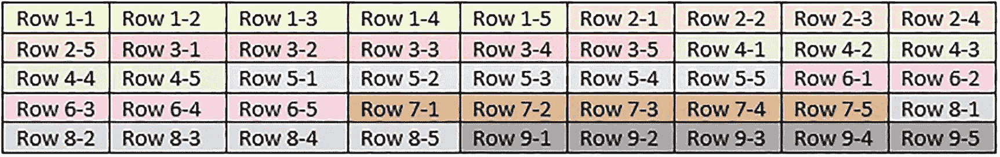
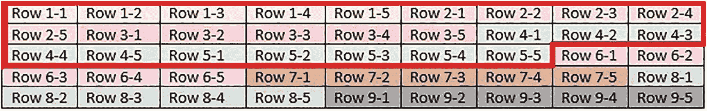
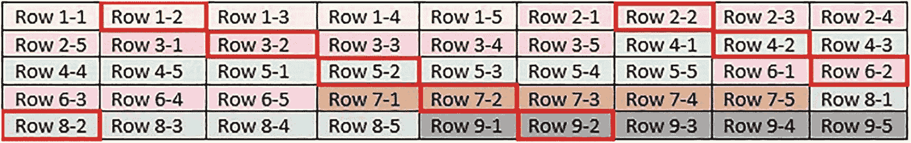

# 3. 什么是列存储索引？

至此，已经提出了一个令人信服的理由，即将 `OLTP` 和 `OLAP` 工作负载分离到独特的数据结构中，并针对各自的用例进行优化。列存储索引是 `SQL Server` 的一项功能，为大型分析型数据提供原生支持。本章将深入探讨它们是什么，以及为什么它们是应对分析型数据挑战的有效解决方案。

## 事务型数据存储的限制

包含数百万或数十亿行分析型数据的表，如果实现为经典的事务型表，则扩展性不佳。要完全理解其中的原因，比较数据在事务型表和分析型表中的存储方式会有所帮助。以下示例表包含五列。图 3-1 展示了数据在 `OLTP`（行存储）版本的此表中的存储方式。



图 3-1：聚集行存储索引中数据存储的示意图

在聚集行存储索引中，每一行按聚集索引规定的顺序依次存储在页面上。如果查询需要单行或多行的许多列，那么这是一种极其高效的存储结构。例如，检索从第 1 行到第 -5 行的所有列所需的工作量很小，因为数据是连续且有序的。图 3-2 突出显示了满足此查询所需的数据。



图 3-2：`OLTP` 查询检索五行时如何读取示例表

具有顺序列的表模拟了典型的事务型查询如何处理如下查询：

```
SELECT
OrderID, --  一个标识/主键列
CustomerID,
SalespersonPersonID,
ContactPersonID,
OrderDate
FROM Sales.Orders
WHERE OrderId = 289;
```

事务型查询写入单行或小范围行，这通常与在单个索引上的查找相关。这里，使用一个数值标识从更大的表中筛选出感兴趣的五行。

`SQL Server` 存储的基本单位是页面。一个页面由 8KB 数据组成。页面包含给定表的所有数据和索引存储。如果查询需要单行，则即使页面上的其余数据不需要，它所在页面的全部内容也会被读入内存。因此，事务型查询依赖于聚集或非聚集索引来确保索引查找能够以有序的方式返回数据，如图 3-2 中的示例所示。在这种情况下，即使表变得非常大，读取这五行也不会需要太多额外开销。

然而，分析型查询则大不相同。它们通常聚合少数几列，但却是在很多行上进行聚合。考虑一个针对示例表的典型 `OLAP` 查询，它在表的大部分区域（恰好包含此处显示的所有行）聚合单个列。图 3-3 展示了这种情况。



图 3-3：从示例表聚合单个列的分析型查询

行的物理布局显示，一个只需要第 2 列的查询也需要读取相邻的列，即使它们不需要。以下是一个查询示例，它访问表中的大量数据，但仅聚合单个列。

```
SELECT
SUM(Quantity) AS Total_Quantity
FROM Sales.OrderLines
WHERE OrderID >= 1
AND OrderID < 10000;
```

尽管只对单个列进行了求和，但任何包含该列值的页面都需要被读入内存。即使使用覆盖非聚集索引，仍然需要读取每一行的数据，尽管这种方式可以减少读取的页面数量。


