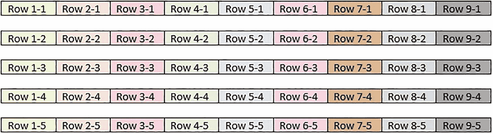
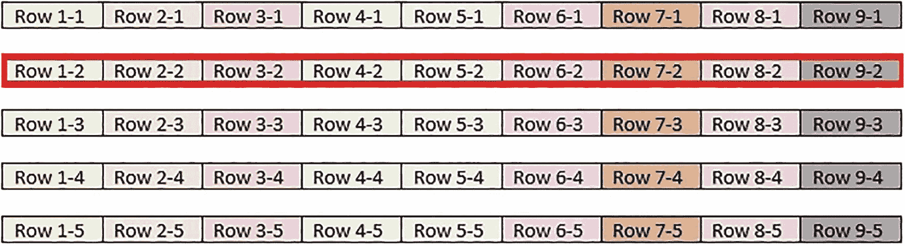

# SQL Server 中的列存储索引技术

## 行存储索引下的查询性能分析

现在考虑一个更大的表，它有 5000 万行，使用聚集行存储索引存储在 250,000 个页面上。图 3-2 中演示的事务性查询仍然只会读取连续存储的 5 行，因此可以忽略剩余的 249,995 行及其存储的页面。可能会额外读取与这五行存储在同一页上的数据，但由此增加的负担以千字节衡量，相对微不足道。

图 3-3 中展示的分析查询仅聚合单个列，但跨越了多行。如果请求的订单数据占表的四分之一，那么在事务性表中处理此查询将迫使 `SQL Server` 读取表中大约四分之一的页面，因为第二列的值分散在表中每行的各个位置。无论使用何种过滤器来减少查询所需的行数，过滤器指定范围内的每一页都必须被读取。

随着分析表持续增长，达到数十亿行和/或 `TB` 级（或更多）存储时，读取其大部分数据的能力会变得过于缓慢且资源密集，变得不切实际。需要一种更好的解决方案，允许分析查询在不读取底层其他列数据的情况下读取列数据。

## 介绍列存储索引

解决这个问题的技术在某种程度上已经存在很长时间了。像 `SQL Server Analysis Services` 和 `PowerPivot` 这样的应用程序多年来一直使用列式数据存储格式，但它们的实现对用户是隐藏的。

列存储索引允许数据以最优的分析格式存储在表中，提供了许多有价值的优点，例如：

*   可扩展至任意表大小
*   将查询速度提高 `10–100` 倍
*   卓越的压缩率，节省存储和内存
*   `SQL Server` 原生支持
*   可利用批量加载实现快速写入速度

虽然这听起来像推销辞令，但这里没有任何夸张。将存储在经典行存储聚集索引中的大型分析数据集与列存储索引表进行比较，在存储和性能方面存在巨大差异，这将在本书的后续部分进行演示和量化。

请注意，本书中所有关于列存储索引的演示均在 `SQL Server 2019` 上测试。使用早期版本的读者在实施本书中的任何建议前应进行充分测试，因为可用的功能可能有所不同。

图 3-4 说明了图 3-1 中的同一个表，在列存储索引中如何存储数据。



图 3-4
聚集列存储索引中的数据存储示意图

注意关键区别：数据是按列而不是按行排序的。第一列的所有值存储在一个单独的结构中，而其他每个列则存储在自己的页面集中。在图 3-3 所示的行存储表中，聚合了单个列，但必须读取每一页才能返回那一列的数据。

图 3-5 展示了针对分析列存储索引表的相同查询。



图 3-5
针对列存储索引聚合单个列

因为数据在物理上按列分组，不再需要读取整个表来返回单个聚合列。其他四列可以被忽略。这极大地减少了对存储系统的读取，并降低了内存使用量，因为需要读入内存的页面更少。对于插入此表中的每个新行，只需要读取第二列的一个额外值。

这种数据结构的一个显著优点是压缩变得更有效。单个列的一组值往往包含更多重复值，更容易压缩，而来自不同列的值重叠并良好压缩的可能性较低。更好的压缩意味着页面上可以容纳更多数据，从而进一步节省存储和内存。

关于列存储索引的一个重要澄清是，它们并非“只是另一个索引”。它们不能与非聚集行存储索引、`XML` 索引、空间索引、内存优化索引或 `SQL Server` 中包含的其他索引类型相提并论。它们构成了一种独特的架构，提供的益处远超典型索引所能提供的。

请注意，在本书中，除非另有说明，所有演示和讨论都将引用聚集列存储索引。第 11 章将更详细地探讨非聚集列存储索引。

## SQL Server 中列存储索引的优势

列存储索引成为存储大型分析数据的理想解决方案有很多原因。它们跨越了从成本到便利性再到速度的多个领域，并说明了一个看似简单的功能如何能以较低的实现时间和资源成本提供卓越的价值。这不是列存储索引优点的完整列表，但突出了使其在分析数据应用中具有吸引力的性能和效率关键点。本书的其余部分将更详细地探讨列存储索引的优势和最佳用例。


## SQL Server 中的原生分析型数据

`列存储索引`最大的优势之一在于，它们直接将分析型数据存储在`SQL Server`中，无需额外的许可费用或配置更改。同样，开始测试或实施`列存储索引`也无需进行任何硬件或软件更改。

一个包含分析型数据的`行存储`表可以被转换为使用`列存储索引`，整个过程可在同一个`SQL Server`数据库实例上完成，甚至可以实现就地索引替换。这为准备就绪时的轻松测试、验证和实施提供了可能。

由于`列存储索引`是`SQL Server`中分析型数据存储的核心功能，它会随着每个新版本而更新。每次更新都会带来新的功能，使得读写`列存储索引`能够变得更快、更高效。微软的以下文档详细概述了自`列存储索引`诞生以来，各版本`SQL Server`中可用的功能：

[`docs.microsoft.com/en-us/sql/relational-databases/indexes/columnstore-indexes-what-s-new`](https://docs.microsoft.com/en-us/sql/relational-databases/indexes/columnstore-indexes-what-s-new)

这份清单相当详尽，展示了`列存储索引`如何从一个不够灵活的、只读的结构，演变成一个功能丰富、充满优化的特性。

将数据原生存储在`SQL Server`中意味着无需第三方产品、无需昂贵的迁移，也无需配置新的硬件和软件。实施它们所需的时间更多地取决于典型的开发和质量保证需求，而非技术限制。在为分析型数据的存储和维护制定项目计划时，考虑到这些资源成本有助于做出准确、基于事实的决策。以下是对这些考虑因素的总结：

*   是否需要采购/许可新硬件以支持分析型数据
*   分析软件及任何配套软件的许可费用
*   计算资源的成本，无论是在本地还是在云端
*   设计、开发、测试和实施分析型数据解决方案所需的时间
*   培训人员如何使用新解决方案所需的资源

量化这些因素中的每一项，都有助于比较和对比不同的解决方案，并且通常会对已经使用`SQL Server`进行事务数据存储的组织产生有利的结果。

## 可扩展性

鉴于分析型数据可能快速增长，任何用于存储它的数据结构都必须能够高效地处理`OLAP`工作负载，即使数据深度或宽度随着时间推移意外地快速增加。

分析型数据存储解决方案的可扩展性具有许多重要优势，包括：

*   即使在数据快速增长时期，也能确保高性能
*   避免向新技术进行代价高昂的迁移
*   避免对报告/分析服务造成干扰
*   减少维护和停机时间
*   减少对硬件升级的需求

一个`OLAP`解决方案要有效，它需要在处理一千行、一百万行、十亿行甚至更多数据时都保持快速和高效。如果一个系统注定在规模变大时变得低效，那么它也注定会失败。

分析型数据的增长是一个值得衡量并定期重新审视的指标，以便充分了解其长期的资源需求。`OLAP`数据很少会变小，其增长率也很少会下降。这种增长最终与任何给定组织的两个衡量指标相关：

*   增长
*   复杂性

随着组织的发展和客户群的扩大，这些客户将产生更多的数据。同样，组织的发展几乎总是导致技术和非技术流程变得更加复杂。这种复杂性可能表现为软件功能的增加、需要跟踪的流程增多，或者要求随时间推移维护和处理更多类型的数据。

数据增长速率可总结如下：

`1.00 * N * G * C`

在这个表示式中，字母代表以下含义：

*   **N = 自然增长：** 这是当前发生的自然数据增长。如果其他条件不变，且没有外部因素调整数据增长率，那么这将是预测未来数据增长所需的唯一因素。这可以按单位时间的行数来衡量，也可以按平均字节数每行乘以单位时间行数的物理数据大小增加来衡量。
*   **G = 数据增长：** 自然增长提供了随时间添加到表或数据库中的数据量基线。然而，这种增长很少是线性的。新客户、采样频率的增加以及其他因素将导致超出当前基线的额外增长。这也可以按单位时间的行数或单位时间的物理数据使用量来衡量。
*   **C = 复杂性增加：** 这包括向表中添加更多列，以及创建和填充新表。这也增加了需要（通过更多实体）从事务系统流入目标分析系统的数据量。这具有挑战性，但可以作为随时间新增度量指标数量的度量来估算。也就是说，平均而言，单位时间有多少新度量指标将被添加到分析数据源中。一旦知道了新度量指标的数据类型，就可以近似估算其存储单位。

这里定义的每个因素在性质上是线性的，但实际上可能不是线性的。因此，在预测未来数据大小时，应定期重新审视它们，以确保考虑到增长中意外的变化。只要这些近似值能根据当前和未来趋势保持更新，就可以使用单位时间的线性近似来近似非线性增长。

为了提供前述公式的示例，考虑一个分析表，它包含 1 亿行数据，当前每天增长 25 万行，预计其增长将每年额外加速 25%，但在可预见的未来不会增加任何新维度。1 年后的预计行数将由下式给出：

```
1.00 * N * G * C * 行数 = 1.00 * 1.9125 * 1.25 * 1.00 * 100,000,000 = 239,062,500 行（未来一年）
```

```
1.00 * N * G * C * 行数 = 1.00 * 1.9125 * 1.25 * 1.00 * 239,062,500 = 571,508,789 行（第二年）
```

```
1.00 * N * G * C * 行数 = 1.00 * 1.9125 * 1.25 * 1.00 * 571,508,789 = 1,366,263,198 行（第三年）
```

注意这种增长加速让数据膨胀得有多快——从 1 亿行在 3 年内增长到超过 13 亿行！`1.9125`是通过将每天`250,000`行乘以每年`365`天计算得出的年增长因子。

总而言之，任何管理分析型数据的技术都需要能够在典型数据增长可能导致数据规模以超出常规认知的速度膨胀的情况下，实现高效的数据访问。`列存储索引`的架构将在第 4 章详细讨论，并将为解释为何它们能为快速增长的数据实现如此有效的扩展奠定基础。


## 卓越的压缩能力

任何分析型数据存储都需要充分利用压缩技术，以使其数据尽可能紧凑。列存储索引采用多种压缩算法，实现了令人印象深刻的高压缩比。这可以使数据量缩减到未压缩表的 1/10 至 1/100。

按列而非按行压缩数据，其效率天生更高，原因如下：

*   单列包含相同数据类型的值，增加了值重复的可能性。
*   维度通常包含大量重复值，因此压缩效果会格外出色。
*   数据通常是按时间顺序顺序创建的。时间上相邻的行往往包含更相似的数据，因此压缩效果优于时间上相隔较远的行。

第 5 章将深入探讨列存储索引压缩的更多细节，并展示这些压缩算法的有效性及其对优化分析查询性能至关重要。

## 更快的分析读取

列存储索引的首要设计目标是提供高性能的分析查询速度。无论是从结构化存储过程和代码中访问数据，还是进行即席分析和可视化，紧凑且分段的列存储索引结构都能快速高效地返回所需数据。即使在扫描大量行时，这一点也依然成立。

## 更快的数据加载

当数据以每次数百万行的规模写入时，就需要存在允许数据尽快写入的流程。针对事务数据优化的、完全记录日志的流程，对于这种规模的数据将无法提供足够的性能。

列存储索引可以充分利用 SQL Server 的批量加载 API，其写入速度远超 SQL Server 及许多其他产品中可用的其他流程。数据加载可以执行得更快，从而提高 OLAP 的可用性，并让新数据更快地呈现。此外，数据加载对系统资源（如事务日志）和备份的影响被降至最低，确保大量数据可以在短时间内写入，而不会产生在完全记录日志的 OLTP 表上执行此类操作所带来的问题。

第 8 章将全面探讨数据如何写入列存储索引，包括性能度量、资源消耗细节以及尽可能高效加载数据的最佳实践。

分析型数据需要一个多功能、可扩展且高性能的解决方案。列存储索引提供了一种理想的数据结构来创建和分析分析型数据，并能轻松管理随时间增长的数据量。

本书的剩余部分将极其详尽地讨论列存储索引，提供架构细节、演示、最佳实践以及可改进其使用的工具。

