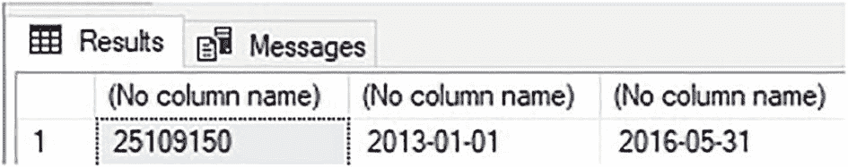
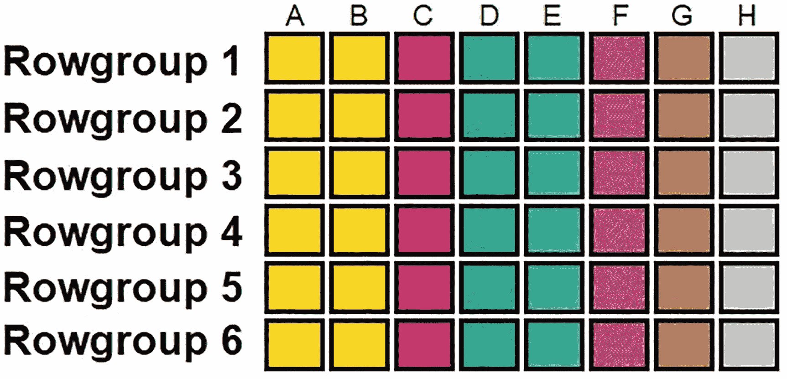
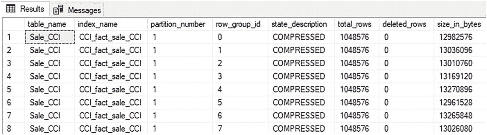
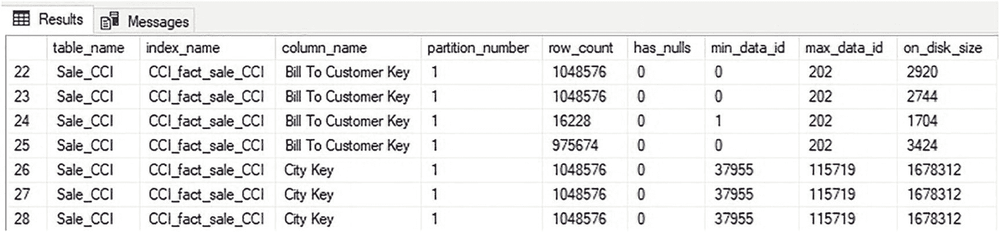
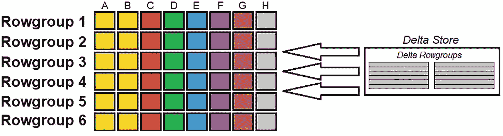
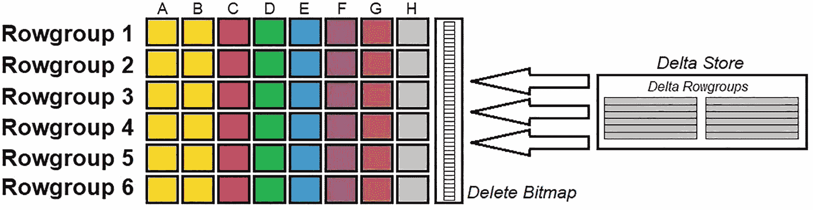
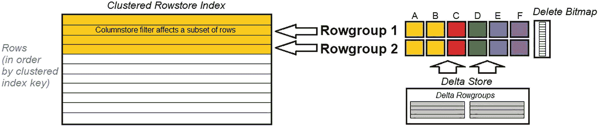

# 4. 列存储索引架构

为了最优地使用列存储索引，扎实理解其架构是必要的。最佳实践、查询模式、维护和故障排除都基于列存储索引的内部结构。本章将重点介绍这些架构组件，为本书的其余部分奠定基础。

## 示例数据

为演示本书中介绍的主题，将基于 `WideWorldImportersDW` 数据库中的 `Fact.Sale` 表创建一个示例数据集。

可以使用 `代码清单 4-1` 中的查询来生成该数据集。

```sql
SELECT
    Sale.[Sale Key], Sale.[City Key], Sale.[Customer Key], Sale.[Bill To Customer Key], Sale.[Stock Item Key], Sale.[Invoice Date Key],
    Sale.[Delivery Date Key], Sale.[Salesperson Key], Sale.[WWI Invoice ID], Sale.Description, Sale.Package, Sale.Quantity, Sale.[Unit Price], Sale.[Tax Rate],
    Sale.[Total Excluding Tax], Sale.[Tax Amount], Sale.Profit, Sale.[Total Including Tax], Sale.[Total Dry Items],
    Sale.[Total Chiller Items], Sale.[Lineage Key]
FROM Fact.Sale
CROSS JOIN
    Dimension.City
WHERE City.[City Key] >= 1 AND City.[City Key] <= 110;
```
`代码清单 4-1` 用于生成列存储索引测试数据集的查询

这生成了 25,109,150 行数据，涵盖的发票日期范围从 2013/1/1 到 2016/5/31。虽然这些数据并非海量，但其规模足以进行合适的演示，且对希望在家复现的用户来说也不会显得笨重。该数据集将在后续章节中复用，被放入多个测试表中，以说明与列存储索引、OLAP 性能和数据库架构相关的各种主题。

在本章中，数据将被加载到一个没有任何索引的表中，并在最后添加一个列存储索引，如 `代码清单 4-2` 所示。

```sql
CREATE TABLE Fact.Sale_CCI
(
    [Sale Key] [bigint] NOT NULL,
    [City Key] [int] NOT NULL,
    [Customer Key] [int] NOT NULL,
    [Bill To Customer Key] [int] NOT NULL,
    [Stock Item Key] [int] NOT NULL,
    [Invoice Date Key] [date] NOT NULL,
    [Delivery Date Key] [date] NULL,
    [Salesperson Key] [int] NOT NULL,
    [WWI Invoice ID] [int] NOT NULL,
    [Description] nvarchar NOT NULL,
    [Package] nvarchar NOT NULL,
    [Quantity] [int] NOT NULL,
    [Unit Price] decimal NOT NULL,
    [Tax Rate] decimal NOT NULL,
    [Total Excluding Tax] decimal NOT NULL,
    [Tax Amount] decimal NOT NULL,
    [Profit] decimal NOT NULL,
    [Total Including Tax] decimal NOT NULL,
    [Total Dry Items] [int] NOT NULL,
    [Total Chiller Items] [int] NOT NULL,
    [Lineage Key] [int] NOT NULL
);

INSERT INTO Fact.Sale_CCI
(
    [Sale Key], [City Key], [Customer Key], [Bill To Customer Key], [Stock Item Key], [Invoice Date Key], [Delivery Date Key],
    [Salesperson Key], [WWI Invoice ID], Description, Package, Quantity, [Unit Price], [Tax Rate], [Total Excluding Tax], [Tax Amount],
    Profit, [Total Including Tax], [Total Dry Items], [Total Chiller Items], [Lineage Key]
)
SELECT
    Sale.[Sale Key], Sale.[City Key], Sale.[Customer Key], Sale.[Bill To Customer Key], Sale.[Stock Item Key], Sale.[Invoice Date Key],
    Sale.[Delivery Date Key], Sale.[Salesperson Key], Sale.[WWI Invoice ID], Sale.Description, Sale.Package, Sale.Quantity, Sale.[Unit Price], Sale.[Tax Rate],
    Sale.[Total Excluding Tax], Sale.[Tax Amount], Sale.Profit, Sale.[Total Including Tax], Sale.[Total Dry Items],
    Sale.[Total Chiller Items], Sale.[Lineage Key]
FROM fact.Sale
CROSS JOIN
    Dimension.City
WHERE City.[City Key] >= 1 AND City.[City Key] <= 110;

-- 在表上创建列存储索引。
CREATE CLUSTERED COLUMNSTORE INDEX CCI_fact_sale_CCI ON fact.Sale_CCI;
```
`代码清单 4-2` 创建并填充列存储索引测试表的脚本

可以通过一个简单的查询来确认此数据的规模和形态：

```sql
SELECT
    COUNT(*),
    MIN([Invoice Date Key]),
    MAX([Invoice Date Key])
FROM fact.Sale_CCI;
```

结果如 `图 4-1` 所示。


`图 4-1` 显示测试数据集规模和日期范围的查询结果


## 行组与段

分析数据无法存储在一个大型的连续结构中。虽然每列数据被单独压缩存储，但这些列内部的数据需要分组并分别进行压缩。每个被压缩的单元就是读入内存的对象。如果该单元过小，那么大量压缩结构的存储和管理将非常昂贵，且压缩效果较差。反之，如果每个单元包含的行数过多，那么为满足查询而需要读入内存的数据量也会变得过大。

列存储索引将行分组为 `2²⁰` (`1,048,576`) 行的单元，称为 `行组`。该行组内的每列被单独压缩成列存储索引的基本单元，称为 `段`。这种结构可以用图 4-2 中的表示来可视化。



图 4-2
列存储索引中的行组与段

请注意，列存储索引并非像聚集和非聚集行存储索引那样基于二叉树结构构建。相反，每个行组包含一组压缩段，表中的每列对应一个段。图 4-2 中的示例是一个有八列、最多 `6*2²⁰` 行的表，总共包含 48 个段（每个行组、每列一个段）。行存储和列存储索引之间唯一共享的重要架构约定是它们都使用 `8KB` 页来存储数据。

行组是在列存储索引中创建数据时自动创建和管理的。行组数量没有上限，索引内的段数也没有限制。因为一个行组最多包含 `2²⁰` 行，所以一个表应有远多于该数量的行才能最佳地利用列存储索引。如果一个表只有 `500k` 行，那么它很可能全部存储在单个行组中。因此，任何需要该表数据的查询都必须读取包含该表所有行数据的段。为了使表能有效利用列存储索引，它应该至少有 `500 万` 或 `1000 万` 行，以便能被拆分成多个独立的行组，这样每次查询时就不需要读取所有行组。

可以使用动态管理视图 `sys.column_store_row_groups` 查看列存储索引中的行组。代码清单 4-3 中的查询返回了本章前面创建的列存储索引的行组元数据。

```
SELECT
tables.name AS table_name,
indexes.name AS index_name,
column_store_row_groups.partition_number,
column_store_row_groups.row_group_id,
column_store_row_groups.state_description,
column_store_row_groups.total_rows,
column_store_row_groups.deleted_rows,
column_store_row_groups.size_in_bytes
FROM sys.column_store_row_groups
INNER JOIN sys.indexes
ON indexes.index_id = column_store_row_groups.index_id
AND indexes.object_id = column_store_row_groups.object_id
INNER JOIN sys.tables
ON tables.object_id = indexes.object_id
WHERE tables.name = 'Sale_CCI'
ORDER BY tables.object_id, indexes.index_id, column_store_row_groups.row_group_id;
```

代码清单 4-3
返回列存储索引基本行组元数据的脚本

该查询的结果可以在图 4-3 中找到。



图 4-3
fact.Sale_CCI 的行组元数据

通过连接其他系统视图，如 `sys.indexes` 和 `sys.tables`，可以返回关于列存储索引所在表的附加信息。`sys.column_store_row_groups` 包含一些额外的相关列，例如行组的压缩状态、行数及其大小。请注意，图 4-3 中选择的八个行组都包含了行组允许的最大行数 `2²⁰`。

使用行组元数据可以让用户快速度量列存储索引的大小，并对其结构有一个基本的了解。

在每个行组内，是表中每列对应的段。同样存在一个提供压缩段详细信息的动态管理视图：`sys.column_store_segments`。代码清单 4-4 提供了一个从该视图返回信息的查询，包括连接回每个段所属的父表和列。

```
SELECT
tables.name AS table_name,
indexes.name AS index_name,
columns.name AS column_name,
partitions.partition_number,
column_store_segments.row_count,
column_store_segments.has_nulls,
column_store_segments.min_data_id,
column_store_segments.max_data_id,
column_store_segments.on_disk_size
FROM sys.column_store_segments
INNER JOIN sys.partitions
ON column_store_segments.hobt_id = partitions.hobt_id
INNER JOIN sys.indexes
ON indexes.index_id = partitions.index_id
AND indexes.object_id = partitions.object_id
INNER JOIN sys.tables
ON tables.object_id = indexes.object_id
INNER JOIN sys.columns
ON tables.object_id = columns.object_id
AND column_store_segments.column_id = columns.column_id
WHERE tables.name = 'Sale_CCI'
ORDER BY columns.name, column_store_segments.segment_id;
```

代码清单 4-4
返回列存储索引基本段元数据的脚本

图 4-4 包含了部分结果示例。



图 4-4
fact.Sale_CCI 的段元数据

查询返回的行数等于索引中的段总数，这也等于行组数量乘以表中的列数。除了每个段包含的行数及其在磁盘上的大小外，还提供了有关该段是否包含 `NULL` 值的详细信息，以及 `min_data_id`/`max_data_id`，它们提供了对段内包含值的字典查找。关于字典及其工作原理的详细信息将在第 5 章讨论压缩时提供。


## 增量存储

将数据写入高度压缩的分段是一个资源密集型的过程。解压一组分段、向其中写入额外数据、重新压缩以及更新元数据所需的资源并非微不足道。向一个行组写入一百万行所需的工作量，包括了解压、写入和重新压缩该行组中所有分段的工作。而将一百万行数据逐行写入该行组所需的工作量，相当于将上述过程执行一百万次。

因此，频繁写入少量行的进程需要一种方法来管理这些写入操作，以免列存储索引消耗服务器的所有资源用于解压、写入和重新创建分段。**增量存储**是一组聚集行存储索引，用于在列存储索引旁边临时存储小型写入。每个增量行组就是这些聚集索引之一。更改会累积在增量存储中，直到其行数达到阈值（每个增量行组 `2²⁰` 行），然后一次性推入列存储索引。

增量存储由 SQL Server 自动维护。一个名为 **元组移动器** 的异步后台进程管理从增量存储到列存储索引的数据移动。虽然操作员可以运行维护脚本来影响增量存储的行为，但对于使用列存储索引来说，这样做并非必需。有关列存储维护的更多信息，请参见第 14 章。

当针对列存储索引执行查询时，增量存储的内容会与所需的压缩分段一起被读取。虽然增量存储由经典的行存储索引组成，但其大小通常比列存储索引的压缩部分小得多；因此，读取它通常不会对性能产生不利影响。增量存储的好处在于，它大大减少了向列存储索引写入较小批次数据所需的计算资源，并确保频繁的小型写入在数据加载、维护或软件发布过程中不会成为不可扩展的瓶颈。

数据的基本流如图 4-5 所示。



图 4-5

数据从增量存储流入列存储索引

请注意，增量存储并非用于管理针对列存储索引的所有 `INSERT` 操作。第 8 章详细讨论了批量加载进程如何用于大大加速较大的 `INSERT` 操作。

## 删除位图

从列存储索引中删除数据所带来的挑战，与增量存储为插入操作解决的挑战类似。删除单行数据将需要对每列的压缩分段进行解压、修改和重新压缩。这本质上是昂贵的，当受影响的行组数量增加时，成本会变得高到令人望而却步。

SQL Server 需要能够快速地从列存储索引中删除数据，并且不会对服务器性能产生长期的负面影响。为了实现这一点，当执行 `DELETE` 语句时，数据不会从列存储索引中物理删除。相反，受影响行的删除状态会被写入一个称为 **删除位图** 的结构中。

每个分区在列存储索引中只能存在一个删除位图，其目的是跟踪哪些行已被删除（如果有的话）。当从列存储索引中删除行时，会更新删除位图以指示删除操作。列存储索引中的相应行不会以任何方式被修改。这种软删除允许 `DELETE` 操作快速执行，并且不会对数据加载或维护过程造成负担。

当查询从列存储索引中读取数据时，删除位图的内容也会被读取，任何被标记为已删除的行都将从结果中省略。删除位图也是一个聚集行存储索引，与列存储索引并排存在。拥有删除位图的最大好处是，`DELETE` 操作可以执行得异常快速，因为无需对索引中的分段进行解压、更新和重新压缩。缺点是已删除的行仍然占用索引中的空间，并且不会立即被移除。随着时间的推移，已删除行所占用的空间可能变得不容忽视，此时可以定期使用索引维护（在第 14 章中讨论）来回收这些空间。

图 4-6 将删除位图添加到了列存储索引的架构图中。



图 4-6

将删除位图添加到列存储索引架构中

删除位图和增量存储都是列存储索引的组成部分，它们仅在需要时才存在。如果不存在已删除的行，则不会有删除位图覆盖在压缩的行组上。类似地，当针对列存储索引执行查询时，空的增量存储也不需要被检查。这些组件在必要时存在，否则在不需要时不会对性能产生影响。

## 非聚集列存储索引架构

非聚集列存储索引的架构与聚集索引非常相似。非聚集列存储索引不是表的主要存储机制，而是与聚集行存储索引并存的一个额外索引结构。

一个重要的区别是，可以在非聚集列存储索引上指定列列表，从而允许进行更有针对性的优化项目。此外，可以将筛选器应用于非聚集列存储索引，从而根据数据是**热数据**、**温数据**还是**冷数据**来定位数据，从而减小索引大小和写入索引的成本。

请注意以下关于热/温/冷数据用法的简要定义：

*   **热数据：** 实时且被系统积极使用，具有定期的读写和高并发性。期望可用性高，延迟应非常低。
*   **温数据：** 代表使用频率较低的数据。仍然期望高可用性，但在检索时可以容忍更高的延迟。
*   **冷数据：** 代表不经常访问的旧数据、归档数据或为保留而维护的数据。冷数据的可用性更灵活，高延迟是可容忍的。冷数据的并发性非常低。

组织会将数据标记为从热到冷的范围，具体细节会根据其数据的使用方式而有所不同。图 4-7 显示了聚集行存储索引与筛选后的非聚集列存储索引之间的交互。



图 4-7

带有筛选非聚集列存储索引的聚集行存储索引

请注意，非聚集列存储索引的目的是为事务表提供实时分析功能，这需要在实施前仔细考虑。第 12 章将深入探讨非聚集列存储索引的更多细节，包括选项、演示和最佳用例。

