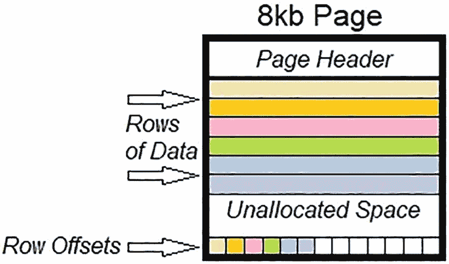
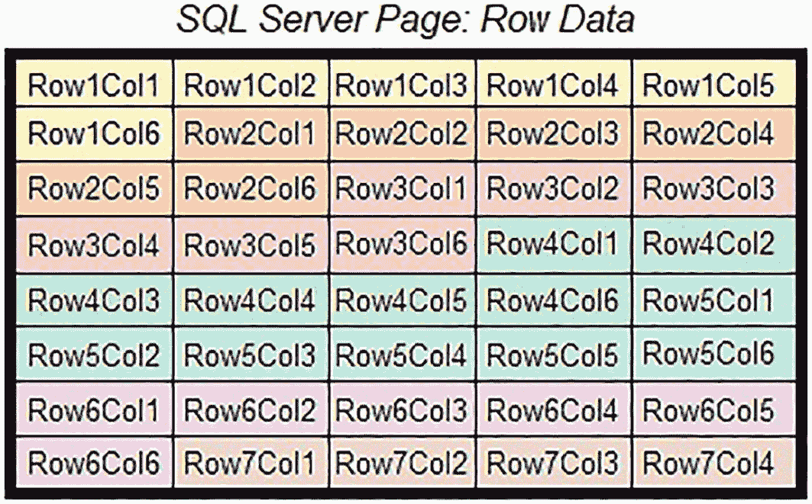
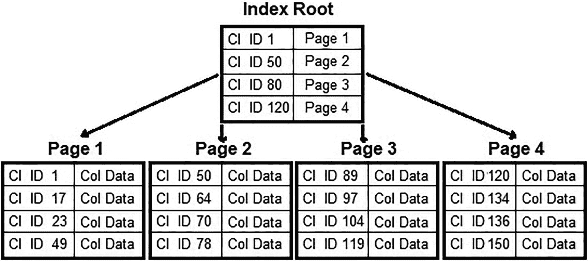
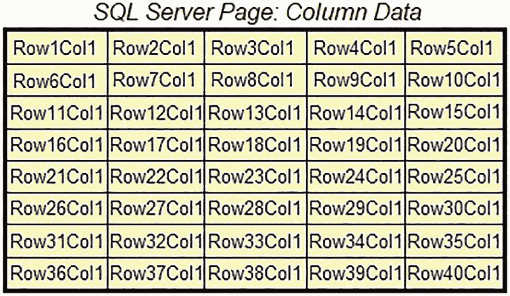

# 页面上的物理数据

到目前为止，关于架构的讨论都是在逻辑层面进行的。也就是说，`行组`、`段`、`增量存储`和`删除位图`都被呈现为数据列的通用容器。列存储索引在页面上的物理存储有助于我们充分理解它们如何高效地为分析查询提供服务。

SQL Server 中所有未存储在内存优化结构中的数据都存储在 `8` KB 的 `页面` 上。这些页面驻留在物理存储上，并在需要时按原样读入内存。如果页面被压缩，它将保持压缩状态，直到需要其数据时。无论页面位于 `行存储` 还是 `列存储索引` 中，它都以相同的方式读入内存。`删除位图`和`增量存储`也维护在页面上，并根据需要读入内存。

图 4-8 展示了 SQL Server 中页面的基本结构。页面的主要组成部分是：

图 4-8
SQL Server 中页面的结构

*   `页面头部`
*   `数据`
*   `行偏移量`

`页面头部`包含有关页面的基本信息，例如拥有它的对象、存储在其中的数据类型，以及可用于写入更多数据的未分配空间量。

`数据行`是存储在页面上的实际数据。这可能是表中的物理数据（聚集索引或堆）、索引条目，或在各种情况下可用的各种其他内容。对于本次关于列存储和行存储索引的讨论，数据和索引数据是当前唯一需要关注的内容。

`行偏移量`存储每一行的起始位置，允许 SQL Server 在页面读入内存后定位任何给定行的数据。

当数据以行存储表上的聚集索引形式存储时，数据按行逐行写入页面。也就是说，对于每一行，每个列依次顺序写入页面，如图 4-9 所示。

图 4-9
SQL Server 中行存储数据在页面上的存储

此表有六列，它们按顺序为每一行依次写入。SQL Server 会继续将此表的行顺序写入同一页面，直到空间用尽，此时将为该表分配一个新页面，数据将在那里继续写入。

此结构针对读取或写入由一组连续行组成的小范围查找进行了优化。例如，返回第 2 行到第 5 行中部分（或全部）列的查询，只需要读取图 4-9 中所示的单个页面。如果需要其他页面上的额外行，那么这些页面也将被读入内存以满足查询。

`聚集`或`非聚集行存储索引`将其二叉树结构作为一系列指针写入页面。首先写入根级别，然后是中间级别，这些中间级别最终指向索引叶级别的底层数据。索引的每一级都包含聚集索引键，这些键用于组织和链接索引的各个级别。此结构也针对查找单个或小的连续行范围进行了优化。对于此类查询，需要读取的索引中间级别较少，从而减少了满足查询所需的页面数量。图 4-10 展示了一个聚集行存储（二叉树）索引的可视化表示。

图 4-10
聚集行存储索引的结构

因为这是聚集索引，所以叶级包含聚集索引所引用的每一行的列数据。在`非聚集索引`中，索引的最低级别将包含指向目标数据的指针，用于键查找。类似地，`非聚集索引`的叶级也会包含在该索引上定义的任何包含列。

需要读取聚集索引 ID 值在 `25` 和 `75` 之间的查询，可以通过读取索引根页，然后读取页面 `1` 和 `2` 来完成。仅读取聚集索引 ID 值 `136` 的查询将读取索引根页和页面 `4`。

在列存储索引中，没有二叉树结构。`聚集列存储索引`作为一系列压缩段写入，占用支持它们所需的任意多页面。图 4-11 说明了列存储索引的单个页面的外观。

图 4-11
SQL Server 中列存储数据在页面上的存储

请注意，这些数据是压缩段的一个子集，包含同一列的连续值。这个序列会持续到`行组`结束，此时将开始一个新段；或者如果它是最后一个行组，则将开始下一列。

聚合 `1` 列前 `40` 行值的查询可以非常高效地检索数据，只需读取这个单个页面。在相同表的行存储索引中，则有必要扫描这 `40` 行中所有列的数据，并将这些页面读入内存。对于一个有 `20` 列的表，这将需要 `20` 倍的工作量。

## 差异总结

理解行存储索引和列存储索引架构之间差异的关键在于考虑数据的逻辑存储与物理存储。

行存储索引按行然后按列的顺序物理存储数据。数据在逻辑上可按行排序访问。因此，此架构针对查找序列或有限行子集的查询进行了优化。二叉树索引提供了一种基于聚集索引未对数据排序的其他列来快速搜索该数据的方法。

列存储索引按列物理分组存储数据，但按行排序。此约定允许通过过滤器限制返回的行数，并通过列分组减少需要读取的页面，因为查询所需的列数减少。这使得查询可以读取显著更多的行，但在列列表受限时仍能保持出色的性能。第 10 章探讨了如何控制列存储索引内的数据顺序，以增加一个额外的过滤维度，从而能够对数据进行水平和垂直切片。

