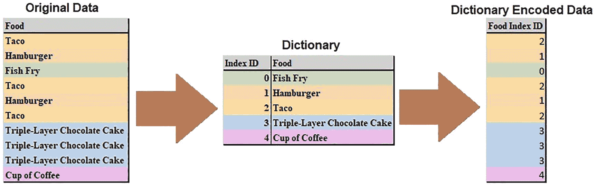
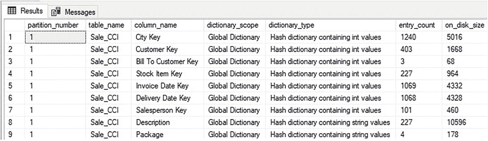
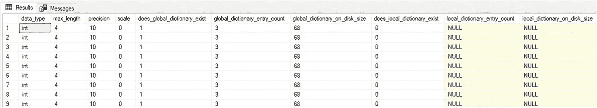
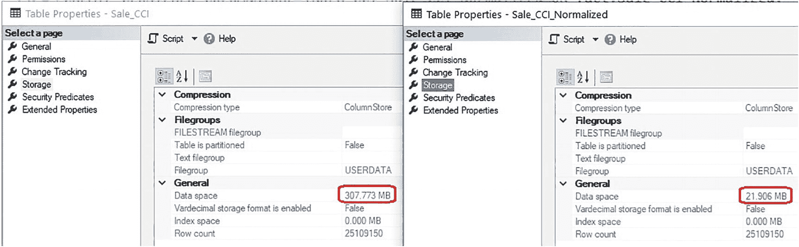
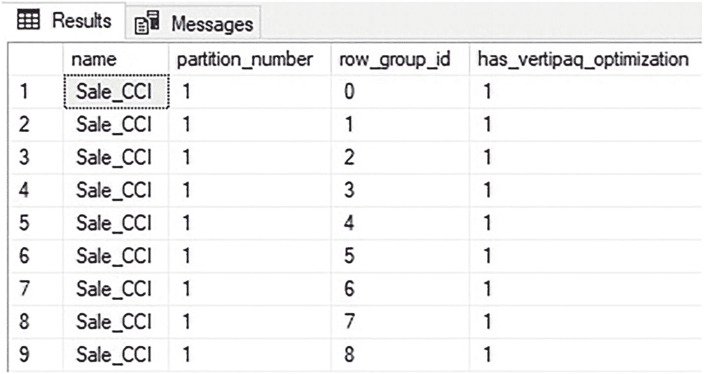

# 5. 列存储压缩

有许多特性使得列存储索引在分析工作负载中表现异常出色。在这些特性中，压缩是性能和资源消耗方面最重要的驱动因素。理解 SQL Server 如何在列存储索引中实现压缩，以及如何使用不同的算法来缩减这些数据的大小，有助于在 SQL Server 中优化分析数据存储的架构和实现。


## 列存储压缩基础

写入列存储索引中段的数据在存储前会经过高强度压缩。增量存储有助于缓冲传入列存储索引的写入操作，确保写入段的频率不会高到对服务器性能产生负面影响。

即使没有任何额外的优化，按列而非按行存储的数据在压缩时也会非常高效。这是因为给定列中的值通常会频繁重复，因此比重复较少的数据更容易压缩。典型的分析表会包含许多行，但通常包含重复的列，例如：

*   实体类型
*   金额
*   日期
*   计数
*   重复的维度

考虑图 5-1 中所示的三列。


图 5-1

代表性数据集中重复值示例

图中表示了十一行数据，其中每列都包含重复值。*日期*列仅包含三个不同的值，而*状态*列包含四个，*小时*列包含六个。这种重复性往往能很好地扩展。如果这是来自包含一百万行的行组的数据，那么可以合理地预期像*状态*这样的列只会包含少量在整个数据集中频繁重复的值。数据的重复性越高，其压缩效果就越好。

正如预期的那样，单个列中的值之间比不同列之间的值存在更多的重复。这主要基于两个原因：

*   不同的数据类型将具有截然不同的值。例如，字符串列的内容不容易与金额列的内容进行比较。
*   代表不同维度的列将具有与其典型用途相对应的不同值范围。例如，包含新车税率的小数列所包含的常见值集合，将与包含这些汽车成本的小数列非常不同。

列存储索引完美契合这些约定，而行存储索引则力不从心，因为行压缩和页压缩被迫考虑行或页中的所有列，这将包含各种数据类型和维度。

请注意，增量存储不进行列存储压缩。此数据结构需要在运行时尽可能快速地写入，因此放弃昂贵的压缩省去了处理对其写入所需的时间和开销。这意味着增量存储将比使用列存储压缩时占用更多空间。由于增量存储与压缩后的列存储索引内容相比往往较小，并且包含可预测的行数，因此维护它所需的开销是恒定的，不会随时间增长。根据 SQL Server 版本的不同，增量行组可能会使用行压缩或页压缩来限制其存储和内存占用。

## 列存储压缩算法

列存储索引不会在段中重复存储字符串、小数或日期。相反，SQL Server 利用字典编码和值编码来缩减和压缩数据，即使原始值很大。

压缩过程可总结为以下顺序步骤：

1.  压缩前对所有值进行编码。
2.  计算最佳行顺序（又称 Vertipaq 优化）。
3.  独立压缩每个段。

编码是压缩过程中的重要步骤。以下细节解释了不同的编码算法、它们的使用方式以及它们对整体压缩效果的影响。

### 值编码

此过程旨在通过调整数字列的存储方式以使用更小尺寸的对象来减少其占用空间。对于整数数据（包括 TINYINT、SMALLINT、INT 和 BIGINT），值通过各种数学变换进行压缩，这些变换可以将所有值除以一个公约数或减去一个公共减数。考虑一个 4 字节整数数据类型的列，其包含表 5-1 中所示的值。

表 5-1

待压缩的示例整数列数据

| 值 | 最小位数（位） |
| --- | --- |
| **60** | **6** |
| **150** | **8** |
| **90** | **7** |
| **9000** | **13** |
| **630** | **10** |
| **300000** | **19** |

列存储压缩试图寻找公约数，并立即注意到每个数字都可被 10 整除。在此示例中，基数是 10，每个值将使用其可被整除的该基数的最大公共负指数来引用，如表 5-2 所示。

表 5-2

使用负指数压缩的整数数据

| 值 | 值 *10^(-1) | 最小位数（位） |
| --- | --- | --- |
| **60** | **6** | **3** |
| **150** | **15** | **4** |
| **90** | **9** | **4** |
| **9000** | **900** | **10** |
| **630** | **63** | **6** |
| **300000** | **30000** | **15** |

下一个压缩步骤是将列表中的最小值作为基数，将其归零，并通过从其他值中减去该基数来引用它们，如表 5-3 所示。

表 5-3

通过重新设定基数压缩的整数数据

| 值 | 值 *10^(-1) | 值 *10^(-1) - 6 | 最小位数（位） |
| --- | --- | --- | --- |
| **60** | **6** | **0** | **0** |
| **150** | **15** | **9** | **4** |
| **90** | **9** | **3** | **2** |
| **9000** | **900** | **894** | **10** |
| **630** | **63** | **57** | **6** |
| **300000** | **30000** | **29994** | **15** |

回顾存储值所需的最小空间，原始大小为 63 位。经过第一次变换后，大小减少到 42 位，经过最后一次变换后，大小减少到 37 位。总体而言，这组值的尺寸缩减了 38%。所见值压缩的程度会根据值集合的不同而变化，并且可能显著更高或更低。例如，一组完全相同的值将压缩成一个归零的引用，如表 5-4 所示。

表 5-4

通过重新设定基数压缩的相同整数数据

| 值 | 值 - 1700000 | 原始位数（位） | 缩减后位数（位） |
| --- | --- | --- | --- |
| **1700000** | **0** | **22** | **0** |
| **1700000** | **0** | **22** | **0** |
| **1700000** | **0** | **22** | **0** |
| **1700000** | **0** | **22** | **0** |
| **1700000** | **0** | **22** | **0** |

虽然这个例子看起来很极端，但在维度表中包含的重复值落入有限范围的情况并不少见。

请注意，列存储索引中实际发生的现实世界数据转换比这更复杂，但确定其细节的过程本质上是相同的。

小数在压缩前会转换为整数，此时它们遵循与整数相同的值编码规则。例如，表 5-5 显示了一组以小数格式存储的税率的压缩过程。

表 5-5

小数的值压缩

| 值 | 值 * 100 | 值 / 5 | 值 / 5 - 70 | 原始位数（位） | 缩减后位数（位） |
| --- | --- | --- | --- | --- | --- |
| **15.2** | **1520** | **304** | **234** | **40** | **8** |
| **8.8** | **880** | **176** | **106** | **40** | **7** |
| **4.3** | **430** | **86** | **16** | **40** | **5** |
| **3.5** | **350** | **70** | **0** | **40** | **0** |
| **6.25** | **625** | **125** | **55** | **40** | **6** |


原始数据以 `DECIMAL(4,2)` 格式存储，每个值消耗 5 字节（40 位）。通过在压缩前转换为整数，应用了多种转换方法，将存储空间从 200 位减少到 26 位。十进制数可能看起来不是最有可能实现高效压缩的候选者，但一旦转换为整数值，它们就可以利用任何可应用于整数的转换方法。

### 字典编码

使用字典编码可以更高效地存储字符串数据。在此算法中，段中的每个不同字符串值被插入到字典中，并使用指向字典的整数指针进行索引。这对于包含重复值的字符串列可以显著节省空间。考虑一个包含 `VARCHAR(50)` 数据类型食物的段，如表 5-6 所示。

#### 表 5-6
包含 `VARCHAR(50)` 字符串数据的示例数据集

| 值 | 原始大小（字节） |
| --- | --- |
| Taco | 4 |
| Hamburger | 9 |
| Fish Fry | 8 |
| Taco | 4 |
| Hamburger | 9 |
| Taco | 4 |
| Triple-Layer Chocolate Cake | 27 |
| Triple-Layer Chocolate Cake | 27 |
| Triple-Layer Chocolate Cake | 27 |
| Cup of Coffee | 13 |

压缩此数据的第一步是创建一个带索引的字典，如表 5-7 所示。

#### 表 5-7
从 `VARCHAR` 数据生成的字典示例

| 索引 ID | `VARCHAR` 值 |
| --- | --- |
| 0 | Fish Fry |
| 1 | Hamburger |
| 2 | Taco |
| 3 | Triple-Layer Chocolate Cake |
| 4 | Cup of Coffee |

由于该段包含五个不同的值，字典的索引 ID 将消耗 3 位。图 5-2 中的映射展示了此数据最终的字典压缩结果。



原始数据存储需要 132 字节，而编码后的数据仅需 30 位（每个值 3 位），外加存储字典中查找值所需的空间。字典本身会为段数据中的每个不同值消耗空间，但作为一个额外好处，一个字典可以被多个行组共享。因此，一个包含 100 个行组的表可以在所有这些行组中为每一列重用字典。

字典压缩的关键在于基数。列中不同值越少，数据压缩效率就越高。具有 5 个不同值的 `CHAR(100)` 列将比具有 1000 个不同值的 `CHAR(10)` 列压缩效果好得多。字典大小可以粗略估计为不同值数量与其初始大小的乘积。较低的基数意味着需要存储在字典中的字符串值更少，并且用于引用字典的索引也会更小。由于字典索引 ID 在表的行中会重复出现，较小的尺寸可以显著提高压缩率。

可以使用视图 `sys.column_store_dictionaries` 查看 SQL Server 中的字典。清单 5-1 中的查询返回有关第 4 章创建的 `fact.Sale_CCI` 表中使用的字典的信息。

```sql
SELECT
    partitions.partition_number,
    objects.name AS table_name,
    columns.name AS column_name,
    CASE
        WHEN column_store_dictionaries.dictionary_id = 0 THEN 'Global Dictionary'
        ELSE 'Local Dictionary'
    END AS dictionary_scope,
    CASE
        WHEN column_store_dictionaries.type = 1 THEN 'Hash dictionary containing int values'
        WHEN column_store_dictionaries.type = 2 THEN 'Not used' -- Included for completeness
        WHEN column_store_dictionaries.type = 3 THEN 'Hash dictionary containing string values'
        WHEN column_store_dictionaries.type = 4 THEN 'Hash dictionary containing float values'
    END AS dictionary_type,
    column_store_dictionaries.entry_count,
    column_store_dictionaries.on_disk_size
FROM sys.column_store_dictionaries
INNER JOIN sys.partitions
    ON column_store_dictionaries.hobt_id = partitions.hobt_id
INNER JOIN sys.objects
    ON objects.object_id = partitions.object_id
INNER JOIN sys.columns
    ON columns.column_id = column_store_dictionaries.column_id
    AND columns.object_id = objects.object_id
WHERE objects.name = 'Sale_CCI';
```

此查询的结果如图 5-3 所示。



此视图在 `entry_count` 中提供了列的基数，以及字典的大小和类型。从这些数据中可以得出一些值得注意的结论：

*   字典可以是全局的或本地的。本地字典仅适用于单个行组（或在极少数情况下，适用于通过与该行组相同进程压缩的行组）。全局字典则在给定列的许多或所有段之间共享。

*   如果 SQL Server 认为对数字列使用字典压缩比值压缩能提供更好的压缩效果，则可能会为数字列创建字典。因此，数字列可能出现在此元数据中，但有些不会。通常，低基数的数字列倾向于使用字典压缩，而高基数的数字列则使用值压缩。在前面的例子中，底层数据的主键 `Sale Key` 使用了值压缩，而 `Bill To Customer Key`（仅包含三个唯一值）使用了字典压缩。

*   如果需要，可以从 `sys.columns` 中获取额外的元数据，例如底层数据的数据类型、长度、精度和小数位数。

这些元数据提供了列存储索引中每个字典的详细信息，但并未直接将段与字典关联起来。清单 5-2 中的查询将 `sys.column_store_segments` 与 `sys.column_store_dictionaries` 关联起来，以提供这些额外信息。


## 查询字典元数据

```sql
SELECT
column_store_segments.segment_id,
types.name AS data_type,
types.max_length,
types.precision,
types.scale,
CASE
WHEN PRIMARY_DICTIONARY.dictionary_id IS NOT NULL THEN 1
ELSE 0
END AS does_global_dictionary_exist,
PRIMARY_DICTIONARY.entry_count AS global_dictionary_entry_count,
PRIMARY_DICTIONARY.on_disk_size AS global_dictionary_on_disk_size,
CASE
WHEN SECONDARY_DICTIONARY.dictionary_id IS NOT NULL THEN 1
ELSE 0
END AS does_local_dictionary_exist,
SECONDARY_DICTIONARY.entry_count AS local_dictionary_entry_count,
SECONDARY_DICTIONARY.on_disk_size AS local_dictionary_on_disk_size
FROM sys.column_store_segments
INNER JOIN sys.partitions
ON column_store_segments.hobt_id = partitions.hobt_id
INNER JOIN sys.objects
ON objects.object_id = partitions.object_id
INNER JOIN sys.columns
ON columns.object_id = objects.object_id
AND column_store_segments.column_id = columns.column_id
INNER JOIN sys.types
ON types.user_type_id = columns.user_type_id
LEFT JOIN sys.column_store_dictionaries PRIMARY_DICTIONARY
ON column_store_segments.primary_dictionary_id = PRIMARY_DICTIONARY.dictionary_id
AND column_store_segments.primary_dictionary_id  -1
AND PRIMARY_DICTIONARY.column_id = columns.column_id
AND PRIMARY_DICTIONARY.hobt_id = partitions.hobt_id
LEFT JOIN sys.column_store_dictionaries SECONDARY_DICTIONARY
ON column_store_segments.secondary_dictionary_id = SECONDARY_DICTIONARY.dictionary_id
AND column_store_segments.secondary_dictionary_id  -1
AND SECONDARY_DICTIONARY.column_id = columns.column_id
AND SECONDARY_DICTIONARY.hobt_id = partitions.hobt_id
WHERE objects.name = 'Sale_CCI'
AND columns.name = 'Bill To Customer Key';
```
*清单 5-2: 用于返回更详细字典元数据的查询*

请注意，如果表已分区或包含许多列，结果集可能会变得非常大，因此此查询通过表和列进行了筛选，以聚焦于一组特定的段作为演示。结果有助于填补字典元数据的空白，如图 5-4 所示。


*图 5-4: `Sale_CCI` 的字典元数据详情。`[Bill To Customer Key]`*

此详细信息区分了本地字典和全局字典，并添加了一些列级细节。根据结果，整数列`[Bill To Customer Key]`压缩效果很好，因为其字典中仅包含三个不同的值。六十八字节的字典非常小，将为之前每行 4 字节、共 2500 万行的列带来巨大的节省。每个值从 4 字节减少到 2 位，允许以 16:1 的比率进行压缩！

需要注意的是，字典大小限制为 16 兆字节。由于一个段只能分配一个全局字典和一个本地字典，如果字典达到 16MB 阈值，则行组将被拆分为更小的行组，以使每个行组拥有的字典低于此限制。如果向表中插入新行会导致其任何字典超出字典大小上限，则将创建一个新的行组来容纳新行。从此信息中可以得出两个关键结论：
1.  非常长的列可能强制拆分字典，导致行组尺寸过小。这将降低压缩效率并增加服务该表所需的字典数量。
2.  基数非常高的列也可能接近此限制，并导致字典拆分，从而产生尺寸过小的行组。

具有高基数的数值列通常会使用值压缩来避免此问题，而长字符串和/或高基数的字符串列可能无法避免此问题。与大规模的 OLAP 表相比，十六兆字节听起来可能很小，但字典本身是压缩的，典型的分析数据不会接近字典大小限制。应始终通过测试来确认这些情况中的任何一种，而不是假设它们会发生或不会发生。

## 字符串数据是否应该规范化？

在讨论压缩过程的其余部分之前，从字典压缩的效率中产生了一个问题：对于使用字典压缩的列存储压缩数据，维度的规范化是否必要或有用。

在事务数据领域，维度通常是规范化的。这节省了空间和内存，并允许在运行时实现关系完整性、唯一性和其他约束。然而，在分析数据中，数据验证通常通过验证过程实现，而不是使用触发器、键或检查约束。因此，规范化通常更多地用于节省资源或为可视化或分析应用程序提供方便的查找表。

可以通过创建`Fact.Sale_CCI`的新版本来测试这个问题，其中`Description`列被规范化到一个查找表中，并通过`SMALLINT`键引用。清单 5-3 提供了这个新表及其对应查找表的定义。

```sql
CREATE TABLE Dimension.Sale_Description
(      Description_Key SMALLINT NOT NULL IDENTITY(1,1) PRIMARY KEY CLUSTERED, [Description] NVARCHAR(100) NOT NULL);
CREATE TABLE Fact.Sale_CCI_Normalized
(      [Sale Key] [bigint] NOT NULL,
[City Key] [int] NOT NULL,
[Customer Key] [int] NOT NULL,
[Bill To Customer Key] [int] NOT NULL,
[Stock Item Key] [int] NOT NULL,
[Invoice Date Key] [date] NOT NULL,
[Delivery Date Key] [date] NULL,
[Salesperson Key] [int] NOT NULL,
[WWI Invoice ID] [int] NOT NULL,
[Description Key] SMALLINT NOT NULL,
[Package] nvarchar NOT NULL,
[Quantity] [int] NOT NULL,
[Unit Price] decimal NOT NULL,
[Tax Rate] decimal NOT NULL,
[Total Excluding Tax] decimal NOT NULL,
[Tax Amount] decimal NOT NULL,
[Profit] decimal NOT NULL,
[Total Including Tax] decimal NOT NULL,
[Total Dry Items] [int] NOT NULL,
[Total Chiller Items] [int] NOT NULL,
[Lineage Key] [int] NOT NULL);
```
*清单 5-3: 包含规范化描述列的 `Fact.Sale_CCI` 表结构*

填充数据时，首先加载`Dimension.Sale_Description`表，加载任何新的不同`Description`值，然后加载`Fact.Sale_CCI_Normalized`表，其中的数据通过连接维度表以检索`Description_Key`的值。图 5-5 显示了这些表存储的并排比较。


*图 5-5: 规范化列与未规范化列之间的存储比较*

左边的表是原始表，而右边的表将`Description`列规范化为`SMALLINT`。在此特定示例中，规范化带来了显著的空间节省，比原始表节省了约 15:1 的压缩空间！

一般来说，当不同值的数量较少且列的长度较高时，规范化最有帮助，因为`SMALLINT`列的字典编码将比大型`VARCHAR`列的字典编码产生更好的压缩效果。

规范化的缺点是数据加载过程需要更长的时间。在运行时连接额外的维度列来加载数据需要时间和资源。是否应该规范化的决定应仔细考虑，并通过测试来确定是否实现了足够的增益来证明这一改变是合理的。

最终，业务逻辑和组织需求将在高层驱动这一决策，而技术考虑将允许根据需要进行进一步调整。这个问题没有正确或错误的答案；因此，在动手测试证明之前，两种方法都被认为是有效的。


### 行组（Vertipaq）优化

由于列存储索引是按列而非按行组织的，因此 SQL Server 有可能在压缩每个段时重新排列每个行组内的行顺序。只要可能，就会使用此优化，它试图排列行，使相似值彼此相邻。

列存储压缩对重复出现的值序列高度敏感；因此，此优化可以提供出色的压缩率和性能改进。Vertipaq 优化是一种旨在重新排列行顺序以实现底层数据最有效压缩的算法。该算法也用于其他 Microsoft 存储技术，例如 SQL Server Analysis Services、PowerPivot 和 PowerBI。

Vertipaq 优化是一个开销较大的过程，列存储索引包含的列越多，找到最佳行顺序所需的时间就越长。因此，SQL Server 会限制搜索时间，以确保构建索引不会花费过长时间。结果就是，Vertipaq 优化在较宽的表上效果会稍差一些。这一事实不应影响数据库架构决策，但如果宽表上的列存储索引随着更多列的不断添加而开始出现次优压缩，它可以成为一个有用的故障排除步骤。

此优化的一个关键点是，某些架构决策可能会阻止其使用。在以下两种情况下，将不会使用 Vertipaq 优化：

1.  当元组移动器将行从增量存储区合并到至少有一个非聚集行存储索引的聚集列存储索引中时。
2.  对于在内存优化表上构建的列存储索引时。

这并不意味着不应在聚集列存储索引上使用非聚集行存储索引。也不应避免使用内存优化的列存储索引。相反，Vertipaq 压缩不会对这些结构进行操作这一事实，应作为架构决策过程的一个额外考量因素。如果必须使用非聚集行存储索引来服务特定的关键查询集，那么就应该使用它。如果其使用是可选的，则请考虑它可能对压缩产生的负面影响。

虽然无法通过任何便捷的视图暴露给定列存储索引的算法工作细节，但可以使用清单 5-4 中的查询来检查某个行组是否应用了 Vertipaq 优化。

```sql
SELECT
    objects.name,
    partitions.partition_number,
    dm_db_column_store_row_group_physical_stats.row_group_id,
    dm_db_column_store_row_group_physical_stats.has_vertipaq_optimization
FROM sys.dm_db_column_store_row_group_physical_stats
INNER JOIN sys.objects
    ON objects.object_id = dm_db_column_store_row_group_physical_stats.object_id
INNER JOIN sys.partitions
    ON partitions.object_id = objects.object_id
    AND partitions.partition_number = dm_db_column_store_row_group_physical_stats.partition_number
WHERE objects.name = 'Sale_CCI'
ORDER BY dm_db_column_store_row_group_physical_stats.row_group_id;
```

**清单 5-4** 查询以返回是否使用了 Vertipaq 优化

`sys.dm_db_column_store_row_group_physical_stats` 中的 `has_vertipaq_optimization` 列指示该行组在压缩时是否使用了 Vertipaq 优化。通常，除非列存储索引位于内存优化表上，或与非聚集行存储索引结合使用，否则期望此列返回值 `1`。如果 `has_vertipaq_optimization` 意外为零，则有必要进行进一步研究以了解其原因，并确定是哪些更改导致无法使用此优化。图 5-6 显示了前述查询结果的示例。



**图 5-6** 验证是否使用了 Vertipaq 优化的查询结果

在此场景中，此列存储索引中的所有行组均使用了 Vertipaq 优化。


