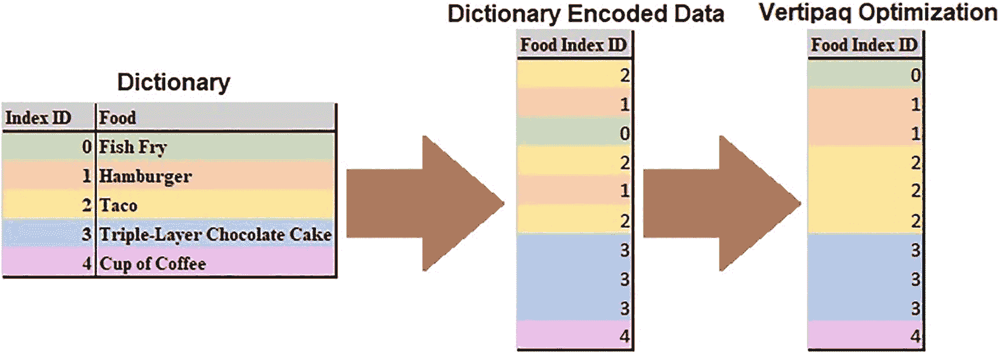
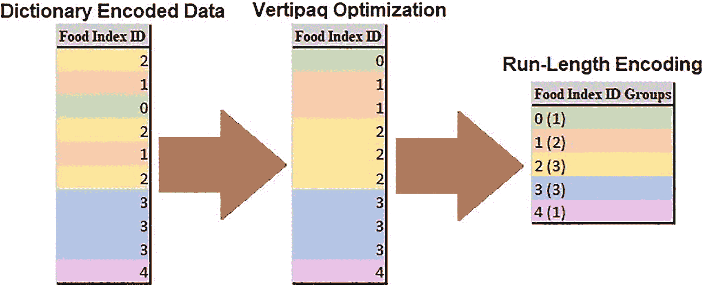
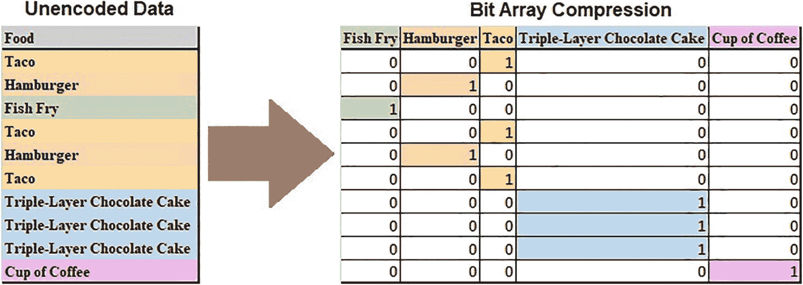
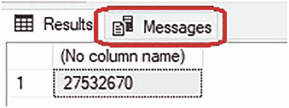
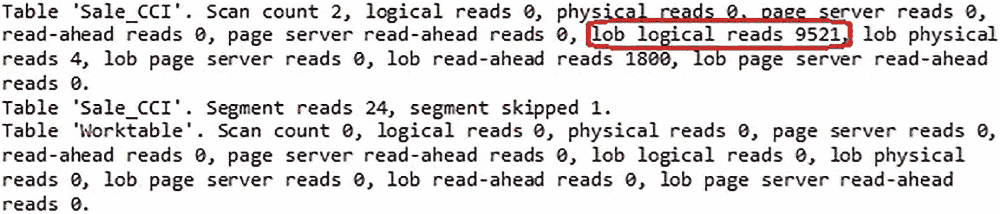

# 其他压缩算法

在段已被编码且行组已重新排序之后，列存储压缩的最后一步是将剩余的压缩算法应用于所得数据。此时，对于某个给定段，可能已无法实现进一步的压缩效果。对于不重复的值，这种情况通常最为常见。这里提供了列存储索引如何压缩数据的详细信息，以便在可能的情况下，协助进行更高级的压缩和性能优化。

列存储索引使用的一种压缩形式是 `run-length encoding`（游程编码），它试图将相同的值及其计数分组在一起，而不是在段中列出重复的值。`Vertipaq optimization` 是此步骤的前提，没有它，`run-length encoding` 的效果将显著降低。

以图 5-2 中先前提供的食物为例。编码后的数据有五个不同的值，这些值已通过字典编码为 3 位数值。`Vertipaq optimization` 会将所得数据集进行排序，如图 5-7 所示。


*图 5-7：一组编码值的 `Vertipaq optimization`*

请注意，编码值现在已重新排序，使得每个值都与相同的值分组在一起。`Run-length encoding` 在逻辑上将每个相同的值分组在一起，以减少段所需的总存储量。从逻辑上讲，所得结构可以如图 5-8 所示。


*图 5-8：应用于数值数据集的 `Run-length encoding`*

每个值都被赋予了一个计数，显示在其后的括号中。值 0 出现一次，接着是 1 出现两次，2 出现三次，3 出现三次，4 出现一次。这种算法在数据重复时效果显著，与字典编码和 `Vertipaq compression` 结合使用时效果尤为出色。

`Bit array compression` 用于段包含少量不同值，且数据无法从 `Vertipaq compression` 和 `run-length encoding` 中获得显著益处的情况。位数组是一个数组，其中每个不同值被分配一列，每一行使用位映射到该列。图 5-9 说明了在未编码且未排序的数据集上使用此压缩时的外观。


*图 5-9：应用于未编码数据集的 `Bit array compression`*

虽然这看起来像是一个复杂的转换，但生成的 1 和 0 非常紧凑，并提供了可以快速解压缩的结构。

还有一些其他更复杂的压缩算法可用于逐步减小每个数据段的大小。所使用的算法可能因段而异，并且可能经常使用、有时使用或根本不使用。当此过程完成后，最终的压缩级别由 `SQL Server` 应用，它利用了其 `xVelocity compression algorithm`。

列存储段在 `SQL Server` 中存储为 `Large Objects (LOB)`。`xVelocity compression` 的细节并未公开，因此我们无法进一步深入探讨其工作原理。虽然将本章迄今为止讨论的结构转换为其最终形式所使用的变换尚未完全知晓，但我们可以通过启用 `STATISTICS IO` 并查看发出查询时针对列存储索引的读取操作来推断其有效性。考虑清单 5-5 中的简单分析查询。

```sql
SELECT
SUM(Quantity)
FROM fact.Sale_CCI
WHERE [Invoice Date Key] >= '1/1/2016'
AND [Invoice Date Key] < '2/1/2016'
```
*清单 5-5：用于演示列存储 IO 的简单分析查询*

此查询的结果如图 5-10 所示。


*图 5-10：示例查询输出*

如结果所示，点击 *Messages* 选项卡可提供有关查询执行的读取和写入操作的附加信息，如图 5-11 所示。


*图 5-11：示例查询的 `Statistics IO` 输出*

返回的信息相当多，但目前，红色圆圈标出的 *`LOB logical reads`* 提供了满足此查询所需读取操作的指示。列存储索引不会将读取报告为 *`logical reads`*，而是报告为 *`LOB logical reads`*，这表明它们的段是作为 `Large Objects` 存储的，而不是传统的 `SQL Server` 数据结构。如果这个读取数量看起来很高，那是因为它确实很高！本书后面的章节将提供额外的优化，以减少存储和内存占用，并显著提高查询性能。


