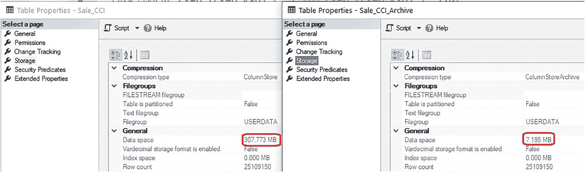

# 列存储索引压缩与元数据

## 列存储归档压缩

SQL Server 提供了一种额外的压缩级别，可用于进一步减小列存储索引数据的占用空间。虽然归档压缩可以提供比标准列存储压缩更高的压缩率，但读写数据时会消耗更多的计算资源。因此，此选项应保留用于不常使用的数据，例如：

-   冷存储或温存储
-   很少访问的数据
-   用于对性能要求不高的应用程序的数据

列存储归档压缩使用 Microsoft Xpress 压缩算法。虽然该算法很复杂，但它是公开记录的，并非 Microsoft 的商业机密。该算法依赖于压缩具有重复字节序列的数据，并结合了 LZ77 和 Huffman 压缩算法来进一步缩小列存储数据的大小。这些压缩算法的细节内容广泛，无法在本书的篇幅内详述，但对任何感兴趣的人都是公开可用的。

列存储索引中使用的压缩类型可以逐分区指定，从而允许对较旧/较少使用的数据有效使用归档压缩，而新数据则可以使用标准列存储压缩。第 11 章将深入探讨如何将分区与列存储索引结合使用，以改善数据存储、维护和性能。

为了演示列存储归档压缩的有效性，将创建一个新的 `Sale_CCI` 表版本，如代码清单 5-6 所示。

```sql
CREATE TABLE Fact.Sale_CCI_Archive
(      [Sale Key] [bigint] NOT NULL,
[City Key] [int] NOT NULL,
[Customer Key] [int] NOT NULL,
[Bill To Customer Key] [int] NOT NULL,
[Stock Item Key] [int] NOT NULL,
[Invoice Date Key] [date] NOT NULL,
[Delivery Date Key] [date] NULL,
[Salesperson Key] [int] NOT NULL,
[WWI Invoice ID] [int] NOT NULL,
[Description] NVARCHAR(100) NOT NULL,
[Package] nvarchar NOT NULL,
[Quantity] [int] NOT NULL,
[Unit Price] decimal NOT NULL,
[Tax Rate] decimal NOT NULL,
[Total Excluding Tax] decimal NOT NULL,
[Tax Amount] decimal NOT NULL,
[Profit] decimal NOT NULL,
[Total Including Tax] decimal NOT NULL,
[Total Dry Items] [int] NOT NULL,
[Total Chiller Items] [int] NOT NULL,
[Lineage Key] [int] NOT NULL);
CREATE CLUSTERED COLUMNSTORE INDEX CCI_Sale_CCI_Archive ON fact.Sale_CCI_Archive WITH (DATA_COMPRESSION=COLUMNSTORE_ARCHIVE);
```
**代码清单 5-6** 使用列存储归档压缩创建的表

填充数据后，可以将此表与之前使用标准列存储压缩的版本进行比较，如图 5-12 所示。


**图 5-12** 列存储压缩与列存储归档压缩的对比

与标准列存储压缩相比，列存储归档压缩提供了巨大的空间节省。这可能看起来令人难以置信地出色，但其中一部分节省可以通过优化数据顺序来实现，这将在第 10 章详细讨论。

在典型生产数据加载的实际应用中，归档压缩将比标准列存储压缩额外提供 15-30% 的空间节省。对于大型分析表而言，这可能意味着其数据占用空间的显著减少！一般来说，仅考虑对不常写入或读取的数据使用归档压缩，因为其压缩和解压缩的开销不小。对于很少访问的数据，这是节省存储和内存资源的简单方法。

## 压缩生命周期

SQL Server 中所有压缩的一个关键点是，压缩页在查询需要之前会保持压缩状态。因此，页在存储时被压缩，并在索引的整个生命周期内保持压缩状态。当页被读入内存时，它们也保持压缩。因此，使用压缩所节省的任何存储空间，在数据被需要时都将转化为内存节省。

这一事实对于列存储索引的效率至关重要。压缩段在磁盘上和内存中都保持压缩状态，直到查询需要其数据时才解压缩。任何进一步减小压缩段大小的优化都将直接转化为内存节省。本书的其余部分将重点介绍优化、最佳实践和功能，以尽可能高效地使用列存储索引，从而充分利用其压缩能力，并确保它们能够扩展以处理任何数据，无论其变得多大。

