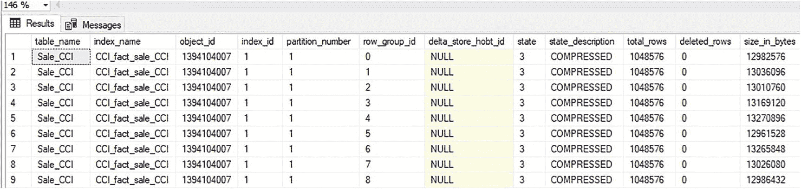
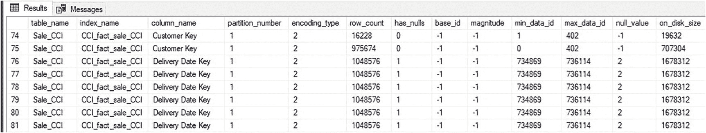
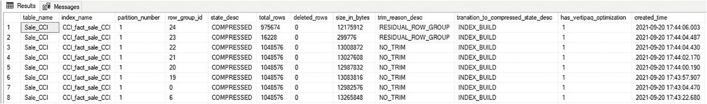

# 6. 列存储元数据

列存储索引中的每个压缩段不仅存储分析数据，而且通过元数据可以比行存储表更精确地描述其内容。

这些元数据驻留在系统视图中，允许 SQL Server 在运行时做出智能的查询处理决策。本章将详细探讨此元数据、SQL Server 如何使用它，以及如何使用它来提高列存储索引的性能。

## 可用的列存储元数据

元数据可通过少数系统视图获取，这些视图提供有关段和行组的概览级数据，以及描述物理属性、字典和操作指标的详细数据。以下是对每个视图及其内容的简要回顾。

### 行组元数据

每个压缩行组最多包含 2²⁰ 行，其内容通常在索引维护影响之外是静态的。因此，行数、已删除行数、大小和其他详细信息是准确的，可用于了解基础数据的大小和形态。

代码清单 6-1 中的查询返回表名和索引名，以及视图 `sys.column_store_row_groups` 中的所有列。

```sql
SELECT
tables.name AS table_name,
indexes.name AS index_name,
column_store_row_groups.*
FROM sys.column_store_row_groups
INNER JOIN sys.indexes
ON indexes.index_id = column_store_row_groups.index_id
AND indexes.object_id = column_store_row_groups.object_id
INNER JOIN sys.tables
ON tables.object_id = indexes.object_id
WHERE tables.name = 'Sale_CCI'
ORDER BY tables.object_id, indexes.index_id, column_store_row_groups.row_group_id;
```
**代码清单 6-1** 返回列存储索引中所有行组元数据的查询

图 6-1 包含返回的行组元数据子集。


**图 6-1** Sale_CCI 上列存储索引的行组元数据

`sys.column_store_row_groups` 返回的每一行代表一个行组内包含的行集，无论表中有多少列。一个包含十列的表，每个行组将包含十个段。类似地，一个包含 30 列的表，每个行组将包含 30 个段。以下是该视图中每列的简要概述。

#### `partition_number`

一个行组不能跨越多个分区；因此，分区表将在每个分区中有独立的行组集合，彼此之间没有重叠。此列提供给定行组所在的分区。

#### `delta_store_hobt_id`

对于增量存储中打开的行组，此处提供一个 ID，该 ID 链接到 `sys.internal_partitions` 并代表其包含的增量行组数据。标准压缩行组在此列中将包含 NULL。

#### `state` 和 `state_description`

这描述了行组的当前状态，无论它是 OPEN 并接受新行、CLOSED 但尚未被元组移动器压缩、COMPRESSED，还是 INVISIBLE（正在创建过程中的行组）。


## 列存储索引元数据

本节详细介绍了列存储索引元数据视图中的关键列。

#### Total_rows
此列提供行组的行数。通过对所有行组的此值进行求和，无需直接查询表即可收集到准确的表行数。如果许多行组的行数较低，则表明存在值得调查的流程问题。

#### Deleted_rows
如果在此行组的删除位图中，有任何行被标记为已删除，则此处会提供已删除行的计数。

#### Size_in_bytes
行组的总大小，即驻留在该行组中的所有段所使用的空间之和。此列可用于快速确定整个或部分列存储索引的大小。

## 段元数据
列存储索引中存储的基本单位是段。每个段代表单个列及其在每个行组所包含的行集中的内容。构成列存储索引的段数量是索引中行组数量与表中列数量的乘积。

`Sys.column_store_segments` 提供了关于每个段内容的详尽细节。此数据是准确的，并且在段内数据发生变化时会更新，这与需要定期更新以确保合理近似现实情况的 SQL Server 统计信息不同。

此视图中的数据不仅仅是供好奇的管理员参考。查询优化器在查询列存储索引时，也会利用这些数据在运行时智能地决策需要读取哪些数据。这使得当元数据表明某些段无需用于满足查询时，可以跳过这些段。这可以显著减少读取量，并以 SQL Server 中行存储表无法实现的方式提高查询性能。

`清单 6-2` 中的查询返回此视图中的各种有用列。
```sql
SELECT
tables.name AS table_name,
indexes.name AS index_name,
columns.name AS column_name,
partitions.partition_number,
column_store_segments.encoding_type,
column_store_segments.row_count,
column_store_segments.has_nulls,
column_store_segments.base_id,
column_store_segments.magnitude,
column_store_segments.min_data_id,
column_store_segments.max_data_id,
column_store_segments.null_value,
column_store_segments.on_disk_size
FROM sys.column_store_segments
INNER JOIN sys.partitions
ON column_store_segments.hobt_id = partitions.hobt_id
INNER JOIN sys.indexes
ON indexes.index_id = partitions.index_id
AND indexes.object_id = partitions.object_id
INNER JOIN sys.tables
ON tables.object_id = indexes.object_id
INNER JOIN sys.columns
ON tables.object_id = columns.object_id
AND column_store_segments.column_id = columns.column_id
WHERE tables.name = 'Sale_CCI'
ORDER BY columns.name, column_store_segments.segment_id;
```
`清单 6-2`
返回列存储段元数据的查询

返回的段元数据可见于 `图 6-2`。

`图 6-2`
Sale_CCI 表上列存储索引的段元数据

关于列存储段的详细信息深入探讨了它们如何被压缩和存储，这可以为列存储索引中每列的压缩效率提供有价值的线索。以下是此视图中一些关键列的详细说明。

#### Encoding_type
此列指示该段是否使用字典进行编码以及存储其中的数据类型，具体如下：
*   1: 无字典的非字符串/非二进制数据。此段中的值使用 基数/量级 编码进行转换。
*   2: 带字典的非字符串/非二进制数据。
*   3: 带字典的字符串或二进制数据。
*   4: 无字典的非字符串/非二进制数据。此段中的值按原样存储，无额外转换。
*   5: 无字典的字符串或二进制数据。

通常，具有许多不同值（即高基数）的段倾向于使用基于值的编码，而不实现字典查找，而低基数的段则更常使用字典来减少重复值的存储。此决策由 SQL Server 内部做出，以改进压缩并减少段占用的空间。

#### Row_Count
此行计数与相应行组的行计数匹配，表示列存储段内包含的值数量（重复或不同）。

#### Has_nulls
如果一个段包含至少一个 NULL，则此列设置为 1；否则为 0。请注意，此列不指示列是否允许 NULL，而是报告某个段在其值集中是否恰好有 NULL。因此，同一列的不同段在此位上的值可以不同。

#### Base_id and Magnitude
这些列直接报告基于值的编码。如果使用基数和指数修改了值以减少其存储大小，则这些详细信息在此处表示。基数和量级可能因段而异，对于任何一列的不同段，它们不需要相同。

#### Min_data_id and Max_data_id
这对非常实用的列提供了段的最小值和最大值，或者如果使用了字典，则提供字典查找值。如果为基于值的编码进行了转换，则这些列提供的值将包含这些修改。

段的最小值和最大值由查询优化器用于在读取列存储索引时跳过不必要的行组。例如，如果一个段包含的最小值为 1，最大值为 400，那么筛选此范围之外值的查询可以完全跳过此行组。这种优化称为段消除，是大型列存储索引性能的关键。第 10 章详细讨论了段消除，并提供了充分利用此功能所需的约定。

#### Null_value
如果一个段包含 NULL，则此列提供的值是该列编码中表示 NULL 的数值。

#### On_disk_size
列 `on_disk_size` 提供了列存储段消耗的空间，从而可以轻松地将列存储索引消耗的空间分解为细粒度的详细信息。如果众多段中有一个段的大小异常大，则探究其原因并确定是否可以进行进一步优化以改进数据压缩可能是有价值的。

这种细粒度的详细信息还允许计算每列消耗的空间，以及每个分区每列消耗的空间。如果列存储索引异常快速地增长，此元数据允许将增长源隔离到特定的列和一组段，以确定增长的来源。


### 行组物理元数据

SQL Server 提供了视图 `sys.dm_db_column_store_row_group_physical_stats` 作为每个行组的参考。该视图包含了关于行组当前状态以及行组创建方式的详细信息。在排查意外的性能问题，或试图理解列存储索引行组为何以特定方式构建时，这些信息非常宝贵。

代码清单 6-3 中的查询从该视图中返回关键信息以及一些相关的元数据。

```sql
SELECT
objects.name AS table_name,
indexes.name AS index_name,
dm_db_column_store_row_group_physical_stats.partition_number,
dm_db_column_store_row_group_physical_stats.row_group_id,
dm_db_column_store_row_group_physical_stats.state_desc,
dm_db_column_store_row_group_physical_stats.total_rows,
dm_db_column_store_row_group_physical_stats.deleted_rows,
dm_db_column_store_row_group_physical_stats.size_in_bytes,
dm_db_column_store_row_group_physical_stats.trim_reason_desc,
dm_db_column_store_row_group_physical_stats.transition_to_compressed_state_desc,
dm_db_column_store_row_group_physical_stats.has_vertipaq_optimization,
dm_db_column_store_row_group_physical_stats.created_time
FROM sys.dm_db_column_store_row_group_physical_stats
INNER JOIN sys.objects
ON objects.object_id = dm_db_column_store_row_group_physical_stats.object_id
INNER JOIN sys.indexes
ON indexes.object_id = dm_db_column_store_row_group_physical_stats.object_id
AND indexes.index_id = dm_db_column_store_row_group_physical_stats.index_id
WHERE objects.name = 'Sale_CCI';
```
代码清单 6-3：返回列存储行组物理详细信息的查询

查询结果提供了关于行组的附加信息，如图 6-3 所示。



图 6-3：Sale_CCI 上列存储索引的行组物理统计信息

这些信息为了解行组的构建方式和时间提供了线索。以下是图 6-3 中展示的关键列的说明。

#### State_desc

这是行组的当前状态，与在 `sys.column_store_row_groups` 中找到的值相同。状态为 `TOMBSTONE` 的行组表明它先前是增量存储区的一部分，已被转换为压缩行组，但尚未被清理。此清理过程是异步自动进行的，无需操作员干预。

#### Total_rows, Deleted_rows, Size_in_bytes

这些值与 `sys.column_store_row_groups` 中的对应值相同，在此视图中提供是为了方便。

#### Trim_reason_desc

一个行组最多可包含 2²⁰ 行。行组被创建并压缩时，其行数可能未达到满额，这有很多原因。如果此列对某个行组显示 `NO_TRIM`，则表明它是一个满行组，包含 1,048,576 行。如果行组包含的行数小于其最大可能大小，那么修剪原因（trim reason）将解释为什么。

通常，列存储索引应主要包含行数接近 1,048,576 的行组。如果情况并非如此，并且大多数行组尺寸过小（undersized），那么理解其原因对于改进列存储的存储和性能至关重要。对于“尺寸过小”没有严格的定义阈值，但通常一个尺寸过小的行组包含的行数少于 900,000 行，或少于其最大尺寸的大约 10%。

行组被修剪的常见原因包括：

*   `BULKLOAD`：批量加载过程将结果行数限制为小于其最大值。这是正常的，很少需要担心。
*   `REORG`：使用了索引重组过程来强制压缩行组。由于这是手动过程，如果需要，很容易控制。
*   `DICTIONARY_SIZE`：字典限制为 16 兆字节空间。如果字典超过该大小，则其对应的行组将被拆分到另一个行组中。如果这种情况频繁发生并且导致行数较低，则表明字典压缩正在损害压缩性能。将大型维度表规范化为查找表是解决此问题的有效方法。
*   `MEMORY_LIMITATION`：这表明 SQL Server 在压缩行组时内存不足，无法包含所有行。这表明存在内存压力，应进行研究以确定内存不足的原因，以及是否应为 SQL Server 添加更多内存来解决此问题。这种性质的内存压力很可能也会影响服务器上的其他进程，缓解它将对它们以及列存储索引构建过程有益。
*   `RESIDUAL_ROW_GROUP`：当索引构建操作完成时，剩余的行将使用此修剪原因压缩进行组。这是正常的，不需要调查。
*   `AUTO_MERGE`：当元组移动器（tuple mover）运行并将多个行组合并在一起时，会产生此结果。这是好事，因为它有助于形成更大的行组，并移除尺寸过小的行组。

#### Transition_to_compressed_state_desc

此列描述了行组如何从增量存储区移动到列存储索引内的一组压缩段中。它提供了关于行组如何创建的附加信息，并可与修剪原因结合使用，以了解所有行组的创建方式（无论是否被修剪）。转换到压缩状态描述的可能值包括：

*   `NOT_APPLICABLE`：这出现在增量存储区行组中，或在 SQL Server 2016 之前压缩的行组中（当时未维护此历史记录）。
*   `INDEX_BUILD`：此行组通过索引构建过程压缩。
*   `TUPLE_MOVER`：此行组由元组移动器在从增量存储区插入数据后压缩。
*   `REORG_NORMAL`：执行了索引重组过程，将一个已关闭的行组从增量存储区移动到列存储索引中。这发生在该行组已达到其完整行数并被关闭之后，但在它通过元组移动器异步移动之前。
*   `REORG_FORCED`：执行了索引重组过程，将一个开放的行组从增量存储区移动到列存储索引中。这发生在该行组尚未达到其完整行数之前，通常它本应通过元组移动器异步移动。
*   `BULKLOAD`：最小日志记录的批量加载过程创建了该行组，而未使用增量存储区。
*   `MERGE`：元组移动器将多个行组合并为此压缩行组。

请注意，除了与索引重组操作相关的两个转换原因外，其余原因都表明是通过 SQL Server 中的自动过程创建的压缩行组。这些原因应被视为正常操作的一部分，仅在遇到未解决的性能问题时才需要调查。


