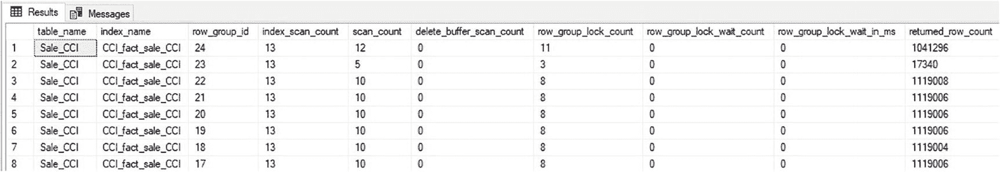
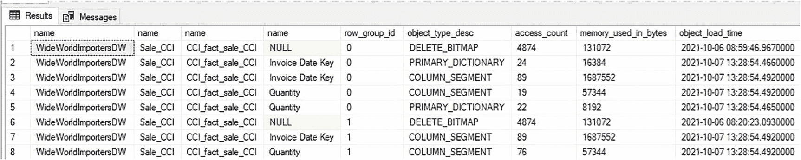
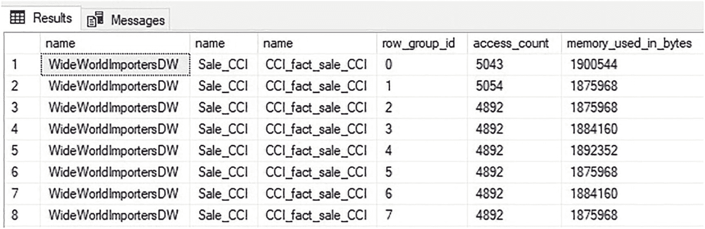
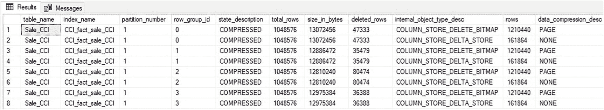

# 行组统计

### Has_vertipaq_optimization

此列指示行组内的行是否可以通过 Vertipaq 优化重新排序，以提高此行组的压缩率。

如果此列显示为零，则值得调查。Vertipaq 优化所带来的空间节省非常显著，它将使查询速度更快，并减少列存储索引的内存和存储消耗。正如前一章所讨论的，Vertipaq 优化可能未发生的两个原因如下：

1.  列存储索引驻留在内存优化表上。
2.  列存储索引包含非聚集行存储索引。

请注意，如果从聚集列存储索引中移除非聚集行存储索引，Vertipaq 优化状态在执行索引重建之前不会更改。

请仔细考量导致未使用 Vertipaq 优化的架构决策的利弊，因为将列存储索引置于内存中或包含非聚集行存储索引都有其合理的原因。

对于需要支持性非聚集行存储索引的列存储索引，一个解决方案是在包含查询所需数据的分区上实现非聚集索引。Vertipaq 优化将只影响包含该非聚集索引的分区上的行组。通常，根据常见的工作负载，可以将数据分离为热数据、温数据和冷数据。可以将辅助索引跨分区拆分，以有效地针对这些不同的工作负载。

类似地，可以使用筛选的非聚集行存储索引来进一步限制索引大小，并减少其对压缩和存储的范围和影响。

### Created_time

此列指示行组的创建时间。这有助于了解随时间推移创建了多少行组，以及单位时间内添加到列存储索引的行数。此外，`created_time` 可以与 `size_in_bytes` 相关联，从而可以测量列存储索引大小随时间以字节为单位的增长。

## 行组操作统计

SQL Server 维护有关列存储索引使用情况的累积详细信息，并在行组级别提供这些详细信息。这有助于理解列存储索引中的哪些行组构成了热数据、温数据或冷数据，并提供每个行组使用方式的详细粒度信息。

清单 6-4 中的查询返回单个列存储索引的操作数据。

```sql
SELECT
objects.name AS table_name,
indexes.name AS index_name,
dm_db_column_store_row_group_operational_stats.row_group_id,
dm_db_column_store_row_group_operational_stats.index_scan_count,
dm_db_column_store_row_group_operational_stats.scan_count,
dm_db_column_store_row_group_operational_stats.delete_buffer_scan_count,
dm_db_column_store_row_group_operational_stats.row_group_lock_count,
dm_db_column_store_row_group_operational_stats.row_group_lock_wait_count,
dm_db_column_store_row_group_operational_stats.row_group_lock_wait_in_ms,
dm_db_column_store_row_group_operational_stats.returned_row_count
FROM sys.dm_db_column_store_row_group_operational_stats
INNER JOIN sys.objects
ON objects.object_id = dm_db_column_store_row_group_operational_stats.object_id
INNER JOIN sys.indexes
ON indexes.object_id = dm_db_column_store_row_group_operational_stats.object_id
AND indexes.index_id = dm_db_column_store_row_group_operational_stats.index_id
WHERE objects.name = 'Sale_CCI';
```

清单 6-4: 返回列存储行组操作统计的查询

图 6-4 中的结果显示了每个行组的独立操作数据。


图 6-4: Sale_CCI 上列存储索引的行组操作统计

此视图中的所有指标都是自上次重启 SQL Server 服务以来的累积值。因此，要有效地使用这些数据，必须定期捕获它，以计算从一个样本到下一个样本的测量值差异。

以下是可用于跟踪详细列存储行组使用情况的部分列。

#### Index_scan_count

此列计算列存储索引被扫描的次数，无论请求了哪些行组。对于给定分区中的所有行组，此值将相同。

#### Scan_count

此列仅计算扫描此行组的次数。将其与 `index_scan_count` 进行比较，可以了解满足针对列存储索引的查询时需要特定行组的频率。

在典型的 OLAP 数据中，较旧的数据比较新的数据需要得少，因此包含较旧数据的行组比较新的行组扫描次数更少。此视图中的扫描计数列可以提供必要的数据来支持冷数据或温数据的存储变更。如果较旧的数据出于历史原因需要但很少被查询，则可能可以将其卸载到速度较慢但成本较低的存储上。类似地，如果有一部分数据是较新的且至关重要，则可能受益于更快的存储。

#### Delete_buffer_scan_count

此列计算为完成针对此行组的查询而需要查阅删除位图的次数。删除缓冲区指的是作为 b-tree 与列存储索引一起存储的删除位图，以及该索引的内存中哈希表表示。

通常，列存储索引中的删除行直到其数量与索引大小相比变得很大时才会成为问题。如果 `delete_buffer_scan_count` 是一个接近 `scan_count` 值的大数字，则重建索引以从索引中移除删除行可能是值得的。在继续进行索引维护之前，请先检查 `dm_db_column_store_row_group_physical_stats` 中的 `deleted_rows` 值，以验证删除行的数量确实很大。虽然索引重建可以作为联机操作执行，但对于大型列存储索引来说，它仍然计算开销大且耗时。


#### Row_group_lock_count、Row_group_lock_wait_count 和 Row_group_lock_wait_in_ms

这些指标提供了针对此行组的锁请求计数（及详细信息）。它们通常是列存储索引写入与读取操作冲突的结果。行组锁在活跃写入的行组上最为常见，而在较旧的行组上则不常见。

行组锁定本身并非坏事，但如果数据加载与分析过程之间存在严重争用，那么了解哪些行组导致了争用，将有助于解决该情况。

更新操作最有可能引起争用，因为它需要同时写入删除位图和增量存储。虽然更新单行会影响两个行组（一个用于删除位图，一个用于增量存储），但较大的更新可能会影响许多行组。在这些场景中，更新引起的锁定可能相当具有破坏性。

同样，如果数据在一天中不断少量流入列存储索引，相比于通过单一集中式流程在非分析高峰期进行不频繁的管理，发生争用的机会更大。

与许多性能挑战一样，应在需要时调查争用问题。如果 `Row_group_lock_count` 看起来很高，但分析速度（和最终用户满意度）良好，那么这个事实最好记录下来留待日后参考，但暂不采取行动。始终交叉参考 `Row_group_lock_wait_count` 和 `Row_group_lock_wait_in_ms`，以确定锁定是否导致了等待。如果等待次数或等待时间不高，则可能不需要进一步行动。如果不确定总等待时间是否过高，请考虑每次锁等待事件的平均等待时间，如清单 6-5 中的查询所示。

```sql
SELECT
    objects.name AS table_name,
    indexes.name AS index_name,
    dm_db_column_store_row_group_operational_stats.row_group_id,
    dm_db_column_store_row_group_operational_stats.scan_count,
    dm_db_column_store_row_group_operational_stats.row_group_lock_wait_count,
    dm_db_column_store_row_group_operational_stats.row_group_lock_wait_in_ms,
    CASE
        WHEN dm_db_column_store_row_group_operational_stats.row_group_lock_wait_count = 0 THEN 0
        ELSE CAST(CAST(dm_db_column_store_row_group_operational_stats.row_group_lock_wait_in_ms AS DECIMAL(16,2)) /
                  CAST(dm_db_column_store_row_group_operational_stats.row_group_lock_wait_count AS DECIMAL(16,2)) AS DECIMAL(16,2))
    END AS lock_wait_ms_per_wait_incidence
FROM sys.dm_db_column_store_row_group_operational_stats
INNER JOIN sys.objects
    ON objects.object_id = dm_db_column_store_row_group_operational_stats.object_id
INNER JOIN sys.indexes
    ON indexes.object_id = dm_db_column_store_row_group_operational_stats.object_id
    AND indexes.index_id = dm_db_column_store_row_group_operational_stats.index_id
WHERE objects.name = 'Sale_CCI';
```
**清单 6-5**
**计算每次锁等待事件的锁等待时间的公式**

返回的详细信息有助于理解：
* 针对某个行组的操作中有多少导致了锁定/等待？
* 当发生锁定等待时，等待了多久？
* 等待时间与行组的整体性能相比如何？

如果争用在列存储索引中是个问题，请考虑优化数据加载流程。将更新操作分解为一系列删除和插入操作。这减少了数据加载期间的事务大小，加快了更新操作速度，并降低了显著争用的可能性。尽可能利用大批量插入的批量加载流程，因为它们更快、产生的争用更少，并且减少了事务日志大小。最后，确保对列存储索引的写入尽可能减少并集中化。如果中间写入操作可以在修改列存储索引数据之前针对临时表进行，那么结果将是分析所用数据上的争用减少，并且数据加载速度更快。最佳实践（如这些）在第 15 章中有更详细的讨论。

#### Returned_row_count

另一个有助于量化利用率的附加指标是返回的行数总计。这提供了在一段时间内从此行组读取了多少数据的额外维度，并可以与索引中的其他行组进行比较。请注意，较低的行计数可能是由于该行组包含的行数本身较少，而不仅仅是使用率较低所致。

### 列存储索引内存使用情况

系统视图 `sys.dm_column_store_object_pool` 提供了关于分配给列存储索引的内存的详细信息。这可以帮助解决内存压力问题，以及在创建列存储索引表时进行容量规划。这是一个跨整个服务器的共享视图；因此，当仅为单个数据库查看元数据时，按数据库名称进行过滤是有用的。

清单 6-6 中的查询返回特定列存储索引的内存使用详细信息。

```sql
SELECT
    databases.name,
    objects.name,
    indexes.name,
    columns.name,
    dm_column_store_object_pool.row_group_id,
    dm_column_store_object_pool.object_type_desc,
    dm_column_store_object_pool.access_count,
    dm_column_store_object_pool.memory_used_in_bytes,
    dm_column_store_object_pool.object_load_time
FROM sys.dm_column_store_object_pool
INNER JOIN sys.objects
    ON objects.object_id = dm_column_store_object_pool.object_id
INNER JOIN sys.indexes
    ON indexes.object_id = dm_column_store_object_pool.object_id
    AND indexes.index_id = dm_column_store_object_pool.index_id
INNER JOIN sys.databases
    ON databases.database_id = dm_column_store_object_pool.database_id
LEFT JOIN sys.columns
    ON columns.column_id = dm_column_store_object_pool.column_id
    AND columns.object_id = dm_column_store_object_pool.object_id
WHERE objects.name = 'Sale_CCI'
    AND databases.name = DB_NAME()
ORDER BY dm_column_store_object_pool.row_group_id, columns.name;
```
**清单 6-6**
**按 Sale_CCI 表统计的列存储内存使用情况**

结果如图 6-5 所示。


**图 6-5**
**列存储索引的内存消耗示例**

请注意 `sys.dm_column_store_object_pool` 返回的详细程度。结果表明最近运行了一个查询，该查询针对了 `Invoice Date Key` 和 `Quantity` 列。由于列存储索引将每一列单独存储在它们自己的段中，因此只需要将请求列的段读入内存。这与行存储索引不同，行存储索引的页面包含索引中的所有列，必须一起读取。

除了列段之外，内存还被删除位图和字典消耗，这提供了对列存储索引内每个对象所消耗内存的细粒度视图。以下是图 6-5 中返回的每个新列的说明。

#### Object_type_desc

这是驻留在内存中的列存储对象类型。它将是以下值之一：

- `COLUMN_SEGMENT`：每一行此类型代表一个单独的列存储段。这些条目将包含一个 `column_id` 值，以便返回有关该段所属列的更多详细信息。

- `PRIMARY_DICTIONARY`、`SECONDARY_DICTIONARY` 和 `BULKINSERT_DICTIONARY`：这些代表用于基于字典编码的段的字典。通常，字典及其对应的列段所占用的空间将小于使用基于值的编码存储列时所占用的空间。

- `DELETE_BITMAP`：这代表由删除位图对象消耗的内存。对于列存储索引中跨越一个分区上所有行组的每个分区，始终会有一个删除位图。每个行组的条目指示与该特定行组相关的删除位图部分的粒度详细信息。即使其中没有指示被删除的行，这些对象也作为容器存在。

#### Access_count

这是对内存中此对象的所有读写操作的计数。这粗略衡量了该对象被使用的程度，以及内存中哪些对象被频繁使用，哪些被很少使用。

由于此视图检查驻留在内存中的对象，数据是瞬态的，并且仅在对象驻留于内存期间保留历史记录。因此，访问计数仅是自 `object_load_time` 所给时间以来累计的。

#### Object_load_time

这是此对象被读入内存对象池的时间。结合 `access_count`，可以计算单位时间内的读或写操作次数，这对于衡量特定对象在内存中的使用量可能很有用。

`dm_column_store_object_pool` 中提供的数据也可以进行聚合，以便可以测量给定行组、列、索引或对象类型的总内存消耗量。例如，清单 6-7 中的查询量化了每个行组消耗的内存。

```sql
SELECT
databases.name,
objects.name,
indexes.name,
dm_column_store_object_pool.row_group_id,
SUM(dm_column_store_object_pool.access_count) AS access_count,
SUM(dm_column_store_object_pool.memory_used_in_bytes) AS memory_used_in_bytes
FROM sys.dm_column_store_object_pool
INNER JOIN sys.objects
ON objects.object_id = dm_column_store_object_pool.object_id
INNER JOIN sys.indexes
ON indexes.object_id = dm_column_store_object_pool.object_id
AND indexes.index_id = dm_column_store_object_pool.index_id
INNER JOIN sys.databases
ON databases.database_id = dm_column_store_object_pool.database_id
LEFT JOIN sys.columns
ON columns.column_id = dm_column_store_object_pool.column_id
AND columns.object_id = dm_column_store_object_pool.object_id
WHERE objects.name = 'Sale_CCI'
AND databases.name = DB_NAME()
GROUP BY databases.name, objects.name, indexes.name, dm_column_store_object_pool.row_group_id
ORDER BY dm_column_store_object_pool.row_group_id;
```
**清单 6-7** 按行组分列的列存储内存消耗

图 6-6 显示了结果。



**图 6-6** 按行组分组的内存消耗

根据索引、其元数据及其使用情况，某些行组可能比其它行组消耗显著更多的内存。在图 6-6 的示例结果中，内存使用量在每个行组上相对均匀，表明查询正在从每个行组均匀读取数据。

### Internal Columnstore Index Objects

还有一个视图提供了有关列存储索引结构的内部详细信息，即 `sys.internal_partitions`。清单 6-8 中的查询返回与列存储索引中行组关联的任何内部分区的详细信息。

```sql
SELECT
tables.name AS table_name,
indexes.name AS index_name,
partitions.partition_number,
column_store_row_groups.row_group_id,
column_store_row_groups.state_description,
column_store_row_groups.total_rows,
column_store_row_groups.size_in_bytes,
column_store_row_groups.deleted_rows,
internal_partitions.internal_object_type_desc,
internal_partitions.rows,
internal_partitions.data_compression_desc
FROM sys.column_store_row_groups
INNER JOIN sys.indexes
ON indexes.index_id = column_store_row_groups.index_id
AND indexes.object_id = column_store_row_groups.object_id
INNER JOIN sys.tables
ON tables.object_id = indexes.object_id
INNER JOIN sys.partitions
ON partitions.partition_number = column_store_row_groups.partition_number
AND partitions.index_id = indexes.index_id
AND partitions.object_id = tables.object_id
LEFT JOIN sys.internal_partitions
ON internal_partitions.object_id = tables.object_id
WHERE tables.name = 'Sale_CCI'
ORDER BY indexes.index_id, column_store_row_groups.row_group_id;
```
**清单 6-8** 与列存储索引关联的内部分区

此查询的结果至少为每个分区中的每个行组提供一行，具体取决于内容。图 6-7 包含此输出的样本。



**图 6-7** 内部列存储索引对象示例

显示的内部列存储对象说明了已删除行和增量存储内容的存在。`deleted_rows` 列包含每个行组的单独计数，而 `rows` 列包含汇总的详细信息。

以下是结果集中每个新列的简短说明，以及如何使用它来跟踪列存储索引的增长和使用情况。

#### Internal_object_type_desc

此字段指示所引用的内部对象类型，可能为以下值之一：

*   `COLUMN_STORE_DELETE_BITMAP`：这是列存储索引中每个行组关联的删除位图部分。`rows` 列中的值指示了此部分删除位图中记录了多少已删除行（如果有）。删除位图存储在行存储 B 树结构中。每个行组都会有一个关联的删除位图，即使指示为已删除的行数为零。

*   `COLUMN_STORE_DELTA_STORE`：这代表尚未在列存储索引中压缩成分段存储的增量行组。除非该行组存在增量行组，否则此视图中的这些条目不会存在。增量存储中的增量行组存储在行存储 B 树结构中。

*   `COLUMN_STORE_DELETE_BUFFER`：此对象专属于非聚集列存储索引，它将聚集行存储索引中已删除的行缓冲到非聚集列存储索引的删除位图中。从缓冲区到删除位图的已删除行数据移动由元组移动器管理，也可以通过索引重组命令强制执行。此缓冲区有助于提高在更新和删除操作可能频繁的 OLTP 表上的删除速度，从而有助于提高写入非聚集列存储索引的速度。当从非聚集列存储索引读取数据时，删除缓冲区和删除位图会同时读取，以生成索引中已删除行的完整视图。除非表上存在非聚集列存储索引，否则此内部对象不会出现在 `sys.internal_partitions` 中。

*   `COLUMN_STORE_MAPPING_INDEX`：当聚集列存储索引上同时存在非聚集行存储索引时使用此索引。此映射索引用于将非聚集索引键列链接回聚集列存储索引中每个行组内的正确行。仅当行在行组之间移动时（例如，当增量存储行组移动到压缩行组中，或者当元组移动器合并行组时）才会使用此映射索引。除非满足这些条件且对象中存在行，否则此内部对象不会显示在 `sys.internal_partitions` 中。

