# 7. 批处理执行

SQL Server 中行的处理传统上是逐行管理的。对于事务性工作负载，这是一个合理的约定，因为读写操作的行数通常很小。

常规操作涉及数千或数百万行的分析查询，不会从这种逐行读取的方式中受益。批处理执行是 SQL Server 的一种执行模式，允许在执行计划运算符之间成组读取和传递行，从而最终提高性能。

当查询被执行且每个运算符被处理时，行在这些运算符之间传递的数量由执行模式决定。在行模式下，每一行依次从一个运算符传递到下一个运算符。在批处理模式下，行组在运算符之间传递。这种约定的结果是，在批处理模式下，控制权在运算符之间传递的次数更少，因为行可以在更少的批次中交接。

## 行模式执行

估计基数较低的查询通常会使用行模式执行。在行模式执行中，行在通过执行计划中的每个运算符时被逐个读取。这听起来效率低下，但需要注意的是，以批处理方式处理行会产生相应的开销。因此，SQL Server 将在运行时做出决策，以确定查询在行模式或批处理模式下处理是否更高效。

考虑清单 7-1 中的查询。

```sql
SELECT
Employee,
[WWI Employee ID],
[Preferred Name],
[Is Salesperson]
FROM Dimension.Employee
WHERE [Employee Key] = 17;
```
清单 7-1：返回单行的事务性查询

此查询的结果是单行，因为它通过表的主键查找单个 ID 值。启用实际执行计划后，可以查看聚集索引查找的详细信息，如图 7-1 所示。

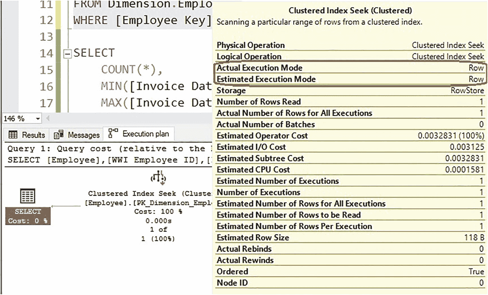
图 7-1：显示详细信息的执行计划

请注意查询运算符详细信息中提供的执行模式。估计和实际执行模式都指示为行模式。鉴于基础表是行存储表，并且查询只返回一行，因此此操作预期使用行模式执行。

虽然列存储索引针对操作大行数的分析查询进行了优化，并且通常会利用批处理处理，但如果优化器认为行模式是最有效的选项，则也可以选择行模式作为执行模式。

清单 7-2 中的查询显示了一个针对列存储索引表执行的窄查询，该碰巧也有一个非聚集行存储主键。

```sql
SELECT
*
FROM fact.Sale
WHERE [Invoice Date Key] = '1/1/2016'
AND [Sale Key] = 198840;
```
清单 7-2：对列存储索引使用行模式执行的查询

此查询在使用了行模式的聚集列存储索引上返回单行，如图 7-2 所示。

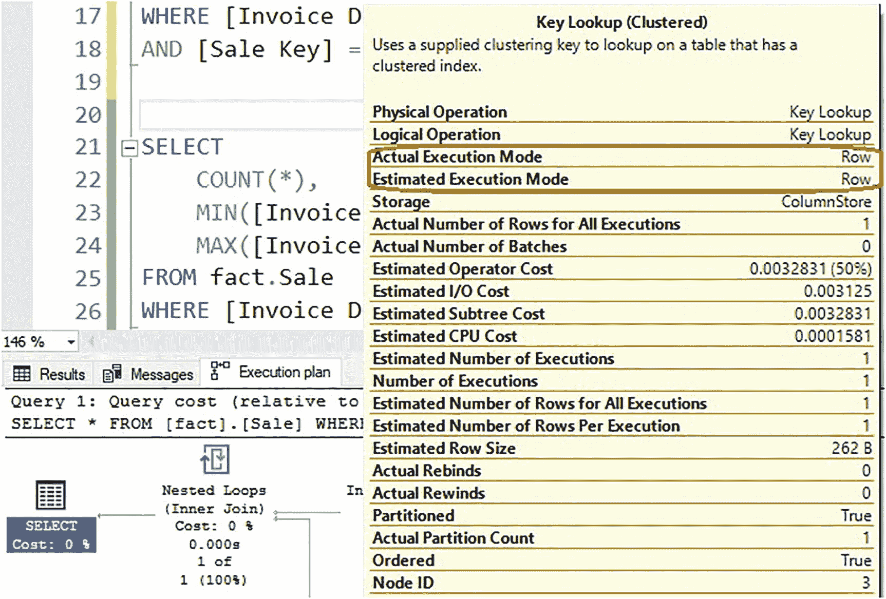
图 7-2：针对列存储索引使用行模式执行的执行计划

尽管执行计划运算符指示其使用列存储存储，但优化器选择了行模式作为执行模式。这不应被视为不寻常或次优。因为查询只返回一行，所以使用行模式针对该预期结果进行了优化，即使表存储在聚集列存储索引中。


## `批处理模式执行`

具有高基数的查询可以从批处理模式执行中受益。在此执行模式下，对于执行计划中选择批处理模式的每个运算符，行会被划分为批次并在这些批次中进行处理。在列存储索引中，这将是预期的执行模式。对于大型分析查询而言，如果不使用批处理模式，将被视为异常情况。如果该异常被识别为性能不佳的查询，那么进一步调查为何未使用批处理模式将是值得的。

考虑清单 7-3 中的查询。

```sql
SELECT
COUNT(*),
MIN([Invoice Date Key]),
MAX([Invoice Date Key])
FROM fact.Sale
WHERE [Invoice Date Key] >= '1/1/2016';
```
*清单 7-3: 针对列存储索引使用批处理模式执行的查询*

此查询仅返回一行，但需要处理许多行以计算这些指标。图 7-3 中的执行计划显示了此查询的详细信息。

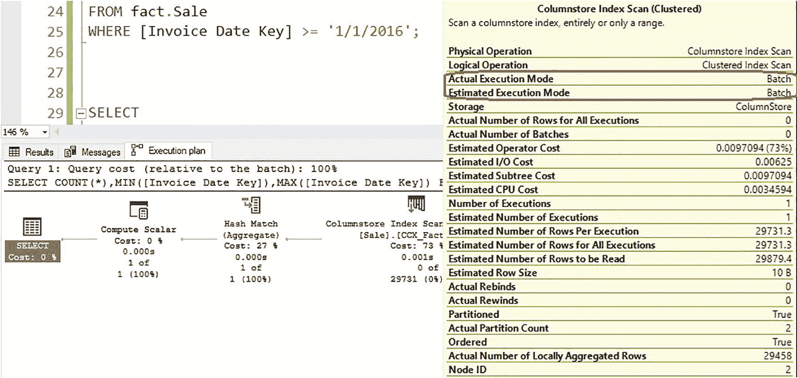

批处理是预期的执行模式，也是 SQL Server 为此查询选择的模式。请注意，计划详情表明“实际本地聚合行数”为 29,458。这是 SQL Server 满足查询所需的行数，图 7-4 中显示的结果证实了这一点。

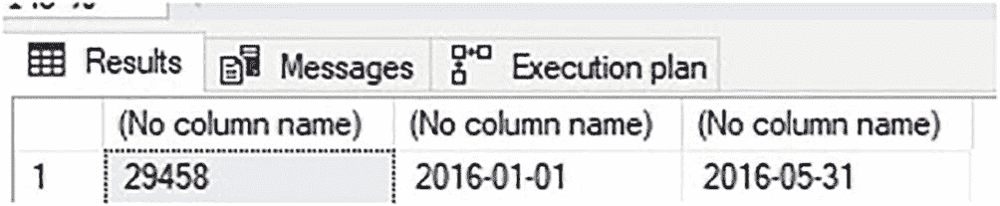

对于给定的计划运算符，查询优化器是否选择批处理模式，取决于该运算符处理的行数，而非查询返回的行数。

执行模式对于一个查询来说，并非全有或全无的选择。查询优化器可以为某些运算符选择批处理模式，而为其他运算符选择行模式，并将根据其确定对每个运算符最高效的模式来做出决定。

一种常见的分析查询模式是聚合大型列存储索引中的数据，并联接到维度表以在需要时提供查找值。清单 7-4 中的查询展示了一个经典场景，其中同时查询了维度表和事实表。

```sql
SELECT
City.City,
City.[State Province],
City.Country,
COUNT(*)
FROM Fact.Sale
INNER JOIN Dimension.City
ON City.[City Key] = Sale.[City Key]
WHERE [Invoice Date Key] >= '1/1/2016'
AND [Invoice Date Key] < '2/1/2016'
GROUP BY City.City, City.[State Province], City.Country;
```
*清单 7-4: 将大型分析表与小型查找表联接的查询*

此查询的执行计划见图 7-5。

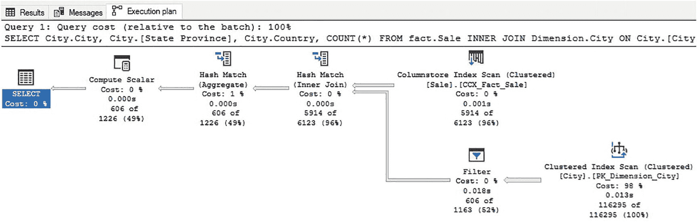

执行计划中包含一个对 `fact.Sale` 的列存储索引扫描，以及一个对 `Dimension.City` 查找表的扫描。图 7-6 显示了每个表访问运算符的属性，左侧是列存储扫描，右侧是行存储扫描。

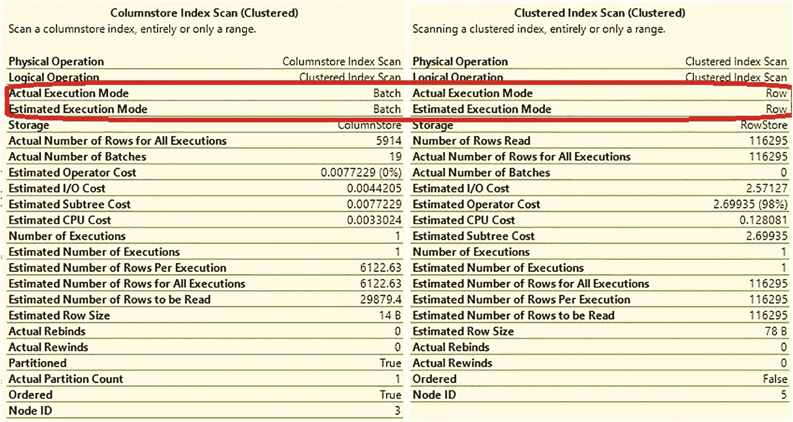

列存储索引扫描以批处理模式运行，而行存储索引扫描则以行模式运行。此查询是在具有 SQL Server 2016 兼容级别 (130) 的数据库上执行的。为了测试批处理模式对行存储使用的影响，将兼容级别调整为 150 (SQL Server 2019)，如清单 7-5 中的查询所示。

```sql
ALTER DATABASE WideWorldImportersDW SET COMPATIBILITY_LEVEL = 150;
```
*清单 7-5: 将数据库兼容级别更改为 SQL Server 2019 的查询*

此更改后，再次执行清单 7-4 中的查询，执行计划如图 7-7 所示。

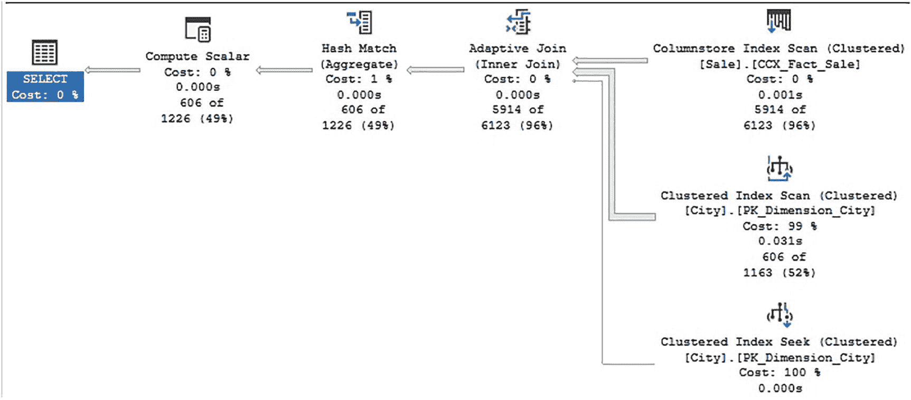

当兼容级别切换到 150 时，SQL Server 2019 中的多个新功能被启用。执行计划显示使用了自适应联接，其中与 `Dimension.City` 的联接可以选择聚集索引扫描或聚集索引查找。每个运算符的实际行数证实，由于返回的行数众多，SQL Server 选择了使用聚集索引扫描。图 7-8 显示了针对 `Dimension.City` 的行存储聚集索引扫描的运算符属性。

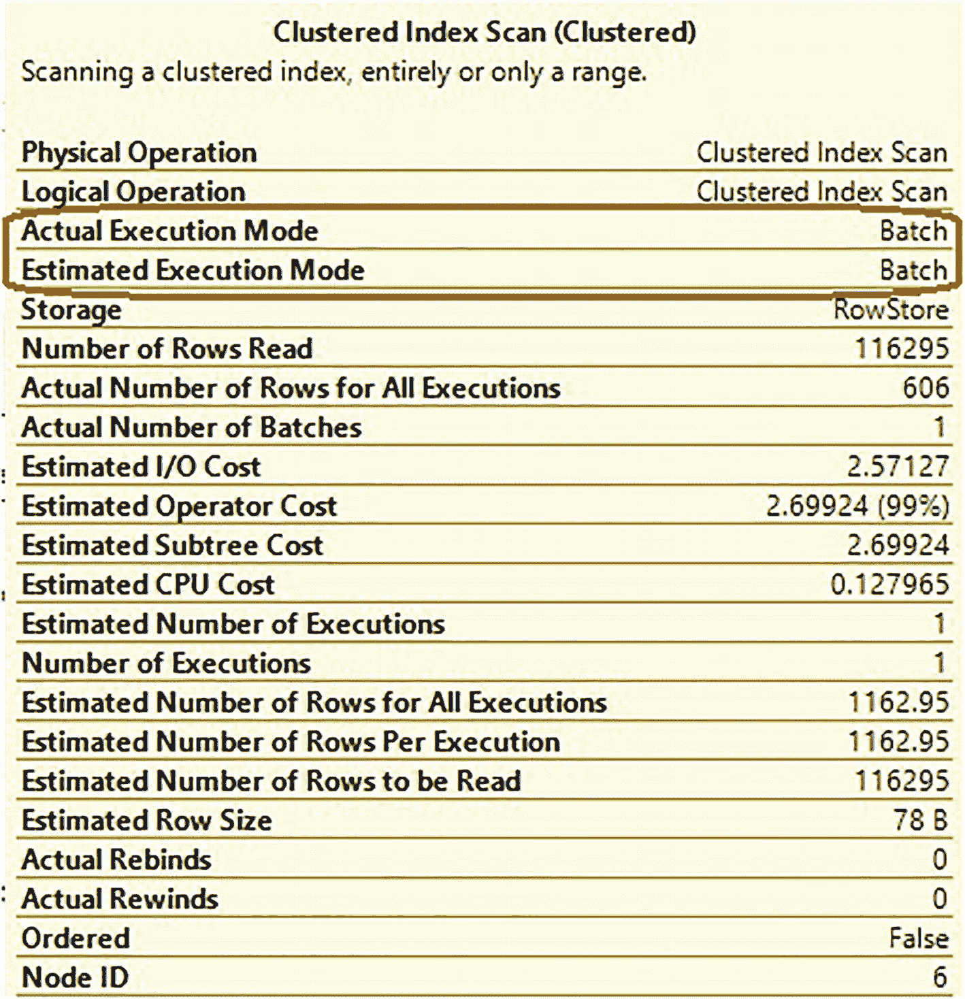

随着 SQL Server 2019 功能的可用，批处理模式被选为行存储聚集索引扫描的执行模式。对于扫描大量行的查询来说，这完全合理。

从 SQL Server 2019 开始，SQL Server 可以对行存储表使用批处理模式，但这将限于行数较高且预计使用批处理模式能提高性能的场景。在 SQL Server 2019 之前，批处理模式仅适用于列存储索引。这是一个重大的改进，因为它可以显著提高针对行存储表的分析查询性能。

这引出了一个直接的问题：如果行存储表上的批处理模式可以提高分析性能，那么列存储索引是否仍然有用？如果批处理模式是使列存储索引高性能的唯一特性，那么这个问题是成立的。行存储表上的批处理模式并不提供列存储索引的其他优势，例如列存储压缩、段消除或可操作的元数据。对于主要服务于分析工作负载的表，聚集列存储索引将是正确的解决方案。对于服务于混合 OLAP 和 OLTP 工作负载的表，行存储上的批处理模式将提高性能，并可能消除创建非聚集列存储索引的需要，前提是 OLAP 查询是隔离的且不会一次扫描过多的行。最终，需要通过测试来确定给定应用程序的最佳索引解决方案，但行存储上的批处理模式是一个有用的工具，将有助于此决策过程。有关混合行存储和列存储索引的更多信息，请参见第 12 章和第 13 章。


## `批处理模式如何工作？`

批处理模式处理的目标是提高数据从存储位置到 SQL Server CPU 的吞吐量。为实现这一点，SQL Server 从根本上改变了数据在执行计划中从头至尾的流动方式。

一个查询执行计划可以包含一个或多个操作符，这些操作符在结果返回之前会检索、联接或转换数据。在行模式处理中，行被逐一传递到这些操作符之间。使用行模式时，查询执行的基本工作单元是行。请参考图 7-9 中展示的执行计划。

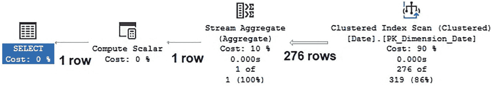

图 7-9

包含行数的行模式执行计划示例

在该执行计划中，一个聚集索引扫描正在检索 276 行，这些行被传入一个聚合操作，产生单行结果并由查询返回。在行模式中，276 行中的每一行都单独地从聚集索引扫描操作符传输到流聚合操作符。

当启用时，批处理模式会同时处理多行，将生成的数据结构作为一组向量存储在内存中。这导致数据在执行计划的操作符之间传递的方式发生了彻底改变。每个批处理最多可消耗 64 KB，并包含 64 到 900 行。行批处理可以如图 7-10 所示。

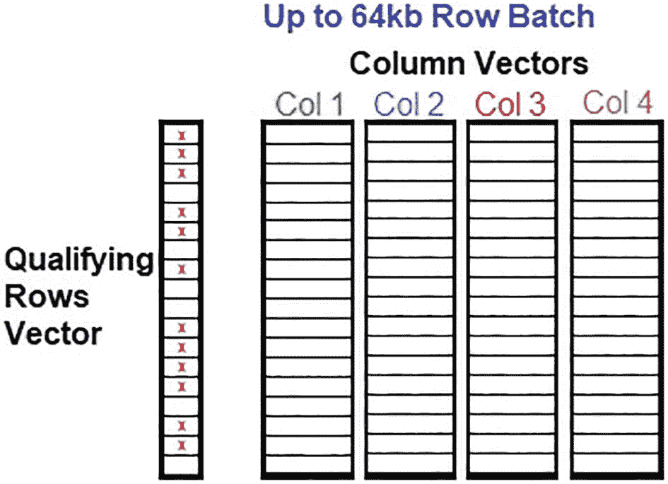

图 7-10

行批处理的基本结构

行批处理在结构上有点类似于列存储索引，并在查询执行时提供类似的内存优势。合格行向量的功能类似于列存储索引的删除位图，因为它标记了批处理不再逻辑上需要的行。例如，如果对数据集应用了筛选器，可以通过仅更新要筛选掉的行的合格行向量来单独处理。

批处理模式处理通过减少数据在执行计划操作符之间传递的次数来降低 CPU 消耗。例如，通过行模式处理 5000 行将需要至少 5000 次 CPU 操作来在计划操作符之间移动它。相同的数据集通过批处理模式处理可能会将每 500 行分配给十个批处理。在这种情况下，数据可以通过 5000/500 = 10 次操作在执行计划操作符之间传递。这些是近似值，但足以说明批处理模式和行模式处理如何影响 CPU 消耗。

批处理模式处理的另一个好处是它能够轻松利用并行处理。批处理可以并行处理，允许具有可用 CPU 容量的多核 CPU 架构更高效地处理查询计划操作符。并行处理是一个需要一些 CPU 开销才能利用的过程。因此，参与并行处理的行数需要足够大，以使将工作负载分解为更小块的好处大于这样做的成本。在这方面，行模式无法像批处理模式那样容易地从并行处理中受益，因为将单行操作拆分为单独的并行操作然后再将它们合并回来的开销远大于该过程提供的微不足道的节省。

虽然批处理模式可能并不总是为行存储表选择，但它将成为列存储索引的默认选择。由于一个行组最多可包含 2²⁰ 行，需要由列存储索引扫描处理的数据量将足够大，以确保 SQL Server 选择批处理模式作为该数据查询提供最佳性能的可能候选方案。

## `批处理模式与行模式性能对比`

虽然列存储索引最常默认使用批处理模式处理，但行存储表可以选择使用哪种模式。该决策将基于查询的基数、需要读取的数据量以及所涉及的 SQL Server 版本。

直接比较查询在使用行模式与使用批处理模式时的性能，并测量批处理模式提供的性能增益是有价值的。

以下查询对列存储索引执行了两次简单的分析操作：一次使用兼容级别 120 (SQL Server 2014)，另一次使用兼容级别 130 (SQL Server 2016)。清单 7-6 提供了执行此比较的代码。

```
ALTER DATABASE WideWorldImportersDW SET COMPATIBILITY_LEVEL = 120;
GO
SELECT
Sale.[City Key],
COUNT(*)
FROM fact.Sale
GROUP BY Sale.[City Key]
ALTER DATABASE WideWorldImportersDW SET COMPATIBILITY_LEVEL = 130;
GO
SELECT
Sale.[City Key],
COUNT(*)
FROM fact.Sale
GROUP BY Sale.[City Key]
清单 7-6
在两个兼容级别下执行的分析查询
```

这些示例查询产生的执行计划立即提供了一个线索，表明此处发生了显著的性能差异，如图 7-11 所见。

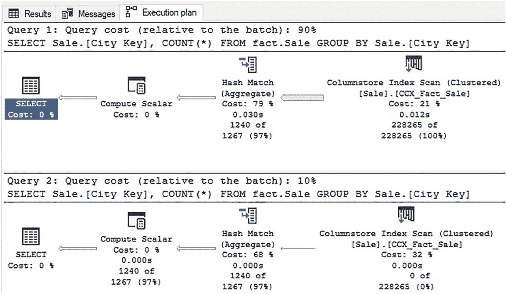

图 7-11

显示显著性能差异的执行计划

这两个执行计划看起来几乎相同，除了第一个查询的开销为 90%，而第二个查询的开销为 10%。此外，还发生了聚合下推，允许我们查询中的 `GROUP BY` 与列存储索引扫描联机处理。这避免了需要将所有 228265 行逐一推送到哈希匹配操作上。图 7-12 比较了每个列存储索引扫描的详细信息。

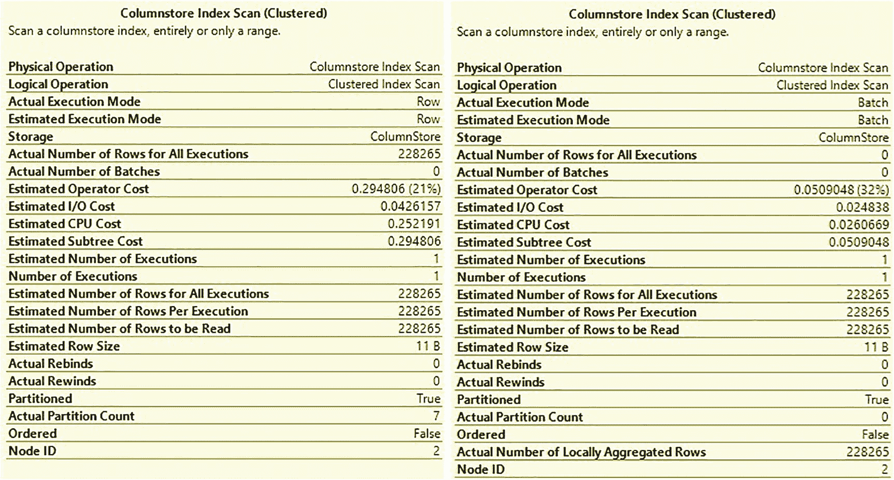

图 7-12

行模式与批处理模式操作的执行计划详细信息

左侧昂贵的执行计划与右侧高效的执行计划之间有几个显著差异：

*   成功使用批处理模式在第二个计划中处理了 228265 行。
*   使用批处理模式的 CPU 消耗比使用行模式少近十倍。
*   `实际本地聚合行数` 记录了聚合下推。

利用批处理模式还允许 SQL Server 利用聚合下推。这些功能的结合使得 CPU 消耗得以大幅降低。

这引出了批处理模式处理的一个重要方面，它进一步提高了其在分析工作负载上的有效性：批处理模式使得在查询优化时能够使用其他强大的性能改进功能。其中一些功能（以及它们启用的最早 SQL Server 版本）包括：

*   自适应联接 (SQL Server 2017)
*   内存授予反馈 (SQL Server 2017)
*   聚合下推 (SQL Server 2016)

一般来说，当 SQL Server 选择使用批处理模式时，其使用将提高性能。类似地，当使用其他智能查询处理功能（如自适应联接或聚合下推）时，它们也会对性能产生积极影响。

测试批处理模式与行模式处理可能具有挑战性，因为强制查询使用其中一种模式并不总是直接的。使此测试更容易的一种方法是使用数据库作用域配置更改来临时禁用这些功能。清单 7-7 中的 T-SQL 提供了在行存储上禁用批处理模式，以及禁用批处理模式内存授予反馈和批处理模式自适应联接所需的语法。


```
ALTER DATABASE SCOPED CONFIGURATION SET BATCH_MODE_ON_ROWSTORE = OFF;
ALTER DATABASE SCOPED CONFIGURATION SET BATCH_MODE_MEMORY_GRANT_FEEDBACK = OFF;
ALTER DATABASE SCOPED CONFIGURATION SET BATCH_MODE_ADAPTIVE_JOINS = OFF;
```
`代码清单 7-7`
`用于禁用优化功能的查询（仅用于测试目的）`

请注意，这些功能应仅在测试环境中禁用，在生产环境中不应关闭，除非有特殊且文档充分的理由。

兼容性级别也可以为了测试和演示目的进行调整。这有助于模拟升级的影响，或让 SQL Server 升级在功能上以较慢的节奏逐步进行。通过将兼容性级别从原始 SQL Server 版本每次逐步上调一级到新版本，可以分步隔离和降低风险。如果需要，这个过程还提供了回滚机制，因为在紧急情况下可以降低兼容性模式。

