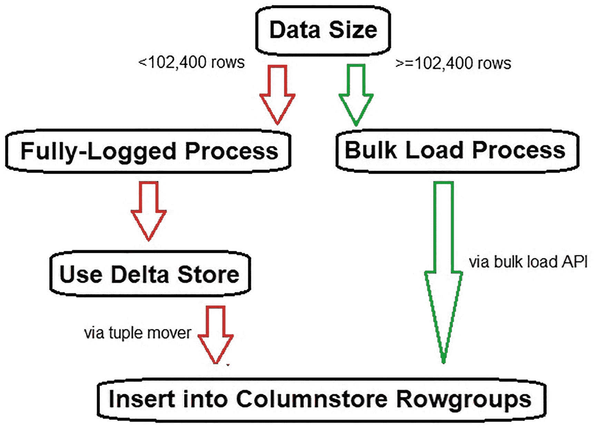

# 8. 大容量加载数据

任何分析型数据存储都需要能够快速高效地执行数据加载。大容量加载是一种减少日志记录的处理过程，允许数据直接插入到列存储索引中。这不仅绕过了`delta store`，而且产生的事务大小反映了目标数据的压缩效果，当使用此过程时，大大减少了写入事务日志的数据量。

## 大容量加载过程详解

传统的事务工作负载是完全日志记录的。在完全日志记录模式下，有足够的元数据被写入事务日志，以便 SQL Server 可以从失败的事务中恢复。此外，数据也会被写入事务日志以确保可以进行时间点恢复。

在 OLTP 场景中，完全日志记录的事务是理想的，因为它们允许在应用程序出现问题时将数据库回滚到特定时间点。此外，时间点恢复允许在需要时对事务细节进行研究和取证。

有时，事务性写入被有意地细分为更小的批次，以确保每个事务简短、快速，并对相同数据的其他查询造成最小的争用。

完全日志记录事务的代价是需要向事务日志写入更多数据，这会导致：

*   事务日志中消耗更多存储空间
*   事务日志备份文件消耗更多存储空间
*   处理事务日志备份消耗更多 CPU/内存
*   写入操作的查询持续时间更长

分析工作负载在其恢复需求方面有很大不同，因为数据加载往往更大、频率更低且异步进行。当分析数据加载失败时，最常见的应对措施是调查问题、解决它，然后重新运行数据加载。数据加载过程中的时间点恢复不如简单地将恢复点设定在数据加载之前那么重要。因此，OLAP 数据加载可以极大地受益于最小日志记录的插入操作。

在列存储索引之外，大容量加载数据仅限于少数写入操作，例如：

*   `BCP`
*   大容量插入操作
*   选择插入操作
*   分区切换

由于时间点恢复对事务系统至关重要，任何使用大容量加载的过程都需要有充分的文档记录，以避免在不希望的情况下意外使用。

列存储索引使用内置的大容量加载过程，自动将较大的批次直接插入到`rowgroup`中，而不使用`delta store`。这极大地提高了大型分析数据加载的插入速度，并减少了这些过程导致的事务日志膨胀。

## 向列存储索引进行大容量加载

决定使用大容量加载过程还是使用`delta store`的临界点是 102,400 行。少于 102,400 行的插入将始终通过完全日志记录的`delta store`进行写入，而 102,400 行或更多的插入将直接写入列存储索引中的`rowgroup`，绕过`delta store`。这个决策过程如图`8-1`所示。

`图 8-1`
向列存储索引大容量加载数据的流程判定

与 SQL Server 中其他类型的最小日志记录插入操作不同，利用大容量加载数据到列存储索引没有先决条件。无需调整隔离级别、使用显式表锁定或调整并行度设置。由于大容量加载数据是大型插入到列存储索引的期望操作，它是默认行为，并在可能时自动使用。

如果一个插入操作包含超过 2²⁰ (1,048,576) 行，它将按以下方式细分：

1.  每批 2²⁰ 行将被大容量插入到列存储索引中，直到剩余行数少于 2²⁰ 行。
2.  如果剩余行数大于或等于 102,400，它也将被大容量插入到列存储索引中。
3.  如果剩余行数少于 102,400，它将被插入到`delta store`中。

例如，如果向列存储索引插入 3,000,000 行，它将被分解如下：

*   2 次大容量加载，每次 1,048,576 行
*   1 次大容量加载，902,848 行（余数）

或者，如果发生 2,100,000 行的插入，它将这样处理：

*   2 次大容量加载，每次 1,048,576 行
*   2,848 行（余数）插入到`delta store`中

只要每个线程的数据目标是不同的数据文件，SQL Server 就可以通过多个并行线程将数据大容量加载到列存储索引中。这是自动完成的，不需要用户进行特殊操作。列存储大容量插入操作对目标`rowgroup`获取排他锁，只要并行插入针对不同的数据文件，它们保证不会重叠到它们正在插入的`rowgroup`。

当数据插入到分区列存储索引时，该数据首先被分配到一个分区，然后每组行被插入到各自的分区中。因此，是否使用大容量加载过程将取决于插入到目标分区的行数，而不是源查询插入的总行数。通常，分析表将有一个当前/活动分区接受新数据，而其余分区将包含不再写入的较旧数据（除非是一次性数据加载、软件发布或维护事件）。

