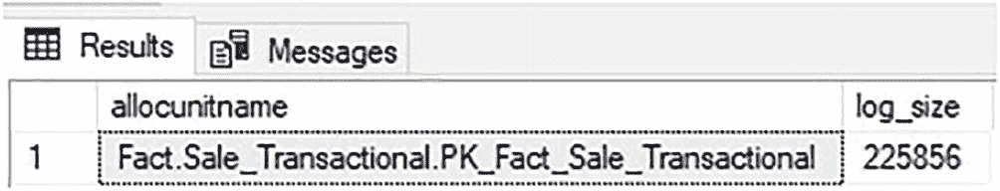
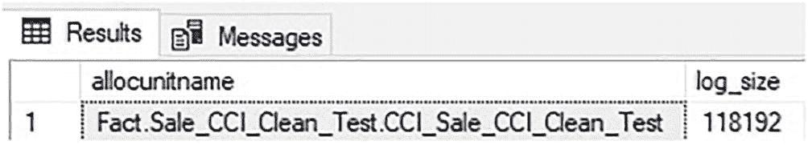
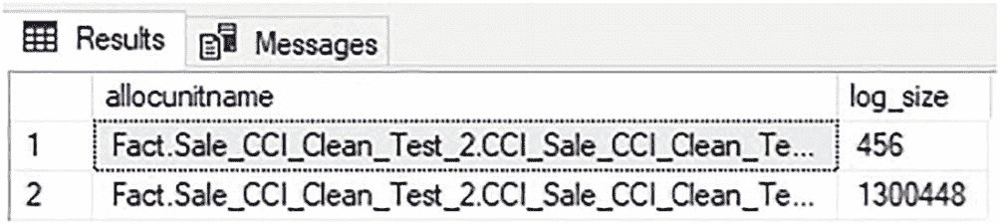
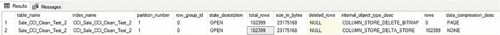
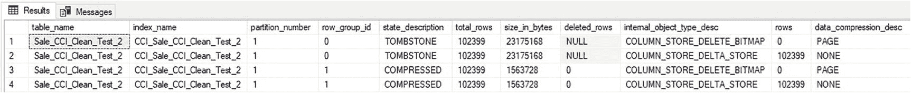
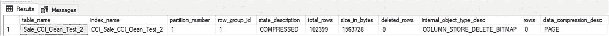

# 批量加载到列存储索引的性能

为了演示批量加载数据对列存储索引的影响，将针对 `Fact.Sale` 的一个行存储副本进行测试。该表的创建过程此处未展示，但它是完全相同的副本，仅包含聚集主键和页压缩，而非聚集列存储索引。此插入查询如清单 8-1 所示。

```sql
INSERT INTO fact.Sale_Transactional
([Sale Key], [City Key],[Customer Key], [Bill To Customer Key], [Stock Item Key], [Invoice Date Key], [Delivery Date Key], [Salesperson Key], [WWI Invoice ID],
Description, Package, Quantity, [Unit Price], [Tax Rate], [Total Excluding Tax], [Tax Amount], Profit, [Total Including Tax], [Total Dry Items],
[Total Chiller Items], [Lineage Key])
SELECT TOP 102400
*
FROM Fact.Sale;
```
**清单 8-1**
向聚集行存储索引插入 102,400 行

插入操作大约需要 1 秒。插入行后，将使用一个未公开记录但很有用的系统函数来读取事务日志的内容并确定事务的大小，如清单 8-2 所示。

```sql
SELECT
fn_dblog.allocunitname,
SUM(fn_dblog.[log record length]) AS log_size
FROM sys.fn_dblog (NULL, NULL)
WHERE fn_dblog.allocunitname = ('Fact.Sale_Transactional.PK_Fact_Sale_Transactional')
GROUP BY fn_dblog.allocunitname;
```
**清单 8-2**
用于计算聚集行存储插入事务大小的查询

结果是一个单行，指示插入事务的总日志大小，如图 8-2 所示。



**图 8-2**
向聚集行存储索引插入 102,400 行的事务大小

行存储插入返回的日志大小为 225,856 字节，约 220KB。现在将对一个具有列存储索引的表的干净副本执行相同的插入操作，如清单 8-3 所示。

```sql
INSERT INTO fact.Sale_CCI_Clean_Test
([Sale Key], [City Key],[Customer Key], [Bill To Customer Key], [Stock Item Key], [Invoice Date Key], [Delivery Date Key], [Salesperson Key], [WWI Invoice ID],
Description, Package, Quantity, [Unit Price], [Tax Rate], [Total Excluding Tax], [Tax Amount], Profit, [Total Including Tax], [Total Dry Items],
[Total Chiller Items], [Lineage Key])
SELECT TOP 102400
*
FROM Fact.Sale;
```
**清单 8-3**
向聚集列存储索引插入 102,400 行

此插入操作完成时间少于 1 秒。使用一个新的干净表是为了确保没有来自先前演示的残留事务污染日志。`fn_dblog()` 的结果如图 8-3 所示。



**图 8-3**
向聚集列存储索引插入 102,400 行的事务大小

请注意，插入操作的事务日志大小为 118,192 字节，约 115KB。与页压缩的行存储索引相比，这显著减少了事务大小。

在演示了批量加载对事务大小的影响后，有必要说明向列存储索引插入 102,400 行与插入 102,399 行之间的差异。清单 8-4 中的 T-SQL 将 102,399 行插入到一个新创建的聚集列存储索引中。

```sql
INSERT INTO fact.Sale_CCI_Clean_Test_2
([Sale Key], [City Key],[Customer Key], [Bill To Customer Key], [Stock Item Key], [Invoice Date Key], [Delivery Date Key], [Salesperson Key], [WWI Invoice ID],
Description, Package, Quantity, [Unit Price], [Tax Rate], [Total Excluding Tax], [Tax Amount], Profit, [Total Including Tax], [Total Dry Items],
[Total Chiller Items], [Lineage Key])
SELECT TOP 102399
*
FROM Fact.Sale;
```
**清单 8-4**
向聚集列存储索引插入 102,399 行

执行此操作大约需要一秒钟。从 `fn_dblog()` 提取数据的查询需要稍作调整，以适应列存储索引本身和增量存储导致的日志增长。如清单 8-5 所示。

```sql
SELECT
fn_dblog.allocunitname,
SUM(fn_dblog.[log record length]) AS log_size
FROM sys.fn_dblog (NULL, NULL)
WHERE fn_dblog.allocunitname IN ('Fact.Sale_CCI_Clean_Test_2.CCI_Sale_CCI_Clean_Test_2', 'Fact.Sale_CCI_Clean_Test_2.CCI_Sale_CCI_Clean_Test_2(Delta)')
GROUP BY fn_dblog.allocunitname;
```
**清单 8-5**
用于计算列存储索引和增量存储日志增长的查询

请注意，需要单独引用增量存储才能将其包含在结果中。每个对象消耗的事务日志空间如图 8-4 所示。



**图 8-4**
向聚集列存储索引插入 102,399 行的事务大小

向增量存储的插入操作比本章迄今为止演示的任何操作都要昂贵得多，事务大小为 1,300,448 字节，约 1.2GB。因此，只要有可能，利用批量加载数据到列存储索引中就存在显著的激励。

## 涓流插入 vs. 分阶段插入

虽然向增量存储插入似乎代价高昂，但它远不及重复向列存储索引插入那么昂贵。如果分析型表经常成为许多较小插入操作的目标，那么在插入列存储索引之前，先将这些行收集到一个临时表中，具有重要的价值。

在涉及行存储表的工作负载中，大型插入操作可能会被批处理成小的行组，以减少争用并减小每次插入的事务大小。列存储索引不会从微批处理中受益。在将代码从行存储表迁移到列存储表时，可以通过调整数据加载过程以处理明显更大的批处理来节省资源。`2²⁰` (1,048,576) 行的批处理是最优的，尽管大于或等于 102,400 的批处理大小将确保不需要增量存储。如果插入操作包含数千万行，则可以将这些插入分解为更易管理的子单元，以防止暂存表或临时表变得过大。

向列存储索引加载数据的最佳实践如下：

1.  每个插入操作至少加载 102,400 行。
2.  可能时，每批加载 1,048,576 行。
3.  仅在数据加载末尾，为剩余行加载少于 102,400 行。

虽然此指导原则似乎表明应不惜一切代价避免使用增量存储，但不应为此目的而损害分析数据存储的目标。为了防止使用增量存储而延迟报告数据是不值得的，并且节省的资源不足以产生意义。主动避免重复的小批插入将确保插入性能相当好。如果数据加载过程的尾部需要增量存储，则没有理由避免它。

## 其他数据加载注意事项

当聚集列存储索引上存在非聚集行存储索引时，VertiPaq 优化（可以极大地提高列存储索引压缩的有效性）将不会被使用。随着时间的推移，这将导致行组消耗比原本更多的资源。

对于需要非聚集行存储索引来支持分析过程的场景，请考虑以下选项来管理列存储索引上的性能。


### 在数据加载期间删除非聚集索引

确保始终使用 Vertipaq 优化的一个简单方法是在数据加载期间删除非聚集行存储索引，并在之后重新创建它们。构建非聚集索引是一项在线操作，不会干扰针对该表的其他查询。这种方法的缺点是，在数据加载过程中，直到非聚集索引重建完成之前，任何使用非聚集索引的分析都会受到影响。构建非聚集索引也需要额外的资源。当非聚集索引较小且构建相对快速时，这种方法最为有效。

对于分区表，只有包含已更改数据的分区需要考虑此问题。通常，包含较旧数据（主要是静态且本质上不发生变化的数据，即非热数据）的分区可以忽略。

对于非聚集索引必要且无法删除的场景，可以考虑进行定期维护，以解决随时间推移出现的压缩效率低下的问题。如果可以安排季度维护，则可以采取以下操作：

1.  删除活动分区上的非聚集索引。
2.  重建活动分区上的聚集列存储索引。
3.  重新创建非聚集索引。

作为一项计划内的维护事件，这些都是相对无害的任务，即使对于较大的表也不应消耗异常多的时间。

### 每次数据加载时的列存储重新组织操作

读取列存储索引时，会连同其内容和增量存储一起读取，以产生必要的输出。虽然增量存储不会变得过大，但通过定期数据加载的列存储索引可以通过强制将增量存储的内容压缩到列存储索引中来略微提高读取速度。清单 8-6 中的查询检查了之前创建的小型列存储索引的内容。

```sql
SELECT
    tables.name AS table_name,
    indexes.name AS index_name,
    partitions.partition_number,
    column_store_row_groups.row_group_id,
    column_store_row_groups.state_description,
    column_store_row_groups.total_rows,
    column_store_row_groups.size_in_bytes,
    column_store_row_groups.deleted_rows,
    internal_partitions.internal_object_type_desc,
    internal_partitions.rows,
    internal_partitions.data_compression_desc
FROM sys.column_store_row_groups
INNER JOIN sys.indexes
    ON indexes.index_id = column_store_row_groups.index_id
    AND indexes.object_id = column_store_row_groups.object_id
INNER JOIN sys.tables
    ON tables.object_id = indexes.object_id
INNER JOIN sys.partitions
    ON partitions.partition_number = column_store_row_groups.partition_number
    AND partitions.index_id = indexes.index_id
    AND partitions.object_id = tables.object_id
LEFT JOIN sys.internal_partitions
    ON internal_partitions.object_id = tables.object_id
WHERE tables.name = 'Sale_CCI_Clean_Test_2'
ORDER BY indexes.index_id, column_store_row_groups.row_group_id;
```
**清单 8-6** 返回列存储索引结构详细信息的查询

结果如图 8-5 所示。


**图 8-5** 小型列存储索引的行组信息

请注意，列存储索引的全部内容（102,399 行）都驻留在增量存储中。删除位图默认存在，目前为空。如果操作员希望将增量存储的内容移动到列存储行组中，可以通过清单 8-7 中的索引维护命令来完成。

```sql
ALTER INDEX CCI_Sale_CCI_Clean_Test_2 ON Fact.Sale_CCI_Clean_Test_2 REORGANIZE WITH (COMPRESS_ALL_ROW_GROUPS = ON);
```
**清单 8-7** 用于压缩增量存储的索引重新组织命令

完成后，增量存储将被压缩并准备好移入列存储索引，如图 8-6 所示。


**图 8-6** 索引维护对列存储增量行组的影响

结果显示，受索引维护影响的增量行组现在处于中间状态。已创建一个新对象并进行了压缩，增量行组的内容已插入其中。先前的增量行组（一个未压缩的堆）处于墓碑状态，以供元组移动器在稍后时间点移除。请注意未压缩的增量行组与压缩行组之间的显著大小差异。

此时，再次运行与之前相同的 `ALTER INDEX` 语句将强制元组移动器完成此清理工作。或者，等待一小段时间也会达到相同的效果。5 分钟过去后，此列存储索引的内容如图 8-7 所示。


**图 8-7** 元组移动器执行后的列存储索引内容

一旦元组移动器完成其清理过程，剩下的就只是一个压缩的列存储行组。

执行此类维护并非必需，但可以在数据加载完成后提高针对列存储索引的查询读取速度。索引维护将在第 14 章中更详细地讨论，包括其作为数据加载和其他列存储过程的一部分的使用。

## 总结

在将数据加载到列存储索引中时，批量加载可确保最快的加载速度，同时最小化服务器资源消耗。以较少的批次批量加载大量行，远比使用逐条或小批量插入高效得多。

通过专注于围绕最大化压缩列存储行组的使用和最小化增量存储的使用来构建数据加载处理，可以提高整体列存储索引性能，无论是对于数据加载过程还是对于使用新加载数据的分析。

