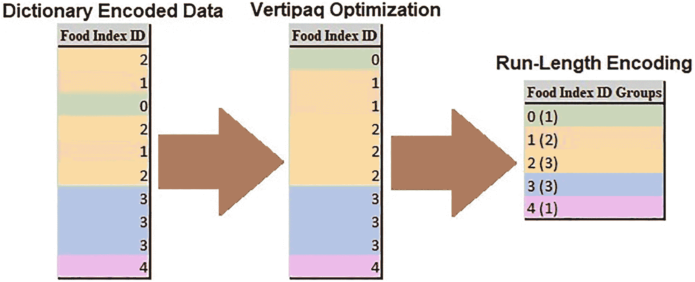
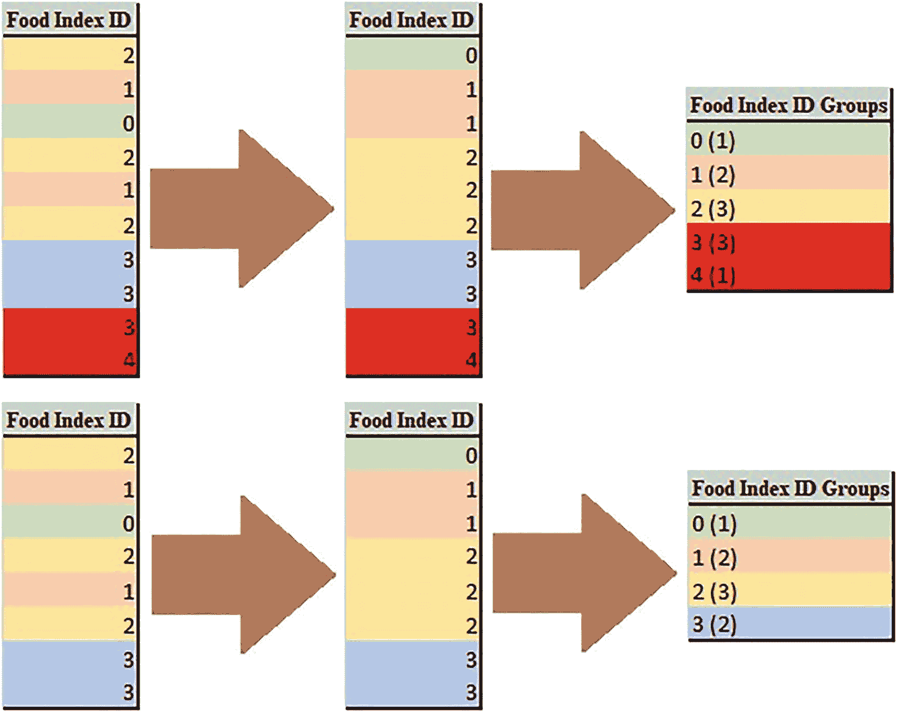
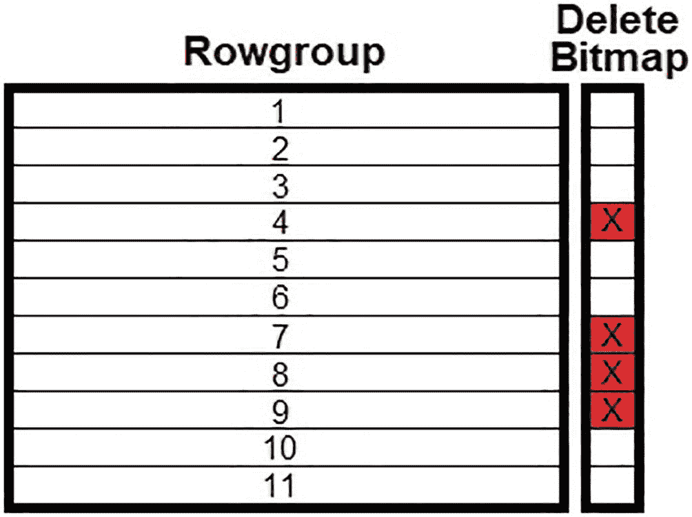
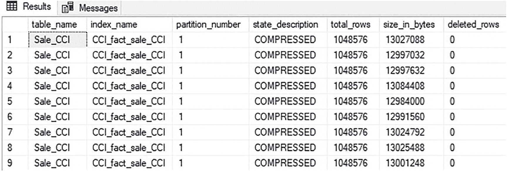
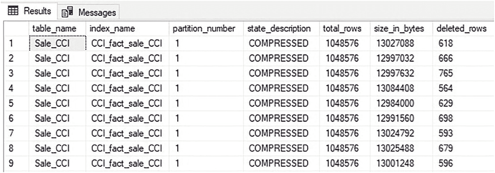

# 9. 删除和更新操作

在高度压缩的结构中修改数据代价高昂，并且需要额外的流程来成功管理。插入操作可以从批量加载中受益，以简化数据加载过程，而删除和更新操作则需要使用删除位图和增量存储来管理对现有数据的更改。


## 修改数据的代价

在第 5 章中，我们详细讨论了列存储压缩。一个重要的结论是，某些压缩形式，例如行程长度编码，依赖于底层数据的确切内容。列存储压缩通过应用各种编码、压缩算法和优化，在大幅缩减数据量方面表现得*异常出色*。请看图 9-1 中的示例数据。



图 9-1：使用行程长度编码进行编码的示例数据

示例数据使用字典压缩进行编码，通过 Vertipaq 优化重新排序，并进一步使用行程长度编码进行压缩。如果一个进程删除了表中的最后两行，那么就需要完全解压缩数据，删除行，然后重新压缩。图 9-2 展示了这个过程将如何影响数据。



图 9-2：从行程长度编码的数据中删除行

生成的索引 ID 组集合现在只包含 4 行，而不是 5 行（因为索引 ID 4 已被移除），并且索引 ID 3 的计数也已减少。

如果表更大，并且删除影响了更多行，那么很可能需要解压缩、调整和重新压缩许多 `rowgroups`。在此过程中，许多页面都需要被更新。这个操作很快就会变得代价高昂。需要在写操作的速度和读操作的速度之间保持平衡，而在这种情况下，需要优先考虑快速加载和修改数据的能力。

## 删除操作

在列存储索引中，解压缩 `rowgroups`、删除行以及重新压缩它们的成本非常高。删除操作针对的 `rowgroups` 越多，这个成本就会变得越高。为了减轻这一成本，使用了一种称为 `delete bitmap` 的结构来跟踪从列存储索引中的删除。

`delete bitmap` 是一个堆，它引用底层 `rowgroups` 中的行。当一行被删除时，`rowgroup` 中的数据保持不变，`delete bitmap` 会更新一个指向已删除行的引用。因此，列存储索引中的已删除行可以被视为软删除，即被移除的行被标记出来，但并未物理删除。

请注意，针对 `delta store` 中行的删除操作不需要使用 `delete bitmap`，因为 `delta store` 是一个 `rowstore` 堆，可以根据需要简单地从中删除行，而无需软删除。

当针对包含已删除行的 `rowgroup` 执行查询时，会查询 `delete bitmap`，并将已删除行从结果中排除。`delete bitmap` 可以如图 9-3 所示进行可视化。



图 9-3：删除位图及其与列存储索引的关系

当对 `rowgroup` 中的行执行删除操作时，其底层行保持不变。相反，`delete bitmap` 跟踪哪些行被删除，并在未来针对该 `rowgroup` 发出查询时进行查询。因此，在列存储索引中删除数据不会回收存储空间。

请考虑清单 9-1 中所示的查询。

```
DELETE
FROM Fact.Sale_CCI
WHERE [Invoice Date Key] = '1/1/2016';
```

清单 9-1：从列存储索引中删除数据的查询

执行时，此查询将删除所有发票日期为 2016 年 1 月 1 日的销售数据。在此之前，可以查询 `rowgroup` 元数据以确认当前 `rowgroup` 中没有已删除的行。清单 9-2 中的查询将返回此列存储索引中 `rowgroups` 的元数据，包括已删除行的数量（如果有的话）。

```
SELECT
tables.name AS table_name,
indexes.name AS index_name,
partitions.partition_number,
column_store_row_groups.state_description,
column_store_row_groups.total_rows,
column_store_row_groups.size_in_bytes,
column_store_row_groups.deleted_rows
FROM sys.column_store_row_groups
INNER JOIN sys.indexes
ON indexes.index_id = column_store_row_groups.index_id
AND indexes.object_id = column_store_row_groups.object_id
INNER JOIN sys.tables
ON tables.object_id = indexes.object_id
INNER JOIN sys.partitions
ON partitions.partition_number = column_store_row_groups.partition_number
AND partitions.index_id = indexes.index_id
AND partitions.object_id = tables.object_id
WHERE tables.name = 'Sale_CCI'
ORDER BY indexes.index_id, column_store_row_groups.row_group_id;
```

清单 9-2：返回有关 Rowgroups 中已删除行元数据的查询

`rowgroup` 元数据如图 9-4 所示。



图 9-4：列存储索引的 Rowgroup 元数据，包括已删除行

正如对一个未执行过任何删除操作的列存储索引所预期的那样，`sys.column_store_row_groups` 中的 `deleted_rows` 列对每个 `rowgroup` 都显示为零。执行清单 9-1 中的查询将从列存储索引中删除总计 15,400 行。图 9-5 显示了删除完成后列存储索引的元数据详细信息。



图 9-5：发生删除后的 Rowgroup 元数据

现在每个 `rowgroup` 都包含一定数量的已删除行，具体取决于其中碰巧在 2016 年 1 月 1 日开票的行数。请注意，每个 `rowgroup` 中的总行数和字节大小并未改变。这是预料之中的，反映了行是通过 `delete bitmap` 进行软删除的这一事实。

由于行是从索引中的所有 `rowgroups` 中移除的，如果没有 `delete bitmap` 的帮助，这次删除将需要重建整个索引，而为了等待删除单日的行数据而执行如此昂贵的操作是不现实的。相反，删除 15,400 行的操作异常快速地在不到一秒内完成，这要归功于 `delete bitmap`！

清理已删除行并释放 `rowgroups` 内所占用空间的唯一方法是对列存储索引或受删除影响的任何分区执行索引重建。这通常不是必需的，除非被删除数据的量相对于索引的总体大小变得很大。与经典的 `rowstore` 索引一样，碎片化在变得过多之前并不是问题，此时可以通过重建来解决。请注意，索引 `reorganize`（重组）操作**不会**从列存储索引中移除已删除的行！第 14 章将深入探讨索引维护，讨论其何时以及如何需要，以及使用的最佳实践。


