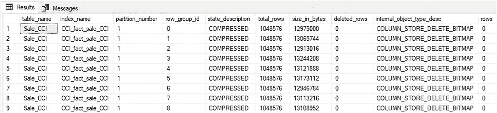
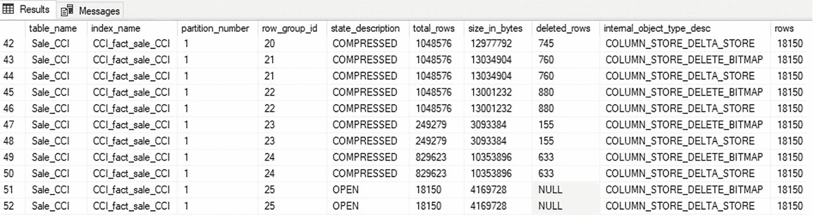
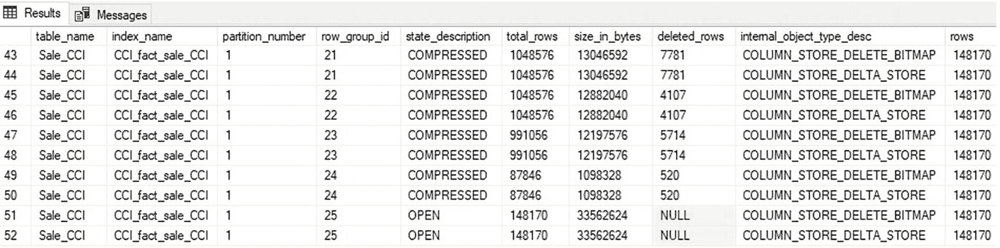
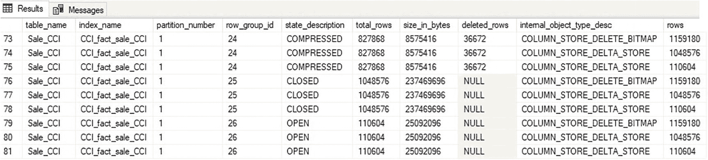
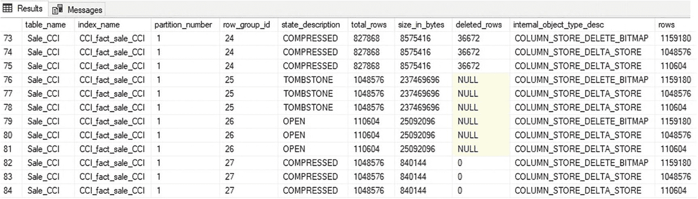

# 更新操作

在列存储索引中，更新操作被作为两个操作执行：删除和插入。从逻辑上看，更新将作为单个原子单元执行，但在底层，它将由以下部分组成：

1.  一组被删除的行，在删除位图中被标记。
2.  一组新插入的行，写入到增量存储中。

这意味着更新操作需要写入到删除位图和增量存储才能成功完成。同样重要的是要注意，由列存储索引的更新操作所产生的插入操作将**专门使用**增量存储，并且无法利用批量加载进程。

在继续之前，将对列存储索引执行一次重组，以便于结果的可视化。清单 9-3 中的查询将重建索引。

```sql
ALTER INDEX CCI_fact_sale_CCI ON Fact.Sale_CCI REBUILD;
```

**清单 9-3**
重建列存储索引并移除删除位图的查询

现在数据已清理干净，可以使用清单 9-4 中的查询来返回列存储索引中所有行组的元数据，包括增量存储和删除位图。

```sql
SELECT
    tables.name AS table_name,
    indexes.name AS index_name,
    partitions.partition_number,
    column_store_row_groups.row_group_id,
    column_store_row_groups.state_description,
    column_store_row_groups.total_rows,
    column_store_row_groups.size_in_bytes,
    column_store_row_groups.deleted_rows,
    internal_partitions.internal_object_type_desc,
    internal_partitions.rows
FROM sys.column_store_row_groups
INNER JOIN sys.indexes
    ON indexes.index_id = column_store_row_groups.index_id
    AND indexes.object_id = column_store_row_groups.object_id
INNER JOIN sys.tables
    ON tables.object_id = indexes.object_id
INNER JOIN sys.partitions
    ON partitions.partition_number = column_store_row_groups.partition_number
    AND partitions.index_id = indexes.index_id
    AND partitions.object_id = tables.object_id
LEFT JOIN sys.internal_partitions
    ON internal_partitions.object_id = tables.object_id
WHERE tables.name = 'Sale_CCI'
ORDER BY indexes.index_id, column_store_row_groups.row_group_id;
```

**清单 9-4**
返回列存储索引中行组的删除位图和增量存储元数据的查询

图 9-6 中的结果显示了一个干净的列存储索引，其中没有已删除的行，增量存储中也没有条目。



**图 9-6**
未对其执行删除/更新操作的行组的元数据

有了这个原始的列存储索引，就可以轻松地可视化更新操作对它产生的影响。考虑清单 9-5 中所示的查询。

```sql
SELECT
    *
FROM Fact.Sale_CCI
WHERE [Invoice Date Key] = '1/2/2016';
```

**清单 9-5**
用于标识要更新的数据集的查询

这个 `SELECT` 查询标识了表中总共 18,150 行，这些行匹配发票日期为 '1/2/2016' 的筛选条件。接下来，将对表中的两个列进行更新，如清单 9-6 所示。

```sql
UPDATE Sale_CCI
SET [Total Dry Items] = [Total Dry Items] - 1,
    [Total Chiller Items] = [Total Chiller Items] + 1
FROM Fact.Sale_CCI
WHERE [Invoice Date Key] = '1/2/2016';
```

**清单 9-6**
用于从列存储索引更新数据的查询

回到清单 9-4 中的行组元数据查询，可以查看 `UPDATE` 语句的结果，示例如图 9-7 所示。



**图 9-7**
更新 18,150 行后的行组元数据

执行 `UPDATE` 后的元数据表明，列存储索引中的每个行组都受到了影响，因为 18,150 行被删除，然后又有 18,150 行被插入。`` `Sys.internal_partitions` `` 显示了一个删除位图和一个增量存储对象，每个都包含总共 18,150 行。行组详细信息说明了每个行组更新了多少行。此外，新的行组（编号 25）显示了为新插入的行创建的新打开的增量存储。

由此产生的结构强调了这样一个事实：针对列存储索引的 `UPDATE` 操作是作为离散的删除和插入操作的组合来执行的。顺序执行这些操作中的每一个都会产生类似的结果。

考虑针对此列存储索引中发票日期范围从 '1/3/2016' 到 '1/8/2016' 的所有行进行更新。对这些行的计数显示，匹配该日期筛选条件的总共有 148,170 行。在运行更新之前，将重建列存储索引，这将清理已删除的行和增量存储，以便更好地演示。清单 9-7 提供了重建索引然后更新这些行的查询。

```sql
ALTER INDEX CCI_fact_sale_CCI ON Fact.Sale_CCI REBUILD;
GO
UPDATE Sale_CCI
SET [Total Dry Items] = [Total Dry Items] - 1,
    [Total Chiller Items] = [Total Chiller Items] + 1
FROM Fact.Sale_CCI
WHERE [Invoice Date Key] >= '1/3/2016'
  AND [Invoice Date Key] < '1/8/2016';
```

**清单 9-7**
在重建索引后更新列存储索引中 148,170 行的查询

当更新 148,170 行时，首先要注意的是它执行了整整 5 秒！之前的 18,150 行更新在执行后几乎瞬间完成。查看元数据揭示了原因，如图 9-8 所示。



**图 9-8**
更新 148,170 行后的行组元数据

从更大更新后的元数据中得出的关键结论是，增量存储包含了此次操作中更新的全部 148,170 行。通常，任何 102,400 行或更多的 `INSERT` 操作都将受益于最小日志记录的批量插入过程，但 `UPDATE` 操作无法从中受益。因为 `UPDATE` 由同一个事务中的 `INSERT` 和 `DELETE` 组成，所以不可能将单个事务拆分为完全日志记录的 `DELETE` 和最小日志记录的 `INSERT`。

列存储索引上的批量插入过程在使用时可以节省大量资源，但不允许违反 SQL Server 数据库的 ACID（原子性、一致性、隔离性和持久性）属性。试图将完全日志记录和最小日志记录的事务拼接成一个更大的事务，需要创建一个事务，该事务将为 `DELETE` 提供时间点恢复功能，但不为 `INSERT` 提供。虽然可以设想 SQL Server 围绕该限制进行架构设计的方法，但这样做会对使用列存储索引的任何人造成困惑，并且在恢复包含频繁执行 `UPDATE` 操作的列存储索引的数据库时，可能导致意外结果。

关键结论是，针对列存储索引的 `UPDATE` 操作将由一个 `DELETE` 操作和一个完全日志记录的 `INSERT` 到增量存储中组成。随着更新行数的增加，这些操作的性能将急剧下降。增量存储是为处理少量行而构建的——无论是涓滴加载还是较大数据加载过程的剩余行。它不是为一次处理大量行而设计的，因此对于此类应用通常会表现不佳。

最后一个演示来强调这一挑战，那就是更新比单个行组所能容纳的更多的行。考虑清单 9-8 中的示例查询。


```
SELECT
COUNT(*)
FROM Fact.Sale_CCI
WHERE [Invoice Date Key] >= '1/8/2016'
AND [Invoice Date Key] < '3/5/2016';
代码清单 9-8
在列存储索引上针对宽日期范围查询行数的查询
```

执行后，统计出的结果为 1,159,180 行。这大于单个列存储索引行组可存储的 1,048,576 行。代码清单 9-9 再次重建索引，然后针对代码清单 9-9 中识别出的全部 1,159,180 行执行一次更新操作。这个单独的 `UPDATE` 操作将导致旧行被删除，新行被插入到增量存储区，并且大多数新行会被压缩到行组中。

```
ALTER INDEX CCI_fact_sale_CCI ON Fact.Sale_CCI REBUILD;
GO
UPDATE Sale_CCI
SET [Total Dry Items] = [Total Dry Items] - 1,
[Total Chiller Items] = [Total Chiller Items] + 1
FROM Fact.Sale_CCI
WHERE [Invoice Date Key] >= '1/8/2016'
AND [Invoice Date Key] < '3/5/2016';
代码清单 9-9
重建索引后，在列存储索引中更新 1,159,180 行的查询
```

此次更新 1,159,180 行的操作用了将近一分钟才完成。图 9-9 显示了在这个大型 `UPDATE` 操作完成后立即产生的列存储元数据。



图 9-9
更新 1,159,180 行后的行组元数据

请注意，存在多个增量存储区。打开的增量存储区（编号 26）将保持打开状态以接受未来插入的数据。关闭的增量存储区将由元组移动器异步处理，并被压缩成永久性的列存储行组。图 9-10 显示了一分钟后，元组移动器执行完毕后，此列存储索引的元数据。



图 9-10
更新 1,159,180 行并允许元组移动器执行后的行组元数据

标记为“TOMBSTONE”（墓碑）状态的行组（编号 25）不再是列存储索引的逻辑组成部分，将在未来通过元组移动器或索引维护进行清理。行组编号 27 包含了行组编号 25 在被元组移动器处理时的内容。总结此次更新 1,159,180 行对列存储索引所做的更改：

1.  所有行组的删除位图中，有 1,159,180 行被标记为已删除。
2.  有 1,048,576 行被插入到一个增量存储区，使其达到容量上限。
3.  有 110,604 行被插入到另一个增量存储区，并保持打开状态以等待未来插入的行。
4.  已满的增量存储区中的 1,048,576 行由元组移动器处理，并被压缩成一个永久行组。

对于单个 `UPDATE` 语句来说，这是一个相当大的工作量，并且随着行数的增加，其扩展性很差。

通常，应将更新操作限制在较小的行数，或者完全避免。重新思考代码编写方式，将针对列存储索引的 `UPDATE` 操作重构为一系列删除和插入操作，或者通过中介进程来管理更新从而完全避免它，是有价值的。列存储索引上 `UPDATE` 操作的性能将是不可预测的，并且足够大的行数会导致事务规模过大，从而给 SQL Server 带来资源压力。

第 15 章（最佳实践）将更详细地讨论如何避免更新，以及在将 `UPDATE` 代码从行存储索引迁移到列存储索引时可以使用的各种策略。

