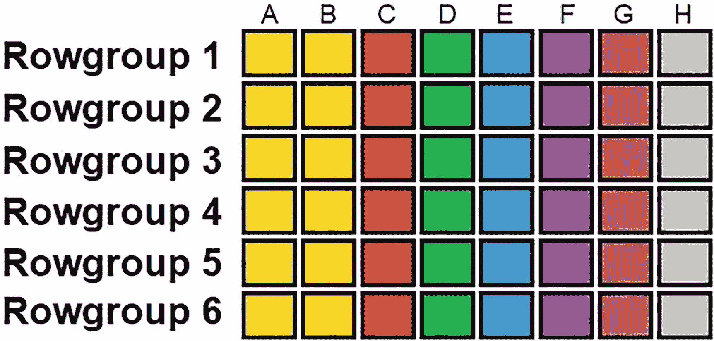
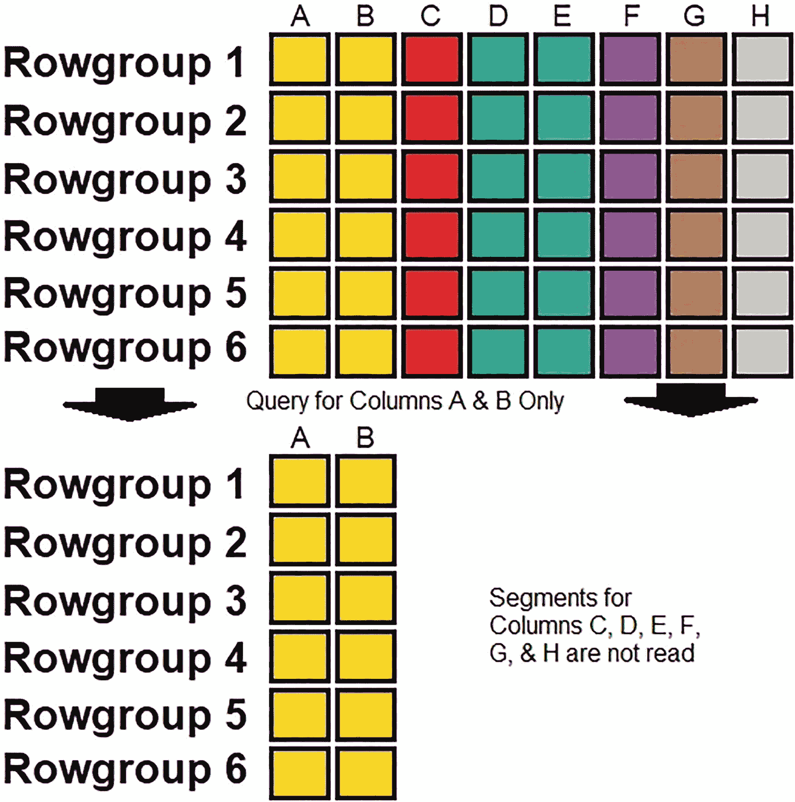

# 10. 段与行组消除

列存储索引运作方式的一个关键组成部分是，索引中的每个段都是其自身的构建块。每个段可以单独或分组读取，但通过任何查询读取的段的数量可以通过高效的架构和最佳的查询模式来减少。减少读取的段直接减少了 IO，提高了查询速度以及与内存相关的性能指标，例如页面生命周期期望值。

## 段消除

每个段代表单个列在一系列行上的数据。当针对列存储索引执行查询时，SQL Server 需要确定哪些行组是返回请求结果集所必需的。在这些行组内，只有包含所选列数据的段才会被读取。因此，选择较少列的查询将读取更少的段，从而减少 IO、内存使用和查询运行时间。

考虑图 10-1 所示的列存储索引。



图 10-1
包含六个行组和八个列的示例列存储索引

有 6 个行组和 8 列，此列存储索引总共包含 48 个段。因为每列都被拆分为其自身的一组段（每个行组一个），所以不需要读取查询不需要的列的段。如果一个示例查询只读取列 A 和 B，结果将是剩余的段可以被自动跳过，如图 10-2 所示。



图 10-2
段消除对两列查询的影响

通过仅查询可能的八列中的两列，读取的段数减少了 75%。这一惯例对于具有任意数量列的列存储索引都成立。如果这个表有 24 列，那么只读取其中 2 列意味着将不读取 22 列。此功能的结果是，列存储索引查询中读取的段数将与查询中涉及的列数成正比。

满足查询所需的列还包括 `WHERE` 子句引用的任何列，以及聚合函数（`GROUP BY`/`HAVING`）中的列。如果查询包含视图或函数，则将评估其内容以确定执行查询所需的列。代码清单 10-1 提供了一个针对列存储索引的示例查询。

```
SELECT
[City Key],
COUNT(*)
FROM fact.Sale_CCI
WHERE [Invoice Date Key] >= '1/1/2016'
GROUP BY [City Key]
ORDER BY COUNT(*) DESC;
代码清单 10-1
使用筛选器和聚合的示例列存储查询
```

此分析查询计算给定时间段内每个城市的销售数量。在 `Sale_CCI` 的 21 列中，只有 2 列是完成此计算所必需的：`City Key` 和 `Invoice Date Key`。因此，在执行此查询时，21 列中的 19 列对应的段将被忽略。

相比之下，行存储表按顺序存储行，每行的每列都一起存储在页上。虽然在行存储索引中读取较少的列可以减少呈现给应用程序的数据量，但它并不能减少为检索查询所需的特定列而读入内存的页数。因此，在列存储索引中减少查询的列数将提供直接的性能优势，而这种优势在行存储索引中并不显著。

段消除是一个简单而强大的工具，可以简化为一个优化技巧：编写查询时只包含所需的列。由于行组最多可包含 `2²⁰` 行，查询不必要的列的成本可能相当高。针对行存储表的事务性查询通常操作少量行，而分析查询一次可能访问数百万行。因此，`SELECT *` 查询表面上的便利性将阻碍列存储索引上的性能。

考虑代码清单 10-2 中的查询。

```
SELECT
*
FROM fact.Sale_CCI
WHERE [Invoice Date Key] = '2/17/2016';
代码清单 10-2
针对列存储索引的 SELECT * 查询
```


