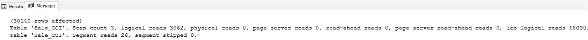
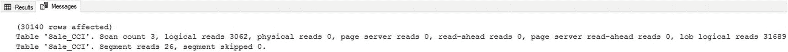
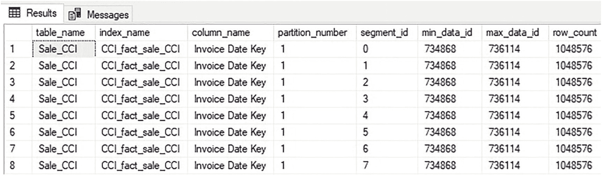
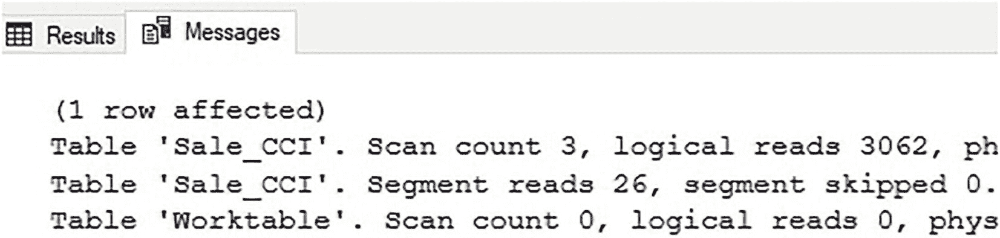
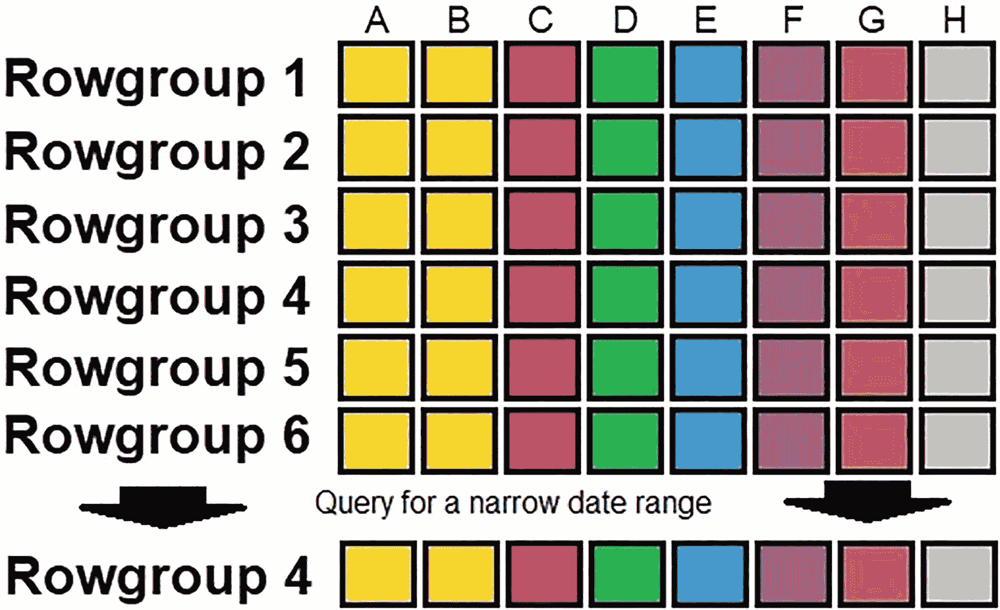
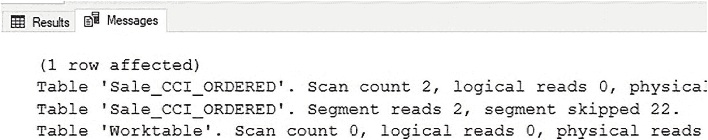
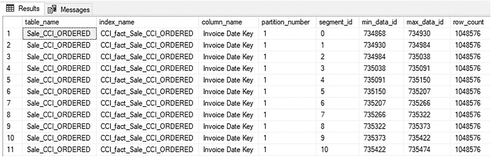

# 列存储索引的查询优化

此 `SELECT *` 查询返回特定日期的所有销售列。虽然只返回 30,140 行，但作为操作的一部分，所有 21 列的段都需要被检索。图 10-3 显示了此查询的 `STATISTICS IO` 输出。


图 10-3 示例 `SELECT *` 查询的 IO

注意总共记录了 68,030 次 `LOB logical reads`。清单 10-3 包含一个替代查询，该查询只返回应用程序所需的一小部分列。

```sql
SELECT
[Sale Key],
[City Key],
[Invoice Date Key]
FROM fact.Sale_CCI
WHERE [Invoice Date Key] = '2/17/2016';
```
清单 10-3 仅请求三列的针对列存储索引的查询

这里，只请求了三列，而不是所有列。由此产生的 IO 可以在图 10-4 中查看。


图 10-4 请求三列数据的示例查询的 IO

当列列表被缩减到仅查询所需的那些时，`LOB logical reads` 从 68,030 减少到 31,689。省略列带来的性能提升会根据每列的数据类型、压缩方式和内容而有所不同。省略一个没有重复值的文本列将比省略一个 `BIT` 列更能显著减少 IO。

段消除是提高查询速度同时减少资源消耗的简单方法。任何针对列存储索引编写查询的人都应考虑其工作负载需要哪些列，并确保不返回额外的列。

## 行组消除

与行存储索引不同，列存储索引没有内置的顺序。插入到列存储索引中的数据是按照 SQL Server 接收到的顺序添加的。因此，行组内数据的顺序就是其插入顺序的直接结果。同样重要的是，`UPDATE` 操作会重新排序列存储索引，从一组行组中删除行，并将新版本插入到最新的开放行组中。

由于压缩行组是一个计算成本高昂的过程，任何形式的内在数据顺序维护成本都将高得令人望而却步。这是设计列存储索引时最重要的概念之一。由于 SQL Server 不强制数据顺序，因此架构师有责任预先确定数据顺序，并确保数据加载过程和常见查询模式都维护该约定的数据顺序。

考虑表 `Dimension.Employee`，它在 `Employee Key` 列上包含一个聚集行存储索引。如果有三名新员工入职并被添加到表中，添加它们的 `INSERT` 操作可以用清单 10-4 中的 T-SQL 表示。

```sql
INSERT INTO Dimension.Employee
([Employee Key], [WWI Employee ID], Employee, [Preferred Name], [Is Salesperson], Photo, [Valid From], [Valid To], [Lineage Key])
VALUES
(   -1, -- Clustered Index
289, N'Ebenezer Scrooge', N'Scrooge', 0, NULL, GETUTCDATE(), '9999-12-31 23:59:59.9999999', 3),
(   213, -- Clustered Index
400, N'Captain Ahab', N'Captain', 0, NULL, GETUTCDATE(), '9999-12-31 23:59:59.9999999', 3),
(   1017, -- Clustered Index
501, N'Holden Caulfield', N'Phony', 0, NULL, GETUTCDATE(), '9999-12-31 23:59:59.9999999', 3);
```
清单 10-4 向 `Dimension.Employee` 表添加三名新员工的查询

有三行被插入到表中，聚集索引 ID 值分别为 -1、213 和 1017。插入时，SQL Server 会根据这些 `Employee Key` 值将每一行按顺序放置在 b-tree 索引中。结果，表在 `INSERT` 操作后将保持按聚集索引排序。

想象一下，如果这个表没有行存储索引，而是有一个聚集列存储索引。在这种情况下，这三行将被插入到开放行组的末尾，而完全不考虑 `Employee Key` 的值。搜索特定 ID 范围的查询将需要检查任何包含这些 ID 的行组。

列存储元数据帮助 SQL Server 根据每个行组中存在的每列的值范围来定位行。考虑使用清单 10-5 中的查询查看 `Fact.Sale_CCI` 中 `Invoice Date Key` 列的元数据。

```sql
SELECT
tables.name AS table_name,
indexes.name AS index_name,
columns.name AS column_name,
partitions.partition_number,
column_store_segments.segment_id,
column_store_segments.min_data_id,
column_store_segments.max_data_id,
column_store_segments.row_count
FROM sys.column_store_segments
INNER JOIN sys.partitions
ON column_store_segments.hobt_id = partitions.hobt_id
INNER JOIN sys.indexes
ON indexes.index_id = partitions.index_id
AND indexes.object_id = partitions.object_id
INNER JOIN sys.tables
ON tables.object_id = indexes.object_id
INNER JOIN sys.columns
ON tables.object_id = columns.object_id
AND column_store_segments.column_id = columns.column_id
WHERE tables.name = 'Sale_CCI'
AND columns.name = 'Invoice Date Key'
ORDER BY tables.name, columns.name, column_store_segments.segment_id;
```
清单 10-5 查询以检查列存储索引单列的元数据

结果如图 10-5 所示。


图 10-5 列存储索引 `Invoice Date Key` 列的元数据


## 无序数据的问题

请注意，*min_data_id* 和 *max_data_id* 对于每个行组都是相同的。这意味着该列包含的数据是无序的。如果查询通常使用 `Invoice Date Key` 进行过滤，则需要扫描列存储索引中的所有行组，才能正确过滤出所需的行。随着列存储索引随时间增长，扫描所有行组的代价会变得非常高。即使在压缩良好的列存储索引上，查询也会变慢，并且服务不可过滤查询所需的 IO 开销也会很高。

`STATISTICS IO` 提供了有关列存储索引扫描期间读取的行组数量的有用指导。为了演示这一点，将使用清单 10-6 中的查询。

```sql
SELECT
SUM([Quantity])
FROM Fact.Sale_CCI
WHERE [Invoice Date Key] >= '1/1/2016'
AND [Invoice Date Key] < '2/1/2016';
-- Listing 10-6
-- Query to Illustrate Rowgroup Reads in a Columnstore Index Scan
```

这是一个典型的分析查询，用于计算给定月份的总销售数量。

当扫描列存储索引时，`STATISTICS IO` 将在输出中包含一条消息，指示读取和跳过的段数。这是衡量必须扫描多少行组才能确定哪些行满足过滤条件、哪些可以自动跳过的指标。图 10-6 显示读取了 26 个段，跳过了 0 个。由于底层数据完全无序，SQL Server 无法使用列存储元数据来跳过任何行组。这代表了一个常见的现实世界挑战，但也是一个容易解决的问题。


*图 10-6 一个无序列存储索引扫描样本的 STATISTICS IO*

## 行组消除

列存储元数据允许在查询过滤器不包含行组中存在的行时跳过行组。此过程称为行组消除，是优化列存储索引性能的关键。实现这一目标的最简单方法是按顺序对数据进行排序，并随时间推移维护该顺序。数据可以按一列或多列排序，这些列将代表分析查询中最常用的过滤器。排序 OLAP 数据最常见的维度是时间。分析通常使用基于时间的单位（如小时、天、周、月、季度和年）来过滤、聚合和可视化数据。图 10-7 显示了行组消除对仅需要基于有序数据满足过滤条件的窄范围数据的查询的影响。


*图 10-7 行组消除对窄范围分析查询的影响*

虽然这个假设索引包含六个行组，但只需其中一个即可满足查询的过滤条件。行组消除的强大之处在于它能随着列存储索引大小的增长而有效扩展。从包含一个月数据的表中请求一周窄范围分析数据的查询，与从包含十年数据的表中执行相同查询的性能是相似的。这是允许列存储索引即使在表中有数十亿行时也能有效扩展的主要特性。

在清单 10-6 的示例中，一个简单的分析查询基于 `Invoice Date Key` 进行过滤，但无序的列存储索引数据强制进行全表扫描以确定哪些行满足过滤条件。如果 `Invoice Date Key` 是分析此数据时最常用的过滤条件，那么按该列排序将允许有效的行组消除。

## 通过有序数据优化

```sql
CREATE TABLE Fact.Sale_CCI_ORDERED
(      [Sale Key] [bigint] NOT NULL,
[City Key] [int] NOT NULL,
[Customer Key] [int] NOT NULL,
[Bill To Customer Key] [int] NOT NULL,
[Stock Item Key] [int] NOT NULL,
[Invoice Date Key] [date] NOT NULL,
[Delivery Date Key] [date] NULL,
[Salesperson Key] [int] NOT NULL,
[WWI Invoice ID] [int] NOT NULL,
[Description] nvarchar NOT NULL,
[Package] nvarchar NOT NULL,
[Quantity] [int] NOT NULL,
[Unit Price] decimal NOT NULL,
[Tax Rate] decimal NOT NULL,
[Total Excluding Tax] decimal NOT NULL,
[Tax Amount] decimal NOT NULL,
[Profit] decimal NOT NULL,
[Total Including Tax] decimal NOT NULL,
[Total Dry Items] [int] NOT NULL,
[Total Chiller Items] [int] NOT NULL,
[Lineage Key] [int] NOT NULL);
CREATE CLUSTERED INDEX CCI_fact_Sale_CCI_ORDERED ON Fact.Sale_CCI_ORDERED ([Invoice Date Key]);
INSERT INTO Fact.Sale_CCI_ORDERED
([Sale Key], [City Key], [Customer Key], [Bill To Customer Key], [Stock Item Key], [Invoice Date Key], [Delivery Date Key],
[Salesperson Key], [WWI Invoice ID], Description, Package, Quantity, [Unit Price], [Tax Rate],
[Total Excluding Tax], [Tax Amount], Profit, [Total Including Tax], [Total Dry Items],
[Total Chiller Items], [Lineage Key])
SELECT
Sale.[Sale Key], Sale.[City Key], Sale.[Customer Key], Sale.[Bill To Customer Key], Sale.[Stock Item Key], Sale.[Invoice Date Key], Sale.[Delivery Date Key],
Sale.[Salesperson Key], Sale.[WWI Invoice ID], Sale.Description, Sale.Package, Sale.Quantity, Sale.[Unit Price], Sale.[Tax Rate],
Sale.[Total Excluding Tax], Sale.[Tax Amount], Sale.Profit, Sale.[Total Including Tax], Sale.[Total Dry Items],
Sale.[Total Chiller Items], Sale.[Lineage Key]
FROM fact.Sale
CROSS JOIN
Dimension.City
WHERE City.[City Key] >= 1 AND City.[City Key] <= 110;
-- Create a clustered columnstore index on the table, removing the existing clustered rowstore index.
CREATE CLUSTERED COLUMNSTORE INDEX CCI_fact_Sale_CCI_ORDERED ON Fact.Sale_CCI_ORDERED WITH (MAXDOP = 1, DROP_EXISTING = ON);
GO
-- Listing 10-7
-- Query to Create a New Columnstore Index Ordered by Invoice Date Key
```

请注意，清单 10-7 中创建的表的数据与本章前面演示的数据相同，但在分配列存储索引之前，先对其进行了聚集行存储索引处理。这个额外的步骤确保了初始数据集按 `Invoice Date Key` 排序。`MAXDOP` 被有意设置为 1 以避免并行处理，因为并行线程可能以多个有序流而不是单个有序流的形式将数据插入列存储索引。

展望未来，新的数据将通过标准数据加载过程定期插入此表。假设新数据包含 `Invoice Date Key` 的最新值，那么随着新数据的添加，列存储索引在未来将保持有序。

## 验证优化效果

为了测试数据顺序对 `Fact.Sale_CCI_ORDERED` 的影响，将针对它执行清单 10-6 中的查询，输出选项卡显示在图 10-8 中。


*图 10-8 一个过滤后的列存储索引扫描样本的 STATISTICS IO*

SQL Server 不再需要读取列存储索引中的每一个行组，而只需要读取其中两个，其余的都被跳过了。`STATISTICS IO` 中跳过的段表明行组消除正在成功实施。清单 10-5 中的元数据查询也可以针对这个有序表重新运行，以说明数据顺序如何影响列存储元数据，结果如图 10-9 所示。


*图 10-9 有序列存储索引中 Invoice Date Key 列的元数据*


