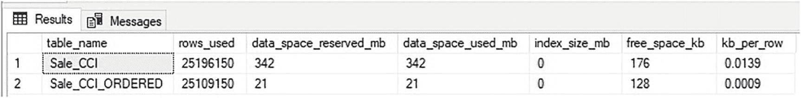
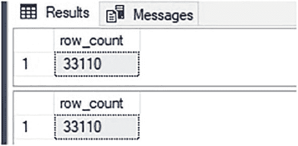
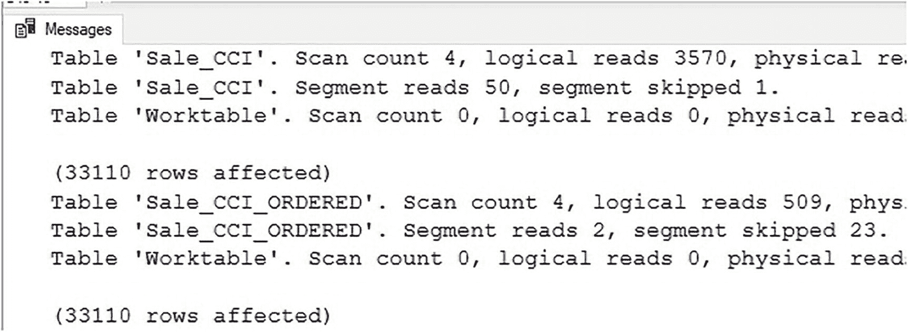

# 有序列存储索引的性能优势

对于每一个行组，`min_data_id` 和 `max_data_id` 的值相较于无序列存储索引发生了剧烈变化。这些值不再在每个行组内保持相同，而是随着数据从第一行组向后推进，从低值逐渐进展到高值。从实际角度看，假设一个查询需要数据 ID 为 735270 的数据，那么它只需要读取与此`segment_id = 7`相关的行组。由于元数据表明其余段不包含此值，它们（及其关联的行组）可以被自动跳过。

## **空间节省与压缩优势**

按键列对数据进行排序是启用行组消除的简单方法，从而减少查询资源消耗并提高任何能利用该数据顺序的查询速度。有效的数据顺序不仅能减少读取量，还可以通过提高底层数据的压缩率来节省存储空间。代码清单 10-8 包含一个脚本，用于检索本章中提到的两个列存储索引所使用的数据空间。

```sql
CREATE TABLE #storage_data
(      table_name VARCHAR(MAX),
rows_used BIGINT,
reserved VARCHAR(50),
data VARCHAR(50),
index_size VARCHAR(50),
unused VARCHAR(50));
INSERT INTO #storage_data
(table_name, rows_used, reserved, data, index_size, unused)
EXEC sp_MSforeachtable "EXEC sp_spaceused '?'";
UPDATE #storage_data
SET reserved = LEFT(reserved, LEN(reserved) - 3),
data = LEFT(data, LEN(data) - 3),
index_size = LEFT(index_size, LEN(index_size) - 3),
unused = LEFT(unused, LEN(unused) - 3);
SELECT
table_name,
rows_used,
reserved / 1024 AS data_space_reserved_mb,
data / 1024 AS data_space_used_mb,
index_size / 1024 AS index_size_mb,
unused AS free_space_kb,
CAST(CAST(data AS DECIMAL(24,2)) / CAST(rows_used AS DECIMAL(24,2)) AS DECIMAL(24,4)) AS kb_per_row
FROM #storage_data
WHERE rows_used > 0
AND table_name IN ('Sale_CCI', 'Sale_CCI_ORDERED')
ORDER BY CAST(reserved AS INT) DESC;
DROP TABLE #storage_data;
```
代码清单 10-8
查询两个列存储索引使用的数据空间

结果显示在图 10-10 中。



图 10-10

有序和无序列存储索引使用的空间

每个表使用的数据空间差异显著，有序表消耗的空间不到无序表使用空间的 10%。这是一个异常生动的例子，展示了有序数据如何比无序数据存储得更高效。有序数据节省空间，通常是因为数据与短时间内捕获的其他数据更相似，而与相隔数年收集的数据相比则差异较大。在任何应用程序中，使用模式会随着时间而改变，因为新功能发布、旧功能废弃以及用户行为变化。因此，随着时间推移，数据样本会变得越来越不同。这些相似性使得压缩算法能够利用具有较少不同值的公共维度的数据集。这也减少了字典大小，有助于防止字典被填满并强制创建过小的行组。

现实世界的数据压缩效果可能不如这里的示例那么令人印象深刻，但预计会有明显的节省，这将对数据加载过程和分析速度产生积极影响。重要的是要记住，节省存储空间也节省了内存，因为数据在应用程序需要之前会保持压缩状态。因此，如果一个有序数据集的大小减少了 25%，那么缓冲池中由列存储索引页面消耗的内存也将减少 25%。此外，服务器性能的其他常见衡量指标，如页面预期寿命和闩锁，也会得到改善，因为较小的对象可以更快地检索，并且与较大的对象相比，对内存中其他数据的影响更小。

## 更新和删除操作的性能改进

有序列存储索引还通过允许`UPDATE`和`DELETE`操作针对更少的页面来提高其速度。例如，考虑对有序和无序销售表的查询，如代码清单 10-9 所示。

```sql
SELECT COUNT(*) AS row_count FROM Fact.Sale_CCI WHERE [Invoice Date Key] = '1/1/2015';
SELECT COUNT(*) AS row_count FROM Fact.Sale_CCI_ORDERED WHERE [Invoice Date Key] = '1/1/2015';
```
代码清单 10-9
查询两个列存储索引表的样本行数

结果显示在图 10-11 中，每个表中受影响的行数是相同的。



图 10-11

针对有序和无序列存储索引的样本查询的行数

对于每个表，使用相同过滤器的更新将影响 33,110 行。代码清单 10-10 提供了针对每个表的一个简单`UPDATE`语句。

```sql
UPDATE Sale_CCI
SET [Total Dry Items] = [Total Dry Items] - 1,
[Total Chiller Items] = [Total Chiller Items] + 1
FROM Fact.Sale_CCI_ORDERED -- Unordered
WHERE [Invoice Date Key] = '1/1/2015';
UPDATE Sale_CCI
SET [Total Dry Items] = [Total Dry Items] - 1,
[Total Chiller Items] = [Total Chiller Items] + 1
FROM Fact.Sale_CCI_ORDERED -- Ordered
WHERE [Invoice Date Key] = '1/1/2015';
```
代码清单 10-10
在两个列存储索引表中更新 33,110 行的查询

图 10-12 中的结果显示了每个`UPDATE`操作产生的 IO 和行组使用情况。



图 10-12

针对有序和无序列存储索引的更新的 STATISTICS IO 输出

请注意 IO 以及每个操作的段读取量的巨大差异。由于一个`UPDATE`包含一个`DELETE`和一个`INSERT`，SQL Server 必须执行以下任务来完成每个更新：

1.  定位所有符合过滤条件的行。
2.  读取所有符合过滤条件的行的所有列。
3.  在删除位图中将这些行标记为已删除。
4.  将这些行的新版本插入到增量存储中。

为了插入更新行的新版本，SQL Server 需要完整读取现有行，这不是一个简单的操作。一旦读取，这些行将被标记为已删除，新版本将被插入到增量存储中。这是一个昂贵的过程，但有序数据允许读取的行组少得多，从而减少了为插入到增量存储而准备必要数据所需的工作。

`DELETE`操作也得到了类似的改进，但需要的工作量要少得多，因为它们只需要：

1.  定位所有符合过滤条件的行。
2.  在删除位图中将这些行标记为已删除。

对于这两种情况，当过滤条件符合表中使用的顺序时，有序列存储索引将极大地提高`UPDATE`和`DELETE`性能。作为额外的好处，有序列存储索引将导致更少的碎片。删除操作可以被隔离到更少的行组中，而不是在大多数（或所有）行组中将行标记为已删除。


