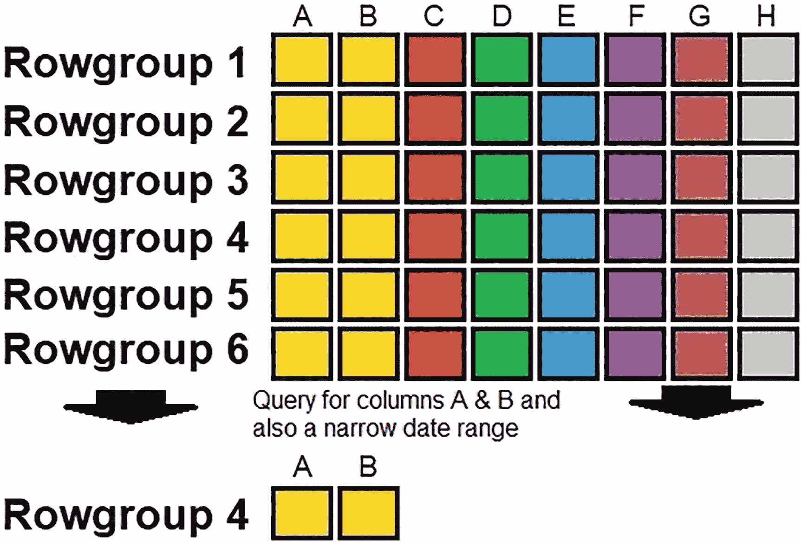
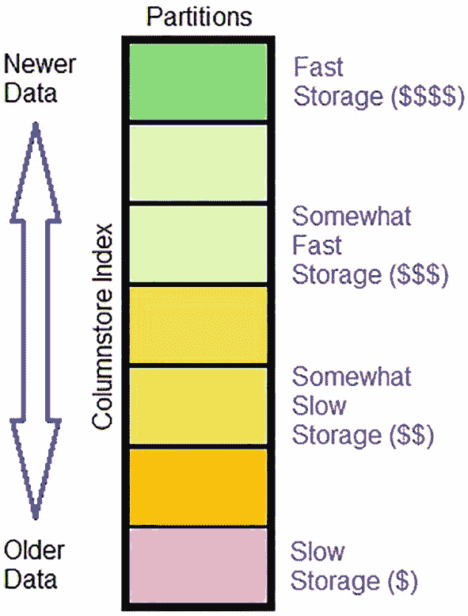
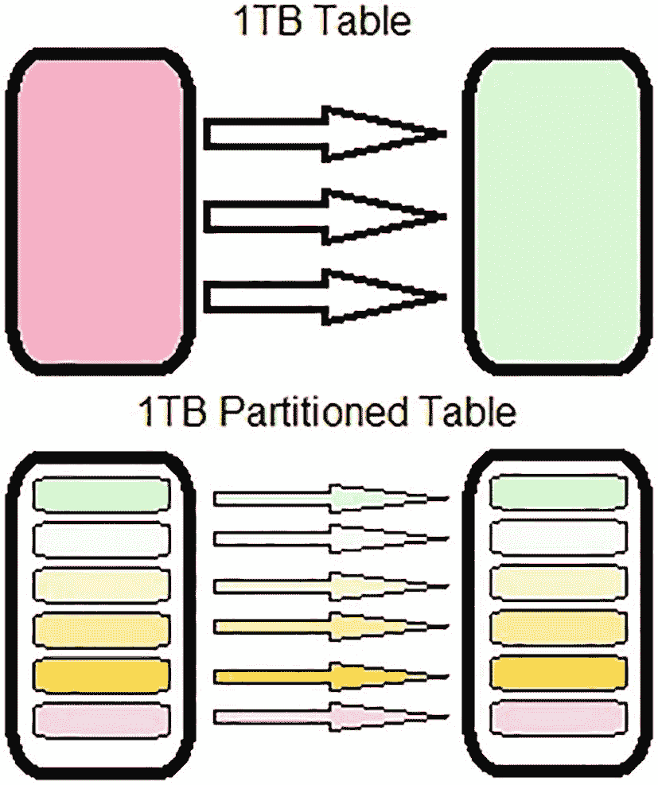
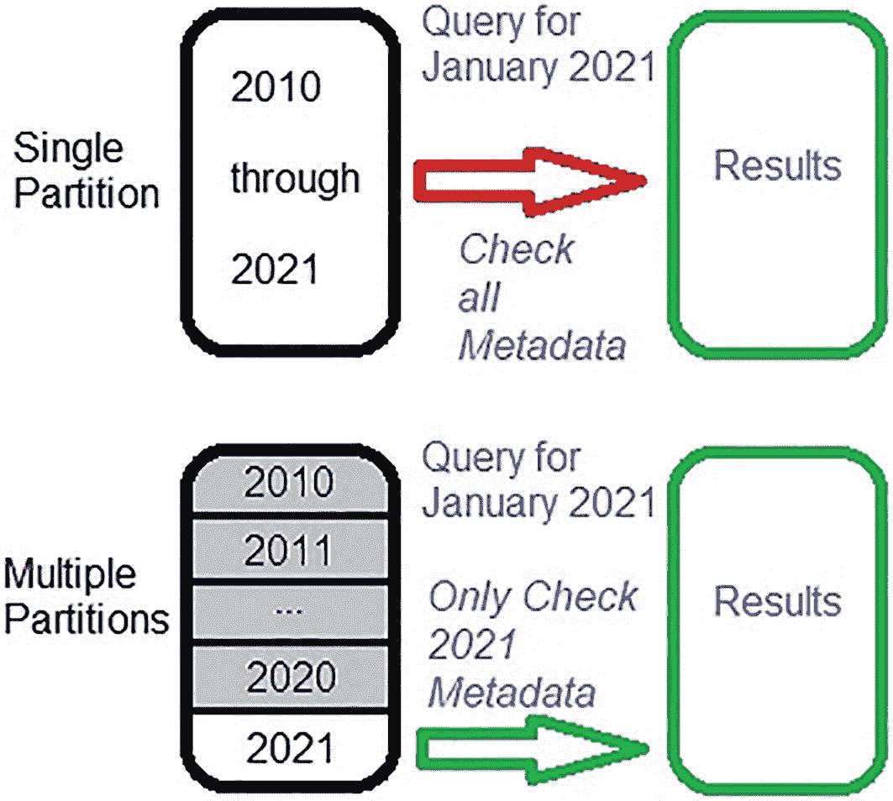
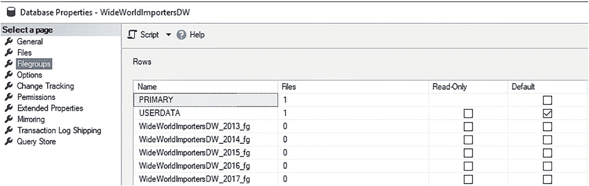
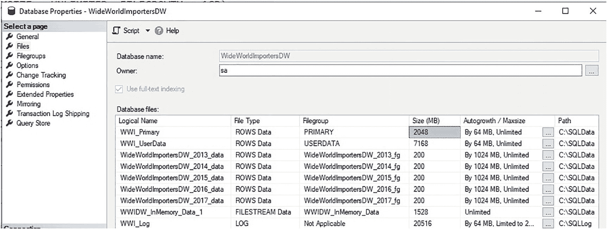

# 11. 分区

## 结合段消除与行组消除

段消除允许使用较少列的分析自动读取更少的段，从而减少 IO。行组消除则使有序数据集能够利用列存储元数据，从结果集中移除大量行组，显著降低 IO。

最佳分析工作负载结合了段消除和行组消除，对表进行垂直（行组消除）和水平（段消除）切片。回顾前面图 10-1 中介绍的列存储索引。如果一个分析查询设计为仅查询列 A 和 B，并筛选一个狭窄的日期范围，其产生的行组读取结果将类似于图 10-13。



图 10-13：段消除和行组消除对列存储索引的影响

仅查询列 A 和 B 允许自动跳过列 C 到 H，并消除这些列的所有段（总共 36 个段）。查询一个仅需要行组 4 中行的狭窄日期范围，则可以自动跳过行组 1 到 3 以及 5 到 6，再消除 10 个段。最终结果是，一个查询只需要读取表中 48 个可能段中的 2 个！

结合段消除和行组消除，即使数据量增长或表中添加了更多列，列存储索引查询也能有效扩展。

随着分析表大小的增长，可以明显看出新数据的读取频率远高于旧数据。虽然列存储元数据和行组消除提供了快速过滤大量列存储索引数据的能力，但管理拥有数百万或数十亿行的表可能会变得笨重。

同样重要的是，旧数据往往不经常更改。对于一个典型的事实表，数据按其创建顺序添加到末尾，而旧数据保持不变。如果旧数据被修改，通常是由于软件发布、升级或其他属于数据架构师（也就是我们！）管理范畴的流程导致的。

表分区是聚集列存储索引的自然选择，尤其是当它很大时。分区允许将数据拆分到单个数据库内的多个文件组中。这些文件组可以存储在不同的数据文件中，这些文件又可以存放在对其所包含数据最理想的位置。分区的优点在于表在逻辑上保持不变，其物理结构受其分区方式的细节影响。这意味着应用程序代码无需更改即可从中受益。分区有许多好处，本章将逐一描述。

## 维护热/温/冷数据

如果旧数据使用频率低得多，那么可以将其存储在速度较慢的存储介质上的独立文件中。例如，为历史保存但很少使用的、来自 10 年前的报告数据可以放在廉价的 NAS 存储上，而新数据则可以放在高速的 SSD 或闪存存储上。

具体细节会因组织而异，但图 11-1 提供了一个简单的表示，说明分析表如何分层以利用不同的服务级别。



图 11-1：分区如何影响存储速度和成本

分区允许基于预期的 SLA（服务水平协议）对存储进行分层。对于包含预期高可用和低延迟的新数据分区，可以使用快速且昂贵的存储。对于包含很少访问的旧数据分区，则可以使用较慢且更便宜的存储。具体细节取决于组织，但能够自动将大表高效划分为不同存储层的能力非常有用，从长远来看可以节省大量成本。

## 更快的数据移动/迁移

数据在物理上分开存储意味着可以轻松复制和移动。例如，考虑一个消耗 1TB 存储空间、包含 500 亿行的列存储索引。如果需要以最小停机时间将此表从当前服务器迁移到新服务器，该如何操作？最简单的解决方案涉及数据库备份、复制数据文件，或使用 ETL 缓慢地将数据从一台服务器移动到另一台。所有这些方案都可行，但耗时，并且在数据移动过程开始后，需要承受一些停机时间或使表变为只读。

分区允许旧的/不变的数据驻留在独立的数据文件中，这反过来意味着这些文件可以提前自由备份/复制到新服务器。假设其中内容没有变化，该过程可以在迁移前几天、几周或几个月前进行。在迁移当天，可以使用 ETL 或类似流程来更新目标数据库中的新数据，然后才永久地从旧数据源切换到新数据源。

图 11-2 说明了迁移一个大型/单体表与迁移一个分区表之间的区别。



图 11-2：分区表与非分区表的迁移

分区开辟了对迁移进行逻辑细分的能力，因为知道表的物理存储将在需要时促进逐个复制/移动每个文件。无需一次性移动 terabytes 的数据，也无需被迫针对整个表编写 ETL，表可以被划分为更小的部分，每个部分都更小且更易于移动。

## 分区消除

每个分区的逻辑定义并非仅用于存储目的。它们还协助查询优化器，当查询中的筛选器与分区函数对齐时，允许其自动跳过数据。对于针对列存储索引的查询，其筛选器可以忽略目标分区之外行组的元数据。

例如，如果一个列存储索引包含 2010 年至 2021 年的数据，并按年分区（每年一个分区），那么查询 2021 年 1 月行的请求将能够自动跳过分区中所有 2021 年之前行组。图 11-3 展示了分区消除如何减少读取并进一步加速针对列存储索引的查询。



图 11-3：在分区列存储索引中读取元数据

分区函数在列存储元数据之前进行评估；因此，在执行查询时，不相关分区中的数据会被忽略。虽然列存储元数据可能相对轻量，但能够跳过数千个行组的元数据可以进一步提升分析性能，同时减少 IO 和内存消耗。


## 数据库维护

部分数据库维护任务（例如备份和索引维护）可以逐分区执行。由于较旧分区中的数据很少更改，因此其所需维护频率通常低于新数据。这意味着维护可以集中在最需要维护的特定分区上。这也意味着维护速度可以大幅提升，因为不再需要一次性操作整个表。

此外，数据管理方式可以因分区而异。针对不同分区处理数据的一些方式包括：

*   `压缩`可以按分区进行自定义。在列存储索引中，可以将存档压缩应用于较旧且较少使用的分区，而标准列存储压缩则可以作为新数据的默认设置。

*   分区可以单独进行`截断`，从而快速从表的一部分移除数据，而无需使用 `DELETE` 语句。

*   `分区切换`允许快速高效地将数据移入和移出分区表。这可以显著加快迁移、数据归档以及其他需要一次性移动大量数据的过程。

## 分区实战

为了直观展示分区的工作原理，我们将创建测试表 `Fact.Sale_CLI` 的新版本。此版本将按 `Invoice Date Key` 排序，并按年份进行分区。每个分区需要对应一个文件组，而每个文件组又将包含一个数据文件。在此演示中，我们将为表中代表的每一年创建一个新的文件组和文件。

代码清单 11-1 展示了如何创建用于存储分区表数据的新文件组。

```sql
ALTER DATABASE WideWorldImportersDW ADD FILEGROUP WideWorldImportersDW_2013_fg;
ALTER DATABASE WideWorldImportersDW ADD FILEGROUP WideWorldImportersDW_2014_fg;
ALTER DATABASE WideWorldImportersDW ADD FILEGROUP WideWorldImportersDW_2015_fg;
ALTER DATABASE WideWorldImportersDW ADD FILEGROUP WideWorldImportersDW_2016_fg;
ALTER DATABASE WideWorldImportersDW ADD FILEGROUP WideWorldImportersDW_2017_fg;
```

**代码清单 11-1** 为表中每年的数据创建新文件组的脚本

执行后，可以通过检查数据库属性中的“文件组”菜单来确认新数据库文件组是否存在，如图 11-4 所示。



**图 11-4** 将用于存储分区数据的新文件组

虽然这五个新文件组已存在于数据库中，但它们不包含任何文件。此过程的下一步是向这些文件组添加文件（每个文件组一个）。代码清单 11-2 包含了添加这些文件所需的代码。

```sql
ALTER DATABASE WideWorldImportersDW ADD FILE
(NAME = WideWorldImportersDW_2013_data, FILENAME = 'C:\SQLData\WideWorldImportersDW_2013_data.ndf',
SIZE = 200MB, MAXSIZE = UNLIMITED, FILEGROWTH = 1GB)
TO FILEGROUP WideWorldImportersDW_2013_fg;
ALTER DATABASE WideWorldImportersDW ADD FILE
(NAME = WideWorldImportersDW_2014_data, FILENAME = 'C:\SQLData\WideWorldImportersDW_2014_data.ndf',
SIZE = 200MB, MAXSIZE = UNLIMITED, FILEGROWTH = 1GB)
TO FILEGROUP WideWorldImportersDW_2014_fg;
ALTER DATABASE WideWorldImportersDW ADD FILE
(NAME = WideWorldImportersDW_2015_data, FILENAME = 'C:\SQLData\WideWorldImportersDW_2015_data.ndf',
SIZE = 200MB, MAXSIZE = UNLIMITED, FILEGROWTH = 1GB)
TO FILEGROUP WideWorldImportersDW_2015_fg;
ALTER DATABASE WideWorldImportersDW ADD FILE
(NAME = WideWorldImportersDW_2016_data, FILENAME = 'C:\SQLData\WideWorldImportersDW_2016_data.ndf',
SIZE = 200MB, MAXSIZE = UNLIMITED, FILEGROWTH = 1GB)
TO FILEGROUP WideWorldImportersDW_2016_fg;
ALTER DATABASE WideWorldImportersDW ADD FILE
(NAME = WideWorldImportersDW_2017_data, FILENAME = 'C:\SQLData\WideWorldImportersDW_2017_data.ndf',
SIZE = 200MB, MAXSIZE = UNLIMITED, FILEGROWTH = 1GB)
TO FILEGROUP WideWorldImportersDW_2017_fg;
```

**代码清单 11-2** 向每个新文件组添加文件的脚本

在此演示中，每个文件的大小和增长设置相同，但对于真实世界的表，这些数值会有所不同。通过检查待分区数据的大小，应能相对容易地计算出每年所需的空间量。请注意，一旦表的数据迁移到分区表，原来存储其数据的数据文件将产生额外的可用空间，如果需要，可以回收这些空间。图 11-5 显示了在数据库属性的“文件”菜单下列出的新文件。



**图 11-5** 将用于存储分区数据的新数据库文件

新的数据库文件可以放置在服务器可用的任何存储上。在这里，可以根据表所遵循的任何服务级别协议（SLA）来自定义其数据存储。对于此示例，如果 2016 年之前的数据很少被访问，可以将其放置在速度较慢的存储上的文件中。同样，较新的数据可以保留在更快的存储上，以支持频繁的分析。


配置分区的下一步是确定如何将表中的数据切分到新创建的文件中。这是通过**分区函数**实现的。在使用列存储索引时，请确保表所依据排序的列与分区函数使用的数据类型相同。此约定与聚集行存储索引相同。如果分区函数的数据类型与表中用于排序的目标列不匹配，则在创建表时将抛出错误。在本演示中，分区函数将使用`DATE`数据类型来拆分数据，该数据类型对应于`Fact.Sale_CCI`所依据排序的*Invoice Date Key*列，如清单 11-3 所示。

```
CREATE PARTITION FUNCTION fact_Sale_CCI_years_function (DATE)
AS RANGE RIGHT FOR VALUES
('1/1/2014', '1/1/2015', '1/1/2016', '1/1/2017');
Listing 11-3
Creation of a Partition Function That Organizes Data by Date
```

`RANGE RIGHT`指定创建的边界将使用提供的日期作为起始点来定义。结果是将数据划分为五个桶，如下所示：

1.  所有日期 < `1/1/2014`

2.  日期 >= `1/1/2014` 且 < `1/1/2015`

3.  日期 >= `1/1/2015` 且 < `1/1/2016`

4.  日期 >= `1/1/2016` 且 < `1/1/2017`

5.  日期 >= `1/1/2017`

如果使用`RANGE LEFT`，则会导致日期范围的不等式运算符进行调整，使得边界使用大于和小于等于来检查，而不是前面所示的方式。如果不确定使用哪个，请考虑为基于时间的维度实现`RANGE RIGHT`，因为它通常是一种更自然的划分方式，可以清晰地划分月、季度、年等时间单位。以下列表显示了如果在清单 11-3 的分区函数中使用`RANGE LEFT`，边界将如何定义：

1.  所有日期 <= `1/1/2014`

2.  日期 > `1/1/2014` 且 <= `1/1/2015`

3.  日期 > `1/1/2015` 且 <= `1/1/2016`

4.  日期 > `1/1/2016` 且 <= `1/1/2017`

5.  日期 > `1/1/2017`

这种边界配置对于日期来说有些违反直觉，但对于其他数据类型可能适用。

在表上实现分区之前的最后一步是创建**分区方案**。分区方案用于将分区函数中定义的数据边界映射到之前定义的文件组上。在这里可以决定哪些日期范围对应哪些物理数据库文件。清单 11-4 提供了一个分区方案，它将分区函数定义的每个日期范围分配给五个新创建的文件组之一。

```
CREATE PARTITION SCHEME fact_Sale_CCI_years_scheme
AS PARTITION fact_Sale_CCI_years_function
TO (WideWorldImportersDW_2013_fg, WideWorldImportersDW_2014_fg, WideWorldImportersDW_2015_fg, WideWorldImportersDW_2016_fg, WideWorldImportersDW_2017_fg);
Listing 11-4
Creation of a Partition Scheme to Assign Dates to Database Filegroups
```

请注意，分区函数指定的边界总是比文件组的数量少一个。在此示例中，分区函数提供了四个日期，这些日期形成日期边界，定义了五个不同的日期范围，这些范围随后映射到分区方案上并分配了文件组。如果分区函数提供的边界数量不是比分区方案少一个，则将返回错误，类似于图 11-6 中所见的情况。


Figure 11-6

Error received if partition scheme contains too few filegroup entries

该错误信息足够详细，可以提醒用户该函数生成的分区数量过多或过少，超出了分区方案所能提供的数量。通过写出目标表所需的时间段，生成分区函数和分区方案的任务就变得简单得多。

在定义了数据库文件和文件组，以及分区函数和分区方案之后，实现分区的最后一步是使用新创建的分区方案创建一个表。清单 11-5 创建了*Fact.Sale*的一个新版本，并使用*Invoice Date Key*列在*fact_Sale_CCI_years_scheme*上对其进行分区。

```
CREATE TABLE Fact.Sale_CCI_PARTITIONED
(      [Sale Key] [bigint] NOT NULL,
[City Key] [int] NOT NULL,
[Customer Key] [int] NOT NULL,
[Bill To Customer Key] [int] NOT NULL,
[Stock Item Key] [int] NOT NULL,
[Invoice Date Key] [date] NOT NULL,
[Delivery Date Key] [date] NULL,
[Salesperson Key] [int] NOT NULL,
[WWI Invoice ID] [int] NOT NULL,
[Description] nvarchar NOT NULL,
[Package] nvarchar NOT NULL,
[Quantity] [int] NOT NULL,
[Unit Price] decimal NOT NULL,
[Tax Rate] decimal NOT NULL,
[Total Excluding Tax] decimal NOT NULL,
[Tax Amount] decimal NOT NULL,
[Profit] decimal NOT NULL,
[Total Including Tax] decimal NOT NULL,
[Total Dry Items] [int] NOT NULL,
[Total Chiller Items] [int] NOT NULL,
[Lineage Key] [int] NOT NULL)
ON fact_Sale_CCI_years_scheme ([Invoice Date Key]);
Listing 11-5
Creation of a New Table That Is Partitioned by Year on a Date Column
```

分区表定义与非分区表定义的唯一区别在于最后一行，其中`ON`子句定义了要使用的分区方案以及将评估哪个列来确定数据将存储在哪些文件组中。分区列的数据类型和分区函数必须匹配，否则将返回错误，类似于图 11-7 所示。


Figure 11-7

Error received if the data type of the partition column and partition function do not match

分区函数和列之间的数据类型必须完全匹配。`DATE`和`DATETIME`不兼容，其他看似相似的数据类型也是如此。SQL Server 在评估分区函数时不会在数据类型之间自动转换，而是在创建表时抛出错误。

一旦创建，*Fact.Sale_CCI_PARTITIONED*的管理方式与*Fact.Sale_CCI_ORDERED*相同：

1.  创建一个聚集行存储索引，按*Invoice Date Key*排序。

2.  将数据插入表中。

3.  创建一个聚集列存储索引，替换行存储索引。

清单 11-6 中的代码逐步执行了这些步骤。

```
CREATE CLUSTERED INDEX CCI_fact_Sale_CCI_PARTITIONED ON Fact.Sale_CCI_PARTITIONED ([Invoice Date Key]);
INSERT INTO Fact.Sale_CCI_PARTITIONED
([Sale Key], [City Key], [Customer Key], [Bill To Customer Key], [Stock Item Key], [Invoice Date Key], [Delivery Date Key],
[Salesperson Key], [WWI Invoice ID], Description, Package, Quantity, [Unit Price], [Tax Rate],
[Total Excluding Tax], [Tax Amount], Profit, [Total Including Tax], [Total Dry Items],
[Total Chiller Items], [Lineage Key])
SELECT
Sale.[Sale Key], Sale.[City Key], Sale.[Customer Key], Sale.[Bill To Customer Key], Sale.[Stock Item Key], Sale.[Invoice Date Key], Sale.[Delivery Date Key],
Sale.[Salesperson Key], Sale.[WWI Invoice ID], Sale.Description, Sale.Package, Sale.Quantity, Sale.[Unit Price], Sale.[Tax Rate],
Sale.[Total Excluding Tax], Sale.[Tax Amount], Sale.Profit, Sale.[Total Including Tax], Sale.[Total Dry Items],
Sale.[Total Chiller Items], Sale.[Lineage Key]
FROM Fact.Sale
CROSS JOIN
Dimension.City
WHERE City.[City Key] >= 1 AND City.[City Key] <= 110;
CREATE CLUSTERED COLUMNSTORE INDEX CCI_Fact_Sale_CCI_PARTITIONED ON Fact.Sale_CCI_PARTITIONED WITH (MAXDOP = 1, DROP_EXISTING = ON);
Listing 11-6
Populating a Partitioned Table with an Ordered Data Set
```


