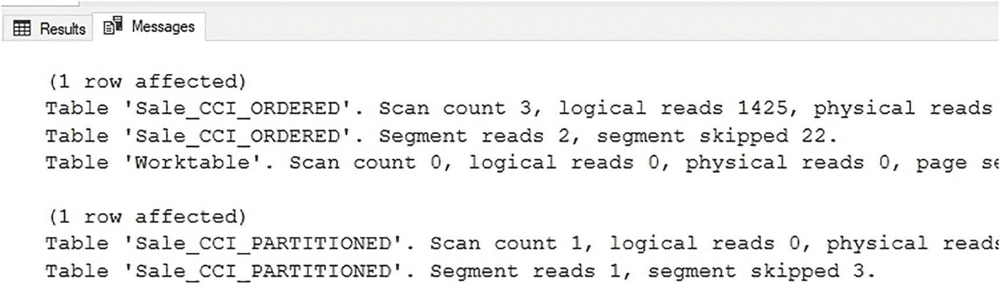
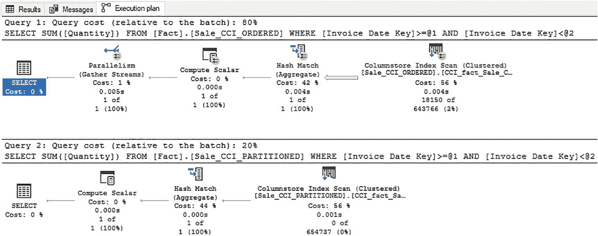
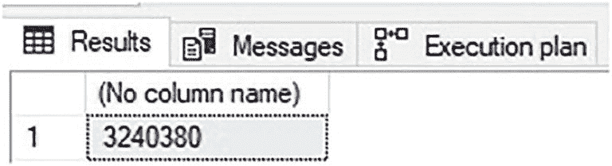

# 分区与非分区列存储索引的比较

完成后，将有两个用于演示目的的表，它们完全相同，但一个进行了分区而另一个没有。两者都按 *Invoice Date Key* 排序，并且在被该列筛选时都将受益于行组消除。清单 11-7 展示了对每个表针对单个月份聚合 *Quantity* 的两个查询。

```sql
SELECT
SUM([Quantity])
FROM Fact.Sale_CCI_ORDERED
WHERE [Invoice Date Key] >= '1/1/2016'
AND [Invoice Date Key] = '1/1/2016'
AND [Invoice Date Key] < '2/1/2016';
```
**清单 11-7**
针对非分区和分区列存储索引执行的窄分析查询

虽然除了表名之外查询是相同的，但 `STATISTICS IO` 的输出说明了每个表在执行上的差异，如图 11-8 所示。



**图 11-8**
非分区列存储索引与分区列存储索引的 `STATISTICS IO`

`STATISTICS IO` 的输出显示了查询执行在每个表上不同的多种方式。最显著的差异在于报告的段读取数量。非分区表读取了 2 个段，同时跳过了 22 个，而分区表读取了 1 个段，同时跳过了 3 个。这种 IO 反映了原始查询，该查询仅使用 *Invoice Date Key* 在 2016 年 1 月内的行来计算总和。

对于已排序但未分区的表，在使用行组消除来跳过段之前，需要审查整个表的元数据。而在分区表中，不包含 2016 年数据的行组会被自动跳过。由于分区函数在评估列存储元数据之前进行计算，因此从未读取无关的行组，包括它们的元数据。这体现了分区消除的实际作用。虽然分区并非旨在作为一种查询优化解决方案，但它会对列存储索引 IO 和查询速度产生积极影响，尤其是在较大的表上。

分区还会影响查询优化器，它将在更少的行组和行上评估查询，这可以简化执行计划。图 11-9 展示了清单 11-7 中演示的分析查询的执行计划。



**图 11-9**
非分区列存储索引与分区列存储索引的查询执行计划

非分区表的执行计划更为复杂，因为 SQL Server 确定并行处理可能有助于处理大量行。分区表的执行计划更简单，因为优化器选择不使用并行处理。请注意，使用哈希匹配是为了支持将聚合下推到列存储索引扫描步骤中的 `SUM` 运算符。同样值得注意的是，当需要读取的分区较少时，分区表（与非分区表相比）执行计划中读取的行数更低。

尽管每个查询的输出相同，并且每个执行计划产生相同的结果集，但能够避免并行处理节省了计算资源，正如分区表查询成本大幅降低所暗示的那样。

除了分区消除之外，索引维护也可以调整以跳过较旧的、更新较少的分区。例如，如果认为需要对此列存储索引进行重建以在最近的一些软件发布后清理它，非分区表将需要整体重建，如清单 11-8 所示。

```sql
ALTER INDEX CCI_fact_Sale_CCI_ORDERED ON Fact.Sale_CCI_ORDERED REBUILD;
```
**清单 11-8**
重建列存储索引的查询

重建操作需要 61 秒完成。对于更大的列存储索引，时间可能显著更长。如果受软件发布影响的数据部分仅限于较新的数据，那么很可能只需要重建最新的分区。清单 11-9 展示了如何对单个分区执行索引重建。

```sql
ALTER INDEX CCI_fact_Sale_CCI_PARTITIONED ON Fact.Sale_CCI_PARTITIONED REBUILD PARTITION = 5;
```
**清单 11-9**
在列存储索引中重建当前分区的查询

此次重建仅需 1 秒。这是因为最新的分区不包含一整年的数据。为了对重建时间提供更公平的评估，清单 11-10 展示了对包含一整年数据的分区执行的重建操作。

```sql
ALTER INDEX CCI_fact_Sale_CCI_PARTITIONED ON Fact.Sale_CCI_PARTITIONED REBUILD PARTITION = 4;
```
**清单 11-10**
在列存储索引中重建完整分区的查询

此重建操作需要 11 秒完成。每个分区的重建都比被迫重建整个索引快得多。当需要进行索引维护时，这可以极大地减少其性能影响。

另一个可以演示的独特功能是使用 `SWITCH` 选项，通过单个 DDL 操作将分区内容从一个表移动到另一个表。因为该操作是 DDL 元数据操作，而不是完全记录日志的数据移动过程，所以速度会快得多。这为快速数据加载和维护过程开辟了多种选择，否则这些过程的成本将高得令人望而却步。

例如，如果确定 *Fact.Sale_CCI_PARTITIONED* 中从 1/1/2016 开始的所有数据都有错误，那么将其留在原地进行纠正将是一个挑战。更新列存储索引是一个缓慢且昂贵的过程，会导致严重的碎片，因此应尽可能避免。

一种替代方法是将分区切换出去，修改数据，然后将数据重新插入表中。这样可以在进行任何更改之前隔离要修改的数据。清单 11-11 中的脚本创建了一个与 *Fact.Sale_CCI_PARTITIONED* 具有相同架构的新暂存表，该表将用作分区切换的目标。

```sql
CREATE TABLE Fact.Sale_CCI_STAGING
(      [Sale Key] [bigint] NOT NULL,
[City Key] [int] NOT NULL,
[Customer Key] [int] NOT NULL,
[Bill To Customer Key] [int] NOT NULL,
[Stock Item Key] [int] NOT NULL,
[Invoice Date Key] [date] NOT NULL,
[Delivery Date Key] [date] NULL,
[Salesperson Key] [int] NOT NULL,
[WWI Invoice ID] [int] NOT NULL,
[Description] nvarchar NOT NULL,
[Package] nvarchar NOT NULL,
[Quantity] [int] NOT NULL,
[Unit Price] decimal NOT NULL,
[Tax Rate] decimal NOT NULL,
[Total Excluding Tax] decimal NOT NULL,
[Tax Amount] decimal NOT NULL,
[Profit] decimal NOT NULL,
[Total Including Tax] decimal NOT NULL,
[Total Dry Items] [int] NOT NULL,
[Total Chiller Items] [int] NOT NULL,
[Lineage Key] [int] NOT NULL)
ON WideWorldImportersDW_2016_fg;
CREATE CLUSTERED COLUMNSTORE INDEX CCI_fact_Sale_CCI_STAGING ON Fact.Sale_CCI_STAGING;
```
**清单 11-11**
用于分区切换操作的脚本，以创建暂存表

请注意，暂存表是在与要切换的源数据相同的文件组上创建的。如果需要，可以使用与 *Fact.Sale_CCI_PARTITIONED* 相同的分区方案创建暂存表，这将允许在分区切换中指定分区号，而不必在表创建语句中显式提供文件组。语法是任意的，操作员可以根据实施方便性选择哪种方式更容易实现。


一旦创建了暂存表，就可以使用清单 11-12 中的脚本，将分区从源表（位于`2016`文件组上）切换到该暂存表中。

```
ALTER TABLE Fact.Sale_CCI_PARTITIONED SWITCH PARTITION 4 TO Fact.Sale_CCI_STAGING;
清单 11-12
将分区从分区列存储索引切换到暂存表的脚本
```

分区切换在毫秒内即可执行完毕，因为它是一个最小化日志记录的 DDL 操作。可以通过验证暂存表中的行数来衡量结果，如清单 11-13 所示。

```
SELECT COUNT(*) FROM Fact.Sale_CCI_STAGING;
清单 11-13
分区切换操作完成后，验证暂存表中的行数
```

计数操作的结果如图 11-10 所示。



图 11-10
新填充的暂存表中的行数统计

计数查询结果显示，有超过 300 万行数据已从`Fact.Sale_CCI_PARTITIONED`切换到暂存表。接下来，可以根据需要在暂存表中修改数据，以解决已识别的任何问题。数据清理完成后，可以将其插回到原始的列存储索引中，从而确保结果数据是干净的、没有碎片的。清单 11-14 展示了一个如何执行此数据修改过程的示例。

```
UPDATE Sale_CCI_STAGING
SET [Total Dry Items] = [Total Dry Items] + 1
FROM Fact.Sale_CCI_STAGING;
INSERT INTO Fact.Sale_CCI_PARTITIONED
([Sale Key], [City Key], [Customer Key], [Bill To Customer Key], [Stock Item Key], [Invoice Date Key], [Delivery Date Key], [Salesperson Key],
[WWI Invoice ID], Description, Package, Quantity, [Unit Price], [Tax Rate], [Total Excluding Tax], [Tax Amount], Profit, [Total Including Tax],
[Total Dry Items], [Total Chiller Items], [Lineage Key])
SELECT
[Sale Key], [City Key], [Customer Key], [Bill To Customer Key], [Stock Item Key], [Invoice Date Key], [Delivery Date Key], [Salesperson Key],
[WWI Invoice ID], Description, Package, Quantity, [Unit Price], [Tax Rate], [Total Excluding Tax], [Tax Amount], Profit, [Total Including Tax],
[Total Dry Items], [Total Chiller Items], [Lineage Key]
FROM Fact.Sale_CCI_STAGING;
DROP TABLE Fact.Sale_CCI_STAGING;
清单 11-14
使用暂存数据进行数据修改的示例。通过 INSERT 操作将数据移回父表
```

UPDATE 操作开销很大，但通过将其隔离到暂存表中，该操作的争用就不会影响到更大的列存储索引。一旦更新完成，数据就可以插回到分区表中，然后删除暂存表。

另外，也可以用另一次分区切换来替代`INSERT`操作。清单 11-15 中的代码展示了清单 11-14 代码的一个替代方案。

```
UPDATE Sale_CCI_STAGING
SET [Total Dry Items] = [Total Dry Items] + 1
FROM Fact.Sale_CCI_STAGING;
ALTER TABLE Fact.Sale_CCI_STAGING SWITCH PARTITION 4 TO Fact.Sale_CCI_PARTITIONED;
DROP TABLE Fact.Sale_CCI_STAGING;
清单 11-15
使用暂存数据进行数据修改的示例。通过分区切换将数据移回父表
```

这个替代代码的速度会显著更快，因为分区切换是一个快速、最小化日志记录的 DDL 操作，而清单 11-14 中的大型`INSERT`操作则需要承担将所有数据写回`Fact.Sale_CCI_Partitioned`的开销。

分区切换是一个多功能工具，可用于各种数据修改、归档和删除场景。其具体用法因应用程序而异，但它提供了一种快速在表之间移入和移出数据的方法，避免了大型写入操作带来的碎片和开销。

## 分区指南

虽然分区听起来对任何列存储索引都有好处，但不应未经研究和预见就自动实施。分区在大表中效果很好，但对小列存储索引没有提供多少价值。因此，容量规划应该是决策过程中的一个步骤，以确定分区是否适合任何给定的表。

### 分区和行组大小调整

由于分区是在创建行组之前应用于表的，因此分区边界将强制截断行组。例如，如果一个非分区的列存储索引包含 5,000,000 行，这些行很可能驻留在 5 个行组中。如果创建该表的新版本，并按一个均匀跨越 10 年的日期列进行分区，那么结果将是每个分区包含 500,000 行。

但是，行组不能跨分区。新的分区表将包含十个分区，每个分区由一个单独的行组组成。结果是一个拥有十个行组而非五个的表。

一般来说，除非表包含至少数千万或数亿行数据，否则分区不适用于列存储索引。同样重要的是，分区需要足够大，以利于使用填满的行组。因此，分区函数和分区方案需要确保每个分区至少包含`2²⁰`（`1,048,576`）行。过小的分区将导致行组过小，随着时间的推移会产生碎片。

列存储索引越大，从分区中受益就越多。将分区边界与组织需求对齐也有助于确定如何在列存储索引上实施分区。如果一个组织每季度归档十亿行数据，那么按季度分区就非常合理。相反，如果归档是按年组织的，那么按年分区将更合适。

### 分区列选择

为分区函数选择的列应与列存储索引的排序列相同。当分区和行组消除操作在相同的数据集上运行时，它们的效果最好，而这只有在它们使用相同的排序条件时才能实现。因此，如果列存储索引是按某个特定日期列排序的，那么分区也应该在该列上进行配置。按另一列分区可能会导致性能下降，因为 SQL Server 需要扫描更多分区中更多的行组来检索所需的数据。

### 存储选择

如果列存储索引内的数据访问模式不同，用于分区表的数据文件可以反映这种使用情况。如果旧数据很少被访问且可以容忍更高的延迟，那么可以将其移动到速度更慢/成本更低的硬件上。如果新数据需要高可用性且延迟极低，则可以将其放置在更快、更昂贵的存储上。

因此，可以拆分大表以节省成本。落在更便宜存储上的每一 TB 数据都代表着可以轻松量化的成本节约。虽然分区的主要目的不是省钱，但通过战略性的数据文件布局来转移工作负载，可以在不付出巨大努力的情况下实现这一目标。

在构建分区表时，识别表中是否有遵循不同使用模式的数据，并尽可能根据使用情况将数据文件分配到较慢或较快的存储。如果性能需求随时间变化，可以在存储位置之间移动数据文件，以确保即使曾经很少需要的数据变得对频繁的分析过程至关重要，也能持续满足`SLA`。


## 额外优势

表分区的最大优势之一在于，它无需修改应用程序代码。所有分区结构都是 SQL Server 内部管理的，除了能体验到性能提升外，对应用程序没有其他影响。这也意味着，可以先对分析数据测试分区功能，并根据测试结果决定保留或回滚。回滚操作包括创建数据的第二个副本并将其交换回生产位置，但对于分析数据而言，这是一个合理的过程，因为数据加载过程完全处于数据架构的管控范围内。这使得分区能够在对开发人员编写的、使用这些数据的代码产生最小影响的情况下进行测试。

分区是实现列存储索引时的一个可选步骤，但它可以改善维护、加速分析工作负载并可能节省成本。此功能适用于至少有数千万行且预计会随时间快速增长的大型表。

