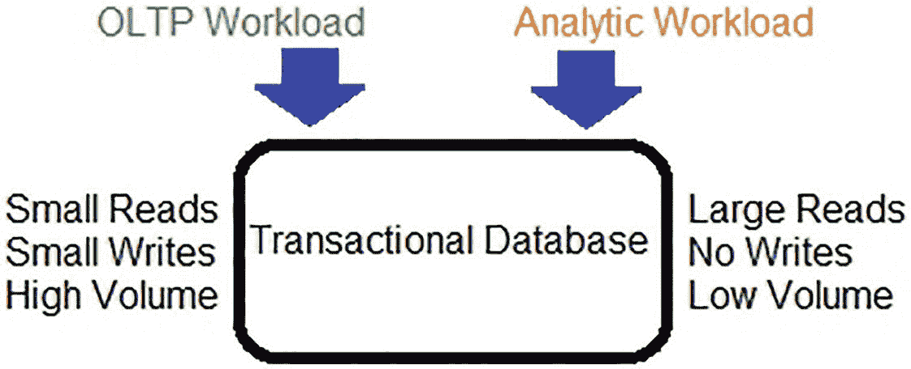
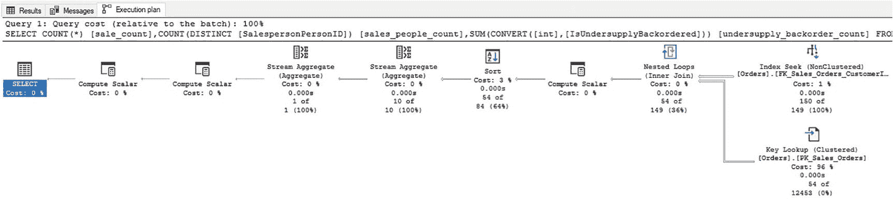
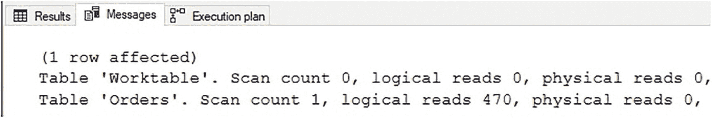
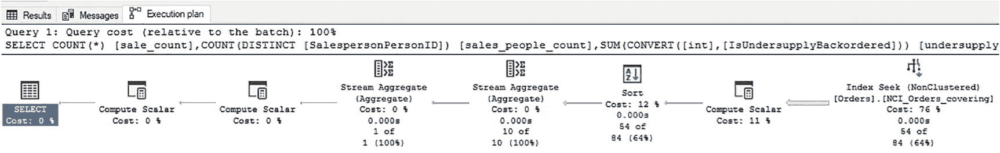
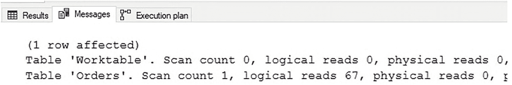

# 12. 表上的非聚集列存储索引

聚集列存储索引为分析数据提供了主要的存储机制。对于旨在用作 OLAP 数据源的表，这是最佳选择，并将提供一种有助于对分析数据进行快速高效读写的数据结构。

对于主要是事务性但也需对其执行分析查询的表，聚集列存储索引并不合适。有几种选项可用于管理这些额外的分析工作负载，包括：

*   创建覆盖行存储索引。
*   分离 OLTP 和 OLAP。
*   创建非聚集列存储索引。
*   接受不修改数据库架构的 OLAP 查询。

虽然纯粹的 OLTP 或 OLAP 工作负载可以用纯粹的事务性或分析性数据结构来管理，但混合工作负载更为复杂，需要更仔细地检查读写操作以了解如何最好地管理它。本章将讨论每种替代方案及其最适用的情况，并提供关于如何为给定工作负载选择最佳存储方法的指导。

## 使用行存储索引

这是大多数事务性应用程序的典型初始默认设置。数据开始时较小，随时间增长。当行数较少时，对事务性数据运行分析查询的性能足够好，无需进行重大修改即可满足这些需求。

在数据大小和争用变得足够显著，导致出现以下问题之前，依赖行存储表和单列非聚集行存储索引就足够了：

*   锁定
*   阻塞
*   过度的资源消耗
*   长时间运行的查询

一旦达到该阈值，就需要其他解决方案。一般来说，针对行存储索引运行分析进程会导致索引扫描、大量读取和高内存使用情况，并且随着数据增长到数百万或数十亿行，这些成本无法很好地扩展。图 12-1 展示了在行存储表上运行混合工作负载所面临挑战的简化图示。



图 12-1

针对行存储表的 OLAP 和 OLTP 查询的挑战

虽然混合分析和事务性需求对于较小、不太繁忙的表是可行的，但当使用量或大小变得显著时，挑战必然会出现。通常，如果预计表会变得很大，建议避免依赖行存储表进行分析。

覆盖索引允许行存储索引完全覆盖一个分析查询。这可以提供比聚集索引扫描和键查找更好的性能，并且当分析查询范围有限且数量不多时，这是一个很好的解决方案。

例如，考虑清单 12-1 中的查询。

```sql
SELECT
COUNT(*) AS sale_count,
COUNT(DISTINCT SalespersonPersonID) AS sales_people_count,
SUM(CAST(IsUndersupplyBackordered AS INT)) AS undersupply_backorder_count
FROM Sales.Orders
WHERE CustomerID = 90
AND OrderDate >= '1/1/2015'
AND OrderDate < '1/1/2016';
```
清单 12-1
针对事务性表的分析查询示例

此查询是对事务性数据进行分析的常见示例。图 12-2 显示了此查询的执行计划。



图 12-2
针对事务性表的分析查询的执行计划

执行计划显示了一个在索引上针对 `CustomerID` 进行筛选的索引查找。键查找从聚集索引中检索满足查询所需的其他列。在 STATISTICS IO 中找到的该查询的 IO 如图 12-3 所示。



图 12-3
针对事务性表的分析查询的 STATISTICS IO

请注意，键查找产生了大量的逻辑 IO，因为 SQL Server 不得不返回到聚集索引以检索 `OrderDate`、`SalespersonPersonID` 和 `IsUndersupplyBackordered` 列。如果此查询经常执行且形式变化不大，则覆盖索引可以是一种充分的管理方式。清单 12-2 创建了一个覆盖此示例查询的索引。

```sql
CREATE NONCLUSTERED INDEX NCI_Orders_covering
ON Sales.Orders (OrderDate, CustomerID)
INCLUDE (SalespersonPersonID, IsUndersupplyBackordered);
```
清单 12-2
完全覆盖分析查询的非聚集行存储索引

创建这个新的覆盖索引后，测试查询的执行计划已简化为图 12-4 所示。



图 12-4
使用行存储覆盖索引的分析查询的执行计划

执行计划显示的是索引查找，而不是之前的查找加键查找。STATISTICS IO 的更新输出如图 12-5 所示。



图 12-5
使用行存储覆盖索引的分析查询的 STATISTICS IO

新的 STATISTICS IO 输出显示 IO 减少了七倍，从 470 次读取降到 67 次。覆盖索引为分析查询提供了显著的性能提升，并且作为额外的好处，由于新索引是一个可以与聚集索引分开读取的独立对象，还可以减少争用。

覆盖索引对于特定、一致且数量较少的分析查询是很好的工具。试图通过创建过多的覆盖索引来跟上新的分析查询存在危险。过度索引是一个实际问题，会损害写入性能、浪费存储空间并消耗大量内存。同样，包含太多列的覆盖索引注定会浪费空间。实际上，包含太多列的覆盖索引很快就会退化为表的副本，维护成本高昂。

覆盖索引有用的理想场景可以概括如下：

*   非常有限数量的特定、有针对性的分析查询。
*   分析查询不经常变化（如果有的话）。
*   分析查询发生的频率足以值得采取一些索引操作。
*   列列表有限。
*   环境有利于在将来不再需要时删除索引。


