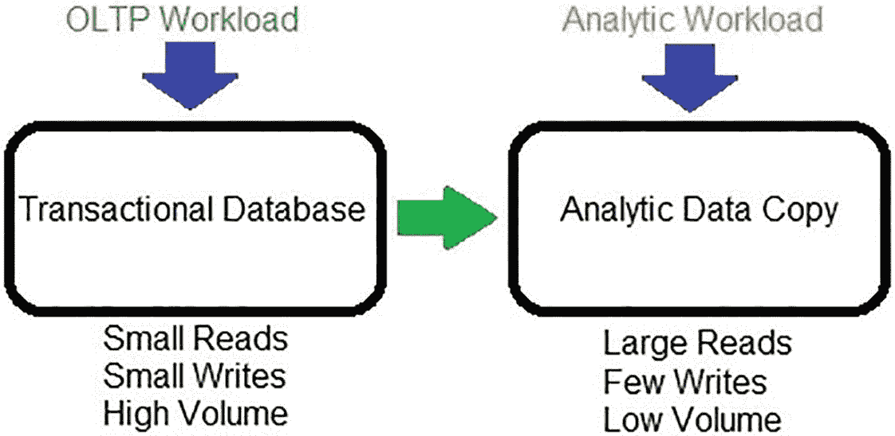
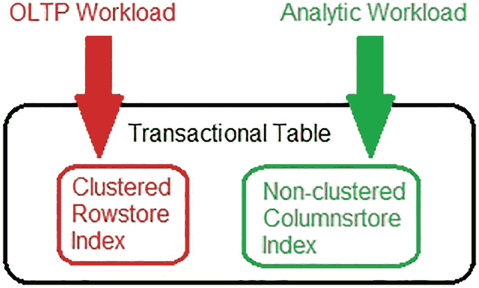
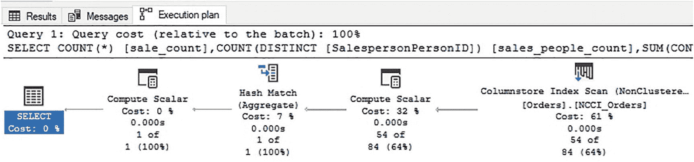
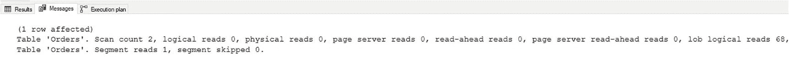

# 数据库性能优化：分离 OLAP 与 OLTP

## 分离 OLAP 与 OLTP 进程

解决在事务型表上运行分析查询这一挑战的一个方案是，将 OLAP 数据和进程与 OLTP 数据和进程分离开来。有多种方法可以应对这一挑战，包括：

*   `AlwaysOn 可用性组`
*   `复制`
*   由`ETL`供数的独立分析表
*   第三方分析工具
*   第三方硬件解决方案

图 12-6 简单展示了针对 OLAP 数据副本的工作负载。


图 12-6：针对数据副本的 OLAP 工作负载

虽然分离事务数据和分析数据是目前为止管理混合工作负载挑战最有效的方式，但它也是破坏性最大的一种。

`AlwaysOn` 和 `复制` 是成熟的工具，它们提供了不同的方式来生成数据的次级副本，以供分析进程使用。它们需要学习和实施 `SQL Server` 的新组件，以及承诺投入额外的硬件来支持 OLTP 数据副本的新目标。在主要事务数据库发生故障时，它们还能提供高可用性。

如果数据库已经使用了 `AlwaysOn 可用性组`，那么可以利用非聚集列存储索引将分析查询下推到一个可读的辅助副本上。类似地，如果使用了 `复制`，并且其主要目的是服务分析查询，则可以在 `复制` 目标上配置聚集或非聚集列存储索引。

除了这些内置工具外，架构师还可以创建自己的数据副本，并通过 `SQL Server 集成服务` 或其他数据移动过程来管理它们。虽然手动构建数据复制过程稍微更耗费人力，但它允许使用现有工具并进行任何程度的定制。这通常是组织开始构建其数据仓库环境的方式。

许多第三方工具可以执行类似的任务，并允许对数据进行额外的处理/管理。投资于外部组织工具的好处在于，构建和维护它所需的时间、资源和专业知识完全落在他们的肩上，从而腾出资源用于其他项目。缺点是成本以及对一个新工具的投资，如果将来需要退出，可能会比较困难。

虽然此类解决方案会带来延迟，但延迟可以通过各自内部的配置设置进行控制，使其保持在组织需求的范围之内。

## 非聚集列存储索引

为分析查询提供针对事务型数据的其他解决方案，为如何以及何时能有效使用非聚集列存储索引来管理分析查询奠定了基础。

非聚集列存储索引的架构与聚集列存储索引类似，并表现出相似的行为。行组、段和压缩可以按照与聚集列存储索引相同的方式进行分析，并且应同样遵循最佳实践。这意味着它们对于聚合数百万行的分析类查询表现异常出色。然而，与聚集列存储索引一样，`DELETE` 和 `UPDATE` 操作会随着时间的推移导致碎片化和空间浪费，并且 `UPDATE` 操作在大型非聚集列存储索引上可能表现不佳。

聚集和非聚集列存储索引之间的一个巨大区别是，非聚集版本允许指定列列表。虽然数据顺序由行存储聚集索引强制执行，但能够选择包含哪些列，可以将分析所需的列与主要用于事务操作的列隔离开来。

请注意，行存储聚集索引键列默认自动包含在非聚集列存储索引中，并且无法移除。它们是支持对现有行组进行 `UPDATE` 和 `DELETE` 操作所必需的。

非聚集列存储索引的主要优点如下：

*   支持实时运营分析。
*   可以指定列列表。
*   无需更改应用程序代码。
*   列存储索引与行存储索引存储在不同的页面上，从而减少了争用。
*   索引可以被筛选、分配压缩延迟或下推到 `AlwaysOn` 副本。

与聚集列存储索引类似，非聚集列存储索引需要一些前瞻性才能有效实施。因为聚集索引本质上是事务性的，并且该表很可能是频繁的小型写入操作的目标，所以需要对非聚集列存储索引的架构进行考量，以确保写入操作的影响得到有效管理。

图 12-7 展示了一个同时具有行存储聚集索引和非聚集列存储索引的表上工作负载的简化示意图。


图 12-7：针对行存储和列存储索引的混合工作负载

在单个表中同时拥有行存储和列存储索引的关键在于，两者可以同时使用，允许事务和分析操作并行执行，而不是完全竞争资源。

要测试非聚集列存储索引对事务表的影响，请考虑清单 12-3 中的脚本。

```sql
CREATE NONCLUSTERED COLUMNSTORE INDEX NCCI_Orders ON Sales.Orders (OrderDate, CustomerID, IsUndersupplyBackordered, SalespersonPersonID);
清单 12-3：在行存储表上创建非聚集列存储索引
```

在该索引创建语句中，只包含了分析查询涉及的列。如果需要用于其他常见查询，可以添加更多列，但目标是确保分析操作由列存储索引服务，而无需引用聚集行存储索引。

添加索引后，可以再次执行清单 12-1 中的测试查询。执行计划如图 12-8 所示。


图 12-8：使用非聚集列存储索引的分析查询的执行计划

执行计划显示，列存储索引被专门用于返回查询结果。图 12-9 显示了该查询的 `STATISTICS IO` 输出。


图 12-9：使用非聚集列存储索引的分析查询的 STATISTICS IO

读取次数与使用覆盖索引时大致相同，但有一个额外好处：避免了对聚集索引的键查找，确保了与其他同时使用它的查询没有争用。

## 管理热、温、冷事务数据

虽然非聚集列存储索引可以为实时运营分析提供卓越的性能，但它们有一个明显的弱点：写操作。事务表往往会产生小型、增量的变化——插入、更新和删除，每次影响几行，并且发生频繁。而列存储索引是为大批量插入、偶尔删除和最小化更新而设计的。

尽管存在这些直接的挑战，但在实施非聚集列存储索引时，有可用的工具来管理这些挑战，以帮助保持最佳性能。


