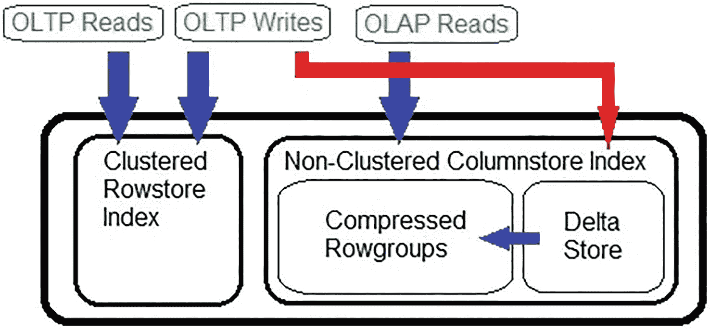
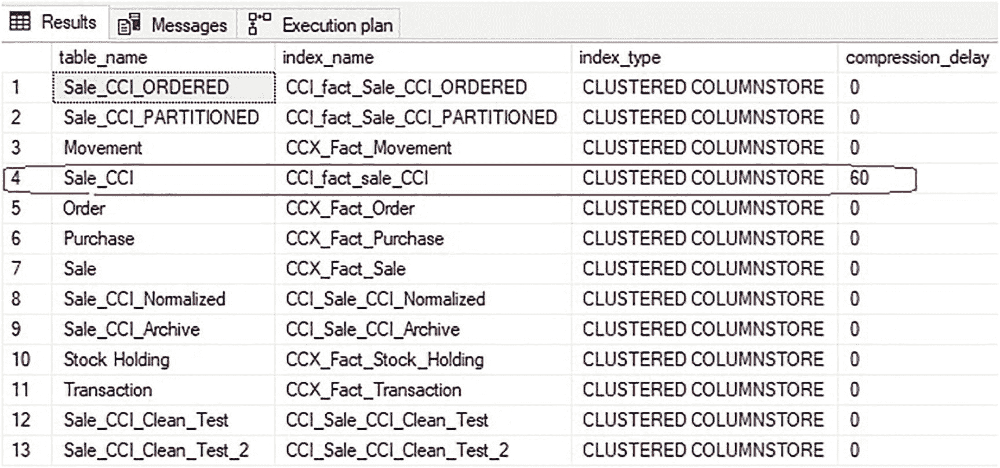
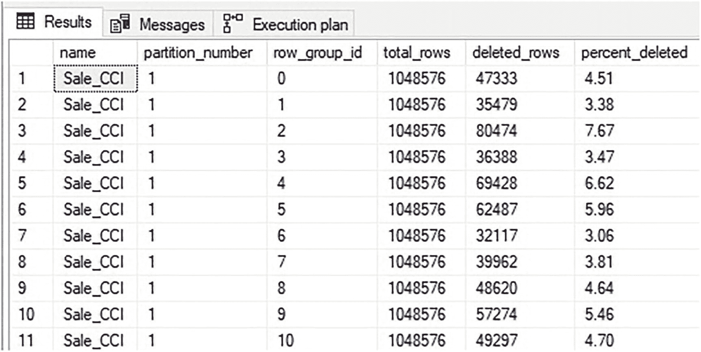
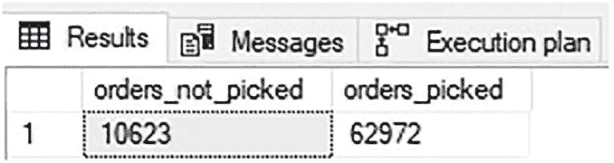
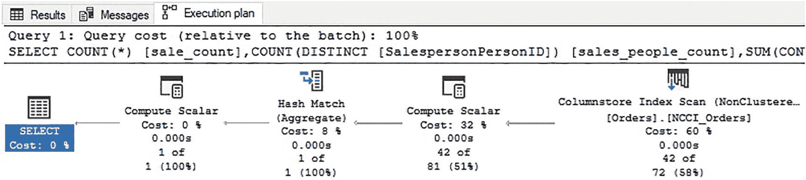

# 压缩延迟的配置与调整

压缩延迟可以在现有索引上根据需要进行调整，而无需重建索引。例如，如果确定数据“热”期为 30 分钟而非 10 分钟，则可以使用 `ALTER INDEX` 语句相应地调整压缩延迟，如清单 12-5 所示。

```sql
ALTER INDEX NCCI_Orders ON Sales.Orders
SET (COMPRESSION_DELAY = 30 MINUTES);
```
**清单 12-5** 使用 `ALTER INDEX` 语句调整压缩延迟

配置压缩延迟是一种平衡：既要避免对压缩行组进行过多的写入操作，又要确保增量存储不会变得过大而对分析性能产生不利影响。理想情况下，行存储索引将服务于对“热”数据进行操作的事务查询，而列存储索引则处理针对大量数据（大部分是“温”或“冷”数据）的分析查询。

确定理想的压缩延迟值需要进行测试，但以下是一套指导原则，可帮助找到一个好的起点：

1.  测量随时间插入的新行数。理想情况下，增量存储包含的数据不应超过几个行组的容量（几百万行或更少），且这些数据不被分析查询频繁使用。
2.  测量更新和删除操作，以及它们最常发生的时间段。尝试将压缩延迟设置为包含该时间段。
3.  如果分析查询不针对新数据，则可以接受较高的压缩延迟。否则，可能需要降低压缩延迟，以避免频繁扫描增量存储。
4.  如果数据加载过程在插入操作中大量修改数据，请确保压缩延迟期足够长以涵盖典型的数据加载过程。或者，修改数据加载过程，使用暂存表/临时表在数据最终插入前进行修改。

压缩延迟可以设置为一个大数或小数。如果一个事务表每小时插入 1000 行新数据，并且这些行在 6 小时内被大量修改，那么 360 分钟的压缩延迟是完全可接受的。在这种情况下，增量存储平均包含 6000 行，这个数量足够小，扫描它不会造成性能问题。

反之，如果一个表每小时插入 2,000,000 行，那么压缩延迟就需要设置得更严格。如果该表中的数据“热”期为 2 小时，那么理想的压缩延迟值应在 30-120 分钟的范围内。需要进行测试以平衡写入进程与分析读取进程的需求。图 12-10 展示了压缩延迟如何影响非聚集列存储索引上的事务查询和分析查询的数据流。


**图 12-10** 具有压缩延迟的非聚集列存储索引上 OLAP 和 OLTP 查询的数据流

此数据流的目标是让事务查询针对行存储索引和增量存储，而分析查询则针对列存储索引。压缩延迟有助于确保 OLTP 写入操作不会影响非聚集列存储索引中压缩行组的性能。预计 OLTP 读取操作会针对行存储索引，并且很少使用列存储索引。

使用相同的语法，压缩延迟也可以应用于聚集列存储索引。当数据加载过程满足以下任一条件时，这可能是一个极佳的解决方案：

*   整体持续时间较长。
*   数据是“涓滴式”加载，而非批量加载。
*   更新操作在数据初次插入后进行。
*   主要是分析型的表在数据加载过程中需要处理 OLTP 查询。

清单 12-6 中的查询更改了 `WideWorldImportersDW` 中的聚集列存储索引，将其压缩延迟设为 60 分钟。

```sql
ALTER INDEX CCI_fact_sale_CCI ON Fact.Sale_CCI
SET (COMPRESSION_DELAY = 60 MINUTES);
```
**清单 12-6** 使用 `ALTER INDEX` 语句调整聚集列存储索引的压缩延迟

聚集列存储索引上 60 分钟的压缩延迟将提供一个 60 分钟的窗口期，在此期间数据加载过程可以自由地以任何方式插入数据，然后根据需要进行更新或删除。由于数据驻留在增量存储中，额外的更新和删除操作不会影响压缩行组，因此消除了数据加载过程引入的碎片。此外，还可以避免因 `UPDATE` 查询而导致的性能下降。60 分钟窗口期结束后，数据将开始被插入到列存储索引中。假设数据加载过程已完成对该数据的修改，那么数据将被插入一次，然后以其原始的压缩状态保持不变。

可以通过查询 `sys.indexes` 来检索数据库中列存储索引的压缩延迟设置，如清单 12-7 所示。

```sql
SELECT
    tables.name AS table_name,
    indexes.name AS index_name,
    indexes.type_desc AS index_type,
    indexes.compression_delay
FROM sys.indexes
INNER JOIN sys.tables
    ON tables.object_id = indexes.object_id
WHERE indexes.type_desc IN ('NONCLUSTERED COLUMNSTORE', 'CLUSTERED COLUMNSTORE');
```
**清单 12-7** 返回索引压缩延迟信息的查询

`compression_delay` 列提供一个数字（以分钟为单位），表示该索引当前的压缩延迟设置。零表示该索引未使用压缩延迟。请注意，该查询仅筛选列存储索引。其他索引类型在 `compression_delay` 列中将为 `NULL`，因为除了列存储索引外，此选项不适用于任何其他索引类型。

图 12-11 显示了此查询的结果以及数据库中每个列存储索引的压缩延迟。


**图 12-11** 数据库中每个列存储索引的压缩延迟

第 4 行（已圈出）显示了被清单 12-6 中的查询修改的索引，并确认了压缩延迟设置为 60 分钟。

由于删除行导致的碎片可以通过被删除行的百分比来量化，使用清单 12-8 所示的查询。

```sql
SELECT
    objects.name,
    partitions.partition_number,
    dm_db_column_store_row_group_physical_stats.row_group_id,
    dm_db_column_store_row_group_physical_stats.total_rows,
    dm_db_column_store_row_group_physical_stats.deleted_rows,
    CAST(100 * CAST(deleted_rows AS DECIMAL(18,2)) / CAST(total_rows AS DECIMAL(18,2)) AS DECIMAL(18,2)) AS percent_deleted
FROM sys.dm_db_column_store_row_group_physical_stats
INNER JOIN sys.objects
    ON objects.object_id = dm_db_column_store_row_group_physical_stats.object_id
INNER JOIN sys.partitions
    ON partitions.object_id = objects.object_id
    AND partitions.partition_number = dm_db_column_store_row_group_physical_stats.partition_number
    AND partitions.index_id = dm_db_column_store_row_group_physical_stats.index_id
WHERE objects.name = 'Sale_CCI'
ORDER BY dm_db_column_store_row_group_physical_stats.row_group_id;
```
**清单 12-8** 返回因删除操作导致的索引碎片的查询

此查询专门针对单个表（`Sale_CCI`）并返回每个行组的总行数、已删除行数和删除百分比，如图 12-12 所见。


**图 12-12** 列存储索引中因删除行导致的碎片


### 过滤非聚集列存储索引：概念与优势

在此示例中，索引的碎片率约为 5%。一般来说，当被删除的行占列存储索引的比例超过 10% 时，可以认为碎片已足够多，需要采取进一步操作以消除和/或防止进一步的碎片化。

在创建非聚集列存储索引时，`压缩延迟` 是一个非常有用的设置，它可以抵消在数据仍然“热”的时期内对表进行的大量事务性写入操作。除了提高写入性能外，`压缩延迟` 还将减少碎片、提高压缩效率并降低索引的内存消耗。

与非聚集行存储索引类似，非聚集列存储索引在创建时也可以对其应用过滤器。这使得列存储索引能够具有针对性，专注于冷数据和温数据，同时避免索引热数据。这些过滤器通常针对那些枚举状态、工作流以及数据生命周期中位置的列。

考虑一个订单处理系统的例子。在这个系统中，订单在流程的某个特定点之前会频繁地被修改。可能是在订单被拣货、发货或接收时，但在其生命周期的某个时刻，数据会从热数据转变为温数据，之后再转变为冷数据。

过滤器索引可用于将非聚集列存储索引的目标设定为仅包含不再“热”的数据。例如，考虑以下代码块中的索引创建语句。

```sql
CREATE NONCLUSTERED COLUMNSTORE INDEX NCCI_Orders
ON Sales.Orders (OrderDate, CustomerID, IsUndersupplyBackordered, SalespersonPersonID)
WHERE PickedByPersonID IS NOT NULL;
```

代码清单 12-9：创建过滤非聚集列存储索引

此索引将仅包含 `PickedByPersonID` 列有值的行。因此，在订单被装箱并准备发货之前，行不会被插入到列存储索引中。因此，在此时间点之前发生的任何数据操作都不会影响列存储索引的性能。

以下查询计算满足过滤条件的行数与不满足的行数。

```sql
SELECT
SUM(CASE WHEN PickedByPersonID IS NULL THEN 1 ELSE 0 END) AS orders_not_picked,
SUM(CASE WHEN PickedByPersonID IS NOT NULL THEN 1 ELSE 0 END) AS orders_picked
FROM Sales.Orders
```

代码清单 12-10：计算满足过滤索引条件的行数

图 12-13 中的结果显示，表中大约 14% 的行未被拣货，因此仍被归类为热数据。



**图 12-13：满足过滤索引条件的行数统计**

通常，热数据只占表中数据的一小部分。如果可以使用一个简单的过滤器来确定数据是否“热”，那么就可以将其应用于非聚集列存储索引，以确保其性能不受负面影响。

### 使用过滤索引进行查询

考虑前面提到的分析查询。如果此查询的目标仅针对不再“热”的数据，那么将非聚集列存储索引上使用的过滤条件添加到此查询中，将使其能够使用过滤版本的索引，如以下代码块所示。

```sql
SELECT
COUNT(*) AS sale_count,
COUNT(DISTINCT SalespersonPersonID) AS sales_people_count,
SUM(CAST(IsUndersupplyBackordered AS INT)) AS undersupply_backorder_count
FROM Sales.Orders
WHERE CustomerID = 90
AND OrderDate >= '1/1/2015'
AND OrderDate < '1/1/2016'
AND PickedByPersonID IS NOT NULL;
```

代码清单 12-11：使用过滤非聚集列存储索引的查询

此查询的执行计划如图 12-14 所示。



**图 12-14：使用过滤非聚集列存储索引的执行计划**

正如预期的那样，执行此查询时使用了过滤的非聚集列存储索引。

如果需要，以下查询显示数据库中定义了过滤器的所有索引，可用于审查列存储索引及其详细信息。

```sql
SELECT
indexes.name,
indexes.type_desc,
indexes.filter_definition
FROM sys.indexes
WHERE indexes.has_filter = 1;
```

代码清单 12-12：列出给定数据库中带过滤器索引的查询

查询结果有助于了解存在哪些过滤器及其定义，如图 12-15 所示。


**图 12-15：定义了过滤器的索引列表**

如果数据库包含许多过滤索引，可以进一步优化查询以省略行存储索引或其他干扰信息。

### 重要注意事项和陷阱

在使用过滤索引之前，有一个陷阱需要审视，那就是过滤列的敏感性。理想情况下，当数据从“热”变为“温”再变为“冷”时，它会被添加到过滤非聚集列存储索引中，并且很少（如果有的话）被移除。如果行能够在满足和不满足过滤子句之间交替变化，那么存在一个危险：表中的单行数据可能会多次被添加到列存储索引中然后又被移除。如果这种情况很常见，那么过滤索引最终可能变得和未过滤索引一样碎片化。

考虑使用之前创建的过滤非聚集列存储索引的场景。如果为一行分配了 `PickedByPersonID` 的值，它将立即被插入到列存储索引的增量存储中，在那里等待通过元组移动器进行压缩。如果 `PickedByPersonID` 随后被重置为 `NULL`，由于它不再满足过滤条件，它将从列存储索引中被删除。在设计任何过滤索引时，确保行不会频繁进出索引，并且数据遵循从“热”到“温”再到“冷”的单向旅程，是有价值的。

### 与压缩延迟结合使用

压缩延迟可以与过滤非聚集列存储索引结合使用，作为缓冲那些导致数据通过常规流程在“热”和“温”之间移动的带外更改的一种方式。以下代码块展示了一个包含压缩延迟的过滤非聚集列存储索引。

```sql
CREATE NONCLUSTERED COLUMNSTORE INDEX NCCI_Orders
ON Sales.Orders (OrderDate, CustomerID, IsUndersupplyBackordered, SalespersonPersonID)
WHERE PickedByPersonID IS NOT NULL
WITH (COMPRESSION_DELAY = 30 MINUTES);
```

代码清单 12-13：创建带压缩延迟的过滤非聚集列存储索引

该索引提供了额外的缓冲，以应对已分配 `PickedByPersonID` 的行可能出现以下情况：
*   被删除
*   被更新
*   `PickedByPersonID` 被重置回 `NULL`

一个事务性表可以成功利用过滤非聚集列存储索引、压缩延迟，或者两者兼用。关于使用哪些功能以及如何配置它们的细节，应由组织需求及其数据生命周期驱动。在做出这些决定时，没有放之四海而皆准的解决方案。一个组织的一个数据库中的一张表可能受益于 10 分钟的压缩延迟，而 1440 分钟可能是另一张表的最优选择。在某些工作流中，过滤器可能完全涵盖一个关键用例，而在其他情况下，可能无法轻易地在索引中进行过滤。


