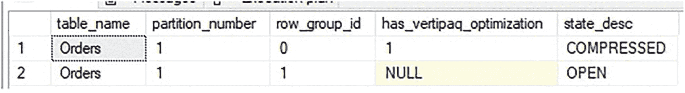
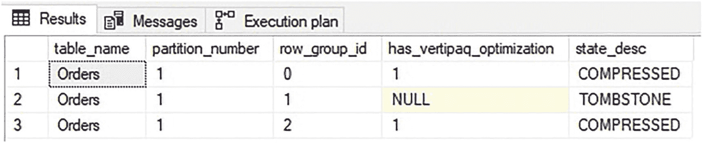
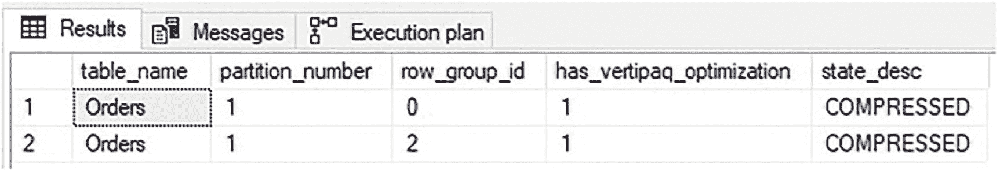
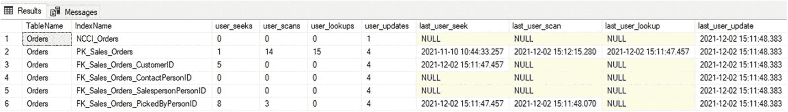

# 代码变更

如果压缩延迟和筛选非聚集列存储索引无法有效管理针对 OLTP 表的分析工作负载，那么可能是组织逻辑、代码或两者都需要重新审视。

如果应用程序或数据库代码能够以支持对同一表进行分析和事务处理工作负载的方式进行改进，那么进行这些更改可以使组织避免构建更复杂且昂贵的 OLAP 解决方案。

最终，任何分析数据挑战都存在解决方案，但理想的解决方案将是成本最低、同时又最易于未来扩展的解决方案。实时运营分析并不适用于所有工作负载，并且通常会存在一些场景，其中更昂贵、资源更密集的解决方案（如 AlwaysOn 或复制）才是正确的解决方案。

## 非聚集列存储索引的 Vertipaq 优化

第 5 章详细讨论了列存储压缩。一个重要的问题是，当向聚集列存储索引添加非聚集行存储索引时，未来插入的行将无法受益于 Vertipaq 优化。Vertipaq 优化会对行进行重新排序，而 SQL Server 在压缩行组时，会将相似的值分组在一起，从而实现更有效的压缩。如果没有此功能可用，新插入的数据压缩效率会降低，随着时间的推移，会浪费存储空间和内存。

一个合乎逻辑的问题是：“非聚集列存储索引是否受益于 Vertipaq 优化？”为了测试这一点并确定是否使用了 Vertipaq 优化，将向 `Sales.Orders` 表插入新行，如代码清单 12-14 中的查询所示。

```sql
INSERT INTO Sales.Orders
(   OrderID, CustomerID, SalespersonPersonID, PickedByPersonID, ContactPersonID, BackorderOrderID, OrderDate, ExpectedDeliveryDate, CustomerPurchaseOrderNumber, IsUndersupplyBackordered, Comments, DeliveryInstructions, InternalComments, PickingCompletedWhen, LastEditedBy, LastEditedWhen)
SELECT
73595 + ROW_NUMBER() OVER (ORDER BY OrderID) AS OrderID,
CustomerID,
SalespersonPersonID,
PickedByPersonID,
ContactPersonID,
BackorderOrderID,
OrderDate,
ExpectedDeliveryDate,
CustomerPurchaseOrderNumber,
IsUndersupplyBackordered,
Comments,
DeliveryInstructions,
InternalComments,
PickingCompletedWhen,
LastEditedBy,
LastEditedWhen
FROM Sales.Orders;
```
代码清单 12-14
向 `Sales.Orders` 插入行以测试 Vertipaq 优化

此插入操作使表的大小加倍。完成后，可以执行代码清单 12-15 中的查询以确认非聚集列存储索引内行组的当前状态。

```sql
SELECT
objects.name AS table_name,
partitions.partition_number,
dm_db_column_store_row_group_physical_stats.row_group_id,
dm_db_column_store_row_group_physical_stats.has_vertipaq_optimization,
dm_db_column_store_row_group_physical_stats.state_desc
FROM sys.dm_db_column_store_row_group_physical_stats
INNER JOIN sys.objects
ON objects.object_id = dm_db_column_store_row_group_physical_stats.object_id
INNER JOIN sys.partitions
ON partitions.object_id = objects.object_id
AND partitions.partition_number = dm_db_column_store_row_group_physical_stats.partition_number
AND partitions.index_id = dm_db_column_store_row_group_physical_stats.index_id
WHERE objects.name = 'Orders'
ORDER BY dm_db_column_store_row_group_physical_stats.row_group_id;
```
代码清单 12-15
在大型 `INSERT` 操作后显示列存储行组元数据的查询

图 12-16 中的结果同时显示了现有的压缩行组和新创建的打开行组。



图 12-16
大型 `INSERT` 操作后的列存储元数据

新行组中的数据仍驻留在增量存储中，因为在创建列存储索引时指定了 30 分钟的压缩延迟。为了避免等待 30 分钟让元组移动器处理该行组，将使用代码清单 12-16 中的 T-SQL 立即启用该进程。

```sql
ALTER INDEX NCCI_Orders ON sales.Orders REORGANIZE WITH (COMPRESS_ALL_ROW_GROUPS = ON);
```
代码清单 12-16
用于使元组移动器处理打开的增量行组的 T-SQL

图 12-17 中的结果显示了此脚本完成后列存储索引的即时状态。



图 12-17
打开行组被处理后的列存储元数据

请注意，新创建的行组 (`row_group_id` = 2) 已被压缩并正在使用 Vertipaq 优化。如果几分钟后再次执行代码清单 12-15 中的元数据脚本，则处于 TOMBSTONE 状态的行组将被移除，如图 12-18 所示。



图 12-18
墓碑行组被自动清理后的列存储元数据

`INSERT` 操作的结果是产生了 2 个行组，一个与列存储索引的初始创建一同创建，另一个是在插入并压缩一组新行时创建的。如本示例所示，Vertipaq 优化将用于非聚集列存储索引。这对于列存储压缩是一个福音，并确保每个段尽可能高效地压缩，即使它代表的是可能比典型分析表更频繁更改的事务数据。

正是由于将聚集行存储索引键列包含在非聚集列存储索引中，才使得 Vertipaq 优化得以使用。如果没有包含键列，将无法将列存储索引中的行链接回行存储索引，并且每当数据修改时都需要重建列存储索引。这样的成本将高得令人望而却步。拥有聚集键列可确保非聚集列存储索引中的行可以自由重新排序，而不会有无法轻松链接回聚集索引的风险。


## 测试非聚集列存储索引

由于混合分析型和事务型工作负载会带来风险，因此在实施非聚集列存储索引时，测试是一个关键环节。以下是一份简短的指导原则清单，以协助测试非聚集列存储索引。

*   **测试 trickle 插入**。在添加非聚集列存储索引前后，插入大量单行或小批次行的性能表现是否相似？
*   **测试常见更新操作**。UPDATE 操作是否应用于热点数据？如果是，请在添加列存储索引前后测试其性能。
*   **测试压缩延迟**。对于 OLTP 行存储表，压缩延迟很可能是一个有益的可选配置。测试不同的压缩延迟值，以找到一个最佳平衡点，使得写入操作尽可能高效，同时在列存储索引中产生最少的碎片。
*   **测试筛选器**。如果热点数据的常见界定是由一列或多列定义的，那么向索引添加筛选器可以帮助将热点数据与通常用于分析的数据隔离开来。仔细测试这些筛选器，以确保分析查询能够使用该索引，并且筛选列不会被频繁更新。
*   **执行负载前后对比测试**。如有疑问，对常见操作进行全面的负载测试，比较添加非聚集索引前后的性能，有助于理解新索引的影响。理想情况下，非聚集列存储索引应能显著提升分析性能，同时不会对写入操作产生负面影响。

非聚集列存储索引为事务型和分析型查询都针对单个表或一组表的混合工作负载提供了一个出色的工具。如果将 OLAP 与 OLTP 分离的成本过高，那么这可能是一种经济高效的方式，可以在无需进行重大架构更改或更改应用程序代码的情况下管理常见的分析查询。

## 不要忘记删除不需要的索引！

非聚集列存储索引通常用于替换先前服务于分析查询的一个或多个非聚集行存储索引。在这种情况下，请务必在确定旧的覆盖索引不再需要时，对其进行测试并将其删除。

如果一个非聚集列存储索引可以替换许多覆盖行存储索引，那么在所有旧的、不需要的索引被删除后，它的添加很可能节省计算资源。清单 12-17 中的查询返回给定表的索引使用统计信息。

```sql
SELECT
tables.name AS TableName,
indexes.name AS IndexName,
dm_db_index_usage_stats.user_seeks,
dm_db_index_usage_stats.user_scans,
dm_db_index_usage_stats.user_lookups,
dm_db_index_usage_stats.user_updates,
dm_db_index_usage_stats.last_user_seek,
dm_db_index_usage_stats.last_user_scan,
dm_db_index_usage_stats.last_user_lookup,
dm_db_index_usage_stats.last_user_update
FROM sys.dm_db_index_usage_stats
INNER JOIN sys.tables
ON tables.object_id = dm_db_index_usage_stats.object_id
INNER JOIN sys.indexes
ON indexes.object_id = dm_db_index_usage_stats.object_id
AND indexes.index_id = dm_db_index_usage_stats.index_id
WHERE tables.name = 'Orders'
```

清单 12-17
返回单个表索引使用数据的脚本

结果如图 12-19 所示。



图 12-19
索引使用统计信息输出

`sys.dm_db_index_usage_stats` 返回的数据会在 SQL Server 重启时重置，因此将其持久化存储在某个永久位置或定期拍摄快照非常重要。利用返回的信息，可以快速确定一个索引用于读取（查找、扫描、查找）的频率与用于写入（更新）的频率相比如何。长时间内读取次数为零或极少的索引可以安全删除。读取更频繁的索引则需要进一步评估，以确定删除它们对经常使用它们的查询的影响。

总而言之，在聚集行存储表上创建二级索引的目标是产生尽可能简单、紧凑和高效的解决方案。对于结构可预测且经常重复的分析查询，非聚集覆盖行存储索引足以在最小改动的情况下提供良好的性能。

如果针对行存储表的分析需求在结构上更加多样化，那么单个非聚集列存储索引可能是覆盖这些需求的一种高效得多的方法，这胜过创建许多非聚集行存储索引。

如果可以对任何二级或覆盖索引（行存储或列存储）应用筛选器，那么这样做可以减小它们的大小，并通过避免频繁写入的热点数据来进一步提升性能。

