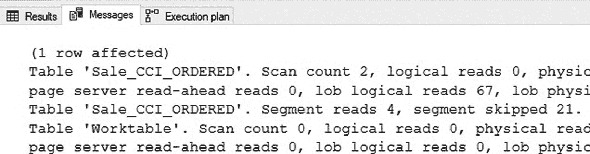
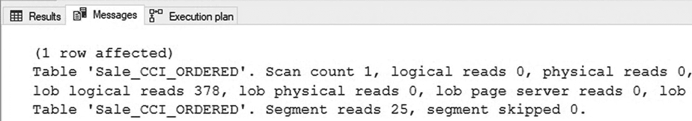
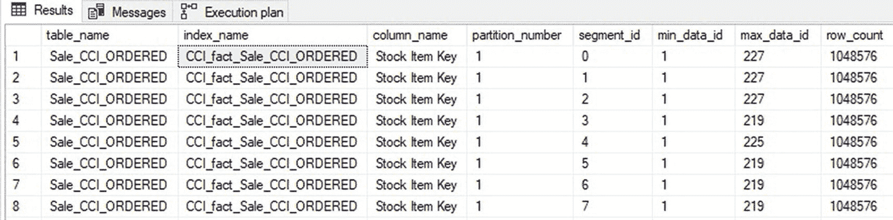
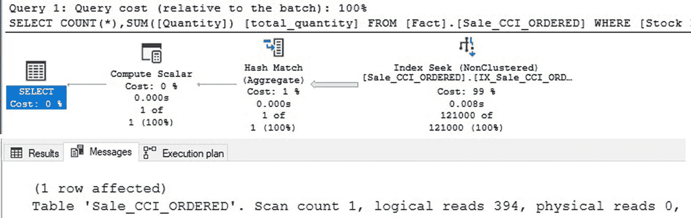
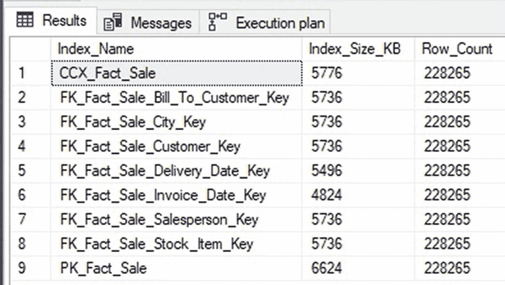
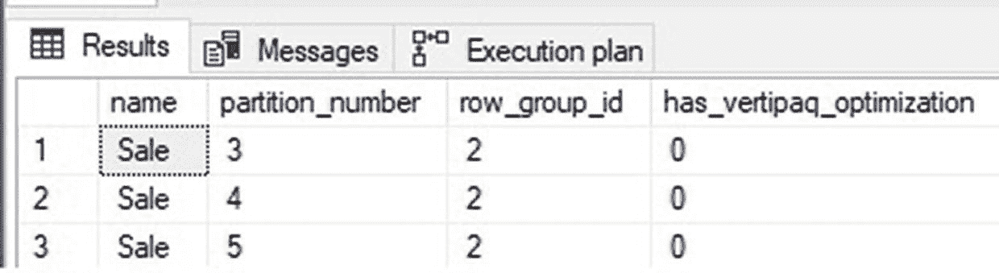
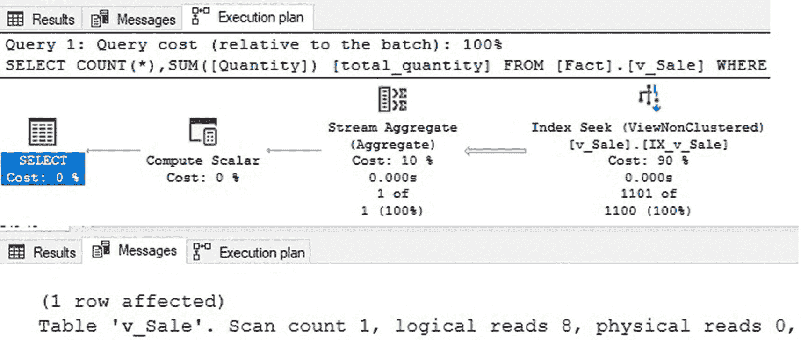
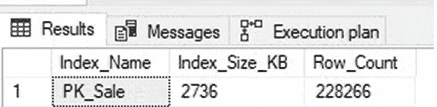

# 13. 列存储表上的非聚集行存储索引

聚集列存储索引提供了足够有效的压缩和数据访问速度，使得大多数典型的分析工作负载无需任何其他索引即可获得足够的性能。

这种性能的关键在于给定分析表底层数据的排序方式。只要使用该数据的查询能够基于数据排序所依据的维度（通常是时间）进行筛选，它们就能受益于行组消除。对于按其他维度切分数据的非常规查询，结果通常是对列存储索引进行完全扫描。对于大表而言，这代价高昂，将需要另一种解决方案来帮助优化这些工作负载。


## 使用非聚集行存储索引

第 10 章详细回顾了数据顺序在实现行组消除方面的重要性。当数据按某个维度排序，并且分析查询在该维度上进行筛选时，SQL Server 可以使用列存储元数据自动过滤掉不需要的行组。

可以在聚集列存储表上创建非聚集行存储索引，为那些不遵循数据排序方式的常见查询提供额外支持。向聚集列存储索引添加辅助索引时必须谨慎。本章剩余部分将讨论在需要时如何最佳使用非聚集行存储索引，以及维护它们的最佳实践。

考虑一个在表 `Fact.Sale_CCI_OrderED` 上创建的聚集列存储索引，该索引按 `Invoice Date Key` 列排序。该表的架构设计旨在通过 `Invoice Date Key` 列提供的时间维度进行筛选和聚合。清单 13-1 中的查询是一个分析查询，它利用了这种自然的数据顺序。

```
SELECT
COUNT(*),
SUM(Quantity) AS total_quantity
FROM Fact.Sale_CCI_ORDERED
WHERE [Invoice Date Key] >= '11/1/2015'
AND [Invoice Date Key] < '1/1/2016';
```
清单 13-1
利用有序聚集列存储索引的时间维度进行筛选和聚合的查询

执行后，结果返回得相当快。图 13-1 显示了 `STATISTICS IO` 的输出。


图 13-1
针对有序聚集列存储索引查询的统计 IO 输出

注意，段报告显示读取了 4 个段，跳过了 21 个段。此外，考虑到该表包含 2500 万行，逻辑读取次数相当低。这两点都是行组消除被有效使用的指标，有助于确保只需要读取表的一小部分即可处理查询并返回结果。

只要分析查询的筛选条件、排序和聚合与表所依据的列对齐，就可以预期获得这样的性能。考虑清单 13-2 中提供的非常不同的查询。

```
SELECT
COUNT(*),
SUM(Quantity) AS total_quantity
FROM Fact.Sale_CCI_ORDERED
WHERE [Stock Item Key] = 186;
```
清单 13-2
不使用表自然排序的分析查询

此查询使用 `Stock Item Key` 作为筛选条件来计算数量。由于表是按 `Invoice Date Key` 排序的，SQL Server 没有自然的方法来实现行组消除。图 13-2 显示了此查询的 `STATISTICS IO` 输出。


图 13-2
针对有序聚集列存储索引中无序列的查询统计 IO 输出

这一次，读取了列存储索引中的所有行组，没有跳过任何行组。这种性能可以归因于表中 `Stock Item Key` 总共有 227 个值，但这些值分散在所有行组中，没有任何特定顺序。清单 13-3 提供了返回列存储索引中 `Stock Item Key` 列内容元数据的查询。

```
SELECT
tables.name AS table_name,
indexes.name AS index_name,
columns.name AS column_name,
partitions.partition_number,
column_store_segments.segment_id,
column_store_segments.min_data_id,
column_store_segments.max_data_id,
column_store_segments.row_count
FROM sys.column_store_segments
INNER JOIN sys.partitions
ON column_store_segments.hobt_id = partitions.hobt_id
INNER JOIN sys.indexes
ON indexes.index_id = partitions.index_id
AND indexes.object_id = partitions.object_id
INNER JOIN sys.tables
ON tables.object_id = indexes.object_id
INNER JOIN sys.columns
ON tables.object_id = columns.object_id
AND column_store_segments.column_id = columns.column_id
WHERE tables.name = 'Sale_CCI_ORDERED'
AND columns.name = 'Stock Item Key'
ORDER BY tables.name, columns.name, column_store_segments.segment_id;
```
清单 13-3
返回 Stock Item Key 列元数据的查询

图 13-3 提供了此查询的输出，显示了每个行组 `Stock Item Key` 的最小值和最大值。


图 13-3
Stock Item Key 列的列存储段元数据

查看此段元数据时，可以明显看出每个行组的 `Stock Item Key` 值范围都同样广泛，因此 SQL Server 无法有效地使用元数据来通过此列进行筛选。值得注意的是，查询大于 219 的值将允许进行一些行组消除，因为某些行组的 `max_data_id` 是 219，而不是 227 或 225。忽略这个小细节，可以安全地说，大多数筛选 `Stock Item Key` 的查询都将被迫扫描列存储索引中的所有行组才能返回结果。

如果筛选 `Stock Item Key` 的查询很频繁，并且它们当前的性能慢得无法接受，那么解决此挑战的一个方案是在列存储索引之上实现一个非聚集行存储覆盖索引。为了覆盖此处展示的查询，有必要按 `Stock Item Key` 排序并包含 `Quantity`。清单 13-4 中的查询创建了这个索引。

```
CREATE NONCLUSTERED INDEX IX_Sale_CCI_ORDERED
ON Fact.Sale_CCI_ORDERED ([Stock Item Key]) INCLUDE (Quantity);
```
清单 13-4
创建覆盖行存储索引的查询

索引创建查询大约需要 45 秒完成。完成后，执行清单 13-2 中的示例查询会产生新的执行计划和新的 I/O，如图 13-4 所示。


图 13-4
使用覆盖索引时的查询执行计划和 I/O

SQL Server 完全使用覆盖索引来执行查询，导致 394 次读取和对新索引的一次索引查找。此 I/O 略高于前一个示例，但这不应是确定索引策略时的唯一决策指标。查询执行速度也极快。使用非聚集行存储索引有几个关键优势：

*   快速、可预测的执行时间，无论查询参数如何。
*   针对覆盖索引的查询读取不会与针对聚集列存储索引的查询产生争用。
*   可预测的执行计划和 I/O。

覆盖非聚集行存储索引的优势完全体现在读取方面。在决定创建此类覆盖索引之前，必须了解其缺点：

*   写入时间会变慢，因为需要填充非聚集索引并将其映射到聚集列存储索引。
*   当存在任何非聚集行存储索引时，不会使用 Vertipaq 优化。到聚集列存储索引的映射过程使得重新排序行成为一个效率低下的过程，无法在运行时执行。


## 非聚集行存储索引的大小考量

非聚集行存储索引的大小将会膨胀。来自聚集索引的数据会在非聚集索引中被复制。此外，将行存储索引链接回聚集列存储索引的键是一个 8 字节的唯一值，它由 4 字节的行组 ID 和 4 字节的偏移量组合而成。如果非聚集索引不是唯一的，则会在索引的叶级别内部使用额外的（可变）存储空间来强制实施唯一性。

为聚集列存储索引添加非聚集行存储索引绝非一个低成本的决策。其代价是存储空间、内存使用量和写入速度。因此，在向聚集列存储索引添加辅助索引之前，必须仔细斟酌。

## 强制实施约束

在聚集列存储索引上使用非聚集行存储索引的一个常见用途与性能无关。非聚集行存储索引可用于通过主键或使用唯一的非聚集索引定义来强制表的唯一性。

创建唯一约束与在聚集行存储表上创建并无不同。清单 13-5 展示了为已有的聚集列存储索引上的非聚集主键创建的语句。

```sql
ALTER TABLE Fact.Sale ADD CONSTRAINT PK_Fact_Sale PRIMARY KEY NONCLUSTERED
(      [Sale Key] ASC,
[Invoice Date Key] ASC);
```
清单 13-5: 在聚集列存储表上创建唯一的非聚集行存储索引

这个新索引作为基础表的主键，既强制实施唯一性，也允许在引用此表的其他表上创建外键。如果这两者中的任何一个都是重要的架构需求，那么在聚集列存储索引上创建主键是一个很好的解决方案。

表 `Fact.Sale` 上定义了多个非聚集行存储索引。清单 13-6 中的查询返回表中每个索引的大小。

```sql
SELECT
indexes.name AS Index_Name,
SUM(dm_db_partition_stats.used_page_count) * 8 Index_Size_KB,
SUM(dm_db_partition_stats.row_count) AS Row_Count
FROM sys.dm_db_partition_stats
INNER JOIN sys.indexes
ON dm_db_partition_stats.object_id = indexes.object_id
AND dm_db_partition_stats.index_id = indexes.index_id
INNER JOIN sys.tables
ON tables.object_id = dm_db_partition_stats.object_id
INNER JOIN sys.schemas
ON schemas.schema_id = tables.schema_id
WHERE schemas.name = 'Fact'
AND tables.name = 'Sale'
GROUP BY indexes.name
ORDER BY indexes.name
```
清单 13-6: 查询 `Fact.Sale` 表上每个索引大小的语句

索引大小查询的结果如图 13-5 所示。


图 13-5: 一个表的索引大小详情

除了聚集列存储索引和非聚集行存储主键外，还有另外七个非聚集行存储索引，每个都索引一个外键列。请注意，每个辅助索引的大小都接近列存储索引本身的总大小。因此，表本身包含大约 5.7MB 的压缩列存储数据，但用于数据和索引空间的总空间约为 45MB。

这是一个索引过多的表的绝佳示例。如果用户确实需要根据如此多的维度进行搜索，而无需考虑单一的数据顺序，那么列存储索引可能不是此表的理想解决方案。或者，移除大部分额外索引可能仍然能提供足够快的性能。

使用非聚集行存储索引来强制聚集列存储索引的唯一性，在寻求对 OLAP 数据强制实施数据完整性时，可以成为一个有价值的工具。除非组织对这些索引的需求远超其成本，否则通常不建议在聚集列存储表上实现多个行存储索引。

## 筛选非聚集行存储索引

减轻列存储索引上非聚集行存储索引成本的一种方法是添加筛选器。筛选索引针对表中更小的部分，消耗更少的存储和内存，并且可以减少对列存储索引压缩和性能的影响。

通常，针对分析表的 OLTP 查询可能只针对一部分数据——可能是较新的、较旧的，或者基于其他有用的筛选条件。考虑清单 13-2 中测试的 T-SQL。该查询在 `Stock Item Key` 上进行筛选，而这不是列存储索引的排序列。为了减轻此查询的成本，添加了一个非聚集行存储索引，如清单 13-4 所示。如果这个查询从不针对新数据，而只用于分析旧销售记录呢？考虑清单 13-7 中更新后的索引。

```sql
CREATE NONCLUSTERED INDEX IX_Sale_CCI_ORDERED
ON Fact.Sale_CCI_ORDERED ([Stock Item Key], [Invoice Date Key]) INCLUDE (Quantity)
WHERE [Invoice Date Key] <= '1/1/2016';
```
清单 13-7: 在聚集列存储索引上创建筛选非聚集行存储索引的示例

当执行使用此索引并筛选 2016 年 1 月 1 日 之前数据的查询时，它将使用筛选索引而非列存储索引。由于索引更小，读取的行数和 IO 将少于此索引的未筛选版本。

筛选非聚集行存储索引的一个重要优势是，它允许索引更具体地针对热数据、温数据或冷数据。这提供了多重好处：
- 允许索引针对特定用例，而非所有数据
- 允许更好地管理 Vertipaq 优化
- 可以促进添加多个非聚集索引，同时减少对写入性能或资源消耗的影响

如果需要在聚集列存储索引上创建辅助索引，请考虑是否可以添加筛选器以减小非聚集索引的大小和影响。假设使用该索引的查询能够一致地使用筛选器，这是一种提高性能并减少存储和内存占用的简单方法。

## 启用 Vertipaq 优化

向聚集列存储索引添加非聚集行存储索引的一个缺点是，SQL Server 将自动放弃 Vertipaq 优化。这将导致列存储压缩的效果不如使用该功能时那么好。请注意，Vertipaq 优化仅对插入表中的新数据跳过。在创建非聚集索引之前已存在于列存储索引中的任何数据，仍将受益于该优化带来的性能提升。

如果需要在聚集列存储索引上创建非聚集行存储索引，请考虑以下解决方案之一，这些方案将允许在压缩的列存储段上维持 Vertipaq 优化。

### 向非聚集行存储索引添加筛选器

除了在需要时针对相关数据外，筛选器还可以在创建非聚集索引时跳过热数据。这使得新数据可以使用 Vertipaq 优化插入到聚集列存储索引中，而较旧的数据仍然可以使用非聚集行存储索引进行读取。


### 执行周期性索引维护

如果需要非聚集索引且无法应用筛选器，则可以考虑进行周期性维护，并执行以下步骤：
1.  删除非聚集行存储索引。
2.  重建聚集列存储索引。
3.  重新创建非聚集行存储索引。

这可能非常耗时，尤其是对于较大的表，但可以使列存储索引得以周期性地重建，从而变得更小、更高效。

请注意，分区在此处可以成为一个有价值的工具，因为索引维护可以针对特定分区进行。清单 13-8 中的查询展示了如何筛选分区，以仅显示那些包含未进行 Vertipaq 优化的行组的分区。

```sql
SELECT DISTINCT
    objects.name,
    partitions.partition_number,
    dm_db_column_store_row_group_physical_stats.row_group_id,
    dm_db_column_store_row_group_physical_stats.has_vertipaq_optimization
FROM sys.dm_db_column_store_row_group_physical_stats
INNER JOIN sys.objects
    ON objects.object_id = dm_db_column_store_row_group_physical_stats.object_id
INNER JOIN sys.partitions
    ON partitions.object_id = objects.object_id
    AND partitions.partition_number = dm_db_column_store_row_group_physical_stats.partition_number
WHERE objects.name = 'Sale'
    AND dm_db_column_store_row_group_physical_stats.has_vertipaq_optimization IS NOT NULL
    AND dm_db_column_store_row_group_physical_stats.has_vertipaq_optimization = 0
ORDER BY dm_db_column_store_row_group_physical_stats.row_group_id;
```
清单 13-8：返回未从 Vertipaq 优化中受益的行组的查询

结果如图 13-6 所示。


图 13-6：缺乏 Vertipaq 优化的行组

结果显示只有三个分区（3、4 和 5）包含缺乏 Vertipaq 优化的行组。因此，周期性索引维护可以仅针对这些分区进行，跳过其余分区。对于不需要较细粒度细节的情况，可以从查询中省略`row_group_id`，将结果集缩减为不包含行组 ID 的分区列表。

## 索引视图

可以在聚集列存储索引之上创建索引视图。虽然这增加了一层复杂性，但它允许那些不遵循列存储索引自然排序的查询被隔离到它们自己独立的数据结构中。在那里，视图及其索引可以自由修改，而不会直接影响底层表。

在对存储在聚集列存储索引中的数据进行补充索引的性能测试时，这可以提供更大的灵活性。清单 13-9 中的脚本重建了`Fact.Sale`上的列存储索引，基于它创建了一个架构绑定视图，并向新视图添加了一对索引。

```sql
ALTER INDEX [CCX_Fact_Sale] ON fact.sale REBUILD;
GO
CREATE VIEW Fact.v_Sale
WITH SCHEMABINDING
AS
SELECT
    [Sale Key],
    [City Key],
    [Customer Key],
    [Bill To Customer Key],
    [Stock Item Key],
    [Invoice Date Key],
    [Delivery Date Key],
    [Salesperson Key],
    [WWI Invoice ID],
    Description,
    Package,
    Quantity,
    [Unit Price],
    [Tax Rate],
    [Total Excluding Tax],
    [Tax Amount],
    Profit,
    [Total Including Tax],
    [Total Dry Items],
    [Total Chiller Items],
    [Lineage Key]
FROM Fact.Sale;
GO
CREATE UNIQUE CLUSTERED INDEX CI_v_sale
ON Fact.v_Sale ([Sale Key], [Invoice Date Key]);
GO
CREATE NONCLUSTERED INDEX IX_v_Sale
ON Fact.v_Sale ([Stock Item Key], Quantity)
GO
```
清单 13-9：重建表并向列存储索引添加索引视图的脚本

重建列存储索引可确保在进一步测试之前索引处于原始状态。此演示中创建的视图包含了表中的所有列，但可以修改为包含更少的列、连接其他表、添加计算列等。下一步是在视图上创建唯一的聚集索引。此步骤是必需的，因为在视图上创建非聚集索引需要以唯一索引为前提。最后，添加一个非聚集覆盖索引来处理针对其列的查询。

完成后，清单 13-2 中的分析查询可以修改为针对该视图，如清单 13-10 所示。

```sql
SELECT
    COUNT(*),
    SUM(Quantity) AS total_quantity
FROM Fact.v_Sale
WHERE [Stock Item Key] = 186;
```
清单 13-10：针对索引视图的分析查询

查询结果返回迅速。执行计划和`STATISTICS IO`输出如图 13-7 所示。


图 13-7：针对索引视图查询的执行计划和 STATISTICS IO 输出

执行计划确认使用了视图`v_Sale`上的非聚集索引。IO 输出显示对视图的读取量低到可接受水平。使用索引视图来管理对列存储索引的选择读取有一个意想不到的副作用：当新行插入到列存储索引中时，仍然会使用 Vertipaq 优化！

虽然这是针对列存储索引的索引视图的一个有用优势，但在向现有表添加复杂性时仍应谨慎。平衡非典型工作负载对列存储索引的需求与维护附加视图及这些视图上的索引的成本之间的关系。

务必先在没有支撑视图或索引的情况下测试查询。彻底确认其性能，如果需要，再测试附加索引或索引视图的影响，以确认这些增加是否值得其成本。

## 非聚集行存储索引的压缩

鉴于添加到聚集列存储索引中的非聚集行存储索引的膨胀尺寸，压缩可以成为控制附加索引大小并提高对其读取性能的一种有价值的方式。

考虑定义在`Fact.Sale`上的非聚集主键。图 13-5 中的索引大小数据显示该索引占用了 6,624KB。清单 13-11 中的脚本删除了此约束，并用一个使用页面压缩的新版本替换它。

```sql
ALTER TABLE Fact.Sale DROP CONSTRAINT PK_Sale;
ALTER TABLE Fact.Sale ADD CONSTRAINT PK_Sale PRIMARY KEY NONCLUSTERED ([Sale Key], [Invoice Date Key])
    WITH (DATA_COMPRESSION = PAGE);
```
清单 13-11：使用页面压缩重新创建非聚集主键的脚本

完成后，可以执行清单 13-12 中的代码以确认应用压缩后索引的新大小。

```sql
SELECT
    indexes.name AS Index_Name,
    SUM(dm_db_partition_stats.used_page_count) * 8 Index_Size_KB,
    SUM(dm_db_partition_stats.row_count) AS Row_Count
FROM sys.dm_db_partition_stats
INNER JOIN sys.indexes
    ON dm_db_partition_stats.object_id = indexes.object_id
    AND dm_db_partition_stats.index_id = indexes.index_id
INNER JOIN sys.tables
    ON tables.object_id = dm_db_partition_stats.object_id
INNER JOIN sys.schemas
    ON schemas.schema_id = tables.schema_id
WHERE indexes.name = 'PK_Sale'
GROUP BY indexes.name;
```
清单 13-12：检查压缩后的非聚集索引大小的脚本

结果如图 13-8 所示。


图 13-8：页面压缩非聚集主键的索引大小

结果显示，该索引现在仅占用 2,736KB，减少了 3,888KB，约 59%。这是一个显著的空间节省，说明了压缩在应用于列存储索引表上的次级非聚集索引时可能产生的积极影响。


