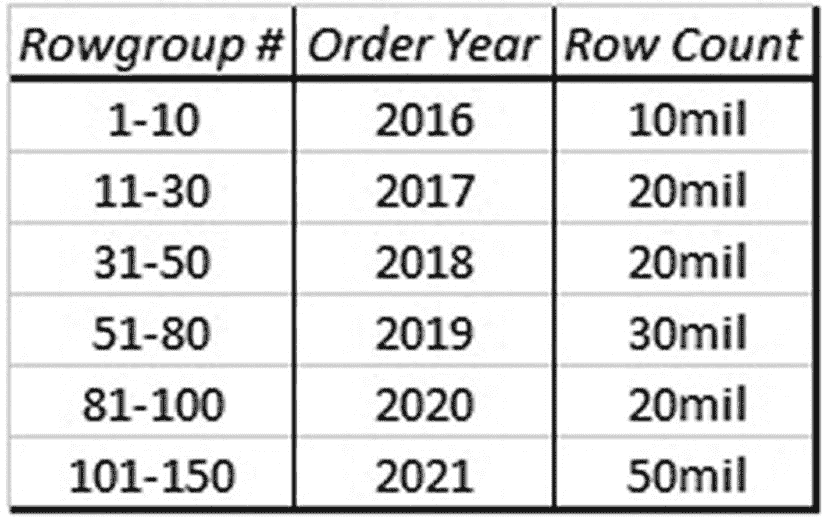
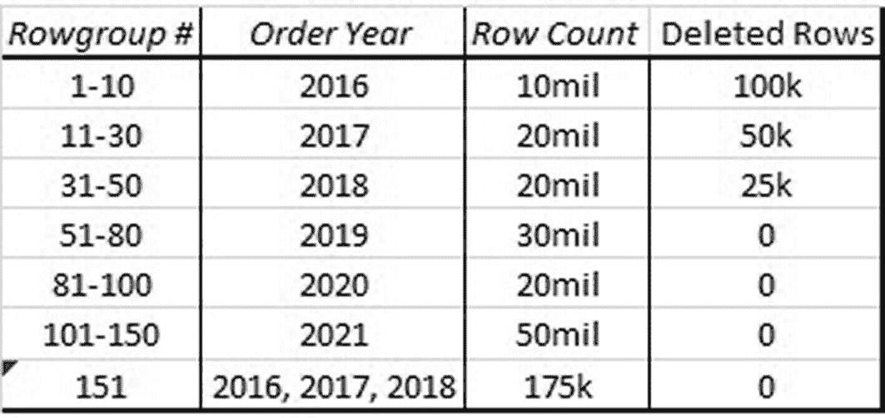
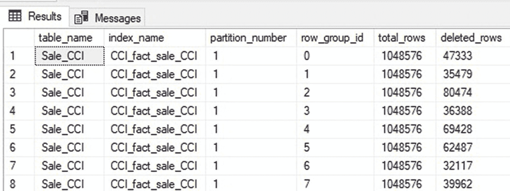
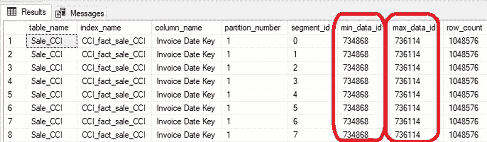
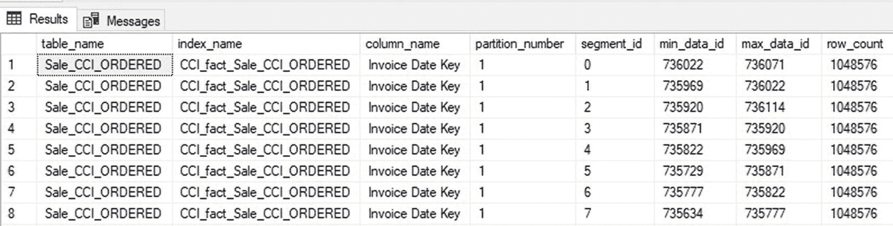
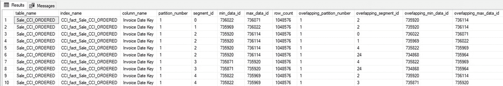
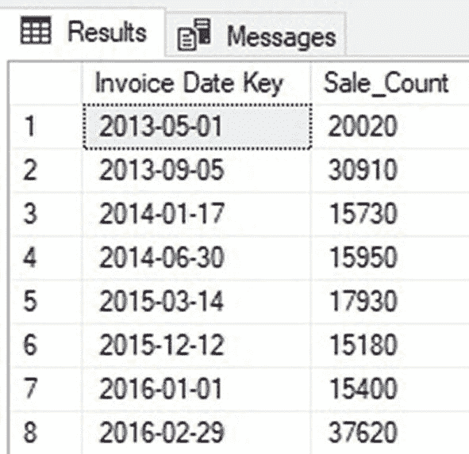
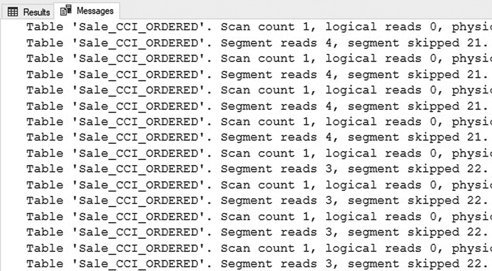

# 14. 列存储索引维护

## 非聚集行存储索引指南

在聚集列存储索引上添加非聚集行存储索引，是管理针对分析数据的频繁、非常规查询模式的有效方法。通过将不同的读取操作分散到聚集和非聚集索引上，可以更好地管理争用，因为锁也会被分散到各个索引上。在进行任何索引更改之前，请确保新索引是必要的，并能提供足够的长期收益以抵消其成本。

在可能的情况下，考虑使用筛选器来缩小非聚集索引的大小，并减少它们对底层列存储索引的影响。类似地，如果尚未使用，请考虑采用分区，因为它可以简化和加速索引维护过程。

当存在将非常规工作负载从列存储索引隔离到单独对象上的额外价值时，可以考虑在列存储索引上创建索引视图。维护它们的成本绝非微不足道，但它们可以提供一种便捷的方式，将特定工作负载封装到它们自己的对象上。将工作负载拆分到单独的对象中有助于减少争用，因为对每个对象的读取操作会分别针对它们，并且这些对象之间是分别锁定的。

无论辅助索引是如何创建的，都请考虑对其进行压缩。压缩可以极大地减少存储消耗，从而降低内存占用并加快使用压缩索引的读取查询速度。

根据经验法则，如果针对列存储索引的非聚集行存储索引数量超过一个（或者在使用索引视图的情况下超过两个），请考虑存储此数据的替代方法，例如：

*   使用页面压缩并在需要时支持索引的聚集行存储表。
*   使用更少非聚集索引的聚集列存储索引。
*   将工作负载分离到彼此独立管理的单独表中。
*   对索引应用压缩和/或筛选器，以减少每个索引的大小和维护开销，使其更易于管理。

本章提供了多种策略，旨在找到一种有利的配置，允许截然不同的工作负载在单个表上和平共存。然而，对于聚集列存储索引上的辅助索引，并不存在一种“一刀切”的方法。如果不确定最佳的进行方式，请彻底测试每种替代方案，以熟悉每种方法的优缺点。

## 碎片产生的原因是什么？

可以用三种场景来描述列存储索引中的碎片：

1.  由于删除行导致的浪费空间
2.  无序插入的数据
3.  索引中存在多个增量行组

当在列存储索引中删除数据时，实际上并未移除任何行。因为解压缩、删除行组、重新压缩行组的成本在运行时高得令人望而却步。相反，SQL Server 使用 `删除位图` 将这些行标记为已删除，当查询访问这些数据时，它们会使用该位图来识别需要跳过的任何已删除行。

章节 9 详细介绍了 `DELETE` 和 `UPDATE` 操作如何在列存储索引上执行，并概述了管理这些操作以避免持续的性能挑战和最小化碎片的方法。删除操作对列存储索引的净影响将是：

*   被删除数据所占用的空间。
*   运行时需要读取比实际所需更多的数据。
*   数据分散在比必要数量更多的行组中。

碎片的另一个原因是无序数据。列存储索引应始终使用按在过滤和聚合查询中最常用的键列（或列）排序的数据来构建和维护。

章节 10 描述了数据排序在列存储索引中的重要性，以及维护与常见查询过滤器和聚合操作一致的数据排序如何能够实现极快的查询性能。

以期望的列存储索引顺序定期插入的数据将促进 `行组消除`，从而在使用相同列进行过滤时，能够自动跳过索引的大部分内容。当行被无序插入时，这将导致读取比必要更多的数据。同样，由于 `UPDATE` 操作是 `DELETE` 和 `INSERT` 操作的组合，更新列存储索引中任何较旧的数据都会导致它与较新的数据一起在索引的尾部重新插入。

考虑图 14-1 中的示例列存储索引，它按 `Order_Date` 排序。



图 14-1：按日期维度排序的列存储索引

此列存储索引完美地按订单年份排序，每组行组中的行按日期升序排列。如果执行一个计算 2016 年指标的查询，它可以读取前十组行组，而忽略其他 140 组。

图 14-2 显示了一个 `UPDATE` 操作的结果，该操作更改了 2016 年 100,000 行、2017 年 50,000 行和 2018 年 25,000 行的数据。



图 14-2：`UPDATE` 操作后行组结构的变化

当行被更新时，它们仍保留在列存储索引中的先前位置，但被标记为已删除。创建了一个新的行组，其中包含被删除行的新版本。结果是，现在有一个开放行组包含了 2016、2017 和 2018 年的数据。此外，当新数据插入表中时，它也会被添加到这个开放行组中，导致另一年的数据被塞进同一个行组。

今后，任何需要 2016、2017、2018 年或当年数据的查询都需要读取这个无序的行组。如果这类更新很常见，那么较旧的行组将很快因已删除的行而堵塞，而较新的行组则成为来自许多不同日期的无序数据大杂烩。其结果将是浪费存储空间、浪费内存，以及需要读取比返回结果所需数据量多得多的数据的更慢查询。

无序插入将产生与 `UPDATE` 语句中的 `INSERT` 部分类似的影响。在图 14-1 中的列存储索引中插入 2015 年的数据，将导致新的行组同时包含新数据和旧数据。随着时间的推移，无序插入将导致 SQL Server 无法利用 `行组消除`，因为越来越多的行组包含来自所有不同时间段的数据。

增量行组是列存储索引架构的关键组成部分，确保写操作能够尽可能快地执行。然而，它们会略微降低读取速度，因为行驻留在 b-tree 结构中，且未使用列存储压缩进行压缩。增量存储对读取性能的影响并不显著，但希望最大化列存储读取性能的管理员会在数据加载过程完成后，有兴趣尽快压缩它们。


## 碎片化到什么程度才算过多？

与行存储索引类似，碎片化在变得足以影响性能并浪费可观空间之前，并不需要特别关注。一个包含 50 亿行的列存储索引，其中只有 1000 行被删除，不应被视为问题。反之，如果这些行中有十亿行被删除，那么由此产生的碎片化就值得处理了。

碎片化应分解为两种不同的计算方式，每种都可以进行客观评估并采取适当措施。一种是表中已删除行所占的百分比，另一种是列存储索引内数据无序程度的度量。

### 量化已删除行

已删除行包含在视图 `sys.column_store_row_groups` 中，相对容易报告。`清单 14-1` 中的查询返回单个聚簇列存储索引中每个行组的一行信息。

```sql
SELECT
    tables.name AS table_name,
    indexes.name AS index_name,
    partitions.partition_number,
    column_store_row_groups.row_group_id,
    column_store_row_groups.total_rows,
    column_store_row_groups.deleted_rows
FROM sys.column_store_row_groups
INNER JOIN sys.indexes
    ON indexes.index_id = column_store_row_groups.index_id
    AND indexes.object_id = column_store_row_groups.object_id
INNER JOIN sys.tables
    ON tables.object_id = indexes.object_id
INNER JOIN sys.partitions
    ON partitions.partition_number = column_store_row_groups.partition_number
    AND partitions.index_id = indexes.index_id
    AND partitions.object_id = tables.object_id
WHERE tables.name = 'Sale_CCI'
ORDER BY indexes.index_id, column_store_row_groups.row_group_id;
```

`清单 14-1` 用于返回每个行组已删除行的查询

结果如 `图 14-3` 所示。



`图 14-3` 列存储索引每个行组的已删除行计数

此详细信息显示了每个行组删除了多少行。结果可以聚合起来，显示每个分区或整个表的已删除行数。如果表是分区的，那么了解已删除行是仅存在于一个分区还是所有分区中，这有助于判断是需要对所有分区还是仅对部分分区进行处理。

在 `图 14-3` 概述的示例结果中，大约 5% 的列存储索引由已删除行组成，这些行在索引中分布相对均匀。作为粗略准则，除非已删除行的百分比至少达到分区或表中总行数的 10%，否则没有立即进行索引维护的迫切需要。

请记住，已删除行对性能的影响是随时间逐渐累积的。永远不会出现达到某个阈值后性能突然暴跌的情况。因此，当已删除行超过某个设定百分比时自动执行索引维护，是避免意外让索引变得极其碎片化的有效方法。

### 详述无序数据

通过查询段元数据可以很容易地看出有序数据的有效性，但要量化可能具有挑战性。`清单 14-2` 中的查询展示了如何检索给定列存储索引和单个列的段最小和最大数据 ID。

```sql
SELECT
    tables.name AS table_name,
    indexes.name AS index_name,
    columns.name AS column_name,
    partitions.partition_number,
    column_store_segments.segment_id,
    column_store_segments.min_data_id,
    column_store_segments.max_data_id,
    column_store_segments.row_count
FROM sys.column_store_segments
INNER JOIN sys.partitions
    ON column_store_segments.hobt_id = partitions.hobt_id
INNER JOIN sys.indexes
    ON indexes.index_id = partitions.index_id
    AND indexes.object_id = partitions.object_id
INNER JOIN sys.tables
    ON tables.object_id = indexes.object_id
INNER JOIN sys.columns
    ON tables.object_id = columns.object_id
    AND column_store_segments.column_id = columns.column_id
WHERE tables.name = 'Sale_CCI'
    AND columns.name = 'Invoice Date Key'
ORDER BY tables.name, columns.name, column_store_segments.segment_id;
```

`清单 14-2` 用于检索列存储索引中给定列的最小/最大数据 ID 的查询

此查询的结果提供了关于此索引内数据顺序的有用见解，如 `图 14-4` 所示。



`图 14-4` 无序列存储索引的段最小/最大值元数据

在元数据中，请注意每个行组的 `min_data_id` 和 `max_data_id` 值是相同的。这意味着在 `Invoice Date Key` 列上进行筛选的查询将被迫扫描整张表才能返回结果，因为任何值都可能出现在任何行组中。

考虑此表的一个有序版本，其结果如 `图 14-5` 所示。



`图 14-5` 有序列存储索引的段最小/最大值元数据

这个版本的表显示了 `min_data_id` 和 `max_data_id` 的值随着 `segment_id` 的增加而呈现递进变化。因为每个段包含一组不同的列值，所以这个元数据可以有效地用于跳过任何包含与查询无关值的行组。`清单 14-3` 中的查询返回列存储索引中所有存在值重叠的段的完整列表。这里使用了不包含边界的不等式，因为一个行组的起始值和结束值通常会与下一个行组的值重叠。


```
WITH CTE_SEGMENTS AS (
SELECT
tables.name AS table_name,
indexes.name AS index_name,
columns.name AS column_name,
partitions.partition_number,
column_store_segments.segment_id,
column_store_segments.min_data_id,
column_store_segments.max_data_id,
column_store_segments.row_count
FROM sys.column_store_segments
INNER JOIN sys.partitions
ON column_store_segments.hobt_id = partitions.hobt_id
INNER JOIN sys.indexes
ON indexes.index_id = partitions.index_id
AND indexes.object_id = partitions.object_id
INNER JOIN sys.tables
ON tables.object_id = indexes.object_id
INNER JOIN sys.columns
ON tables.object_id = columns.object_id
AND column_store_segments.column_id = columns.column_id
WHERE tables.name = 'Sale_CCI_ORDERED'
AND columns.name = 'Invoice Date Key')
SELECT
CTE_SEGMENTS.table_name,
CTE_SEGMENTS.index_name,
CTE_SEGMENTS.column_name,
CTE_SEGMENTS.partition_number,
CTE_SEGMENTS.segment_id,
CTE_SEGMENTS.min_data_id,
CTE_SEGMENTS.max_data_id,
CTE_SEGMENTS.row_count,
OVERLAPPING_SEGMENT.partition_number AS overlapping_partition_number,
OVERLAPPING_SEGMENT.segment_id AS overlapping_segment_id,
OVERLAPPING_SEGMENT.min_data_id AS overlapping_min_data_id,
OVERLAPPING_SEGMENT.max_data_id AS overlapping_max_data_id
FROM CTE_SEGMENTS
INNER JOIN CTE_SEGMENTS OVERLAPPING_SEGMENT
ON (OVERLAPPING_SEGMENT.min_data_id > CTE_SEGMENTS.min_data_id
AND OVERLAPPING_SEGMENT.min_data_id  CTE_SEGMENTS.min_data_id
AND OVERLAPPING_SEGMENT.max_data_id  CTE_SEGMENTS.max_data_id)
ORDER BY CTE_SEGMENTS.partition_number, CTE_SEGMENTS.segment_id
代码清单 14-3
返回重叠段列表的查询
```

此查询评估每个行组中某一列的最小值和最大值边界，并确定是否有任何其他行组的值范围与之重叠。

图 14-6 所示的查询返回的列表乍一看可能很长，但需要注意的是，任何成为 UPDATE 操作或无序插入目标的列存储索引都会在此处有条目。查看返回的数据，可以看到无序数据相对均匀地分布在各个段中，每个段包含 1-4 个其他段，这些段至少有一个值与之重叠。



图 14-6

`Invoice Date Key`列在行组内的重叠值列表

虽然没有精确的方法来衡量无序数据的百分比，就像可以测量列存储索引中已删除行的百分比那样，但可以通过对列存储索引执行`COUNT(*)`查询来进行元数据测试，从而评估数据顺序对查询性能的影响程度。可以对表中的每个日期执行此操作，这将导致一个非常详尽的实验。为了进行简单演示，将如代码清单 14-4 中的查询所示，随机选择八个样本日期进行测试。

```
SELECT
[Invoice Date Key],
COUNT(*) AS Sale_Count
FROM Fact.Sale_CCI_ORDERED
WHERE [Invoice Date Key] IN ('5/1/2013', '9/5/2013', '1/17/2014', '6/30/2014', '3/14/2015', '12/12/2015', '1/1/2016', '2/29/2016')
GROUP BY [Invoice Date Key]
ORDER BY [Invoice Date Key]
代码清单 14-4
用于测试列存储索引中数据有序程度的样本日期
```

图 14-7 中的结果提供了每个日期的行数。



图 14-7

用于测试列存储数据顺序有效性的样本日期列表

每个选中的数据点最多包含表中 0.1%的数据，因为总共有 25,109,150 行，而这些日期涵盖了其中的八个。根据行数和表大小，一个理想的有序表应该只需要读取 1-2 个行组即可检索到任何给定日期的数据。代码清单 14-5 中的查询为之前确定的每个日期执行单独的`COUNT(*)`查询。

```
SET NOCOUNT ON;
SELECT COUNT(*) FROM Fact.Sale_CCI_ORDERED WHERE [Invoice Date Key] = '5/1/2013';
SELECT COUNT(*) FROM Fact.Sale_CCI_ORDERED WHERE [Invoice Date Key] = '9/5/2013';
SELECT COUNT(*) FROM Fact.Sale_CCI_ORDERED WHERE [Invoice Date Key] = '1/17/2014';
SELECT COUNT(*) FROM Fact.Sale_CCI_ORDERED WHERE [Invoice Date Key] = '6/30/2014';
SELECT COUNT(*) FROM Fact.Sale_CCI_ORDERED WHERE [Invoice Date Key] = '3/14/2015';
SELECT COUNT(*) FROM Fact.Sale_CCI_ORDERED WHERE [Invoice Date Key] = '12/12/2015';
SELECT COUNT(*) FROM Fact.Sale_CCI_ORDERED WHERE [Invoice Date Key] = '1/1/2016';
SELECT COUNT(*) FROM Fact.Sale_CCI_ORDERED WHERE [Invoice Date Key] = '2/29/2016';
代码清单 14-5
用于测试行组读取的`COUNT`查询
```

图 14-8 显示了前面每个查询的`STATISTICS IO`输出。



图 14-8

代码清单 14-5 中`COUNT`查询的`STATISTICS IO`输出

对于八个`COUNT(*)`样本查询中的每一个，都需要读取 3-4 个行组来获取计数。根据已知这些查询应该只读取 1-2 个行组，可以推断查询通常读取的行组数量是必要数量的两到三倍。根据表上更新和无序插入操作的频率，这可能是可以接受的，也可能是异常的。了解表的用法有助于理解这些数字的极端程度，以及读取三个行组而不是一个是否正常或值得关注。

使用`STATISTICS IO`测试读取和跳过的行组是衡量列存储索引有序程度的有效方法。如果希望对此测试进行得更全面，并对表中的许多（或所有）日期执行计数查询，请考虑将其视为维护工作，并在预定时间运行冗长的维护脚本时进行该项研究。

## 无需维护的列存储索引

理想的列存储索引几乎不需要维护。当满足以下条件时，这是可能的：

*   行从不被删除。
*   行从不被更新。
*   行总是按顺序插入。

如果这三个条件都能满足，那么列存储索引几乎可以免于所有维护。是否执行任何维护取决于其管理员的意愿。实际上，当列存储索引不是删除、更新或无序插入的目标时，唯一可能产生的次优情况是，由于使用增量存储来处理小的 INSERT 操作，行组的大小可能不足。

由使用增量存储导致的行组大小不足影响很小，不应被视为需要立即解决的紧急问题。在这些场景中，等待不频繁的维护时段来执行列存储索引维护就足以有效确保欠大小的行组被有效合并。每季度或每年一次可能就足够了。

既然已经详细阐述了碎片产生的原因，现在可以讨论使用索引维护操作来解决碎片问题了。


