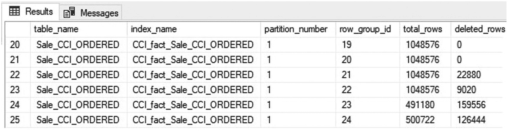
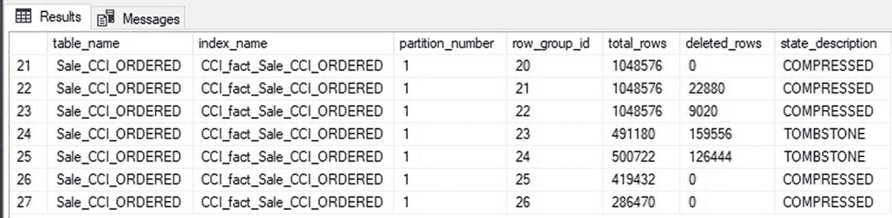
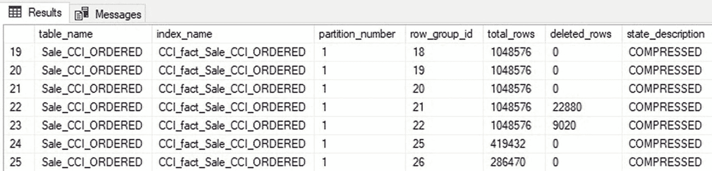
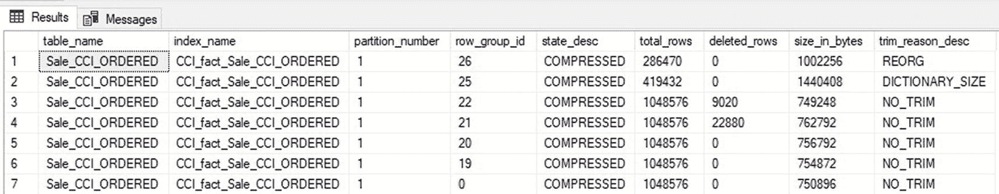
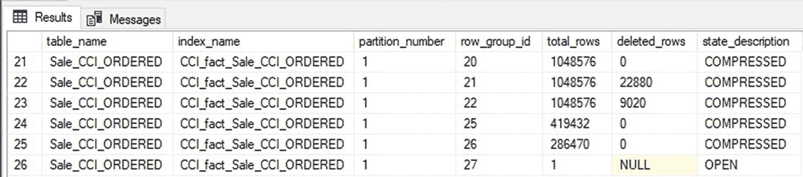
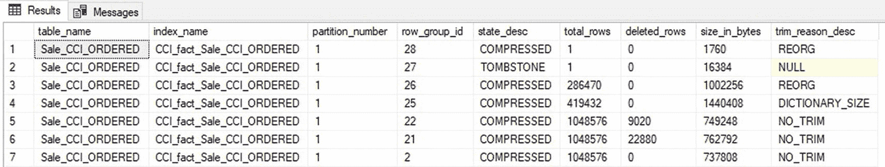
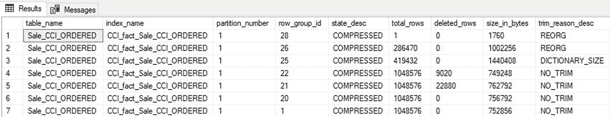

# 列存储索引重组

对于列存储索引，可用的最快且最简单的操作是 `REORGANIZE`。这是一项联机操作，可完成以下任务：

-   通过列存储索引合并来组合尺寸过小的行组。当多个行组可以合并到一个新的行组（行数少于 `1,024,576` 或 `2²⁰`）时，就会发生此情况。
-   可能通过自合并删除已删除的行。这仅在行组中有超过 `102,400` 行被删除时才会发生。

如果这两项任务都适用于一组行组，则合并操作将优先于自合并操作。由于字典压力而被修剪的行组无法与其他行组合并，无论其行数多少。

为了演示列存储 `REORGANIZE` 操作可以使用的合并和自合并操作，将从列存储索引中删除大量行，如清单 14-6 所示。

```sql
DELETE
FROM Fact.Sale_CCI_ORDERED
WHERE [Invoice Date Key] <= '1/17/2013';
```
*清单 14-6: 删除大部分行组的查询*

图 14-9 显示了使用清单 14-1 中提供的相同查询，列存储索引行组元数据中已删除行的结果集。



*图 14-9: 列存储索引每个行组的已删除行数*

右侧的第二列显示行组中的总行数，而最右侧的列则提供了已删除的行数。在有已删除行的行组中，只有行组 `23` 和 `24` 的已删除行数超过 `102,400` 行，符合自合并操作的条件。这些行组也是列存储合并操作的有效目标，因为它们可以被合并，生成的行组包含的行数将少于列存储行组的行数上限（`2²⁰` 行）。

列存储 `REORGANIZE` 操作的语法如清单 14-7 所示。

```sql
ALTER INDEX CCI_fact_Sale_CCI_ORDERED ON Fact.Sale_CCI_ORDERED REORGANIZE;
```
*清单 14-7: 列存储重组操作的语法*

`REORGANIZE` 操作完成后，可以再次查看行组元数据，如图 14-10 所示。



*图 14-10: 索引 REORGANIZE 操作后的行组元数据*

请注意，行组 `23` 和 `24` 现在被标记为 `**墓碑状态**`，并将在不久的将来由元组移动器清理。创建了两个新的行组（`25` 和 `26`）来替代它们，其中已删除的行已被移除。自合并操作本质上会创建新的行组，将所有未删除的行复制到其中，并将它们交换为活动行组，同时将先前的版本标记为待清理。生成的行组不再有已删除行的负担。请记住，自合并仅在行组中有超过 `102,400` 行被删除时才会发生。

一分钟后，行组元数据确认标记为 `**墓碑状态**` 的行组已从列存储索引中移除，如图 14-11 所示。这是一个自动清理过程，无需操作员干预即可触发。



*图 14-11: 元组移动器移除墓碑状态行组后的行组元数据*

只有当行组尺寸过小的原因与字典压力无关时，行组才能被合并。图 14-12 显示了此列存储索引在 `sys.dm_db_column_store_row_group_physical_stats` 中的额外元数据。



*图 14-12: 列存储索引的行组元数据，包括行组修剪原因*

因为行组 `25` 是由于字典压力而被修剪的，所以它不能与行组 `26` 合并，即使它们合并后的行数可以使它们放入单个行组。

## 重组以移除增量行组

在发出列存储索引 `REORGANIZE` 命令时，还有一个额外的选项可用：`COMPRESS_ALL_ROW_GROUPS` 选项。使用此选项时，SQL Server 将初始化元组移动器来处理增量存储的内容，并将它们移动到压缩行组中。这有效地清空了增量存储，将所有数据移入压缩行组。

此操作的优点是确保更快的读取操作，因为在处理查询时无需读取增量存储的行存储结构。缺点是，它是一个额外的维护选项，需要时间和资源来执行。考虑清单 14-8 中所示的 `INSERT` 操作。

```sql
INSERT INTO Fact.Sale_CCI_ORDERED
([Sale Key], [City Key], [Customer Key], [Bill To Customer Key], [Stock Item Key], [Invoice Date Key], [Delivery Date Key],
[Salesperson Key], [WWI Invoice ID], Description, Package, Quantity, [Unit Price], [Tax Rate], [Total Excluding Tax], [Tax Amount],
Profit, [Total Including Tax], [Total Dry Items], [Total Chiller Items], [Lineage Key])
VALUES
(   6769, 69490, 0, 0, 26, '2013-02-10', '2013-02-11', 36, 2081, 'Coffee Mug', 'Each', 17, 12.42, 8.00, 211.14, 16.89, 75.00, 228.03,
17, 0, 11);
```
*清单 14-8: 向列存储索引执行的小型 INSERT 操作*

一行被插入到列存储索引中。行组元数据可以确认新行驻留在一个打开的增量行组中，如图 14-13 所示，使用的是清单 14-1 中的相同查询。



*图 14-13: 新插入行到增量行组的行组元数据*

增量存储中只有一行，将使用 `COMPRESS_ALL_ROW_GROUPS` 选项运行 `REORGANIZE` 操作，如清单 14-9 所示。

```sql
ALTER INDEX CCI_fact_Sale_CCI_ORDERED ON Fact.Sale_CCI_ORDERED REORGANIZE WITH (COMPRESS_ALL_ROW_GROUPS = ON);
```
*清单 14-9: 使用 COMPRESS_ALL_ROW_GROUPS 选项执行 REORGANIZE*

索引维护后的列存储元数据如图 14-14 所示。



*图 14-14: 索引维护后立即的行组元数据*

元数据显示压缩行组中只有一行，旧的增量存储被设置为 `**墓碑状态**`，等待清理。图 14-15 显示了 `**墓碑状态**` 行组被清理后的行组元数据。



*图 14-15: 垃圾回收后的行组元数据*

只有一个行的压缩行组是愚蠢的，所以将对列存储索引再执行一次 `REORGANIZE`。生成的元数据可以在图 14-16 中看到。


*图 14-16: 尺寸过小的行组合并后的行组元数据*

行组 `25` 由于字典压力仍然尺寸过小，但行组 `26` 和 `28` 已合并为新形成的行组 `29`。修剪原因描述让操作员了解到该行组是通过索引 `REORGANIZE` 操作创建和填充的。

索引 `REORGANIZE` 操作是组合尺寸过小行组的绝佳方法，前提是它们不受字典大小限制的影响。它们也可以删除已删除的行，前提是已删除的行数大于 `102,400`。最后，借助 `COMPRESS_ALL_ROW_GROUPS` 选项，索引 `REORGANIZE` 可以将增量存储的内容处理到压缩行组中，如果需要，这些行组随后可以通过进一步的 `REORGANIZE` 操作进行合并。


