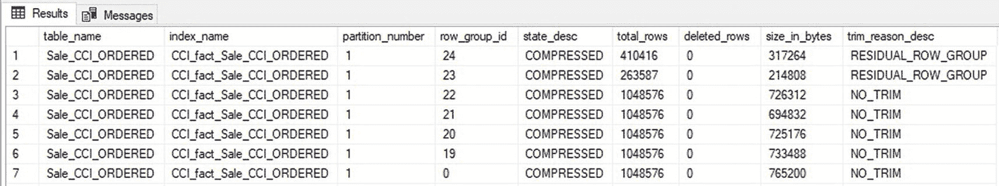
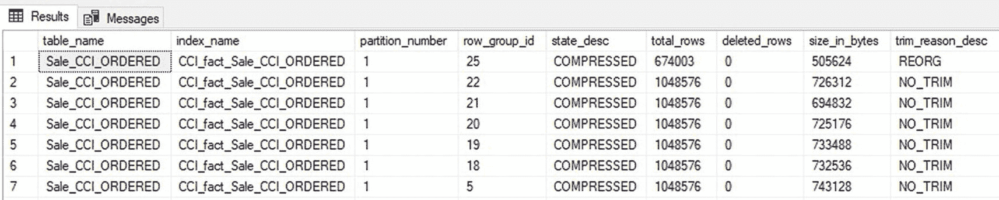
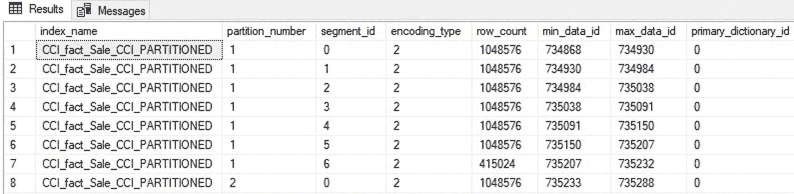
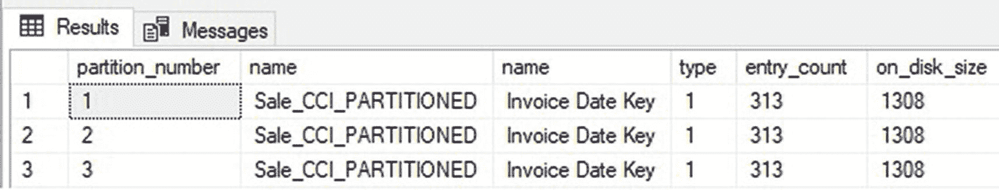
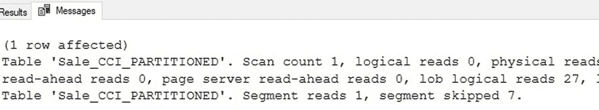
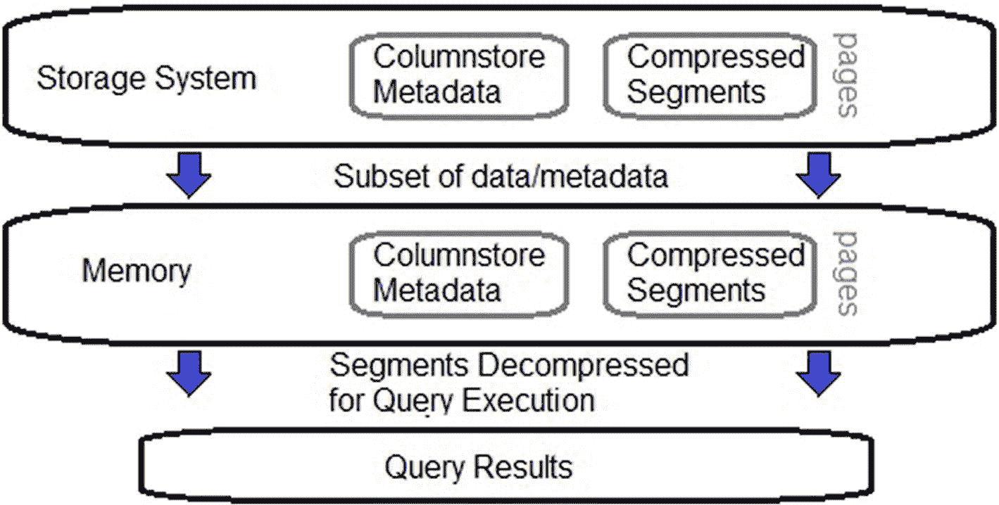
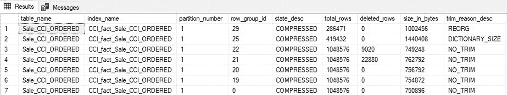
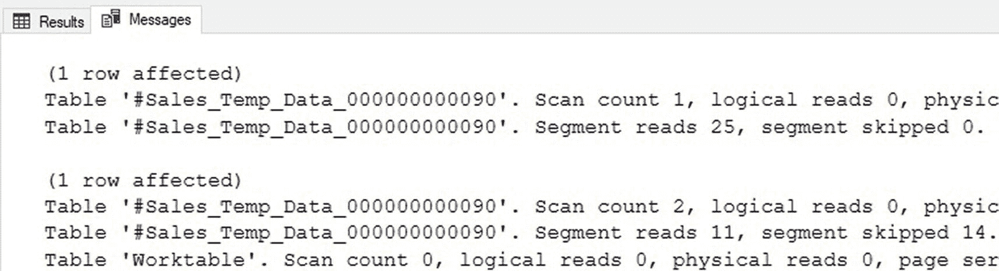
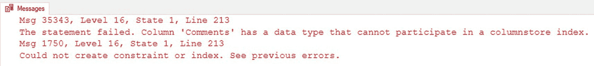

# 列存储索引重建

重建列存储索引的功能类似于重建行存储索引。发出`REBUILD`命令时，会创建列存储索引的一个全新副本，替换旧索引。虽然这是一个代价高昂的过程，但其结果是：

*   行组在可能的情况下被填满至容量。
*   所有已删除的行都被消除。
*   所有增量存储都被处理和压缩。
*   即使之前没有应用过，也会进行 Vertipaq 优化。

本质上，`REBUILD`大致等同于使用`CREATE INDEX`语句重新创建一个列存储索引。唯一的区别在于，新的索引构建完成前，现有的索引结构将保持不变。对于在线重建，这确保了在重建操作运行期间，查询可以继续使用列存储索引。

从 SQL Server 2019 开始，重建聚集列存储索引只能作为在线操作完成。而非聚集索引无论 SQL Server 版本如何，都可以在线重建。

考虑本章最近测试的列存储索引。清单`14-10`中的 T-SQL 对该索引发出了`REBUILD`命令。

```
ALTER INDEX CCI_fact_Sale_CCI_ORDERED ON Fact.Sale_CCI_ORDERED REBUILD;
```

清单 14-10
针对聚集列存储索引的`REBUILD`语句

`REBUILD`操作所需的时间明显长于`REORGANIZE`，因为整个索引必须被完全重新创建。相反，`REORGANIZE`遵循特定的规则来确定要执行的工作，并且通常只操作列存储索引的一小部分。图`14-17`显示了`REBUILD`操作完成后的列存储索引。



图 14-17
列存储索引`REBUILD`后的行组元数据

`REBUILD`后，列存储索引没有已删除的行，并且行组基本是满的。奇怪的是，最后两个行组（23 和 24）是尺寸不足的残留物，可以通过索引`REORGANIZE`操作清理掉。图`14-18`中的元数据显示了在`REBUILD`之后索引又进行了一次额外的`REORGANIZE`后的最终结果。



图 14-18
列存储索引`REBUILD`和`REORGANIZE`后的行组元数据

最终，索引变得非常干净，有 23 个完全满的行组，以及 1 个由索引维护操作遗留下来的额外行组。

索引`REBUILD`操作应不频繁地用于管理以下几种情况之一：

*   长期累积的尺寸不足的行组，无法通过`REORGANIZE`操作合并。
*   每个行组少于 102,400 行的大量已删除行，且无法通过`REORGANIZE`操作处理。
*   列存储索引中存在大量乱序数据。这必须与重新排序数据的工作结合处理，如下一节所示。

请注意，当发出索引`REBUILD`时，如果需要，压缩类型可能会更改为列存储归档压缩或从中更改。由于索引`REBUILD`是一个代价高昂的操作，并且在 SQL Server 2019 之前是离线的，因此应注意在维护窗口期间执行重建，此时此类工作对使用此数据的进程来说更容易被接受。

有时，由于软件版本对基础架构和数据进行了重大更改，数据可能会变得严重碎片化。如果预计会发生这种情况，那么在软件版本发布后安排索引`REBUILD`作为后处理步骤，将是确保即使在破坏性的软件版本发布后，数据仍能持续高效交付给分析流程的绝佳方式。

`REBUILD`操作可以针对特定分区，从而只重建严重碎片化的数据。对于一个大型列存储索引，其中只有一小部分被频繁写入，这是加速重建并最小化对分析数据用户干扰的绝佳方式。


## 列存储索引的重新排序与重建

聚集列存储索引并不强制规定数据的物理顺序。这取决于设计这些表的数据架构师，由他们决定如何排序数据，并确保任何写入该表的操作都强制执行该顺序。在不构建新表和结构的前提下，有效解决数据无序存储挑战的唯一方法是执行以下任务：

1.  删除列存储索引。
2.  创建一个键列与表的数据顺序匹配的聚集行存储索引。
3.  使用 `DROP_EXISTING=ON` 选项创建一个新的聚集列存储索引。

聚集行存储索引用于强制表内容采用新的数据顺序，而新的列存储索引会替换它，并保留这个新的数据顺序。

这是一个昂贵且具有破坏性的过程。从索引被删除到新的列存储索引完全构建完成期间，分析查询将无法利用列存储索引。因此，在维护窗口内实施这个过程是值得的，那时造成的干扰更容易被接受。

清单 [14-11] 中的脚本执行这些操作，将数据从其当前状态重新排序为完全按 `Invoice Date Key` 排序的数据。

```
/*     Step 1 */
DROP INDEX CCI_fact_Sale_CCI_ORDERED ON Fact.Sale_CCI_ORDERED;
/*     Step 2 */
CREATE CLUSTERED INDEX CCI_fact_Sale_CCI_ORDERED ON Fact.Sale_CCI_ORDERED ([Invoice Date Key]);
/*     Step 3 */
CREATE CLUSTERED COLUMNSTORE INDEX CCI_fact_Sale_CCI_ORDERED ON Fact.Sale_CCI_ORDERED WITH (DROP_EXISTING=ON, MAXDOP=1);
```
*清单 14-11 修复聚集列存储索引中数据排序不佳的过程*

请注意，删除聚集列存储索引不是一个快速的操作。它需要将列存储结构转换为 B 树/堆结构，这比删除聚集行存储索引需要更多的计算资源。

修复列存储索引数据顺序的过程应保留到数据碎片化程度高到足以对分析过程产生负面影响的场景中使用，并且应作为一种不频繁的操作。

如果数据在列存储索引中快速变得无序，那么请考虑改变数据加载过程的操作方式，以通过这些数据加载来减少碎片。以下是实现这一目标的一些有用指南：

*   移除对列存储索引的所有 `UPDATE` 操作。尽可能在暂存表上执行更新。
*   避免无序插入数据。使用临时表或暂存表来确保在插入新数据之前数据已正确排序。

尽管过程复杂，但修复无序数据的操作可以逐分区执行，从而允许仅对包含温/热数据的活动分区进行昂贵的索引维护操作。对于具有多个分区的列存储索引，这可以节省大量时间，并减少对分析过程的干扰和停机时间。

## 按分区进行列存储索引维护

重建列存储索引的特定分区的语法如清单 [14-12] 所示。

```
ALTER INDEX CCI_fact_Sale_CCI_PARTITIONED ON Fact.Sale_CCI_PARTITIONED REBUILD PARTITION = 5;
```
*清单 14-12 在分区表上重建列存储索引的单个分区的查询*

在此示例中，如果分区号 5 被确定为唯一包含定期加载/修改数据的分区，那么仅重建该分区将节省大量的维护时间，因为其他分区可以被跳过。

## 非聚集列存储索引的索引维护

非聚集列存储索引在索引维护方面的灵活性较低。数据顺序由聚集行存储索引强制执行，因此列存储索引内的数据顺序质量由其对应的聚集行存储索引规定。如果表的聚集行存储索引恰好是列存储索引的排序列，并且该表不受 `UPDATE` 操作的影响，那么非聚集列存储索引将有效地维护数据顺序。

否则，非聚集列存储索引的索引维护将类似于聚集列存储索引的维护：

*   使用 `REORGANIZE` 操作来合并过小的行组，处理增量存储，并消除较大的已删除行组。
*   使用 `REBUILD` 操作来消除过小的行组，并消除因 `UPDATE` 操作导致的无序数据。

这里的主要区别在于，`REBUILD` 可以消除由 `UPDATE` 操作产生的无序数据。重建时，非聚集列存储索引将按照聚集行存储索引规定的顺序创建，而聚集行存储索引不会像列存储索引那样受到 `UPDATE` 操作的负面影响。

`REORGANIZE` 和 `REBUILD` 操作都可作为非聚集索引的联机操作使用，这为安排定期（或一次性）维护提供了更大的灵活性。这意味着，即使正在重建索引，针对非聚集列存储索引的实时操作分析也可以继续高效进行。

与聚集列存储索引类似，对非聚集列存储索引的维护可以针对任何或所有分区执行，从而允许对活动数据进行维护，同时可以跳过未更改的数据。

## 15. 列存储索引性能

衡量任何数据结构的最终标准是数据检索的速度。在列存储索引中，返回数据所需的时间将是以下两个操作的函数：

*   元数据读取
*   数据读取

本章将逐步介绍测量、评估和调整列存储索引查询性能所需的步骤，包括分析查询和写入操作。它还将介绍列存储索引使用和性能优化的其他选项。


## 列存储元数据读取

为了确定要读取哪些数据以及如何读取，在任何列存储索引扫描之前，需要先读取列存储索引的元数据。这包括有关行组和段内容的元数据。请考虑**清单 15-1** 中的查询。

```sql
SELECT
    SUM(Quantity) AS Total_Quantity,
    SUM([Total Excluding Tax]) AS Total_Excluding_Tax
FROM Fact.Sale_CCI_PARTITIONED
WHERE [Invoice Date Key] = '7/17/2015';
```
**清单 15-1**
性能分析中使用的示例查询

针对 `Invoice Date Key` 的单个值聚合了两列。此表既是有序的又是分区的，因此将显著受益于分区消除和行组消除。执行查询时，会查阅列存储元数据以确定需要读取哪些段。

### 分区与元数据查阅

表 `Fact.Sale_CCI_PARTITIONED` 按年份对 `Invoice Date Key` 列进行分区，分区分配给了 2013、2014、2015、2016 和 2017 年。**清单 15-2** 提供了本演示中使用的分区方案和函数的定义。

```sql
CREATE PARTITION FUNCTION fact_Sale_CCI_years_function (DATE) AS RANGE RIGHT FOR VALUES
    ('1/1/2014', '1/1/2015', '1/1/2016', '1/1/2017');
CREATE PARTITION SCHEME fact_Sale_CCI_years_scheme AS PARTITION fact_Sale_CCI_years_function
    TO (WideWorldImportersDW_2013_fg, WideWorldImportersDW_2014_fg, WideWorldImportersDW_2015_fg,
        WideWorldImportersDW_2016_fg, WideWorldImportersDW_2017_fg)
```
**清单 15-2**
分区函数和分区方案定义

该表包含 2013 年至 2016 年的数据，因此不会使用最后一个分区。执行时，**清单 15-1** 中的查询会立即根据分区函数检查筛选条件，然后利用分区 scheme 根据该函数确定数据位置。基于此信息，可以判定只需要分区 `WideWorldImportersDW_2015_fg` 中的数据。

列存储元数据是为每个分区单独存储的，因此执行此查询时，只需查阅与包含 2015 年数据的分区相关的元数据。**图 15-1** 显示了此列存储索引中 `Invoice Date Key` 的段元数据。



**图 15-1**
Invoice Date Key 的列存储段元数据

元数据显示这是一个极其有序的列存储索引。请注意，随着值在每个分区内的各个段中推进，`min_data_id` 和 `max_data_id` 会逐步增加。编码类型 2 表示非字符串数据类型的字典编码，本例中是 `DATE`。此列使用的主要字典 ID 为零。

### 查询字典元数据

**清单 15-3** 中的查询提供了有关此列所用字典的一些额外细节。

```sql
SELECT
    partitions.partition_number,
    objects.name,
    columns.name,
    column_store_dictionaries.type,
    column_store_dictionaries.entry_count,
    column_store_dictionaries.on_disk_size
FROM sys.column_store_dictionaries
INNER JOIN sys.partitions
    ON column_store_dictionaries.hobt_id = partitions.hobt_id
INNER JOIN sys.objects
    ON objects.object_id = partitions.object_id
INNER JOIN sys.columns
    ON columns.column_id = column_store_dictionaries.column_id
    AND columns.object_id = objects.object_id
WHERE objects.name = 'Sale_CCI_PARTITIONED'
    AND columns.name = 'Invoice Date Key'
    AND column_store_dictionaries.dictionary_id = 0;
```
**清单 15-3**
返回列存储字典信息的查询

结果提供了关于此列所用字典的更多细节，如**图 15-2** 所示。



**图 15-2**
列存储字典元数据

这显示分区 1–3 共享一个单一的字典，大小仅为紧凑的 1308 字节。这里展示的场景本质上是最优的列存储索引和查询。索引是有序且分区的，而查询与该顺序完美契合，从而最大限度地减少了其执行过程中需要读取的元数据量。

### 最小化元数据读取的重要性

尽管与数据本身相比，列存储元数据可能看起来不大，但重要的是要记住，拥有十亿行的列存储索引大约会有一千个行组。每个行组将为每列包含一个段。对于这个包含 21 列的表，每十亿行的元数据将包含大约 21,000 个段。需要读取行组、段、字典等元数据，可能会给 SQL Server 带来不小的工作量。与数据本身一样，元数据在被读取之前也需要加载到内存中。因此，维护一个有序的表和分区（如果需要）可以确保在执行分析查询时不会读取过多的元数据。

回到**清单 15-1** 中的分析查询，可以预期它将快速执行，导致元数据读取量最小，数据读取量也最小。该查询的 `STATISTICS IO` 输出如**图 15-3** 所示。



**图 15-3**
一个示例分析查询的 Statistics IO 输出

这个例子是一个理想场景，其中段消除、行组消除和分区相结合，提供了极低的读取量，并跳过了绝大多数段。虽然现实世界并不总能提供如此理想的列存储性能示例，但这说明了可以用来比较性能的上限。


## 列存储数据读取

一旦读取了列存储元数据，接下来就会读取数据本身。理解这一点至关重要：针对`列存储索引`的查询性能，最终将由查询执行时读取的**段数量**决定。在所有其他变量相同的情况下，一个读取 1000 个段的分析请求，其执行速度预计将比读取 100 个段的查询慢大约十倍。虽然`列存储索引`有时可能被视为撒了“仙尘”的神奇工具，但这是唯一一个没有魔法可言的领域，性能将由 IO 来引导。

段读取等同于页读取，后者代表了 IO 操作。如果所需的页面已经在内存中，那么操作将由逻辑 IO 组成，因为段直接从缓冲池中读取。如果所需页面尚未在内存中（或仅部分在内存中），则需要执行物理读取，将页面从存储复制到缓冲池。

段消除和行组消除是限制段读取的工具，有助于确保仅读取满足查询所需的数据量。应用于数据的列存储压缩质量有助于将数据压缩到尽可能少的页面中，从而减少 IO。

从最基本的结构来看，`列存储索引`受到与行存储表相同的速度限制约束。将页面从存储读取到缓冲池需要时间。从缓冲池解压和读取数据需要额外的时间。因此，需要读取的页面越少，`列存储索引`分析执行的速度就越快。

`列存储索引`使用的其他性能提升工具（如批处理模式操作或筛选索引）通过提高吞吐量或减少 IO 来进一步加快查询速度。在读取列存储数据这一步骤中，核心焦点就是通过一切可能的手段控制 IO。图 15-4 说明了数据和元数据如何从存储读取直至被查询结果使用。



**图 15-4**
列存储数据和元数据从存储到内存再到被查询使用的流转过程

虽然整个`列存储索引`都驻留在存储系统上，但通常只有一部分会保存在缓冲池中。在整个 IO 过程中，段始终保持压缩状态，直到查询需要它们时，才会被解压缩，然后数据被返回给`SQL Server`。

## 内存容量规划

迄今为止所有的性能讨论都集中在减少 IO 上。尽管已尽一切努力最小化不必要的 IO，但较大的`列存储索引`最终仍将需要从存储中将大量段读取到内存中。

确保`列存储索引`高性能的下一步是准确估计应分配给`SQL Server`以支持分析查询的内存量。

内存太少，数据将不断被移出内存，而很快又需要时，又得重新读回缓冲池。从存储读取数据（即使是快速存储）的过程将远远超过执行分析查询的其他步骤。

内存太多则代表未使用的计算资源，这相当于浪费金钱。

为支持`列存储索引`而向`SQL Server`分配内存需要几个步骤：

1.  测量`列存储索引`的大小。
2.  估算索引中应始终驻留在内存中的热数据所占的比例。
3.  估算索引中代表温数据的比例。这些数据将为某些分析需求而存在于内存中，但不是全部。
4.  估算随时间的数据增长，这将调整前面计算出的数字。

任何非热或非温的数据预计都是冷数据，很少使用。它可能仍然有价值，但访问频率不足以围绕它设计整个系统。如果需要这种灵活性，可以在运行时由 Azure、AWS 或其他托管服务分配资源，但这完全是可选的，取决于组织以及对冷数据快速访问的重要程度。

考虑一个假设的`列存储索引`，如代码清单 15-4 所示。

```
2017: 10,000,000 rows (1GB) - cold/rarely used
2018: 50,000,000 rows (3GB) - cold/rarely used
2019: 100,000,000 rows (5GB) - cold/rarely used
2020: 250,000,000 rows (10GB) - warm/sometimes used
2021: 500,000,000 rows (18GB) - hot/often used
```

**代码清单 15-4**
列存储索引中数据的行数和大小

该索引显示了分析中的一个常见趋势，即最近一年的数据被大量用于当前报告。前一年的数据也经常被访问以进行同比分析。所有历史数据都很重要且必须保留，但与较新的数据相比，其读取频率并不高。

基于提供的数字，如果目标是确保最常用的数据在内存分配中得到考虑，那么这个`列存储索引`将需要 18GB 内存，以确保所有 18GB 的热数据在需要时可以驻留在内存中。

如果那 10GB 的温数据也很重要，那么分配一定量（最多 10GB）的内存将有助于确保数据不会在内存中过于频繁地换入换出，并且在请求时不会取代内存中更重要的热数据。如果资源充足，那么分配完整的 10GB 将完全完成此任务。否则，负责此数据的组织需要确定温数据的重要性，并分配最多 10GB 的额外内存来覆盖它。例如，如果估计 2020 年后半部分的数据会较定期地被请求，而前半部分使用频率会低得多，那么为这块温数据分配 5GB 内存将是一个不错的估算。

剩余的 2017 年至 2019 年的 9GB 数据将不会获得任何内存分配，因为它们很少被读取，其对性能的影响过于罕见，对大多数组织来说无关紧要。如果偶尔的分析或报告造成的干扰足够大，可以考虑增加更多内存以减少这种干扰，但这应该根据具体情况具体分析。


此例也展示了一个相当直接的、大约每年翻倍的增长情况。如果预计这一增长率将持续，并且热数据和温数据的年份预计每年向前滚动，那么一年后，当前的热数据（18GB）将变为温数据，当前的温数据（10GB）将变为冷数据，而明年的数据（约 35GB）将成为新的热数据。因此，逐年增长将表示为

*   (35GB + 18GB) - (18GB + 10GB) = `25GB`。

请注意，内存中使用的 `columnstore` 数据大小通常与数据总量不同。一个拥有 20 列的 `columnstore` 索引，其各列的使用可能并不均衡。某些列很可能很少被使用。如果是这种情况，那么内存估算可以相应调低所需的内存量，以考虑到那些不常驻内存的列。虽然这些不常被查询的列不能归类为冷数据，但可以从内存总量中扣除它们，以确保内存估算不会因那些很少需要的段而过度膨胀。

例如，如果 2021 年的 18GB 数据中包含了 5GB 很少被查询的列，并且有把握知道这些列的使用频率有多低，那么该数据的内存估算可以从 18GB 减少到低至 13GB。

这项工作涉及大量的估算。在最高端，内存预算可以涵盖 `columnstore` 索引消耗的所有空间。在最低端，可能不会为这些分析分配内存。一个切合实际的估算将处于两者之间，并将受到对这些数据所需的性能以及计算资源的可用性/成本的影响。

## 字典大小与字典压力

字典编码是 SQL Server 能用以提高 `columnstore` 压缩效率的众多方法之一。第 5 章详细讨论了编码方法，以及 `columnstore` 索引如何利用字典编码来大幅减小具有重复值的列的索引大小。

虽然字典可以跨多个段共享，但字典编码的一个注意事项是其大小上限为 16 兆字节。因此，如果一个列具有较宽且不常重复的值，那么结果可能是一个字典在 `rowgroup` 完全写满之前就已填满。字典被填满的情况被称为字典压力。虽然字典被限制为 16MB，但字典压力通常会在远低于此大小的情况下发生，因为限制的是将消耗多少空间，而不是当前已使用了多少空间。

当 `columnstore` 索引遇到字典压力时，当前正在写入的 `rowgroup` 将被关闭，并创建一个新的 `rowgroup` 以及一个新的字典。这有两个重要影响：

*   **字典消耗空间：** 支持 `columnstore` 索引所需的字典越多、它们越大，那么读写它们所需的存储空间和内存就越多。
*   **过小的行组导致碎片化：** 一个 `rowgroup` 最多可包含 `2²⁰` (1,048,576) 行。当 `rowgroup` 因字典压力而尺寸过小（远低于 `2²⁰` 行）时，SQL Server 就需要维护更多的 `rowgroup`、段和字典。这反过来会浪费资源并减慢需要这些表的分析速度。

幸运的是，字典压力很容易诊断。一旦识别出来，就可以制定解决方案来解决它。考虑如图 15-5 所示的 `rowgroup` 元数据。



图 15-5：字典压力示例

在此示例中，`row_group_id` 25 显示截断原因为 `DICTIONARY_SIZE`，行数为 419,432 行。在此 `rowgroup` 中，SQL Server 正在向其加载行，此时字典达到了一个大小，在不使其超过 16MB 上限的情况下无法再添加更多条目。如果这是唯一一个这样的 `rowgroup`，那么字典压力可能不会被视为一个严重问题。如果有许多 `rowgroup` 被截断在这样低的行数上，那么字典压力无疑会抑制最佳性能，值得调查和解决。

字典压力有两个主要原因：

*   宽度很大的列
*   具有许多不同值的列

涉及字典压力的最常见场景源自那些既很宽又具有许多不同值的列。对于字典压力这一挑战，没有放之四海而皆准的解决方案。三种最常见的解决方案可视为解决此挑战的最简单方法：

*   将宽列规范化为查找（维度）表。
*   在不同的列上排序。
*   对表进行分区。

#### 规范化宽列

最简单的解决方案需要更改架构，因此可能带来干扰，那就是规范化被识别为字典压力来源的宽列。规范化一个列是用一个较小的数字列替换一个宽列（通常是字符串数据）。查找表很可能使用聚集 `rowstore` 索引存储，并辅以一个支持性的非聚集 `rowstore` 索引来处理针对文本数据的查询。

在为大型分析表考虑 `columnstore` 索引时，请密切关注任何宽列，并在测试过程中，执行在数据上创建 `columnstore` 索引的操作。创建后，请注意 `rowgroup` 的行数以及是否发生字典压力。如果 `rowgroup` 的尺寸小了 10% 或更多，并且宽列是罪魁祸首，则考虑对其进行规范化。

查找表可以包含其他元数据，以支持对其进行高效搜索，例如哈希值、搜索条件或可以建立索引并用于在需要检查文本列之前快速减少行数的详细信息。

#### 添加或更改列存储排序列

有时，`columnstore` 索引内的数据排序方式会导致较差的字典编码。如果 `columnstore` 索引未排序，或者在某个倾向于将数据与非相似值分组在一起的列上排序，那么较宽的列可能会成为字典压力的来源。

`columnstore` 索引的排序列应始终是最常用于过滤查询的列。如果有多种常见的搜索条件，则可能存在其他能提供更好压缩和性能的排序选项。

这个解决字典压力的方案需要在常见分析查询上进行前后测试，以确保一个问题（字典压力）没有被交换成另一个问题（分析查询性能不佳）。


#### 分区

分区列存储索引的一个关键要素是，每个分区都包含自己独立的列存储索引。例如，一个被拆分为十个分区的表，将在每个分区中包含一个独立的列存储结构。这甚至包括独立的字典！

当列存储索引的行数变得非常大（数亿或数十亿行）时，分区可以在 SQL Server 中提供显著的性能和维护优势。除了分区消除外，跨分区分离字典还能带来额外的性能提升。当宽列的值随时间变化缓慢时，此解决方案尤其有效。在这些场景中，从一天到下一天的数据会包含许多重复值，但跨月或跨年则不会。

在对表进行分区时，需要注意所创建分区的大小。因为每个分区都代表一个独立、分离的列存储索引，所以每个分区足够大以受益于列存储索引的关键属性至关重要。因此，请确保每个分区至少有数千万行。同样，异常庞大的分区（数十亿行）在字典压力方面可能会遇到与未分区表相同的问题。

测试对于确认分区在列存储索引中的益处非常重要。一般来说，如果一个表包含数亿行（或更多），能够使用列存储排序列作为分区列将其细分为更小的块，将有助于实现性能优势。如果存在字典压力，那么通过跨分区拆分字典，这可能成为管理字典压力的有效方法。

第 11 章将深入探讨分区，包括如何实现它的演示，以及除了缓解字典压力挑战之外，它还能提供诸多益处。

总的来说，字典在存储其查找数据方面非常高效，列存储索引通过使用它们而获益巨大。字典压力应被视为一种特殊情况，只有在其导致明显的性能问题时才需要 investigate。

#### 临时表上的列存储索引

对于需要使用临时数据即时处理分析数据的场景，向临时对象添加列存储索引可能很有价值。这是一个独特的用例，很少需要，但可以为 ETL 流程或任何需要对中间或临时数据集执行许多昂贵查询的分析提供卓越的价值。

向临时表添加列存储索引的工作方式与向永久表添加完全相同。清单 15-5 展示了如何完成此任务的示例。

```
CREATE TABLE #Sales_Temp_Data
(      [Sale Key] BIGINT NOT NULL,
[Customer Key] INT NOT NULL,
[Invoice Date Key] DATE NOT NULL,
Quantity INT NOT NULL,
[Total Excluding Tax] DECIMAL(18,2) NOT NULL);
INSERT INTO #Sales_Temp_Data
([Sale Key], [Customer Key], [Invoice Date Key], Quantity, [Total Excluding Tax])
SELECT
[Sale Key], [Customer Key], [Invoice Date Key], Quantity, [Total Excluding Tax]
FROM Fact.Sale_CCI_PARTITIONED;
CREATE CLUSTERED COLUMNSTORE INDEX CCI_Sales_Temp_Data ON #Sales_Temp_Data;
清单 15-5
创建临时表、填充数据并添加列存储索引的查询
```

添加后，新建立索引的临时表可以像列存储索引永久表一样有效地进行查询，如清单 15-6 所示。

```
SELECT
COUNT(*)
FROM #Sales_Temp_Data;
SELECT
SUM(Quantity) * SUM([Total Excluding Tax])
FROM #Sales_Temp_Data
WHERE [Invoice Date Key] >= '1/1/2015'
AND [Invoice Date Key] < '1/1/2016';
清单 15-6
针对带有列存储索引的临时表的示例查询
```

这些查询执行相对较快，并返回请求的结果。图 15-6 显示了那对查询的 `STATISTICS IO` 输出。



图 15-6
针对带有列存储索引的临时表的查询的 IO

请注意，过滤查询读取了表中几乎一半的段，尽管只读取了大约四分之一的行。当填充此临时表时，没有强制执行数据顺序。因此，数据是按照 `SQL Server` 从源表读取的任意顺序插入的，这并不理想。根据临时表用于分析的广泛程度，在读取之前采取额外步骤对其进行排序可能值得，也可能不值得花费所需的时间和资源。这个价值在于分析流程是否足够快地完成，以及在此过程中是否使用了过多的计算资源。

如果需要同时使用事务型和分析型方法来切片数据，也可以在临时表上创建 `非聚集列存储索引`。这样做的一个好处是，聚集行存储索引可以强制表上的数据顺序，即使对其进行了进一步的写入。另一个好处是可以自定义列存储索引的列列表。这允许在剩余列可能用于其他操作时，仅对一小部分列子集进行分析。清单 15-7 展示了在临时表上创建非聚集列存储索引的语法。


## 15.3.2 在临时表和内存优化表上使用列存储索引

### 在临时表上使用列存储索引

在临时表上可以创建非聚集列存储索引，其语法与在永久表上使用的完全相同，一旦创建，其使用方式也相同。

请注意，**不允许**在表变量上创建列存储索引。清单 [15-8] 中的 T-SQL 代码展示了尝试这样做的操作。

```sql
CREATE TABLE #Sales_Temp_Data
(
      [Sale Key] BIGINT NOT NULL,
      [Customer Key] INT NOT NULL,
      [Invoice Date Key] DATE NOT NULL,
      Quantity INT NOT NULL,
      [Total Excluding Tax] DECIMAL(18,2) NOT NULL
);

INSERT INTO #Sales_Temp_Data
([Sale Key], [Customer Key], [Invoice Date Key], Quantity, [Total Excluding Tax])
SELECT
[Sale Key], [Customer Key], [Invoice Date Key], Quantity, [Total Excluding Tax]
FROM Fact.Sale_CCI_PARTITIONED;

CREATE CLUSTERED INDEX CI_Sales_Temp_Data ON #Sales_Temp_Data ([Sale Key]);
CREATE NONCLUSTERED COLUMNSTORE INDEX NCCI_Sales_Temp_Data ON #Sales_Temp_Data ([Invoice Date Key], Quantity, [Total Excluding Tax]);
```
*清单 15-7 展示在临时表上使用非聚集列存储索引*

```sql
DECLARE @Sales_Temp_Data TABLE
(
      [Sale Key] BIGINT NOT NULL,
      [Customer Key] INT NOT NULL,
      [Invoice Date Key] DATE NOT NULL,
      Quantity INT NOT NULL,
      [Total Excluding Tax] DECIMAL(18,2) NOT NULL
);

INSERT INTO @Sales_Temp_Data
([Sale Key], [Customer Key], [Invoice Date Key], Quantity, [Total Excluding Tax])
SELECT
[Sale Key], [Customer Key], [Invoice Date Key], Quantity, [Total Excluding Tax]
FROM Fact.Sale_CCI_PARTITIONED;

CREATE CLUSTERED COLUMNSTORE INDEX CCI_Sales_Temp_Data ON @Sales_Temp_Data;
```
*清单 15-8 尝试向表变量添加列存储索引的脚本*

该查询甚至无法编译，在解析阶段就会立即生成如图 [15-7] 所示的错误。


*图 15-7 尝试在表变量上创建列存储索引时的解析错误*

SQL Server 在解析阶段就会触发错误，然后才会创建和填充表变量。

在临时表上使用列存储索引不会是一个频繁使用的用例，但那些严重依赖于处理临时数据的特定过程可能会有效地利用它们。性能测试可以最终验证这是否是一个有帮助的解决方案，或者是否因价值不足而不值得采用。

### 内存优化列存储索引

列存储索引的一个常见用例是实时操作分析。非聚集列存储索引提供了针对 OLTP/行存储表高效执行分析查询的能力。通过选择要索引的列，列存储索引可用于解决分析无法轻松卸载到其他系统时存在问题的 OLAP 查询。

内存优化表是 OLTP 解决方案的终极形态。它们为高事务性工作负载提供了卓越的速度，同时消除了通常伴随争用工作负载出现的闩锁和锁定。它们也可以被列存储索引所针对，允许针对内存中高度事务性的表运行分析。这是一个小众用例，可以为本节将讨论的少数特定场景提供极快的速度。

#### 演示内存优化列存储索引

在深入研究列存储索引查询之前，重要的是要配置一个数据库，包含必要的文件组、文件和快照隔离设置，以允许创建内存优化表。清单 [15-9] 提供了在 SQL Server 中允许内存优化表所需的配置更改。

```sql
ALTER DATABASE WideWorldImporters ADD FILEGROUP WideWorldImporters_moltp CONTAINS MEMORY_OPTIMIZED_DATA;
ALTER DATABASE WideWorldImporters ADD FILE (name='WideWorldImporters_moltp', filename='C:\SQLData\WideWorldImporters_moltp') TO FILEGROUP WideWorldImporters_moltp;
ALTER DATABASE WideWorldImporters SET MEMORY_OPTIMIZED_ELEVATE_TO_SNAPSHOT = ON;
```
*清单 15-9 在 SQL Server 中启用内存优化表*

每个数据库只允许一个内存优化文件组。如果一个数据库已经有一个，那么再尝试添加另一个将导致如图 [15-8] 所示的错误。


*图 15-8 向已有内存优化文件组的数据库添加时遇到的错误*

完成这些基本配置步骤后，我们就可以尝试创建一个包含列存储索引的内存优化表。清单 [15-10] 中的脚本展示了一个示例表的创建。

```sql
CREATE TABLE Sales.Orders_MOLTP
(
      OrderID INT NOT NULL CONSTRAINT PK_Orders_MOLTP PRIMARY KEY NONCLUSTERED HASH WITH (BUCKET_COUNT = 150000),
      CustomerID INT NOT NULL,
      SalespersonPersonID INT NOT NULL,
      PickedByPersonID INT NULL,
      ContactPersonID INT NOT NULL,
      BackorderOrderID INT NULL,
      OrderDate DATE NOT NULL,
      ExpectedDeliveryDate DATE NOT NULL,
      CustomerPurchaseOrderNumber NVARCHAR(20) NULL,
      IsUndersupplyBackordered BIT NOT NULL,
      Comments NVARCHAR(MAX) NULL,
      DeliveryInstructions NVARCHAR(MAX) NULL,
      InternalComments NVARCHAR(MAX) NULL,
      PickingCompletedWhen DATETIME2(7) NULL,
      LastEditedBy INT NOT NULL,
      LastEditedWhen DATETIME2(7) NOT NULL,
      INDEX CCI_Orders_MOLTP CLUSTERED COLUMNSTORE
)
WITH (MEMORY_OPTIMIZED = ON, DURABILITY = SCHEMA_AND_DATA);
```
*清单 15-10 初始（不完善）的内存优化表（带列存储索引）创建脚本*

这个定义看起来有效，但执行时会返回错误，如图 [15-9] 所示。


*图 15-9 因内存优化列存储索引定义中包含 LOB 列而导致的错误*

`MAX` 长度的列**不允许**出现在内存优化列存储索引中。为了允许创建索引，需要将这些列规范化到另一个表中，或者缩小其大小。清单 [15-11] 展示了一个修订后的脚本，其中 `MAX` 长度的列已被缩小以适应此限制。

```sql
CREATE TABLE Sales.Orders_MOLTP
(
      OrderID INT NOT NULL CONSTRAINT PK_Orders_MOLTP PRIMARY KEY NONCLUSTERED HASH WITH (BUCKET_COUNT = 150000),
      CustomerID INT NOT NULL,
      SalespersonPersonID INT NOT NULL,
      PickedByPersonID INT NULL,
      ContactPersonID INT NOT NULL,
      BackorderOrderID INT NULL,
      OrderDate DATE NOT NULL,
      ExpectedDeliveryDate DATE NOT NULL,
      CustomerPurchaseOrderNumber NVARCHAR(20) NULL,
      IsUndersupplyBackordered BIT NOT NULL,
      Comments NVARCHAR(2000) NULL,
      DeliveryInstructions NVARCHAR(2000) NULL,
      InternalComments NVARCHAR(2000) NULL,
      PickingCompletedWhen DATETIME2(7) NULL,
      LastEditedBy INT NOT NULL,
      LastEditedWhen DATETIME2(7) NOT NULL,
      INDEX CCI_Orders_MOLTP CLUSTERED COLUMNSTORE
)
WITH (MEMORY_OPTIMIZED = ON, DURABILITY = SCHEMA_AND_DATA);
```
*清单 15-11 第二次（仍不完善）的内存优化表（带列存储索引）创建脚本*

将 `NVARCHAR(MAX)` 列替换为 `NVARCHAR(2000)` 后，脚本得以执行，但导致了一个新的错误，如图 [15-10] 所示。


