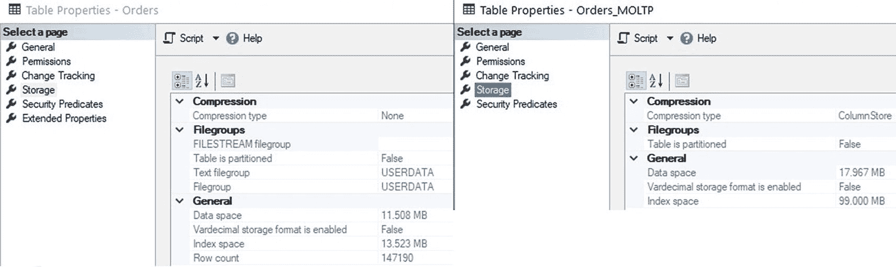
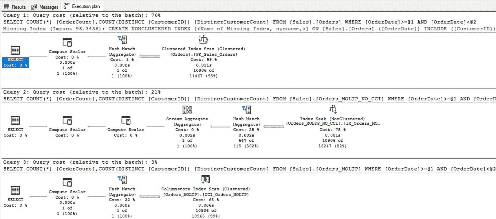

# 内存优化列存储索引：创建、比较与测试


### 图 15-10

由于内存优化列存储索引每行超过 8060 字节导致的错误

虽然这个错误信息似乎提供了一线希望，暗示如果在 SQL Server 2014 之后的版本上执行此表定义可能会成功，但结果仍然是失败。经过一些研究，最终设计出了一个表定义，它适应了这些限制，并允许（最终）创建表，如代码清单 15-12 所示。

```sql
CREATE TABLE Sales.Orders_MOLTP
(      OrderID INT NOT NULL CONSTRAINT PK_Orders_MOLTP PRIMARY KEY NONCLUSTERED HASH WITH (BUCKET_COUNT = 150000),
CustomerID INT NOT NULL,
SalespersonPersonID INT NOT NULL,
PickedByPersonID INT NULL,
ContactPersonID INT NOT NULL,
BackorderOrderID INT NULL,
OrderDate DATE NOT NULL,
ExpectedDeliveryDate DATE NOT NULL,
CustomerPurchaseOrderNumber NVARCHAR(20) NULL,
IsUndersupplyBackordered BIT NOT NULL,
Comments NVARCHAR(500) NULL,
DeliveryInstructions NVARCHAR(250) NULL,
InternalComments NVARCHAR(500) NULL,
PickingCompletedWhen DATETIME2(7) NULL,
LastEditedBy INT NOT NULL,
LastEditedWhen DATETIME2(7) NOT NULL,
INDEX CCI_Orders_MOLTP CLUSTERED COLUMNSTORE)
WITH (MEMORY_OPTIMIZED = ON, DURABILITY = SCHEMA_AND_DATA);
```

**清单 15-12**
适用于内存优化列存储索引的表创建语句

成功了！这个表包含了一些磁盘上表所不具备的特性：

*   使用非聚集哈希索引作为主键。
*   `MEMORY_OPTIMIZED = ON`。
*   `DURABILITY = SCHEMA_AND_DATA`。

持久性设置决定了在服务器重启时，此表的数据是否可以恢复，或者仅保留其架构。`SCHEMA_ONLY` 的速度明显更快，因为无需将数据持久化到磁盘存储。此外，启动也更快，因为无需将数据加载到表中即可使用。`SCHEMA_ONLY` 通常用于包含临时数据（如会话、ETL 或瞬态信息）的表，这些数据一旦处理完毕就不再需要。然而，`SCHEMA_ONLY` 不支持列存储索引，因此超出了本文后续讨论的范围。

请注意，列存储索引被标记为聚集列存储索引，但它并非真正的聚集索引。内存优化表的主要存储机制始终是内存中的行集。列存储索引是附加在内存优化对象之上的额外结构，也会被持久化到磁盘存储。这些注意事项导致 SQL Server 在维护列存储索引与内存优化表时产生了相当大的开销。

同样值得强调的是，这个内存优化聚集列存储索引包含许多宽列，这些列并不适合字典编码。`CustomerPurchaseOrderNumber`、`Comments`、`DeliveryInstructions` 和 `InternalComments` 是不太可能重复的字符串列。因此，它们可能无法很好地压缩，并可能导致字典压力，从而产生过小的行组，并进一步降低列存储效率。这不是决定性的障碍，但在考虑实施内存优化列存储索引时，理解这一点至关重要。主要为 OLTP 工作负载构建的表通常包含对事务处理至关重要但对分析可能并非最优的文本数据。解决这种情况的一种可能方法是将表拆分为两个，一个表包含字符串列和支持数据，另一个包含数字和度量值。这样就可以为一个表分配内存优化列存储索引，而另一个表则保留其内存优化行存储结构。

内存优化表不支持非聚集列存储索引，因此无法选择将哪些列包含在索引中。

创建了内存优化列存储索引后，可以执行代码清单 15-13 中的脚本，用与磁盘上表 `Sales.Orders` 相同的数据填充它。

```sql
INSERT INTO Sales.Orders_MOLTP
(      OrderID, CustomerID, SalespersonPersonID, PickedByPersonID, ContactPersonID, BackorderOrderID, OrderDate, ExpectedDeliveryDate,
CustomerPurchaseOrderNumber, IsUndersupplyBackordered, Comments, DeliveryInstructions, InternalComments, PickingCompletedWhen,
LastEditedBy, LastEditedWhen)
SELECT
OrderID, CustomerID, SalespersonPersonID, PickedByPersonID, ContactPersonID, BackorderOrderID, OrderDate, ExpectedDeliveryDate,
CustomerPurchaseOrderNumber, IsUndersupplyBackordered, Comments, DeliveryInstructions, InternalComments, PickingCompletedWhen,
LastEditedBy, LastEditedWhen
FROM Sales.Orders;
```

**清单 15-13**
用于向内存优化列存储索引填充数据的脚本

完成表的创建和数据填充后，可以将原始表 `Sales.Orders` 的大小与其内存优化对应表进行比较。注意每个表的索引内容：

`Sales.Orders`：

*   一个单列主键索引
*   四个单列索引
*   一个四列索引

`Sales.Orders_MOLTP`：

*   一个单列主键索引
*   一个列存储索引（在所有列上）



### 图 15-11

磁盘上表与带有聚集列存储索引的内存优化表的大小比较

注意图 15-11 中磁盘上表（25MB）与内存优化表（117MB）之间的显著大小差异。这是一个巨大的空间代价，并强调了将内存优化结构映射到列存储结构是一个比将非聚集行存储索引映射到聚集列存储索引更复杂的操作。在继续之前，将创建另一个内存优化表，如代码清单 15-14 所示。

```sql
CREATE TABLE Sales.Orders_MOLTP_NO_CCI
(      OrderID INT NOT NULL CONSTRAINT PK_Orders_MOLTP_NO_CCI PRIMARY KEY NONCLUSTERED HASH WITH (BUCKET_COUNT = 150000),
CustomerID INT NOT NULL,
SalespersonPersonID INT NOT NULL,
PickedByPersonID INT NULL,
ContactPersonID INT NOT NULL,
BackorderOrderID INT NULL,
OrderDate DATE NOT NULL INDEX IX_Orders_MOLTP_NO_CCI_OrderDate NONCLUSTERED,
ExpectedDeliveryDate DATE NOT NULL,
CustomerPurchaseOrderNumber NVARCHAR(20) NULL,
IsUndersupplyBackordered BIT NOT NULL,
Comments NVARCHAR(500) NULL,
DeliveryInstructions NVARCHAR(250) NULL,
InternalComments NVARCHAR(500) NULL,
PickingCompletedWhen DATETIME2(7) NULL,
LastEditedBy INT NOT NULL,
LastEditedWhen DATETIME2(7) NOT NULL)
WITH (MEMORY_OPTIMIZED = ON, DURABILITY = SCHEMA_AND_DATA);
GO
```

**清单 15-14**
用于创建不带列存储索引的内存优化表的语句

此表与之前创建的内存优化表相同，只是列存储索引被替换为在 `OrderDate` 上的非聚集索引。新表的总大小为 20MB，大约是列存储表大小的六分之一，代表了显著的空间节省。

考虑一个针对所有三个测试表执行的测试分析查询，如代码清单 15-15 所示。

```sql
SELECT
COUNT(*) AS OrderCount,
COUNT(DISTINCT(CustomerID)) AS DistinctCustomerCount
FROM Sales.Orders
WHERE OrderDate >= '1/1/2015'
AND OrderDate < '4/1/2015';
```

**清单 15-15**
针对每个订单表的测试分析查询

每个查询都返回了结果。执行计划可以在图 15-12 中看到。



### 图 15-12

针对多个表执行测试分析查询的执行计划


