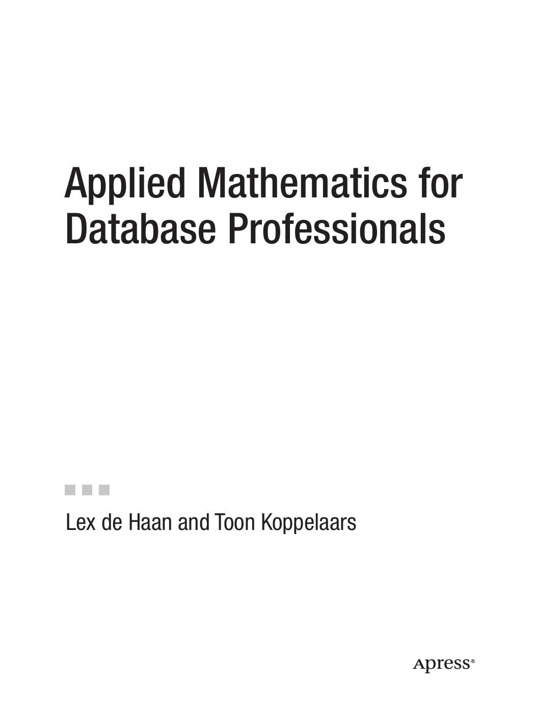

## 数据库专业人员的应用数学

Lex de Haan 和 Toon Koppelaars

## 数据库专业人员的应用数学

**版权所有 © 2007，作者 Lex de Haan 和 Toon Koppelaars**

保留所有权利。未经版权所有者及出版商的书面许可，不得以任何形式或任何方式（包括影印、录音或任何信息存储或检索系统）复制或传播本作品的任何部分。

ISBN-13: 978-1-59059-745-3
ISBN-10: 1-59059-745-1

印刷与装订于美国 9 8 7 6 5 4 3 2 1

本书中可能出现商标名称。为免混淆，我们并非在每次出现商标名称时都使用商标符号，而是仅以编辑方式使用这些名称，旨在为商标所有者谋利，并无侵犯商标权之意。

主编：Jonathan Gennick
技术审阅：Chris Date, Cary Millsap
编辑委员会：Steve Anglin, Ewan Buckingham, Gary Cornell, Jonathan Gennick, Jason Gilmore, Jonathan Hassell, Chris Mills, Matthew Moodie, Jeffrey Pepper, Ben Renow-Clarke, Dominic Shakeshaft, Matt Wade, Tom Welsh
项目经理：Tracy Brown Collins
文案编辑经理：Nicole Flores
文案编辑：Susannah Davidson Pfalzer
制作助理总监：Kari Brooks-Copony
制作编辑：Kelly Winquist
排版员：Dina Quan
校对员：April Eddy
索引员：Brenda Miller
美工：April Milne
封面设计师：Kurt Krames
制作总监：Tom Debolski

本书通过 Springer-Verlag New York, Inc.（地址：233 Spring Street, 6th Floor, New York, NY 10013）向全球图书贸易渠道发行。电话：1-800-SPRINGER，传真：201-348-4505，电子邮件：orders-ny@springer-sbm.com，或访问 http://www.springeronline.com。

有关翻译信息，请直接联系 Apress（地址：2855 Telegraph Avenue, Suite 600, Berkeley, CA 94705）。电话：510-549-5930，传真：510-549-5939，电子邮件：info@apress.com，或访问 http://www.apress.com。

本书信息按“原样”提供，不附任何担保。尽管在本书编写过程中已采取一切预防措施，但作者及 Apress 对因使用本书信息直接或间接引起的任何损失或损害概不负责。

本书源代码可供读者在 http://www.apress.com 的“源代码/下载”部分获取。您需要回答与本书相关的问题才能成功下载代码。

### Lex de Haan
### 1954–2006
“高大而修长，上层装满了好东西”
“一个缺失的值”

## 内容概览

前言 . . . . . . . . . . . . . . . . . . . . . . . . . . . . . . . . . . . . . . . . . . . . . . . . . . . . . . . . . . . . . . . . . . . . . . . . xv
关于作者 . . . . . . . . . . . . . . . . . . . . . . . . . . . . . . . . . . . . . . . . . . . . . . . . . . . . . . . . . . . . . . . xvii
关于技术审阅 . . . . . . . . . . . . . . . . . . . . . . . . . . . . . . . . . . . . . . . . . . . . . . . . . . . . . . . . . . . . . xix
致谢 . . . . . . . . . . . . . . . . . . . . . . . . . . . . . . . . . . . . . . . . . . . . . . . . . . . . . . . . . . . . . . . . . . . . xxi
前言 . . . . . . . . . . . . . . . . . . . . . . . . . . . . . . . . . . . . . . . . . . . . . . . . . . . . . . . . . . . . . . . . . . . . . xxiii
引言 . . . . . . . . . . . . . . . . . . . . . . . . . . . . . . . . . . . . . . . . . . . . . . . . . . . . . . . . . . . . . . . . . . . . . xxv

## 第一部分 ■■■ 数学基础

#### 第 1 章
逻辑：导论 . . . . . . . . . . . . . . . . . . . . . . . . . . . . . . . . . . . . . . . . . . . . . . . . . . . . . . . . . . . 3

#### 第 2 章
集合论：导论 . . . . . . . . . . . . . . . . . . . . . . . . . . . . . . . . . . . . . . . . . . . . . . . . . . . . . . . . 23

#### 第 3 章
更多逻辑知识 . . . . . . . . . . . . . . . . . . . . . . . . . . . . . . . . . . . . . . . . . . . . . . . . . . . . . . . . 47

#### 第 4 章
关系与函数 . . . . . . . . . . . . . . . . . . . . . . . . . . . . . . . . . . . . . . . . . . . . . . . . . . . . . . . . . . 67

## 第二部分 ■■■ 应用

#### 第 5 章
表与数据库状态 . . . . . . . . . . . . . . . . . . . . . . . . . . . . . . . . . . . . . . . . . . . . . . . . . . . . 91

#### 第 6 章
元组、表与数据库谓词 . . . . . . . . . . . . . . . . . . . . . . . . . . . . . . . . . . . . . . . . . . . . 117

#### 第 7 章
指定数据库设计 . . . . . . . . . . . . . . . . . . . . . . . . . . . . . . . . . . . . . . . . . . . . . . . . . . . 139

#### 第 8 章
指定状态转换约束 . . . . . . . . . . . . . . . . . . . . . . . . . . . . . . . . . . . . . . . . . . . . . . . . . 185

#### 第 9 章
数据检索 . . . . . . . . . . . . . . . . . . . . . . . . . . . . . . . . . . . . . . . . . . . . . . . . . . . . . . . . . . . . 199

#### 第 10 章
数据操作 . . . . . . . . . . . . . . . . . . . . . . . . . . . . . . . . . . . . . . . . . . . . . . . . . . . . . . . . . . . . 221

**iv**

## 第三部分 ■■■ 实现

#### 第 11 章
在 Oracle 中实现数据库设计 . . . . . . . . . . . . . . . . . . . . . . . . . . . . . . . . . . . . . . . 241

#### 第 12 章
总结与结论 . . . . . . . . . . . . . . . . . . . . . . . . . . . . . . . . . . . . . . . . . . . . . . . . . . . . . . . . . 305

## 第四部分 ■■■ 附录

#### 附录 A
示例数据库的形式化定义 . . . . . . . . . . . . . . . . . . . . . . . . . . . . . . . . . . . . . . . . . . 311

#### 附录 B
符号 . . . . . . . . . . . . . . . . . . . . . . . . . . . . . . . . . . . . . . . . . . . . . . . . . . . . . . . . . . . . . . . . 333

#### 附录 C
参考文献 . . . . . . . . . . . . . . . . . . . . . . . . . . . . . . . . . . . . . . . . . . . . . . . . . . . . . . . . . . . . 335

#### 附录 D
空值与三值（或更多值）逻辑 . . . . . . . . . . . . . . . . . . . . . . . . . . . . . . . . . . . . . . 337

#### 附录 E
部分习题答案 . . . . . . . . . . . . . . . . . . . . . . . . . . . . . . . . . . . . . . . . . . . . . . . . . . . . . . . 347

### 索引
. . . . . . . . . . . . . . . . . . . . . . . . . . . . . . . . . . . . . . . . . . . . . . . . . . . . . . . . . . . . . . . . . . . . . . . 367

**v**

