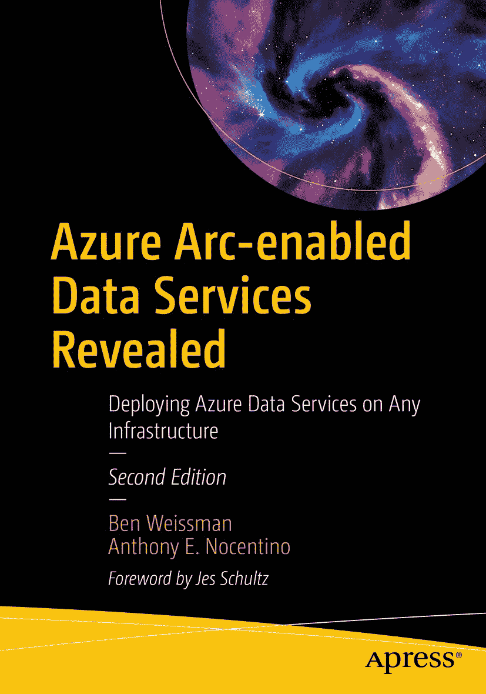

ISBN 978-1-4842-8084-3 电子书 ISBN 978-1-4842-8085-0 [`doi.org/10.1007/978-1-4842-8085-0`](https://doi.org/10.1007/978-1-4842-8085-0) © Ben Weissman 和 Anthony E. Nocentino 2021, 2022 本作品受版权保护。出版商全权独家许可所有权利，无论涉及材料的整体或部分，具体包括翻译权、转载权、图例重用权、朗诵权、广播权、缩微胶片或其他任何物理方式的复制权，以及信息存储与检索、电子改编、计算机软件方面的传输权，或目前已知或今后开发的任何类似或相异方法的使用权。在本出版物中使用通用描述性名称、注册商标、服务标志等，即使未作具体说明，也不意味着这些名称可不受相关保护性法律法规的约束而自由使用。出版商、作者和编辑可安全地假设本书中的建议和信息在出版时是真实准确的。出版商、作者或编辑均不就本书所含材料或任何可能存在的错误或遗漏提供明示或暗示的保证。出版商对出版地图中的管辖权主张和机构从属关系保持中立。

此 Apress 标识由 Springer Nature 旗下注册公司 APress Media, LLC 出版。

注册公司地址为：1 New York Plaza, New York, NY 10004, U.S.A.

