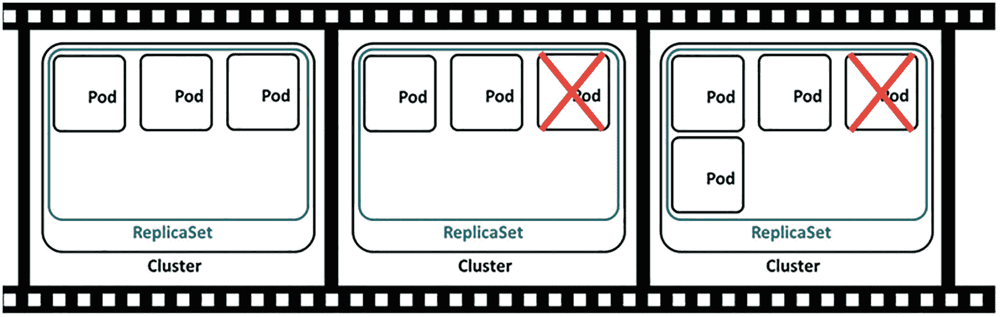
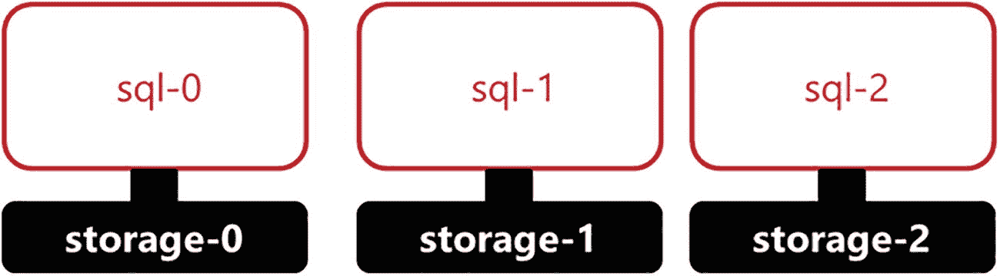
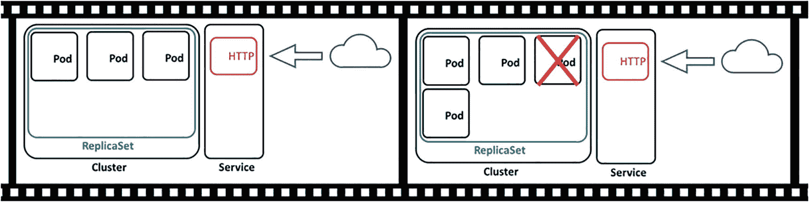
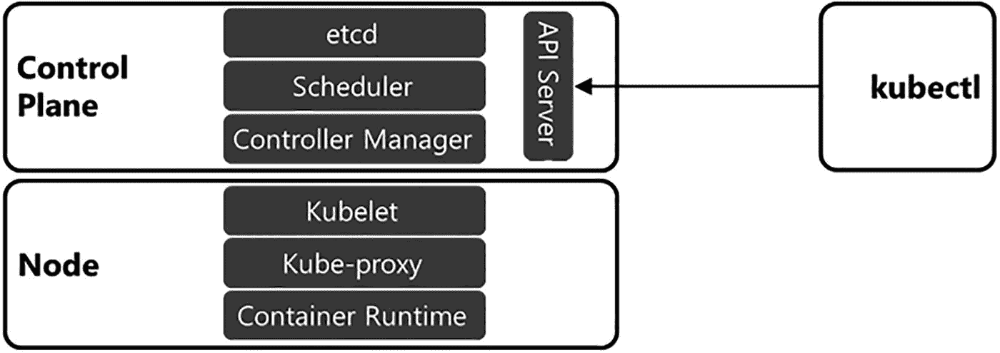
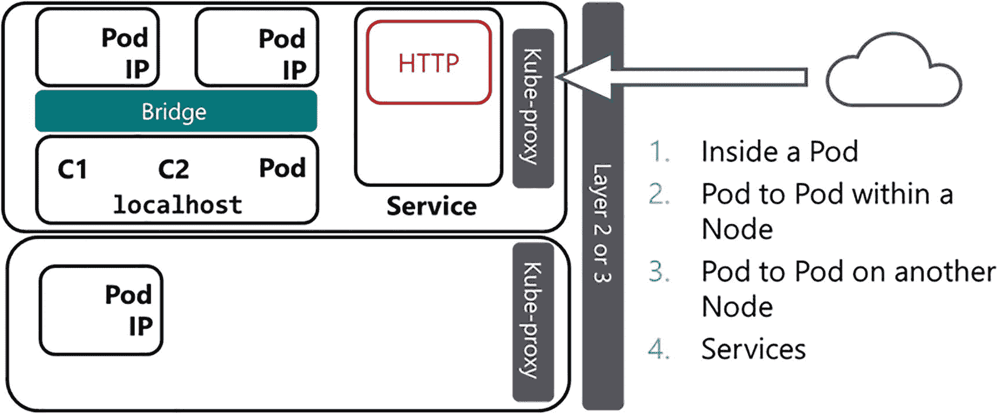

# 1. Kubernetes 入门

欢迎阅读《Azure Arc-enabled Data Services 揭秘》！本章介绍 Kubernetes，描述其在现代应用程序部署中的角色、提供的优势及其架构。从其优势开始，你将学习 Kubernetes 在现代基于容器的应用程序部署中所提供的价值。接下来，你将学习 Kubernetes API 如何让你以代码的形式构建和部署下一代应用程序和系统。在该部分，你将学习 Kubernetes 提供的用于定义和部署应用程序和系统的核心 API 原语。然后你将学习 Kubernetes 集群及其组件的关键概念。在本章结束时，你将了解 Kubernetes 在 Azure Arc-enabled Data Services 中的角色。

## 介绍 Kubernetes

Kubernetes 是一个容器编排器。它负责在数据中心内的服务器上启动基于容器的应用程序。为此，Kubernetes 使用代表数据中心资源的 `API 对象`，使开发人员和系统管理员能够以代码形式定义系统并使用该代码进行部署。基于容器的应用程序作为 `Pod` 部署到 `Kubernetes 集群`中。集群是计算资源（物理服务器或虚拟服务器）的集合，称为 `节点`。让我们更深入地探讨这些元素中的每一个，从 Kubernetes 的优势开始，了解其在现代应用程序部署中提供的价值。

### Kubernetes 的优势

以下是 Kubernetes 带来的主要优势：

*   **工作负载调度**：Kubernetes 是一个容器编排器，其主要目标是在一个 `集群` 的 `节点` 上启动基于容器的应用程序，称为 `Pod`。在 `集群` 中为 `Pod` 寻找最合适的运行位置是 Kubernetes 的职责所在。在将 `Pod` 调度到 `节点` 时，首要考虑是确定该 `节点` 是否有足够的 CPU 和内存资源来运行分配的工作负载。
*   **管理状态**：当代码部署到 Kubernetes 中，定义了一个需要运行的工作负载时，Kubernetes 有责任在 `集群` 中启动 `Pod` 和其他资源，并保持 `集群` 处于期望状态。如果 `集群` 的运行状态偏离了期望状态，Kubernetes 会尝试改变 `集群` 的运行状态，使其回到已定义的期望状态。例如，如果一个 `Deployment` 定义了需要运行一定数量的 `Pod`。如果某个 `Pod` 失败，Kubernetes 会在 `集群` 中部署一个新的 `Pod`，替换失败的 `Pod`，确保 `Deployment` 所定义数量的 `Pod` 都正常运行。此外，假设你想要扩展支持某个应用程序的 `Pod` 数量以增加容量。在这种情况下，你只需增加 `Deployment` 中的副本数量，Kubernetes 就会在 `集群` 中创建额外的 `Pod`，确保期望状态得以实现。更多内容将在后续关于控制器的章节中介绍。
*   **一致性部署**：通过代码部署应用程序可以实现可重复的流程。定义 `Deployment` 的代码是配置构件，可以存放在源代码控制中。你也可以使用这些代码，在开发环境等低版本环境，甚至在本地系统和云之间部署完全相同的系统。更多内容将在后续关于 Kubernetes API 的章节中介绍。
*   **速度**：Kubernetes 支持快速、受控的部署，能在 `集群` 中快速启动 `Pod`。此外，在 Kubernetes 中，你可以快速扩展应用程序。扩展支持应用程序的 `Pod` 数量可以简单到更改一行代码，而且这个过程可能只需几秒钟。在第[6]章中，通过向一个 `PostgreSQL` Hyperscale 部署添加额外副本，展示了这种速度。
*   **基础设施抽象**：Kubernetes API 为 `集群` 中可用的资源提供了一个抽象层或封装。在部署应用程序时，重点较少放在基础设施上，而更多放在如何定义、部署应用程序以及如何消耗 `集群` 的资源上。用于部署的代码将描述部署应该呈现的样子，而 `集群` 会实现它。如果应用程序需要公共 IP 地址或存储等资源，这些需求会成为部署的一部分，`集群` 将与底层基础设施交互，为应用程序配置这些资源。这种基础设施抽象是 Azure Arc-enabled Data Services 设计和实现的关键。我们将在本章末尾进一步探讨这个概念。
*   **持久服务端点**：Kubernetes 为部署在 `集群` 中的应用程序提供持久的 IP 和 DNS 命名。由于 `Pod` 可能会因扩缩操作、生命周期操作或响应故障事件而出现和消失，Kubernetes 为访问这些应用程序提供了这种持久的网络抽象。根据所使用的 `Service` 类型，`Service` 可以将应用程序流量负载均衡到支持该应用程序的 `Pod`。随着 `Pod` 被创建和销毁（基于扩缩操作、响应生命周期操作或 `集群` 中的故障），Kubernetes 会自动更新关于哪些 `Pod` 提供应用程序服务的信息。

## Kubernetes API

Kubernetes API 提供了一个代表数据中心可用资源的可编程层。该 API 使你能够编写代码，在你的应用程序部署中使用这些资源。在编写代码使用 API 时，你会用到 `API 对象`，你用它们来定义和部署 Kubernetes 中的应用程序工作负载。

你编写的代码被提交给 `API 服务器`。`API 服务器` 是 Kubernetes `集群` 中的核心通信枢纽。它既是与 Kubernetes `集群` 交互的主要方式，也是 `集群` 内 Kubernetes 组件交换信息的唯一途径。新的 `集群` 状态定义后（无论是初始部署还是通过修改现有部署），Kubernetes 开始实施代码中描述的状态。你代码的期望状态成为 `集群` 中的运行状态。

### API 对象

Kubernetes `API 对象` 代表了 `集群` 中可用的资源。`集群` 中有用于计算、存储和网络等元素的 `API 对象`，可供你的应用程序工作负载使用。你将使用这些 `API 对象` 编写代码，以定义你部署到 Kubernetes `集群` 中的应用程序和系统的期望状态。

定义的 `API 对象` 传达了部署到 `集群` 的工作负载的期望状态，而 `集群` 有责任确保该期望状态成为 `集群` 的运行状态。

现在，我们将介绍用于在 Kubernetes `集群` 中定义工作负载的核心 `API 对象`。它们是在 Kubernetes 中部署的应用程序的核心构建块。在接下来的章节中，我们将更深入地分别探讨每一个对象。

*   `Pod`：这些是基于容器的应用程序。`Pod` 是 `集群` 中的工作单元。`Pod` 是一个抽象，它包含一个或多个容器，以及执行所需的资源和配置，包括网络、存储、环境变量、配置文件和机密信息。
*   `控制器`：它们定义应用程序工作负载并使其在 `集群` 中保持期望状态。一些 `控制器` 负责启动 `Pod` 并使这些 `Pod` 保持期望状态。有几种不同类型的 `控制器` 用于确保已部署的应用程序和系统的状态，以及 `集群` 的运行状态。我们在本节介绍几种 `控制器`，并在本书其余部分介绍更多，包括 `Deployment` 和 `StatefulSet` `API 对象`。
*   `服务`：它们为访问基于 `Pod` 的应用程序提供网络抽象。`服务` 是应用程序消费者（如用户和其他应用程序）通过网络访问部署在 `集群` 中的基于容器的应用程序服务的方式。
*   `存储`：这为 `Pod` 访问 `集群` 中可用的存储提供了抽象。`存储` 被应用程序用来持久化数据，其生命周期独立于 `Pod` 的生命周期。
*   `自定义资源定义`：`CRD` 是 Kubernetes API 的扩展，使开发者能够将特定于应用程序的配置和功能封装在自定义 `API 对象` 中。然后使用该自定义 `API 对象` 来部署该应用程序。使用 `CRD` 为应用程序开发者在定义和部署时如何操作 `API 对象` 提供了额外的控制权。在 Azure Arc-enabled Data Services 中，你会发现用于 SQL Server 托管实例、PostgreSQL 11 和 12 版本以及数据控制器的 `CRD`。

除了前面描述的 `API 对象` 外，还有许多其他对象用于构建工作负载，但本书重点介绍的是这些核心 `API 对象` 类型，它们用于部署 SQL Server 和 Azure Arc-enabled Data Services。

### API 服务器

API 服务器是 `Kubernetes` `集群`中的中央通信枢纽。它是 `Kubernetes` 用户与`集群`交互以部署工作负载的主要方式。它也是 `Kubernetes` 在`集群`内部各组件之间交换信息的主要方式。API 服务器是一个可通过 `HTTPS` 访问的 `REST` `API`，它将 `API` 对象以 `JSON` 格式暴露出来。当`集群`用户定义工作负载并将信息传入 API 服务器时，该信息会被序列化并持久化存储到`集群`数据存储中。`Kubernetes` 随后会将`集群`的运行状态转变为存储在`集群`存储中那些 `API` 对象所定义的期望状态。`Kubernetes` 中的`集群`数据存储是 `etcd`，这是一个分布式键值数据存储；更多信息，请参见 [*https://etcd.io/*](https://etcd.io/)。

### 核心 Kubernetes `API` 原语

现在，让我们更仔细地审视上一节介绍的每个高级 `API` 对象。本节将介绍 `Pod`、`控制器`、`服务`和`存储`。你将了解更多关于每个对象的细节，以及它们如何使你能够在 `Kubernetes` 中部署应用程序，以及每个 `API` 对象允许你部署的工作负载类型。

#### `Pod`

`Pod` 是 `Kubernetes` `集群`中最基本的工作单元。从核心上讲，`Pod` 是一个 `API` 对象，它代表一个或多个容器，及其资源（例如网络、存储）和控制 `Pod` 执行的配置。最常见的 `Pod` `API` 对象定义包含容器镜像、用于与基于容器的应用程序通信的网络端口，以及（如果需要的话）存储。

`Pod` 是 `Kubernetes` `集群`中的调度单元。在 `Kubernetes` 中，调度决定了在`集群`的哪个`节点`上启动一个 `Pod`。一旦 `Pod` 被调度到`节点`上，容器运行时（通常是 `containerd` 容器运行时）会在该`节点`上使用指定的容器镜像启动一个容器。在将 `Pod` 调度到`节点`时，`Kubernetes` 会确保所选`节点`上具备运行该 `Pod` 所需的资源，如 `CPU` 和内存，并且（如果在 `Pod` 中配置了的话）能够访问存储。

注意

`Kubernetes` 实现了`容器运行时接口 (CRI)`，这意味着容器运行时是可插拔的资源，可以使用其他符合 `CRI` 标准的容器运行时。

`Pod` 是伸缩的单元。在 `Kubernetes` 中部署应用程序时，你可以通过在一个`集群`中创建 `Pod` 的多个副本（称为副本集）来水平伸缩应用程序。通过在`集群`的`节点`上启动更多 `Pod` 并利用额外的`集群`容量，伸缩 `Pod` 副本使应用程序能够支持更大的工作负载。此外，在`集群`中跨多个`节点`运行 `Pod` 的多个副本，可以在 `Pod` 或`节点`发生故障时提供高可用性。

`Pod` 是短暂的。如果一个 `Pod` 被删除，其所在`节点`上的容器会被停止然后删除。它连同其可写层会被永久销毁。`Pod` 永远不会被重新部署。相反，`Kubernetes` 会根据当前的 `Pod` `API` 对象定义创建一个新的 `Pod`。这两个 `Pod` 部署之间不维护任何状态。对于像 Web 应用程序这样的无状态工作负载，这没问题。当新的 `Pod` 被创建并准备好时，它们就可以开始接收工作负载。但是对于像关系型数据库系统这样的有状态工作负载，`Pod` 需要能够独立于其生命周期，持久化存储在其数据库中的数据状态。`Kubernetes` 为我们提供了用于持久化存储的 `API` 对象和结构，这将在本章后面描述。

#### `控制器`

`控制器`定义、监控工作负载，并使工作负载和`集群`的运行状态保持在期望状态。本节重点介绍用于创建和管理 `Pod` 的`控制器`。在 `Kubernetes` 中，很少通过手动定义和部署 `Pod` 对象来创建 `Pod`。两种常见的工作负载 `API` 对象用于在 `Kubernetes` 中部署应用程序。它们是 `Deployment` 和 `StatefulSet`。

`Deployment` 是一个 `API` 对象，它使你能够在 `Pod` 的配置中定义应用程序的期望状态，并包括要创建的 `Pod` 数量（称为副本）。`Deployment` 控制器会创建一个 `ReplicaSet`。`ReplicaSet` 负责在`集群`中启动 `Pod`，它使用来自 `Deployment` 对象的 `Pod` 规范。图 1-1 的第一帧显示了一个 `Deployment`，它创建了一个 `ReplicaSet`，而该 `ReplicaSet` 在`集群`中启动了三个 `Pod`。

图 1-1

`ReplicaSet` 操作

`控制器`负责使`集群`的运行状态保持在期望状态，那么让我们看看这是如何运作的。在图 1-1 的第二帧中，假设其中一个 `Pod` 因任何原因发生故障。也许是应用程序崩溃了，或者甚至是运行该 `Pod` 的`节点`变得不可用。在第三帧中，`ReplicaSet` 控制器感知到运行状态已偏离期望状态，并启动创建一个新的 `Pod`，确保 `ReplicaSet`（或应用程序）始终保持在有三个 `Pod` 在运行的期望状态。

你可能会问，为什么 `Deployment` 控制器要创建一个 `ReplicaSet`，而不是让 `Deployment` 直接创建 `Pod` 呢？`Deployment` 控制器既定义了要创建的 `Pod` 数量，也定义了 `Pod` 的配置。当 `Deployment` 配置更新时，旧 `ReplicaSet` 中的 `Pod` 会被关闭，同时在新 `ReplicaSet` 中创建 `Pod`。这使得新的容器镜像或 `Pod` 配置能够滚动更新。单个 `Deployment` 对象仍然存在，并且它管理着声明式更新以及 `ReplicaSet` 之间的过渡。如果你想深入了解这个主题，可以查看 `Pluralsight` 的课程“管理 `Kubernetes` `控制器`和`部署`”。

`Deployment` 控制器不保证 `Pod` 的顺序或持久命名。一个 `Deployment` 由一组 `Pod` 组成，每个 `Pod` 都是应用程序的精确副本。然而，如果一个 `Pod` 被销毁并在其位置创建了一个新 `Pod`，则 `Pod` 的名称不是持久的。像数据库系统这样的应用程序通常将数据分布在多个计算元素上，然后必须跟踪数据在系统中的位置以供后续检索。对于需要知道命名计算资源集合中数据确切位置的有状态应用程序，使用 `Deployment` 控制器可能会有问题。

为了允许 `Kubernetes` 支持这类有状态应用程序，`StatefulSet` 控制器创建的每个 `Pod` 都具有唯一、持久且有序的名称。因此，需要跨多个 `Pod` 控制数据放置的应用程序可以做到这一点，因为 `Pod` 名称是有序的，并且独立于该 `Pod` 的生命周期而持久存在。此外，`StatefulSet` 为应用程序提供稳定的存储，确保如果因任何原因必须重新创建同名 `Pod`，正确的存储对象仍能映射到它。

#### StatefulSet 概述
图 1-2 展示了一个运行中的 StatefulSet 示例。此示例 StatefulSet 被定义为拥有三个副本，并创建了三个 Pod。它创建的每个 Pod 都有一个唯一的有序名称：`sql-0`、`sql-1` 和 `sql-2`。StatefulSet 中创建的第一个 Pod 始终以索引 0 开头。在此示例中，即为 `sql-0`。对于添加到 StatefulSet 的每个 Pod，索引会递增一。因此，下一个 Pod 是 `sql-1`，接着是 `sql-2`。如果 StatefulSet 扩容以添加一个 Pod，则下一个 Pod 被命名为 `sql-3`。如果 StatefulSet 缩容，则首先移除编号最大的 Pod。在此示例中，`sql-3` 会被移除。这些有序的创建和扩缩容操作对于有状态应用至关重要，这些应用将数据放置在命名的计算资源上，从而使有状态应用能够随时知晓数据的位置。

图 1-2

一个 StatefulSet 示例 – 每个 Pod 都具有唯一、有序且持久的名称。每个 Pod 还有关联的持久存储。

在 Azure Arc-enabled Data Services 中，你会发现 SQL Server 托管实例和 PostgreSQL HyperScale 都使用 `StatefulSet` API 对象来提供一致且有序的 Pod 命名及关联的持久存储。

Kubernetes 中还有更多可用的控制器。本书重点介绍 `Deployments`、`ReplicaSets` 和 `StatefulSets`，以及如何使用它们来部署 Azure Arc-enabled Data Services。Kubernetes 中有许多控制器可以帮助构建不同类型的应用工作负载。有关不同控制器类型及其功能的更多信息，请查看 Kubernetes 文档：[`kubernetes.io/docs/concepts/workloads/`](https://kubernetes.io/docs/concepts/workloads/)。

#### Services
正如我们之前介绍的，没有任何 Pod 会被重新创建。每次创建 Pod 时，无论是在初始创建期间还是替换现有 Pod 时，该新 Pod 在启动时都会被分配一个新的 IP。由于控制器根据配置创建和删除 Pod，或响应故障并影响期望状态，这就给我们带来了一个挑战：应该使用哪个 IP 地址来访问集群中运行的 Pod 所提供的应用服务？因为 Pod 在启动时被分配了 IP 地址。

Kubernetes 为访问集群中部署的基于 Pod 的应用提供了一种网络抽象，称为 `Service`。`Service` 是一个持久的 IP 地址，可选择性地包含一个 DNS 名称，用于访问集群中 Pod 上运行的应用。一般来说，集群中部署的每个应用都会有一个 `Service`。在 `Service` 的 IP 地址上接收的应用流量会被负载均衡到下层的 Pod IP 地址。当控制器（例如 `ReplicaSet` 控制器）创建和销毁 Pod 时，网络信息会自动更新以反映应用程序的当前状态。让我们来看一个示例。

在图 1-3 中，假设一个 `Deployment` 创建了一个 `ReplicaSet`，而该 `ReplicaSet` 创建了三个 Pod。这些 Pod 中的每一个在网络中都有一个唯一的 IP 地址。为了让用户或应用程序访问这些 Pod 中的应用，需要定义一个 `Service`。`Service` 通过一个持久的 IP 地址和端口（对于 HTTP 是端口 80）来暴露一组 Pod 中运行的应用程序。用户或其他应用程序可以通过连接到 `Service` 的 IP 地址或 DNS 名称来访问该 `Service` 提供的应用。然后，`Service` 会在属于该 `Service` 的 Pod 之间对该流量进行负载均衡。

图 1-3

ReplicaSet 和 Services

在图 1-3 的第二帧中，假设 `ReplicaSet` 中的一个 Pod 发生故障。`ReplicaSet` 控制器感知到这一点，并部署一个新的 Pod，在 `Service` 中注册该新 Pod 的 IP 地址，并开始将流量负载均衡到新 Pod。发生故障的 Pod 被删除，其 IP 地址从 `Service` 中移除，流量不再发送到该 IP。这一切都是自动发生的，无需任何用户交互。

此外，当通过添加更多 Pod 扩容应用程序或通过移除某些 Pod 缩容应用程序时，Pod IP 会相应地添加到 `Service` 或从 `Service` 中移除。这确实是一项了不起的技术，我们在实际操作中看到这一点时都非常兴奋。

Kubernetes 中有三种类型的 `Service`，Azure Arc-enabled Data Services 都可以使用它们来访问 Kubernetes 中运行的应用程序。服务类型分别是 `ClusterIP`、`NodePort` 和 `LoadBalancer`。让我们更详细地了解每一种：

*   **`ClusterIP`**：`ClusterIP` `Service` *仅*在集群内部可用。当应用不需要暴露在集群外部时，会使用这种类型的 `Service`。

*   **`NodePort`**：`NodePort` `Service` 在集群中每个节点的真实 IP 地址上的固定端口暴露你的应用。通过集群节点的真实网络 IP 地址结合服务端口来访问 `NodePort` `Service`。接收到的流量会被路由到支持该 `Service` 的相应 Pod。当基于集群的应用需要从集群外部访问或与外部负载均衡器集成时，会使用 `NodePort` `Service`。

*   **`LoadBalancer`**：此服务类型集成了云提供商的负载均衡器服务，或在本地部署的集群外部负载均衡器（例如 F5）。在基于云的场景中，当基于集群的应用需要从集群外部访问时，会使用 `LoadBalancer` 类型的 `Service`。

#### Storage
作为数据专业人员，我们的首要工作是保存数据。而 Kubernetes 具有 API 对象，可以支持有状态应用程序（如关系数据库系统）的部署。有两个主要的 API 对象可用于协助此过程：`持久卷` 和 `持久卷声明`。

`持久卷` 是集群管理员定义的、可供 Pod 消耗的集群中可用的存储设备。有多种不同类型的存储可作为 `持久卷` 使用，例如来自云提供商的虚拟磁盘、iSCSI、NFS 等等。实现细节包含在 `持久卷` 对象中。具体的实现细节取决于你想要访问的存储类型。例如，如果你想配置访问 NFS 共享，你将在 `持久卷` 对象中指定 NFS 共享的 IP 地址和导出名称。

Pod 不直接访问 `持久卷` 对象。Pod 在 Pod 对象定义中使用一个 `持久卷声明` 来请求 `持久卷` 的访问权限和容量。`持久卷声明` 将向集群请求存储，然后在 `持久卷` 上进行声明，并将 `持久卷` 挂载到 Pod 文件系统中。这个额外的抽象层将 Pod 与 `持久卷` 的存储实现细节解耦。这样做的主要好处是，存储实现细节（例如特定于基础架构的存储参数）不会成为 Pod 定义的一部分。

## 存储供应

在集群中供应存储有两种不同的技术：`静态供应`和`动态供应`。

在静态供应中，集群管理员会在集群中定义一组持久卷对象。每个对象都将是一个唯一的存储对象，定义了存储设备的物理实现细节，例如存储设备在网络上的位置以及所需的确切存储卷。然后，持久卷可以映射到持久卷声明，再分配给 Pod 使用。这里的关键概念是集群管理员定义每个持久卷对象及其具体实现。这在大型部署中可能很繁琐。有一种更好的方法。

在我们深入了解动态供应之前，让我们先介绍`存储类`的概念。`存储类`使集群管理员能够根据存储的属性定义存储组。一些常见的分组包括存储子系统的性能概况，例如，高速存储与较慢、可能成本较低的存储，甚至是来自几种不同类型的存储子系统。集群管理员可以将存储类型分组为`存储类`，然后 Pod 所需的持久卷将从一个`存储类`中动态供应。

在动态供应中，你的集群中安装了一个名为存储供应器的软件。该供应器与你的存储基础设施协同工作，以响应集群中创建的持久卷声明，动态地创建持久卷对象。在持久卷声明中，你指定希望从哪个`存储类`动态供应持久卷，以及存储供应器所需的任何配置参数。

动态供应的关键理念是，持久卷是根据需求动态创建的，以响应持久卷声明的创建，而不是像静态供应那样由管理员预先创建。

从设计角度来看，你可以在集群中创建多个`存储类`，每个类都可以从集群可用的不同类型和层级的存储中分配持久卷。在本书后面，你将看到 Azure Arc-enabled Data Services 允许你根据数据类型从`存储类`中供应存储。你将看到为数据库、事务日志、备份以及应用程序日志指定不同`存储类`的选项。

## Kubernetes 集群组件

本章第一部分介绍了 Kubernetes 的概念以及用于在 Kubernetes 集群中构建和部署工作负载的核心 API 对象。现在，是时候深入了解 Kubernetes 集群是什么了，仔细审视其每个主要组件。

### 探索 Kubernetes 集群架构

Kubernetes 集群是一组称为`节点`的服务器（物理或虚拟），为在 Pod 中运行基于容器的应用程序提供了一个平台。集群中有两种类型的节点。`控制平面节点`是集群本身的控制器，是操作的大脑。`工作节点`是用于运行 Pod 的计算设备。让我们更仔细地看看每一种，首先是控制平面节点。图 1-4 为我们提供了集群组件的概览。

图 1-4
Kubernetes 集群组件

#### 控制平面节点

`控制平面节点`运行控制平面服务。控制平面服务实现了 Kubernetes 集群的核心功能，例如管理集群本身、其资源以及控制工作负载。控制平面由四个组件组成，每个组件在集群中都有特定的职责。它们是`API 服务器`、`etcd`、`调度器`和`控制器管理器`。控制平面服务及其组件最常部署为 Pod，可以在单个控制平面节点上运行，也可以在多个控制平面节点上运行以实现高可用性。有关构建高可用集群及其配置的更多信息，请参阅 [*https://kubernetes.io/docs/setup/production-environment/tools/kubeadm/high-availability/*](https://kubernetes.io/docs/setup/production-environment/tools/kubeadm/high-availability/) 和 [*https://kubernetes.io/docs/setup/production-environment/tools/kubeadm/ha-topology/*](https://kubernetes.io/docs/setup/production-environment/tools/kubeadm/ha-topology/)。

让我们更详细地看看每个控制平面服务及其在集群中的功能和职责：

*   **API 服务器**：`API 服务器`是集群中的主要通信枢纽。所有集群组件都通过`API 服务器`进行通信以交换信息和状态。它是一个简单、无状态的 REST API，实现了 Kubernetes API 并暴露给用户和其他集群组件访问。当 API 对象被创建、修改或删除时，这些对象的状态会被提交到集群。可以跨多个控制平面节点部署多个`API 服务器`副本，并且可以对 API 流量进行负载均衡以实现高可用性。

*   **etcd**：`etcd`是一个键值数据存储，用于持久化集群的状态。`API 服务器`本身是无状态的，但会将对象数据序列化并存储在`etcd`中。由于它确实持久化数据，因此需要保护这些数据以用于恢复和高可用性。应经常对`etcd`进行备份，如果需要高可用性，则应配置多个副本以实现高可用性部署。

*   **控制器管理器**：`控制器管理器`实现并确保集群及其工作负载的期望状态。它使用控制循环持续监控运行状况，将其与期望状态进行比较，并进行必要的更改以使集群恢复到期望状态。为此，`控制器管理器`会观察并更新`API 服务器`。在本章前面，我们介绍了控制器的概念，以及它们如何让你告诉 Kubernetes API 期望的状态是什么。`控制器管理器`实现该状态。当涉及到 Pod 和应用程序工作负载时，如果某个部署定义了需要三个应用程序的 Pod 副本在线，那么`控制器管理器`就有责任确保这些 Pod 始终在线并准备就绪，通过在必要时创建新的 Pod 来协调定义的状态与集群的运行状态。

*   **调度器**：`调度器`决定在集群中的哪个节点上启动 Pod。它监视`API 服务器`，寻找任何未调度的 Pod。如果`调度器`发现任何未调度的 Pod，它会确定在集群中运行这些 Pod 的最佳位置。调度决策基于集群中可用的资源、为每个 Pod 定义的要求以及可能的任何管理策略约束。我们将在本章后面更详细地探讨调度过程。

#### 工作节点

工作节点运行用户的应用程序负载。一个集群由一个控制平面节点和一组工作节点组成。每个工作节点都为集群中的整体可用资源贡献一定量的 CPU 和内存资源。你需要有足够的 CPU 和内存资源来在集群中运行你的应用程序工作负载，并确保为应用程序以及节点故障甚至增长事件留有足够的容量。

**注意**

控制平面节点的一个主要关注点是确保可用性。有关高可用控制平面拓扑的更多信息，请查看此链接：[`kubernetes.io/docs/setup/production-environment/tools/kubeadm/ha-topology/`](https://kubernetes.io/docs/setup/production-environment/tools/kubeadm/ha-topology/)。

集群中的所有节点，无论是控制平面还是工作节点，都包含三个组件：`kubelet`（与 API Server 通信以进行集群操作）、`kube-proxy`（将该节点上运行的容器暴露给本地网络）以及容器运行时（在节点上启动和运行容器）。

*   **kubelet**：`kubelet`是运行在节点上的一个服务，负责与 API Server 通信、在节点上启动 Pod 并确保节点上的 Pod 处于健康状态。`kubelet`监控 API Server 的 Pod 工作负载状态，告诉容器运行时启动和停止容器。它还向 API Server 报告节点上运行的 Pod 的当前状态，并以存活探针和就绪探针的形式对 Pod 执行健康检查。`kubelet`向 API Server 报告节点的当前状态和该节点上可用的资源。

*   **kube-proxy**：`kube-proxy`是在集群所有节点上运行的一个容器，充当网络代理，负责将来自节点所在网络的流量路由到该节点上运行的 Pod。

*   **容器运行时**：容器运行时负责拉取容器镜像并在节点上运行容器。目前，`containerd`是 Kubernetes 集群中最常用的容器运行时。但 Kubernetes 容器运行时领域已转向使用容器运行时接口标准；这使得不同的容器运行时可以作为 Kubernetes 节点上的容器运行时使用。本书中使用的容器运行时是`containerd`。有关 Kubernetes 支持的容器运行时的更多信息，请参阅[`kubernetes.io/docs/setup/production-environment/container-runtimes/`](https://kubernetes.io/docs/setup/production-environment/container-runtimes/)。

### 理解调度与资源分配

成功在 Kubernetes 中部署工作负载的关键在于理解 Pod 如何被调度到集群中的节点，以及资源如何分配给集群节点上运行的 Pod。在本节中，我们将更深入地探讨这两个主题；让我们从*调度*开始。

#### Kubernetes 中的调度

在 Kubernetes 中，调度是为运行 Pod 选择集群中一个节点的过程。`Scheduler`是在 Kubernetes 集群的控制平面节点上运行的一个进程。当创建一个 Pod 时，`Scheduler`会将这个创建的 Pod 分配到集群中的特定节点上启动。在寻找运行 Pod 的节点时，`Scheduler`会考虑可用资源、Pod 上定义的资源需求以及任何已定义的管理策略。如果`Scheduler`找不到合适的节点来启动 Pod，Pod 的状态会变为`Pending`，并且 Pod 无法启动。

就资源而言，`Scheduler`会尝试在集群中找到运行待调度 Pod 的最佳节点。它会寻找集群中是否有足够的资源来运行该 Pod。进一步说，如果一个节点已经在其工作负载中运行了其他一些 Pod，那么该节点可能没有足够的资源来运行新的 Pod。此外，如果集群中没有剩余任何具有可用容量的节点，那么需要启动的 Pod 将无法调度到任何节点上，因为没有具有足够可用资源的节点可用。在这种情况下，Pod 的状态变为`Pending`，并且 Pod 不会启动。

另一个可能影响调度的因素是管理策略。Kubernetes 为集群管理员和应用程序开发人员提供了多种工具来影响 Pod 到集群节点的调度。如果`Scheduler`无法根据定义的管理策略找到合适的节点来启动 Pod，Pod 的状态会变为`Pending`，并且 Pod 不会启动。让我们仔细看看集群管理员和开发人员可以用来影响 Pod 调度的几种工具；首先是*请求*。

*   **请求**：`请求`是资源保证。使用`请求`，在定义工作负载时，你指定 Pod 运行所需的确切 CPU 或内存量，并且必须满足该 CPU 或内存量才能将 Pod 部署到集群中的某个节点。`Scheduler`使用此信息来找到运行 Pod 的合适节点。如果不可用，Pod 将不会被调度，因此也不会启动。我们将在下一节资源管理的背景下进一步讨论`请求`。

*   **节点选择器**：在 Kubernetes 中定义工作负载时，`节点选择器`用于帮助`Scheduler`在选择运行 Pod 的节点时更好地理解你的物理环境。例如，如果集群中的一部分节点可以访问专门的硬件资源，例如高速 SSD 或 GPU，你可以使用`节点选择器`来帮助`Scheduler`理解此配置，然后它可以仅将 Pod 调度到这些节点上。要使用`节点选择器`，你首先为这些节点分配`标签`以标识它们可以访问该硬件。然后在定义 Pod 时，你定义一个`节点选择器`来查找具有已分配`标签`的节点。当`Scheduler`尝试调度此工作负载时，它会将`节点选择器`与具有所需`标签`的节点匹配，并将新创建的 Pod 调度到满足已定义`节点选择器`的节点。在我们这里的场景中，Pod 被调度到具有专门硬件的节点上，运行的应用程序随后可以使用该硬件。`节点选择器`也可用于物理位置定位，这对于确保 Pod 可以跨云或数据中心中的故障域进行调度很有价值。有关`节点选择器`的更多信息，请参阅[`kubernetes.io/docs/concepts/scheduling-eviction/assign-pod-node/`](https://kubernetes.io/docs/concepts/scheduling-eviction/assign-pod-node/)。

## Pod 调度技术

*   `亲和性与反亲和性`：影响`Pod`被调度到哪些`节点`的另一种方式是`亲和性`和`反亲和性`。在定义工作负载时，这种技术能让你更精细地控制`Pod`的调度方式。最基本地，`亲和性`告诉`调度器`，某些`Pod`应被调度到共享某种资源（例如一个`节点`，或者云或数据中心内的一个故障域）的地方。`亲和性`常用于确保需要高性能通信的`Pod`应用被共同安置。`反亲和性`则相反，它确保`Pod`**不**被共同安置在同一资源（如一个`节点`或故障域）上。`反亲和性`常出于性能或可用性原因，用于确保`Pod`运行在不同的资源上。更多关于`亲和性`和`反亲和性`的信息，请参见 `https://kubernetes.io/docs/concepts/scheduling-eviction/assign-pod-node/#affinity-and-anti-affinity`。

*   `污点与容忍`：这是另一种帮助`调度器`决定将`Pod`调度到哪些`节点`的技术。`亲和性`与`反亲和性`以及`节点`选择器用于将`Pod`**吸引**到某个`节点`。`污点`和`容忍`则用于将`Pod`从`节点`**排斥**开。当对一个`节点`施加`污点`时，就没有`Pod`能被调度到该`节点`。一个`Pod`可以定义对某个`污点`的`容忍`。当`Pod`的`容忍`与某个`节点`的`污点`匹配时，它就可以被调度到定义了该`污点`的`节点`上。前面介绍的影响调度的技术，都要求部署`Pod`的用户在他们的`Deployment`中定义相应的结构来影响`调度器`。`污点`与`容忍`在集群管理员需要影响调度，但不依赖部署工作负载的用户的场景下非常有用。更多信息和额外的示例场景，请查阅 `https://kubernetes.io/docs/concepts/scheduling-eviction/taint-and-toleration/`。

要更深入地了解`Kubernetes`中的存储和调度，请查看 Pluralsight 课程“Configuring and Managing `Kubernetes` Storage and Scheduling”，我们在其中详细介绍了所有这些场景，并提供了实际案例，网址是 `www.pluralsight.com`。

### 资源消耗

默认情况下，`Pod`将能够使用其被调度到的`节点`上所有可用的资源。例如，如果你有一个具备 4 个核心和 32GB 内存的`节点`，并且一个`SQL Server` `Pod`在该`节点`上启动，那么运行在该`Pod`内的`SQL Server`进程将能访问全部 4 个核心和全部 32GB 内存。由于`SQL Server`分配和消耗内存的方式，单个`SQL Server` `Pod`有可能消耗掉`节点`上所有可用的内存，尤其是在未设置`最大服务器内存`的情况下。`SQL Server`也能在所有 4 个核心上调度工作负载。当在同一个`节点`上运行多个`Pod`时，这可能导致资源争用。`Kubernetes`提供了一些配置参数来帮助管理`Pod`中的资源消耗。在`Kubernetes`中定义工作负载时，`Pod`规范中有两个配置属性可以帮助你控制部署在`Kubernetes`中的`Pod`的资源分配：`限制`和`请求`。让我们更详细地看看每一个：

*   `限制`：对于单个`Pod`，`限制`是内存或 CPU 的上限。`限制`用于确保`Pod`消耗的资源不会超过其工作负载所需的适当范围。当为`Pod`设置了`限制`时，它只能看到指定数量的内存或 CPU。如果你创建一个内存限制为 16GB 的`SQL Server` `Pod`，该`SQL Server` `Pod`将只看到 16GB 内存。如果你定义 CPU 限制为 2，`SQL Server`进程将只看到 2 个 CPU。`限制`对于容量规划至关重要。它们确保你恰当地分配集群的资源，并防止`Pod`消耗掉`节点`上的所有资源。在我们的例子中，如果`节点`只有 32GB 内存，对`Pod`设置内存和 CPU`限制`将确保该`Pod`不会消耗掉该`节点`上所有可用的内存和 CPU。

*   `请求`：在上一节中，我们在调度的上下文中介绍了`请求`。现在让我们在资源管理的上下文中更仔细地看看它们。`请求`是资源保证。通过`请求`，我们可以定义一个`Pod`正常运行所需的确切 CPU 或内存量，并且该数量的 CPU 或内存必须在集群的某个`节点`上可用，该`Pod`才能启动。`调度器`利用这些信息来找到合适的`节点`来运行`Pod`。如果资源不可用，`Pod`将既不会被调度，也不会被启动。`请求`用于确保`Pod`拥有运行其工作负载所需的适当资源量，绝不会更少。

使用`限制`和`请求`使你能够确保运行的工作负载以适当的资源共享集群资源，并确保你的工作负载能获得所需的资源。当使用`启用 Azure Arc 的数据服务`定义工作负载时，`SQL 托管实例`和`PostgreSQL 超大规模`部署都允许你对创建的`Pod`设置`限制`和`请求`。建议你在定义工作负载时`始终`同时设置`限制`和`请求`，以帮助确保集群中的工作负载性能良好且负载均衡。

提示

要更详细地了解`SQL Server`和`Kubernetes`内存管理的工作原理，请访问 `www.centinosystems.com/blog/sql/memory-settings-for-running-sql-server-in-kubernetes/`。

### 网络基础

我们`Kubernetes`入门章节最后一个主要主题是网络。`Kubernetes`网络模型使得工作负载能够在`Kubernetes`中部署，同时抽象了网络的复杂性。这通过移除基础设施相关的代码，简化了集群中的应用配置和服务发现，并提高了部署代码的可移植性。本节介绍`Kubernetes`网络模型和示例集群通信模式。

`Kubernetes`的网络遵循三条规则。这些规则实现了前述的简洁性。这些规则源自 `https://kubernetes.io/docs/concepts/cluster-administration/networking/`。

## Kubernetes 网络模型规则

1.  所有`Pod`可以在所有`Node`上相互通信，无需网络地址转换（NAT）。
2.  `Node`上的所有代理（例如系统守护进程和`kubelet`）可以与该`Node`上的所有`Pod`通信。
3.  处于`Node`主机网络中的`Pod`可以与所有`Node`上的所有`Pod`通信，无需 NAT。

前面的规则通过确保`Pod`使用其实际的`Pod IP`和容器端口相互通信（而非将其转换为依赖于部署网络基础设施的`IP`方案），简化了网络配置和应用程序配置。

在 Kubernetes 中，`Pod Network`是当容器运行时在`Node`上启动`Pod`时，`Pod`所连接到的网络。部署的每个`Pod`在`Pod Network`上都会获得一个唯一的`IP`地址。`Pod Network`必须遵循前面定义的规则，这导致`Pod`使用其真实的`IP`地址。在实现`Pod Network`时，有许多解决方案可以确保遵守 Kubernetes 网络模型规则。一个常见的解决方案是覆盖网络（overlay networking），它使用隧道协议在`Node`之间交换数据包，独立于底层物理基础设施的网络。这使得覆盖网络可以使用独立于数据中心物理基础设施的第 3 层`IP`方案，从而更简单地遵守 Kubernetes 网络模型。

另一个选项是作为裸机方法的一部分，在数据中心基础设施中构建`Pod Network`。这将需要 Kubernetes 集群管理员和负责网络的网络工程团队之间的协调。

以下是在 Kubernetes 集群中使用的常见通信模式，展示了`Pod`如何相互访问以及如何访问`Pod`提供的`Service`。第 4 章在集群安装过程中介绍了`Pod Network`，第 6 章将深入探讨`Service`以及流量如何路由到`Pod Network`中的`Pod`。

## 通信模式

图 1-5 展示了一些 Kubernetes 集群中的示例通信模式。让我们一起逐步了解它们：

图 1-5

Kubernetes 网络

1.  **在`Pod`内部。**
    `Pod`内的多个容器共享相同的容器`Namespace`。这些容器可以通过`localhost`上的唯一端口进行相互通信。

2.  **同一`Node`内的`Pod`到`Pod`。**
    当同一`Node`上的`Pod`需要通过网络通信时，它们通过`Node`上定义的本地软件桥（software bridge）并使用`Pod IP`进行通信。

3.  **不同`Node`上的`Pod`到`Pod`。**
    当不同`Node`上的`Pod`需要通过网络通信时，它们通过本地第 2 层或第 3 层网络并使用`Pod IP`进行通信。

4.  **`Service`。**
    当访问集群中的`Service`时，流量首先路由到实现该`Service`的`kube-proxy`，然后再路由到提供该应用程序服务的`Pod`。正如本章前面介绍的，`Service`将是您与集群中部署的应用程序进行交互的最常见方式。

## Kubernetes 在 Azure Arc 启用的数据服务中的作用

在过去的几年里，SQL Server 工程团队发布了一些令人兴奋的技术和创新——Linux 上的 SQL Server、容器中的 SQL Server、Kubernetes 上的 SQL Server 以及 Azure Data Studio——我们不禁要问，为什么？所有这些看似不同的技术背后的大图景是什么？我们第一次看到 SQL Server 产品团队演示 Azure Arc-enabled Data Services 时，就是那个“顿悟”时刻。关键不在于这些单项技术有多酷，而在于将这些技术结合在一起所能实现的能力。在任何拥有 Kubernetes 的地方运行任何数据服务。

在 Kubernetes 内部运行数据服务使得 Microsoft 能够以代码定义系统。然后，由于 Kubernetes 提供的基础设施抽象，您可以在任何拥有 Kubernetes 的地方运行该代码。Kubernetes API 本质上是您数据中心或云中资源的包装器。编写用于部署系统的代码可以在任何实现了该 API 的地方运行，无论是在任何云中、边缘站点，还是本地数据中心。在本书的剩余部分，我们将向您展示 Azure Arc-enabled Data Services 的价值主张，以及如何在任何拥有 Kubernetes 的地方部署和管理这些 Azure Arc-enabled Data Services。

## 总结与关键要点

本章介绍了 Kubernetes 及其如何支持基于容器的现代应用程序的部署。您了解了 Kubernetes API 如何允许您构建和建模部署到 Kubernetes 集群中的应用程序。您还学习了部署工作负载的核心 API 原语：作为基于容器应用程序的`Pod`；保持集群及其工作负载处于期望状态的`Controller`；用于访问应用程序的`Service`；以及用于有状态应用程序的存储。然后，您了解了集群的组件以及它们如何协同工作以确保实现您的期望状态，并快速浏览了调度、资源管理和 Kubernetes 网络模型。在掌握了所有这些理论之后，现在该进入下一章了，我们将在那里介绍 Azure Arc-enabled Data Services，讨论它解决的挑战，并深入探讨其架构、核心特性、工作负载的部署和管理方式以及关键的部署注意事项。

