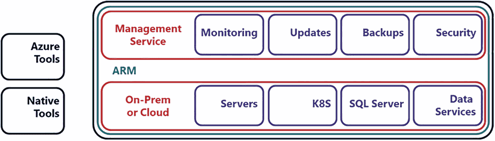
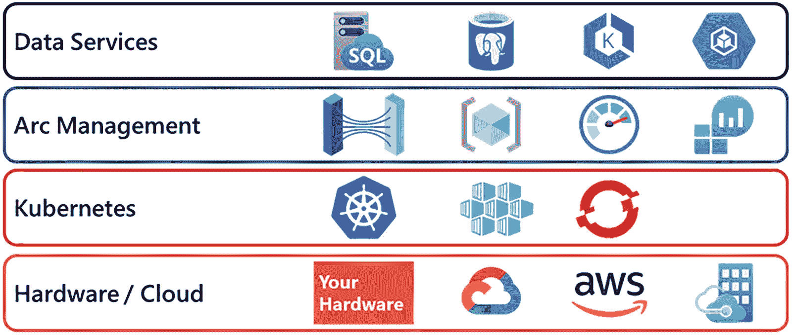
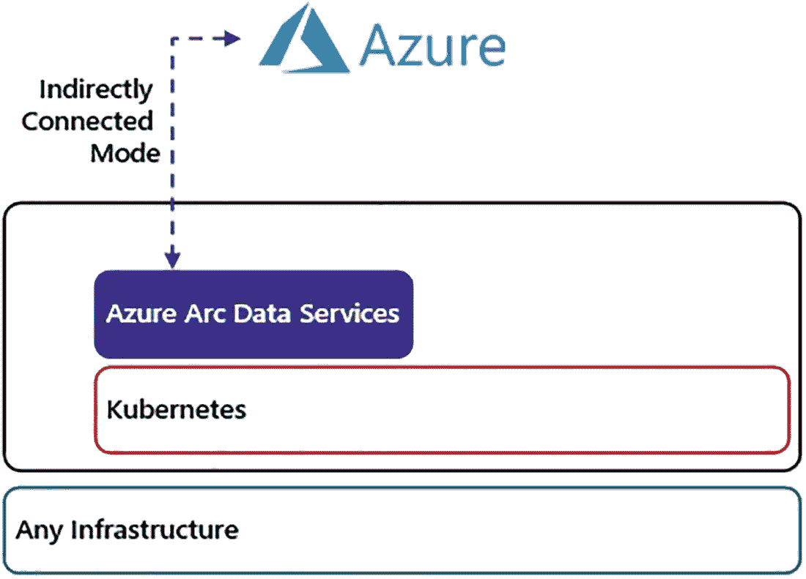
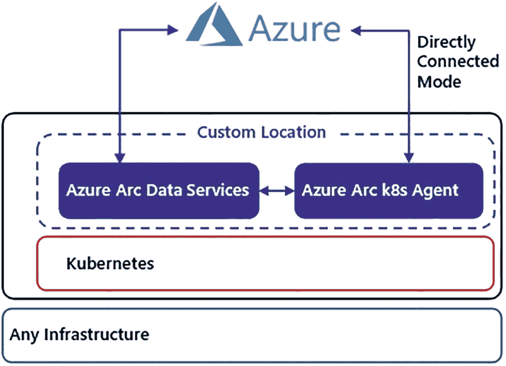
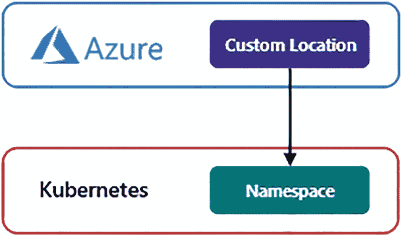
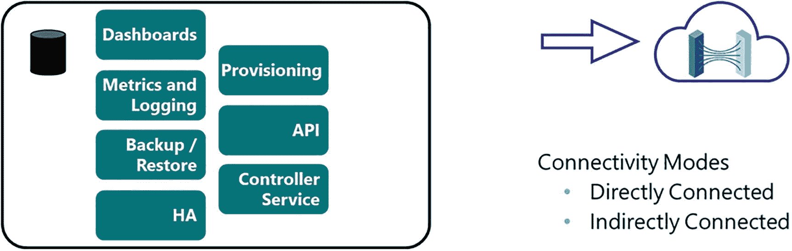
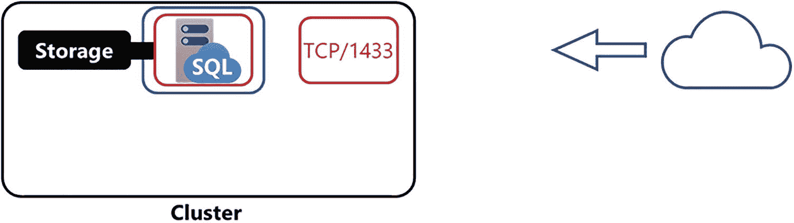
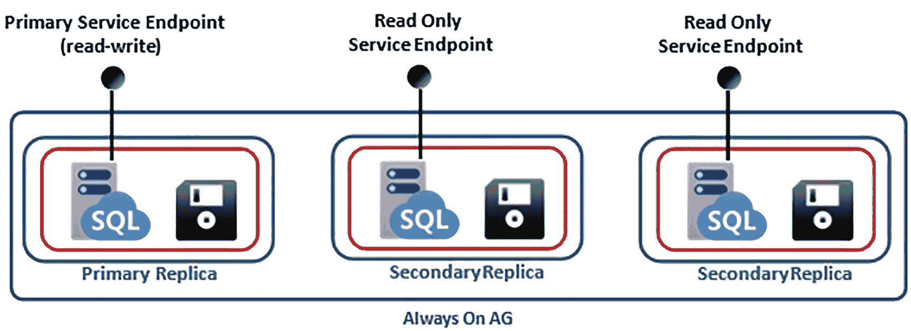
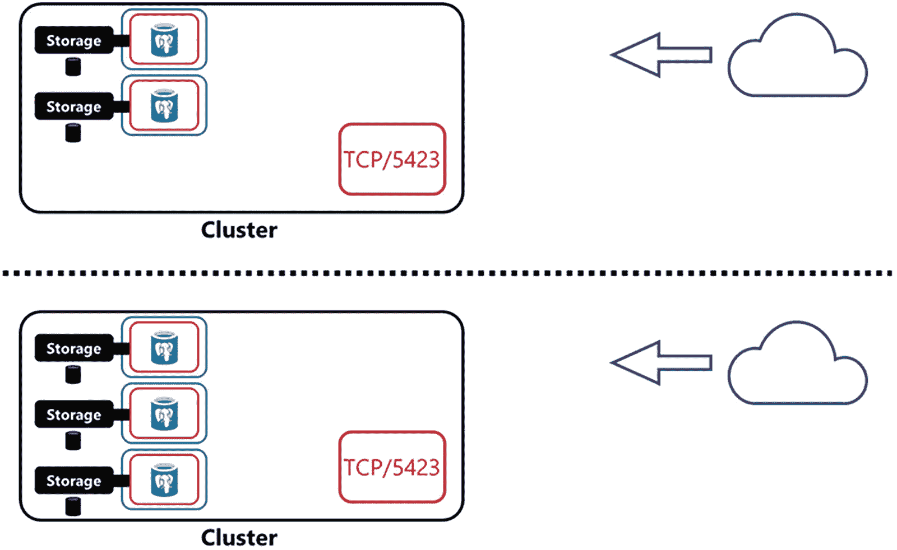

# 2. Azure Arc 启用的数据服务

本章向您介绍 Azure Arc-enabled Data Services！首先，您将了解现代混合云面临的一些挑战，然后我们将向您展示 Azure Arc 如何应对这些挑战，以在本地或任何云中提供可大规模管理的解决方案。接下来，我们将介绍核心的 Azure Arc 启用资源，包括服务器、Kubernetes、SQL Server 和数据服务。然后，我们将更深入地探讨什么是 Azure Arc-enabled Data Services、其架构、工作负载如何部署和管理，并讨论关键的部署注意事项，如计算和存储容量规划。

## 挑战

*   混合云正在成为企业系统架构的新常态。根据《Flexera 2020 State of the Cloud》（参见 [*www.flexera.com/about-us/press-center/flexera-releases-2020-state-of-the-cloud-report.html*](http://www.flexera.com/about-us/press-center/flexera-releases-2020-state-of-the-cloud-report.html)）报告，近 87%的企业拥有混合云战略。混合云有几种变体。首先，组织可以采用资产分布在多个公有云（如 Amazon Web Service (AWS)、Google Cloud 和 Microsoft Azure）的混合云战略。这种模式通常被称为“多云”。第二种混合云战略是组织拥有一些云资产和一些本地资产。在这些场景中，组织通常会将最能从云中受益的基础设施部分放在云中。公司转向云的主要原因包括弹性、自动化、内置监控和安全以及按需付费的支付模型。

在管理和运营混合云环境时，无论是多云还是本地与云混合，每个环境的管理、安全模型和工具可能各不相同。这就引出了一个问题：您如何大规模管理这些环境？当您拥有不同的管理、监控、安全和部署工具时，实现一致性和控制是具有挑战性的。Azure Arc 的目标是实现所有这些领域的一致性，统一管理、监控和安全服务以及部署工具，以便您可以在部署资源的任何地方（本地或任何云中）利用云的优势。


## Azure Arc 简介

从核心上讲，Microsoft Azure Arc 无论您是在本地还是在任何云中部署了资源，都能提供 Azure 管理服务。它使您能够为组织的核心运营提供一致的管理服务和工具，无论技术架构部署在何处。让我们来看看 Azure Arc 的核心功能：

**本地和混合云的统一体验**：您可以使用熟悉的工具，如 `Azure 门户`、`azure-cli`、`PowerShell` 和 `REST API` 来管理和部署系统。

**部署和运维**：借助一套统一的工具，无论您在何处部署（本地或任何云中），部署和运维都是一致的。统一的工具使您的组织能够在任何部署场景中使用相同的代码和工具。运维的一个关键要素是性能和可用性监控，而 `Azure Monitor` 可帮助您为启用了 `Azure Arc` 的资源实现这一点。

**整合的访问控制、安全性、策略管理和日志记录**：根据资源部署位置实施多个安全模型具有挑战性和风险，因为您可能需要管理多套安全规则及其实施。`Azure Arc` 使您能够拥有一个整合的安全模型和实施，并使用 `Azure Log Analytics` 等工具进行集中式安全和应用程序日志记录。此外，您还可以使用 `Azure Policy` 等服务来管理治理和控制解决方案。

**清单和组织**：借助一套可用的工具以及关键的 `Azure` 构造（如 `资源组`、`订阅` 和 `标记`），管理员、运维人员和技术经理可以完整地查看其技术资产，而无论系统部署在何处。因为作为服务的资源和资源会被注册为 `Azure` 中的托管资源，无论它们部署在本地还是任何云中。

既然我们已经向您介绍了 `Azure Arc` 的核心功能，是时候继续前进，更详细地了解您可以使用 `Azure Arc` 管理和部署的资源了。

### Azure Arc 支持的资源

本书的重点是 `Azure Arc` 支持的数据服务。`Azure Arc` 支持的数据服务是一项更广泛战略的一部分，该战略提供了一个控制平面，用于管理部署在任何地方（本地或任何云中）的资源。`Azure Arc` 通过将 `Azure 资源管理器 (ARM)` 扩展到这些资源来实现这一目标。`ARM` 是在 `Azure` 公有云中使用的管理控制平面。`ARM` 为部署在 `Azure` 云中的资源提供部署、组织和访问控制。`Azure Arc` 将 `ARM` 扩展到您部署资源的任何地方，无论是本地还是任何云中。在撰写本书时，有四种关键资源可以由 `Azure Arc` 管理：`Azure Arc 支持的服务器`、`Azure Arc 支持的 Kubernetes`、`Azure Arc 支持的 SQL Server` 和 `Azure Arc 支持的数据服务`。图 2-1 介绍了 `Azure Arc` 的元素；让我们更详细地了解这些核心服务中的每一项。



图 2-1 `Azure Arc` 架构

#### Azure Arc 支持的服务器

`Azure Arc 支持的服务器` 为部署在 `Azure` 外部的物理机和虚拟机 (VM) 上的 `Windows` 和 `Linux` 操作系统提供管理功能。服务器使用本地安装的代理连接到 `Azure`，并成为使用标准 `Azure` 工具和管理服务进行管理的资源。`Azure Arc 支持的服务器` 的核心管理功能包括清单管理、策略管理、部署自动化、配置管理、性能监控、安全和访问控制、集中式日志记录以及更新管理。有关 `Azure Arc 支持的服务器` 的更多信息，请访问 `https://docs.microsoft.com/zh-cn/azure/azure-arc/servers/overview`。

#### Azure Arc 支持的 Kubernetes

`Kubernetes` 是部署企业级容器化应用程序的标准。`Azure Arc 支持的 Kubernetes` 使您可以管理云原生计算基金会 (`CNCF`) 认证的 `Kubernetes` 集群，无论它们部署在何处，包括上游 `Kubernetes`、`RedHat OpenShift`、`AWS EKS`、`Google GKE` 等。`Azure Arc 支持的 Kubernetes` 的关键管理功能包括清单管理、策略管理、集中式日志记录、性能监控、应用程序部署和集群配置。

`Azure Arc 支持的 Kubernetes` 支持的一个关键场景是基于 `GitOps` 的配置管理。`GitOps` 通过使用基于 `GitOps` 的配置管理来实现应用程序部署和集群配置。配置构件被签入到 `Git` 存储库中，`Arc` 集群代理监控该 `Git` 存储库以查找配置变更。当配置被签入存储库时，集群代理将在本地的 `Kubernetes` 集群中部署该变更。这实现了强大的配置管理，因为所有配置构件（包括集群配置和应用程序部署）都被签入存储库并进行源代码控制。可以围绕源代码控制系统构建测试、审查和审批工作流程。如果集群偏离了签入存储库的内容，签入的配置将被强制应用到集群，使其恢复到期望状态。

请访问 `https://docs.microsoft.com/zh-cn/azure/azure-arc/kubernetes/overview` 了解更多信息和支持的 `Kubernetes` 发行版。

#### Azure Arc 支持的 SQL Server

我们要介绍的下一项 `Azure Arc` 支持的服务是 `Azure Arc 支持的 SQL Server`。`Azure Arc 支持的 SQL Server` 使您可以将 `Azure` 管理服务扩展到部署在任何地方（本地或任何云中）的 `SQL Server` 实例。在 `SQL Server` 实例上安装一个代理，然后该 `SQL Server` 会在 `Azure` 中注册。随后，使用标准的 `Azure` 工具和管理服务来管理该 `SQL Server` 实例。核心管理功能包括清单管理、策略管理、集中式日志记录、安全性，以及通过 `Azure 安全中心` 和 `Azure Sentinel` 等服务实现威胁防护。

此外，在 `Azure Arc 支持的 SQL Server` 中，使用 `SQL 评估` 实施环境检查。`SQL 评估` 是一套行业标准的最佳实践集合，可用于评估和报告 `SQL Server` 实例或一组 `SQL Server` 实例的整体环境运行状况。`Azure Arc 支持的 SQL Server` 与 `Azure Arc 支持的服务器` 相结合，可以为您提供丰富的 `SQL Server` 及底层操作系统的管理体验。有关 `Azure Arc 支持的 SQL Server` 的更多信息，请访问 `https://docs.microsoft.com/zh-cn/sql/sql-server/azure-arc/overview`。

我们想特别指出，`Azure Arc 支持的 SQL Server` 和 `Azure Arc 支持的数据服务` 是 `Azure Arc` 旗下的独特产品。`Azure Arc 支持的 SQL Server` 将 `Azure` 管理服务扩展到已安装的 `SQL Server` 实例的传统部署。`Azure Arc 支持的数据服务` 使您能够在本地或任何云中部署基于 `Azure 平台即服务 (PaaS)` 的服务。


#### Azure Arc 启用的数据服务

最后但同样重要，并且很可能是您阅读本书的原因，便是 Azure Arc 启用的数据服务。Azure Arc 启用的数据服务为您提供了在本地或任何云中部署传统基于 Azure 平台即服务（PaaS）的服务的能力。数据服务提供的价值在于其始终保持最新的部署模型，无论您需要在哪里部署，都能为您交付最新、安全且受支持的 Azure PaaS 数据服务版本。在本书撰写时可用的数据服务包括`Azure Arc-enabled SQL Managed Instance`和`Azure Arc-enabled PostgreSQL Hyperscale`。Azure Arc 启用的数据服务的其他功能包括弹性扩展、自助式供应、清单管理、部署自动化、更新管理、托管备份、安全性、性能监控和集中式日志记录。Azure Arc 启用的数据服务是本书的核心重点，我们将在本书的剩余部分深入探讨其核心功能。

### 工具

到目前为止，我们一直关注 Azure Arc 如何管理资源，无论它们位于何处。现在，是时候关注您可以用来管理资源的工具了。首先，我们将介绍 Azure 工具，例如 Azure 门户、`azure-cli`、PowerShell 和 Azure Data Studio。然而，Microsoft 的方法确保您在用于管理云和开发者体验的工具上有选择权。因此，您可以使用项目中可能已经在用的行业标准、开源工具。然后，我们将介绍如何使用应用程序原生工具来管理部署在 Azure Arc 中的应用程序和服务。

#### Azure 工具

Azure Arc 试图解决的一个关键挑战是一致的工具集。Azure Arc 将 Azure 资源管理器扩展到您部署资源的任何地方，无论是本地还是任何云。由于 ARM 可用，这使您能够使用在 Azure 公有云中习惯使用的标准 Azure 工具。让我们列举一下您将在 Azure Arc 和 Azure Arc 启用的数据服务中最常用的一些 Azure 工具：

*   **Azure 门户**：Azure 管理体验的核心是 Azure 门户。由 Azure 和 Azure Arc 注册和管理的资源将出现在 Azure 门户中。Azure 门户将是管理 Arc 启用的资源的主要方式。您可以在各种 Azure 管理服务（如 Log Analytics、Monitor、Sentinel、Security Center 等）中查看在 Azure 门户中收集和公开的信息。更多信息，请访问[`https://portal.azure.com`](https://portal.azure.com)。

*   **`azure-cli`**：`azure-cli`是用于部署和管理启用 Azure 资源管理器（ARM）的资源（包括 Azure Arc 启用的数据服务）的命令行界面。更多信息，请访问[`https://docs.microsoft.com/en-us/cli/azure/install-azure-cli`](https://docs.microsoft.com/en-us/cli/azure/install-azure-cli)。

*   **Azure PowerShell**：Azure PowerShell 模块（Az 模块）是用于管理启用 Azure 资源管理器（ARM）的资源的 PowerShell 模块。更多信息，请访问[`https://docs.microsoft.com/en-us/powershell/azure/new-azureps-module-az`](https://docs.microsoft.com/en-us/powershell/azure/new-azureps-module-az)。

*   **Azure Data Studio (ADS)**：这是一个跨平台工具，为一系列 Azure 数据服务提供现代化体验。在 ADS 中，您可以找到用于 Azure Arc 启用的数据服务和 SQL Server 大数据群集的部署和管理体验。此外，您还会找到一个带有内置 Git 源代码控制集成的 SQL Server 代码编辑器。更多信息，请访问[`https://docs.microsoft.com/en-us/sql/azure-data-studio/`](https://docs.microsoft.com/en-us/sql/azure-data-studio/)。

#### 原生工具

Azure Arc 的一个主要目标是统一管理和工具，使您的组织能够获得更好的云体验。需要注意的是，您仍然可以使用当前的开发者体验以及今天用于管理云的工具。因此，如果您已有现有的部署管道，这也没问题；您仍然可以在 Azure Arc 启用的数据服务中使用它们。将如何管理工作负载的选择权留给您。我们想花点时间列举一些您可能已经用于管理环境的工具。这些工具（以及其他一些）构成了现代部署管道的基础：

*   **`kubectl/oc`**：这些是用于控制 Kubernetes 和 RedHat OpenShift 集群的主要命令行工具。

*   **`helm`**：这是一个使用称为`helm`图表的预配置模板来定义如何在 Kubernetes 中部署复杂应用程序的工具。

*   **Git/GitHub**：Git 已成为管理源代码的标准方式。Azure Arc 设计的关键是使您能够将现有工具用于部署管道，这意味着您仍然能够使用现有的代码管理和部署体验。

*   **GitOps**：如前面介绍的，GitOps 使您能够将集群和应用程序部署状态作为配置工件存储在 Git 存储库中。Kubernetes 集群监控存储库的更改，并在集群中应用这些更改以维护系统的期望状态。

*   在 Azure Arc 启用的数据服务中可用的数据服务是 SQL Managed Instance 和 PostgreSQL Hyperscale。使用 Azure 原生工具部署时，您将使用适当的门户体验或命令行语法来创建和管理数据服务部署。这些体验将在本书的剩余部分详细介绍。

*   对于使用 Kubernetes 原生工具部署和管理工作负载的数据服务，SQL Server 工程团队采用云原生方法，并为每个 Azure Arc 启用的数据服务、数据控制器本身以及诸如数据库恢复操作等管理任务创建了自定义资源定义。自定义资源定义是 Kubernetes 的一个结构，允许开发人员扩展 Kubernetes API 并创建自定义 API 对象。自定义资源定义可以具有额外的配置、数据，甚至控制集群中对象的行为。因此，当使用 Kubernetes 原生工具定义工作负载时，会使用这些自定义资源定义 API 对象。既然我们已经介绍了用于部署的工具，让我们继续更仔细地看看可以部署的 Azure Arc 启用的数据服务。

## 介绍 Azure Arc 启用的数据服务

在本节中，我们将首先介绍 Azure Arc 启用的数据服务架构。接下来，我们将介绍可用的基于 PaaS 的数据服务，特别是 SQL Managed Instance 和 PostgreSQL Hyperscale。然后，作为本节的结尾，我们将介绍在设计专注于计算和存储资源的解决方案时的部署技术和部署注意事项。


### Azure Arc 启用的数据服务架构

Azure Arc 启用的数据服务架构是一个分层架构，由硬件、Kubernetes、管理/控制平面和数据服务组成。图 2-2 突出了该架构。


*图 2-2*

Azure Arc 启用的数据服务架构是一个分层架构，由硬件、Kubernetes、管理平面和部署的数据服务组成。

基础层是硬件，它可以在本地或任何云中，并构建在物理机或虚拟机上。接着，在该硬件上部署 Kubernetes。正如我们在前一章中学到的，Kubernetes 使您能够快速、一致地将代码应用程序部署到集群中。然后，在 Kubernetes 集群内部署的是 Arc 管理控制平面。Arc 管理控制平面是 Azure Arc 的大脑，并将 Azure 资源管理器 (ARM) 扩展到您的本地或混合云部署中。而在这一切之上的是 Azure Arc 启用的数据服务。这些是传统上基于 PaaS 的服务，您可以将其部署在任何拥有 Azure Arc 的地方，无论是在本地还是在任何云中。现在，让我们更详细地了解此架构的每一层。

#### 硬件层

Azure Arc 数据服务架构构建在 `基于物理机或虚拟机的服务器` 上。每台服务器都贡献一定量的 CPU 和内存容量供应用程序运行。正如前一章关于 Kubernetes 的介绍，Kubernetes 集群服务器称为节点。每个节点的数量和大小取决于所部署工作负载的大小要求，以及为 Kubernetes 集群中节点故障准备的一些额外容量。此外，您可以通过添加或移除服务器来扩展或收缩 Kubernetes 集群中的资源量。我们将在本章后面更详细地探讨这个主题。

每个节点必须运行 `Linux 操作系统`，因为在 Azure Arc 启用的数据服务中运行的所有容器都是基于 Linux 的容器。

除了计算资源之外，还需要 `持久存储`。持久存储使用前一章介绍的存储概念分配给在 Azure Arc 启用的数据服务中部署的工作负载。存储类为在 Kubernetes 集群中部署的工作负载动态分配持久卷。配置的存储类型可以是您的 Kubernetes 版本支持并作为存储类公开的任何存储类型。此外，您可以通过定义额外的存储类来增加集群中的可分配存储容量，甚至添加额外的存储类型。

#### Kubernetes 层

底层硬件就位后，架构的下一层是 Kubernetes。无论何种发行版，Kubernetes 都为构建工作负载提供了一致的 API，因此，Azure Arc 启用的数据服务支持多种 Kubernetes 发行版。支持的发行版包括使用 kubeadm 构建的开源/上游 Kubernetes 集群，以及像 RedHat OpenShift 这样的商业发行版。

在撰写本文时，根据部署机制，有几种 `受支持的 Kubernetes 发行版`：
*   使用 kubeadm 部署的开源上游 Kubernetes
*   OpenShift 容器平台 (OCP)

支持多种 `托管服务产品`：
*   Azure Kubernetes 服务 (AKS)
*   Azure Stack 上的 Azure Kubernetes 服务 (AKS)
*   Azure Stack HCI 上的 Azure Kubernetes 服务 (AKS)
*   Azure RedHat OpenShift (ARO)
*   AWS 弹性 Kubernetes 服务 (EKS)
*   Google Cloud Kubernetes 引擎 (GKE)

> 注意
>
> 有关支持的特定 Kubernetes 发行版版本的更多信息，请查看此链接：[*https://docs.microsoft.com/en-us/azure/azure-arc/kubernetes/validation-program*](https://docs.microsoft.com/en-us/azure/azure-arc/kubernetes/validation-program)*.*

这里的关键概念是，您可以在任何需要部署的地方（本地或混合云场景）在任何 Kubernetes 发行版上部署 Azure Arc 启用的数据服务。您可以选择使用上游/开源 Kubernetes 以及许多托管服务产品。一旦 Kubernetes 启动并运行，接下来要做的就是通过部署 Azure Arc 数据服务数据控制器，将 Azure 扩展到您的集群中。

#### Azure Arc 管理控制平面层

Kubernetes 部署后，架构的下一层是 Arc 管理控制平面层，它将 Azure 的管理功能扩展到您的本地或混合云环境。在这一层，在 Azure Arc 启用的数据服务中，会部署一个 `数据控制器`。数据控制器作为 Kubernetes 中的自定义资源部署。数据控制器实现了核心功能，如 Azure Arc 集成和管理服务。让我们更仔细地看看这些功能。

Azure Arc 集成负责根据部署的数据服务工作负载，将日志记录、性能和用量信息发送回 Azure。数据控制器将 Azure 资源管理器扩展到您的本地或混合云部署，并激活 Azure Arc 启用的服务来管理已部署的应用程序和资源。数据控制器实现的管理服务包括控制器服务和 API 端点、配置管理、管理和性能仪表板、指标、日志记录、托管备份/恢复以及高可用性服务协调。我们将在接下来的章节中更深入地探讨数据控制器及其核心功能。控制器在线后，架构的下一层是部署数据服务工作负载。

> 注意
>
> 我们需要说明，数据控制器用于管理 Azure Arc 启用的数据服务。Azure Arc 启用的服务器、Kubernetes 和 SQL Server 各自依赖于安装在 Azure Arc 管理的资源上的代理。

#### 数据服务层

Azure Arc 启用的数据服务架构的最后一层是数据服务本身。Azure Arc 启用的数据服务使您能够在本地或混合云环境中的 Kubernetes 上，自配置传统上基于 Azure 公有云 PaaS 的服务，如 SQL 托管实例和 PostgreSQL 超大规模。`Azure Arc 启用的 SQL 托管实例` 是您的 SQL Server 提升和转移版本，使您能够将工作负载无缝迁移到 Azure Arc 启用的数据服务中，因为它与本地 SQL Server 安装具有高度兼容性。接下来，`Azure Arc 启用的 PostgreSQL 超大规模` 是用于关键任务应用程序数据存储的领先开源数据库。PostgreSQL 超大规模是 Azure 中的一种实现，它使您能够通过跨多个实例分片来水平扩展数据，并允许分布式并行查询执行。这些数据服务作为资源部署在 Kubernetes 中，并由数据控制器管理。

总而言之，本质上，只要您拥有硬件并部署了 Kubernetes 和数据控制器，就可以部署 Azure Arc 启用的数据服务。


## Azure Arc 管理控制平面层：深入解析

现在，是时候深入了解一下 Azure Arc 管理控制平面了。为了将 Azure 服务从云端扩展到本地或混合云环境，一个`数据控制器`会被部署在您的`Kubernetes`集群中。这个`数据控制器`实现了 Azure Arc 的集成以及若干关键的本地管理功能。本节将介绍`数据控制器`的连接模式、其核心功能，以及其运维和管理能力如何根据所使用的连接模式而有所不同。

`数据控制器`的连接模式定义了它如何与 Azure 公有云交换数据，也定义了哪些管理服务在`Kubernetes`集群内部部署，以及哪些 Azure 服务用于管理集群中的数据服务。`数据控制器`有两种连接模式：间接连接模式和直接连接模式。您应选择哪种连接模式，取决于您部署的技术和安全要求，也可能涉及业务规则或政府法规。让我们更详细地看看每种连接模式。

### 间接连接模式

在间接连接模式下，您的集群中的`数据控制器`与 Azure 公有云之间没有直接连接。本地的`数据控制器`本身充当您`Kubernetes`集群中数据服务的主要管理点和部署点。对于工作负载的部署和管理，所有操作都由您集群中的本地`数据控制器`管理。此外，所有管理功能都在本地集群内部实现。例如，性能指标、日志记录 Web 门户和数据存储都实现为在您本地`Kubernetes`集群中运行的`Pod`。进一步地，关键数据服务的管理操作，如更新管理、自动备份/恢复和高可用性协调，都在此层实现。图 2-3 突出了间接连接模式的架构，其中`数据控制器`与 Azure 云没有持久连接。



在间接连接模式下，清单、性能、日志记录和使用情况数据可以导出到文件，然后上传到 Azure。一旦上传到 Azure，已部署的 Azure Arc 启用的数据服务将作为资源在 Azure 门户中可见。此外，Azure 服务，如`Metrics`、`Log Analytics`等，可用于分析从本地或混合云环境导出的数据。可以定期安排此导出/上传过程，以便数据被上传并在 Azure 内部可用，给人一种数据持续上传的表象。需要直接连接的 Azure 服务不可用。

在间接连接模式下，数据服务的部署和配置更改是通过诸如 Azure Data Studio、`azure-cli (az)`、`Kubernetes`原生工具（如`kubectl`、`helm`或`oc`）以及 Azure Arc 启用的`Kubernetes GitOps`等工具，发送到在`数据控制器`上运行的`Kubernetes API`。如果使用`Kubernetes`原生工具，这些部署会直接发送到`Kubernetes API`。在间接连接模式下，无法使用 Azure 门户、`ARM API`和`ARM`模板进行部署和配置更改。然而，由于前面描述的导出过程，清单管理、指标和日志记录等 Azure 服务是可用的。

此连接模式的典型场景是，拥有业务或安全策略的数据中心不允许出站连接或向外部服务上传数据。其他可以使用间接连接模式的部署包括互联网连接不稳定的边缘站点位置。

### 直接连接模式

在直接连接模式下，Azure 本身成为协调您 Azure Arc 启用的数据服务环境中的管理和部署功能的控制平面。在此连接模式下，您部署 Azure Arc 启用的数据服务的`Kubernetes`集群需要是一个 Azure Arc 启用的`Kubernetes`集群。通过将您的`Kubernetes`集群连接到 Azure，Azure Arc 代理被部署到您的集群中。这些代理负责维护与 Azure 的出站持久连接，并与 Azure 交换信息，如指标、日志和使用情况数据，与间接连接模式相比，还能通过额外的 Azure 服务实现更丰富的 Azure 管理体验。使用直接连接模式时，会从客户环境通过安全的加密通道向 Azure 云发起一个持久的网络连接。如果连接中断，操作将在本地排队，并在连接恢复时推送到 Azure。

在直接连接模式下，除了间接连接模式使用的工具外，还可以使用 Azure 门户、`ARM API`、`azure-cli`、Azure PowerShell 和`ARM`模板来创建部署和配置更改。图 2-4 突出了直接连接模式的架构，其中 Azure Arc 启用的`Kubernetes`代理与 Azure 云保持着直接、持续的连接，并不断上传指标、日志和使用情况数据，同时通过额外的 Azure 服务实现更丰富的 Azure 管理体验。此连接模式的常见场景包括管理其他公有云中的部署、边缘站点位置以及允许此类连接的企业数据中心。



使用直接连接模式时，除了启用 Azure Arc 的`Kubernetes`集群外，您还需要将 Azure Arc 启用的数据服务`集群扩展`部署到您的集群中。`集群扩展`控制着您的`Kubernetes`集群的 Azure 功能，例如它提供的 Azure 服务以及这些服务的版本和生命周期。Azure Arc 启用的数据服务`集群扩展`用于为 Azure Arc 启用的数据服务及其功能创建`自定义资源定义`，并引导集群部署。

在处理 Azure 资源时，传统上您在一个区域中部署资源。为了将这个概念扩展到混合场景中，以访问 Azure 之外的计算资源，您需要定义一个`自定义位置`。`自定义位置`是一个从 Azure 指向 Azure Arc 启用的`Kubernetes`集群中定义的`Kubernetes 命名空间`的指针（参见图 2-5）。



这个`自定义位置`被管理员用作在您的本地计算资源上部署 Azure Arc 启用的数据服务的目标位置。启用 Azure Arc 的`Kubernetes`集群的过程在第 6 章中有详细描述，作为创建直接连接的 Azure Arc 启用的数据服务`数据控制器`过程的一部分。

> **注意**
>
> 有关管理服务和网络连接（例如 Internet 地址、端口和代理服务器支持）的更多详细信息，请查看以下链接：
> ```
> https://docs.microsoft.com/en-us/azure/azure-arc/data/connectivity
> ```


## Azure Arc 支持的数据服务管理功能

在 Arc 管理控制平面内部，部署了一个 `Data Controller` 和本地可用的管理功能。在本节中，我们将逐一介绍这些核心要素。图 2-6 突出显示了作为部署在本地 `Kubernetes Cluster` 内的这些管理功能。



图 2-6

Azure Arc 管理控制平面在你的本地 `Kubernetes Cluster` 中实现了许多核心管理和运维功能。

*   `Controller Service`：这是你的 `Kubernetes Cluster` 中可用的管理端点，负责处理管理操作。
*   `API`：`Data Controller` 暴露一个 `API`，可与你的 `Kubernetes Cluster` 交互以执行管理操作，例如导出性能、日志或使用数据以上传到 Azure。部署操作通过 `Kubernetes API` 直接完成，或使用前述部署工具完成，这些工具随后与 `Kubernetes API` 交互。
*   `Provisioning`：`Data Controller` 与 `Kubernetes API` 协调预配操作。当使用 `Kubernetes` 原生工具或 Azure 数据服务工具（如 `Azure Data Studio` 和 `azure-cli`）时，预配操作直接提交给 `Kubernetes API`，然后发送到底层 `Kubernetes Cluster` 以部署新工作负载和配置状态变更。`Data Controller` 监控针对 `Custom Resources`（如 `SQL Managed Instance` 和 `Postgres`）的预配请求，并与 `Kubernetes API` 协调以预配构成所部署 `Custom Resource` 的支持性 `Kubernetes` 原生对象，例如 `StatefulSets`、`Services` 等。
*   `Dashboards`：管理仪表板在 `Azure Data Studio` 中可用。这些仪表板提供有关已部署数据服务和 `Data Controller` 本身当前状态的信息。
*   `Metrics`：`Grafana` 用于暴露你的 `Cluster` 中多个层级的关键性能指标，包括 `PostgreSQL Hyperscale` 和 `SQL Server Managed Instance` 特定的仪表板。`Grafana` 作为部署在你的 `Cluster` 中的 Web 门户提供。
*   `Logging`：`Kibana` 用于聚合 `Cluster` 中产生的日志并提供搜索功能。多个资源正在将日志数据流式传输到 `Kibana`，包括已部署的 `SQL Managed` 和 `PostgreSQL Hyperscale` 实例。`Kibana` 作为部署在你的 `Cluster` 中的 Web 门户提供。
*   `Managed Backup and Restore`：备份和还原自动化由 `Data Controller` 控制。每个 Azure Arc 支持的 `SQL Managed Instance` 都带有一个内置的自动备份功能，默认启用。这意味着每个创建或还原的数据库将自动接收一个初始完整备份，然后是按计划进行的差异备份和事务日志备份。此概念与 Azure `SQL Managed Instance` 中的托管备份非常相似，并允许你在保留期内的任何特定时间点执行还原。
*   `High Availability`：`Kubernetes` 为控制器（如 `ReplicaSets` 和 `StatefulSets`）管理的工作负载提供了基本的高可用性。如果由这些控制器之一控制的 `Pod` 发生故障，将在 `Cluster` 中创建一个新的 `Pod` 来替换失败的 `Pod`。对于可能需要 `Cluster` 内 `Pod` 协调故障转移事件的高级场景，`Data Controller` 可以促进此应用程序感知的故障转移事件。

### 数据服务层：深入探讨

随着所有必需的基础设施（硬件、`Kubernetes` 和 `Data Controller`）就位，现在是时候关注数据服务层了。这一层是在你的环境中（无论是在本地还是在任何云中）部署传统上基于 PaaS 的数据服务的地方，例如你在 Azure 云中看到的那些服务。本节将深入探讨当前每个可用的数据服务，即 Azure Arc 支持的 `SQL Managed Instance` 和 Azure Arc 支持的 `PostgreSQL Hyperscale`，审视它们的能力和价值。


#### Azure Arc-enabled SQL Managed Instance

Azure Arc-enabled SQL Managed Instance 是 SQL Server 的**直接迁移**版本。它使你能够将工作负载无缝迁移到 Azure Arc，因为它与本地安装的 SQL Server 具有高度的兼容性，据文档记载，兼容性接近 100%。这意味着，将数据库从当前的本地实现迁移到 Azure Arc-enabled SQL Managed Instance，几乎不需要或完全不需要对数据库进行更改。部署 Azure Arc-enabled SQL Managed Instance 时，你可以从本地 SQL Server 版本进行备份，并将该备份直接还原到 Azure Arc-enabled SQL Managed Instance。

提示
请访问 [`docs.microsoft.com/en-us/azure/azure-arc/data/managed-instance-features#Unsupported`](https://docs.microsoft.com/en-us/azure/azure-arc/data/managed-instance-features#Unsupported)，查看 `Azure Arc-enabled SQL Managed Instance` 不支持的功能和服务列表。

`Azure Arc-enabled SQL Managed Instance` 的一个特性是它 `始终最新`。（你可能也会看到“常青 SQL”这个术语。）类似于在 Azure PaaS 服务（例如 Azure 云托管部署中的 `Azure SQL Managed Instance`）中提供的始终最新或常青 SQL 产品，Microsoft 将持续为 `Azure Arc-enabled SQL Managed Instance` 更新 SQL Managed Instance 容器映像，并推送到 Microsoft 容器注册表。然后，根据你在部署中定义的更新策略，你可以指定更新应用于你的环境的频率和时间。在传统的 SQL Server 实现中，管理更新是一个具有挑战性且耗时的过程。Kubernetes 提供了快速吸收更新和变更，并将其推出到集群的能力。这就是在 `Azure Arc-enabled Data Services` 中使用的更新模型。

`Azure Arc-enabled SQL Managed Instance` 提供两种服务层级：`常规用途` 和 `业务关键`。根据 Microsoft 文档中的定义，`常规用途` 是一个经济实惠的层级，专为大多数具有基本性能和可用性需求的工作负载而设计。`业务关键` 层级专为对性能敏感、要求更高可用性的工作负载而设计。

`常规用途` 服务层级现已正式发布。其 SQL Server 功能集与标准版相同，但对 `Azure Arc-enabled SQL Managed Instance` 可以使用的内核数量和可寻址内存量有所限制——最多 24 个 CPU 内核和 128GB 内存。这也引出了关于 `Azure Arc-enabled SQL Managed Instance` 的下一个关键点，即`高可用性`。在 `常规用途` 服务层级中，`Azure Arc-enabled SQL Managed Instance` 作为单个 SQL Server 实例部署，运行在由 `StatefulSet` 管理的 `Pod` 中。如前所述，`StatefulSet` 在应用程序或 `Node` 发生故障事件时提供基本的故障转移能力。如果发生故障，先前的 `Pod` 会被删除，并在其位置创建一个新的 `Pod`。这些故障场景的恢复时间可能非常短。

提示
当创建运行 SQL Server Managed Instance 的 `Pod` 时，它必须在启动时运行崩溃恢复。考虑使用加速数据恢复来缩短 SQL Server Managed Instance 的启动时间。更多详情，请访问 [`docs.microsoft.com/en-us/sql/relational-databases/accelerated-database-recovery-concepts`](https://docs.microsoft.com/en-us/sql/relational-databases/accelerated-database-recovery-concepts)。

为确保此单实例实现的高可用性，应使用外部共享存储，并使其对集群中的所有 `Node` 可用。如果某个 `Node` 发生故障，实例可以在集群中的其他地方启动，然后挂载 `Persistent Volume` 并使其对新的 `Pod` 可用。

`Azure Arc-enabled SQL Managed Instance` 使用 `Kubernetes Services` 作为持久访问端点。如图 2-7 所示，需要访问部署在 Kubernetes 中的 SQL Managed Instance 的应用程序和用户将指向 IP 或 DNS 名称以及为访问数据库实例定义的端口。此 `Service` 独立于 `Pod` 的生命周期，如果 `Pod` 停止并在集群中其他地方重新创建，则 `Service` 会更新并将流量自动发送到新的 `Pod`。



### 图 2-7
在 Kubernetes 集群中运行的 `Azure Arc-enabled SQL Managed Instance` 的典型部署

在 Kubernetes 中，当你更新容器映像或进行 `Pod` 配置更改时，当前的 `Pod` 会被删除，并使用更新后的容器映像或更新后的配置创建新的 `Pod`。这是一个非常快速的操作，但这可能会导致短暂的停机时间，在某些场景下这可能是不可接受的。在 `Azure Arc-enabled Data Services` 中，部署的数据服务使用相同的模型进行更新，因此在为已部署的数据服务推出更新时会有短暂的停机期。

如图 2-8 所示的 `业务关键` 服务层级提供了企业版的 SQL Server 功能集，并受操作系统限制的内核数和可寻址内存量。在此服务层级中，高可用性由 `可用性组` 提供，其中数据库的多个副本跨 Kubernetes 集群中的多个 `Node` 复制。停机时间仅限于故障转移的持续时间。此外，此 `可用性组` 可用于读取扩展操作。



### 图 2-8
业务关键服务层级：计算与存储共置

有关服务层级的更多信息，请参见此链接：[`docs.microsoft.com/en-us/azure/azure-arc/data/service-tiers`](https://docs.microsoft.com/en-us/azure/azure-arc/data/service-tiers)。

云的一项优势是`弹性扩展`，使你能够按需向环境添加容量，并尽可能快地利用该额外容量。`Azure Arc-enabled SQL Managed Instance` 的部署也不例外。如果需要，你可以通过调整分配给该部署的 CPU 和内存资源，为 SQL Managed Instance 的部署添加额外的计算和内存容量。此外，利用 Kubernetes 的基本高可用性结构，这一更改几乎可以立即推出。部署会更新，并使用此新配置创建一个新的 `Pod`，SQL Managed Instance 便可以使用此额外的纵向扩展容量。


## Azure Arc 支持的 PostgreSQL 超大规模版

我们要向您介绍的第二项 Azure Arc 启用的数据服务是 `Azure Arc-enabled PostgreSQL Hyperscale`。`Azure Arc-enabled PostgreSQL Hyperscale` 是一种领先的开源数据库，用作关键任务应用程序的数据存储。PostgreSQL Hyperscale 是在 Azure 云中的一种实现，它使您能够通过跨多个实例分片来水平扩展数据，并支持分布式并行查询执行。Hyperscale 成功的一个关键因素是它能够与现有版本的 Postgres 数据库配合工作，因此数据库及其应用程序几乎无需更改即可利用这些优势。

`Azure Arc-enabled PostgreSQL Hyperscale` 也使用了前一节描述的 *始终最新* 或常青 SQL 模型。Microsoft 将持续更新 PostgreSQL Hyperscale 的容器镜像，您可以决定该镜像在您的环境中 rollout 的频率和时机。

如前所述，云的一个重要优势是 *弹性扩展*，即能够按需为您的环境增加容量，并尽可能快地利用该额外容量。`Azure Arc-enabled PostgreSQL Hyperscale` 突出体现了这种弹性扩展，因为它可以在支持数据库的 `Postgres Worker Nodes` 数量上进行扩展（横向扩展），并能将数据分片到这些工作节点及其底层存储上。这实现了并行查询执行和分布式 I/O，从而可以提高数据库容量和性能。

> **注意**
>
> 我们想指出术语使用上存在重叠。`Postgres Worker Node` 是 Hyperscale 服务器组中的单个计算单元。这与 `Kubernetes Node`（Kubernetes 集群中的计算资源）不同。

在 `Azure Arc-enabled PostgreSQL` 中执行扩展操作时，额外的 `Postgres Worker Nodes` 会被添加到支持 `PostgreSQL Hyperscale` 服务器组的 `Postgres Worker Nodes` 资源池中。在图 2-9 中，您将看到一个 `PostgreSQL Hyperscale` 服务器组从两个工作节点扩展到三个工作节点。然后，数据会在服务器组内的三个工作节点之间重新平衡。横向扩展是一项在线操作，分片数据会自动在当前服务器组的工作节点间重新平衡。



图 2-9

一个 `PostgreSQL Hyperscale` 服务器组从两个工作节点扩展到三个工作节点，数据正在工作节点间重新平衡

除了横向扩展，您还可以通过向部署添加 CPU 和内存容量来纵向扩展单个 `Postgres Worker Nodes`。这样做会导致支持 `Postgres Workers` 的 Pod 因为新的 Pod 配置而被重启。截至本文发布时，不支持缩减操作。如果您需要缩减容量，可以创建一个新实例，将旧实例中的数据备份，然后将其还原到新实例中。有关数据放置和分片数据的更多信息，请查阅 [*https://docs.microsoft.com/en-us/azure/azure-arc/data/concepts-distributed-postgres-hyperscale*](https://docs.microsoft.com/en-us/azure/azure-arc/data/concepts-distributed-postgres-hyperscale)。

### 部署规模考虑

Azure Arc 启用的数据服务部署在 Kubernetes 上。Kubernetes 提供了对您本地数据中心或云中可用硬件的抽象。在本节中，我们想向您介绍在设计 Azure Arc 启用的数据服务和支持性 Kubernetes 集群时的规模考虑因素。我们将具体讨论的主题是 *计算* 和 *存储*。首先，让我们看看计算。

#### 计算

Kubernetes 集群中的每个节点（`Node`）都会贡献 CPU 和内存容量，共同构成可分配给集群中部署的工作负载的总体可用资源。部署的节点数量和规模取决于运行集群中部署的工作负载以及任何集群系统功能所需的容量。如果集群需要额外容量，可以添加更多的节点，从而为工作负载贡献更多的 CPU 和内存容量。如果需要，可以添加更大的节点或用更大的节点替换较小的节点，以增加集群的整体容量。这种按需增加容量的概念是云架构弹性的关键。

部署 Azure Arc 启用的数据服务时，有几个组件会影响运行集群和支持部署的工作负载所需的总体资源占用。这包括 Arc 管理控制平面（`Arc Management Control Plane`）所需的资源，以及实际部署的数据服务工作负载所需的资源，可能还包括集群中部署的任何其他工作负载。让我们更详细地看看每一项：

*   **`Arc Management Control Plane`**：由数据控制器（`Data Controller`）、指标（`Metrics`）和日志记录（`Logging`）Pod 组成。这些服务中的每一个都会消耗集群中的 CPU 和内存。有关每个服务所需资源的更多信息，请查阅 [*https://docs.microsoft.com/en-us/azure/azure-arc/data/sizing-guidance#data-controller-sizing-details*](https://docs.microsoft.com/en-us/azure/azure-arc/data/sizing-guidance%2523data-controller-sizing-details)。
*   **数据服务工作负载**：部署在集群中的每个数据服务实例都会消耗一定量的 CPU、内存和磁盘。每种资源消耗多少取决于在每个数据服务中运行的工作负载。有关每个可用数据服务的工作负载规模和最低要求的更多信息，请查阅 [*https://docs.microsoft.com/en-us/azure/azure-arc/data/sizing-guidance*](https://docs.microsoft.com/en-us/azure/azure-arc/data/sizing-guidance)。
*   **Kubernetes 系统 Pod**：在 Kubernetes 集群的每个节点上，都有一组执行关键集群功能的系统 Pod 和服务，每个都会消耗一定量的系统资源。资源被预留给关键操作，在资源稀缺的场景下，用户 Pod 可能会被从节点中驱逐。有关预留计算资源（`Reserved Compute Resources`）的更多信息，请查阅 [*https://kubernetes.io/docs/tasks/administer-cluster/reserve-compute-resources/*](https://kubernetes.io/docs/tasks/administer-cluster/reserve-compute-resources/)。
*   **其他工作负载**：如果您的集群并非专用于数据服务，请不要忘记将该工作负载纳入您的规模计算。

了解了需要部署在集群中的工作负载量之后，接下来您需要做的是确定集群节点的规模以及运行您的工作负载所需且具备节点级冗余的集群节点数量。

*   **单个节点规模**：在确定节点规模时，CPU 和内存不能超分配。例如，如果您的节点有两个核心和 16GB RAM，您无法创建一个需要四个核心和 32GB RAM 的数据库实例。Kubernetes 将无法启动该 Pod。因此，您必须添加一个更大的节点，或减少对该 Pod 的分配。Microsoft 文档建议在每个节点上至少保留 25% 的可用资源，以便为增长和冗余留出空间。


### 高可用性

在为集群规划所需资源量时，需确保 provision 足够数量的节点，其总资源应能支持至少一个节点故障或计划内维护。对于关键系统，建议客户采用 N+2 模型，即允许两个节点离线，集群仍能正常运行，性能不降级且工作负载不中断。当节点故障时，运行在该故障节点上的 Pods 会被迁移到集群中剩余的节点上。因此，必须为这些 Pods 的运行准备足够的容量。

这里的关键要点是：确保有足够的节点来支持在集群中运行所需工作负载所需的 CPU 和内存量，即使发生节点故障也应如此。此外，请确保单个数据服务的部署所需的资源不超过集群中单个节点的可用资源。否则，支持该部署的 Pods 将无法在集群的任何节点上启动，因为没有节点具备足够的资源来支持该配置。另外，您需要确保在每个节点上至少保留 25% 的容量，以供增长和冗余使用。

#### 存储

现在让我们继续讨论如何为 Azure Arc-enabled Data Services 集群规划存储。所需的存储容量和类型取决于所部署的工作负载。从根本上说，在 Arc-enabled Data Services 中作为 SQL 托管实例运行的 SQL Server 实例的性能配置文件，与在 Azure 或甚至本地等任何其他平台上部署 SQL Server 实例时看到的并无不同。其独特之处在于如何为您的数据服务工作负载配置和分配存储访问。现在让我们深入探讨这些主题。

如前所述，在 Kubernetes 中，存储是从 Storage Classes 动态分配的。当部署数据服务实例（如 SQL 托管实例或 PostgreSQL Hyperscale）时，您需要为部署中不同类型的数据定义要使用的 Storage Class。当前可用的选项包括*数据库数据文件*、*数据库备份文件*和*应用程序日志文件*，如果使用 SQL 托管实例，还包括*数据库事务日志文件*的存储位置。如果在定义数据服务实例时未指定 Storage Class，则将使用默认的 Storage Class。定义哪种数据使用哪个 Storage Class 是在定义实例时通过配置参数设置的。本书后续章节将更详细地介绍这一点。

在设计 Azure Arc-enabled Data Services 集群时，您需要根据所需的工作负载配置，创建映射回集群所需存储类型的 Storage Classes。例如，您可能需要为数据服务实例中的每种数据类型（如数据库文件、事务日志文件、应用程序日志文件和备份）分别创建单独的 Storage Class。这些 Storage Classes 中的每一个都可能映射到不同的存储子系统，每个子系统都具备为存储在该 Storage Class 中的数据所需的性能配置文件。

Storage Classes 可以配置为从本地节点存储和远程共享存储分配存储。如果节点内部部署了高速磁盘，本地存储可能非常快。但是，本地节点存储在节点故障时不提供持久性。如果节点发生故障，则该节点上的数据将面临丢失风险。使用本地节点存储的一种常见模式是，确保使用该类型存储的应用程序中的数据在多个节点之间复制，以实现冗余和可用性。复制与本地高速磁盘相结合是某些场景下可行的部署选项。本地存储是使用可用性组在副本之间复制数据的业务关键服务层的可行选项。

使用远程共享存储时，集群中的节点从远程存储系统映射存储。这可以是 SAN、NAS 或基于云文件的系统。使用这种架构 provision 存储解耦了对本地节点的依赖。如果某个节点发生故障，原本运行在该节点上的 Pod 可以被调度到集群中的另一个节点上。存储被挂载并暴露到 Pod 中，数据库实例可以快速恢复运行。从节点到共享存储环境的 I/O 互连应 provision 多路径以实现冗余，并且应具备足够的容量来支持所需的工作负载。此外，需要高 I/O 的实例应使用高级 Kubernetes 调度技术分散在集群中的各个节点上。有关 Kubernetes 中存储和调度的深入探讨，请参阅 Pluralsight 课程 “Configuring and Managing Kubernetes Storage and Scheduling”，链接为`www.pluralsight.com`。

## 总结与要点

本章向您介绍了 Azure Arc-enabled Data Services。它从现代混合云策略面临的挑战开始。然后展示了 Azure Arc 如何通过将 Azure 资源管理器扩展到您的本地或混合云环境来应对这些挑战，以实现大规模可管理性。接下来，我们介绍了核心的 Azure Arc-enabled 资源，包括服务器、Kubernetes、SQL Server 和数据服务。然后我们更深入地探讨了什么是 Azure Arc-enabled Data Services、其架构、工作负载如何部署和管理，并讨论了重要的部署注意事项，例如计算和存储容量规划。在下一章中，我们将从理论转向实践，学习如何在 Kubernetes 集群中部署 Arc 数据控制器。

