# 3. 部署准备

在上一章中，我们讨论了 Azure Arc-enabled Data Services 的理论概念和组件。

现在是为第一次部署做准备的时候了。在我们实际部署数据控制器以及随后由该数据控制器管理的数据库实例之前，我们确实需要一些先决条件以及一个就绪的 Kubernetes 集群。所有这些步骤将引导您完成开始使用 Azure Arc-enabled Data Services 所需的操作，并确保您完全准备就绪。

注意

您需要一个 Azure 帐户和订阅来完成这些步骤并开始部署。如果 Azure 不适合您，还有其他部署选项可用。Microsoft 提供了一个 Jumpstart 站点，可以轻松地在本地、AWS 或 Google 云中开始使用。有关更多信息，请访问`https://azurearcjumpstart.io/`。

## 先决条件

让我们从查看先决条件开始。在此过程中，我们将指出一些非常有用的助手——虽然在技术上并非必需——但会让我们的工作轻松很多。我们将在此使用的所有代码都可在本书的 GitHub 存储库中找到，并且我们根据您的偏好提供了从 Linux 和 Windows 客户端部署的选择。我们不会详细介绍 MacOS 的安装，但所需的工具（包括 Azure Data Studio）也可在本书的 GitHub 存储库中找到。


### Chocolatey

在开始之前，如果您计划从 Windows 客户端进行部署，我们希望您关注 `Chocolatey` 或简称为 `choco`。如果您还不了解它，`choco` 是一个免费的 Windows 包管理器，它允许我们通过在 `PowerShell` 或命令提示符中运行单行命令来安装许多先决条件。鉴于 Windows 服务器没有自带易于使用的内置包管理器，这无疑让事情变得简单得多。您可以在 [*Chocolatey 官网*](http://chocolatey.org) 上找到更多信息（参见图 3-1），您甚至可以创建自己的账户并提供您自己的软件包。

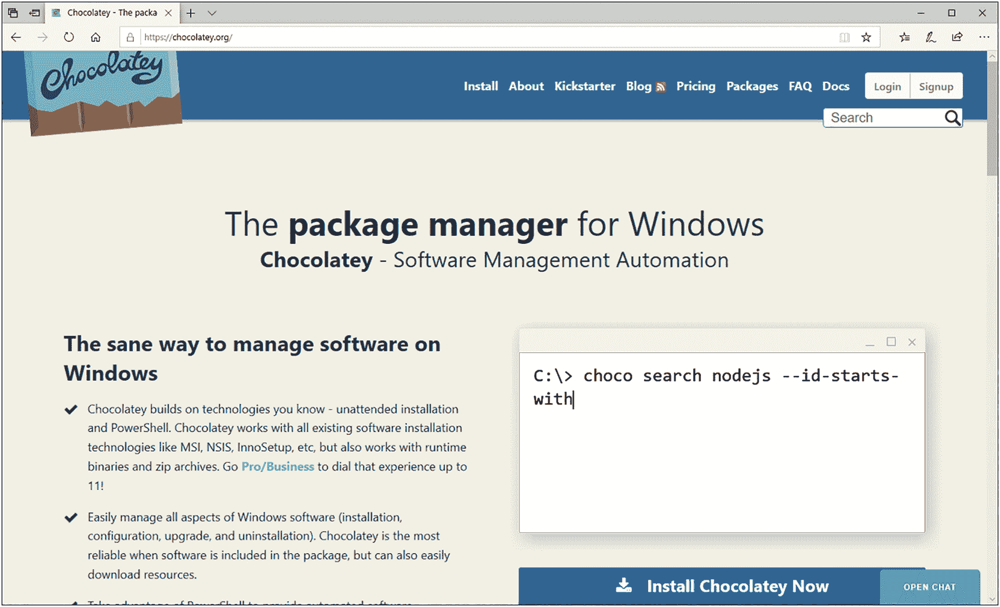

图 3-1

Chocolatey 主页

然而，从一个简单用户的角度来看，没有必要创建账户或下载任何安装程序。

要让 `choco` 在您的系统上可用，请以管理员模式打开一个 `PowerShell` 窗口，并运行清单 3-1 中显示的脚本。

```
[Net.ServicePointManager]::SecurityProtocol = [Net.ServicePointManager]::SecurityProtocol -bor [Net.SecurityProtocolType]::Tls12
Set-ExecutionPolicy Bypass -Scope Process -Force; iex ((New-Object System.Net.WebClient).DownloadString('https://chocolatey.org/install.ps1'))
```

清单 3-1
在 `PowerShell` 中安装 Chocolatey 的脚本

一旦相应的命令完成，`choco` 就安装完毕并可以使用了。

### Windows 上的工具

让我们从一些在 Linux 中默认自带的小工具开始，这些工具在 Windows 中要么默认缺失，要么功能受限。通过运行清单 3-2 中的代码，我们将安装 *curl*（用于与网站交互）、*grep*（用于在命令行上过滤输出）和 *putty*（它还附带了 *pscp*，这是一个允许我们从 Linux 机器复制数据的工具）。

```
choco install curl -y
choco install grep -y
choco install putty -y
```

清单 3-2
推荐工具的安装脚本

第一个官方先决条件是 `kubernetes-cli`，可以通过清单 3-3 中的命令安装。

```
choco install kubernetes-cli -y
```

清单 3-3
安装 `kubectl` 的脚本

最后一个官方要求是 `Azure` 命令行界面，也可以通过 `choco` 安装，如清单 3-4 所示。

```
choco install azure-cli -y
```

清单 3-4
安装 `azure-cli` 的脚本

官方先决条件到此就介绍完了。尽管如此，我们还将通过清单 3-5 中的代码安装 `Azure Data Studio`，这将允许我们尝试图形化的部署体验。

```
choco install azure-data-studio -y
```

清单 3-5
安装 Azure Data Studio 的脚本

最后，让我们创建一个目录并下载 `AdventureWorks2017` 数据库的备份文件，以便稍后使用清单 3-6 中的命令进行恢复。

```
mkdir C:\Files
curl -L -o C:\Files\AdventureWorks2017.bak https://github.com/Microsoft/sql-server-samples/releases/download/adventureworks/AdventureWorks2017.bak
```

清单 3-6
下载 `AdventureWorks2017` 的脚本

根据您要部署到的平台，其中一些工具可能不是必需的。鉴于它们都非常轻量级，我们建议无论如何都全部安装。

### Ubuntu 上的工具

如果您更喜欢从 `Ubuntu` 机器部署，可以使用 `Ubuntu 18.04` 或 `Ubuntu 20.04`。`Ubuntu` 自带其包管理器（*apt*），因此不需要 `Chocolatey` 或类似工具。不过在安装先决条件之前，我们需要使用清单 3-7 中的代码将 `Microsoft` 仓库设为受信任源。

```
sudo apt-get update
sudo apt-get install gnupg ca-certificates curl wget software-properties-common apt-transport-https lsb-release -y
curl -sL https://packages.microsoft.com/keys/microsoft.asc |
gpg --dearmor |
sudo tee /etc/apt/trusted.gpg.d/microsoft.asc.gpg > /dev/null
```

清单 3-7
基本先决条件的 `apt` 脚本

如果您使用的是 `Ubuntu 18.04`，请运行清单 3-8 中的代码将 `Microsoft` 仓库添加到已知的包安装源列表中。

```
AZ_REPO=$(lsb_release -cs)
echo "deb [arch=amd64] https://packages.microsoft.com/repos/azure-cli/ $AZ_REPO main" |
sudo tee /etc/apt/sources.list.d/azure-cli.list
sudo apt-get update
```

清单 3-8
添加 `Microsoft` 仓库的 `apt` 脚本（Ubuntu 18.04）

现在我们可以继续使用清单 3-9 中的代码安装 `Azure` 命令行界面和 *kubectl*。

```
sudo apt-get install -y azure-cli
sudo apt-get install -y kubectl
```

清单 3-9
安装 `azure-cli` 和 `kubectl` 的 `apt` 脚本

完成了——您的 `Ubuntu` 机器已经准备好开始部署了。

如果您也想在 `Ubuntu` 上使用 `Azure Data Studio`，请按照 [*Azure Data Studio 下载页面*](https://docs.microsoft.com/en-us/sql/azure-data-studio/download-azure-data-studio) 上的说明操作。


## 准备 Azure Data Studio

`Azure Data Studio` 的一大优势是其可扩展性，这使其在保持超灵活性的同时也非常轻量。另一方面，这也意味着我们需要先添加并启用一些扩展和配置，才能将其用于启用了 `Azure Arc` 的 `Data Services`。虽然大部分操作可以“即用即做”，但我们建议先将一切准备就绪，以便后续能纯粹专注于部署工作。

第一步是安装 `Azure Arc` 扩展。为此，请导航到如图 3-2 所示的扩展选项卡。

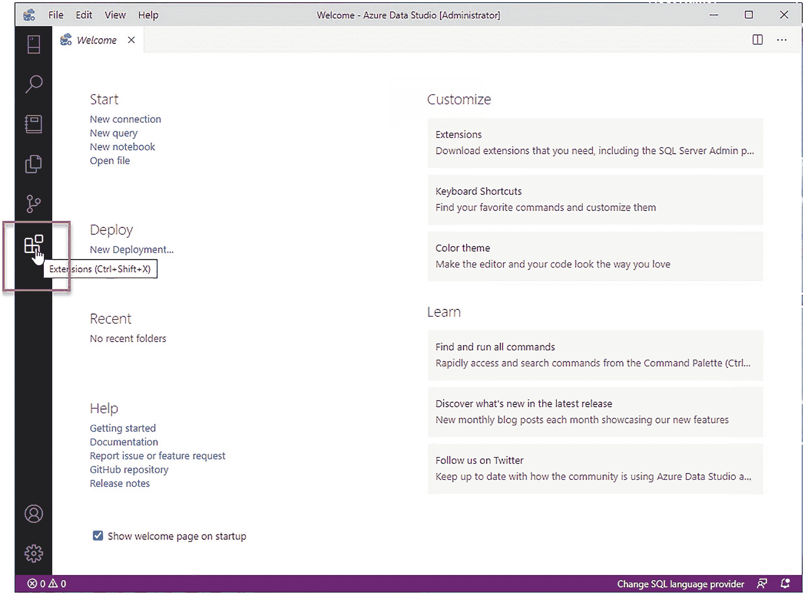

图 3-2

`Azure Data Studio` – 添加扩展

在扩展选项卡中，搜索 “`arc`” 并点击安装，如图 3-3 所示。

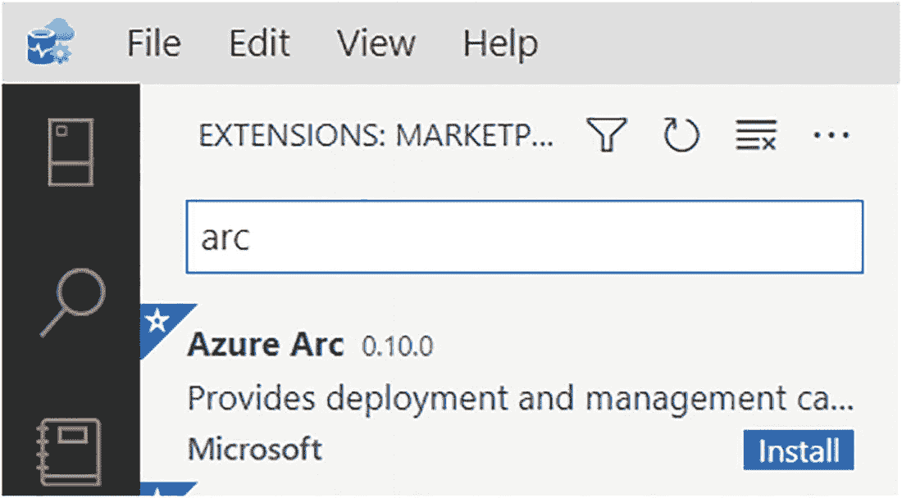

图 3-3

`Azure Arc` 扩展安装

注意

如果你计划将 `Azure Data Studio` 与 `Postgres` 一起使用，现在也是安装 `Postgres` 扩展的好时机。只需像搜索 “`arc`” 一样，在扩展选项卡中搜索 “`postgres`”，它就会显示出来。

接下来，我们需要向 `Azure Data Studio` 添加一个 `Azure` 帐户。为此，导航到连接选项卡，展开 `AZURE` 部分，然后选择 “`登录到 Azure…`”，如图 3-4 所示。

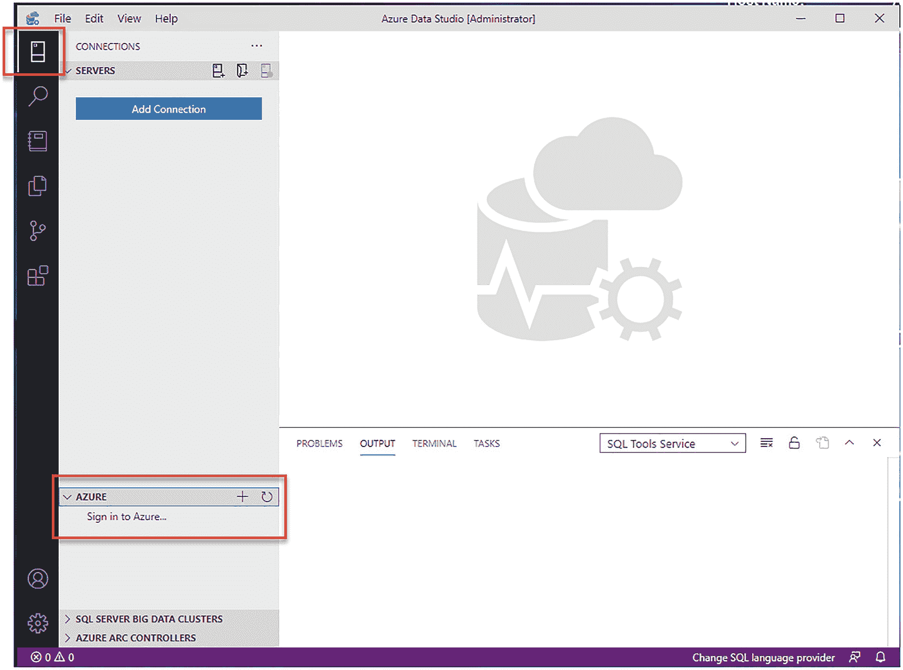

图 3-4

`Azure Data Studio` – 添加连接

这将触发一个登录对话框，成功登录后，系统会确认你的帐户已添加。你的 `Azure` 帐户也应显示在 `Azure Data Studio` 的链接帐户部分，如图 3-5 所示。

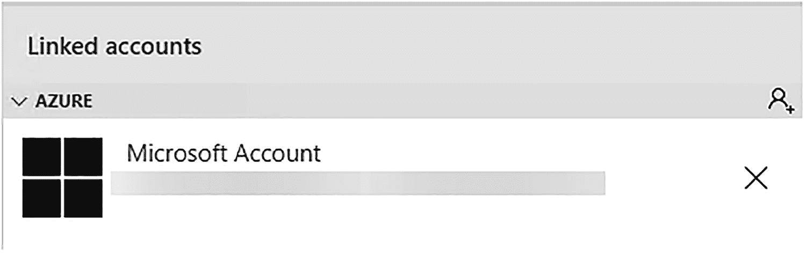

图 3-5

`Azure` 帐户显示在 `Azure Data Studio` 中

接下来，我们需要在 `Azure Data Studio` 中启用 `Python`，最简单的方法是打开一个新的 Notebook，如图 3-6 所示。

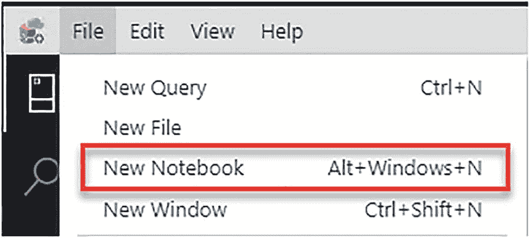

图 3-6

`Azure Data Studio` – 添加 Notebook

在此 Notebook 中，将内核更改为 “`Python 3`”，如图 3-7 所示。

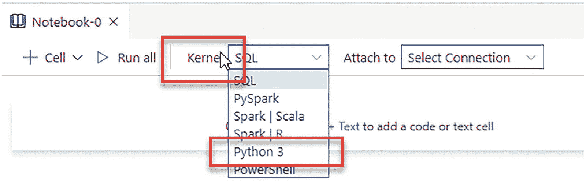

图 3-7

`Azure Data Studio` - 更改内核

这将触发 `Python` 运行时配置。我们建议进行新的 `python` 安装，向导（如图 3-8 所示）也建议这样做。

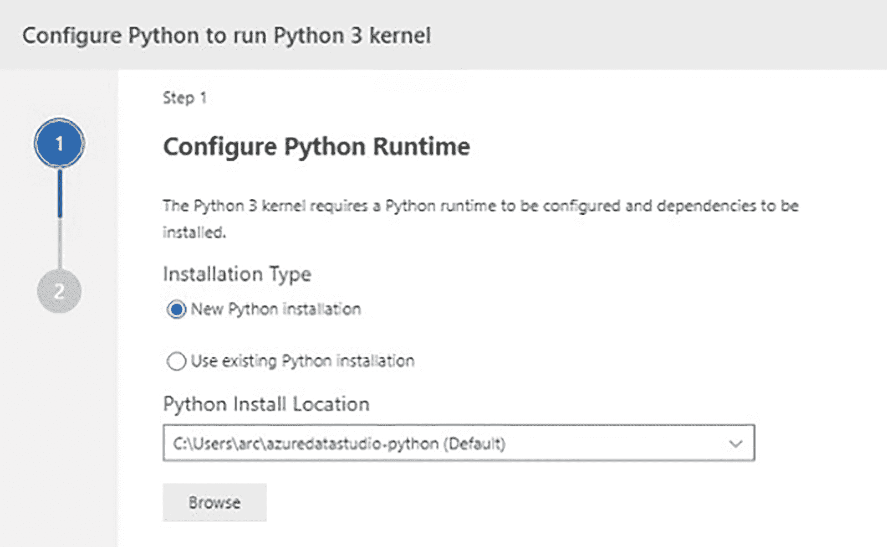

图 3-8

在 `ADS` 中配置 `Python`

安装可能需要几分钟；完成后，你会看到 Notebook 的内核显示为 “`Python 3`”（见图 3-9）。


图 3-9

`Azure Data Studio` – 内核

最后一步是安装 “`pandas`” 包。点击图 3-10 中突出显示的图标，导航到 `python` 包管理。

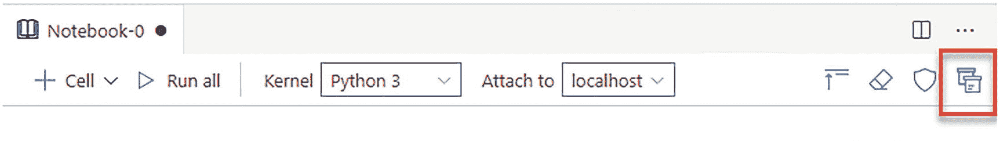

图 3-10

`Azure Data Studio` – 安装 `pandas` 包

在 “`管理包`” 选项卡中，切换到 “`添加新包`”，搜索 `pandas`，然后点击 “`安装`”，如图 3-11 所示。

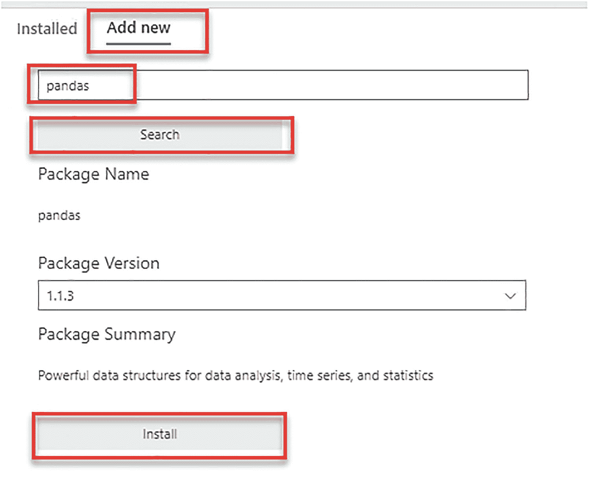

图 3-11

`Azure Data Studio` – 管理包

你可以关闭此向导。安装状态完成后会显示并确认（见图 3-12）。


图 3-12

`ADS` 中 `pandas` 安装成功的状态消息

至此，`Azure Data Studio` 的准备工作就完成了——我们已经安装并配置了所需的一切。

### azure-cli 扩展和提供程序

`azure-cli` 是大多数部署的核心工具（我们将在后续章节中看到），它需要一些扩展和注册的提供程序才能完全支持启用了 `Azure Arc` 的 `Data Services` 的部署。

这些可以通过 `CLI` 本身使用清单 3-10 中的代码添加/安装。

```
az extension add --name connectedk8s
az extension add --name k8s-extension
az extension add --name customlocation
az extension add --name arcdata
az provider register -n Microsoft.Kubernetes
az provider register -n Microsoft.KubernetesConfiguration
az provider register -n Microsoft.ExtendedLocation
清单 3-10
安装 azure-cli 所需扩展和提供程序的命令
```

注意

如果你之前安装过这些工具或扩展中的任何一个，请确保在继续之前将它们升级到最新版本。

### 在 Azure 中拥有一个资源组

在 `Azure` 中，我们需要一个资源组作为起点。这个资源组稍后将用于在将 `日志` 和 `指标` 上传到 `Azure 门户`（参见第 7 章）时存储它们。你可以通过门户创建它，或者只需运行清单 3-11 中的命令。

```
az login
清单 3-11
用于登录的 azure-cli 代码
```

此命令将打开一个 Web 浏览器，要求你登录到你的 `Azure` 帐户。登录后，网站会确认登录成功，此时可以关闭浏览器，你的 `azure-cli` 会话即已通过身份验证。如果你有多个订阅，请确保使用清单 3-12 中的命令将上下文设置为正确的订阅 ID。

```
az account set -s <subscriptionId>
清单 3-12
用于设置当前订阅上下文的 azure-cli 代码
```

要创建资源组，请运行清单 3-13 中的代码，并将组名和位置替换为适合你的值。在本书中，我们将使用 `arcBook` 作为我们的组名，使用 `EastUS` 作为我们的位置。

```
az group create --name <resourceGroupName> --location <location>
清单 3-13
用于创建资源组的 azure-cli 代码
```

图 3-13 显示了 `azure-cli` 将如何确认此资源组的创建。

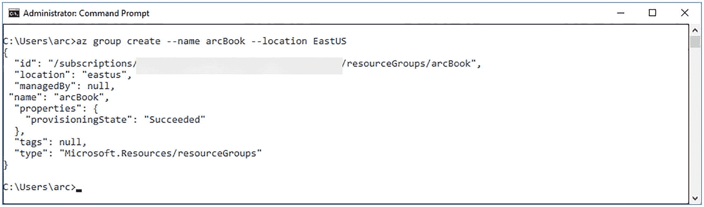

图 3-13

资源组创建确认

由于我们目前只是创建了一个空的资源组，这在 `Azure` 中尚未产生任何费用。

## 总结与要点回顾

在本章中，我们引导你了解了在开始部署 `Arc` 启用的 `Data Services` 之前需要满足的要求。现在你已经准备就绪，在真正开始之前唯一缺少的是一个 `Kubernetes` 集群。

