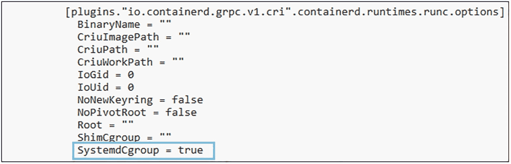
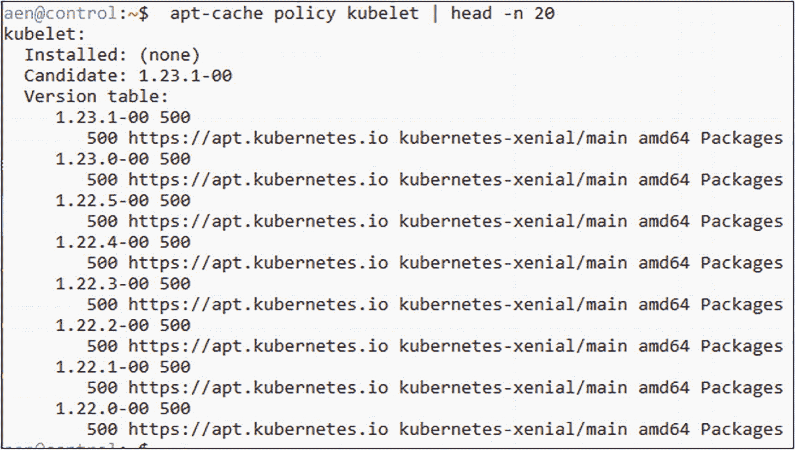
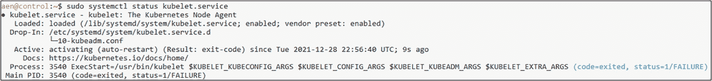
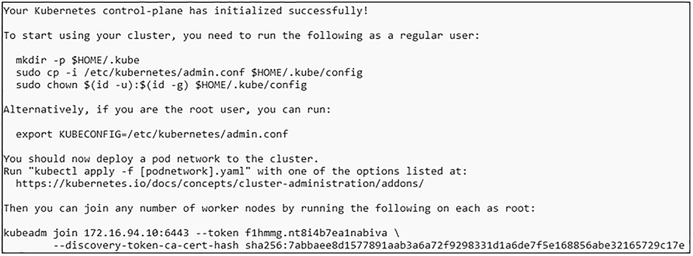
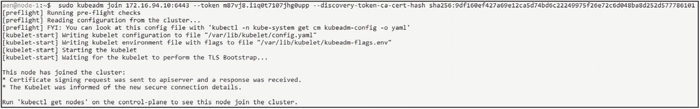
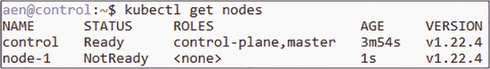
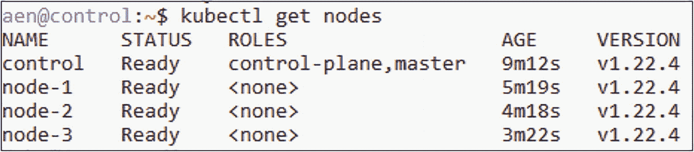
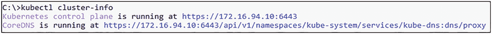

# 4. 安装 Kubernetes

鉴于——除了硬件之外——`Kubernetes` 是每个启用了 `Azure Arc` 的 `Data Services` 部署的基础层，你将至少需要一个 `Kubernetes` 集群来部署服务。在不深入细节的情况下，我们将向你展示如何使用 `kubeadm`（一种在 `Linux` 上运行的自安装 `Kubernetes` 版本）部署一个集群。这不是唯一的选择（支持的选项列表请参见第 2 章）。启用了 `Azure Arc` 的 `Data Services` 的核心思想是能够将服务部署到任何云中的任何基础设施——但我们想为你提供一个简单的入门选项。无论你选择哪个目标平台，后续章节中解释的部署过程都是相同的。

本章将介绍如何使用虚拟机在本地构建 `Kubernetes` 集群。我们将首先讨论在哪里安装的决策过程——本地还是云端——以及在此过程中需要考虑的事项。然后，我们将逐步讲解使用 `kubeadm` 安装方法构建一个基于虚拟机的本地 `Kubernetes` 集群。该集群将成为本书剩余部分所有示例的基础。


## 安装考虑因素与方法

与几乎任何现代软件安装一样，您需要决定的第一件事是：是在本地还是云端安装？

### 部署位置？

在云端部署时，您需要在两种主要的部署选项中做出选择：

*   **基础设施即服务 (IaaS)**：在 `IaaS` 场景中，您在云中部署 `虚拟机`，然后在其上安装 Kubernetes。
*   **平台即服务 (PaaS)**：Kubernetes 也可以作为托管服务由所有大型云提供商提供。在托管服务产品中，您无需担心任何底层基础设施或冗余问题。云提供商为您处理这些。使用 `PaaS` 需要考虑的一点是，您将失去 Kubernetes 内部版本控制和其他功能的灵活性，以及对控制平面节点的访问权限。在本地部署时，决策归根结底是在虚拟机上安装还是直接安装在 `裸机` 上。虽然本地也有托管服务，但这些不在本书讨论范围内。

选择 `裸机` 还是 `虚拟机` 作为您的节点，主要取决于您预期的工作负载。如果您谈论的是许多可扩展的微服务，在虚拟机上运行的 Kubernetes 节点可能会为您提供更多的额外灵活性。如果您部署的是一个单一的大型应用程序，中间的虚拟机监控程序将带来不必要的开销。您可能想知道：如果只运行一个应用程序，Kubernetes 真的是最佳平台吗？答案往往是：视情况而定！虽然它们通常需要专用基础设施，但有些只部署在 Kubernetes 上。

在本书中，我们将重点介绍使用自管理（本地或基于云的 IaaS）虚拟机的环境。无论您是在云端、本地还是裸机上将这些机器安装为虚拟机，都没有关系，因为 Kubernetes 会抽象掉基础设施。

展望未来，考虑在哪里安装潜在的生产集群，这个问题应遵循您组织的总体策略。如果您到目前为止的所有工作仍然在本地，那么您的 Kubernetes 集群部署在那里可能完全合理。另一方面，如果您正在或已经将重要工作负载迁移到云端，您的 Kubernetes 集群很可能也应跟随迁移。归根结底，这取决于您团队的技能组合以及在 Kubernetes 上运行用例的需求。

### 进一步考虑事项

除了“在哪里”的问题，当然还有其他考虑因素，我们将在本章及本书的后续部分更深入地讨论：

*   您需要多少个工作节点来支持您的工作负载？
*   这些节点的 CPU 和 RAM 配置是什么？
*   您是否需要一个高可用的解决方案，以防控制平面出现故障？
*   您的备份和恢复策略是什么？
*   您将使用哪种类型的存储？
*   您将如何管理 Pod 和节点之间的网络？

虽然我们正处于 Kubernetes 之旅的起点，但在考虑部署生产系统之前，所有这些问题您都应该有答案。

### 安装方法

根据您的安装位置，这在很大程度上也将决定您的安装方法。安装自管理集群时，您主要可以选择 `kubeadm`（一种在 `Linux` 上免费且开源的部署 Kubernetes 的方式）和 RedHat OpenShift 等企业产品。安装本身通常通过命令行工具触发。

安装基于云的集群时，您的云提供商将负责安装部分，具体细节由您的云提供商决定。他们通常提供自己的基于命令行的方法和用于引导部署的 Web 门户。

### 附加选项

还有许多附加选项，例如使用 `Docker` Desktop 在笔记本电脑上启动 Kubernetes 集群，或使用像 Raspberry Pi 这样的轻量级硬件作为部署目标。虽然它们可能有有效的用例，尤其是在非生产环境中，但本书不会深入探讨这些内容。

此外，虽然可以使用基于 Windows 的工作节点，但我们将重点使用 `Linux` 作为操作系统。

我们也不会详细介绍部署单节点集群的细节。如果您只有一台 `Ubuntu` 机器可用，可以使用清单 4-1 中的代码。这段代码将启动一个包含 `本地存储` 的单节点集群，但这对于本书中的大多数练习（除了最基本的练习）来说是不够的。

```
wget -q -O deploy_kubeadm.sh https://bookmark.ws/ArcDemo_Linux
chmod +x deploy_kubeadm.sh
./deploy_kubeadm.sh
清单 4-1
安装单节点集群
```

## 安装要求

对于自管理的 Kubernetes 安装，我们将重点介绍在 `Linux`（更具体地说是 `Ubuntu`）上使用 `kubeadm`。虽然 CentOS、RHEL 和其他 Linux 发行版也得到支持，但我们必须选择一个环境，而 Ubuntu 似乎是当今最常见的选择。

最低系统要求是具有两个 CPU、2GB RAM 并禁用交换空间的系统。这些是 Kubernetes 集群运行的最低要求，不包括集群上运行的工作负载。在生产环境中，您必须确保已考虑部署的工作负载及其可扩展性和冗余性。

除了这些基本系统要求外，您还需要一个 CRI（容器运行时接口）容器运行时。事实上的标准是 `containerd`。由于 Docker 在 Kubernetes 1.20 中已被弃用，并且在 Kubernetes 1.23 版本中移除了对其的支持，本书将主要关注 `containerd`。


### 网络要求

从网络角度来看，请确保所有机器都具有唯一的主机名、MAC 地址和 IP 地址。这些 IP 地址理想情况下应位于同一子网，但至少必须设置为可以相互访问。

如果您在网络内运行防火墙（对于本书中的实验，我们建议不要运行防火墙，以避免遇到不必要的网络复杂性），表 4-1 列出了控制平面上需要开放的所有 TCP 端口。

**表 4-1**

控制平面节点所需 TCP 端口

| 组件 | TCP 端口 |
| --- | --- |
| API | 6443 |
| etcd | 2379-2380 |
| Scheduler | 10251 |
| Controller Manager | 10252 |
| Kubelet | 10250 |

表 4-2 所列的端口需要在您集群中的工作节点上开放。

**表 4-2**

工作节点所需 TCP 端口

| 组件 | TCP 端口 |
| --- | --- |
| Kubelet | 10250 |
| NodePort | 30000-32767 |

> **注意**
>
> 此处列出的 TCP 端口是默认端口。如果您更改了这些端口，请相应地调整您的防火墙规则。

### 获取 Kubernetes

当然，要安装 Kubernetes，我们首先需要获取 Kubernetes。Kubernetes 软件维护在 GitHub 上，因此如果您访问 [`https://GitHub.com/Kubernetes/Kubernetes/`](https://GitHub.com/Kubernetes/Kubernetes/)，您将找到 Kubernetes 项目。您也可以向项目贡献您的想法和更改。这也是一个宝贵的资源，可以详细了解其工作原理，因为您可以查看代码并从 GitHub issues 中他人的经验中学习。

除了软件本身，您还可以在这里找到额外的文档。

理论上，您可以获取代码并自行编译所有内容，但为了让我们自己的工作更轻松，我们将通过包管理器来安装 Kubernetes。

## 构建自管理集群

有了上述理论基础，让我们开始构建我们的第一个 Kubernetes 集群，该集群将使用 `kubeadm` 在 Ubuntu 机器上运行。我们将使用第 1 章中描述的环境，包括其中提到的先决条件。

### 基于虚拟机的 Kubernetes 集群要求

我们将需要一些计算和存储资源来构建本章中的 Kubernetes 集群。对于我们的实验，我们将使用一组四个 Linux 虚拟机。部署数据控制器的最低要求是四个核心，再加上任何部署工作负载所需的额外核心。对于本书中的实验，每台虚拟机将需要 8 个 vCPU、16GB 内存和 150GB 磁盘空间，运行 Ubuntu Server 18.04 作为操作系统。我们已经在 Ubuntu 18.04 上测试了本书中的代码。Kubernetes 支持多种操作系统。更多详情请查看 [`https://kubernetes.io/docs/setup/production-environment/tools/kubeadm/install-kubeadm/`](https://kubernetes.io/docs/setup/production-environment/tools/kubeadm/install-kubeadm/)。

> **注意**
>
> 此处配置的系统资源，8 个 vCPU 和 16GB 内存，是引导 Azure Arc 启用的数据服务控制器以及 SQL 托管实例和 Postgres 等数据服务所需的最低要求。您需要根据希望在数据服务实例中运行的工作负载来分配额外的资源。如果在本书的示例中配置数据服务实例时内存受限，您可以考虑在完成练习后删除这些数据服务实例。

### 准备虚拟机

在您创建了本书实验所需的虚拟机后，是时候讨论这些虚拟机的网络配置了。

### 虚拟机网络配置

按照表 4-3 中的指定配置实验虚拟机的 IP 地址。您可以在您的实验中使用不同的 IP 地址，但在构建集群时的多个实验中，您需要对此进行考虑。

**表 4-3**

虚拟机配置

| 名称 | IP 地址 | 功能 |
| --- | --- | --- |
| control | 172.16.94.10 | 控制平面节点 |
| node-1 | 172.16.94.11 | 工作节点 |
| node-2 | 172.16.94.12 | 工作节点 |
| node-3 | 172.16.94.13 | 工作节点 |
| workstation (可选) | 172.16.94.100 | 管理工作站 (Windows) |

接下来，在 IT 领域，有句俗话：“永远是 DNS 的问题”。在企业环境中，您可以与网络团队合作来配置前面定义的 DNS 条目。对于我们的实验，我们将在每台系统的 `/etc/hosts` 文件中添加主机条目，以确保我们可以在实验中通过名称访问所有系统。在代码清单 4-2 中，您将找到我们的 `/etc/hosts` 文件的内容。您的 `hosts` 文件可能已经包含 localhost 的条目以及其他配置。

```
172.16.94.10   control
172.16.94.11   node-1
172.16.94.12   node-2
172.16.94.13   node-3
```

> 代码清单 4-2
> Linux 主机文件所需附加内容

在 Windows 机器上，您将在 `C:\Windows\System32\drivers\etc\hosts` 下找到该文件。

> **注意**
>
> 要编辑 Windows 上的 hosts 文件，请确保以管理员身份运行您的编辑器。

在继续之前，请确保您可以通过主机名访问所有这些虚拟机的控制台或 SSH，并且它们可以通过您的网络相互连接。

> **注意**
>
> 我们的所有脚本都使用前面描述的主机名/IP 地址。如果您使用不同的设置构建实验，您将需要相应地调整本书中使用的脚本。出于可读性考虑，我们不会在每个可能需要调整的地方单独指出。

### 系统交换空间设置

作为最后一步，让我们确保在我们的控制平面节点和三个工作节点上禁用 swap，因为这是 `kubelet` 的要求。

打开到每台虚拟机的单独 SSH 连接，并使用您喜欢的文本编辑器从 `/etc/fstab` 中移除任何 swap 分区。接下来，运行代码清单 4-3 中的命令，该命令还将使用 `sed` 来注释掉系统 `/etc/fstab` 中的 swap 条目。

如果没有返回输出，那么您的 swap 已被禁用。您应该重新启动您的虚拟机，以确保设置在重启后依然生效。

```bash
swapoff -a
sudo sed -i '/swap/s/^\(.*\)$/#\1/g' /etc/fstab
```

> 代码清单 4-3
> 禁用 swap

### 软件包安装

接下来，我们需要在所有虚拟机上安装 `containerd` 和 Kubernetes 软件包，如以下两段所述。除非另有说明，否则只需在每台虚拟机上使用 shell 运行所述命令即可。


## 安装与配置 containerd

要安装 `containerd`，我们需要使用清单 4-4 中的代码加载两个模块（`overlay` 和 `br_netfilter`）。它们分别是容器运行时所使用的 `OverlayFS` 和集群内部网络所必需的。

```
sudo modprobe overlay
sudo modprobe br_netfilter
清单 4-4
安装 modprobe 和 br_netfilter
```

使用清单 4-5 中的代码，我们需要确保这些模块在重启后也能被加载。

```
cat <<EOF | sudo tee /etc/modules-load.d/containerd.conf
overlay
br_netfilter
EOF
清单 4-5
持久化 modprobe 和 br_netfilter
```

`containerd` 还需要一些系统参数，我们可以使用清单 4-6 中的命令来设置并持久化这些参数。

```
cat <<EOF | sudo tee /etc/sysctl.d/99-kubernetes-cri.conf
net.bridge.bridge-nf-call-iptables  = 1
net.ipv4.ip_forward                 = 1
net.bridge.bridge-nf-call-ip6tables = 1
EOF
清单 4-6
为 containerd 持久化系统参数
```

接下来，让我们使用清单 4-7 中的命令应用这些设置而无需重启。

```
sudo sysctl --system
清单 4-7
应用 sysctl 更改
```

现在，我们为 `containerd` 准备的先决条件已经就绪，因此我们可以通过 `apt-get` 来安装它，如清单 4-8 所示。

```
sudo apt-get update
sudo apt-get install -y containerd
清单 4-8
安装 containerd
```

`containerd` 需要一个配置文件，我们可以使用 `containerd` 自身来生成一个带有默认设置的文件（清单 4-9）。

```
sudo mkdir -p /etc/containerd
sudo containerd config default | sudo tee /etc/containerd/config.toml
清单 4-9
创建 containerd 配置
```

在此文件中，我们必须将 `containerd` 的 `cgroup` 驱动设置为 `systemd`，因为 `kubelet` 需要这样做。

以 root 权限在文本编辑器中打开文件 `/etc/containerd/config.toml`（例如，通过 `vi`，如清单 4-10 所示）。

```
sudo vi /etc/containerd/config.toml
清单 4-10
编辑 containerd 配置
```

在此文件中，找到清单 4-11 所示的部分。

```
[plugins."io.containerd.grpc.v1.cri".containerd.runtimes.runc]
清单 4-11
containerd 配置文件中的配置部分
```

在其下方，查找 `SystemdCgroup = false` 这一行，并将其值从默认的 `false` 更改为 `true`（如清单 4-12 所示）。

```
[plugins."io.containerd.grpc.v1.cri".containerd.runtimes.runc.options]
...
SystemdCgroup = true
清单 4-12
containerd 配置文件中需要编辑的行，将 false 改为 true
```

**注意**
此处缩进很重要——可以是制表符或空格！请确保你的文件看起来像图 4-1 中那样！


图 4-1
containerd 配置文件中的缩进

要退出 `vi` 并保存文件，按 `ESC`，然后输入 `:x!`。

基于我们的新设置，我们可以使用 `systemctl` 来重启 `containerd`，如清单 4-13 所示。

```
sudo systemctl restart containerd
清单 4-13
重启 containerd
```

`containerd` 现已准备好可以使用，我们可以继续安装 Kubernetes 软件包。你可以使用清单 4-14 中的命令确认服务状态。

```
sudo systemctl status containerd
清单 4-14
containerd 的状态
```

## 安装与配置 Kubernetes 软件包

由于我们将从 Google Apt 仓库安装软件包，因此首先需要添加 Google 的 apt 仓库 `gpg` 密钥（清单 4-15）。

```
curl -s https://packages.cloud.google.com/apt/doc/apt-key.gpg | sudo apt-key add -
清单 4-15
添加 Google gpg 密钥
```

有了该密钥后，我们接下来添加 Kubernetes apt 仓库（清单 4-16）。

```
sudo bash -c 'cat <<EOF > /etc/apt/sources.list.d/kubernetes.list
deb https://apt.kubernetes.io/ kubernetes-xenial main
EOF'
清单 4-16
添加 Kubernetes apt 仓库
```

让我们更新 apt 软件包列表，并使用清单 4-17 中的代码查看 `kubelet` 的可用版本。

```
sudo apt-get update
apt-cache policy kubelet | head -n 20
清单 4-17
更新 apt 软件包列表
```

这会显示可用的版本，如图 4-2 所示，在撰写本文时，最新的可用版本是 `1.20.4`。


图 4-2
kubelet 的版本列表

我们现在可以安装 `kubelet`、`kubeadm` 和 `kubectl`，如清单 4-18 所示。如果你的当前机器也是你在第 1 章中用来安装 `kubectl` 的那台，你可能会收到它已安装的消息。

```
sudo apt-get install -y kubelet kubeadm kubectl
清单 4-18
安装 Kubernetes 软件包
```

这将安装这些工具的最新版本。如果你希望安装之前的版本，可以如清单 4-19 所示进行指定。

```
VERSION=1.22.4-00
sudo apt-get install -y kubelet=$VERSION kubeadm=$VERSION kubectl=$VERSION
清单 4-19
安装特定版本的 Kubernetes 软件包
```

为避免自动更新，我们将这些工具（以及 `containerd`）标记为保持（hold）（清单 4-20）。这使我们能够完全控制修补过程，使其独立于基础操作系统的修补。

**注意**
本书中的代码是针对 Kubernetes 版本 `1.22.4` 测试的。请通过访问 [*https://docs.microsoft.com/en-us/azure/azure-arc/data/release-notes*](https://docs.microsoft.com/en-us/azure/azure-arc/data/release-notes) 查看 Azure Arc-enabled Data Services 发行说明，了解支持的 Kubernetes 版本。

```
sudo apt-mark hold kubelet kubeadm kubectl containerd
清单 4-20
将 Kubernetes 软件包和 containerd 标记为保持
```

让我们检查一下 `kubelet` 和容器运行时的状态（清单 4-21）。

```
sudo systemctl status kubelet.service
sudo systemctl status containerd.service
清单 4-21
检查 kubelet 和 containerd 的状态
```

如图 4-3 所示，`kubelet` 将进入崩溃循环（crashloop）。在创建集群或将节点加入现有集群之前，这是正常行为（你可以按 `q` 退出该过程）。


图 4-3
kubelet 和 containerd 的状态

此外，请确保这两个服务都设置为在系统启动时启动。这可以通过清单 4-22 中的命令进行设置。

```
sudo systemctl enable kubelet.service
sudo systemctl enable containerd.service
清单 4-22
为 kubelet 和 containerd 启用开机自启
```

**注意**
请记住在每个节点（`control`、`node-1`、`node-2` 和 `node-3`）上分别重复此过程，并安装和配置这些软件包！

### 创建控制平面

随着容器运行时和 Kubernetes 软件包现已就位，我们可以继续创建我们的控制平面。

**注意**
本节中的所有命令都需要在你的 `control` 虚拟机上执行。


### Pod 网络

在初始化控制平面之前，我们需要获取将用于 Pod 网络的 IP 地址。对于 Pod 网络，存在许多不同的解决方案，我们决定保持简单并使用 `Flannel`。虽然它不像另一个流行的 Pod 网络 `Calico` 那样拥有所有高级配置设置，但它在本地和云网络上无需任何额外配置即可工作，而这些网络往往会限制 `IPIP` 数据包等。

使用 `wget` 命令下载默认清单，如清单 4-23 所示。

```
wget https://raw.githubusercontent.com/flannel-io/flannel/master/Documentation/kube-flannel.yml
清单 4-23
下载 Flannel
```

该文件不需要进行任何更改，但在该文件中定义了 Pod CIDR IP 范围。在第 128 行左右，你将找到定义的网络范围。清单 4-24 显示了文件中的代码。在 `network` 字段中，你将找到值 `10.244.0.0/16`。这是用于为集群中的 Pod 分配 IP 地址的网络范围。在我们的实验中不会更改此值。如果你的网络环境中的网络与其他 IP 范围重叠，你可能需要在你的实验环境中更改此值。

```
net-conf-json: |
{
"Network": "10.244.0.0/16",
"Backend": {
"Type": "vxlan"
}
}
清单 4-24
kube-flannel.yaml 文件中的 Pod CIDR 网络范围
```

### 引导你的控制平面

我们已准备好使用 `kubeadm` 初始化集群，如清单 4-25 所示。请注意，我们定义了参数 `--pod-network-cidr` 并将其值设置为 `kube-flannel.yaml` 清单中的相同值。如果你更新了你的 Pod 网络的值，请在此处编辑该值。我们使用的是清单中的默认值。

```
sudo kubeadm init --pod-network-cidr=10.244.0.0/16
清单 4-25
初始化集群
```

在你的控制节点上运行此代码。这将需要几分钟时间，并会持续输出其进度。完成后，结果应如你所见于图 4-4。



**图 4-4**

`kubeadm init` 的输出

为了确保我们可以使用非提升权限的 shell 与集群进行交互，我们需要创建一个 `kubeconfig` 文件并将其存储在我们的主目录中，如清单 4-26 所示。

```
mkdir -p $HOME/.kube
sudo cp -i /etc/kubernetes/admin.conf $HOME/.kube/config
sudo chown $(id -u):$(id -g) $HOME/.kube/config
清单 4-26
创建 kubectl 配置
```

**注意**

如果你使用的是管理工作站，你可以获取此文件并将其复制或其内容复制到此工作站主目录中的 `.kube/config`。这将允许你从该工作站与你的集群进行通信。

### 部署 Pod 网络

在加入工作节点之前，我们需要确保 Pod 网络已设置好。由于没有必需的更改，我们将直接使用 `kubectl` 进行安装，如清单 4-27 所示。我们将在本章后面更多地讨论 `kubectl`，因此如果此时感觉有些解释不清，请不要担心。

```
kubectl apply -f kube-flannel.yml
清单 4-27
安装 Flannel
```

使用 `Flannel` 的 Pod 网络现已设置完成。

### 将节点添加到集群

我们的控制平面已准备就绪，Pod 网络也已部署，但我们还不完全准备好加入节点。为了让一个节点能够加入集群，我们需要一个令牌。最简单的方法是直接使用 `kubeadm` 生成一个 `加入命令`，如清单 4-28 所示。

```
kubeadm token create --print-join-command
清单 4-28
生成令牌和加入命令
```

输出看起来类似于你所见于图 4-5。


**图 4-5**

加入命令

现在，我们可以获取此命令并在每个所需的工作节点上运行它（以 root 身份，参见清单 4-29），以启动加入过程。你的加入命令将不同，因为 CA 证书是唯一的。加入令牌是一个有效期为 24 小时的票据，因此如果你想稍后添加更多节点，你将需要创建一个新的令牌。

```
sudo kubeadm join 172.16.94.10:6443 \
--token m87vj8.i1q0t7107jhg0upp \
--discovery-token-ca-cert-hash sha256:9df160ef427a69e12ca5d74bd6c22249975f26e72c6d048ba8d252d577786101
清单 4-29
`kubeadm join` 命令
```

**注意**

确保添加 `sudo` —— 该命令需要以 root 身份运行，而 `--print-join-command` 不会为你添加它！

节点将报告它们已开始加入过程，如图 4-6 所示。



**图 4-6**

加入命令

让我们通过在控制平面上运行 `kubectl` 来列出节点，如清单 4-30 所示。

```
kubectl get nodes
清单 4-30
列出集群中的节点
```

如果你在将工作节点加入集群后不久运行此命令，你可能会发现节点显示出来了但仍然是 `NotReady`（见图 4-7）。



**图 4-7**

集群中的节点

节点将显示为 `NotReady`，因为运行 Pod 网络和 `kube-proxy` 的 Pod 当前正在部署。如果几分钟后再次运行该命令，节点将显示为 `Ready`。在所有节点都已加入集群并且每个节点都显示为 `Ready` 之前，你不应继续操作，如图 4-8 所示。



**图 4-8**

集群中所有节点显示为 Ready


## 在集群中配置存储

本书的重点是 Azure Arc-enabled Data Services 和数据控制器，所部署的数据服务实例需要访问集群中的持久存储。对于本书中的实验环境，我们使用集群中每个节点上可用的本地存储。虽然这对我们的实验场景来说是合适的，但对于生产工作负载而言，这并非最佳选择。您需要为集群和应用程序数据使用企业级存储。让我们深入了解如何为实验集群配置本地存储的动态供应。

首先，在集群的每个节点上，您将创建一组目录，用作集群中的持久卷。在清单 4-31 中，我们定义了一个循环，将创建 80 个用作持久卷的目录。调度到某个节点上且带有持久卷声明的 Pod，将被供应位于该节点上这些目录中的持久卷。

```bash
for i in $(seq 1 80); do
vol="vol$i"
sudo mkdir -p /azurearc/local-storage/$vol
sudo mount --bind /azurearc/local-storage/$vol /azurearc/local-storage/$vol
done
```
清单 4-31
为持久卷创建目录

接下来，我们将部署本地存储供应程序。该供应程序负责将持久卷声明绑定到持久卷。部署本地存储供应的代码位于清单 4-32。此代码创建了一个名为 `local-storage` 的 `Storage Class`。

```bash
kubectl apply -f https://raw.githubusercontent.com/microsoft/sql-server-samples/master/samples/features/azure-arc/deployment/kubeadm/ubuntu/local-storage-provisioner.yaml
```
清单 4-32
创建本地存储供应程序

创建本地供应程序后，下一步是将该本地存储供应程序设置为集群中的默认 `Storage Class`。将其设置为默认值的代码位于清单 4-33。

```bash
kubectl patch storageclass local-storage -p '{"metadata": {"annotations":{"storageclass.kubernetes.io/is-default-class":"true"}}}'
```
清单 4-33
将 `local-storage` 存储类设置为默认值

在集群中部署了本地存储供应程序后，当我们供应数据服务实例时，您可以指定一个 `Storage Class`。在本书的所有示例中，我们将使用此 `local-storage` `Storage Class` 来供应存储。如果您未指定 `Storage Class`，则会使用默认的 `Storage Class`，在我们的集群中，那就是 `local-storage` `Storage Class`。

在继续之前，请确认您的 `Storage Class` 已配置并设置为默认值。您可以使用清单 4-34 中的代码进行此操作，您应该会得到与图 4-9 相同的输出。请注意 `Storage Class` 名称是 `local-storage`，并且因为它后缀有 `(default)`，所以被标记为默认值。


图 4-9
集群中的存储类列表

```bash
kubectl get storageclass
```
清单 4-34
获取集群中的存储类列表

## 使用 kubectl 访问集群

`kubectl` 是与 Kubernetes 集群交互的主要命令行工具。在本章的集群引导过程和部署 Pod 网络期间，我们已经多次使用了 `kubectl`，并且我们是在控制平面节点上本地登录时运行这些命令的。

`kubectl` 通过 HTTPS 与 API 服务器交互。这意味着，如果 API 服务器可以从您使用的客户端访问，您就可以通过网络访问 API 服务器，从而允许您通过网络与集群交互。在本节中，我们将把上下文重命名为更用户友好的名称，然后将 `kubeconfig` 文件复制到 Windows 和 Linux 机器上，以便远程访问集群。您需要执行这些步骤来完成本书中的一些练习。

### 重命名 kubeconfig 上下文

`kubeconfig` 集群上下文是 `kubeconfig` 文件中的一个配置项，它定义了集群的网络位置、用于身份验证的用户名以及集群的身份验证凭据。一个 `kubeconfig` 文件中可以包含多个集群上下文。将集群上下文命名为有意义的名称通常很有帮助，而不是保留默认名称。所以，让我们一起来做这件事。

在您的控制平面节点上，让我们将现有的 `kubeconfig` 上下文从默认的 `kubernetes-admin@kubernetes` 重命名为更有意义的名称。我们将此 `kubeconfig` 上下文命名为 `kubeadm`，以描述我们在本章中共同创建的集群。在 Microsoft 文档和 Azure Data Studio 的 Azure Arc-enabled Data Services 以及 `azure-cli` 部署工作流中，`kubeadm` 是用于描述基于 `kubeadm` 的集群的通用术语。要重命名 `kubeconfig` 上下文，请使用清单 4-35 中的代码。

```bash
kubectl config rename-context kubernetes-admin@kubernetes kubeadm
```
清单 4-35
重命名 `kubeconfig` 上下文

在图 4-10 中，您可以看到成功重命名上下文后的输出。


图 4-10
`kubeconfig` 文件中的集群配置上下文列表

集群上下文重命名后，现在让我们将该集群上下文复制到 Windows 和 Linux 工作站，以便远程访问集群。


### 从 Windows 工作站操作

你可以使用 `pscp` 命令将 `kubeconfig` 文件从控制平面节点复制到本地 Windows 工作站。我们在第 3 章安装 putty 软件包时安装了 `pscp`。在清单 4-36 中，代码首先在当前用户的配置文件中创建一个 `.kube` 目录。然后，它使用 `pscp` 将名为 `config` 的 kubeconfig 文件从控制平面节点上你用于引导集群的用户的家目录，复制到 Windows 工作站当前用户配置文件下的子目录 `.kube` 中。复制到那里后，`kubectl` 就可以为该集群上下文读取该文件。

```
mkdir %USERPROFILE%\.kube
pscp -P 22 @control:/home//.kube/config %USERPROFILE%\.kube\
```
清单 4-36
将你的 kubeconfig 文件从控制节点复制到 Windows 工作站

> 注意
>
> 在本章前面，作为集群引导过程的一部分，你已经将 `/etc/kubernetes/admin.conf` 复制到控制平面节点上的 `$HOME/.kube/config`。你现在就是从该 `$HOME` 目录将配置文件复制到你的 Windows 工作站。

将集群上下文复制到 Windows 工作站后，你需要从该工作站确认 `kubectl` 能够使用该文件。你可以通过运行清单 4-37 中的代码来获取当前集群上下文，输出应与图 4-11 所示的输出匹配。


图 4-11
Windows 工作站上 kubeconfig 文件中的集群配置上下文列表

```
kubectl config current-context
```
清单 4-37
检索活动的 Kubernetes 上下文

确认 `kubectl` 正在读取正确的 kubeconfig 文件后，你需要使用清单 4-38 中的代码测试与集群的连接性。

```
kubectl cluster-info
```
清单 4-38
测试到集群的连接性

执行后，你应看到类似图 4-12 的输出。你可以通过查看控制平面节点的 URL 来确认你指向的是正确的 Kubernetes 集群，在我们的实验环境中，URL 是 `https://172.16.94.10:6443`，这就是 API 服务器的位置。


图 4-12
集群信息列表。确认从我们的 Windows 客户端到远程集群的连接性

现在让我们继续，将 kubeconfig 文件从控制平面节点复制到 Linux 工作站。

### 从 Linux 工作站操作

要将 kubeconfig 文件从你的控制平面节点复制到 Linux 工作站，你可以使用许多 Linux 发行版原生安装的 `scp` 命令。在清单 4-39 中，你可以找到将 kubeconfig 文件从控制平面节点复制到远程 Linux 工作站的命令。登录到你想要复制文件到的 Linux 机器，并在该系统上运行此代码。

> 注意
>
> 此代码将覆盖你当前名为 `config` 的 kubeconfig 文件。你可能需要备份现有的 kubeconfig 文件。

```
mkdir $HOME/.kube
scp aen@control:~/.kube/config $HOME/.kube/config
```
清单 4-39
将你的 kubeconfig 文件从控制节点复制到你的 Linux 工作站

与前面的 Windows 示例类似，请使用 `kubectl config current-context` 确保你的集群上下文配置正确，并使用 `kubectl cluster-info` 确认与远程集群的连接性。输出将与上一节相同。

## 本章总结

在本章中，我们指导你创建了一个 Kubernetes 集群。既然你已准备就绪，下一章将终于迎来第一次 Arc 实践体验：部署你的第一个数据控制器。

