# 5. 以间接模式部署数据控制器

在上一章中，我们部署了一个 Kubernetes 集群。现在是时候使用这个集群，并向其部署我们的第一个启用 Azure Arc 的数据控制器了，我们将使用间接连接模式（简称间接模式）进行部署。

> 注意
>
> 如果你使用多个 Kubernetes 集群，请确保你的当前上下文（即活动的 Kubernetes 集群配置）指向的是正确的那一个。

## 决定 Kubernetes 存储类

首先，使用清单 5-1 再次确认你的当前上下文是你部署的目标。

```
kubectl config current-context
```
清单 5-1
检索活动的 Kubernetes 上下文

我们在图 5-1 中的示例输出显示，我们当前的活动上下文是之前部署的 kubeadm 集群。


图 5-1
输出示例

由于我们已经连接到正确的集群，我们需要弄清楚集群内有哪些存储类可用，因为即使只有一个存储类，此信息在部署期间也是必需的。可以使用清单 5-2 中的命令列出存储类。

```
kubectl get storageclass
```
清单 5-2
检索当前 Kubernetes 上下文中存储类的列表

在我们的示例中，只有一个类——`local-storage`，如图 5-2 所示。

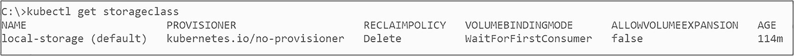
图 5-2
存储类列表

记下此信息或记住它。如果你正在一个具有多个可用存储类的集群上工作，开始思考你想为集群使用哪个存储类。你可以为 Kubernetes 日志、数据和数据库日志使用不同的存储类。


## 通过命令行部署

正如我们在第 2 章中所介绍的，大多数围绕启用 Azure Arc 的数据服务的部署都是通过一个名为 `az`（即 `azure-cli`）的工具来控制的。即使是 Azure Data Studio 的图形化安装，也只是在后台调用此 CLI，这就是为什么我们将从命令行驱动的方法开始。

一个部署命令可能如代码清单 5-3 所示。

```
az arcdata dc create     --connectivity-mode Indirect `
--name arc-dc-local `
--k8s-namespace arc `
--subscription  `
-g arcBook `
-l eastus `
--storage-class local-storage `
--profile-name azure-arc-kubeadm `
--infrastructure onpremises
--use-k8s
清单 5-3
用于创建数据控制器的 azure-cli 命令
```

这将触发数据控制器在间接模式下的当前 Kubernetes 上下文中部署，Arc 集群的名称将为 `arc-dc-local`，Kubernetes 中的命名空间将为 `arc`。订阅 ID 需要替换为你的 Azure 订阅 ID。部署将链接到位于“美国东部”区域的资源组 `arcBook`（尽管在首次上传指标和/或日志之前，部署不会显示在门户中 - 更多详情请参见第 9 章），并且它将使用 `local-storage` 存储类。

我们提供了一个部署配置文件名，在我们的例子中是 `azure-arc-kubeadm`。`azure-cli` 附带了一些预配置的配置文件，以便于部署到不同版本的 Kubernetes。可以使用代码清单 5-4 中的命令检索当前提供的配置文件列表。

最后两个参数将定义基础结构（允许的值：['aws', 'gcp', 'azure', 'alibaba', 'onpremises', 'other', 'auto']）并使客户端使用本地 Kubernetes 工具（由 `--use-k8s` 开关触发）。替代方法是使用 Azure 资源管理器，这将在下一章中用于我们的直接连接数据控制器。

还有几个参数，并且此示例中提到的所有参数并非都是必需的。你可以在 [*https://docs.microsoft.com/en-us/cli/azure/arcdata*](https://docs.microsoft.com/en-us/cli/azure/arcdata) 找到完整的参考。

```
az arcdata dc config list
清单 5-4
检索 Arc 数据控制器的配置配置文件列表
```

此命令将返回支持的选项列表，如图 5-3 所示。每个选项都将具有针对特定环境（如存储、安全性和网络集成）的预设但可调整的配置。

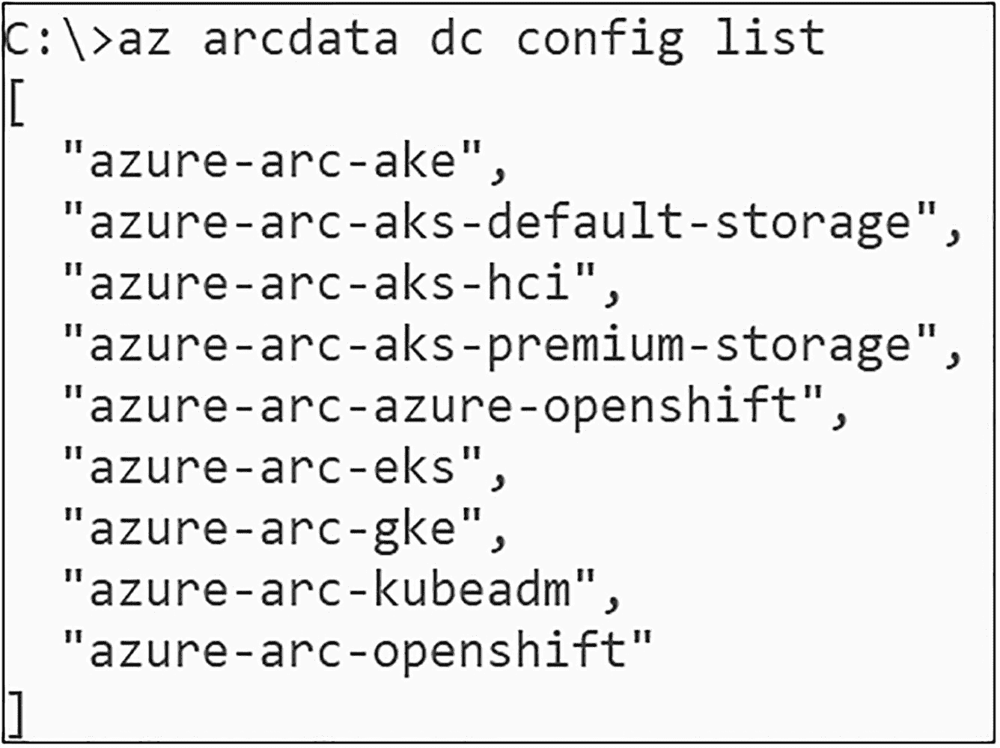

图 5-3

Arc 数据控制器的配置配置文件列表

如果你的所需平台不在列表中，或者你需要更改配置文件的默认设置，也可以从使用代码清单 5-5 中的代码创建自定义配置开始。

```
az arcdata dc config init -p customconfig --source azure-arc-kubeadm
清单 5-5
用于初始化自定义配置的 azure-cli 命令
```

这将在名为 `customconfig` 的目录中创建一个名为 `control.json` 的文件。该文件类似于我们在代码清单 5-6 中看到的内容，可用于控制数据控制器部署的每个可配置参数。

```
{
"apiVersion": "arcdata.microsoft.com/v2",
"kind": "DataController",
"metadata": {
"name": "datacontroller"
},
"spec": {
"infrastructure": "",
"credentials": {
"serviceAccount": "sa-arc-controller",
"dockerRegistry": "arc-private-registry",
"domainServiceAccount": "domain-service-account-secret"
},
"docker": {
"registry": "mcr.microsoft.com",
"repository": "arcdata",
"imageTag": "v1.1.0_2021-11-02",
"imagePullPolicy": "Always"
},
"storage": {
"data": {
"className": "",
"size": "15Gi",
"accessMode": "ReadWriteOnce"
},
"logs": {
"className": "",
"size": "10Gi",
"accessMode": "ReadWriteOnce"
}
},
"security": {
"allowDumps": true,
"allowNodeMetricsCollection": true,
"allowPodMetricsCollection": true
},
"services": [
{
"name": "controller",
"serviceType": "NodePort",
"port": 30080
}
],
"settings": {
"azure": {
"autoUploadMetrics": "false",
"autoUploadLogs": "false"
},
"controller": {
"logs.rotation.size": "5000",
"logs.rotation.days": "7"
},
"ElasticSearch": {
"vm.max_map_count": "-1"
}
}
}
}
清单 5-6
示例 `control.json` 文件
```

如果想使用自定义配置而不是预配置的配置文件进行部署，可以将 `--profile-name` 参数（而不是 *profile name*）传递给 `azure-cli`，如代码清单 5-7 所示。

```
az arcdata dc create     --connectivity-mode Indirect `
--name arc-dc-local `
--k8s-namespace arc `
--subscription  `
--resource-group arcBook `
--location eastus `
--profile-name PATH `
--use-k8s
清单 5-7
使用自定义配置创建数据控制器的 azure-cli 命令
```

无论你选择哪种方式，CLI 都会首先要求你提供要使用的用户名和密码（可能还需要接受许可协议），然后开始部署过程。过程的持续时间将取决于目标机器的性能和互联网连接，完成后，输出应类似于我们在图 5-4 中看到的内容。

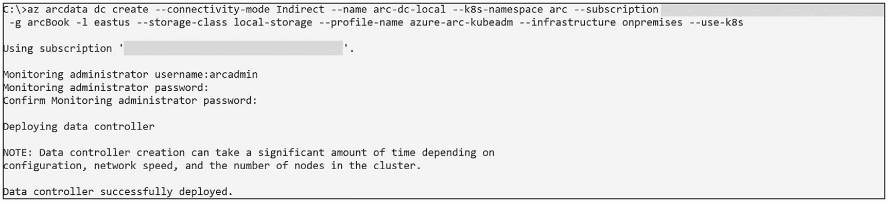

图 5-4

数据控制器部署的输出

如果希望避免被提示输入 EULA、用户名和密码，也可以在环境变量中提供它们：

*   `ACCEPT_EULA`：将其设置为 `Y`
*   `AZDATA_USERNAME`：要使用的用户名，例如 `arcadmin`
*   `AZDATA_PASSWORD`：你选择的强密码
*   `AZDATA_LOGSUI_USERNAME` 和 `AZDATA_LOGSUI_PASSWORD`：日志仪表板的用户名和密码
*   `AZDATA_METRICSUI_USERNAME` 和 `AZDATA_METRICSUI_PASSWORD`：指标仪表板的用户名和密码

**注意** 如果未提供 `METRICSUI` 和 `LOGSUI`，则它们将回退到 `AZDATA` 用户名/密码。

这将使 `azure-cli` 使用这些值，而不是以交互方式提示你。使用环境变量时，可以为日志 UI、指标 UI 和控制器本身提供专用用户。以交互方式输入时，它们都将使用相同的凭据。

如果想在 Kubernetes 端监控部署，可以运行代码清单 5-8 中的 `kubectl` 命令来跟踪进度。

```
kubectl get pods -n arc --watch
清单 5-8
使用 kubectl 监控部署状态
```

使用 `--watch` 开关，每当 Pod 中就绪容器的状态或数量发生变化时，输出都会持续更新。输出将如图 5-5 所示，并在 Pod 状态变化时持续更新。

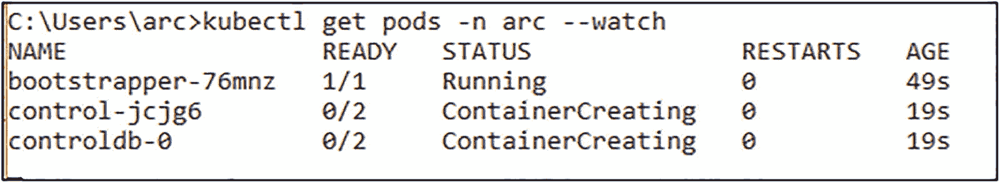

图 5-5

代码清单 5-8 的输出

部署完成后，你可以使用 `az` 来，例如，使用代码清单 5-9 检索控制器的端点。

```
az arcdata dc endpoint list -o table -k arc
清单 5-9
用于检索端点列表的 azure-cli 命令
```

这将显示我们稍后可用于监控集群的端点，类似于图 5-6 中的输出。

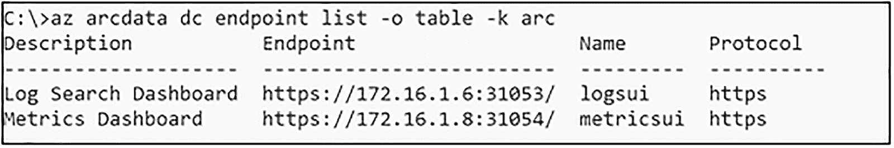

图 5-6

数据控制器端点列表

你的第一个数据控制器现已准备就绪，我们将在接下来的章节中向你展示如何通过向其部署数据实例来开始使用它！


## 通过 Azure Data Studio 部署

如果你更喜欢图形化界面驱动的方式，可以使用 Azure Data Studio 来完成部署。

**注意**

如果你使用的是 `NodePort` 服务类型，则需要在部署前确保每个数据控制器在 `control.json` 文件中使用不同的端口号。在同一个 Kubernetes 集群上，不能有多个数据控制器使用相同的 `NodePort` 端口号，因为它们会在终端端口上发生冲突！

让我们开始在 Azure Data Studio 中部署数据控制器的过程。你可以通过导航到连接选项卡上的 `AZURE ARC CONTROLLERS` 部分并点击“+”来开始，如图 5-7 所示。

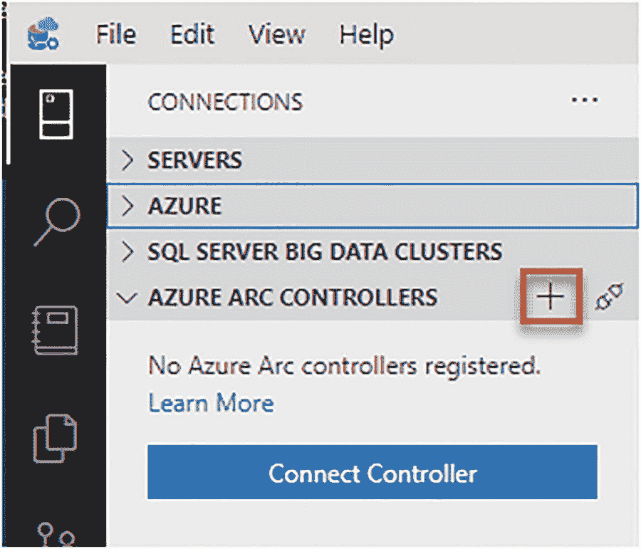
图 5-7
启动 Arc 控制器部署向导

向导将首先确认你是否要部署数据，如图 5-8 所示。

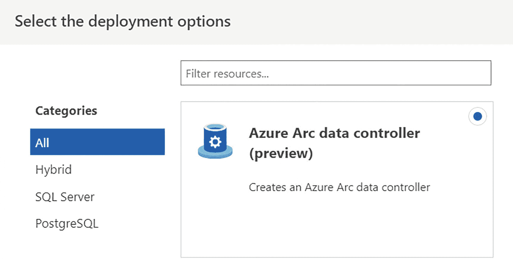
图 5-8
Arc 控制器部署向导 – 选择部署选项

然后，它将验证所有必需工具是否已安装正确版本，如图 5-9 所示。

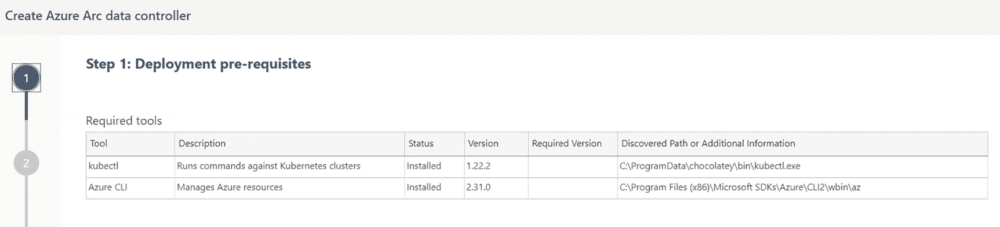
图 5-9
Arc 控制器部署向导 – 先决条件

在下一步（图 5-10），你将设置用于此次部署的 Kubernetes 上下文。

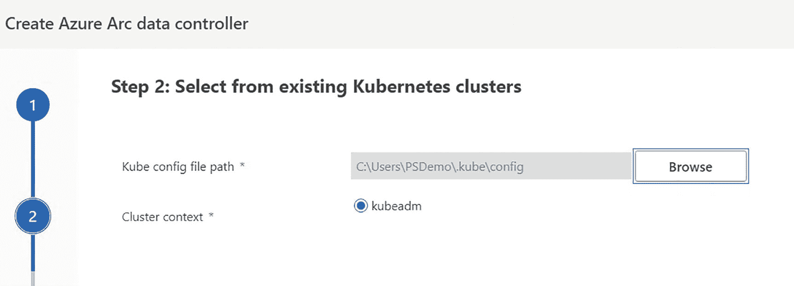
图 5-10
Arc 控制器部署向导 – 第 2 步

接下来是使用的配置配置文件，如图 5-11 所示。

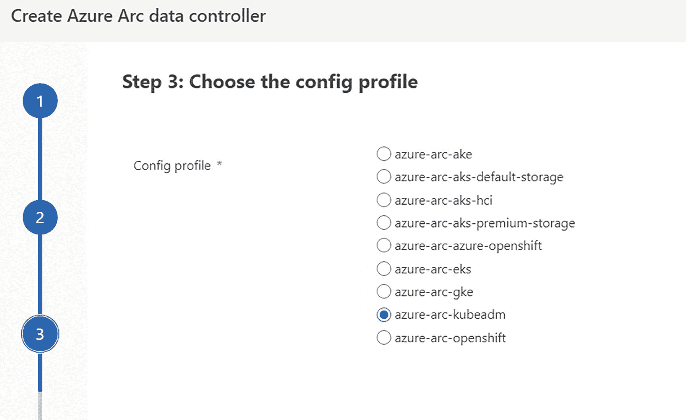
图 5-11
Arc 控制器部署向导 – 第 3 步

第四步（如图 5-12 所示）将要求提供用于部署的 Azure 配置。这包括你的 Azure 账户、订阅、资源组以及要使用的区域。

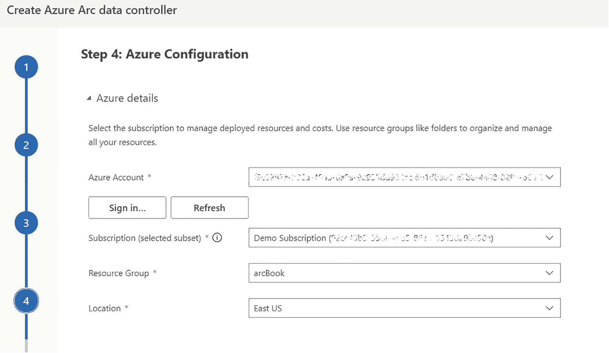
图 5-12
Arc 控制器部署向导 – 第 4 步

第 5 步（见图 5-13）将定义控制器配置，即 Kubernetes 内使用的命名空间、用于在 Azure 门户中识别的数据控制器名称、存储类和基础结构类型、用户名以及此控制器的密码。

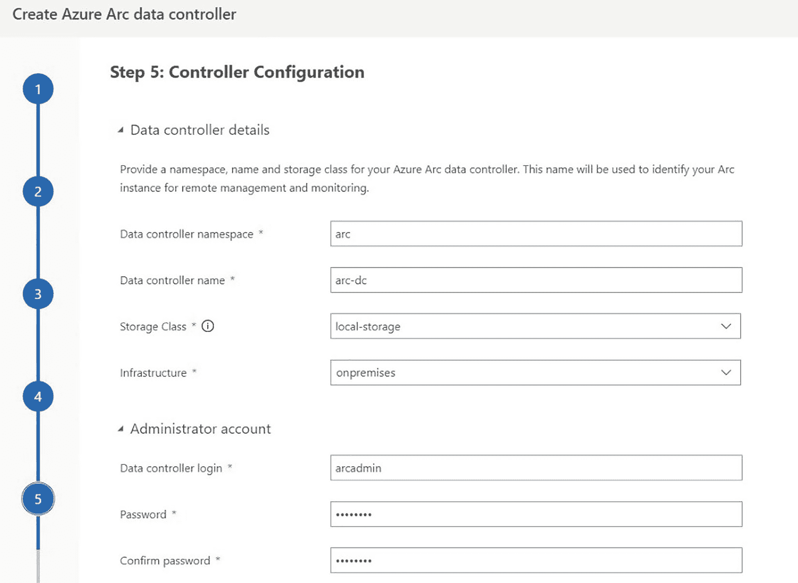
图 5-13
Arc 控制器部署向导 – 第 5 步

最后的第 6 步将为你提供所选设置的摘要，如图 5-14 所示。

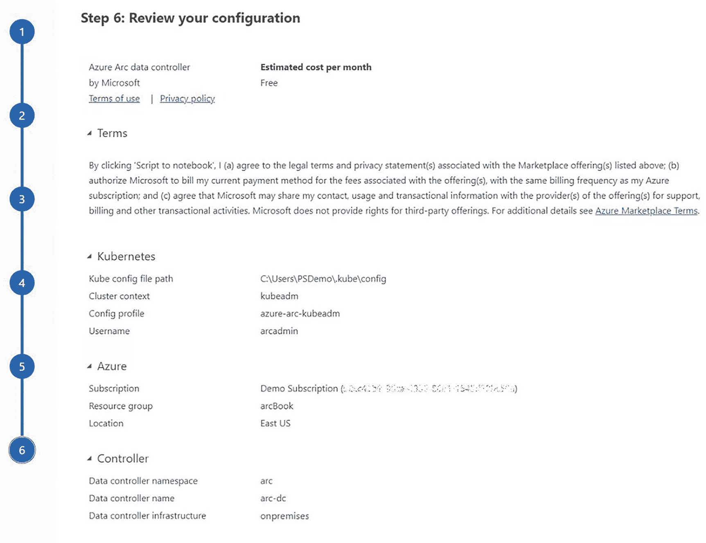
图 5-14
Arc 控制器部署向导 – 第 6 步

你可以使用底部的 `Script to notebook` 按钮来确认这些设置，这将创建一个基于 Python 的 Jupyter Notebook，可以通过 `Run all` 按钮执行（见图 5-15），或者直接使用 `Deploy` 按钮立即部署。

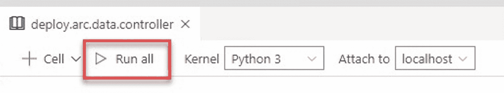
图 5-15
Azure Data Studio 中 Jupyter Notebook 的“全部运行”按钮

由于我们已经部署了一个数据控制器，可以跳过这一部分。

在 Azure Data Studio 中，我们也可以添加现有的控制器以便从这里进行管理。要执行此操作，请点击 `Connect Controller` 按钮，如图 5-16 所示。

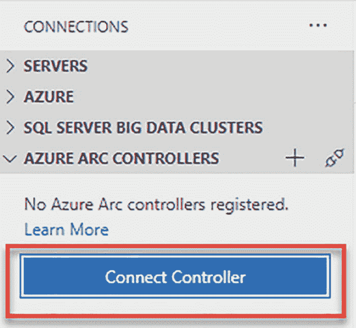
图 5-16
将 Arc 控制器添加到 Azure Data Studio

这将触发一个对话框，要求提供控制器的命名空间和集群（见图 5-17）。

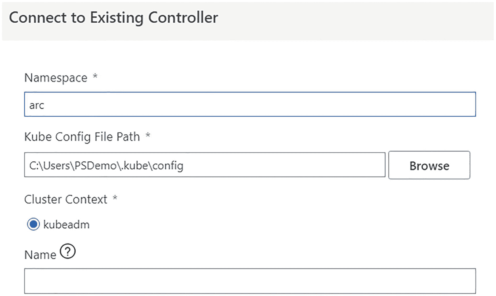
图 5-17
将 Arc 控制器添加到 Azure Data Studio – 连接详细信息

一旦你提供了这些设置并添加了控制器，它就会显示在 ADS 中（见图 5-18）。

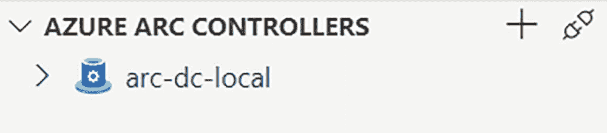
图 5-18
在 Azure Data Studio 中显示的 Arc 数据控制器

如果你右键单击控制器并选择 `manage`，将会显示控制器的设置。

在设置页面上，你将再次看到其终端、命名空间等。示例见图 5-19。

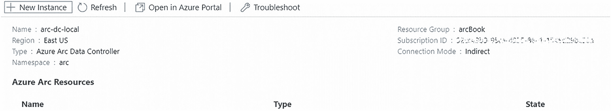
图 5-19
Azure Data Studio 中的 Arc 数据控制器管理页面

至此，你已部署了一个 Arc 数据控制器，并将其添加到了可从 Azure Data Studio 管理的清单中。

## 总结与要点

在本章中，我们部署了我们的第一个 Azure Arc 数据控制器——以间接模式部署。

另一方面，下一章将引导你设置直接连接的集群。

