# 6. 以直接模式部署数据控制器

虽然我们在上一章已经开始部署第一个数据控制器，并使用了间接连接模式，但我们也来看看直接模式的数据控制器。与间接连接的控制器不同，直接模式控制器将**持续连接到** Azure 门户，这意味着你无需手动上传任何使用情况或日志数据，并且还可以使用此控制器的数据进行实时分析和警报。

**注意**

根据你所使用的 Kubernetes 集群类型，由于端口和资源冲突，你可能无法将此直接模式数据控制器部署到同一个集群。

如果你使用的是本书中描述的基于 `kubeadm` 的集群，请先删除间接连接的数据控制器，或者部署第二个 Kubernetes 集群。虽然在同一集群上并行运行直接和间接数据控制器是可能的，但这需要一些额外的步骤，并且其用例非常有限，因此超出了本书的范围。


## Azure Arc-enabled Data Services 准备工作

### 让你的 Kubernetes 集群启用 Azure Arc

让数据控制器能够以直接模式部署的首要要求是，你的 Kubernetes 集群需要启用 Azure Arc。如第 2 章所述，Azure Arc 提供多种功能，其中之一便是 Azure Arc-enabled Kubernetes。

要让你当前 `kubectl` 集群上下文中的集群启用 Arc，你可以使用清单 6-1 中显示的命令，提供在 Azure 中的集群名称以及应存储其元数据的资源组和位置。

```
az connectedk8s connect --name kubeadm --resource-group arcBook --location eastus
```
清单 6-1
使 Kubernetes 集群启用 Azure Arc 的 Azure CLI 命令

这将产生类似于图 6-1 中的输出。


图 6-1

清单 6-1 的输出

你还可以使用清单 6-2 中的命令列出资源组中的所有已启用 Arc 的 Kubernetes 集群。

```
az connectedk8s list --resource-group arcBook --output table
```
清单 6-2
列出资源组中已启用 Arc 的 Kubernetes 集群的 Azure CLI 命令

如图 6-2 所示，我们的 `kubeadm` 集群已加入并显示在命令输出中。

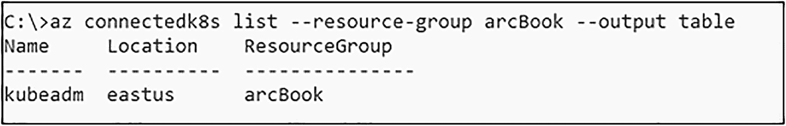

图 6-2

清单 6-2 的输出

此加入过程或 Arc 启用在我们的集群中创建了一个名为 `Azure Arc` 的命名空间，其中包含各种部署和 Pod，我们可以使用清单 6-3 中的命令列出并验证它们。

```
kubectl get deployments,pods -n azure-arc
```
清单 6-3
列出已启用 Arc 命名空间中部署和 Pod 的 kubectl 命令

图 6-3 显示了该命令的结果。

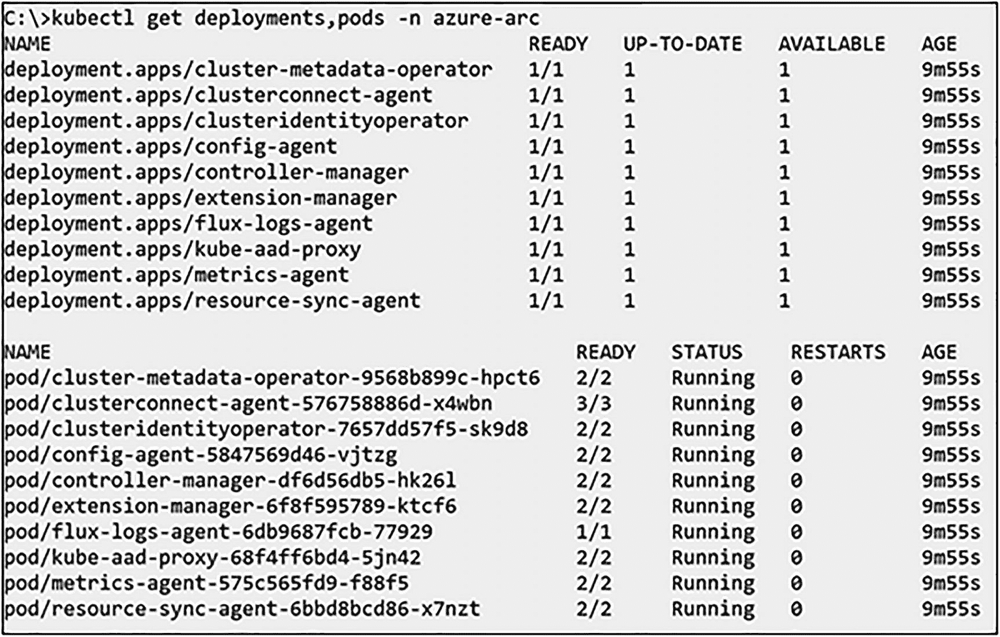

图 6-3

清单 6-3 的输出

成功连接集群后，我们还需要使用清单 6-4 中的命令启用 `custom-locations` 功能。此命令尚不会创建自定义位置——它只是让集群允许创建自定义位置。自定义位置本质上是从 Azure 指向我们 Kubernetes 集群的指针，以便在部署数据控制器时可以引用此集群。虽然我们也可以从命令行创建此位置，但稍后我们将从 Azure 门户部署数据控制器的过程中完成此操作。

```
az connectedk8s enable-features -n kubeadm -g arcBook --features cluster-connect custom-locations
```
清单 6-4
启用自定义位置功能的 Azure CLI 命令

功能成功启用后，CLI 将如图 6-4 所示进行报告。

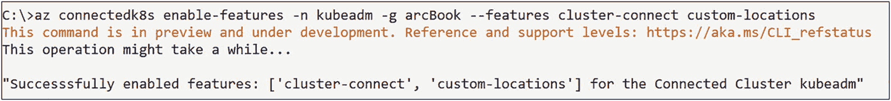

图 6-4

清单 6-4 的输出

对我们集群本身的最后一个要求是 Arc-enabled Data Services 扩展，它将把自定义资源定义和引导程序引入你的 Kubernetes 集群。可以使用清单 6-5 中的命令创建此扩展。此步骤必须在你希望直接连接使用 Arc-enabled Data Services 的每个 Kubernetes 集群上执行一次。

```
az k8s-extension create --name arc-data-location `
--extension-type microsoft.arcdataservices `
--cluster-type connectedClusters `
--cluster-name kubeadm `
--resource-group arcBook `
--scope cluster `
--release-namespace arc-direct `
--config Microsoft.CustomLocation.ServiceAccount=sa-bootstrapper `
--auto-upgrade false
```
清单 6-5
安装 Arc-enabled Data Services Kubernetes 扩展的 Azure CLI 命令

此步骤的成功至关重要，因此请使用清单 6-6 中的命令仔细检查其状态。

```
az k8s-extension show --name arc-data-location --cluster-type connectedClusters -c kubeadm -g arcBook -o table
```
清单 6-6
显示 Arc-enabled Data Services Kubernetes 扩展状态的 Azure CLI 命令

如图 6-5 所示，`ProvisioningState` 显示为 `Succeeded`——在此状态出现之前请勿继续操作，这可能需要几分钟时间。

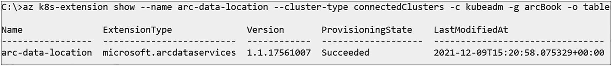

图 6-5

清单 6-6 的输出

如前所述，这也在我们的集群中创建了一个引导程序，我们可以使用清单 6-7 中的 `kubectl` 命令列出它。

```
kubectl get pods -n arc-direct
```
清单 6-7
列出命名空间中所有 Pod 的 kubectl 命令

输出应类似于图 6-6，这确认了我们的引导程序 Pod 已创建并正在运行。

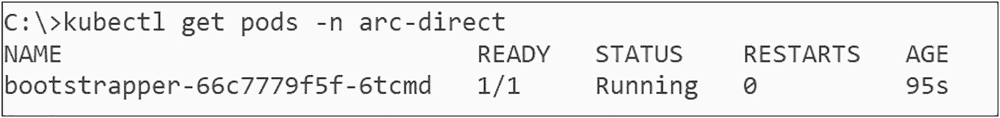

图 6-6

清单 6-7 的输出

我们的 Kubernetes 集群现在已准备好部署直接连接的 Azure Arc 数据控制器。

### 准备你的 Azure 订阅

除了对 Kubernetes 集群的要求外，你的 Azure 订阅也有一个要求：我们需要一个 Log Analytics 工作区。如果你已经有一个，可以随意使用。否则，你可以使用清单 6-8 中的命令创建一个。重要的是工作区需要一个唯一的名称。

```
az monitor log-analytics workspace create -g arcBook -n arcBookLAWS
```
清单 6-8
创建 Log Analytics 工作区的 Azure CLI 命令

结果应类似于图 6-7，格式为 JSON。

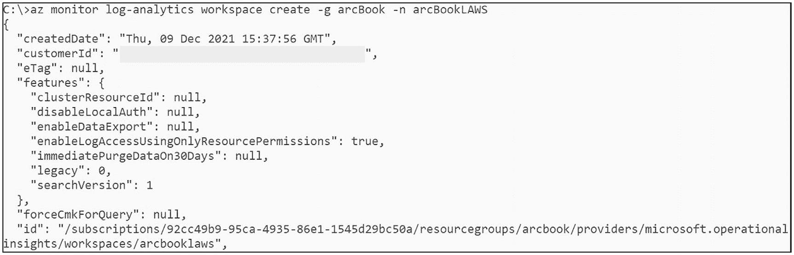

图 6-7

清单 6-8 的输出

要访问此工作区，我们需要其主访问密钥，这可以通过清单 6-9 中的命令检索。

```
az monitor log-analytics workspace get-shared-keys -g arcBook -n arcBookLAWS
```
清单 6-9
检索工作区共享密钥的 Azure CLI 命令

输出将再次是 JSON 格式，如图 6-8 所示。复制 `primarySharedKey` 的值，因为我们设置数据控制器时需要用到它。

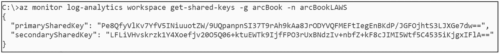

图 6-8

Azure Log Analytics 工作区的访问密钥

我们的 Log Analytics 工作区现在也已准备好与我们的数据控制器一起使用。


## 部署直接模式数据控制器

由于直接连接的 Azure Arc 数据控制器本质上与其他 Azure 资源无异（尽管仅其元数据驻留在 Azure 中），我们也可以通过 CLI 或 ARM 模板等方式来部署它。

不过，我们将重点介绍通过 Azure 门户的方法。欢迎您复用此过程中生成的 ARM 模板——我们只是觉得，能在门户中在线部署一个资源，然后它就会显示在我们本地的 Kubernetes 集群中，这种方式非常酷。

要开始部署，请导航至 Azure 门户中的“创建 Azure Arc 数据控制器”页面，网址为 `https://portal.azure.com/#create/Microsoft.DataController`，并选择您计划使用启用 Azure Arc 的 Kubernetes 集群，即直接连接模式，如图 6-9 所示。

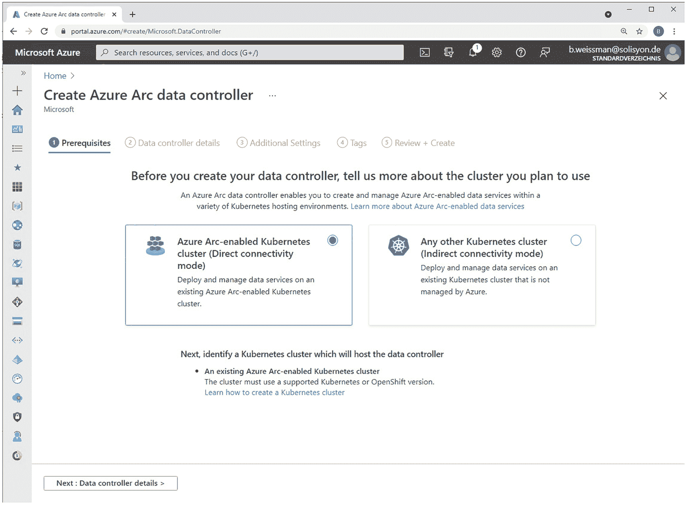

图 6-9：在 Azure 门户中创建 Azure Arc 数据控制器

在下一个屏幕中，如图 6-10 所示，您将首先提供用于数据控制器元数据的订阅和资源组，以及控制器的名称。

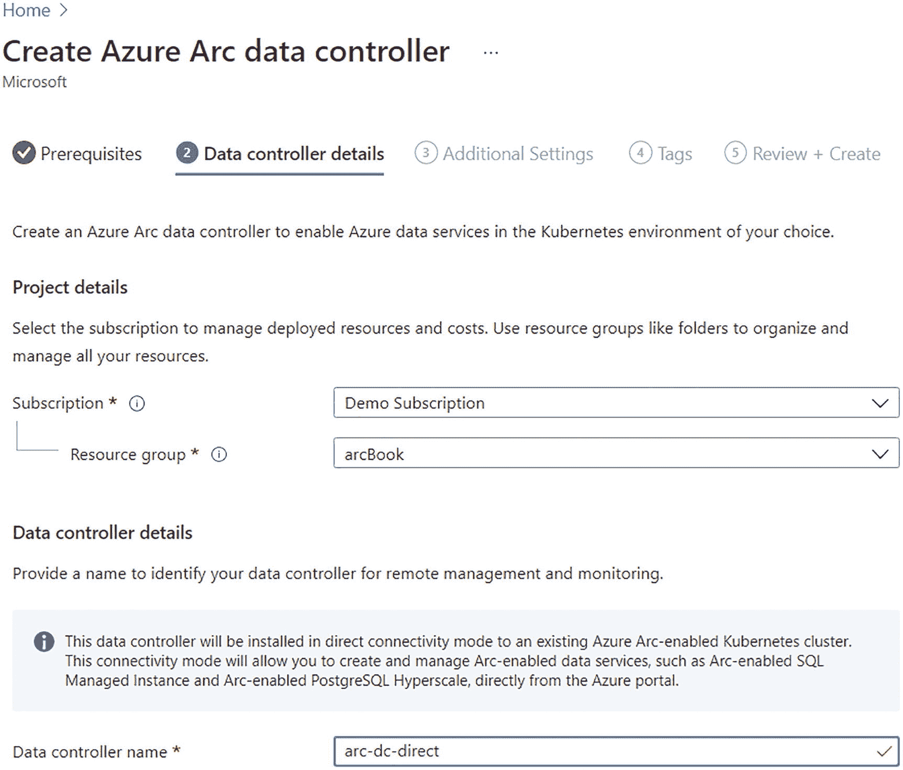

图 6-10：数据控制器详细信息

在同一屏幕上，您需要选择要使用的自定义位置，或者创建一个新的，如图 6-11 所示。

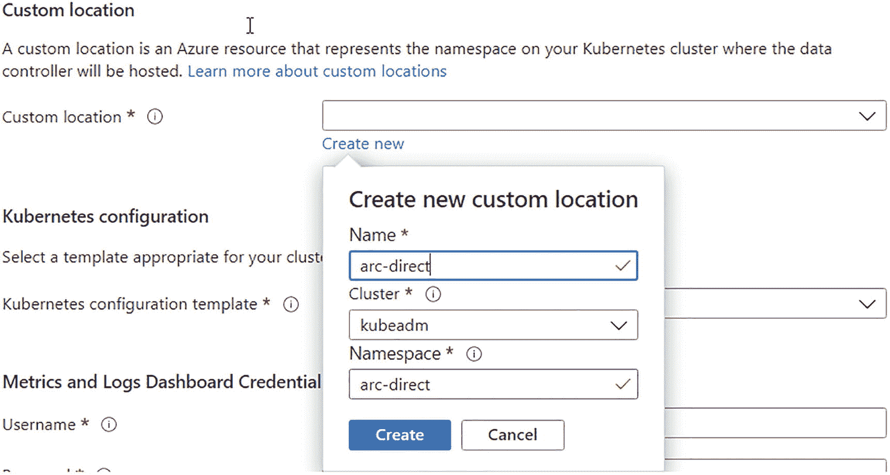

图 6-11：创建新的自定义位置

仍然在这个第一个屏幕上，我们还将提供 Kubernetes 配置——例如存储类等信息，这些信息我们在上一章中已经通过命令行提供过，还包括服务类型以及用于指标和日志内置仪表板的凭据（如图 6-12 所示）。

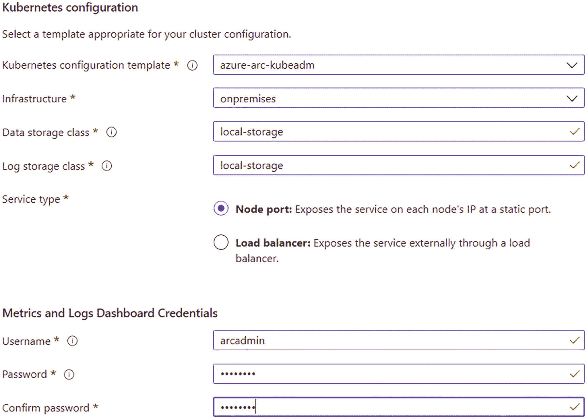

图 6-12：Kubernetes 配置和仪表板凭据

进入下一个屏幕“附加设置”（参见图 6-13），我们可以启用或禁用指标和日志的自动上传。强烈建议将两者都启用，以确保您能享受到实时警报等功能。启用时，您还需要选择要使用的 Log Analytics 工作区，并提供我们之前通过列表 6-9 获取的其主密钥。

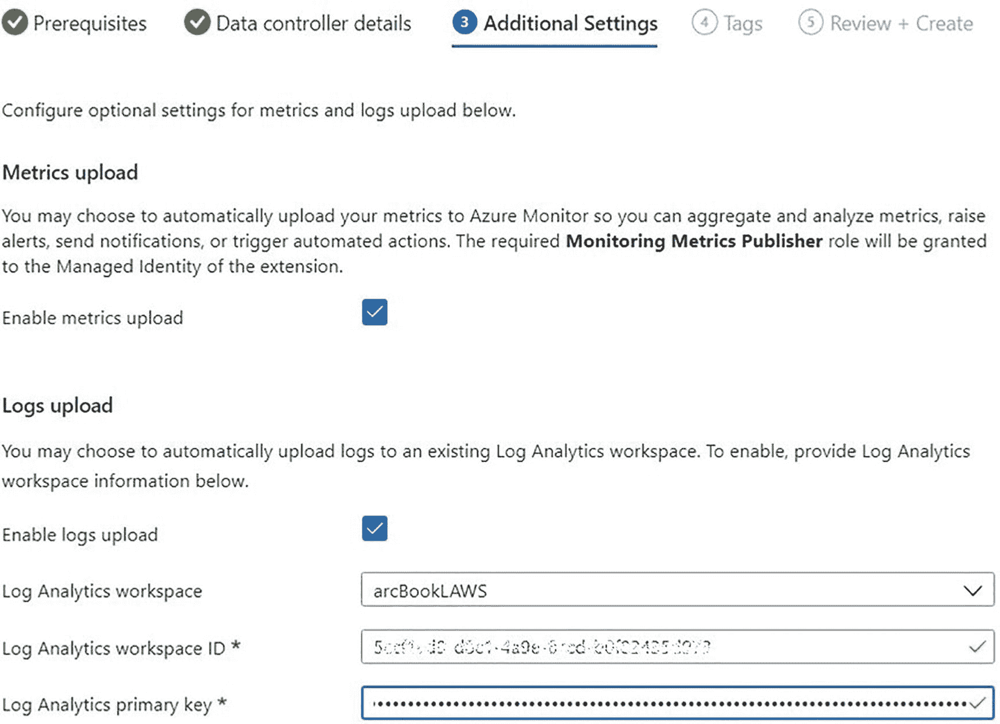

图 6-13：指标和日志上传

在最后一个配置步骤中，如图 6-14 所示，您可以为数据控制器提供标签，这在使用位于不同位置的多个控制器时尤其有用。

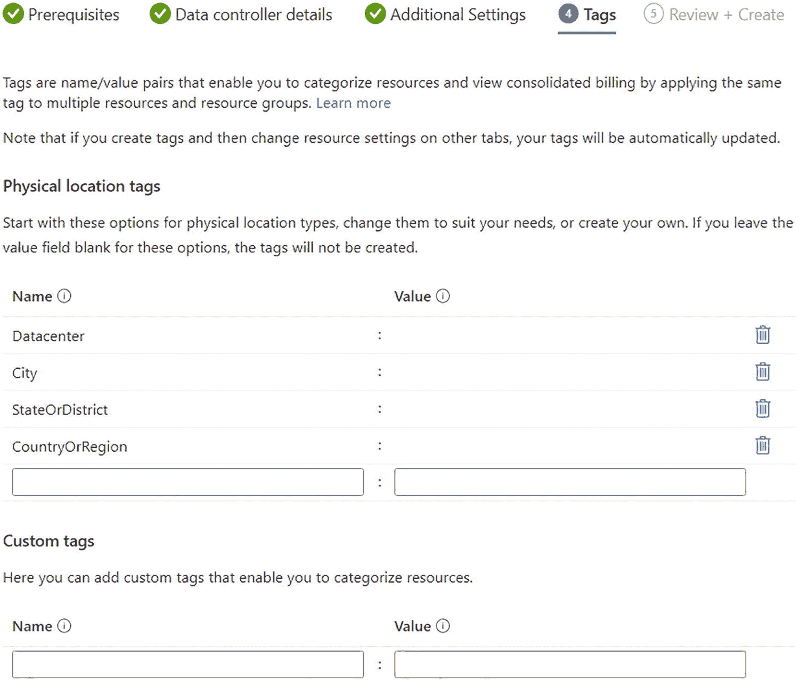

图 6-14：Azure 标签

至此，您可以完成部署并创建数据控制器，控制器会像图 6-15 所示那样返回确认信息。

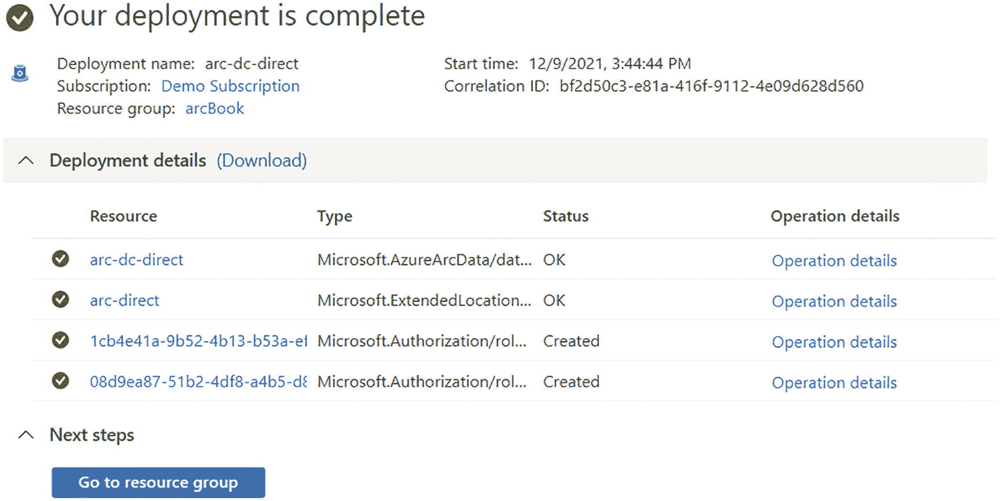

图 6-15：部署完成

我们新的 Azure Arc 数据控制器也会立即显示在我们的资源组中，如图 6-16 所示。

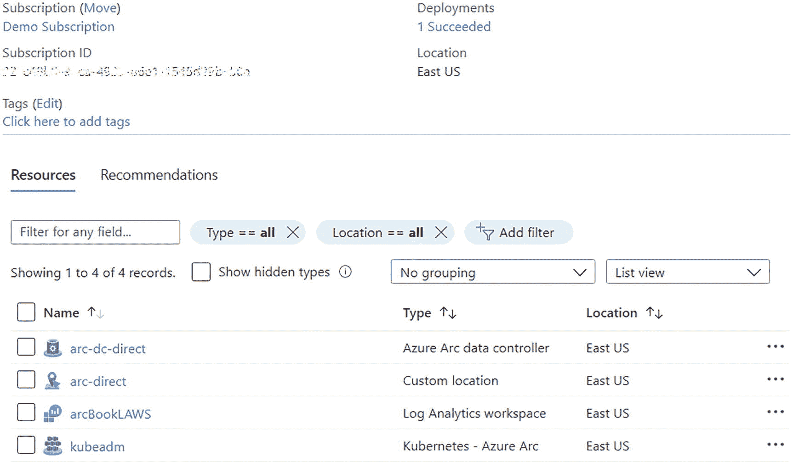

图 6-16：Azure 资源组中显示的数据控制器

然而，这仅意味着部署命令已发送到 Kubernetes 集群。我们可以使用列表 6-10 中的命令，通过 `kubectl` 监控实际的部署过程。

```
kubectl get pods -n arc-direct
```

列表 6-10：用于列出命名空间 `arc-direct` 中 Pod 的 `kubectl` 命令

如图 6-17 所示，最初的几个 Pod 已经开始与我们预先存在的引导程序一起创建。

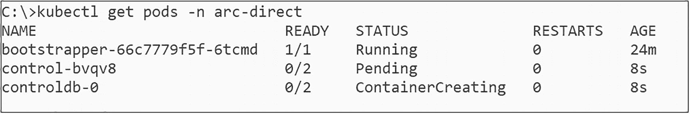

图 6-17：部署期间 `arc-direct` 命名空间中的 Pod

如果您在一段时间后重新运行列表 6-10 中的命令，您应该会看到数据控制器的所有 Pod，类似于我们上一章中间接模式部署的 Pod，如图 6-18 所示。

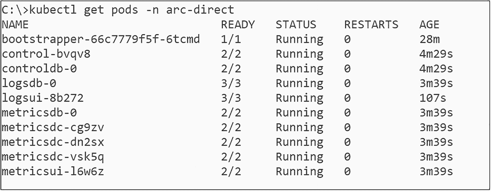

图 6-18：部署后 `arc-direct` 命名空间中的 Pod

您还可以使用列表 6-11 中的命令来验证此数据控制器的状态。

```
az arcdata dc status show --k8s-namespace arc-direct --use-k8s
```

列表 6-11：用于获取数据控制器状态的 `azure-cli` 命令

如图 6-19 所示，控制器显示为就绪状态。


图 6-19：数据控制器状态

要将此群集添加到 Azure Data Studio 中，只需使用与添加间接模式控制器相同的过程，并提供控制器的 Kubernetes 命名空间，如图 6-20 所示。

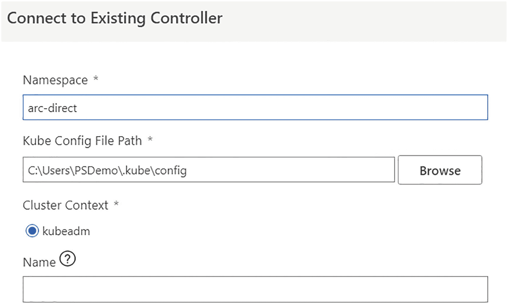

图 6-20：在 ADS 中连接现有的数据控制器

在 Azure Data Studio 中，添加控制器后，我们还可以再次验证该控制器是否处于直接连接模式（图 6-21）。

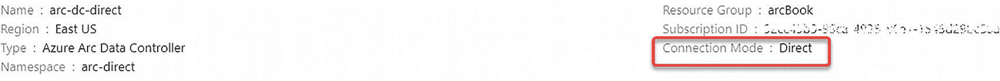

图 6-21：ADS 中的数据控制器详细信息

我们直接连接的数据控制器现在可以通过 Azure 门户、命令行和 Azure Data Studio 进行管理和访问。

## 总结与要点

本章和上一章通过部署直接或间接模式的数据控制器，让我们朝着使用首个 Arc 启用数据服务实例又迈进了一大步。

现在，让我们跨越最后的鸿沟，为在下一章中使用我们的 Arc 启用数据服务部署做一些有用的事情做好准备：向我们的控制器中部署一个 SQL 托管实例。

