# 7. 部署 Azure Arc 启用的 SQL 托管实例

我们的数据控制器已准备就绪并正在等待，我们现在可以继续开始部署第一个数据库实例，以便开始使用我们的 Arc 启用数据服务安装。

与数据控制器的部署类似，我们可以使用命令行、Azure Data Studio 中的向导或 Azure 门户来完成此操作。

**注意**
除非另有说明，我们所有的实例部署都将针对间接连接的数据控制器。


## 通过 azure-cli 进行部署

可以通过一个简单的 `azure-cli` 命令来部署一个新的 Azure Arc 启用的 SQL 托管实例，如代码清单 7-1 所示。唯一必需的参数是实例名称和 Kubernetes 命名空间。命名空间将为你创建；如果它已存在，则必须为空。

```
az sql mi-arc create -n mi-1 --k8s-namespace arc --use-k8s
代码清单 7-1
用于创建新的 Azure Arc SQL MI 的 azure-cli 命令
```

如果你查看代码清单 7-2 中用于创建常规托管实例的命令，你就能看出 Arc 命令是多么的 Azure 原生。

```
az sql mi create -n mi-1 …
代码清单 7-2
用于创建新的 Azure SQL MI 的 azure-cli 命令
```

除非你通过 `AZDATA_PASSWORD` 环境变量提供了密码，否则 `azure-cli` 会再次提示你输入密码，然后按照图 7-1 所示继续部署。

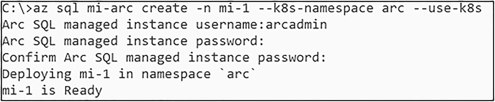

图 7-1: SQL MI 部署命令的输出

部署完成后（应该只需要几分钟），我们可以运行一个快速的 `az` 命令来列出我们所有的实例，目前就这一个，如代码清单 7-3 所示。

```
az sql mi-arc list --k8s-namespace arc --use-k8s -o table
代码清单 7-3
用于列出当前控制器中所有 SQL MI 的 azure-cli 命令
```

输出（类似于图 7-2）将包括实例的终结点、名称、状态及其副本数量。

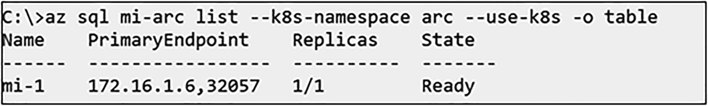

图 7-2: 当前控制器中的 SQL 托管实例列表

如果我们在 Azure Data Studio 中刷新数据控制器的管理页面，如实图 7-3 所示，该实例也会显示出来。

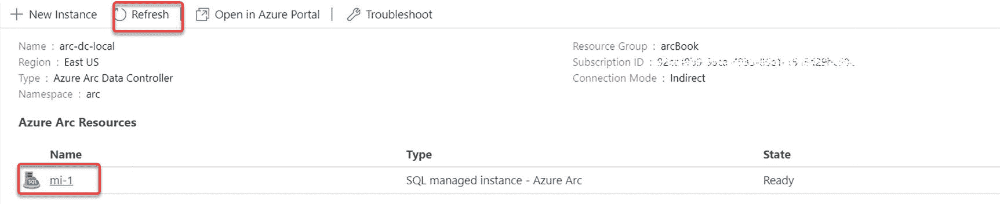

图 7-3: ADS 中的 Arc 数据控制器管理页面

点击该实例后，我们将进入实例的仪表板，它将再次显示其终结点、状态等，如图 7-4 所示。显示的外部终结点也将是你使用任何应用程序（包括 Azure Data Studio 或 SQL Server Management Studio）连接到此实例时要使用的终结点。由于这是一个基于 `kubeadm` 的 Kubernetes 集群，它将是一个 `NodePort` 类型的服务。在其他 Kubernetes 类型上可能会有所不同。例如，在 Azure Kubernetes 服务上，默认将是 `LoadBalancer` 类型的服务。

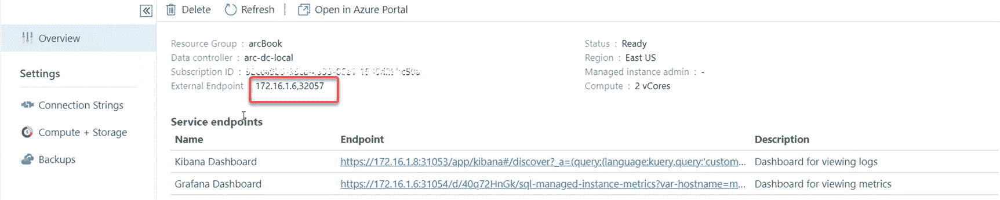

图 7-4: ADS 中的 SQL MI 管理页面

除了使用 `az` 或 Azure Data Studio，你也可以使用 `kubectl` 查看已部署的 Pod，如代码清单 7-4 所示。

```
kubectl get pods -n 
代码清单 7-4
用于列出命名空间中 Pod 的 kubectl 命令
```

结果将类似于图 7-5 中的内容。

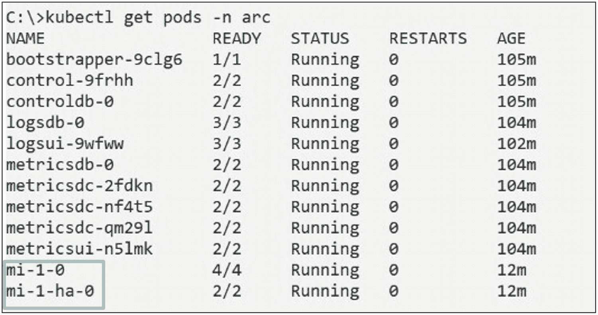

图 7-5: arc 命名空间中的 Pod

当然，在创建新的 Azure Arc 启用的 SQL 托管实例时，`azure-cli` 也接受其他参数，例如存储类。

不过，最有趣的参数之一是 `replicas`（副本数）。默认情况下，Arc SQL 托管实例将使用通用层部署，因此只有一个副本。通过提供 `--replicas` 开关，你可以将副本数增加到两个或三个，这将使你的实例使用业务关键层，并自动部署具有给定副本数的可用性组，如代码清单 7-5 所示。

```
az sql mi-arc create -n mi-2 --k8s-namespace arc --use-k8s
--storage-class-logs local-storage --storage-class-data local-storage --storage-class-datalogs local-storage --replicas 3
代码清单 7-5
带参数创建新 SQL 托管实例的 azure-cli 命令
```

关于选择合适的存储类，传统的数据库管理员存储/文件布局在这里同样适用，示例中我们仅使用了 `local-storage`。正如你在图 7-6 中看到的，我们运行了 `kubectl get pods`，这将为你的实例创建三个 Pod，而不是只有一个，每个 Pod 代表一个副本。此外，每个 Azure Arc 启用的 SQL 托管实例还附带一个 `<name>-ha-0` Pod，用于控制高可用性。

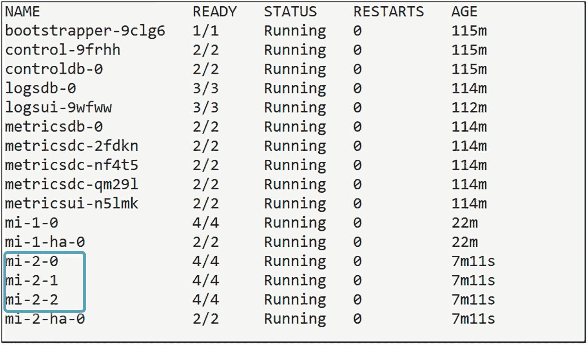

图 7-6: Arc 命名空间中的 Pod

## 通过 Azure Data Studio 进行部署

Azure Data Studio 也可用于执行完整部署。在数据控制器的仪表板上，我们可以找到一个“新建实例”按钮（见图 7-7）。

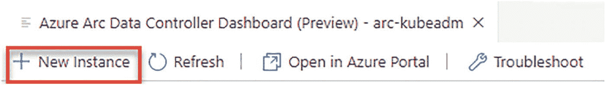

图 7-7: Azure Data Studio 中的新建实例部署按钮

这将启动另一个向导，首先会询问我们想要创建哪种类型的实例。选择 Azure SQL 托管实例，如图 7-8 所示，并接受条款。

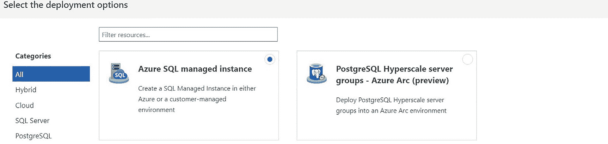

图 7-8: ADS 中的实例部署向导

接下来的屏幕将要求我们接受许可协议并检查先决条件，如图 7-9 所示。

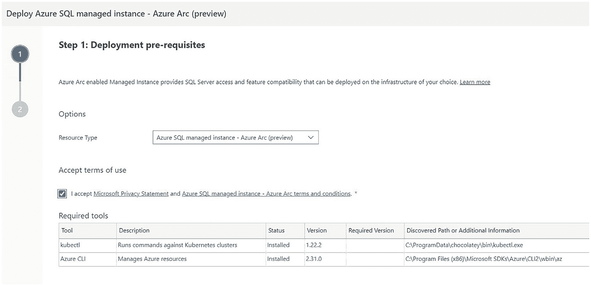

图 7-9: ADS 中的实例部署向导

随后是配置选项，例如每种数据类型的存储类，以及此实例的 CPU 和内存请求与限制（见图 7-10）。如果需要，如第 2 章所述，你可以为日志、数据和事务日志（数据日志）分配不同的存储类。

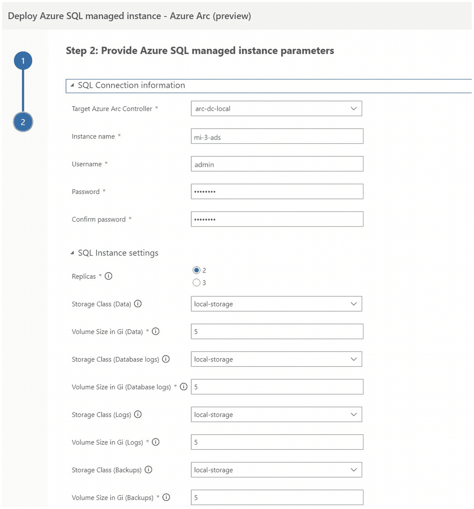

图 7-10: Azure Data Studio 中 SQL MI 部署的参数

完成此页面后，你将可以选择立即部署此实例或生成另一个笔记本（就像创建数据控制器时一样），该笔记本可以使用“全部运行”按钮来运行，如图 7-11 所示。

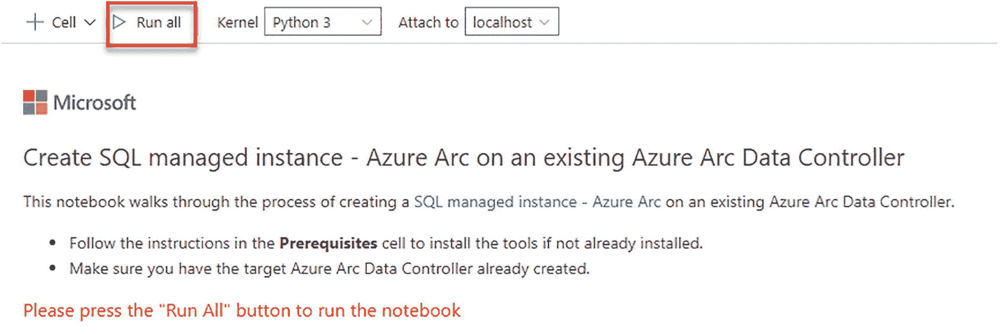

图 7-11: 触发 SQL MI 部署的“全部运行”按钮

在部署运行期间，我们可以通过刷新数据控制器的状态页（见图 7-12）看到实例正在创建中。

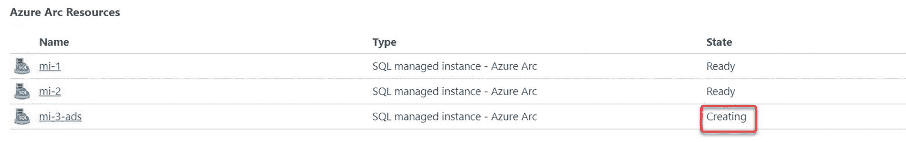

图 7-12: 新 SQL MI 在 Azure Data Studio 中显示为“正在创建”

或者，我们也可以再次使用 `kubectl get pods --watch` 来监控进度（见图 7-13）。

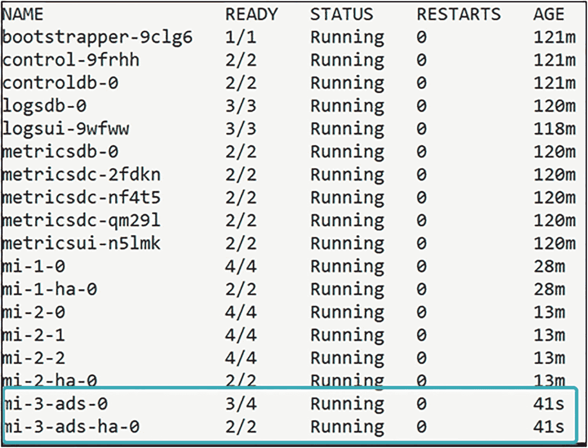

图 7-13: Kubernetes Pod 列表的输出

部署完成后，实例即可使用。


### 通过 Kubernetes 工具部署

由于 Azure Arc 支持的数据服务不仅是 Azure 原生，同时也是 Kubernetes 原生的，因此它们也可以通过 Kubernetes 工具进行部署，例如 `kubectl` 和 YAML 清单文件。

代码清单 7-6 为我们描述了一个 SQL 托管实例的 YAML 清单。

```
apiVersion: sql.arcdata.microsoft.com/v2
kind: SqlManagedInstance
metadata:
  name: mi-4
spec:
  security:
    adminLoginSecret: mi-4-login-secret
  scheduling:
    default:
      resources:
        limits:
          cpu: "2"
          memory: 4Gi
        requests:
          cpu: "1"
          memory: 2Gi
  services:
    primary:
      type: NodePort
  storage:
    backups:
      volumes:
      - className: local-storage
        size: 5Gi
    data:
      volumes:
      - className: local-storage
        size: 5Gi
    datalogs:
      volumes:
      - className: local-storage
        size: 5Gi
    logs:
      volumes:
      - className: local-storage
        size: 5Gi
```
代码清单 7-6
Arc SQL 托管实例的 YAML 清单

由于我们还需要对托管实例进行身份验证，因此需要将用户名和密码存储在 Kubernetes 密钥中。我们可以使用代码清单 7-7 中的 `kubectl` 命令来创建这个 Kubernetes 密钥。

```
kubectl create secret generic mi-4-login-secret `
--from-literal=password= `
--from-literal=username= `
-n arc
```
代码清单 7-7
用于创建 Kubernetes 密钥的 `kubectl` 命令

完成后，我们可以使用 `kubectl` 和我们的清单文件来创建实例（代码清单 7-8）。

```
kubectl apply -f mi-4.yaml -n arc
```
代码清单 7-8
使用 `kubectl` 命令从 YAML 创建 SQL 托管实例

如图 7-14 所示，这同样会在我们的 Arc 命名空间中为我们创建一个托管实例。

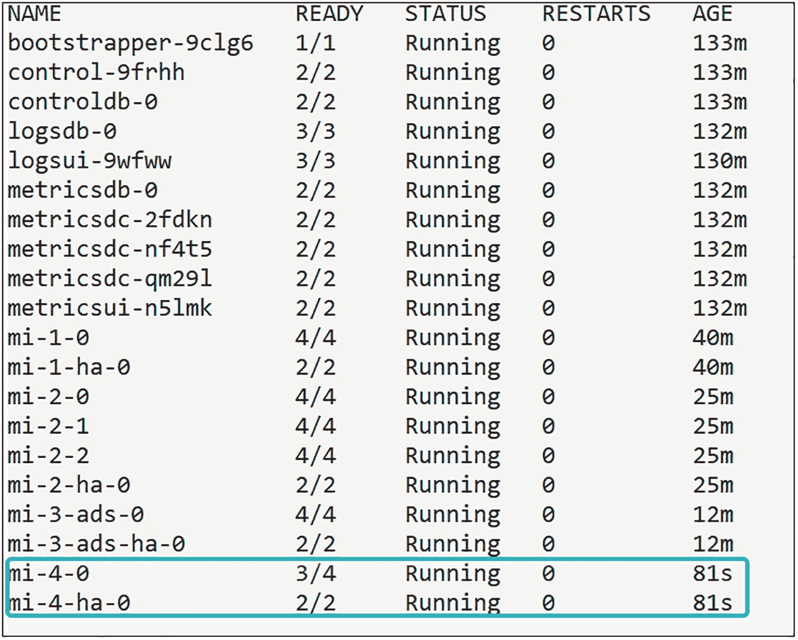
图 7-14
Kubernetes 命名空间中的 Arc Pod

### 通过 Azure 门户部署

另一种部署 Arc 实例的方式是通过 Azure 门户。

注意
通过 Azure 门户部署需要如前一章所示的直接连接集群。

导航到 Azure 门户中的“创建资源”部分：[*https://portal.azure.com/#create/hub*](https://portal.azure.com/%2523create/hub)。

从那里，搜索“arc sql managed instance”，如图 7-15 所示。

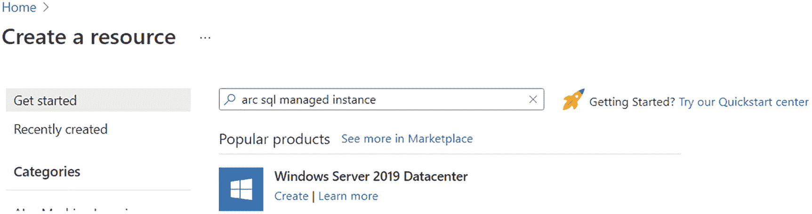
图 7-15
Azure 门户 – 创建资源

选择显示的唯一结果（图 7-16）。

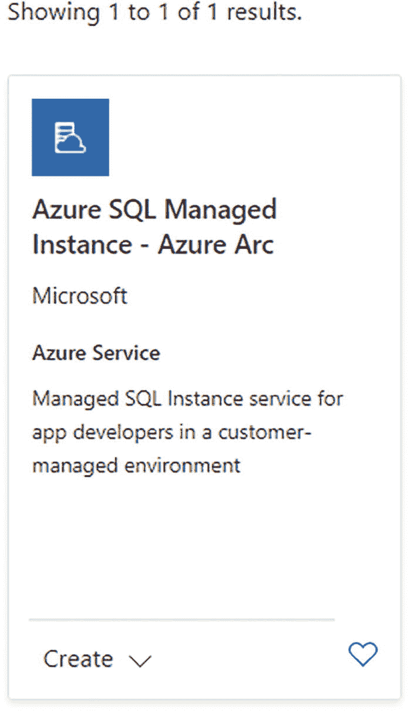
图 7-16
Azure 门户 – 创建 Azure SQL 托管实例 - Azure Arc

并在后续屏幕（图 7-17）上单击“创建”。


图 7-17
Azure 门户 – 创建 Azure SQL 托管实例 - Azure Arc

在第一个屏幕上，您需要提供基本信息，如要使用的订阅和资源组，以及实例名称和自定义位置（图 7-18）。

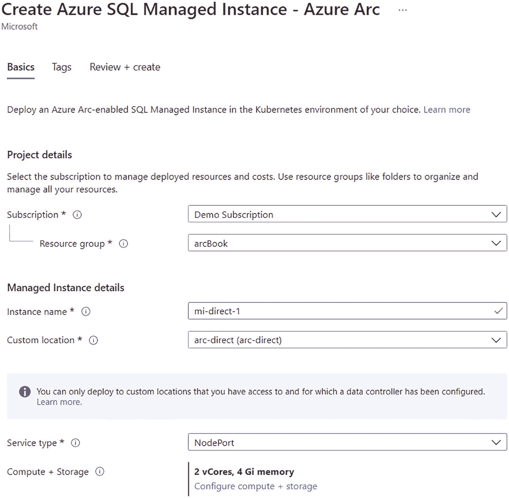
图 7-18
Azure 门户 – 创建 Azure SQL 托管实例 - Azure Arc – 基本信息

在“配置计算 + 存储”页面（图 7-19）上，您不仅可以定义存储类、请求和限制，还可以在此处选择服务层级，从而决定副本数量。根据这些设置，系统还会提供预估成本。

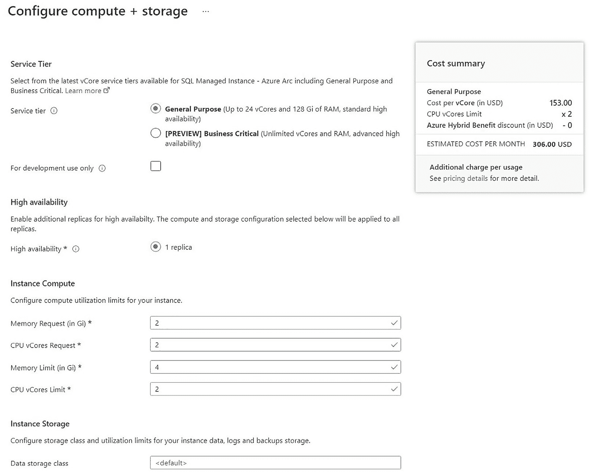
图 7-19
Azure 门户 – 创建 Azure SQL 托管实例 - Azure Arc – 配置计算 + 存储

您需要输入的最后信息（参见图 7-20）是管理员账户的用户名和密码。

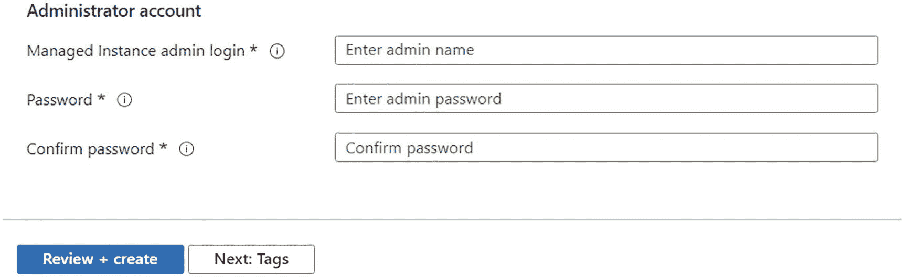
图 7-20
Azure 门户 – 创建 Azure SQL 托管实例 - Azure Arc – 管理员账户

除非您想为此实例提供任何 Azure 标签，否则您可以直接转到“查看 + 创建”屏幕并部署您的实例，如图 7-21 所示。

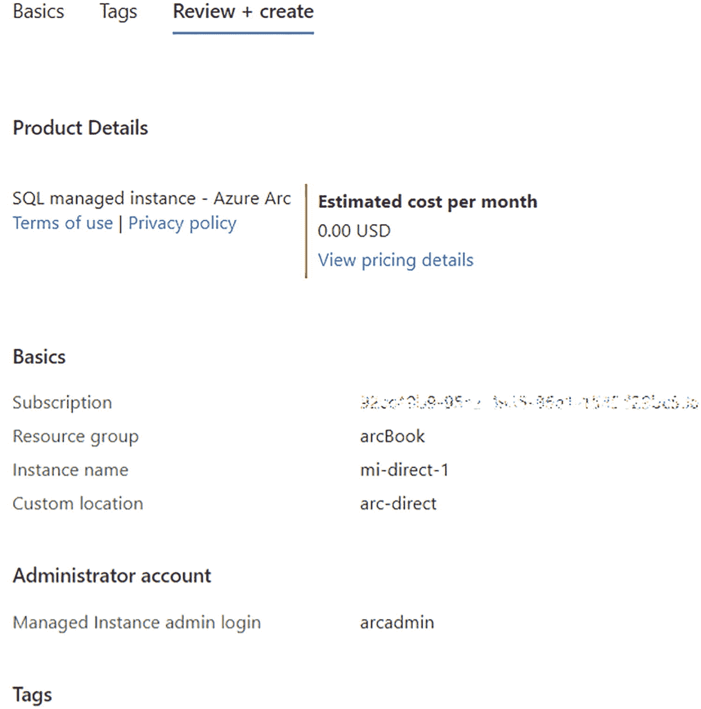
图 7-21
Azure 门户 – 创建 Azure SQL 托管实例 - Azure Arc – 查看 + 创建

部署后，实例将立即显示在您的资源组中（图 7-22）。

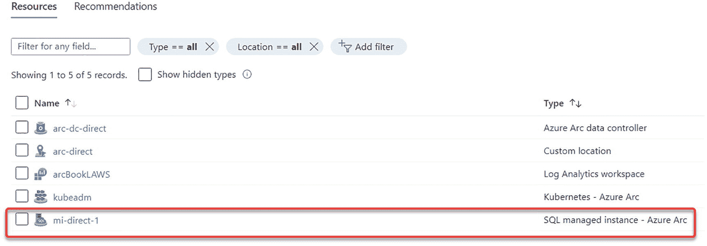
图 7-22
Azure 资源组中的 SQL 托管实例

然而，实际部署当然发生在我们本地的 Kubernetes 集群上，因此请使用代码清单 7-9 中的命令检查 Arc 命名空间中的 Pod。

```
kubectl get pods -n arc-direct
```
代码清单 7-9
列出命名空间中的 Pod

您将看到新的托管实例确实已在此集群和此命名空间中创建，如图 7-23 所示。

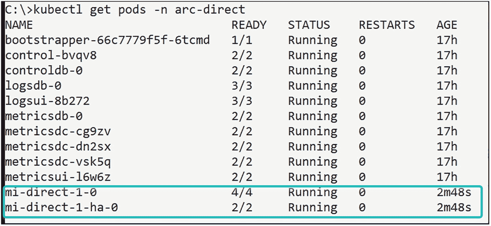
图 7-23
Kubernetes 命名空间中的 Arc Pod

## Active Directory 身份验证

在撰写本文时，Active Directory 身份验证仍处于预览阶段。您可以在官方文档中找到最新的分步指南：[*https://docs.microsoft.com/en-us/azure/azure-arc/data/active-directory-introduction*](https://docs.microsoft.com/en-us/azure/azure-arc/data/active-directory-introduction)。

## 将数据导入实例

如果您想在实例中还原现有数据库，在大多数情况下，第一步是将此数据库的备份复制到您的容器中——或者更准确地说，复制到容器背后的存储中。由于 Arc SQL 托管实例是 SQL Server 的直接迁移版本，要将数据导入 Arc SQL 托管实例，您可以简单地使用标准的 SQL Server 备份。

### 将备份文件复制到实例中

与常见情况一样，将备份文件导入 Arc SQL 托管实例有多种方法，我们将再次为您提供一些选项。如果您有一个可以通过 HTTP 下载的备份文件，您可以使用 `kubectl` 在容器中触发 `wget` 下载（参见代码清单 7-10）。

```
kubectl exec mi-1-0 -n arc -c arc-sqlmi -- wget https://github.com/Microsoft/sql-server-samples/releases/download/adventureworks/AdventureWorks2019.bak -O /var/opt/mssql/data/AdventureWorks2019.bak
```
代码清单 7-10
在容器内使用 `wget` 下载文件的代码

另一方面，如果您有一个本地备份文件，也可以使用 `kubectl` 将其复制到容器，如代码清单 7-11 所示。

```
kubectl cp c:\files\AdventureWorks2017.bak arc/arc-mi-01-0:var/opt/mssql/data/AdventureWorks2017.bak -c arc-sqlmi
```
代码清单 7-11
将本地文件复制到容器的代码

这两种技术都能使备份文件位于您的容器中。请确保容器中有足够的磁盘空间，并在完成后删除备份文件。通常取决于您的备份最初来自何处，以决定哪种方式对您更有意义。


### 在实例中还原备份文件

如果你希望从命令行进行还原，可以直接在客户端使用类似 `sqlcmd` 的工具，或者再次使用 `kubectl` 在 SQL 实例上直接运行 `sqlcmd`，如清单 7-12 所示。

```
kubectl exec mi-1-0 -n arc -c arc-sqlmi -- /opt/mssql-tools/bin/sqlcmd -S localhost -U arcadmin -P "P@ssw0rd" -Q "RESTORE DATABASE [AdventureWorks2019] FROM  DISK = N'/var/opt/mssql/data/AdventureWorks2019.bak' WITH  FILE = 1,  MOVE N'AdventureWorks2017' TO N'/var/opt/mssql/data/AdventureWorks2019.mdf',  MOVE N'AdventureWorks2017_log' TO N'/var/opt/mssql/data-log/AdventureWorks2019_log.ldf',  NOUNLOAD,  STATS = 5"
```
清单 7-12
在容器内运行 sqlcmd 以从备份还原数据库的代码

你也可以连接到 Azure Data Studio 中的实例，并使用还原向导或任何其他可以连接到 SQL 端点的工具。

**注意**
当连接到使用非默认端口的 SQL Server 时，在复制端点信息，请确保使用**逗号**而不是冒号来分隔 IP 地址和端口。

当然，另一个选择是使用 `RESTORE FROM URL` 命令从 Azure Blob 存储还原数据库。除此之外，你还可以添加一个持久卷，它可以是一个外部共享或专用的备份磁盘，这对于较大的备份和还原操作尤其有意义，可以避免使容器存储膨胀或需要四处复制备份文件。

### 托管备份与还原

每个启用 Azure Arc 的 SQL 托管实例都附带一个内置的自动备份功能，默认启用。这意味着每个创建或还原的数据库都将自动接收一个初始完整备份，然后是按计划进行的差异备份和事务日志备份。这个概念与 Azure SQL 托管实例中的托管备份非常相似，允许你在保留期内的任何特定时间点执行时间点还原。

还原操作将始终执行到一个新的数据库中。

在撰写本文时，完整备份每周进行一次，差异备份每 12 小时进行一次，事务日志备份每 5 分钟进行一次，这些设置不可配置。

虽然所有备份设置都可以通过 `azure-cli` 和原生 Kubernetes 工具找到并控制，但最简单的入门方法是使用 Azure Data Studio 中实例设置的备份部分，如图 7-24 所示。

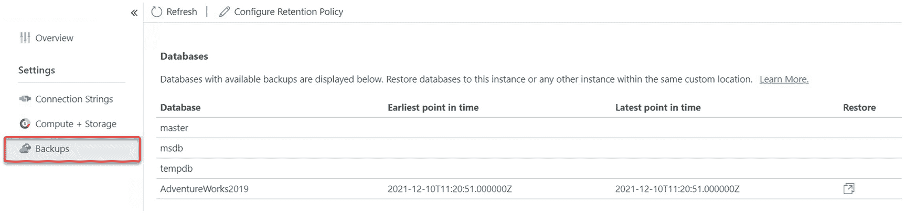
图 7-24
备份设置

从那里，你可以更改时间点恢复备份的保留时间（图 7-25），从其默认值（7 天）更改为 1 到 35 天之间的任何值。超过配置保留期的备份文件将被自动删除。

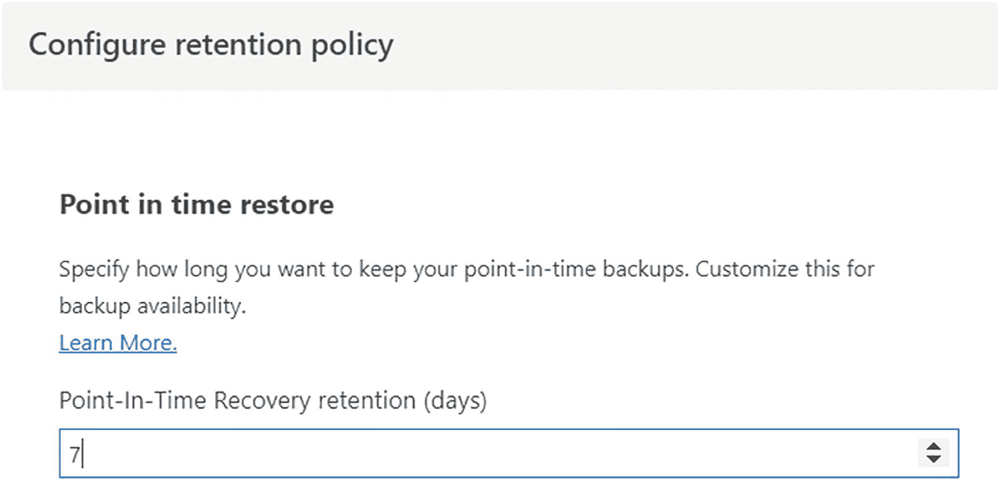
图 7-25
配置保留策略

将保留时间更改为零将禁用此实例上的托管备份。

你也可以通过编辑实例的 YAML 清单或在 `azure-cli` 中指定 `--retention-days` 属性来调整该设置。

你还可以使用 Azure Data Studio 或其他任何工具来触发还原（参见图 7-26）。

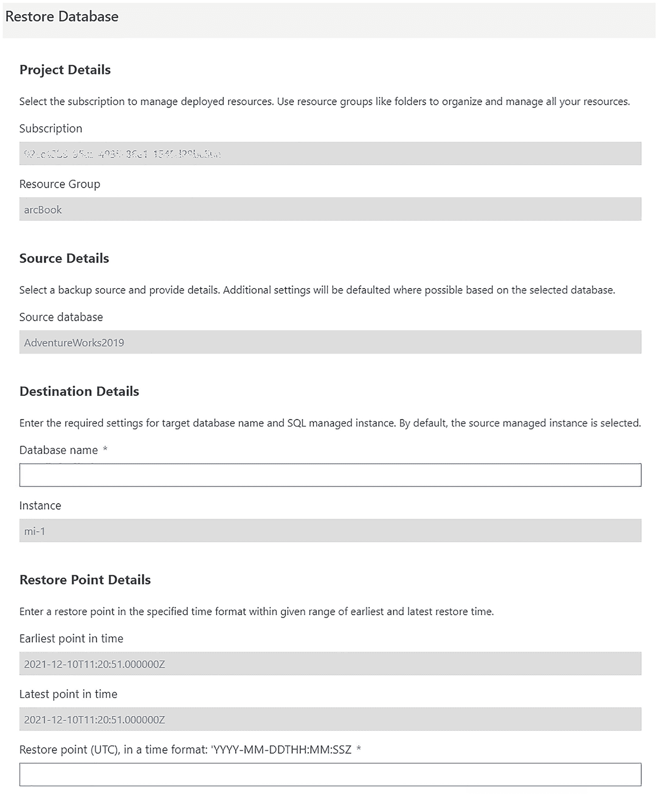
图 7-26
在 Azure Data Studio 中还原数据库

还原操作需要指定源数据库、目标数据库和还原点（时间戳）。

或者，你也可以使用 `azure-cli` 和类似于清单 7-13 中的命令来还原备份。

```
az sql midb-arc restore --managed-instance  --name  --dest-name  --k8s-namespace  --time "YYYY-MM-DDTHH:MM:SSZ" --use-k8s
```
清单 7-13
用于从时间点备份还原数据库的 azure-cli 命令

目标 MI 在运行还原之前必须存在。当你删除一个 Azure Arc SQL 托管实例时，备份历史记录将被保留，直到其保留期届满。清单 7-13 的输出应类似于图 7-27 中的内容。重要的部分是状态。如果此处未显示 `Completed`，则表示还原操作出现问题。

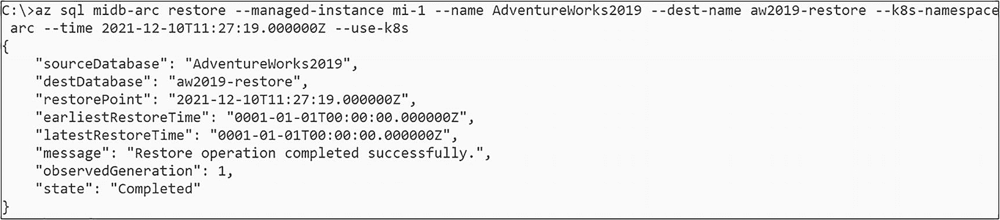
图 7-27
用于还原数据库的 azure-cli 命令的输出

你可以通过运行清单 7-14 所示的命令，获取命名空间中所有还原任务的概览。

```
kubectl get sqlmirestoretask -n arc
```
清单 7-14
用于列出命名空间中所有 SQL MI 还原任务的 kubectl 命令

如果一切顺利，任务应以“已完成”状态显示，如图 7-28 中的示例所示。

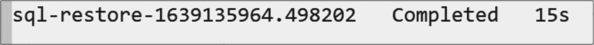
图 7-28
SQL MI 还原任务的状态

要获取更多详细信息，尤其是在还原任务失败的情况下，你可以使用清单 7-15 中的命令来描述任务并分析失败原因。

```
kubectl describe sqlmirestoretask  -n
```
清单 7-15
用于描述 SQL MI 还原任务的 kubectl 命令

当然，还原后的数据库也会在 Azure Data Studio 中可见，如图 7-29 所示。

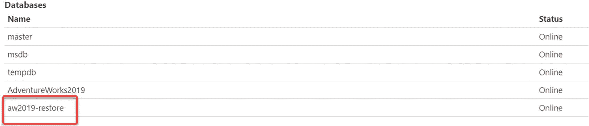
图 7-29
在 Azure Data Studio 中显示的已还原数据库

当然，也可以通过原生 Kubernetes 工具创建还原任务，就像你也可以从那里调整保留策略等设置一样。


## 删除已部署的托管实例

如果要删除已部署的现有托管实例，可以通过其在 Azure Data Studio 中的管理页面进行操作，如图 7-30 所示。

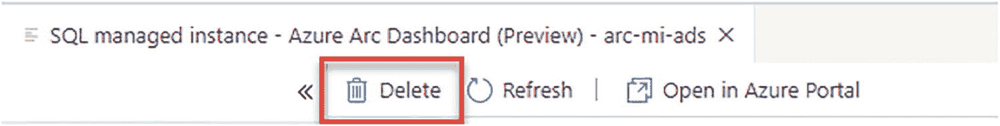

图 7-30

ADS 中现有 SQL MI 的删除按钮

在实例被删除之前，系统会提示您确认，需要键入实例的名称（参见图 7-31）。

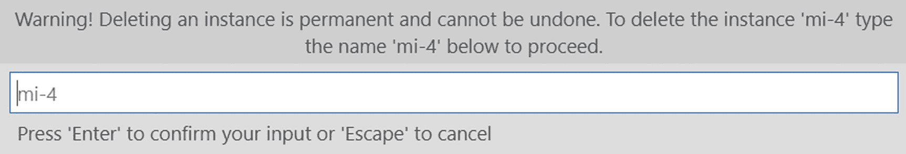

图 7-31

在 ADS 中删除现有 SQL MI 的确认对话框

或者，您可以使用另一个 `az` 命令，如清单 7-16 所示。

```
az sql mi-arc delete -n  -k arc --use-k8s
清单 7-16
用于删除现有 SQL MI 的 azure-cli 命令
```

此后，很快会收到一条确认消息，类似于图 7-32 中的内容。

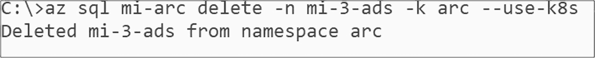

图 7-32

删除现有 SQL MI 命令的输出

注意

通过 CLI 删除实例时，不会出现额外的提示或警告。

删除实例时，只会移除其 Pod，而不会删除实例所使用的存储（持久卷声明，Persisted Volume Claims）。要同时删除这些存储，我们必须先使用 `kubectl` 识别受影响的 PVC，如清单 7-17 所示。

```
kubectl get pvc -n  -l  -o name
清单 7-17
基于标签列出实例 PVC 的 kubectl 命令
```

这将返回此实例使用的 PVC 列表（参见图 7-33）。此命名方案取决于所使用的存储供给器。我们示例中的名称来自本地存储供给器，因此如果您使用不同的存储子系统，您的名称可能看起来不同。

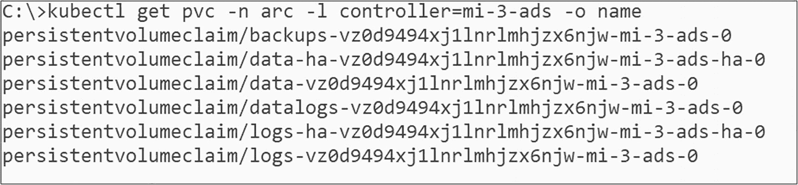

图 7-33

实例的 PVC 列表

使用这些 PVC 的名称，然后我们可以使用另一个 `kubectl` 命令（参见清单 7-18）来删除它们。

```
kubectl delete pvc -n  -l  -o name
清单 7-18
基于标签删除 PVC 的 kubectl 命令
```

删除操作也会得到 `kubectl` 的确认，当回头检查此实例是否还有任何剩余声明时，我们可以从图 7-34 中看出，不应再有任何遗留。

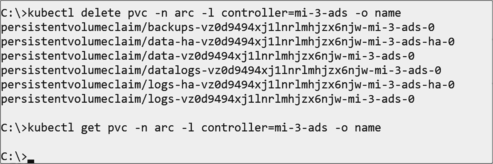

图 7-34

检查所有 PVC 是否已删除的输出

## 总结与要点回顾

在本章中，我们构建 Kubernetes 集群和数据控制器的努力得到了回报，因为我们能够使用 Azure Arc 启用的 SQL 托管实例在 Arc 中部署和使用第一个实际的数据服务。

在下一章中，我们将了解在部署 Azure Arc 启用的 PostgreSQL 超大规模实例时，此过程是什么样子。

