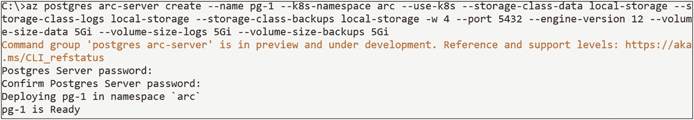
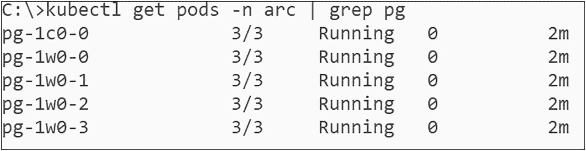
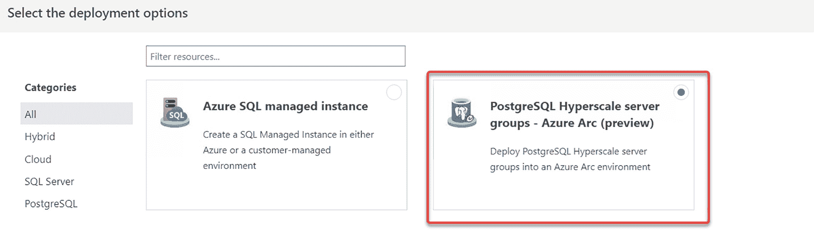
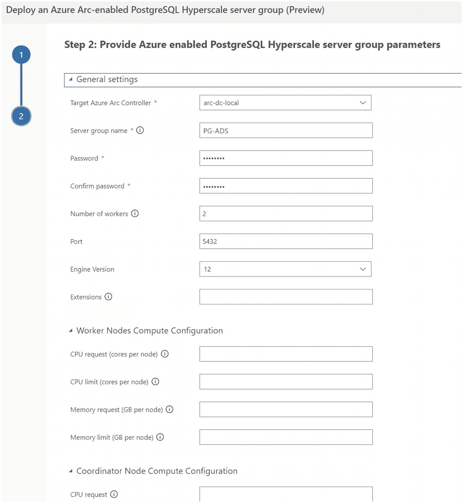
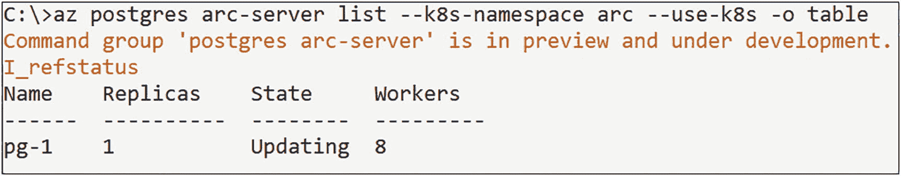
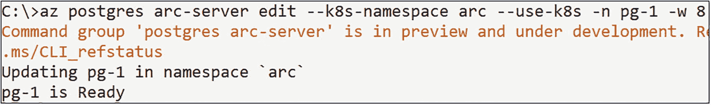
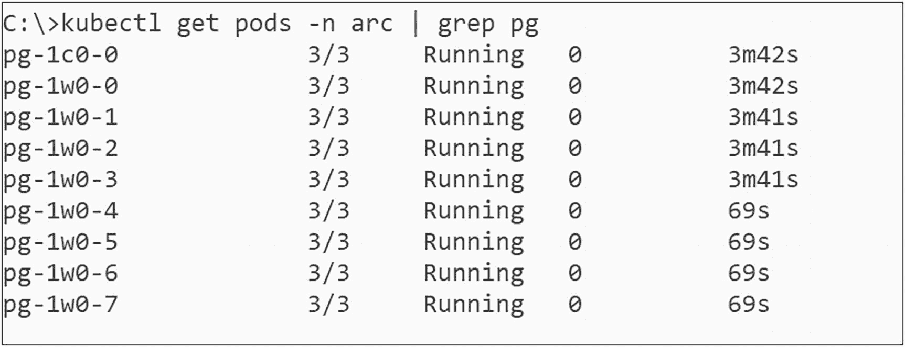
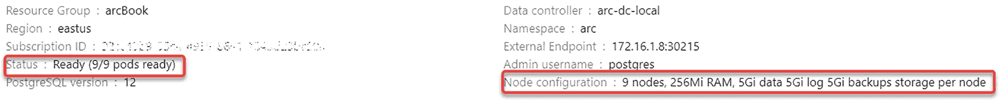
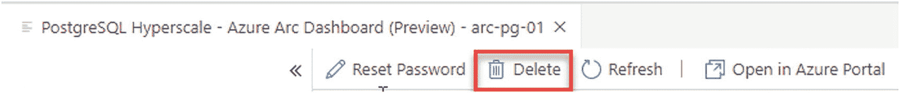

# 8. 部署 Azure Arc 启用的 PostgreSQL 超大规模实例

第 7 章处理的是 Azure Arc 启用的 SQL 托管实例，本章将指导我们完成在处理 PostgreSQL 超大规模实例时所需的步骤。

## 通过命令行部署

与 Azure Arc 启用的 SQL 托管实例一样，一个新的 PostgreSQL 超大规模服务器组可以通过一个简单的 `az` 命令进行部署，如清单 8-1 所示。唯一必需的参数是服务器组的名称。

```
az postgres arc-server create --name pg-1 --k8s-namespace arc --use-k8s
清单 8-1
用于创建新的 PostgreSQL 超大规模服务器组的 azure-cli 命令
```

注意

关于使用直接模式与间接模式以及 `--use-k8s` 开关的逻辑，与 SQL 托管实例的情况相同。

尽管如此，如果您愿意，您仍然可以通过命令行开关完全控制部署的设置，如清单 8-2 所示。

```
az postgres arc-server create --name pg-2 `
--k8s-namespace arc --use-k8s `
--storage-class-data local-storage `
--storage-class-logs local-storage `
--storage-class-backups local-storage `
--workers 4 --port 5432 --engine-version 12 `
--volume-size-data 5Gi --volume-size-logs 5Gi `
--volume-size-backups 5Gi
清单 8-2
带参数的用于创建新的 PostgreSQL 超大规模服务器组的 azure-cli 命令
```

无论哪种方式，`azure-cli` 都会提示您输入密码，除非您已经通过 `AZDATA_PASSWORD` 环境变量提供了密码，然后将继续进行部署，如图 8-1 所示。每个 PostgreSQL 超大规模服务器组都有一个名为 `postgres` 的默认管理账户用户名，该名称不可配置。



图 8-1

PostgreSQL 超大规模服务器组部署命令的输出

除此之外，与 SQL 托管实例的部署没有区别。

控制节点和工作节点显示为使用 `kubectl` 的独立 Pod（参见图 8-2）。这些节点独立于 Kubernetes 节点！



图 8-2

Postgres Pod

## 通过 Azure Data Studio 部署

当然，通过 Azure Data Studio 部署也是一个选项。在如图 8-3 所示的向导中，只需选择 PostgreSQL 选项即可。



图 8-3

ADS 中的实例部署向导

下一个屏幕将再次检查先决条件，然后（参见图 8-4）收集特定于 PostgreSQL 超大规模服务器组的设置。就像之前部署 SQL 托管实例一样，我们需要为这个 PostgreSQL 超大规模服务器组提供一个名称和一个密码。用户名默认为 `postgres`，因此此设置不是必需的。PostgreSQL 超大规模服务器组要求您提供工作节点的数量。默认值为 0，这将部署一个单节点的 PostgreSQL 超大规模服务器组、TCP 端口，以及您的存储类、存储大小和 CPU 与内存请求及限制。正如我们在第 1 章中提到的，这些设置将定义此特定部署将在您的 Kubernetes 集群上分配多少资源。



图 8-4

特定于 Postgres 的设置

这将导致可以选择立即部署此服务器组，或者创建一个笔记本，该笔记本在运行时将创建新的服务器组。


## 服务器组的横向扩展

如果您想通过添加更多工作节点来横向扩展一个现有的服务器组，这可以——您猜对了——通过另一个简单的 `azure-cli` 命令来实现，类似于列表 8-3 中的命令。

```
az postgres arc-server edit --k8s-namespace arc --use-k8s -n pg-1 -w 8
列表 8-3
用于修改服务器组工作节点数量的 azure-cli 命令
```

这将更新现有的服务器组，同时保持其在线，因此服务对于查询仍然可用。一旦 Postgres 工作节点准备就绪，数据将由 Hyperscale 分片再平衡器自动重新分配到这些新节点上。

在更新运行期间，受影响的服务器组在服务器列表中将显示为“正在更新”（参见列表 8-4 和图 8-5）。



图 8-5

当前控制器中的 PostgreSQL Hyperscale 服务器组列表

```
az postgres arc-server list --k8s-namespace arc --use-k8s -o table
列表 8-4
用于列出当前控制器中所有 PostgreSQL Hyperscale 服务器组的 azure-cli 命令
```

用于重新调整组规模的编辑命令将在更新完成且新工作节点准备就绪后报告结果，如图 8-6 所示。



图 8-6

服务器组成功重新扩展后的输出

新的工作节点会显示为独立的 Pod（使用 `kubectl`，见图 8-7），与现有的控制节点和工作节点并存。



图 8-7

Postgres 工作 Pod

这一变化也反映在 Azure Data Studio 中服务器组的管理页面上，如图 8-8 所示。如您所见，这也显示了五个节点的配置——同样是我们 PostgreSQL Hyperscale 服务器组中的控制器和四个工作节点。



图 8-8

PostgreSQL Hyperscale 服务器组管理页面

注意
工作节点的数量只能向上扩展；您无法缩减现有的组！为此，您需要部署一个新的服务器组并备份/恢复您的数据。

## 移除已部署的服务器组

要移除已部署的 Postgres 服务器组，您可以使用列表 8-5 中所示的 `az` 命令。

```
az postgres arc-server delete --k8s-namespace arc -n pg-1 --use-k8s
列表 8-5
用于删除现有 PostgreSQL Hyperscale 服务器组的 azure-cli 命令
```

或者，您也可以从 Azure Data Studio 中组的仪表板删除该组，如图 8-9 所示。



图 8-9

在 ADS 中删除现有 PostgreSQL Hyperscale 服务器组的按钮

两种方式都可以用来删除现有的实例。

注意
就像我们的 SQL 托管实例一样，删除服务器组不会删除其持久卷声明。一旦您确定不再需要数据，您将需要再次通过 `kubectl` 手动删除这些声明。

## 总结与关键要点

到目前为止，我们已经了解了 Azure Arc 启用的数据服务的概念和产品，并向其部署了不同的数据实例。在接下来的最后一章中，我们将探讨如何管理和监控我们服务的性能，如何分析其日志文件，以及如何将其升级到新版本。

