# 9. 监控与管理

到目前为止，我们已经介绍了 Azure Arc 启用的数据服务的架构以及部署它们所需的步骤。

在这最后一章中，我们将重点介绍如何通过利用本地管理服务以及 Azure 的管理功能来监控您的 Azure Arc 启用的数据服务，以及如何升级现有安装。

## 通过数据控制器进行监控

监控 Azure Arc 启用的数据服务的一种方式是通过两个内置仪表板：Grafana 仪表板和 Kibana 仪表板。当您没有常规或稳定的连接允许您定期将遥测数据同步到 Azure 门户时，使用内置仪表板特别方便。正如我们在第 2 章中提到的，这些将在部署数据控制器时本地部署到您的 Kubernetes 集群。

### 获取端点

要获取仪表板的 URL，您需要获取它们的端点。您可以通过 `az` 使用列表 9-1 中的命令来获取。

```
az arcdata dc endpoint list -o table -k arc
列表 9-1
用于检索控制器端点列表的 azure-cli 命令
```

或者，Azure Data Studio 中每个数据实例的管理页面都将有一个深度链接，指向该实例预过滤的仪表板，如图 9-1 所示。

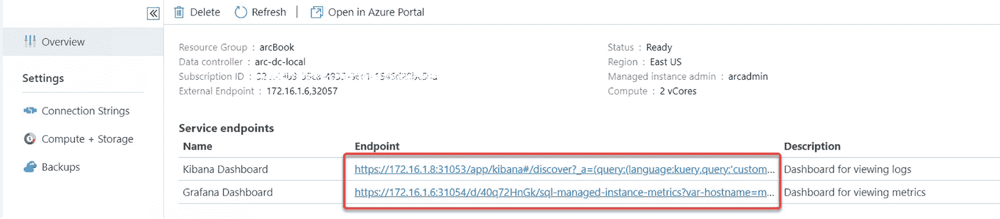

图 9-1

ADS 中其管理页面上 Arc SQL 托管实例的门户端点

### 指标（Grafana 仪表板）

Grafana 门户提供有关其实例状态的指标和洞察。登录门户的凭据与您在 Azure Data Studio 中连接到集群时使用的凭据相同。

如图 9-2 所示的 SQL 托管实例指标提供了 SQL Server 特定的性能指标，其中许多是 DBA 已经熟悉的。

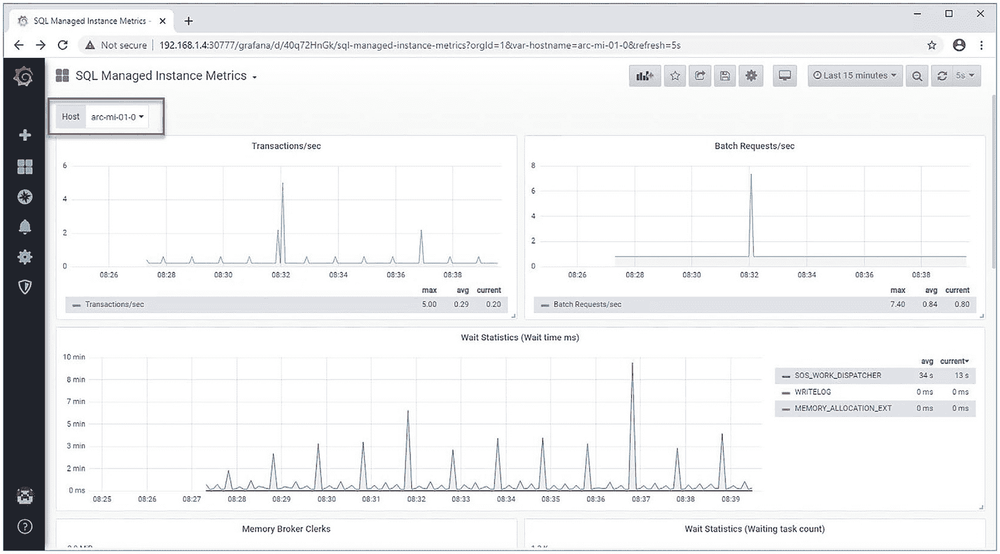

图 9-2

Grafana 门户 – SQL MI 指标

统计数据展示了等待时间、按等待类型排序的等待任务数量、每秒事务和请求数以及其他有价值的指标。它们有助于了解集群内特定 SQL MI 的状态，该状态可以在屏幕左上方选择。

当前在预配置的 Grafana 门户中可用的其他仪表板如图 9-3 所示。

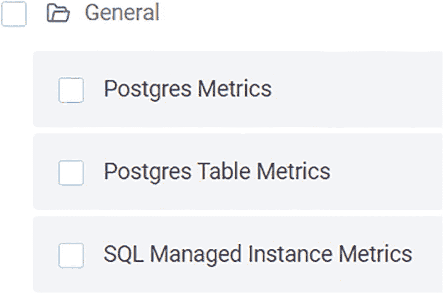

图 9-3

Grafana 门户中的内置仪表板

### 日志搜索分析（Kibana）

另一方面，如图 9-4 所示的 Kibana 仪表板，让您能够深入了解所选实例的 Kubernetes 日志文件。

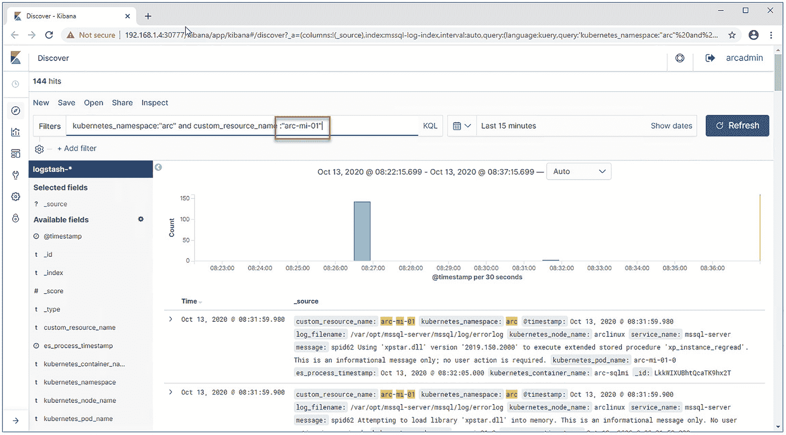

图 9-4

Kibana 门户 – 概述

Kibana 是 Elastic Stack 的一部分。它还提供选项，可在您的日志文件之上创建可视化效果和仪表板。如果您想了解更多关于它的信息，其网站 [www.elastic.co/products/kibana](http://www.elastic.co/products/kibana) 是一个很好的起点！

## 通过 Azure 门户进行监控

Arc 的优势之一是能够通过单一管理界面管理您的整个资产，如果您的连接允许，我们强烈建议将您的部署链接到 Azure 门户。这不会剥夺您使用 Grafana 和 Kibana 的选项，因此请将其视为一个非常有价值的附加功能。

### 直接连接模式

在直接连接模式下，您的日志文件和指标默认会自动上传并同步到 Azure 门户。

### 间接连接模式

在间接连接模式下，您需要先将集群日志和指标导出到一个文件，然后定期上传此文件。如果需要，这个过程也可以计划和自动化，以确保您的遥测数据定期与 Azure 门户同步。


### 准备上传

运行上传的第一个要求是拥有一个服务主体，你可以使用清单 9-2 中的命令来创建它。

```
az ad sp create-for-rbac --name http://arc-log-analytics
清单 9-2
用于创建新服务主体的 azure-cli 代码
```

注意

服务主体的名称无关紧要。我们选择 "arc-log-analytics" 只是为了让名称反映其用途。

创建服务主体后，你会收到一些 JSON 格式的返回值。后续步骤中你需要用到其中的一些值。输出结果应与图 9-5 中的类似。

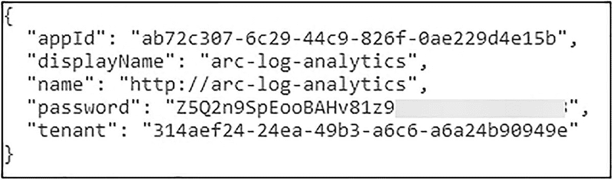

图 9-5

服务主体创建的输出结果

接下来，我们需要将这个新主体分配到 `Monitoring Metrics Publisher` 角色，这可以使用清单 9-3 中的代码完成。请确保将 `appId` 替换为上一个 JSON 中的 `appId value`，并将 subscription 替换为你的 `subscription ID`。

```
az role assignment create --assignee  --role "Monitoring Metrics Publisher" --scope subscriptions/
清单 9-3
用于将服务主体分配到角色的 azure-cli 代码
```

这将产生一个 JSON 输出，类似于图 9-6，不过这个输出在后面同样不需要用到。

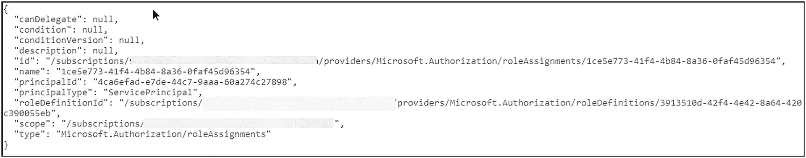

图 9-6

清单 9-3 的输出

在下一步中，我们使用清单 9-4 创建一个 Log Analytics 工作区。

```
az monitor log-analytics workspace create -g  -n UniqueLogAnalytics
清单 9-4
用于创建 Log Analytics 工作区的 azure-cli 代码
```

注意

与服务主体一样，名称无关紧要，但它必须是全局唯一的。如果你在部署直接连接的数据控制器时已经部署了一个 Log Analytics 工作区，你也可以复用它。虽然一个数据控制器要么是直接连接要么是间接连接，但任意多个数据控制器都可以共享同一个 Log Analytics 工作区。

这将再次产生一个 JSON 输出（参见图 9-7），我们需要其中的 `customerId` 值。

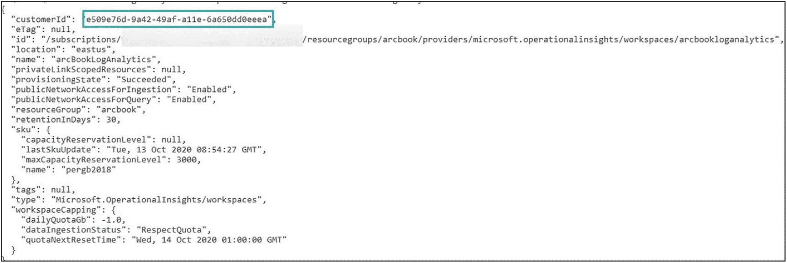

图 9-7

清单 9-4 的输出

除了 `customerId`，我们还需要工作区的共享密钥，这些密钥不包含在默认输出中，但可以通过清单 9-5 中的命令检索。

```
az monitor log-analytics workspace get-shared-keys
-g  -n UniqueLogAnalytics
清单 9-5
用于检索 Log Analytics 工作区共享密钥的 azure-cli 代码
```

这将返回最后一个 JSON 输出，如图 9-8 所示，我们需要其中的 `primarySharedKey`。


图 9-8

清单 9-5 的输出

现在，你最好将这些值中的一些结果放入环境变量。你可以跳过这一步，但那样的话每次都需要手动输入，这将使自动化基本无法实现。这些变量是

*   `SPN_CLIENT_ID`：清单 9-2 输出中的 `appId`
*   `SPN_CLIENT_SECRET`：清单 9-2 输出中的 `password`
*   `SPN_TENANT_ID`：清单 9-2 输出中的 `tenant`
*   `WORKSPACE_ID`：清单 9-4 输出中的 `customerId`
*   `WORKSPACE_SHARED_KEY`：清单 9-5 输出中的 `primarySharedKey`
*   `SPN_AUTHORITY`：`https://login.microsoftonline.com`

### 上传日志、使用情况和指标

如前所述，该过程包括两个步骤：首先，我们将收集每个部署的使用情况、日志和指标，并使用清单 9-6 中的命令将结果写入 JSON 文件。`--path` 参数将定义输出文件的名称，而 `--force` 参数将在目标文件已存在时覆盖它。

```
az arcdata dc export -t metrics --path metrics.json -k arc --force --use-k8s
az arcdata dc export -t logs --path logs.json -k arc --force --use-k8s
az arcdata dc export -t usage --path usage.json -k arc --force --use-k8s
清单 9-6
用于将指标、使用情况和日志导出到 json 文件的 azure-cli 命令
```

`az` 将为每个组件确认导出，如图 9-9 所示。

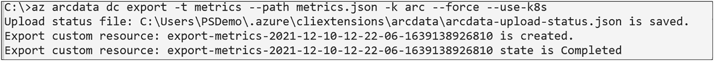

图 9-9

清单 9-6 的输出

在第二步中，我们将使用清单 9-7 中的命令上传这些 JSON 文件。

```
az arcdata dc upload --path metrics.json
az arcdata dc upload --path logs.json
az arcdata dc upload --path usage.json
清单 9-7
用于从 json 文件上传指标和日志的 azure-cli 命令
```

在这种情况下，`az` 将为每个组件确认上传，如图 9-10 所示。

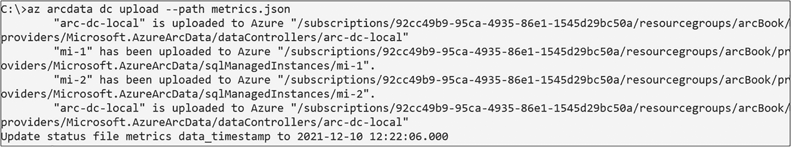

图 9-10

清单 9-7 的输出

上传现已完成。你现在可以继续创建一个结合了导出和上传的脚本文件，并安排它定期运行，例如通过 `cron`、Windows 计划任务或你选择的任何其他方法，以便持续将你的见解推送并在门户中显示。

### 在 Azure 门户中监控你的资源

首次为某个资源上传日志和指标后，可以通过在 Azure 门户中搜索找到它们（参见图 9-11），它们与直接模式创建并因此已提前显示的资源并列。

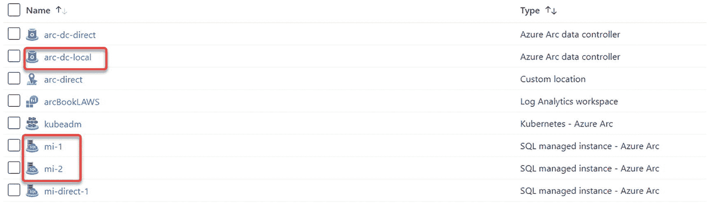

图 9-11

在 Azure 门户中显示的 Arc 托管实例

或者，Azure Data Studio 中每个数据实例的仪表板都有一个深度链接——就像访问内置仪表板时一样——指向 Azure 门户中的该实例，如图 9-12 所示。

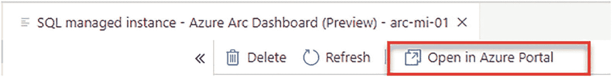

图 9-12

从 ADS 到门户中 Arc MI 的链接

在门户中，你将再次看到实例的详细信息，例如哪个数据控制器在管理它，以及指标和日志的子页面（参见图 9-13）。

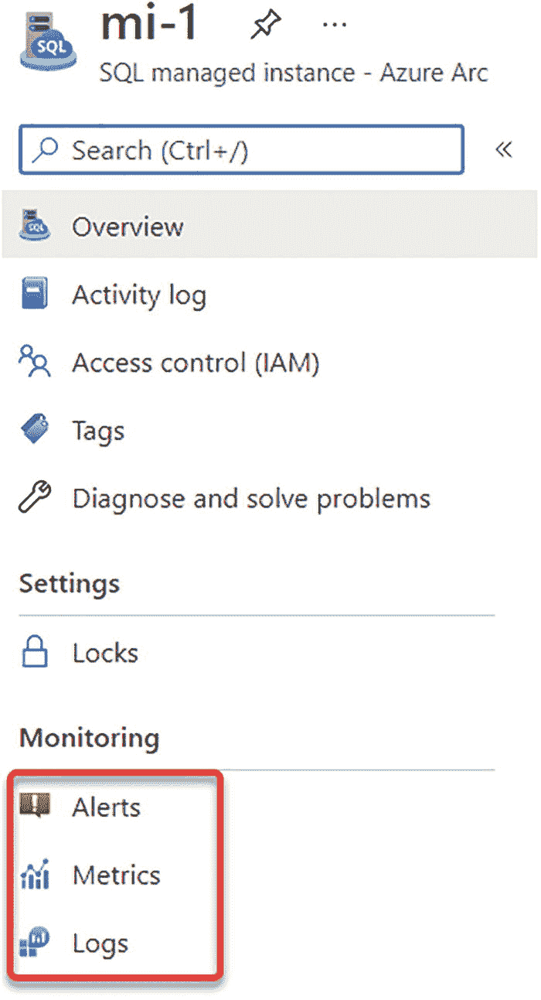

图 9-13

在 Azure 门户中显示的单个 Arc 托管实例

注意

警报仅适用于直接连接的集群。

在指标页面上，你可以分析上传的指标，就像分析驻留在 Azure 中的实例一样，如图 9-14 所示。

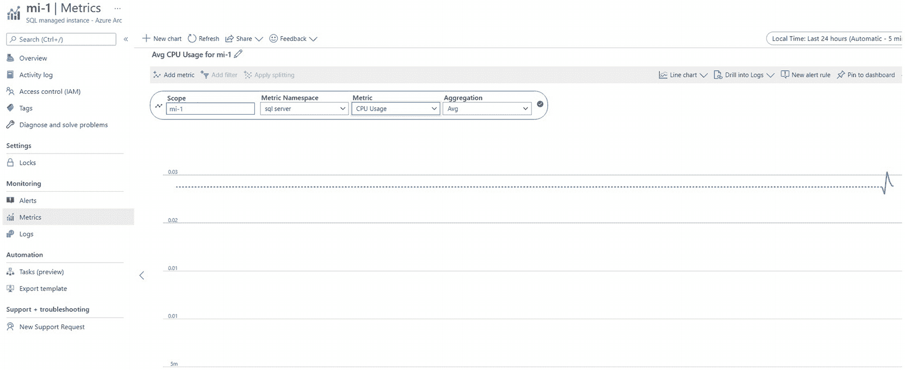

图 9-14

在 Azure 门户中显示的 Arc SQL 托管实例 - 指标

同样的逻辑适用于日志，可以使用 Log Analytics 进行分析，如图 9-15 所示。

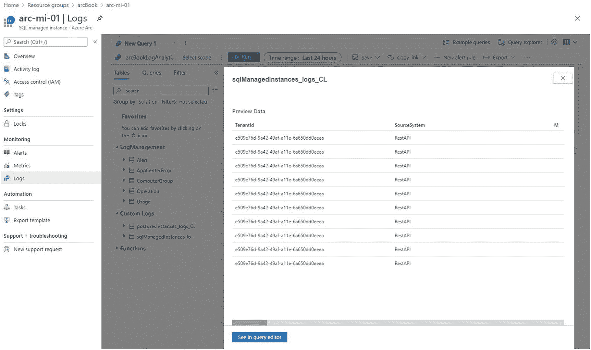

图 9-15

在 Azure 门户中显示的 Arc 托管实例 - 日志


## 升级启用 Azure Arc 的数据服务

当您想要升级到更新版本的启用 Arc 的数据服务时，首先需要检查的是您当前运行的是哪个版本以及有哪些版本可用，这可以使用清单 9-8 中的代码来完成。

```
az arcdata dc list-upgrades -k arc --use-k8s
清单 9-8
用于列出数据控制器可用升级的 azure-cli 命令
```

结果将与我们在图 9-16 中看到的类似。

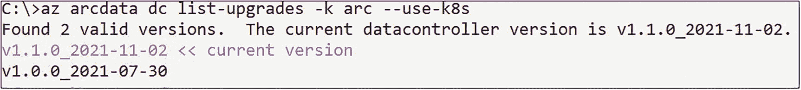

图 9-16

Arc 数据控制器的可用升级

在这种情况下，我们当前的版本已经是最新版本，因此无需甚至无法升级此实例。

但是，如果有可用升级，流程将是首先使用清单 9-9 中的命令将数据控制器升级到所需版本。

```
az arcdata dc upgrade [--desired-version] [--dry-run] [--k8s-namespace] [--no-wait] [--use-k8s]
清单 9-9
用于升级数据控制器的 azure-cli 命令
```

一旦您的数据控制器升级完毕，您就可以使用清单 9-10 中的命令来升级您的各个实例。

```
az sql mi-arc upgrade --k8s-namespace [--desired-version] [--dry-run] [--field-filter] [--force] [--label-filter] [--name] [--use-k8s]
清单 9-10
用于升级 SQL MI 的 azure-cli 命令
```

## 总结与要点

在这最后一章中，我们探讨了获取启用 Azure Arc 的数据服务状态概览的选项，以及如何将您的部署链接到 Azure 门户以使指标和日志文件可用于分析。在最后一步，我们还了解了如何升级启用 Azure Arc 的数据服务。

索引

A, B

`Arc 启用的数据服务`
`架构`
`控制平面层`
`数据服务层`
`硬件层`
`Kubernetes 层`
`Azure Arc 架构`
`ARM` 参见 `Azure 资源管理器 (ARM)`
`功能`
`原生工具`
`工具支持`

`Azure Arc 启用的数据控制器`
`Azure Data Studio`
`命令行`
`存储类`

`Azure Arc 启用的数据服务`
`azure-cli 扩展/提供程序`
`Azure Data Studio`
`计算部署`
`资源组`
`存储`
`Ubuntu`
`Windows 工具`

`Azure Arc 启用的 Kubernetes`

`Azure Arc 启用的 PostgreSQL Hyperscale`

`Azure Arc 启用的 SQL 托管实例`
`Active Directory 身份验证`
`Azure Data Studio`
`CLI`
`复制备份文件`
`定义`
`已部署的托管实例`
`Kubernetes 工具`
`托管备份/还原`
`还原备份文件`

`Azure Arc 启用的 SQL Server`

`Azure Arc 管理控制平面`
`数据服务`
`直接连接模式`
`间接连接模式`
`azure-cli`
`Azure Data Studio`
`Azure 资源管理器 (ARM)`

C

`Chocolatey` 或 `choco`
`云原生计算基金会 (CNCF)`
`ClusterIP`
`容器运行时接口 (CRI)`
`控制器`
`自定义资源定义 (CRD)`

D, E, F

`数据控制器`
`Azure 订阅`
`Azure 标签`
`仪表板凭据`
`部署`
`直接模式部署`
`指标和日志`
`SQL`

G, H, I, J

`Grafana 门户`

K

`kubeconfig 文件`
`Kubernetes API`
`定义`
`对象`
`原语`
`服务器 API 对象`
`启用 Arc 的数据服务`
`优势`
`群集`
`组件`
`架构`
`通信模式`
`控制平面`
`节点`
`NAT`
`资源消耗`
`调度`
`工作节点`
`定义`
`Kubernetes 群集`
`附加选项`
`注意事项`
`部署`
`安装`
`安装要求`
`kubeconfig`
`kubectl`
`Linux 工作站`
`软件包添加说明`
`引导控制平面`
`安装/软件包`
`Pod 网络`
`虚拟机配置交换`
`Windows 工作站`
`Kubernetes 入门`

L

`Linux 操作系统`
`LoadBalancer`

M

`现代基于容器的应用程序`
`监控/管理`
`启用 Arc 的数据服务`
`Azure 门户`
`直接连接模式`
`间接连接模式`
`数据控制器`
`Kubernetes 群集`
`日志搜索`
`指标检索端点`

N, O

`网络地址转换 (NAT)`
`NodePort`

P, Q, R

`持久存储`
`持久卷`
`平台即服务 (PaaS)`
`Pod`
`PostgreSQL Hyperscale`
`Azure Data Studio`
`移除已部署的服务器组`
`向上扩展服务器组`
`服务器组`

S, T, U

`服务，Kubernetes`
`静态配置/动态配置`

V, W, X, Y, Z

`虚拟机 (VMs)`
