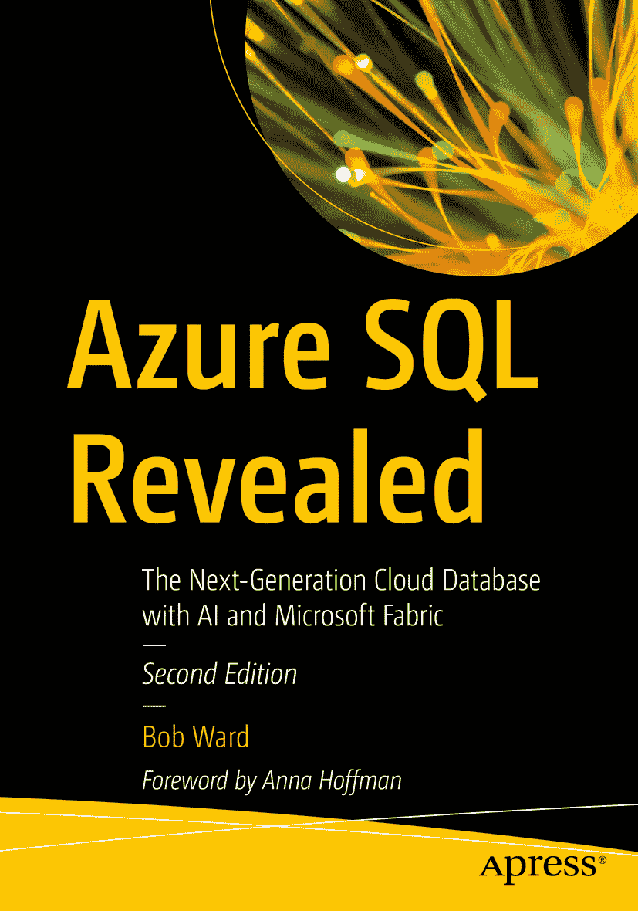

ISBN `979-8-8688-0973-6` e-ISBN `979-8-8688-0974-3` `https://doi.org/10.1007/979-8-8688-0974-3` © The Editor(s) (if applicable) and The Author(s), under exclusive license to APress Media, LLC, part of Springer Nature 2021, 2024 本作品受版权保护。无论涉及材料的全部或部分，出版商已获得所有权利的独家许可，特别是翻译、转载、插图再利用、朗诵、广播、微缩胶片或其他任何物理方式的复制，以及信息存储与检索、电子改编、计算机软件，或目前已知或未来开发的类似或不同方法的传播权。在本出版物中使用通用描述性名称、注册商标、服务标志等，即使未作特别声明，也不意味着这些名称可不受相关保护性法律法规的约束而可供自由使用。出版商、作者和编辑均可安全地假设本书中的建议和信息在出版时是真实准确的。出版商、作者或编辑均不对所含材料或可能存在的任何错误或遗漏提供明示或暗示的保证。对于出版地图中的管辖权主张和机构从属关系，出版商保持中立。

本 APress 印章由注册公司 APress Media, LLC（Springer Nature 的一部分）出版。

注册公司地址为：1 New York Plaza, New York, NY 10004, U.S.A.

本书献给所有踏上迁移至 Azure 之旅的 Microsoft 客户。

