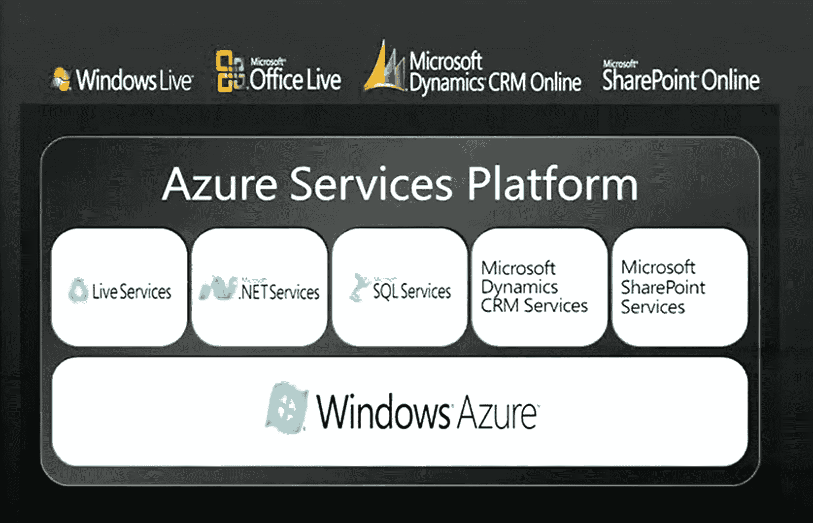
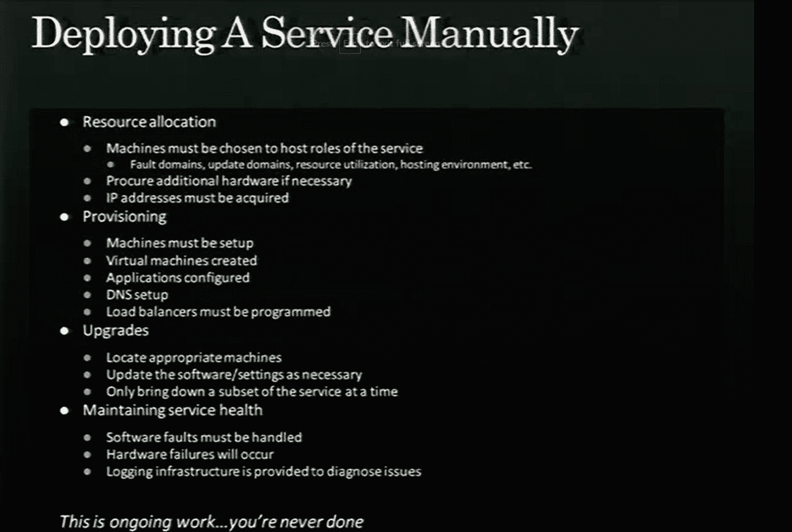
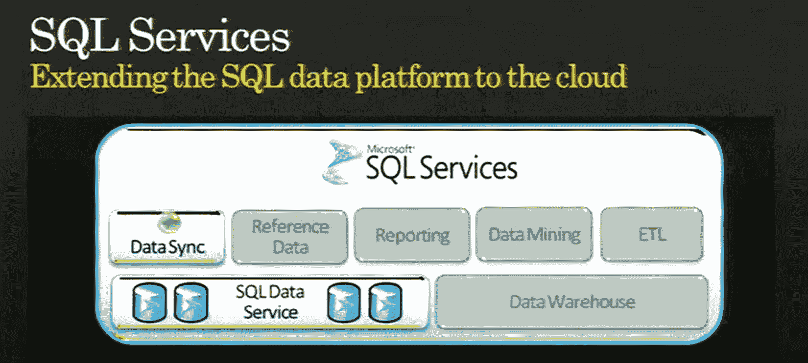
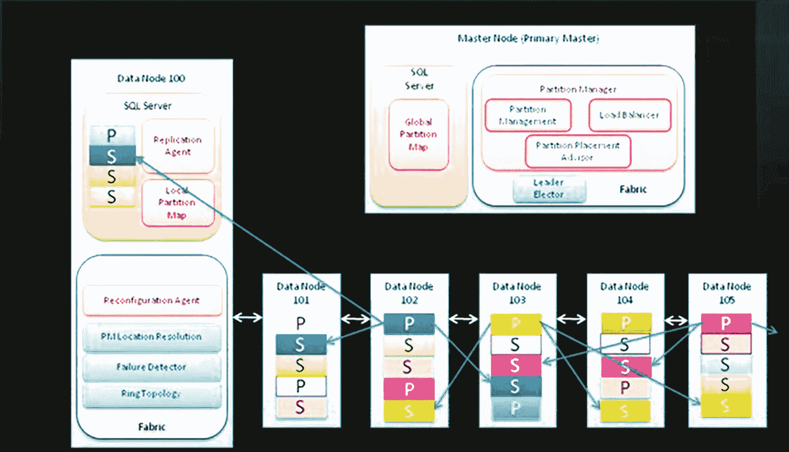
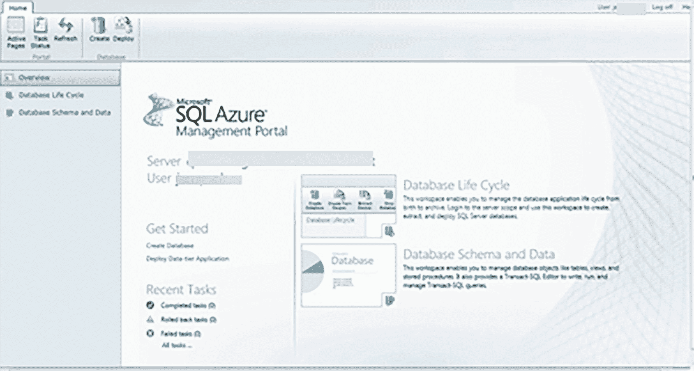

# 1. SQL Server 登陆云端

2005 年末，微软公司（我在这里可能有点偏心）在企业级市场风生水起，`SQL Server`产品也是如此。2005 年 10 月，我们即将发布`SQL Server 2005`（代号`Yukon`），不幸的是，它的开发耗时五年（这是另一本书的故事了——你可以去问问保罗·兰德尔）。那时我在微软技术支持部门工作，尽管`SQL Server 2005`上市有所延迟，我仍为这个版本感到非常自豪。Windows、Windows Server、Office 和 Xbox 360 都是微软当时广受欢迎的产品。

2005 年 10 月，一位新加入微软的架构师雷·奥兹向公司几位高管发送了一封内部邮件（最终发送给了所有员工，包括一位在公司工作了 12 年的老将鲍勃·沃德），题为《互联网服务的中断》（这封邮件很快泄露到了网上，你可以在[`https://www.cnet.com/news/ozzie-memo-internet-services-disruption/`](https://www.cnet.com/news/ozzie-memo-internet-services-disruption/)阅读）。我记得当时作为员工听说了邮件泄露以及部分内容，但没太在意。互联网不就是用来收邮件和浏览网页的吗？在这封邮件中，雷·奥兹描绘了微软成为一家`云提供商`，而不仅仅是一家“传统软件公司”的蓝图。当时微软其实只有少数几个“互联网服务”产品，包括传奇的 Hotmail 电子邮件服务（自 1997 年就存在了）、Bing 搜索服务和 Xbox Live。雷·奥兹的这封邮件勾勒了一个宏大得多的愿景。

这封邮件中的一个关键陈述是：“……所有业务部门都已被要求制定计划，以拥抱这一使命，并创建新的服务产品，为客户提供价值，并利用我们今天所拥有以及正在为未来构建的平台能力。”我当时并不知道，`SQL Server`团队内部将为此展开多少幕后工作来制定相关计划。

2006 年夏天，雷·奥兹成为微软的首席软件架构师（接替比尔·盖茨的职位），而这封邮件为后来被称为`Azure`的项目奠定了基础。`SQL Server`注定会成为其中的重要组成部分。

## CloudDB

2006 年初，微软数据存储和平台部门副总裁保罗·弗莱斯纳决定卸任`SQL Server`的领导职务，将权杖交给泰德·库默特。当泰德接手领导`SQL Server`时，一个由技术院士彼得·斯皮罗领导的云服务研究项目已经在进行中。彼得是`SQL Server`多个版本（包括`SQL Server 7.0`、`2000`和`2005`）的首席架构师。他组建了一个团队，其中包括几位工程师。其中有一位至今仍在微软的架构师：阿贾伊·卡尔汉。该团队着手开展一个项目，旨在构建一个基于云的服务来托管数据库。他们称之为`CloudDB`。正如泰德所说：“我们需要构建一个云版本的`SQL`。我们的目标是构建一个`无服务器`或平台即服务（`PaaS`）的`SQL`。用户无需担心服务器或虚拟机，只需关心数据库本身。”

要构建基于云的数据库服务，该团队需要设计一个稳健的方案，以支持使用共享资源托管多个客户或“数据库”并彼此隔离的概念。这个概念被称为`多租户`。

注意

在云中，`租户`一词可以有很多种含义。对于最初的`CloudDB`来说，租户指的是客户拥有的一个数据库。在本书中，你会多次看到“租户”这个词，但我在使用时会明确其范围。

根据阿贾伊·卡尔汉的说法，从一开始，`CloudDB`团队就开始研究设计方案，以融入故障检测、逻辑主节点（请理解为“元数据”主节点，而非物理节点）、负载均衡和部署等概念。早期的设计甚至探索了“键值存储”的想法，而非传统的关系型数据库概念。在团队构建`CloudDB`设计后不久，泰德指派大卫·坎贝尔也参与该项目，并带领团队朝着真正的“云端`SQL Server`”使命前进。

团队认为需要一个内部客户来帮助`试用该项目`并证明他们能够托管客户。这个内部客户后来成为一个面向公众的云服务，名为`Exchange Hosted Archive (EHA)`（一个早于 Office 365 出现的云端电子邮件归档解决方案）。针对这个内部客户，支持多租户的早期设计（即使只有一个内部客户，该客户也需要服务多个最终客户的需求）采用了一个称为`筒仓`的概念，即一个`SQL Server`可以托管多个数据库，但租户在数据库内部进行分区。`EHA`成为微软最早使用我们基于云数据库服务的`软件即服务`（`SaaS`）之一。可以把`SaaS`理解为以订阅方式购买软件，并通过托管解决方案（如在`Azure`中）使用该软件。你只需专注于使用托管在你自己计算机之外某处的应用程序。由于`SQL Server`托管了后端数据库，该团队便分叉了`SQL Server 2005`的代码库用于此服务。

当`CloudDB`团队致力于他们的项目，目标是支持`EHA`和其他客户时，微软的另一个团队则受雷·奥兹委托，研究如何在云中托管`计算服务`。

## 红狗项目

2006 年，雷·奥兹（Ray Ozzie）招募了微软资深工程师阿米塔布·斯里瓦斯塔瓦（Amitabh Srivastava），领导一个“云操作系统”项目，旨在推进他一年前提出的“互联网服务变革”。斯里瓦斯塔瓦的首批举措之一，便是请出了已退休的“DEC VMS 和 Windows NT 操作系统之父”戴夫·卡特勒（Dave Cutler）。作为初期项目工作的一部分，斯里瓦斯塔瓦和卡特勒走访了微软内部提供“云服务”的各个团队，包括 Xbox Live、Hotmail 和 Bing。在一次前往加利福尼亚州圣何塞访问 Hotmail 的途中，团队路过一家名为“粉红狮子狗”（Pink Poodle）的俱乐部。正是戴夫·卡特勒那句著名的话：“也许我们应该把我们的项目命名为‘粉红狮子狗’？”团队一致认为这个名字不太合适，于是将项目命名为“红狗”（Red Dog）。这个名字就此定下（你可以在[`https://www.wired.com/2008/11/ff-ozzie/?currentPage=7`](https://www.wired.com/2008/11/ff-ozzie/%253FcurrentPage%253D7)和[`https://www.zdnet.com/article/how-the-red-dog-dream-team-built-a-cloud-os-from-scratch/`](https://www.zdnet.com/article/how-the-red-dog-dream-team-built-a-cloud-os-from-scratch/)阅读更多关于“红狗”项目初期的精彩历史）。

从一开始，“红狗”团队在微软内部就以一种不同的方式来构建“云操作系统”。他们在微软园区的中心地带建立了自己的“数据中心”，甚至从邻近的建筑获取备用电力。他们的目标雄心勃勃，并且至今仍能引起共鸣。他们的主要总体目标是*为开发者构建一个用于开发可扩展 Web 应用程序的云服务*。他们从一开始就有一个宏大的主题：*可靠性*。正如戴夫·卡特勒在 2008 年所说：“有一件事你没有问，那就是为什么我们不多谈谈 Azure，并在此过程中向市场描绘未来的美好承诺。答案很简单，RD（红狗）小组非常保守，而且我们还远未完成。我们相信云计算对微软的未来至关重要，我们当然不希望做任何可能危及产品未来的事情。我们对丢失用户数据高度敏感。我们对操作系统或管理程序崩溃导致服务中断高度敏感。因此，我们正在一步步缓慢推进，力求在谈论各项功能之前，确保它们 100%可运行且经过扎实的调试。这与微软过去受到批评的做法相反，希望‘红狗们’已经学会了一个新技巧。”

“红狗”和“CloudDB”团队当时作为独立项目齐头并进（颇具讽刺意味的是，它们在同一园区，仅隔几栋楼），分别致力于支持 Web 应用程序的云服务和云端托管数据库。这两个项目计划在 2007 年和 2008 年合并，以推出统一的云服务。

## Azure 服务平台

2008 年 10 月，在加利福尼亚州洛杉矶举行的微软专业开发者大会（PDC）上，雷·奥兹宣布了 `Windows Azure`。PDC 是当今微软 //Build 大会的前身（[`https://en.wikipedia.org/wiki/Build_(developer_conference)`](https://en.wikipedia.org/wiki/Build_%2528developer_conference%2529)）。PDC 是微软面向开发者的盛事。

`Windows Azure` 作为 `Azure 服务平台` 的一部分推出。图 1-1 展示了 `Azure 服务平台` 产品的概览。

图 1-1

2008 年的 `Azure 服务平台`

自 2006 年起，“红狗”团队就一直在全力以赴，目标是为开发者发布一项云服务。雷·奥兹称 `Windows Azure` 是“Web 计算层的新 Windows 产品”（你可以在[`https://www.zdnet.com/article/ray-ozzie-announces-windows-azure/`](https://www.zdnet.com/article/ray-ozzie-announces-windows-azure/)观看视频）。他还称 `Azure` 是“云端的 Windows”。微软现在将为客户提供笔记本电脑上的 Windows（当时是 Windows Vista）、企业服务器（Windows Server）以及云端的 Windows（`Azure`）。

注意

我曾向微软的许多人询问我们的云服务为何命名为 `Azure`。正如巴克·伍迪（Buck Woody）所讲述的那样，“`Azure` 的意思是万里无云的蔚蓝天空。这个名字似乎恰到好处，而且没有在名字中使用‘云’（cloud）这个词。”

与 CloudDB 项目的目标类似，当 `Windows Azure` 首次发布时，其目标完全围绕以*平台即服务*（**`PaaS`**）形式面向 Web 应用程序的可扩展性和可用性。可以将 `PaaS` 理解为通过订阅购买一个用于托管你的应用程序或数据库的平台，该平台由 `Azure` 等提供商进行*管理*。使用 `PaaS`，你通常与主机计算机或虚拟机是抽象隔离的。因此，*云服务* 是 `Windows Azure` 中的第一项服务。这种服务在内部被称为 `PaaS V1`。

注意

云服务如今在 `Azure` 中仍提供。你可以在[`https://azure.microsoft.com/services/cloud-services/`](https://azure.microsoft.com/services/cloud-services/)阅读更多关于云服务的信息。不过，在现代应用程序中，它已被 `Azure App Service` 所取代，你可以在[`https://azure.microsoft.com/services/app-service/`](https://azure.microsoft.com/services/app-service/)阅读更多信息。

尽管云服务应用程序运行在一个或多个虚拟机中，但其理念是支持云端易于扩展的 Web 应用程序，让开发者不必关注虚拟机的细节，而更专注于应用程序本身。当时的 Windows 开发者习惯于 Windows Server 的互联网信息服务（`IIS`）功能。虽然开发者不必过多担心 `IIS` 的部署和配置，但他们通常需要在其组织内有一名管理员。虽然开发者对于云服务中的虚拟机原生操作系统环境有一定的访问权限，但这种访问是受限的。直到几年后，微软才通过 `Azure 虚拟机` 引入了*基础设施即服务*（**`IaaS`**）的概念。可以将 `IaaS` 理解为通过订阅购买用于托管你虚拟机的基础设施。你负责管理客户虚拟机（Guest VM），而提供商则负责管理主机、硬件、网络和存储。

`PaaS` 和云服务的其他承诺之一，是创建易于使用的应用程序部署、配置和更新概念。此外，提供可扩展性、内置高可用性和负载均衡能力，使得云服务的概念对 Web 开发者极具吸引力。你会发现，这些相同的概念也是 `Azure SQL` 和数据库吸引力的一部分。

为了托管 PaaS 云服务，必须构建一个*底层托管系统*。Windows Azure 团队借鉴了 Red Dog 项目的设计方案来构建这个托管系统，以支持部署、网络、高可用性、扩展和安全性，因为云服务将这些细节从开发者那里完全抽象了出来。这个软件托管系统被称为`Windows Fabric`。为用户所使用的服务提供底层托管系统，正是*云的力量*。我在 PDC 2008 大会的一次演讲中发现了这张有趣的幻灯片，它详细阐述了某人在数据中心运行自己的`结构`所需的所有细节，如图 1-2 所示。

图 1-2

在数据中心构建你自己的结构

这张幻灯片充分说明了一个`结构`为了支持大规模云服务所必须具备的功能。一个高可用的*结构控制器*（`FC`）是系统的关键。`FC`维护着它所管理的资源清单的拓扑图：计算机、虚拟机、负载均衡器和交换机，边则是网络电缆等对象。`结构`系统的一个关键点是采用了声明式模型，因此`FC`会获取你声明的内容并实现它。在 Azure 的`Windows Fabric`中，很早就有了高可用性的概念，比如故障域和更新域（我将在本书的第 2 章和第 3 章中描述这些概念的重要性）。

`Windows Fabric`现在被称为`Service Fabric`。`Service Fabric`的使用也被开放给应用程序，以便在`Service Fabric`集群中托管它们自己的服务。你可以在 [`https://azure.microsoft.com/services/service-fabric/`](https://azure.microsoft.com/services/service-fabric/) 阅读更多关于 Azure `Service Fabric`的信息。

注意

当你在本书本章中了解更多关于`Service Fabric`的内容时，你可能会看到它与另一个名为 Kubernetes 的`结构系统`有相似之处。如果你想了解更多关于这两个系统之间的区别，这篇博客文章是一个很好的起点：[`https://techcommunity.microsoft.com/t5/azure-developer-community-blog/service-fabric-and-kubernetes-community-comparison-part-1-8211/ba-p/337421`](https://techcommunity.microsoft.com/t5/azure-developer-community-blog/service-fabric-and-kubernetes-community-comparison-part-1-8211/ba-p/337421)。

为了完善`Azure 服务`的版图，微软宣布了数据平台或`SQL 服务`，从而开始了最终成为 Azure SQL 的旅程的首次公开宣告。

## 走向 SQL Azure 之路

2008 年 PDC 大会上关于 Windows Azure 的宣布中，很大一部分内容涉及数据。自 2006 年的 CloudDB 项目以来，Peter Spiro、David Campbell、Ajay Kalhan、Tomas Talius 和团队的其他成员已经为 SQL Server 构建了一套云服务，以托管`多租户数据库`（或在一组共享的 SQL Server 中托管多个客户）。

在 PDC 2008 上宣布的第一个名称是`SQL 数据服务（SDS）`。虽然这项服务的消息在行业内引起了轰动，但当时许多客户关注的是本地企业部署，而我们的团队整体上也把主要精力放在了 SQL Server 上（例如，发布代号为 Katmai 的 SQL Server 2008）。但在公司内部，领导层正在大力推动云计算，而这不仅仅是因为他们“被要求这样做”。Ted Kummert 说：“我们是信仰者。我们相信 PaaS 是未来，但对于这样的服务来说，我们在行业中还处于早期阶段。”

### SQL 数据服务

SQL 数据服务被宣布为更广泛的`SQL 服务`套件的一部分，该套件还包括 DataSync、Reference Data、Reporting、Data Mining 和 ETL，如图 1-3 所示。

图 1-3

2008 年 PDC 大会上的 SQL 服务

这张图片来源于 David Campbell 在 2008 年 PDC 大会上演讲的幻灯片。

注意

有趣的是，我们当时的意图也包括提供“数据仓库”服务（我们现在通过 Azure Synapse（和 Microsoft Fabric）来实现）以及“ETL”服务（现在是 Azure Data Factory）。“Reporting”在 SQL 服务中从未真正取得成功（尽管有过尝试），但微软最终创建了一个非常强大的 Reporting 服务，叫做 Power BI。

SQL 数据服务体现了开发者为其应用程序托管数据库的能力，并将计算机、虚拟机和 SQL Server 本身的细节完全抽象化。基本上，你创建一个数据库；用表、数据和索引填充它；然后就可以直接开始使用了。不需要机器、操作系统或机器安装。

`SDS`提供的另一个概念是“数据库即公用事业”或“按需付费服务”。这实际上是整个 Windows Azure 的相同理念。它代表了客户使用模式的转变：从购买 SQL Server 许可证转向使用订阅服务来支付数据库使用（以及背后的计算和存储）费用。

当团队将编程接口作为`REST API`而不是`T-SQL`引入时，他们很快吸取了一个教训。REST 代表**表述性状态转移**，是 Web 服务常用的协议。客户的反馈很快改变了这个模式（但`REST API`接口至今仍在 Azure SQL 的许多方面存在，你将在本书中看到）。你可以从这篇 2009 年 3 月的博客文章（[`https://web.archive.org/web/20140411144147/http://blogs.msdn.com/b/sqlazure/archive/2009/03/10/9469228.aspx`](https://web.archive.org/web/20140411144147/http://blogs.msdn.com/b/sqlazure/archive/2009/03/10/9469228.aspx)）看出，`SDS`团队需要为开发者和用户提供“关系数据体验”，其中包括通过`表格数据流（TDS）`的编程接口。换句话说：`T-SQL`。客户期望从 SQL Server 数据库获得的其他基本功能也必须具备，包括索引、存储过程、触发器、视图等。

由于`SDS`和 Windows Azure 团队当时在同时进行创新，`SDS`团队必须为数据库和 SQL Server 找出一个托管系统。当`SDS`团队在创新时，`Windows Fabric`正在构建中。最终的决定是使用微软已有的托管系统，而不是使用 Windows Azure。那个平台叫做`AutoPilot`（你可以在 `https://www.microsoft.com/en-us/research/publication/autopilot-automatic-data-center-management/?from=http%3A%2F%2Fresearch.microsoft.com%2Fapps%2Fpubs%2Fdefault.aspx%3Fid%3D64604` 阅读更多关于`AutoPilot`系统的信息），它由运行 Bing 搜索服务的团队构建。`AutoPilot`实际上是一个以规模化方式配置“裸机”计算机的平台。`SDS` `集群`在物理上与 Windows Azure 集群共置，但`SDS`管理着自己的系统。

`AutoPilot`只提供软件服务来在规模化裸机服务器上部署和维护应用程序。`SDS`团队必须构建自己的一套服务来实现容错、高可用性和连接性。`SDS`团队构建了自己的`结构`来部署、运行、扩展和维护 SQL Server 实例以托管客户数据库。最初的设计是“孤岛”式，后来被“每个租户一个数据库”的模型所取代，称为`分区`（与 SQL Server 分区不同），但多个数据库可以托管在一个 SQL Server 实例上。每台裸机服务器也可以托管多个 SQL Server 实例。

该设计的另一部分是为了支持“数据库服务”的概念，将用户与 SQL Server 实例本身抽象开（尽管 SQL Server 实例被用来托管数据库）。因此，“主节点”的概念被内置到服务中，用于承载关于“数据节点”的元数据。这些数据节点具有副本和结构控制器的概念。此外，还构建了一个前端服务，应用程序将连接到此服务，而不是连接到后端 SQL Server。这便是现在被称为`Gateway Server`的 Azure SQL 的早期设计。

图 1-4 展示了 SDS 托管系统的原始设计。

图 1-4

SQL 服务数据库的原始 SDS 托管设计

结构（Fabric）进程有助于与整个集群协调以实现故障转移。因此，早期我们需要提供：

*   通过我们的分区（`partition`）概念隔离客户，但共享 SQL Server 以实现密度
*   结构（`fabric`）内部的故障转移逻辑
*   数据的副本集。听起来很熟悉？（有点像可用性组（`Availability Group`））
*   我们的数据库访问底层存储和跨数据中心网络的能力，但对用户是抽象的
*   一个逻辑上的“主”数据库，用于应用程序数据库以支持登录并存储其他元数据
*   收集指标以深入了解遥测和运行状况的能力
*   用于健康检测的`Watchdog`进程

团队在这些早期学到了很多。Ted Kummert 描述了当时的挑战，即不仅仅是增强和构建软件，还要拥有“实时服务”的所有方面，包括强化、质量、可用性、开发速度、遥测、中断、安全性，甚至包括销售成本（`COGS`）和容量规划之类的事情。这些早期的学习最终使微软能够扩展到原始团队梦想的水平。正如 Ted 所描述的，“……我们现在不仅是在演进一个代码库，同时也在作为一个团队以及我们的能力一起演进。这是一种既令人振奋又令人谦卑的经历。”

微软公司历史上的另一个重要事件发生在 2008 年。当时 Steve Ballmer 要求公司内的一位领导者重新打造另一项云服务，即 Bing 搜索服务。那位领导者就是 Satya Nadella。根据 Satya 在他的书*Hit Refresh*中所说，“最终，Bing 将被证明是构建当今遍布微软的超大规模、云优先服务的绝佳训练场。”

### SQL Azure 诞生

向市场发布版本是一项巨大的努力。在此过程中，SQL Data Services 对许多人来说并不是一个合适的名字。因此，在 2009 年夏天，当该服务仍处于社区技术预览（`Community Technology Preview`，`CTP`）阶段时，品牌名称从 SQL Data Services 更改为`SQL Azure`。`SQL Azure`这个名称至今仍被许多人用来称呼 Azure SQL（可以问问 Conor Cunningham）。编程和使用模型与 SDS 相同（只不过采用了 T-SQL 和 TDS 协议而不是 REST），托管方式也相同，但`SQL Azure`这个名称是推向市场的品牌。

2010 年 2 月 1 日，一切正式生效。Windows Azure 正式发布，随之而来的是业界第一个真正的 PaaS 关系数据库服务——`SQL Azure`（您可以在 [`https://blogs.microsoft.com/blog/2010/02/01/windows-azure-general-availability/`](https://blogs.microsoft.com/blog/2010/02/01/windows-azure-general-availability/) 阅读官方博客公告）。与公告一同发布的还有一个新徽标（将当时的 SQL Server 2008 徽标从红色改为蓝色），如图 1-5 所示。

图 1-5

原始的 SQL Azure 徽标

为了与 Windows Azure 交互，团队还必须接入一个称为`portal`的用户界面体验。第一版 Windows Azure 门户使用了 HTML，但此后不久，采用了基于 Microsoft Silverlight 的新门户体验。这也包括一个单独的基于 Silverlight 的 SQL Azure“管理”体验。

图 1-6 展示了一个基于 Silverlight 的 SQL Azure 管理门户示例。

图 1-6

SQL Azure 管理门户

当 Windows Azure 发布时，`Azure data center`的概念被介绍给我们的客户。数据中心是位于特定地理位置的一组物理建筑，微软在此托管 Azure 服务。数据中心的名称基于地理区域（我们后来转向了`region`和数据中心的概念，我将在本章后面和其他地方解释）。在 SQL Azure 最初发布时，客户可以在名为 North Central US、South Central US、East Asia 和 North Europe 的数据中心部署数据库。

最初的 SQL Azure 有一些有趣的特点：

*   我们发布时的业务模型有两种`edition`：Web 版和商业版。主要区别在于最大数据库大小：Web 版为 1GB，商业版为 10GB（正如您将在本书中看到的，现在您可以创建远大于此的大小）。我们在 2010 年 6 月迅速将此上限提高到了 50GB。
*   为了部署数据库，您需要首先部署一个`logical database server`。多个数据库可以关联到一个逻辑服务器。逻辑服务器还包含其他元数据，例如用于安全性的登录名和防火墙规则。
*   数据库中的任何表都必须具有聚簇索引（`clustered index`）。
*   我们使用了自己的内部“副本系统”，但确保始终保留三个可用副本。我们还自动化了备份等过程并保留了多个副本。
*   我们通过称为服务更新（`Service Update`，`SU`）的概念来更新 SQL Server 软件，并通过博客公告这些更新（服务更新的示例博客文章可在 [`https://web.archive.org/web/20140420195848/http://blogs.msdn.com/b/sqlazure/archive/2010/02/17/9965464.aspx`](https://web.archive.org/web/20140420195848/http:/blogs.msdn.com/b/sqlazure/archive/2010/02/17/9965464.aspx) 找到）。
*   我们引入了服务级别协议（`Service-Level Agreement`，`SLA`）的概念，以确保一定级别的数据库可用性。
*   早期，我们与流行工具`SQL Server Management Studio`（`SSMS`）开发了集成体验。
*   客户在诸如应用程序重试逻辑、新的错误消息、逻辑主库（`logical master`）、限流（`throttling`）以及与 SQL Server 的 T-SQL 表面区域不一致等概念上遇到了困难。

注意

如果您想回顾一下，查看一些关于 SQL Azure 的早期博客，请访问 [`https://web.archive.org/web/20140410165353/http://blogs.msdn.com/b/sqlazure/default.aspx?PageIndex=1`](https://web.archive.org/web/20140410165353/http:/blogs.msdn.com/b/sqlazure/default.aspx%253FPageIndex%253D1) 并浏览页面底部的链接。

在 Windows 和 SQL Azure 的这些早期，即使在微软内部，这也是一个全新的世界。Buck Woody 曾在最初的 Windows Azure 团队工作。他告诉我，在 Azure 工作属于微软内部一个名为“Incubation”的小组——一种类似初创公司的文化。“其中最有趣的部分之一，”他说，“是见证技术和业务方面所有东西的构建过程。这可能是我上过的最好的 MBA 课程。”在 Incubation 部门，你被“隔离”在微软其他部门之外，拥有自己的工程师、销售、市场等。当产品显示利润并且所有业务流程都建立起来后，它就“毕业”并入微软的其他领域。有些产品毕业了，有些则没有——因此成功压力很大。

### SAWA 项目

到那时为止，SQL Azure 仍然部署并运行在 AutoPilot 集群系统上，其 SQL Server 实例托管于裸金属服务器（Azure SQL 的首席工程师 Brian Chamberlain 在内部称此为 SQL Azure v1）。

我们作为一个团队明白，需要融入使用虚拟机来部署服务的 Windows Azure 托管系统。我们需要更多地利用 Windows Azure 在部署、网络和存储方面提供的优势，同时不对 SQL Azure 架构进行彻底更改。因此，一个名为 **SAWA** (SQL Azure on Windows Azure) 的项目诞生了。Brian 称此为 SQL Azure v2。为了帮助团队抽象化，使其不必同时在 AutoPilot 和 SAWA 系统上部署，我们构建了一个代号为 **Blackbird** 的软件层。

SAWA 项目很重要，因为它将使团队最终能够成为一个成熟的 Azure 服务，全面利用 Windows Azure 内部为服务提供的一切。但在随后的几年里，团队同时运维和管理着部署在 AutoPilot 和 SAWA 上的 SQL Azure 数据库。用户并未察觉差异。该服务看起来和表现得依旧如常。

在接下来的几年里，Windows Azure 通过云服务提供计算服务，通过 SQL Azure 提供数据库服务。SQL Azure 团队还吸纳了其他工程负责人，包括 Nigel Ellis 和 Peter Carlin。这是旅程的开始，但微软领导层已经在幕后推动变革和更大的计划，以推动 Azure 在公有云领域更进一步。

## 虚拟机计划

当 Windows Azure 首次发布时，其主要目标解决方案之一是云端的可扩展 Web 应用程序。因此，云服务是 Windows Azure 中的第一个计算服务。正如我在上面关于 Windows Azure 的章节中所描述的，云服务应用程序在虚拟机中运行，并能够使用 API 将数据存储在 SQL Azure 或 Azure Blob 存储中。但应用程序开发人员无法访问任何本地存储或获得完整的虚拟机访问权限。云中作为服务的虚拟机概念，也称为 **基础设施即服务 (IaaS)**，由亚马逊在 2006 年推出，称为 Amazon Elastic Compute Cloud (EC2)，是其整体 Amazon Web Services (AWS) 套件的一部分。EC2 就是一个真实的虚拟机，你可以在其中部署所选的操作系统和应用程序。

对许多人来说，Windows Azure 中的云服务仍被视为平台即服务 (PAAS)，因为开发人员并未真正访问整个客户 VM 或本地存储等概念。我们的 Windows Azure 团队知道我们需要一些东西来与 EC2 竞争，并使 IaaS 成为 Azure 的重要组成部分。

2011 年，微软决定在领导层进行一次大胆调整。Steve Ballmer 希望在云（包括 Azure）上进行重大押注。他要求 Satya Nadella 从他当时领导的 Bing 团队调任，去运营微软一个名为服务器与业务工具 (STB) 的部门。这是微软主要的企事业软件集团，负责 Windows Server、SQL Server 和 Windows Azure。作为接管 STB 职责的一部分，Satya 做了几件关键的事情。首先，他聘请 Scott Guthrie 来领导 Azure 的工程工作。Scott 现在是云与企业部 (C&E) 的负责人，该部门以前是 STB。其次，他聘请 Jason Zander 领导 Azure 核心基础架构团队。第三，他授权 Azure CTO Mark Russinovich 制定未来路线图。而该团队首批大胆举措之一，就是推出 Azure 虚拟机 (VM) 预览版，为 Windows Azure 提供真正的 IaaS 服务产品。

首批用于展示 Azure 虚拟机的关键工作负载之一将是 SQL Server。我记得 Azure VM 的这些早期日子，当时我被分配在微软支持部门，负责研究 SQL Server 在此环境中的可支持性。正是在那时，我遇到了在此项目上负责 SQL Server 的首席项目经理 Guy Bowerman。

当 Guy 在 2010 年 6 月左右加入 SQL 团队时，他了解了具有辅助角色和 Web 角色的云服务，但也看到我们已经宣布了 *VM 角色*的概念。VM 角色允许用户上传虚拟机映像 (VHD) 并运行其 VM。然而，VM 角色并未提供真正 IaaS 解决方案的丰富功能。例如，VM 角色不为操作系统或附加的持久化驱动器提供本地持久存储。

在整个 2011 年和 2012 年，Windows Azure 团队与 SQL Server 等团队合作，推出了新的 Azure 虚拟机预览计划。Azure 虚拟机于 2013 年 4 月正式发布。Azure 虚拟机是微软迈出的重要一步。“开放”虚拟机现在允许用户部署所选的操作系统，包括 Linux（此举将为你可能听说过的名为 Helsinki 或 SQL Server on Linux 的小项目奠定基础）。

新的 Azure 虚拟机平台为运行 SQL Server 提供了各种优势，包括专用的“操作系统磁盘”、用于存储诸如 tempdb 之类文件的临时磁盘，以及用于 SQL Server 数据库和日志文件的持久存储，称为 *数据磁盘*。尽管选择有限，但有各种虚拟机 *大小* 供客户选择部署 SQL Server，包括 CPU 数量、内存、磁盘数量和最大容量。除了为虚拟机配置提供这些选择外，Windows Azure 团队还提供了一个系统，使得像 SQL Server 这样的团队能够通过 *库映像* 或 *市场* 的概念，为预装了 SQL Server 的完整部署虚拟机提供客户选择。现在，用户可以选择一个虚拟机配置和一个 SQL Server 版本，再做一些其他选择，点击一个按钮，即可在 10-15 分钟内在 Azure 中托管的虚拟机中访问一个完整部署的 SQL Server。然后，你可以使用远程桌面等程序连接到 VM，然后开始使用。此外，Azure 虚拟机服务还包括 SLA 和可用性集（更新域和故障域）。

Azure 虚拟机的初始发布使用了托管云服务的相同 Windows Fabric。SQL Server 团队实际上是 Windows Azure 部署虚拟机的“内部客户”。SQL 团队部署的主要接口和系统称为 `RDFE` (Red Dog Front End)。该系统后来被亲切地称为 *经典* 虚拟机。如今，经典系统已被 Azure 资源管理器 (ARM) 系统取代，你将在本书的其他地方了解更多相关信息。

虽然最初的 Azure 虚拟机经典系统受到客户欢迎，但它给 SQL Server 团队带来了问题。磁盘性能是一个突出问题，我记得在 Azure VM 的早期，作为一名微软支持工程师，我与客户一起努力解决这些问题。此外，使用 RDFE 在部署带有 SQL Server 的虚拟机以及提供健壮的编程接口来部署和管理虚拟机方面也带来了一些挑战。

尽管如此，该服务很受欢迎，并且对于 SQL Server 在 Azure 中的成功至关重要。现在，那些认为 SQL Azure 无法满足其需求的客户有了另一个选择。他们仍然可以在 Azure 中使用虚拟机在公有云中托管 SQL Server。正如 Guy 告诉我的那样，“Azure VM 上的 SQL Server 产品在 Azure VM 发布后，被证明是最受欢迎和最成功的产品之一。”

