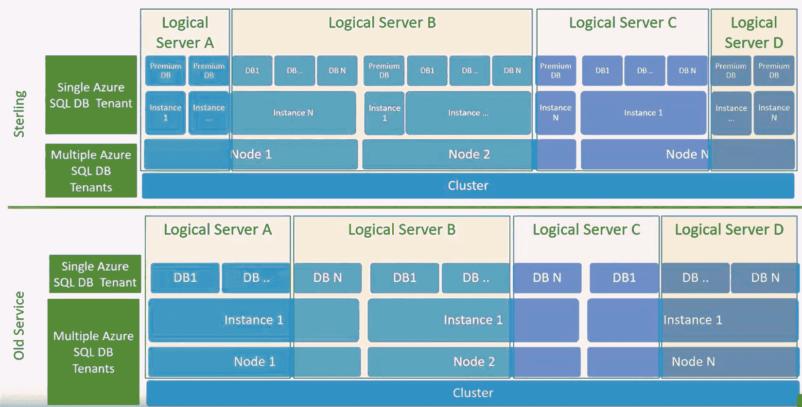
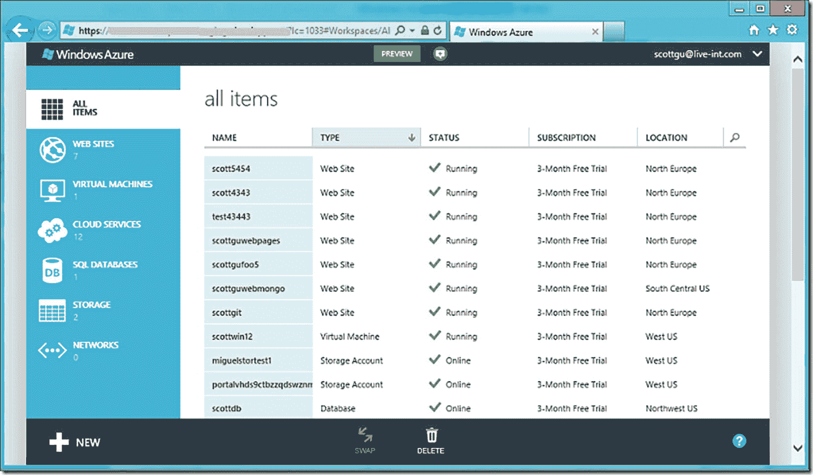

# 演进中的 Azure SQL 数据库

到 2012 年夏天之前，微软开始将 SQL Azure 品牌化为 `Windows Azure SQL Database`。我从未找到过任何官方的品牌公告。根据我在团队内的研究和内部讨论，我们只是决定开始将该服务称为 `SQL Database`，以强调这项服务完全关乎“数据库即服务”，旨在将 SQL Server 实例的细节从用户端抽象出来。

2014 年，微软将 Windows Azure 的品牌更名为 `Microsoft Azure`，或简称 Azure，于是 Azure SQL Database 的当前名称应运而生。

> **注意**
>
> Microsoft Azure 的品牌重塑对 Azure 的未来意义重大。Windows 在过去和现在都是操作系统的主导力量。然而，自从 Azure 虚拟机推出以来，Linux 虚拟机变得异常流行。通过使用 Microsoft Azure 或简称 Azure 这个品牌，我们向业界发出了一个信号：Azure 不仅仅是一个 Windows 云。

随着 SQL Azure 逐渐成熟，来自“传统” SQL Server 团队的其他工程师也开始加入，包括 Conor Cunningham。Conor 的目标之一是直接与客户合作，帮助他们成功使用 SQL Azure。这包括像 `Team Foundation Services` (TFS) 这样的内部客户。直至今日，Conor 仍然与 TFS（现已演变为 Azure DevOps）合作，致力于他们在 Azure SQL 上的成功。用 Conor 的话说，“他们是我们使用该平台的最佳独立软件供应商之一，他们帮助我们每天改进 SQL Azure。”

还有一些重要的外部客户希望利用 Azure 的力量。Conor 和团队许多人合作过的最大、最著名的客户之一就是 `Pottermore`。大约在 2012 年，所有的 `Harry Potter` 电影都已上映，但书籍和电影的热度依然巨大。因此，Pottermore 公司决定为粉丝们构建一个网站体验。他们选择了 Windows Azure 和 SQL Azure 来驱动这个网站体验（完整故事请见 [`https://news.microsoft.com/2012/06/06/pottermore-new-website-based-on-the-hugely-popular-harry-potter-books-uses-windows-azure-to-scale-up-to-1-billion-page-views-in-first-two-weeks/`](https://news.microsoft.com/2012/06/06/pottermore-new-website-based-on-the-hugely-popular-harry-potter-books-uses-windows-azure-to-scale-up-to-1-billion-page-views-in-first-two-weeks/)）。

> **注意**
>
> Pottermore（参见 [`https://en.wikipedia.org/wiki/Pottermore`](https://en.wikipedia.org/wiki/Pottermore)）实际上是一家公司，之前的 Pottermore 网站现在官方网址是 wizardingworld.com。

Pottermore 对 SQL Azure 团队来说是一次有趣的考验。这个项目涉及众多数据库和并发用户。正如 Conor 所言，“我们显然不想让全世界的哈利·波特粉丝失望，但我们也学到了很多关于如何设计可扩展系统的东西。” 像任何创新一样，这类项目既雄心勃勃，也为改进未来奠定了知识基础。

微软支持部门也经历了重大转变以应对云端需求。我的长期同事兼好友 Keith Elmore（著名的 ostress 工具作者），以前在 CSS（客户服务与支持）部门，现在与我同在工程团队，从一开始就参与了 Azure 支持。他告诉我，支持 Azure 虽有一些有趣的挑战，但也开启了新的可能性。Keith 说：“我们在故障排除方式上发生了重大转变。我们不再需要像在本地环境中那样要求客户捕获大量故障排除数据，而是可以立即访问大量 Azure 遥测数据来评估他们问题的普遍性质，并且通常能缩小到具体问题。” 支持云服务意味着客户期望快速提供解决方案。微软现在拥有“后端”，因此客户通常能完全控制获取的数据在 Azure 中对他们来说是不可能的。根据 Keith 的说法，“期望在一天或更短时间内解决大部分支持案例是革命性的。团队团结一致，思考如何组织自己并利用 Azure 遥测数据在一天内解决大多数问题。” 本书后续将介绍 Azure 为客户提供的一些支持和故障排除资源。

## Sterling (SAWAv2) 项目

到 2013 至 2014 年期间，Azure SQL Database 已经拥有了许多不同的成功客户，但即使在 SAWA 上运行的旧有架构也开始通过像 TFS 和 Pottermore 这样的不同问题和客户体验显现出其年代感：

*   尽管我们在基础设施上做了许多改变，但一个棘手的问题总是不断出现，即所谓的 `noisy neighbor`（吵闹的邻居）问题。一个客户消耗的某个数据库资源可能会对另一个数据库产生不利影响。我们需要一种解决方案，让每个租户（数据库）拥有自己的 SQL Server 实例。这将允许我们使用诸如 SQL Server 资源调控器之类的功能。
*   我们也感受到了很大的压力，需要为 SQL Azure 客户开放更多的 T-SQL 表面区域。由于多个租户共享一个 SQL Server 实例，这是一个主要问题。例如，当动态管理视图 (`DMV`) 设计为显示底层实例上的任何内容时，我们如何仅展示你的数据库的视图？
*   我们还需要一种模型，让客户期望获得更可预测的性能，因为他们无法选择 CPU 数量、内存或 I/O 速度等参数。
*   我们的 Azure SQL Database 代码库仍然是从 `SQL Server 2005` 分叉出来的（天啊！）。为了让 SQL 团队真正实现 `云优先`，我们需要合并 SQL Azure 和 SQL Server 的代码库。
*   我们仍然使用本地磁盘处理所有事务（包括用户数据库、遥测数据等），并配备我们自己的定制复制系统。即使使用 SAWA，我们也在使用定制硬件来支持巨大的磁盘需求，因为我们所有的存储都是使用 spindle（非 SSD 驱动器）的本地存储。我们需要转向与整个 Windows Azure 对齐的硬件代次。然而，当时的硬件代次仅支持非常小的本地 SSD 驱动器。因此，我们需要一种策略来允许使用 Azure 存储的“远程”数据库。
*   `Windows Fabric` 在内部托管并驱动着大多数 Azure 服务，它具有许多内置功能来支持部署、扩展、网络、存储、高可用性和容错。我们知道，要启用如数据库使用 Azure 存储等新模型和选项，Azure SQL Database 需要成为一个 `WinFab 应用程序`（或 Windows Fabric 应用程序）。

早在 2011 年，包括 Morgan Oslake 在内的团队成员就开始寻求使用 `资源预留` 和 `节点隔离` 等概念来解决吵闹的邻居问题。资源预留是通过一个称为 `服务级别目标 (Service-Level Objective, SLO)` 的概念实现的。即使在今天，你仍然可以在 Azure SQL 的一些诊断信息中看到 `SLO` 这个术语。这项工作催生了几项将塑造未来的创新。用 Morgan 的话说，“最初的解决方案也为实现真正的弹性扩展奠定了基础。顺便提一下，这个项目也是在 Microsoft Research 合作下诞生了 IO 资源调控器的地方，该解决方案最终被集成到了 SQL Server 的盒装产品中。”

在 `SQL Server 2014` 开发和发布的同时，Azure SQL Database 团队内部开始了一个名为 `Sterling`（也称为 Dearborn 项目或 SAWAv2）的项目。此时，SQL Azure 被称为 `v11`（其 `@@VERSION` 字符串中包含 `11.x`）。

> **注意**
>
> Sterling 这个名字来源有趣。据 Peter Carlin 说，“项目本应以斯特林（Stirling）命名，这是 19 世纪由罗伯特·斯特林发明的一种著名的高效热机。具有讽刺意味的是，项目名称被误拼为 Sterling，但这个名字就沿用下来了。”

对于团队而言，Sterling 实质上是在保留面向客户的数据库服务原则的前提下，对服务架构的一次重写。下一代 Azure SQL Database 也进行了一次“版本升级”，以突显这个被称为`v12`的新架构。`v12`还包含了 SQL Server 代码库的合并。代码修复和新功能都可以在单个分支中完成，该分支将同时用于 SQL Server 和 Azure SQL Database。`v12`这个名称对客户来说有些令人困惑，因为它并未与某个特定的 SQL Server 版本对应。我们将其命名为`v12`，是因为通过这个新架构，我们开放了更多 SQL Server 功能，如列存储和实例级诊断。我们不想破坏现有应用程序，因此将主版本号改为了`v12`（这对应于 SQL Server 2014 的版本号`12.x`）。自那时起，Azure SQL Database 就变成了一个`无版本`的 SQL Server，我将在本书的第 5 章中更详细地描述这一点。

## Rohan Kumar 与代码库合并

Rohan Kumar，前 Azure 数据工程副总裁，在这一时期领导着 Azure SQL 的工程工作。关于代码库合并，他说：“从技术角度讲，我们做出的最重要的决定可能就是统一代码库。”事实上，Rohan 被指派领导这个项目，该项目耗时约 18 个月，期间我们同时在维护和运行服务，并高质量地交付 SQL Server 的发布版本。

## Sterling 部署架构

Sterling 架构涉及将 SQL Server 实例（及其他所需程序）作为一个`WinFab`应用程序来运行，或者实际上就是 Windows Azure 术语中的工作角色。Azure SQL Database 部署到 Sterling 的一个有趣之处在于，每台主机只使用一台虚拟机，上面运行一个或多个 SQL Server 实例，每个实例承载一个租户数据库。

注意

你将在本书第 4 章中看到，Azure 托管实例可以在每台主机上组合使用多台虚拟机。

图 1-7 源自 Peter Carlin 绘制的一张图表，用于从 SQL Server 实例、逻辑服务器和数据库的角度，展示 SAWA（及 AutoPilot）与 Sterling 架构之间的主要区别。

图 1-7

Sterling 架构的数据库隔离

在此图中，节点是指虚拟机或服务器。实例是指一个`SQLSERVR.EXE`实例。集群是托管虚拟机的机器的逻辑集合。逻辑服务器实际上是一组描述数据库集合的元数据。

请注意，在“旧服务”（SAWA 和 AutoPilot）中，来自两个不同逻辑服务器的数据库可以部署在同一个 SQL 实例上。而在 Sterling 架构下，每个实例都专用于一个逻辑服务器，但多个实例可以（但不必须）部署在同一台虚拟机（或节点）上。

注意

如今，除了少数例外情况（我将在第 4 章中介绍），几乎每个 Azure SQL Database 都有自己专用的 SQL 实例。

## Windows Fabric 的优势

使用`Windows Fabric`还使我们能够在更靠近操作系统的层面提供更好的资源治理，提供到后端 SQL Server 的直接连接，并利用 Azure Storage 进行数据库和备份存储。`Windows Fabric`还以`集群`、`节点`和`环`的形式提供了容错和网络架构。在本书的后续章节中，你将了解更多关于这些概念以及 Azure SQL Database 架构的其他方面。在本章及本书的其余部分，你还将了解我们如何基于 Sterling 架构创建了其他部署选项，包括弹性数据库、托管实例、超大规模和无服务器。经过漫长的旅程，Azure SQL Database `V12`于 2015 年春季正式发布。

## 新的 Azure 门户

除了 Sterling 方面的工作，Microsoft Azure 也转向了基于 HTML（摆脱了 Silverlight）的`新门户体验`，用于所有 Azure 服务，包括 Azure SQL Database。图 1-8 是 Scott Guthrie 在其博客文章存档中展示新门户的一张截图。

图 1-8

Windows Azure 管理门户

提示

鉴于 Scott Guthrie 在 Azure 的长期任职，他的博客存档是了解 Azure 历史的绝佳途径！你可以在 `https://weblogs.asp.net/scottgu/archive` 找到它们。

### 新版本、DTU 与预览版

独立于新的 V12 架构，我们也意识到 Azure SQL Database 当前的版本——Web 版和商业版——无论从计费模式，还是从可预测性能与选择的角度来看，都已过时。

在 Sterling 项目启动之前就已开始的服务等级目标（SLO）工作，最终催生了一个名为 `高级版（Premium）` 的新版预览。在某些情况下，高级版客户会被隔离到单个节点，以提供最大性能。结合 Sterling 架构，资源预留和节点隔离的概念为新版本套件以及一种可自主选择 `规模（sizes）` 的自助方法铺平了道路。

2014 年 4 月，我们宣布了一种基于新版本的定价模型，包括 `基础版（Basic）`、`标准版（Standard）` 和 `高级版（Premium）`，以及一个用于具体化规模的概念，称为 `性能层级（performance tiers）`。性能层级在版本内提供了粒度，以定义最大的数据库大小和 SLO。为了支持 SLO，我们引入了一个新概念，即 `数据库事务单元（DTU）`。我们在 2014 年 4 月以这些版本和层级的预览启动了这个新模型。到那时，我们已允许高级版最大达到 500GB。

请参阅 Scott Guthrie 介绍这些新模型的博文和视频：[`https://weblogs.asp.net/scottgu/azure-99-95-sql-database-sla-500-gb-db-size-improved-performance-self-service-restore-and-business-continuity`](https://weblogs.asp.net/scottgu/azure-99-95-sql-database-sla-500-gb-db-size-improved-performance-self-service-restore-and-business-continuity)。

DTU 是一个用于衡量 CPU、I/O 和内存综合资源用量的逻辑测量概念。其目的是提供一个指标，以获得更可预测的性能并为资源使用付费。在本书后续章节中，您将了解更多关于 SLO、层级和 DTU 的细节。到 2015 年春季，我们也宣布了 Web 版和商业版的退役，并已全面推出基础版、标准版和高级版。

伴随着这些新版本，我们还引入了自助数据库恢复（时间点恢复或 PITR）和活动地域复制（我们在云中引入 Always On 可用性组副本的方式）的概念。

这些年间（以及整个 Azure）引入的另一个概念是 `私有（private）` 和 `公开（public）` 预览版。SQL Server 团队在发布 SQL Server 版本之前，已经从“测试版”转向使用社区技术预览版（CTP）这一术语。新的 Azure 服务和现有服务的增强功能开始以预览版形式推出。由于 Microsoft 在公共云中托管软件，他们有能力为特定客户订阅 `配置（provision）` 特定的服务，甚至是服务的特定功能。私有预览需要客户注册才能获得访问新服务或增强功能的权限。私有预览通常是免费的，可用性有限，并且涉及工程团队与客户之间的直接互动（客户与我们签有保密协议）。公开预览通常面向公众开放。对于一项新服务，它有时是免费的，但最常见的是涉及大幅折扣的价格。对于服务的新功能，大多数情况下公开预览是免费的。预览版使 Azure 团队能够敏捷快速地推进，快速获得客户采纳和反馈，并最终进入 `正式发布（GA）`。作为客户，您将在本书中学习如何跟上 Azure 服务和增强功能的预览与公告。

注意
在本书中，您会读到诸如“正式发布（went GA）”或“进入公开预览（went public preview）”这样的术语，用以说明某项服务或功能何时发布。

预览系统也是 SQL 团队新方法的一个很好示例，即 `云优先（cloud-first）` 方法。云优先意味着 SQL 团队可以先在云中构建新服务或功能，然后最终让该功能出现在 SQL Server 的下一个主要版本中。预览版与合并的 SQL 代码库相结合，使得这类推进成为可能。

正如 Peter Carlin 所述，通过云优先方法，“……我们利用服务遥测来了解问题所在以及需要改进之处，在构建和通过迭代部署进行完善的过程中使用该遥测数据，然后当我们知道它在各种场景下运行良好时。”

### 智能性能与 MDCS

到 2013 年左右，SQL 工程团队已在雷德蒙德之外招募人才。Microsoft 在塞尔维亚建立了一个开发中心，称为 Microsoft Developer Center Serbia（MDCS）。您可以在 [`https://www.microsoft.com/sr-latn-rs/mdcs`](https://www.microsoft.com/sr-latn-rs/mdcs) 阅读更多关于 MDCS 的信息。我们的 Azure SQL Database 团队指派了来自 MDCS 的工程师组建了一个数据科学团队。该团队的首批任务之一是研究如何为 Azure 提供 `增值服务（value-added services）`。Azure SQL Database 是作为真正的 PaaS 服务推出的。将开发人员与 SQL Server 的细节抽象开很重要，提供内置的高可用性（HA）和可预测性能也至关重要。然而，我们的团队希望研究我们能作为平台的一部分向客户提供哪些额外服务。

性能也许是 SQL Server 中最难解决的问题之一，因为问题可能非常模糊（听说过“它就是慢”吗）。再加上 T-SQL 和数据库的开放性质（糟糕的索引 + 糟糕的查询 = 糟糕的性能）。工程师 Vladimir Ivanovic 和 Miroslav Grbic 投入了一个项目，研究大规模机器学习如何改善 Azure SQL Database 的性能。正如 Miodrag Radulovic 所说，“最初的意图是利用数据科学和 Azure 规模的机器学习，找到改善客户使用 Azure SQL Database 体验的方法。性能优化被确定为团队可以提供相当重大改进的领域之一，特别是对于那些在 SQL Server 引擎性能优化方面不太熟练的新手用户。”Vladimir 特别提到，用于性能的索引建议是团队认为需要解决的一个重要领域。SQL Server 已有技术可协助索引建议，即动态管理视图（DMV）和称为数据库优化顾问（DTA）的工具。Vladimir 说，“我们选择索引建议是因为该技术已经通过缺失索引 DMV 和 DTA 部分可用，而且我们最初的分析表明，相当数量的 SQL DB 客户可以从中受益。”

这项工作花费了一些时间才完成。工作始于 2014 年，并于 2015 年 7 月以 `数据库优化顾问（Database Tuning Advisor）` 的名称发布公开预览。该功能将结合机器学习和现有的 SQL Server 资源（包括查询存储）来推荐甚至自动创建/删除索引。2016 年 1 月，该功能正式发布（GA），并命名为自动优化（Automatic Tuning）。您将在本书第 7 章了解更多关于自动优化的细节。

