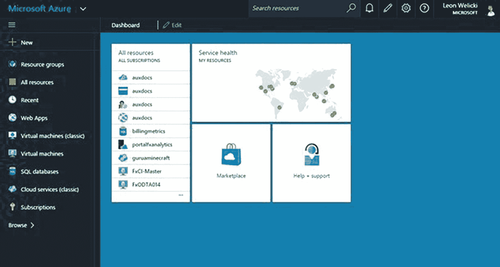
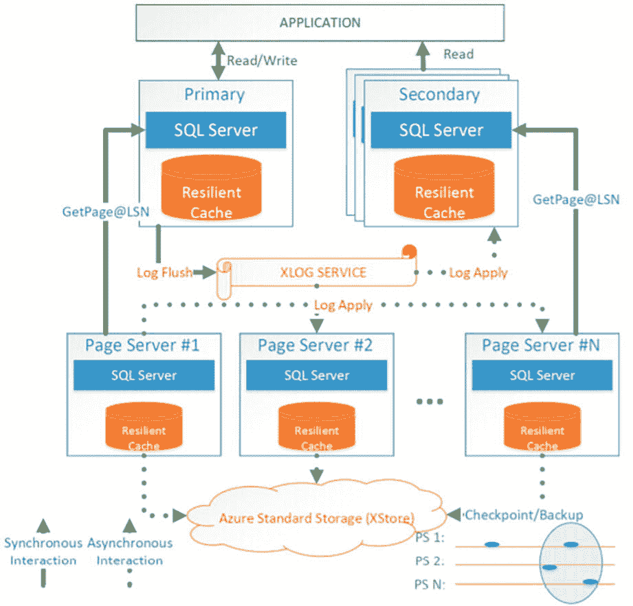

# Azure SQL：安全演进与工程创新

## 高级数据安全与 ILDC 团队

除了为 Azure SQL Database 添加性能服务外，该团队还希望为安全创建新体验。Microsoft 于 1991 年在以色列成立了美国本土以外的第一个研发中心，称为 Microsoft 以色列开发中心（ILDC）。您可以在 [`https://www.microsoftrnd.co.il/`](https://www.microsoftrnd.co.il/) 了解更多关于 ILDC 的信息。

2014 年，Azure SQL 团队转向 ILDC，以更深入地研究安全问题，组建了一个名为 *Azure SQL 安全中心* 的团队。据原始成员之一 Ron Matchoro 称，该团队成立之初的职责是研究审计、数据屏蔽、漏洞评估和威胁防护技术等安全主题。

这项工作为 Azure SQL 和 SQL Server 带来了多项创新。该团队于 2015 年率先在 Azure SQL 中实现了 *动态数据屏蔽* 的概念，并在 SQL Server 2016 版本中发布（有关动态数据屏蔽的更多信息，请访问 [`https://learn.microsoft.com/sql/relational-databases/security/dynamic-data-masking`](https://learn.microsoft.com/sql/relational-databases/security/dynamic-data-masking)）。

随后，团队通过增强审计功能（SQL Server 已有一个名为 SQL Server Audit 的概念）以用于 Azure SQL，以及提供执行漏洞评估的方法（这也被引入 SQL Server Management Studio），从而进一步加速发展。ILDC 还投资研究了数据分类的概念，该功能现已存在于 Azure SQL 和 SQL Server 中。

或许最大的投资领域是*威胁防护*。其概念是利用云的力量来检测对 Azure SQL 部署的潜在威胁并提醒管理员。这包括检测*SQL 注入*攻击等概念。此功能于 2017 年随 Azure SQL 正式发布（GA），作为**高级威胁防护 (ATP)**。2019 年，团队将一系列功能组合在一起，包括 ATP、漏洞评估和数据分类，称为**高级数据安全 (ADS)**。这些功能后来被重新命名并扩展到**Microsoft Defender for Cloud** 中，后者涵盖了从本地到云的 SQL 保护。您将在本书的第 6 章了解更多关于 Microsoft Defender 的信息。如今，ILDC 继续与我们在雷德蒙德的团队合作，为 Azure SQL 提供新的安全功能。

## 一个名为 Ibiza 的未来之窗

大约在 2014 年，Microsoft 也决定当前的 Azure 门户体验需要新面貌（是的，又一次）。项目**Ibiza**是一个全新外观和设计的 Azure 门户。这实际上是 Azure 门户的第四代。Ibiza 门户早期也被称为“预览门户”。这个新门户使用了一个称为*blades*的概念作为用户体验界面。用户很早就报告说，这个门户更可靠、速度更快，并且整体用户体验更好，包括一个仪表板、固定项并支持各种 Azure 服务。

图 1-9 展示了 2015 年发布时的 Ibiza 门户。如今它简单地被称为**Azure 门户**（几乎任何人都可以通过 portal.azure.com 访问）。

图 1-9

原始的 Ibiza 门户

此门户是当前 Azure 门户的*基础*，但经过了许多增强和不同的外观与感觉，您将在本书的各章节中看到。

## Azure 的新工程模型

自 SQL Azure 推出以来，Microsoft 内部就存在一种独特的体验。对于 SQL Server，工程团队主要专注于设计和构建新版本。他们在构建新功能或解决问题时绝对会采纳客户反馈，但他们的视角主要来自反馈论坛或 Microsoft 技术支持。

随着服务的推出，工程团队现在负责 SQL Server 在云端的运维。他们构建软件，同时也管理数据中心的运营。虽然其他团队负责数据中心的整体运营，但 SQL Azure 工程团队负责 Azure SQL Database 服务的运行状况、成本和运营。这涉及所有类型的主动监控以确保健康和可靠性。但这也意味着团队负责更新驱动服务的所有幕后软件。

SQL Azure 工程师现在参与了*实时站点*体验，这在今天可以被视为一种*DevOps 模式*。如果发生中断，SQL Azure 工程团队会直接参与解决问题。随着时间的推移，这些经验推动了创新和自动化。Azure SQL Database 生态系统背后大部分的功能都是为了避免问题的手动干预而构建的。甚至为 Azure SQL Database 和 SQL Server 引入的新功能也源于团队的实时站点经验，这些经验确保了服务的健康、应用程序的性能以及数据库的可靠性和可用性。Peter Carlin 描述了实时站点的好处：“……基本上我们过去 5 年所构建的一切都是由 live site 的经验教训驱动的。在很多方面，我们一开始并不知道如何运行我们自己的产品，一旦我们意识到我们让它变得多么困难，就可以做出改变使其更容易运维——从而使所有 SQL DBA 受益。”

正如 Rohan Kumar 所说，“我们最大的挑战之一是团队文化。我们需要创建一个不仅能构建出色软件，还能在运维上运行它的团队。”

到 2015 年，Azure SQL Database 已凭借 v12 拥有了面向未来的稳健架构，并通过创新为性能和安全增加了价值。随着新客户使用该服务构建应用程序，反馈和 Live Site 经验推动了未来的创新，无论是对于架构还是新的部署模型。

## 拓展 Azure SQL 数据库的可能性

当我们宣布推出基本、标准和高级版本，并逐步淘汰网页版和商业版时，我们面临一些客户（主要是独立软件供应商）带来的两难困境。网页版和商业版仅对存储收费，不涉及计算资源，但性能无法预测。而基本、标准和高级版本则按 DTU（数据库事务单位）收费，而非仅存储。一些独立软件供应商希望托管大量数据库（有时多达数千个）以支持他们的应用程序，其中许多是软件即服务（SaaS）应用。新的按 DTU 计费的版本模式将变得成本高昂。并非所有数千个数据库都需要相同的 DTU 容量，但更重要的是，这些数据库所需的 DTU 使用量可能差异很大。支持所有这些数据库并提供所需性能的唯一方法，是为任何数据库所需的最大 DTU 付费。

大约在 2014 年，产品经理 Morgan Oslake 和 Tobias Ternstrom 被指派寻找解决方案，据 Morgan 回忆，“我们（SQL DB）需要为拥有数十、数百、数千或更多数据库的 SaaS 独立软件供应商提供一种价格性能优化的解决方案。” Tobias 提出了名为 `Malmo` 的项目（正如 Morgan 回忆的那样，“……这个名字的灵感来源于瑞典城市马尔默的快速增长和人口激增。无论如何，Malmo 的概念旨在更高效地容纳多数据库应用的突发流量事件”）。团队迅速推进，推出了一项将数据库分组在一起的功能的私人预览，称为 `弹性池`。我们在 2015 年 4 月转为公开预览，并于 2016 年正式发布。请阅读公告：[`https://azure.microsoft.com/updates/azure-sql-database-supports-large-numbers-of-databases-for-saas-providers/`](https://azure.microsoft.com/updates/azure-sql-database-supports-large-numbers-of-databases-for-saas-providers/)。

弹性池允许开发人员将数据库分组到一个池中，按弹性 DTU 或 `eDTU` 消耗和付费。您将在本书的第 2 章了解更多关于弹性池工作原理的内容。提供弹性池选项也有助于逐步淘汰和移除网页版和商业版模式。

随着新版本、Sterling 架构、DTU 和弹性池的推出，客户采用 Azure SQL 数据库所需的许多条件已经具备。然而，一些使用 SQL Server “盒装”产品的客户仍持保留态度。通过调查和与这些客户交流，我们发现 Azure SQL 数据库的 `功能范围` 未能满足他们的核心需求。到 2016 年，我们决定需要开发另一个选项，以使更多客户能够采用 Azure SQL。

## 将客户迁移到云端

凭借从事自动调优的 MDCS 团队的成功经验，我们的团队转向他们开展另一个项目，以帮助减少从 SQL Server 实例迁移到 Azure 的阻力。MDCS 团队的负责人之一 Drazen Sumic 告诉了我这个项目的起源。他说：“我们 Azure SQL 的负责人之一 Lindsey Allen 在 2016 年从 Microsoft Ignite 大会返航的航班上，收到了大量关于 Azure SQL 的反馈，随后萌生了一个 `提升` 客户上云的想法。” 到 2016 年 12 月，MDCS 团队正在开展名为 `CloudLifter` 的项目。

到 2016 年，Azure 虚拟机已提供多种选择来部署完整的 SQL Server 实例。然而，用户仍须自行管理客户操作系统和 SQL Server 的方方面面。当时没有 Azure 服务能提供平台即服务（PaaS）的某些优势，同时 `感觉` 像是一个 SQL Server 实例。这正是 Lindsey 向 Drazen 和 MDCS 团队提出的构想。团队必须找到一种方法，在 Azure 的 PaaS 架构内部署和 `暴露` 一个 SQL Server 实例，包括与 Service Fabric 的集成。然后，用户可以连接到该 SQL Server 实例，并像使用本地或 Azure 虚拟机中的常规 SQL Server 一样使用它。此外，新服务仍需提供 PaaS 的优势，例如内置的高可用性和服务级别协议（SLA）。

团队在 2017 年几乎全年都在进行一项新服务的私人预览计划，该服务名为 `Azure SQL Database 托管实例`（或常简称为托管实例）。许多 MDCS 的成员参与了这个项目，包括 Borko Novakovic、Jovan Cukalovic、Branko Kokanovic 和 Milan Novakovic。托管实例于 2018 年 3 月进入公开预览阶段，首批层级的正式发布公告在 2018 年 9 月的 Microsoft Ignite 大会上宣布（您可以阅读公告：[`https://azure.microsoft.com/blog/azure-sql-database-managed-instance-general-purpose-tier-general-availability/`](https://azure.microsoft.com/blog/azure-sql-database-managed-instance-general-purpose-tier-general-availability/)）。

尽管雷德蒙德的许多成员，包括 Lindsey Allen、Peter Carlin 和 Alexander Vorobyov，在这个项目中发挥了重要作用，但这个项目对于 MDCS 的 SQL 团队来说是一个重要的里程碑。据 Drazen 说，“是的，这是迄今为止由塞尔维亚团队主导的最大项目。我们为此感到自豪，也感谢这份信任。之前的努力（例如 SQL 2016 版本中的查询存储）同样重要，但与这个项目相比，它们属于较小的功能。”

托管实例解决了云采用的另一个方面的问题，但处理超大型企业级工作负载的能力对团队来说仍然是一个挑战。

## 苏格拉底项目走向超大规模

2015 年秋季，当时实际上负责 SQL Server 和 Azure SQL 工程团队的 Rohan Kumar 正在召开一次会议，与他的许多高级员工讨论最近发生的一个涉及客户的“在线站点”事件。会上，他向在场人员提出了一个问题：“如果我们必须从头开始为 Azure SQL Database 构建一个架构，那会是什么样子？”这并不是说当前的 Sterling 架构不好。事实上，Sterling 架构让 Azure SQL 得以显著发展。然而，团队认为，如果我们想真正运行非常大规模的关键任务工作负载，可能需要一些不同的东西。一些我们可以构建在现有 Sterling 架构之上的东西。“我们如何为云端的 SQL 提供无限制的可扩展性”是 Rohan 给团队的使命。

当时在场的人之一是 Cristian Diaconu，他是 SQL Server Hekaton 项目（内存 OLTP）的主要工程师之一，发挥了关键作用。Cristian 谈到了那些早期与 Rohan 的会议：“Rohan 不断强调，他希望我们着眼于长期构建，要有更强的架构持久性，并且是我们能够引以为豪的东西，因为它在行业中是与众不同的。”

那次会议引发了一系列关于可能的新架构的讨论，参与讨论的工程领导者包括 Hanuma Kodavalla、Tomas Talius、Donald Kossman、Justin Levandovski、Phil Bernstein、Peter Byrne、Peter Carlin 以及最终的工程负责人 Naveen Prakash。

> 注意
> 你可以在这个项目撰写的白皮书中看到更全面的团队成员和贡献者列表：[`https://www.microsoft.com/en-us/research/uploads/prod/2019/05/socrates.pdf`](https://www.microsoft.com/en-us/research/uploads/prod/2019/05/socrates.pdf)。

到 2016 年 5 月，团队获得了资金，将其设计推进为一个成熟的项目。他们将其命名为 *Socrates*（Cristian 说：“...当时我遇到了许多在这方面经验远比我丰富的人，于是我意识到我所拥有的只有问题——因此得名苏格拉底”）。

苏格拉底的概念是通过分离日志记录和缓存服务（例如页面服务器）等服务，在 Azure 中构建一个高度可扩展的架构。原始的苏格拉底架构如图 1-10 所示。

图 1-10：苏格拉底架构

团队迅速行动，将他们的设计转化为可工作的代码。到 2016 年 12 月，他们已经有了一个工作原型。然而，这个架构并非一个容易实现的简单项目，因此直到 2018 年 9 月才推出公开预览版。新产品的名称将被命名为 `Azure SQL Database Hyperscale`（我们技术上称之为 `Hyperscale 服务层级`）。到 2019 年 5 月，Hyperscale 已成为一项正式发布的服务（你可以在 [`https://azure.microsoft.com/updates/azure-sql-database-hyperscale-support-for-single-databases-is-now-available/`](https://azure.microsoft.com/updates/azure-sql-database-hyperscale-support-for-single-databases-is-now-available/) 阅读公告）。

Hyperscale 堪称将 Azure SQL 的地位提升到了一个新高度，甚至在微软内部也是如此。观看 Rohan Kumar 在 Microsoft Inspire 2019 大会上与 Satya Nadella 一起首次演示 Hyperscale 的主题演讲（[`https://youtu.be/WtoU8gugP5g`](https://youtu.be/WtoU8gugP5g)）。自那时起，Hyperscale 已取得了突飞猛进的发展，并已成为许多开发人员为 Azure SQL Database 选择的“默认”方案。在本书的后续部分，你会看到 Hyperscale 的身影。

## 当下的 Azure SQL

Azure SQL 从 CloudDB 到 Hyperscale 的演进历程，对于 SQL 团队和微软而言是一段非凡的旅程。2020 年 2 月 1 日，标志着 Windows 和 SQL Azure 正式运营十周年。

到那时，我们已经发布了三个重要的功能：`vCore 购买模型`、`服务层级`和 `serverless` 数据库。`vCore 购买模型` 更清晰地展示了你的应用程序使用了多少 CPU 资源以及相应的计费情况。`服务层级`对功能和资源限制进行了分类，分别称为通用型、业务关键型和超大规模型（仅适用于 Azure SQL Database）。`serverless` 数据库（你将在下一章了解更多内容）提供了一种新的 `自动扩展` 计算资源的方法，现已成为 Azure SQL Database 未来的重要基础。

自那以后的四年里，我们还为 Hyperscale 提供了增强功能、更多核心数、更大存储空间、新一代硬件、适用于虚拟机的新 Azure 存储选项、更多冗余选项以及新的监控体验。在阅读本书的剩余部分时，你将了解到所有这些内容。

此外，在此期间，我们的团队内部必须从最初的 RDFE 架构迁移，以便将我们的 Azure SQL 服务部署到现代的 ARM 架构或 `PaaS v2` 上。迁移到这种架构为我们提供了与现代虚拟机相同的好处，包括规模集、更快的磁盘、负载均衡器、`多网卡` 网络以及多个可用区等。这是一个庞大的项目，但所有操作都对 Azure SQL 服务的用户进行了抽象。

在过去的两年里，我们加速为 Azure SQL 构建新功能，特别是面向开发者的功能，其中包括人工智能以及与 Microsoft Fabric 的新集成。我们还创建了一种名为 Azure Arc 的新的云连接方法。这些都超越了传统关系型数据库的范畴，这也是为什么本书的最后一章，第十章，恰当地命名为“超越关系型数据库”。

Azure 本身已经从仅在三个国家拥有少数几个数据中心，发展到在全球 140 个国家提供 60 个区域（另有 18 个新区域正在建设或规划中）。

> 提示
> 如果你想查看全球 Azure 区域的交互式可视化图表，请访问 [`https://datacenters.microsoft.com/globe`](https://datacenters.microsoft.com/globe)。

Azure 的体验包括一个强大的跨平台命令行界面 `az` CLI（在本书的后续部分你会看到 `az` CLI 的用法）以及对 Azure 门户的增强。

始于在裸机服务器上共享的、最大仅支持 10GB 的数据库，如今已发展成为业界一股强大的力量，以及云端数据服务的未来，这就是 `Azure SQL`。

Azure 和 Azure SQL 已为未来更宏大的事业做好了准备。Azure SQL 可以成为 SQL Server 上云的绝佳目的地。我对此深信不疑，这也是我决定撰写本书的原因。本书旨在帮助你了解如何成功地进行 Azure SQL 之旅。通往成功之路的第一步是进一步理解 Azure 和 Azure SQL 的基础。当我说 Azure SQL 这个短语时，指的是什么？Azure SQL 有哪些选项？我何时以及为何会选择其中一个而非另一个？请继续阅读，获取这些基本问题以及更多问题的答案。

## 本章小结

在本章中，你了解了微软一个小项目如何发展为构建云数据库服务，并最终成为当今业界领先的 Azure SQL 数据库的非凡历程。

你看到了 Azure SQL 如何从数据库服务起步，并扩展到虚拟机和托管实例的历史。你从该服务的创建者那里了解了他们如何以及为何为云构建 SQL。

了解 Azure SQL 的起源可能很有趣。就像读一个故事。但现在你需要开始学习 Azure SQL 是什么以及如何使用它。下一章将是你学习 Azure 和 Azure SQL 基础知识的路径。

