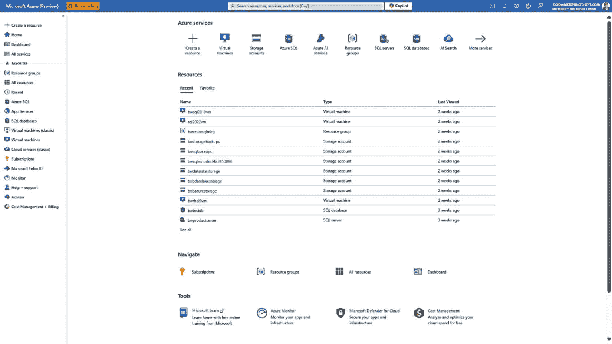
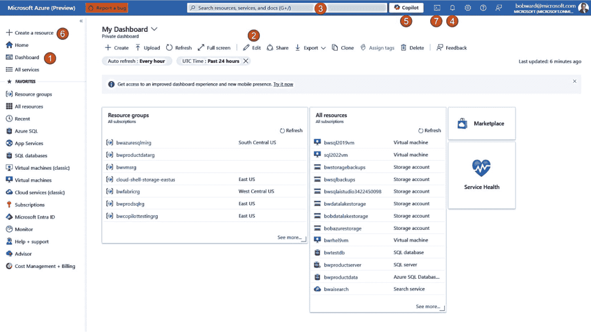
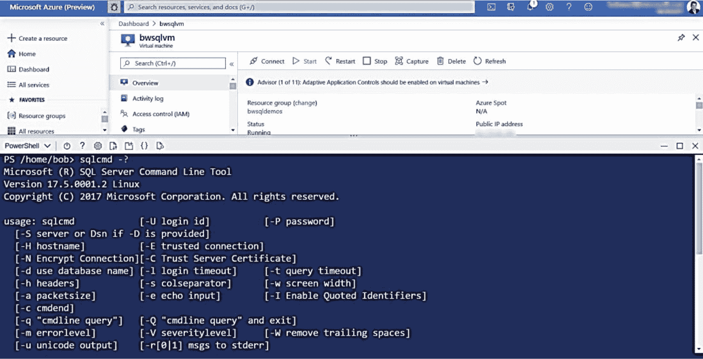
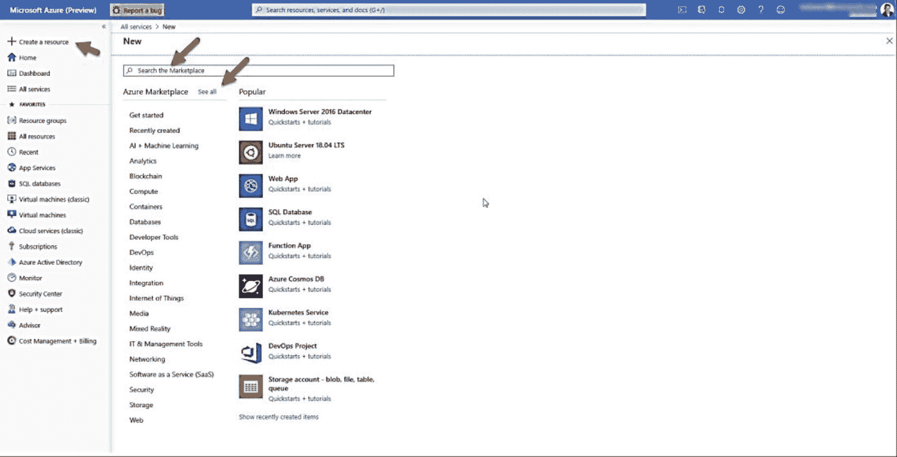
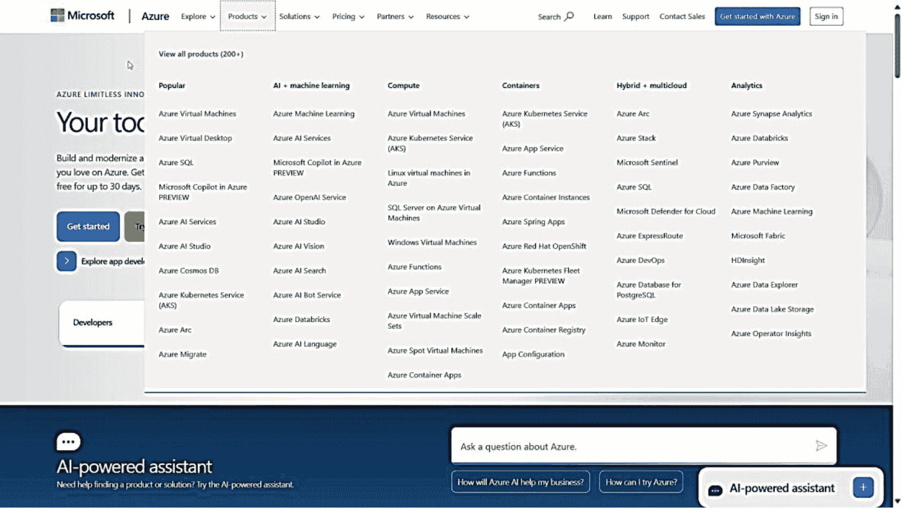
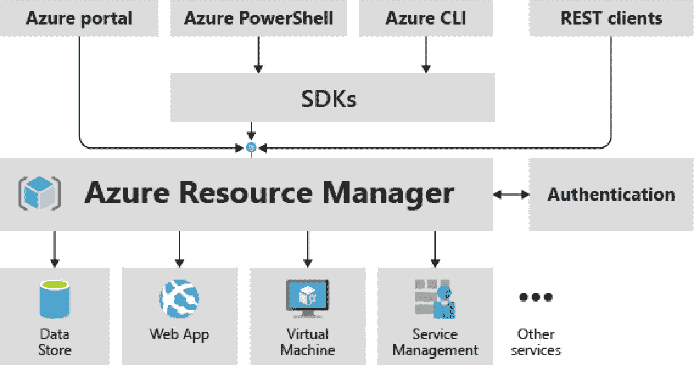

# 2. 什么是 Azure SQL？

“鲍勃，什么是云？” 我清晰地记得，我美丽而才华横溢的妻子金杰有天晚上走进厨房时这样问我。我停顿了一下，准备给出一个精妙而周全的回答，然后说道：“嗯，你看，云就是……” 十五分钟后（根据金杰的回忆——我觉得才几分钟），金杰礼貌地打断我说：“呃……我想要的是那种简明扼要的答案？” 我愣住了。云是一个如此复杂的话题，并且提供了这么多功能，怎么能用如此简单的东西来定义呢？我不能就此作罢，于是花了几天时间研究一个更简单但仍能定义云的答案。但我也想确保金杰知道“什么是 Azure？”这个问题的答案。

结果微软在文档中给出了答案，网址是 `https://azure.microsoft.com/overview/what-is-azure/`。Azure 被定义为“……一套不断扩展的云服务，帮助您的组织应对业务挑战。它提供了一个广阔、全球性的网络，让您能使用喜爱的工具和框架自由地构建、管理和部署应用程序。” 我自豪地向妻子展示了这段文字，以为我已经提供了她想要的简单答案。她眼中闪着光芒（她经常这样），说道：“这当然令人印象深刻，但是什么呢？” 还得是我的 CEO，萨提亚·纳德拉来救场。他简单地说道：“Azure 是世界计算机”（参见他在 Build 2018 主题演讲中的原话，网址：`https://news.microsoft.com/speeches/satya-nadella-build-2018/`）。

然后我把这句引述给妻子看。她回应道：“对了。我懂了。如果你没有自己的电脑，就用 Azure。直接用云就好了”（也许我们该雇用她）。这就是 Azure 的简而言之。Azure 定义了并提供了云计算的承诺，包括以下方面：

*   横向扩展，而非只能纵向扩展
*   按需增减容量
*   按使用量付费
*   大力投入自动化以降低成本

注意
微软在 `https://learn.microsoft.com/training/paths/microsoft-azure-fundamentals-describe-cloud-concepts/?WT.mc_id=azureportalcard_Category_overview_-inproduct-azureportal` 提供了一门关于云计算概念的免费培训课程。您还应该知道，这门课程是您在 `https://learn.microsoft.com/training/browse/?products=azure` 可以找到的 400 多门免费 Azure 培训课程套件的一部分。

在定义“什么是 Azure SQL？”之前，我认为让您了解更多 Azure 的基本要素很重要，因为我在本书的其余部分会使用本节中的术语。

## Azure 生态系统

为了正确理解 Azure SQL 的所有要素并完成本书中的示例，了解与 Azure SQL 无关的 Azure 的某些方面至关重要。我称之为 Azure 生态系统。这包括 Azure 帐户和订阅、Azure 门户和 API 等接口、资源管理、区域以及服务级别协议 (SLA)。本节并非对该主题的全面讨论。我将为您提供足够的信息（附带参考资料），以便您在部署和使用 Azure SQL 服务时，能够理解 Azure 提供的术语和系统。

### Azure 帐户、租户和订阅

要开始使用 Azure SQL，您需要了解的最基本概念之一是 Azure 帐户。使用 Azure 做任何事情都需要 Azure 帐户。您可能为一家已经基于您的组织为您创建了帐户的公司工作。如果没有，您可以按照 `https://azure.microsoft.com/free` 上的文档自行创建一个。

注意
虽然您可以使用免费试用帐户部署 Azure SQL 资源，但该帐户的额度可能不足以完成本书中的所有示例。好消息是，我们有专门针对 Azure SQL 的免费优惠和试用。

帐户是用于分配一个或多个订阅所有者或成员的身份。Azure 帐户是 Azure 租户的成员。租户通常由组织创建，并以 Microsoft Entra（前身为 Azure Active Directory）目录的形式呈现。每个帐户在一个租户中是唯一的，但可以是该租户内多个订阅的成员或所有者。

订阅用于管理计费和 Azure 资源。在本书中，我不会重点讨论 Azure 中的计费细节，但我会谈论 Azure SQL 服务各种计费方式。您可以在 `https://learn.microsoft.com/azure/cost-management-billing/cost-management-billing-overview` 阅读更多关于 Azure 管理成本和计费的信息。

订阅是 Azure 中一个非常重要的概念。Azure 资源和对资源的访问权限是通过订阅管理的。您将在本书中学习如何访问资源和使用 Azure 订阅。在您的组织中，您可能是许多不同订阅的成员，但在每个订阅中拥有不同级别的访问权限。您会发现，某些 Azure 资源名称在订阅范围内是唯一的（而其他名称在 Azure 资源组范围内是唯一的，或者在整个 Azure 系统中是全局唯一的）。

订阅还提供了一种在组织内组织资源的便捷方法（例如生产环境与非生产环境）。还有各种订阅优惠，决定了您如何为 Azure 服务付费。最基本的订阅优惠是“即用即付”，这意味着您按月或有时按小时支付订阅中资源的费用。还有其他优惠，包括免费试用、企业协议 (EA)、云服务提供商 (CSP)、企业开发/测试、即用即付开发/测试以及 Visual Studio 订阅者的每月 Azure 额度。您可以在 `https://azure.microsoft.com/pricing/purchase-options` 了解所有这些选项。

注意
我写了一篇博文，涵盖了通过 Azure SQL 节省成本的各种方法，网址是 `https://www.microsoft.com/en-us/sql-server/blog/2024/02/15/how-sql-developers-can-maximize-savings`。

Azure 还有一个管理组的概念，它允许您组织和设置策略，并对组织中的一组订阅进行访问控制。

Azure 生态系统中一个适用于帐户、管理组和订阅的重要安全概念是 Azure Policy。Azure Policy 是一个系统，允许您或您的组织为管理组和订阅（或在更低层级，如资源组，您将在下面名为“Azure 资源管理器 (ARM)”的部分中读到）制定策略。Azure 中内置了一些策略示例，其他的可以由您创建。一个内置策略的示例是要求所有 Azure SQL 数据库启用透明数据加密 (TDE)。您可以在 `https://learn.microsoft.com/azure/governance/policy/overview` 阅读更多关于 Azure Policy 的信息。

### Azure 门户

如果 Azure 是全球的计算机，那么 `Azure 门户` 就是这台全球计算机的*用户界面*。你可能在第 1 章读到过 Azure 门户多年来有趣的演变史。如今，你可以通过网络浏览器（`https://portal.azure.com`，支持所有主流浏览器）或移动应用程序（`https://azure.microsoft.com/features/azure-portal/mobile-app/`）访问 Azure 门户。

图 2-1 展示了我的账户在最新版 Azure 门户体验中的 `主页`。

图 2-1
Azure 门户主页

注意
在本书中，我将展示各种 Azure 门户的截图。微软员工默认使用 Azure 门户的*预览版*来协助测试最新更新。在大多数情况下，你看到的 Azure 门户界面应该与此类似，但也可能存在一些差异。

我认为在本书以及你自己的使用过程中，你会看到 Azure 门户有若干重要功能。图 2-2 突出了其中一些功能。

图 2-2
Azure 门户使用要点

按照图 2-2 中的数字序列，来看这些 Azure 门户功能：

1.  `仪表板` – 选择仪表板以查看你*固定*的重要资源（几乎可以将 Azure 中的任何内容固定到你的仪表板）。

2.  `自定义`你的仪表板 – 选择`编辑`以移动你固定的资源，并在仪表板中进行组织。你可以拥有多个仪表板。

3.  `搜索` – 你将经常使用此功能来搜索和查找资源及 Azure 服务。

4.  `通知` – 在部署和管理 Azure 资源时，系统会提供关于进度、失败和完成事件的通知。

5.  `Copilot` – 使用此功能启动 Azure 中的 Microsoft Copilot。

6.  `快速创建` Azure 资源 – 选择此项可从流行的 Azure 服务快速创建资源。

7.  `Azure Cloud Shell` – 在门户体验中打开 PowerShell 或 bash 的命令提示符。

我天生是个“命令行”用户（我们这些从 20 世纪 80 年代开始从事计算机工作的人大多如此）。Azure Cloud Shell 简直太棒了！Azure Cloud Shell 随你的订阅提供，可通过门户访问，预装了许多工具（例如 `sqlcmd`），并提供免费存储空间，用作存放你文件的个人“硬盘”。图 2-3 展示了我账户使用 PowerShell 的 Azure Cloud Shell 示例。

图 2-3
Azure Cloud Shell

你可以在 `https://azure.microsoft.com/features/cloud-shell/` 阅读并了解更多关于 Azure Cloud Shell 的信息。

注意
微软在 `https://learn.microsoft.com/training/modules/tour-azure-portal/?WT.mc_id=azureportalcard_Category_Overview_-inproduct-azureportal` 提供了一个关于如何使用 Azure 门户的免费在线培训课程。

### Azure 市场

要部署或使用 Azure 服务，你需要用到 `Azure 市场`。该市场是你可以部署和使用的服务集合。微软作为*发布者*提供了市场中的许多服务（并非全部，但许多微软服务以 Azure 一词开头）。市场中还有由其他发布者（称为合作伙伴）提供的解决方案。

要查看微软在 Azure 市场中提供的服务列表，你可以选择门户中的 `快速创建` 资源选项，如图 2-4 所示。

图 2-4
门户中的 Azure 市场

此时，你可以通过关键词搜索市场、从类别中挑选或选择热门服务。如果你选择`查看全部`，你将获得市场中所有发布者提供的所有 Azure 服务的列表，并按类别组织。

微软发布的 Azure 服务也被称为`产品`。你可以在 Azure 文档站点 `https://azure.microsoft.com/` 上看到 Azure 产品列表，如图 2-5 所示。

图 2-5
Azure 产品

请注意此页面底部新增的 AI 助手，它可以帮助你查找关于 Azure 的答案*。*

### Azure API 和 CLI

几乎每个 Azure 服务都有自己的应用程序编程接口 (API)、协议（例如，Azure SQL 使用 TDS）和工具（Azure SQL 使用 `sqlcmd` 或 `SSMS`）。

然而，所有 Microsoft Azure 服务的一个共同点是表述性状态传递 (REST) API。`Azure REST API` 是服务端点，支持一组 HTTP 操作（方法），提供对服务资源的创建、检索、更新或删除访问。你可以将 REST API 视为跨不同 Azure 服务和基础功能（如 Azure 资源管理器）的 API 的*低级核心层*。你可以在 `https://learn.microsoft.com/rest/api/azure` 找到关于 Azure REST API 基础的更多信息。

注意
你将在本书后面看到 Azure SQL 提供了一种独特的方法来与 Azure 服务中的 REST API 集成。

你与 Azure 服务的 API 交互很可能会在更高的层面，使用诸如 .NET、Java 或 Python 等编程语言。或者，你可能会使用名为 `az` CLI 的 Azure 命令行界面 (CLI)。`az` CLI 是一个跨平台程序，用于对各种 Azure 服务和核心操作（如帐户和订阅）执行多种不同类型的操作。你可以在 `https://learn.microsoft.com/cli/azure/?view=azure-cli-latest` 获取关于 `az` CLI 的所有最新信息。`az` CLI 在底层使用的是 Azure REST API。

提示
你可以通过为任何 `az` CLI 命令使用 `--debug` 选项来查看来自 `az` CLI 的 Azure REST API 调用跟踪。

Azure 还提供了一系列用于管理 Azure 服务的 `PowerShell` cmdlet。你可以访问 Azure PowerShell 的中心枢纽 `https://learn.microsoft.com/powershell/azure`。

### Azure 资源管理器 (ARM)

我将 Azure 服务描述为某种你消费或*部署*的东西。你已部署的 Azure 服务实例可以被视为一个*资源*。从技术上讲，某些 Azure 服务在部署时会创建多个资源。例如，你可能部署一个 Azure 虚拟机，结果是部署了一个虚拟机资源，以及与该 VM 关联的其他资源，如网络和存储。

支持将 Azure 服务作为资源进行管理的系统被称为 `Azure 资源管理器 (ARM)`。`ARM` 不是你消费的服务。相反，它是一个支持你在 Azure 中部署和管理服务的系统。

每个像 `ARM` 这样的系统都基于*接口*。`ARM` 在 Azure 内外都提供了接口。你可能还记得第 1 章中提到的 `RDFE` 接口，它以前在 Azure 中使用（也称为*经典*模型）。`ARM` 是当今工具和 API（包括 Azure 门户）使用的主要系统。来自 Azure 文档 [`https://learn.microsoft.com/azure/azure-resource-manager/management/overview#consistent-management-layer`](https://learn.microsoft.com/azure/azure-resource-manager/management/overview%2523consistent-management-layer) 的图 2-6 展示了 `ARM` 的接口。

图 2-6
Azure 资源管理器接口

`ARM` 为所有 Azure 服务提供了一致性和管理方面的诸多优势，包括：

*   `资源组`

在 Azure 生态系统中，你会经常使用的一个对象是 `资源组`。资源组是你可以作为一个单元管理的资源的逻辑集合。每个 Azure 资源（例如，虚拟机或数据库）必须存在于一个资源组中，并且只能是一个资源组的成员。资源组具有元数据，包括区域位置（但组中的资源可以位于不同的区域）。

一个资源组总是与一个特定的 Azure 订阅相关联。请记住，我提到过 Azure 订阅与一个账户以及可能的管理组相关联。因此，你可以在账户、管理组、订阅、资源组或资源级别应用 Azure 策略。

在组级别管理资源的一个好处是删除操作。如果你删除一个资源组，与该组关联的所有资源也会被删除。因此，你可以将一个概念验证（`POC`）项目的所有资源关联到一个资源组中，然后在完成后删除该组，从而避免任何不必要的成本。

*   `基于角色的访问控制 (RBAC)`

`RBAC` 是一个授权系统，为 Azure 资源提供访问管理。`RBAC` 基于安全主体、角色和范围。安全主体是对象，例如与 Azure 订阅关联的用户。可以将安全主体视为类似于 SQL 主体（如登录名）。角色是基于类型（如所有者或参与者）的权限集合。范围是访问级别，如管理组、订阅、资源组或资源。你将在本书中看到 `RBAC` 的示例，包括特定于 Azure SQL 的 `RBAC` 对象。你可以在 [`https://learn.microsoft.com/azure/role-based-access-control/overview`](https://learn.microsoft.com/azure/role-based-access-control/overview) 阅读更多关于 `RBAC` 的内容。

*   `锁`

Azure 锁允许你防止用户意外删除或修改关键资源。例如，你可以创建一个资源组并应用一个锁，以防止任何用户删除该组中的资源。有效的锁类型是 `不能删除` 和 `只读`。

我的同事 Joe Sack 向我指出的一个很好的例子是，锁可以防止用户通过 Azure 门户意外删除数据库（但不能通过像 `SSMS` 这样的工具）。

你可以在 [`https://learn.microsoft.com/azure/azure-resource-manager/management/lock-resources`](https://learn.microsoft.com/azure/azure-resource-manager/management/lock-resources) 阅读更多关于锁的内容。

*   `模板`

`ARM` 是一个*声明式*系统。你通过陈述你的意图来使用 `ARM`，`ARM` 会完成其余工作。你通过 Azure 门户或 API 等接口声明你的意图。`ARM` 还提供了一种通过名为 `模板` 的 JSON 文件声明意图的接口机制。模板提供了一种一致、可重复且大规模部署资源的方法。我将在本书中向你展示可用于 Azure SQL 的模板示例。你可以在 [`https://learn.microsoft.com/azure/azure-resource-manager/templates/overview`](https://learn.microsoft.com/azure/azure-resource-manager/templates/overview) 阅读更多关于模板的内容。

注意
Azure 支持其他流行的框架来大规模管理资源，例如 `Bicep` ([`https://learn.microsoft.com/azure/azure-resource-manager/bicep`](https://learn.microsoft.com/azure/azure-resource-manager/bicep)) 和 `Terraform` ([`https://learn.microsoft.com/azure/developer/terraform/overview`](https://learn.microsoft.com/azure/developer/terraform/overview))。

*   `活动日志`

当你使用 Azure 门户或 API 与 `ARM` 交互以部署和管理资源时，你的活动或操作会被记录在一个名为 `活动日志` 的存储中。每个订阅都有一个 `活动日志`，记录针对与该订阅关联的资源的操作。`活动日志` 中的订阅级别事件是通用的（如 Azure 策略操作）或特定于资源的（如更新 Azure SQL 数据库）。你可以在 [`https://learn.microsoft.com/azure/azure-monitor/essentials/activity-log`](https://learn.microsoft.com/azure/azure-monitor/essentials/activity-log) 阅读更多关于 Azure 活动日志的内容。

## Azure Monitor

SQL Server 专业人员习惯于在 Windows 性能监视器、Windows 事件日志、Linux systemd 日志或 Grafana 仪表板等工具中查看指标和记录的事件。在本书中，你会看到 Azure 虚拟机将让你能够访问来宾操作系统*内部*的所有这些工具。

然而，鉴于 Azure 是你所有 Azure 资源的托管系统，如果有一个集中式系统来托管、查看和分析你所有 Azure 资源的*指标*和事件*日志*，那将是很好的。简而言之，这就是 `Azure Monitor` 所提供的功能。

你将在本书中进一步了解如何将 `Azure Monitor` 与 Azure SQL 服务结合使用。你可以在 [`https://learn.microsoft.com/azure/azure-monitor/overview`](https://learn.microsoft.com/azure/azure-monitor/overview) 阅读更多关于 `Azure Monitor` 的内容。

注意
在撰写本书时，一项名为 `数据库观察者` 的新服务正在公开预览中，它为 Azure SQL 数据库和 Azure SQL 托管实例提供了***大规模***的卓越监控功能。你将在本书的第 7 章中了解更多关于 `数据库观察者` 的内容。

