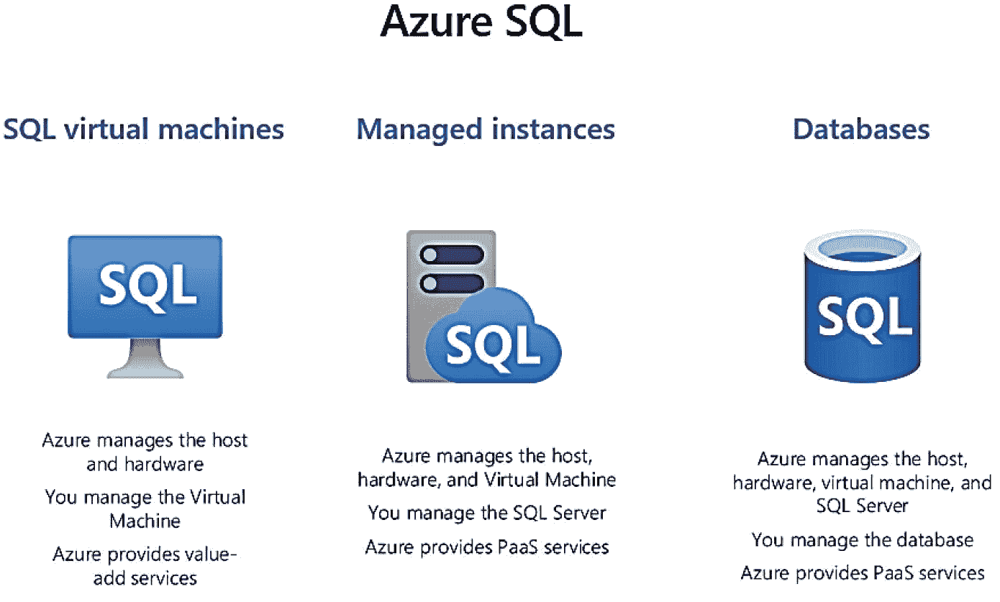
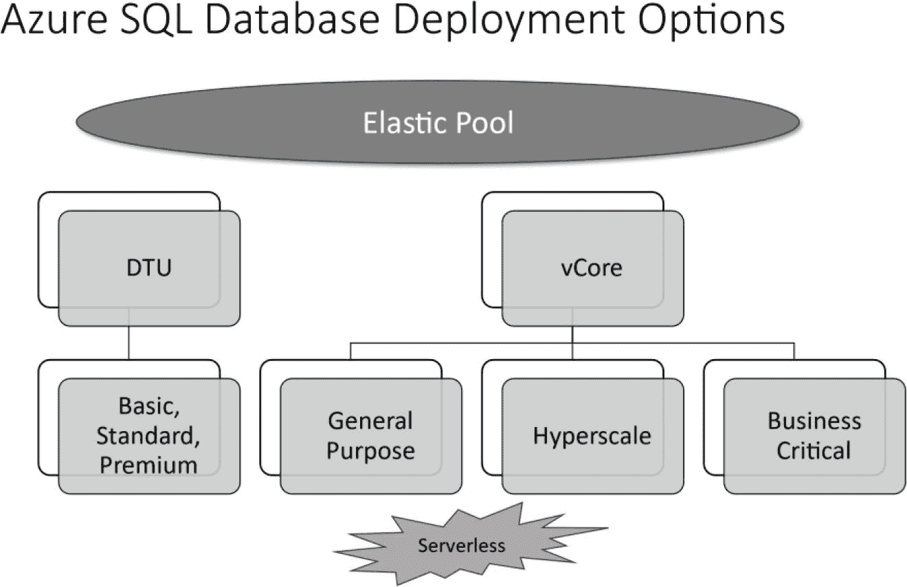
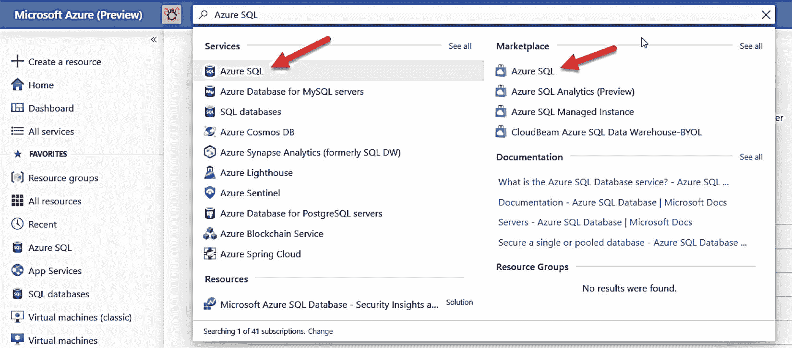
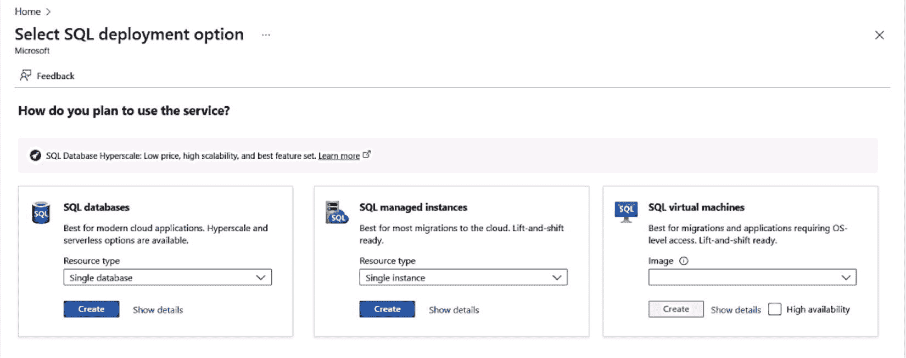
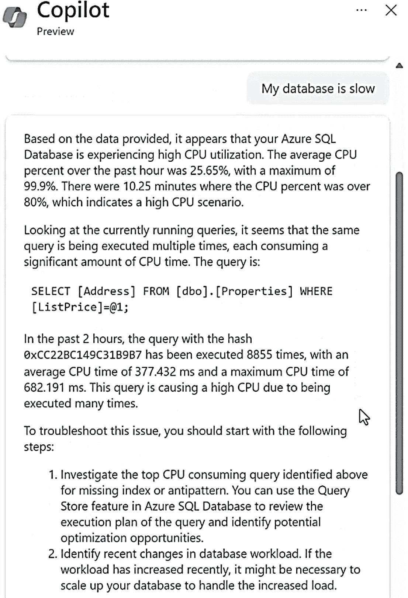
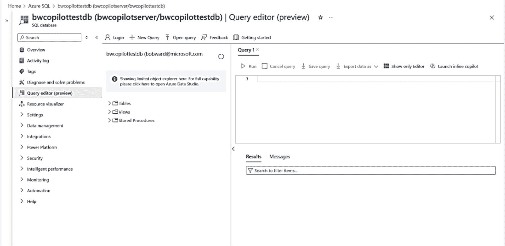
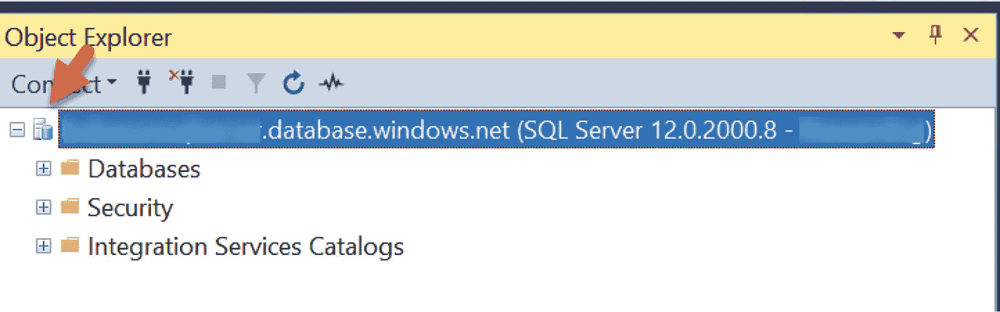
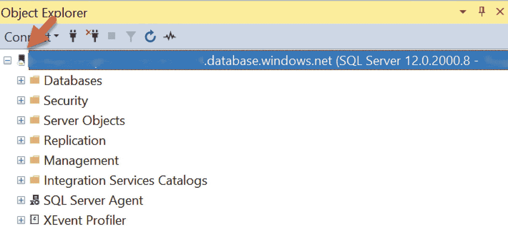

# 什么是 Azure SQL？

## Azure 区域和数据中心

世界的计算机存在于哪里？虽然想象 Azure literally 存在于“云端”可能很有趣，但 Azure 服务实际托管在名为`数据中心`的物理位置中。你可能还记得，在本书第一章中提到，Azure 最初拥有四个数据中心。

如今，数据中心并非你部署 Azure 资源时的选择。相反，数据中心在全球范围内被组织成`区域`。区域是通过低延迟网络连接的一组数据中心。在本书中你将看到，在部署 Azure SQL 服务时，你会选择一个区域作为部署目标。在撰写本书时，Azure 在全球 140 个国家拥有 60 多个可用区域。一些区域为特定客户设有特殊用途，例如`政府`或`国家`区域。例如，Azure 在美国境内提供了名为 Azure 政府区域（你可以在[`https://azure.microsoft.com/global-infrastructure/government/`](https://azure.microsoft.com/global-infrastructure/government/)深入了解 Azure 政府版）的特殊区域。

`地理区域`是由两个或多个区域组成的市场，旨在保留`数据驻留`和合规边界。为确保更高的弹性，区域有时会被设置得足够近以形成`配对`，但又保持足够的距离以应对自然灾害等场景。

此外，在某些区域内部，一个或多个数据中心被分组到一个`可用性区域`中，以便为 Azure 资源提供更高的可用性。每个区域拥有独立的电源、冷却和网络。你可以在[`https://azure.microsoft.com/global-infrastructure/regions/`](https://azure.microsoft.com/global-infrastructure/regions/)了解更多关于区域、地理区域和可用性区域的信息。`可用性区域`是使你在云中的 SQL 部署实现`高可用性`的关键组成部分。你将在本书第 8 章中详细了解这方面的内容。

## Azure 的信任、隐私与合规性

如果你正在考虑迁移到云端，毫无疑问，你会考虑信任、隐私和合规性问题。我能信任 Azure 上的我的数据吗？Azure 是否符合我所在地方政府和行业的合规要求？

Azure 拥有超过 100 项合规认证，涵盖政府法规和行业标准。请从[`https://azure.microsoft.com/overview/trusted-cloud/compliance/`](https://azure.microsoft.com/overview/trusted-cloud/compliance/)开始阅读，以了解 Azure 的所有合规标准。

假设你关注隐私。Azure 不仅提供功能来帮助你维护隐私和保护（在本书第 6 章中了解更多关于 Azure SQL 的产品），而且我们微软也致力于维护隐私标准以满足你的要求。

如果你的组织担心在 Azure 上信任你的数据，我建议你从[`https://azure.microsoft.com/overview/trusted-cloud/`](https://azure.microsoft.com/overview/trusted-cloud/)开始，深入了解微软如何在数据中心保护你的资产，以及你如何使用 Azure 工具和功能来保护你的部署。

## Azure 服务级别协议（SLA）

名为`服务级别协议`（`SLA`）的正式文件规定了适用于 Azure 的具体性能标准条款。`SLA`描述了微软向 Azure 客户承诺的具体性能和可用性标准。Azure 的各个产品和服务都有对应的`SLA`。`SLA`也规定了如果某项服务或产品未能达到其所遵循的`SLA`规范时的处理方式。Azure SQL 有特定的`SLA`，涉及可用性和性能，你将在本书中了解到这些内容。`SLA`是考虑使用 Azure 的主要原因之一，因为它是微软承诺保持你数据可用的保证。你可以在[`https://azure.microsoft.com/blog/understanding-and-leveraging-azure-sql-database-sla`](https://azure.microsoft.com/blog/understanding-and-leveraging-azure-sql-database-sla)阅读更多关于 Azure `SLA`的信息。

## IaaS 与 PaaS

我在本书第 1 章提到过`SaaS`、`PaaS`和`IaaS`等概念，但它们值得在此再次回顾。

`基础设施即服务`（`IaaS`）是一种由像 Microsoft Azure 这样的云服务提供商托管的计算系统。`IaaS`用户部署和管理虚拟机，而 Azure 则为硬件（包括主机服务器、存储和网络）提供托管基础设施。Azure `IaaS`服务通过 Azure 虚拟机呈现。Azure SQL 为`IaaS`客户提供了特定的选项。

`平台即服务`（`PaaS`）提供了`IaaS`的所有好处，并附加了通常抽象自底层操作系统或虚拟机的云服务优势。其理念是让开发人员或用户专注于应用程序，或者对于 Azure SQL 而言，专注于数据库或实例，而不是操作系统或虚拟机的细节。通常，`PaaS`服务为用户提供其他优势，包括内置的可扩展性、高可用性和安全性。Azure SQL 提供两种`PaaS`服务，包括托管实例和数据库。

云服务模型的另一个支柱是`软件即服务`（`SaaS`）。`SaaS`用户利用由云服务提供商托管的应用程序软件。许多`SaaS`提供商使用`IaaS`、`PaaS`或某种组合的云服务来支持其服务。Azure `IaaS`或`PaaS`服务是许多`SaaS`供应商的理想系统基础。`SaaS`应用程序是云服务的早期先驱，例如像 Hotmail 这样的电子邮件系统。如今，微软的`SaaS`应用程序包括著名的 Microsoft 365 应用程序套件。

## Azure SQL 产品线

了解了 Azure 生态系统以及`IaaS`/`PaaS`的概念后，Azure SQL 包含以下 Azure 服务：Azure 虚拟机上的 SQL Server、Azure SQL 托管实例和 Azure SQL 数据库。图 2-7 展示了 Azure SQL `产品线`的可视化图示。

图 2-7 Azure SQL 产品线

> **注意**
> 云端生活变化迅速。微软正在寻求更新云端 SQL 服务的方法，包括新的品牌和运行 SQL 的形式。请通过我们的博客[`https://devblogs.microsoft.com/azure-sql`](https://devblogs.microsoft.com/azure-sql)随时了解 Azure SQL 的最新消息。

Azure SQL 产品线从左到右的排列顺序有其用意。从左向右移动时，将现有 SQL Server 应用程序迁移到 Azure 的`摩擦`更高，而你对底层 SQL Server 所有方面的`控制`则更少。然而，这并非负面。向右移动，你会`增加数据库的 PaaS 或托管功能`。抽象掉 SQL Server 的细节是有好处的，正如你在详细了解 Azure SQL 数据库时将会看到的那样。在阅读 Azure SQL 的这些选项时，请牢记这些共同点：

*   相同的 SQL Server 引擎驱动着这些选项中的每一个。
*   你熟悉和喜爱的相同`T-SQL`语言适用于所有这些选项。
*   你今天用于 SQL Server 的工具和 API 都适用于所有这些选项。

### SQL 虚拟机

官方名称为 `SQL Server on Azure Virtual Machines`，这是您在 Azure 中部署 SQL Server 的 IaaS 选项。您可以将其理解为与您今天在虚拟机中使用 SQL Server 相同，只是 Azure 托管了您的虚拟机。Azure 负责管理主机服务器和硬件系统。它提供了接口，供您部署一个运行 Windows 或 Linux 的完整虚拟机以及您选择的 SQL Server。SQL Server 是一个完整的版本（企业版等），就像您在 Hyper-V 或 VMware 虚拟机中部署的一样。您的职责是管理客户操作系统和 SQL Server 环境的所有方面。但是，由于虚拟机在 Azure 中运行，因此有一些优势可以帮助您管理 SQL Server 和虚拟机。第 3 章完整讨论了 Azure 虚拟机上的 SQL Server。

### 托管实例

官方名称为 `Azure SQL Managed Instance`，这是一项比 Azure 虚拟机高一个级别的 Azure 服务。托管实例是作为 PaaS 服务部署的完整 SQL Server 数据库引擎实例，因此称为托管。Azure 提供主机服务器、硬件系统和虚拟机，让您可以专注于部署和管理 SQL Server 实例及一组数据库。在本书的后续内容中，您将看到 Azure PaaS 为托管实例带来的优势，尤其是在安全性、可扩展性和高可用性方面。

### 数据库

官方名称为 `Azure SQL Database`，这是一项比托管实例更高一级的 Azure PaaS 服务。Azure 提供了一种部署一个或多个数据库的方法，并负责处理主机、硬件系统、虚拟机和 SQL Server 实例。您将看到 Azure SQL Database 提供了多种不同的部署选项，以满足独特的数据库应用场景。Azure SQL Database 在安全性、可扩展性、智能性能和高可用性方面提供了 PaaS 优势。

#### Azure SQL 托管实例

我在本书第 1 章描述了 Azure SQL 托管实例（或称 `托管实例`）背后的历史和目的：使将 SQL Server 应用程序迁移到 Azure（又名 CloudLifter）变得更加容易。您绝对应该把托管实例视为您今天在本地安装的 SQL Server `数据库引擎实例`。安装或部署体验将完全不同，您将在本书第 4 章中学习到。设置基础架构以连接和联网的体验也会不同。但是，一旦您完成这些任务，使用托管实例的体验就会感觉像使用今天的 SQL Server 实例一样。

今天，当您安装 SQL Server 时，您运行的是单个 SQL Server `数据库引擎实例`。您可以在该实例中部署多个数据库，也可以部署多个实例。

对于托管实例，在成功部署后，您同样会在 Azure 基础架构中运行一个数据库引擎实例。然后，您可以自由执行实例级配置任务、创建数据库、加载数据，并开始连接和使用该实例。您被抽象化了关于托管实例如何部署的基础架构细节。然而，了解托管实例在 Azure 基础架构中如何部署的某些方面可能很重要。您将在本书第 4 章中了解更多关于托管实例部署的架构。

### 托管实例功能

由于托管实例类似于 SQL Server 的 `数据库引擎实例`，因此数据库引擎的功能范围几乎 100% 类似于 SQL Server。如果 SQL Server 的这些功能对您很重要，那么托管实例可能是最佳选择：

*   SQL Server Agent 作业
*   数据库邮件
*   跨数据库事务
*   SQL Server 复制
*   链接服务器
*   SQL CLR
*   DTC 事务
*   资源调控器
*   服务代理

这些功能不提供于 Azure SQL Database。

这不是完整的列表，我们正在不断添加新功能，以使托管实例尽可能接近一个完整的 100% SQL Server 数据库引擎实例。您可以在 [`https://aka.ms/azuresqlmitsqldiff`](https://aka.ms/azuresqlmitsqldiff) 查看托管实例与 SQL Server 之间差异的最新完整列表。

注意
这是 T-SQL 差异的详尽列表。请考虑在某些情况下这可能无关紧要。例如，创建和管理可用性组的 T-SQL 语法在托管实例中不存在。但是，如果您的要求允许，这可能没问题，因为托管实例可以自动为您部署和管理一个可用性组。

使用托管实例有主要优势，因为它是一项 PaaS 服务：

*   内置高可用性（包括可用性组）、自动备份、时间点恢复以及已删除数据库的恢复。但您也可以执行自己的原生备份（`COPY_ONLY`）和还原。
*   99.99% 的正常运行时间 SLA。
*   通过自动故障转移组实现跨 Azure 区域的 HADR。
*   可用区冗余。
*   灾难恢复的免费许可。
*   通过虚拟网络集成和专用链接网络实现安全隔离。
*   Microsoft Entra 集成。
*   Windows 身份验证。
*   简单易用的资源扩展选项。
*   无版本的 SQL Server，不断更新以获得最新更新和功能，同时也提供版本化实例以保持与 SQL Server 2022 的兼容性。

注意
您将在本书第 5 章中了解更多关于无版本和版本化 SQL Server 的含义。

*   抽象化主机和虚拟机环境的细节和维护。
*   托管实例的免费试用优惠。
*   与 Azure Monitor 和 Database Watcher 集成。
*   使用托管实例链接设置在线迁移策略或与 SQL Server 2002 兼容。
*   PaaS 安全功能，例如 Microsoft Defender for Azure SQL。您将在本书第 6 章中了解更多关于 Microsoft Defender for Azure SQL 的信息。

随着您阅读本书，您将更详细地了解托管实例的许多功能。

### 托管实例选项和限制

当您在虚拟机或裸机服务器上安装 SQL Server 时，通常会提供预配置的 CPU、内存和存储资源（大小和速度）。

部署托管实例时，您需要做出类似的选择以满足您的资源需求。这些选择始于一个称为 `服务层级` 的概念。对于托管实例，两个服务层级选择是 `常规用途` 和 `业务关键`。

这些层级选择将决定您的性能能力、资源限制，在某些情况下还决定功能能力。您将在本书第 4 章中看到有关如何选择这些层级的更多详细信息（您还会在 Azure SQL Database 中看到相同的服务层级名称，以及更多）。以下是 Azure SQL 托管实例每个服务层级的快速概览。

### 通用目的

通用目的是大多数托管实例部署的服务层级选择，“通用”一词也体现了其普适性。通用目的服务层级支持的 `vCores` 范围为 4 到 128 个（请记住，这类数字可能会随着我们为 Azure 添加更多功能而发生变化）。你可以将 `vCore` 视为托管实例的逻辑 CPU。托管实例的费用基于你选择的 `vCore` 数量（按固定小时成本计费）。

`vCore` 的选择会影响通用目的层级的其他容量选择或限制，包括最大内存、实例中数据库的最大存储容量以及资源速率，例如每秒输入/输出操作次数（`IOPS`）或日志写入吞吐量。

> **注意**：在 2024 年初，微软推出了一种名为 *新一代* 的新通用目的形式。新一代通用目的服务层级采用新架构，可提供更多 `vCores`（128）、更低的 `I/O` 延迟、更大的事务 `I/O` 吞吐量、更多的最大存储、每个实例可运行更多数据库，最重要的是能够独立于 `vCore` 选择来控制 `IOPS`。你可以在 [`https://aka.ms/sqlminextgen`](https://aka.ms/sqlminextgen) 阅读关于新一代的公告。

通用目的层级还通过 Azure 存储提供 *基本* 的内置高可用性（类似于故障转移集群实例），你将在第 8 章关于可用性的部分了解更多内容。

尽管托管实例拥有 SQL Server 几乎完整的功能集，但通用目的服务层级不支持内存中 OLTP。其原因之一是内存中 OLTP 的存储需求只能通过本地存储来满足。

> **注意**：列存储索引在通用目的服务层级中可用。

你可以在 [`https://aka.ms/sqlmiservicetiers`](https://aka.ms/sqlmiservicetiers) 阅读包括新一代在内的通用目的托管实例的所有容量和限制。

### 业务关键

业务关键层级拥有托管实例所需的全部最大容量。业务关键选择与通用目的层级具有相同数量的 `vCores`，但具有以下独特特点：

*   使用 Always On 可用性组实现具有副本的内置高可用性（包含一个免费的只读副本）
*   使用本地存储降低 `I/O` 延迟
*   支持内存中 OLTP
*   比通用目的层级更高的 `IOPS` 和 `I/O` 吞吐率（但新一代已大幅提高了其限制）

重要的是要知道，由于业务关键层级当前使用本地存储，其最大数据库大小小于通用目的服务层级。

一个区域内给定订阅的托管实例有一些限制（例如，`vCores` 总数）。你可以在 [`https://learn.microsoft.com/azure/azure-sql/managed-instance/resource-limits?view=azuresql#regional-resource-limitations`](https://learn.microsoft.com/azure/azure-sql/managed-instance/resource-limits%253Fview%253Dazuresql%2523regional-resource-limitations) 阅读有关这些限制的信息。

#### 托管实例池

托管实例的一个有趣方面是其部署架构，即为新建的托管实例构建的 *虚拟集群*。你将在本书第 4 章了解更多关于托管实例架构的内容。目前只需知道，这种部署方式可能导致部署新托管实例的时间比 Azure SQL 数据库长得多（但我们通过一种称为快速预配的概念使其比过去更快）（预期时间列表请参阅我们的文档 [`https://learn.microsoft.com/azure/azure-sql/managed-instance/management-operations-overview`](https://learn.microsoft.com/azure/azure-sql/managed-instance/management-operations-overview)）。此外，由于部署性质，托管实例的最小 `CPU` 选择是 4 个 `vCores`。

因此，我们允许使用 **托管实例池** 的概念，该功能在本书撰写时处于公开预览阶段。托管实例池提供了与托管实例许多相同的功能，但它允许更小的实例部署（2 个 `vCores`）并提供了更快部署实例的方法。你将在本书第 4 章了解更多关于托管实例和托管实例池之间的架构差异。若想立即了解更多信息，可以阅读文档 [`https://aka.ms/sqlmipools`](https://aka.ms/sqlmipools)。

#### 托管实例与 Azure 虚拟机上的 SQL Server

在阅读了关于 Azure 虚拟机上的 SQL Server 和 Azure SQL 托管实例的内容后，你可能已经清楚这些 Azure SQL 选项之间的主要区别。不过，让我快速总结一下，以便你决定选择哪个选项。

在以下情况下，Azure 虚拟机上的 SQL Server 是你的最佳选择：

*   如果你需要从现有的 SQL Server 安装**快速迁移**到 Azure。这实际上是将你的 SQL Server（很可能已经安装在某个虚拟机中）**提升并转移**到不同的虚拟机托管系统。你将在第 3 章中了解更多关于优化此体验和配置的信息。
*   如果你需要完整的 **SQL Server 盒装**功能，如 `filestream`、简单恢复模式数据库或 SQL Server Analysis Services（`SSAS`）。
*   如果你想要**完全控制操作系统和 SQL Server**。这包括对 SQL Server 版本回溯到 SQL Server 2008 的选择，以及 Windows、Linux 或容器的选择。

    > **提示**：在你认为绝对需要完全控制 SQL Server 版本之前，请*仔细研究托管实例的所有功能*。它可能已具备你 SQL Server 所需的一切。不再依赖特定的 SQL Server 版本或无需管理客户操作系统可能是一件好事！
*   **容量可能是一个因素**。如果你需要超过 128 个 `vCores`、870GB 内存或大于 32TB 的数据库。此外，根据你的部署选择，托管实例可能会限制事务日志速率或其他 `I/O` 速率。Azure 虚拟机上的 SQL Server 在引擎内部对 `I/O` 速率没有限制。唯一的限制是适用于虚拟机存储的 `I/O` 速率。

如果这些因素对你的需求不关键，那么使用 Azure SQL 托管实例有巨大的优势，因为它是一个具有完整 SQL Server 数据库引擎功能的数据库引擎实例，并结合了 `PaaS` 的能力。

#### 使用托管实例的客户

我经常被问到关于我们技术的一个问题是：“还有谁在使用这个？”对于托管实例来说，这是一个很好的问题。是否有人在使用托管实例，为什么使用？

其中一位客户是 **Komatsu**。小松公司在多个国家制造建筑和工业机械，并已采纳了进行数字化转型的计划。小松公司拥有庞大的本地 SQL Server 环境，并选择 Azure SQL 托管实例作为实现其数据平台现代化的云端方法。使用 Azure SQL 托管实例不仅符合他们利用云端进行整体数字化转型的规划，而且他们还发现了成本和性能上的改进。根据小松公司的说法，“我们确定 Azure SQL 数据库托管实例在可扩展性、成本和性能方面是我们的最佳选择。……我们看到了 49% 的成本降低和 25% 到 30% 的性能提升。”

你可以在 [`https://customers.microsoft.com/story/komatsu-australia-manufacturing-azure`](https://customers.microsoft.com/story/komatsu-australia-manufacturing-azure) 阅读完整的客户案例故事。

## Azure SQL Database

正如本书第 1 章所述，**Azure SQL Database**（前身为 SQL Azure）是*一切的起点*。尽管 Azure SQL Database 的部署数据库安装在实际的 SQL Server 实例上，但其核心理念是让您从实例的细节中抽离出来，专注于数据库本身。一个 Azure SQL Database 有时被称为**单一数据库**。这并不意味着您不会接触到 SQL Server 的感觉，正如您将在本书中看到的那样。

### Azure SQL Database 功能

Azure SQL Database 为您提供了最完整的平台即服务功能，包括*托管 Azure SQL 产品部署的最丰富选项*。与 Azure 托管实例类似，Azure SQL Database 使您能够访问核心 SQL Server 数据库引擎功能。然而，并非所有数据库引擎实例特性都可用。例如，列存储索引在 Azure SQL Database 中可用，但您无法创建 SQL Server Agent 作业。

使用 Azure SQL Database 有诸多主要优势，因为它是一个完整的平台即服务：

*   免费的数据库优惠（非试用版，而是伴随您的订阅终身有效）。了解更多请访问 [`https://aka.ms/freedboffer`](https://aka.ms/freedboffer)。
*   内置高可用性（包括可用性组）、自动备份、长期备份保留、时间点还原和已删除数据库的恢复。
*   高达 99.995% 的正常运行时间服务级别协议（阅读更多请访问 [`https://www.microsoft.com/licensing/docs/view/Service-Level-Agreements-SLA-for-Online-Service`](https://www.microsoft.com/licensing/docs/view/Service-Level-Agreements-SLA-for-Online-Service)）。
*   区域冗余。
*   通过活动异地复制和自动故障转移组实现跨 Azure 区域的高可用性与灾难恢复。
*   虚拟网络集成和通过专用链接支持实现的安全隔离。
*   Microsoft Entra 集成。
*   简单易用的资源扩展选项。
*   *无版本*的 SQL Server，持续通过最新的更新、优化、修复和功能进行更新。

> 注意
>
> 您将在本书第 5 章了解更多关于无版本 SQL Server 的含义。

*   从主机、虚拟机环境和 SQL Server 实例的细节与维护中抽离。
*   智能性能功能，如自动调优。您将在本书第 8 章了解更多关于自动调优的内容。
*   与 Azure Monitor 和 Database Watcher 的集成。
*   用于查询性能分析的 Azure 门户可视化工具。
*   平台即服务安全功能，如 Microsoft Defender for Azure SQL。您将在本书第 6 章了解更多关于 Microsoft Defender for Azure SQL 的内容。

您将在本书的后续部分了解更多关于这些功能及其他方面的内容。

### Azure SQL Database 选项与限制

部署 Azure SQL Database 比部署托管实例有相似但更多的选择，以及不同的资源限制集合。尽管您将在第 4 章看到更多关于如何选择这些选项和各种资源限制的细节，但在评估 Azure SQL Database 是否适合您时，回顾这些选择是值得的。

图 2-8 展示了 Azure SQL Database 选项的高层决策流程。

图 2-8 Azure SQL Database 选项

请注意，任何选项都可以是弹性池的一部分，但某些选项（如 Serverless）仅适用于常规用途和超大规模 vCore 服务层级。让我们来探索这些选项以及这个决策过程的每个部分。

#### 弹性池或单一数据库

您将决定是只需要一个单一数据库，还是将您的数据库包含在一个*弹性池*中。我将在本节后面详细讨论弹性池。请注意，Serverless 不适用于弹性池。

#### DTU 与 vCore

您需要做的第一个决策之一是关于 Azure SQL Database 的*购买选项*概念。尽管此选项也将决定您的资源容量和限制，但它极大地影响您为 Azure SQL Database 服务付费的方式。

您可以选择的一个选项称为**数据库事务单元**。正如我在本书第 1 章所述，我们引入了数据库事务单元概念，作为 CPU、I/O 和内存综合资源使用的逻辑度量概念。数据库事务单元的资源限制和容量选择称为基本、标准和高级（每个级别又有多个层级）。数据库事务单元模型的一个显著优势是简单性。您选择想要的性能级别，而我们则负责提供必要的核心和内存来满足您应用程序的需求。

Microsoft 建议大多数客户使用 vCore 模型，因此我在本书中不会花时间介绍数据库事务单元模型。如果您想了解更多关于数据库事务单元模型的信息，可以在 [`https://learn.microsoft.com/azure/azure-sql/database/service-tiers-dtu`](https://learn.microsoft.com/azure/azure-sql/database/service-tiers-dtu) 阅读更多内容。

vCore 模型与 Azure SQL 托管实例的模型非常相似，并且是推荐的购买模型。实际上，使用 Azure 门户默认会显示 vCore 选项。vCore 模型让您在付费资源（包括 CPU 和存储）的选择上拥有更多自主权。此外，vCore 模型允许您利用成本节约选项，如 Azure 混合权益许可（您可以在 [`https://learn.microsoft.com/azure/azure-sql/azure-hybrid-benefit`](https://learn.microsoft.com/azure/azure-sql/azure-hybrid-benefit) 阅读更多内容）和预留容量（您可以在 [`https://learn.microsoft.com/azure/azure-sql/database/reserved-capacity-overview`](https://learn.microsoft.com/azure/azure-sql/database/reserved-capacity-overview) 阅读更多内容）。

vCore 模型与 Azure SQL 托管实例的不同之处在于，您现在有三个*服务层级选项*：**常规用途**、**业务关键**和**超大规模**。

#### 常规用途服务层级

与托管实例类似，常规用途是许多 Azure SQL Database 部署的服务层级选择，因此称为*通用*。与托管实例不同，Azure SQL Database 支持两个常规用途选项，称为*计算预置类型*：**预配型**和**无服务器型**。

常规用途预配型服务层级支持从 2 到 128 个*虚拟核心*。您应该将虚拟核心视为您 Azure SQL Database 的逻辑 CPU。Azure SQL Database 根据您选择的虚拟核心进行计费（每小时固定成本）。

您选择的预配虚拟核心会影响常规用途的其他容量选择或限制，包括最大内存、数据库的最大存储以及 IOPS、I/O 延迟和事务日志写入吞吐量等资源速率。您可以在 [`https://aka.ms/sqldbgplimits`](https://aka.ms/sqldbgplimits) 查看常规用途预配型服务层级的这些限制详情。

常规用途预配层还有另一个选择，称为**硬件配置**。常规用途预配层的硬件配置选项包括 Gen5、Fsv2 系列和 DC 系列。此选择也会影响资源选项，如虚拟核心数量、处理器速度以及安全飞地等安全选项。

常规用途层级还提供基于 Azure Storage 的*基本*内置高可用性（可类比为故障转移集群实例），您将在关于可用性的第 8 章了解更多内容。

与 Azure SQL 托管实例类似，内存中 OLTP 等引擎功能在常规用途中不可用（但支持列存储索引）。

## 无服务器

通用类型的另一个计算层级选项是无服务器。你可能还记得本书第 1 章中关于无服务器的背景故事。`vCore` 模型仍然适用于 `Serverless`，但方式有所不同。

你将选择一个 `vCore` 的 *范围*，包括最小值和最大值（最小值可以小于 1 `vCore`）。Azure SQL Database 会根据应用在此范围内所需的 `vCores` 数量，自动 *扩展* 你的应用。`Serverless` 的优势之一是，你按秒为资源计算使用付费，这与预配层级中每小时固定的 `vCore` 成本不同。

注意

你可能需要更深入地了解我们如何计算 `serverless` 的账单。如果是这样，请使用我们的文档 [`https://azure.microsoft.com/pricing/details/sql-database/single/`](https://azure.microsoft.com/pricing/details/sql-database/single/) 并查看 **How is the compute bill calculated in serverless?** 主题的常见问题解答部分。

此外，`Serverless` 支持在数据库不使用时 *暂停* 的概念。如果在 **自动暂停延迟** 间隔（你可以配置）内数据库活动处于 *非活动* 状态，则不会产生计算费用，仅产生存储成本。这为拥有非 24/7 使用 Azure SQL Database 的应用的用户提供了惊人的节省成本的机会。我们发现一些构建新应用的客户具有自然的完全空闲时间或不同的计算规模需求时间。`Serverless` 为这些客户提供了天然的契合点。尽管 `Serverless` 的功能与预配层级相同，但资源容量和限制不同。我们已经看到 `Serverless` 模型成为许多使用 Azure SQL Database 应用的流行选择。

你可以在 [`https://aka.ms/serverlessvsprovisioned`](https://aka.ms/serverlessvsprovisioned) 查看 `Serverless` 和预配层级的详细比较以进行决策。

#### 业务关键型

与托管实例类似，业务关键型服务层级专为需要最高性能和可用性的应用程序而设计。业务关键型的差异化特点包括：

*   内置可用性，使用 `Always On Availability Groups` 的副本，包括读取横向扩展（附带一个免费的只读副本）。
*   使用本地存储的高速低延迟 I/O。
*   `In-Memory OLTP`。
*   比通用型更高的 `IOPS` 和 I/O 吞吐率。

## 超大规模

正如你在本书第 1 章中所读到的，`Socrates` 项目是 Azure SQL 工程团队创新的一个里程碑，后来以 `Hyperscale` 的形式推出。回顾过去，`Hyperscale` 这个名字可能不是我们的最佳选择。这是因为这个名字导致人们认为 `Hyperscale` 只适用于 Azure 中最大（也最昂贵）的数据库部署。

注意

你应该知道，在撰写本书时，我们一直在考虑对 `Hyperscale` 这个名称进行“重塑品牌”，以便开发人员和用户了解 `Hyperscale` 可以适用于任何应用程序。

我相信 `Hyperscale` 的三项创新现在可以让开发人员和用户将其视为 Azure SQL Database 的默认服务层级选择：

1.  我们已经移除了本书第一版中存在的所有针对 `Hyperscale` 的 Azure SQL 功能限制（仍有少数保留）。
2.  我们将 `Hyperscale` 的计算定价模型更改为 *更实惠的价格*。你可以在 [`https://techcommunity.microsoft.com/t5/azure-sql-blog/azure-sql-database-hyperscale-lower-simplified-pricing/ba-p/3982209`](https://techcommunity.microsoft.com/t5/azure-sql-blog/azure-sql-database-hyperscale-lower-simplified-pricing/ba-p/3982209) 阅读更多关于这个新定价模型的信息。
3.  `Hyperscale` 现在支持 `Serverless` 和弹性池。

考虑以下关于为什么 `Hyperscale` 可能比通用型或业务关键型更适合你服务层级的事实：

*   你现在拥有具有 `Hyperscale` 的自动扩展计算和自动扩展存储。你现在可以从最小的数据库和工作负载开始，并根据需要自动扩展到所需大小，无需更改代码。
*   `Hyperscale` 支持云中 SQL 最大的数据库大小。`Hyperscale` 数据库当前记录的上限大小是 `100TB` 和 `1TB` 事务日志。`Hyperscale` 数据库的自动数据库尺寸调整也非常快。

注意

我们构建的 `Hyperscale` 架构理论上可以支持 *无限* 的数据库和事务日志大小。

*   `Hyperscale` 现在支持你所需的最大 `vCore` 和内存大小。此外，**扩展操作所需的时间是恒定的**。我将在本书第 7 章中更多地讨论扩展。
*   读取扩展是真正的 *扩展*。你可以获得 **最多 30 个命名副本**。
*   **恢复** 操作 **无论大小都极快**。`Hyperscale` 使用数据库文件的快照备份来提供快速备份和非常快的还原。
*   你的 **事务日志吞吐量是独立的**，不依赖于你的 `vCore` 配置或 `Hyperscale` 拥有副本的事实。这是因为副本架构不依赖于 `Always On Availability Group` 技术。
*   **I/O 操作可以非常快**，特别是如果它们由 `Hyperscale` 实现的缓存系统提供服务。

作为一名终身的 SQL Server 引擎内部原理爱好者，我相信 `Hyperscale` 是 SQL 团队历史上最具创新性的工程成果之一（与 SQL Server on Linux 的惊人故事并驾齐驱，你可以在 *Pro SQL Server on Linux* 中阅读更多相关内容）。仅在本节中讨论 `Hyperscale` 并不能充分说明其价值，因此你将在本书中阅读到更多关于 `Hyperscale` 的内容。但请花几分钟观看这个视频，我在 SQL Server 工程团队的前同事（现已退休）Kevin Farlee 向 Microsoft Mechanics 团队展示了 `Hyperscale` 为何如此特别：[`https://youtu.be/Z9AFnKI7sfI`](https://youtu.be/Z9AFnKI7sfI)。

#### 弹性池数据库

正如我在本书第 1 章中讲述的那样，`Project Malmo` 变成了软件供应商的流行选项，称为 **SQL 弹性池**。弹性池的概念很简单，就是将一组 Azure SQL Database 分组，以降低成本并实现大规模数据库管理。

设想这样一个场景：你是一个软件即服务（SaaS）供应商，希望使用 Azure SQL Database。你决定为每个客户构建一个数据库，以隔离他们的性能和体验。你可能需要部署数千个数据库。

问题来了：当客户随时间推移的使用情况不尽相同时，你如何为每个客户的每个数据库决定使用哪个定价层？你有两个选择：

*   为所有数据库配置你认为可能需要的最大资源容量（如 `vCores`）。在这种情况下，你可能为所有数据库多付了钱。
*   为所有数据库配置较低的资源容量，这可以省钱，但可能会导致你根据使用情况不得不上下扩展特定数据库，从而导致停机时间。

弹性池允许你配置一个服务层级（`serverless` 不可用）、`vCore` 选择（`DTU` 也可以）和数据库大小，该配置将用于添加到池中的一组数据库。这样，你为整个池的资源付费，数据库可以在池中共享资源。

弹性池中的数据库可以与 `DTU` 或 `vCore` 部署选项（如通用型、业务关键型和超大规模服务层级）一起使用（但不支持 `serverless`）。我将在本书第 4 章中详细介绍如何部署和使用弹性池。

### Azure Database Fleet Manager（数据库舰队管理器）

虽然弹性池有助于为大量数据库提供简化的成本和性能管理，但您可能还需要更多功能。Microsoft 已宣布一种名为 **fleet manager（舰队管理器）** 的新方法，用于以*非常大的*规模部署和管理数据库和弹性池。

Fleet manager 是 Microsoft 内部为需要大规模部署和管理数据库的团队（如 Dynamics 365）而诞生的概念。Fleet managers 使用称为 **fleetspace（舰队空间）**、**fleet（舰队）** 和 **tier（层级）** 的概念，使您能够使用策略方法跨多个区域部署和管理大量数据库或弹性池。这种方法使您能够以一致且灵活的方式管理您的舰队，包括安全性、架构更改、智能资源重新平衡、HADR 配置和“智能”默认值。

在编写本书时，fleet manager 处于预览阶段，需要注册参与。您可以在 [`https://aka.ms/azuresqlfleet`](https://aka.ms/azuresqlfleet) 阅读博客公告。请关注 Azure SQL Database 的所有最新公告，了解此功能进入公共预览版并最终进入正式版的进展，网址为 [`https://aka.ms/whatsnewsqldb`](https://aka.ms/whatsnewsqldb)。

### Azure SQL Database 与 Azure SQL Managed Instance

在阅读并了解了 Azure SQL Managed Instance 和 Azure SQL Database 的所有选项后，您可能有足够的信息开始做出选择。许多客户根据其应用程序需求选择这些选项的组合。

在做出此决策时，请考虑 Azure Managed Instance 和 Azure SQL Database 之间的这些主要因素作为差异：

*   如果您的数据库大小需要超过 **32TB**，那么目前 **Hyperscale（超大规模）** 是您唯一的选择。
*   如果您的部署需要**数据库引擎实例功能**，例如 SQL Server Agent 作业、Database Mail、Resource Governor 或事务复制，那么 **Azure Managed Instance** 是您唯一的选择。
*   如果您的应用程序对 **I/O 延迟非常敏感**，那么 **Business Critical（业务关键型）** 服务层级或 **Hyperscale（超大规模）** 可能是您的最佳选择。
*   如果您需要**最高级别的可用性和弹性**，那么 **Business Critical（业务关键型）** 服务层级或 Azure SQL Database **Hyperscale（超大规模）** 是您的最佳选择。
*   如果您的应用程序具有非常**间歇性的使用模式**，包括几乎完全空闲的时期，那么 **Serverless（无服务器）** 对您来说可能是一个非常好的选择。

在考虑这些因素后，如果仍不确定 Azure SQL Managed Instance 还是 Azure SQL Database 更符合您的要求，那么我首先建议您查看 Azure SQL Database。Azure SQL Database 拥有您可能需要的大多数核心数据库引擎功能，并提供最高级别的托管服务功能。我还发现，Azure SQL Database 在各种部署选项中具有最快的部署和扩展操作。

您仍然可能发现 Azure SQL Database 没有您需要的功能集。因此，我强烈建议您查看文档中的此功能比较（我们始终在更新），网址为 [`https://learn.microsoft.com/azure/azure-sql/database/features-comparison`](https://learn.microsoft.com/azure/azure-sql/database/features-comparison)。

在 Azure SQL Database General Purpose、Business Critical、Hyperscale 和 Azure SQL Managed Instance 的服务层级之间进行真正很好的比较，可以在 [`https://aka.ms/azuresqlservicetiers`](https://aka.ms/azuresqlservicetiers) 找到。

### 使用 Azure SQL Database 的客户

Azure SQL Database 在单个数据库、Hyperscale、Serverless 和弹性池方面一直是客户的热门选择。

**BKW Energie** 在为其能源生产电网构建数字地理信息系统 (GIS) 平台时很快意识到，**Hyperscale（超大规模）** 是唯一能为他们提供所需规模以及 SQL 功能（包括内置图形数据库功能）的云数据库平台。您可以在 [`https://customers.microsoft.com/story/825080-bkw-energie-energy-azure`](https://customers.microsoft.com/story/825080-bkw-energie-energy-azure) 阅读关于 BKW Energie 的完整故事。

**Serverless（无服务器）** 的真正威力在于为不需要 24/7 高计算使用率的应用程序节省成本。**CampBrain** 是一家软件公司，提供帮助营地运营的服务。当 CampBrain 发现 Microsoft Azure SQL Database **serverless（无服务器）**（一种针对具有间歇性、不可预测使用模式的数据库的计算层级）时，它清除了最大的障碍之一：尽管存在极端使用带来的高低波动，仍能管理计算成本，同时降低了性能管理的复杂性和风险。您可以在 [`https://customers.microsoft.com/story/779861-campbrain_professionalservices_azure_canada`](https://customers.microsoft.com/story/779861-campbrain_professionalservices_azure_canada) 阅读完整的 CampBrain 客户故事。

## Azure SQL 的接口

在本章开头，我描述了 Azure 生态系统中的各种接口：门户、API 和 CLI。Azure SQL 与所有这些接口集成，同时也与传统的 SQL Server 接口集成。

### Azure 门户

我们在 Azure 门户中创建了 Azure SQL 体验，以适应 Azure SQL 产品线。图 2-9 显示了在门户中使用搜索后的 Azure SQL 选项。

图 2-9

Azure SQL 服务和市场

如果您选择 Azure SQL 服务，您将看到为 Azure SQL 创建的资源列表（包括已注册的虚拟机）。如果您选择 Azure SQL 市场选项，您将看到创建 Azure SQL 服务的选项，如图 2-10 所示。

图 2-10

Azure SQL 部署选项

您还将看到，在部署 Azure SQL 资源后，虚拟机、实例和数据库都有特定的集成。您将在本书的其余部分看到这些示例。

如前所述，Azure 门户有一个新的 Copilot 体验来帮助您部署和管理 Azure 资源。我们的团队在该框架中引入了一种新的上下文感知 Copilot 体验，称为 **Microsoft Copilot skills in Azure SQL Database（Azure SQL Database 中的 Microsoft Copilot 技能）**。在我看来，这种体验在行业中是与众不同的。例如，通过这种新的 “SQL Copilot”，您可以使用自然语言提示在数据库上下文中快速解决复杂的性能问题。图 2-11 展示了此体验的一个示例。

图 2-11

Azure SQL Database 中的 Microsoft Copilot 技能

您将在本书其余部分的几个章节中看到如何使用此 Copilot 体验的示例。您可以在 [`https://aka.ms/sqlcopilot`](https://aka.ms/sqlcopilot) 快速开始。

此外，我们现在在 Azure 门户中的 **Query Editor（查询编辑器）** 中也有了一种新体验，可帮助使用自然语言提示生成 T-SQL 语句。图 2-12 显示了使用此新体验的示例。

图 2-12

使用自然语言转 SQL 的查询编辑器

我将在本书的第 10 章向您展示如何使用此 AI 辅助体验的示例。

注意

在编写本书时，Azure 门户**查询编辑器**中的**自然语言转 SQL**功能处于预览阶段。到其正式可用时，查询编辑器中的最终界面可能会发生变化。

### az CLI

`az CLI` 是一个跨平台工具，用于处理虚拟机、托管实例和数据库，具有特定的选项。别忘了 `az` 默认已安装在 Azure Cloud Shell 中。以下是一些帮助你开始使用 `az CLI` 处理 Azure SQL 的文档资源：

*   这是关于如何使用 `az` 管理虚拟机上 SQL Server 的参考文档：[`https://learn.microsoft.com/cli/azure/sql/vm`](https://learn.microsoft.com/cli/azure/sql/vm)。
*   你可以在 [`https://learn.microsoft.com/cli/azure/sql/mi`](https://learn.microsoft.com/cli/azure/sql/mi) 找到专门为托管实例列出的 `az` 选项。
*   你可以在 [`https://learn.microsoft.com/cli/azure/sql`](https://learn.microsoft.com/cli/azure/sql) 找到专门为数据库列出的 `az` 选项。

别忘了 ARM 模板。你可以找到许多专门针对 Azure SQL 的 ARM 模板示例。一个很棒的资源是 *QuickStart* 模板，它们都在 GitHub 上。要查看完整的模板库，请访问 [`https://github.com/Azure/azure-quickstart-templates`](https://github.com/Azure/azure-quickstart-templates)。

### PowerShell

Azure PowerShell `cmdlet` 套件包含针对 Azure SQL 的特定选项：

*   以下链接包含如何使用 Azure PowerShell 配置虚拟机上 SQL Server 的示例：[`https://learn.microsoft.com/azure/azure-sql/virtual-machines/windows/create-sql-vm-powershell`](https://learn.microsoft.com/azure/azure-sql/virtual-machines/windows/create-sql-vm-powershell)。
*   你可以在 [`https://learn.microsoft.com/powershell/module/az.sql`](https://learn.microsoft.com/powershell/module/az.sql) 找到适用于 Azure 托管实例和数据库的完整 Azure PowerShell `cmdlet` 列表。
*   你可以在 [`https://learn.microsoft.com/azure/azure-sql/database/powershell-script-content-guide?view=azuresql&tabs=single-database`](https://learn.microsoft.com/azure/azure-sql/database/powershell-script-content-guide?view=azuresql&tabs=single-database) 找到针对 Azure SQL Database 的 PowerShell 示例。

### REST API

你使用 Azure 的 REST API 接口的情况可能比较少见。

*   如果你确实需要使用，有一些针对 Azure SQL Database 的特定 REST API 操作，你可以在 [`https://learn.microsoft.com/rest/api/sql`](https://learn.microsoft.com/rest/api/sql) 查看。
*   你可以在 [`https://learn.microsoft.com/azure/azure-sql/managed-instance/api-references-create-manage-instance?view=azuresql#rest-api-create-and-manage-managed-instances`](https://learn.microsoft.com/azure/azure-sql/managed-instance/api-references-create-manage-instance?view=azuresql#rest-api-create-and-manage-managed-instances) 找到 Azure SQL 托管实例的 REST API 参考。
*   你也可以通过 REST 管理 Azure 虚拟机，相关文档可以在 [`https://learn.microsoft.com/rest/api/compute/virtual-machines`](https://learn.microsoft.com/rest/api/compute/virtual-machines) 阅读。

### TDS 和 T-SQL

所有 Azure SQL 服务都由 SQL Server 引擎驱动。这意味着所有 Azure SQL 服务都支持表格数据流（TDS）协议（完整的 TDS 规范可以在 [`https://aka.ms/tdsprotocol`](https://aka.ms/tdsprotocol) 找到）。

这也意味着所有 Azure SQL 服务都支持各种编程语言、驱动程序和提供程序。请使用网站 [`https://aka.ms/sqldev`](https://aka.ms/sqldev) 来了解如何为 SQL Server 和 Azure SQL 开发程序。在某些情况下，某个提供程序可能提供仅适用于 Azure SQL 的特定选项。例如，.Net 提供了用于 Azure SQL 管理的模块，你可以在 [`https://learn.microsoft.com/dotnet/api/microsoft.azure.management.sql.models`](https://learn.microsoft.com/dotnet/api/microsoft.azure.management.sql.models) 阅读相关信息。

因为所有 Azure SQL 服务都由 SQL Server 数据库引擎驱动，所以它们的引擎编程语言都是 T-SQL。正如本章通篇所述，并非所有 Azure SQL 选项都支持 SQL Server 所支持的 100% T-SQL 语句。以下是你可用的摘要指南：

*   Azure 虚拟机上的 SQL Server 支持 100% 的 T-SQL。
*   Azure SQL 托管实例接近 100% 支持 T-SQL。你可以在 [`https://aka.ms/azuresqlmitsqldiff`](https://aka.ms/azuresqlmitsqldiff) 阅读其差异。
*   Azure SQL Database 在 T-SQL 支持方面与 SQL Server 的差异最大，但*大多数核心数据库引擎* T-SQL 语句都得到支持。文档在 [`https://aka.ms/azuresqldbtsqldiff`](https://aka.ms/azuresqldbtsqldiff) 为你提供了指南。

在某些情况下，存在新的 T-SQL 选项仅适用于托管实例或数据库。例如，`CREATE DATABASE` 有选项可以为 Azure SQL 指定服务层级。

> **提示**
> 
> 微软的 T-SQL 参考文档有一个称为“适用于”的概念。这个指南将帮助你判断一个 T-SQL 语句是适用于 SQL Server、Azure SQL Database 还是两者。你可以在 [`https://learn.microsoft.com/sql/t-sql/language-reference?view=sql-server-ver15#applies-to-references`](https://learn.microsoft.com/sql/t-sql/language-reference?view=sql-server-ver15#applies-to-references) 阅读关于此指南的信息。

### SQL CLI

所有常见的 SQL Server 命令行接口（CLI）都支持 Azure SQL 的所有选项，包括 `sqlcmd` 和 `bcp`。你可以在 [`https://aka.ms/sqlcmdtools`](https://aka.ms/sqlcmdtools) 阅读关于这些工具的信息。

> **注意**
> 
> `sqlcmd` 的一个新版本，称为 “go-sqlcmd”，现已推出预览版。请在 [`https://github.com/microsoft/go-sqlcmd`](https://github.com/microsoft/go-sqlcmd) 查看这个新工具。

### SQL Server Management Studio (SSMS)

`SSMS` 可能是世界上最流行的 SQL Server 工具。`SSMS` 完全支持 Azure SQL 的所有选项。事实上，`SSMS` 会检测特定的 Azure SQL 类型，并且只提供适用于该类型的选项。例如，如果你将 `SSMS` 连接到 Azure SQL Database，它将不会在对象资源管理器中显示不支持的功能（例如，SQL Server 代理）。请在 [`https://aka.ms/ssms`](https://aka.ms/ssms) 下载最新的 `SSMS` 版本（通常每月更新）。

当你使用 `SSMS` 连接到 Azure SQL Database 时，对象资源管理器中的图标将如图 2-13 所示。

图 2-13

连接到 Azure SQL Database 的 `SSMS` 对象资源管理器

当你使用 `SSMS` 连接到 Azure SQL 托管实例时，对象资源管理器中的图标将如图 2-14 所示。

图 2-14

连接到 Azure SQL 托管实例的 `SSMS` 对象资源管理器

### Visual Studio Tools

流行的 `SQL Server Data Tools (SSDT)` 完全支持 Azure SQL Database。你可以在 [`https://visualstudio.microsoft.com/vs/features/ssdt/`](https://visualstudio.microsoft.com/vs/features/ssdt/) 阅读更多关于 `SSDT` 的信息。`Visual Studio Code` 支持一个名为 `mssql` 的扩展，该扩展支持 Azure SQL Database 和托管实例。你可以在 [`https://learn.microsoft.com/azure/azure-sql/database/connect-query-vscode?view=azuresql`](https://learn.microsoft.com/azure/azure-sql/database/connect-query-vscode?view=azuresql) 看到一个在 Azure SQL Database 上使用 `mssql` 扩展的示例。

## 超越 RDBMS

在 2023 年，我意识到 `Azure SQL Database` 已远不止是一个传统的关系型数据库管理系统（RDBMS）。我为此创造了一个品牌来描述这些能力，称之为 `Beyond RDBMS`。

第 10 章将更详细地描述所有这些功能，但请考虑 `Azure SQL Database`（以及虚拟机中的 `SQL Server` 和 `Azure SQL Managed Instance`）已内置到数据库中（无需附加组件）：

*   原生 JSON 数据类型和 T-SQL 函数
*   图数据库
*   空间数据类型
*   列存储索引
*   智能查询处理
*   基于账本的内置区块链
*   一套新的正则表达式（RegEx）T-SQL 函数
*   内存优化表

此外，还构建了一套在 SQL 内外的新功能，包括：

*   在 SQL 引擎内部调用 `REST API`
*   通过 `GraphQL` 连接和执行 SQL
*   与 `Azure Functions` 的深度集成
*   使用容器、数据库项目和 `GitHub actions` 的完整 `DevOps` 开发框架
*   构建新的生成式 `AI` 应用程序的能力
*   与 `Microsoft Fabric` 的集成

在第 10 章中，您将读到更多关于如何使用和利用这些新功能来用 SQL 做一些您可能从未想过的事情。

## 摘要

`Azure SQL` 是世界的数据库。凭借用于虚拟机、托管实例和数据库的服务，它几乎提供了您需要的所有选项，所有这些都由世界上最受欢迎的数据库产品 `SQL Server` 的同一数据库引擎提供支持。

`Azure SQL` 与 `Azure` 生态系统完全集成，包括 `Azure Portal` 以及流行的接口和工具。

`Azure` 虚拟机上的 `SQL Server` 在利用 `Azure` 系统优势的同时，为您提供了终极控制级别。`Azure SQL Managed Instances` 为您提供了数据库引擎实例与 `PaaS` 服务功能的结合，包括内置的高可用性。`Azure SQL Database` 为现代云应用程序提供了最多的部署选项，包括无服务器和超大规模。`Azure SQL Database` 为您提供了最大的 `PaaS` 功能，包括内置的 `HADR` 和自动调优。

本书的其余部分是对 `Azure SQL` 产品线的深入探讨。您在这段旅程中的第一站是 `Azure` 虚拟机上的 `SQL Server`。

