# 3. Azure 虚拟机上的 SQL Server

在第 2 章中，我描述了 `Azure SQL` 产品线，其中包括 `Azure` 虚拟机（`VM`）上的 `SQL Server`。`Azure VM` 上的 `SQL Server` 代表了 `Azure` 中 `SQL` 的主要 `IaaS` 部署选项。

在本章中，我将涵盖在 `Azure` 虚拟机上部署、配置、优化和管理 `SQL Server` 的所有方面。

您将在本章中经历几个示例。您需要以下内容来完成这些示例：

*   一个 `Azure` 订阅。
*   对 `Azure` 订阅的最低 `Contributor` 角色访问权限。
*   访问 `Azure Portal`（`Web` 或 `Windows` 应用程序）。
*   安装 `az CLI`。您也可以使用 `Azure Cloud Shell`，因为 `az` 已经安装好了。

## 部署

作为一名长期的 `SQL Server` 用户，我从未真正使用过 `deploy` 这个术语。我一直使用 `install` 或 `setup`。`deploy` 是我在本书剩余部分将用来讨论在 `Azure` 虚拟机、托管实例或数据库上安装 `SQL Server` 的术语。使用 `deploy` 这个术语有一个很好的理由。当您为 `Azure` 服务创建资源时（无论是通过 `Portal` 还是 `CLI`），`Azure Resource Manager` 都会创建一个 `deployment`。您将在本章和本书的第 4 章中学习如何查看有关部署历史的信息。

在 `Azure` 虚拟机上部署 `SQL Server` 的基本过程是：

*   ✓ 决定使用 `SQL Server` 库映像还是“自行部署”。
*   ✓ 选择资源组、区域、可用性和其他选项。
*   ✓ 选择虚拟机大小、管理员帐户和端口规则。
*   ✓ 可选择提供其他配置选项，包括特定的 `SQL Server` 选项和存储。
*   ✓ 部署它！

### 定价

在我深入部署细节之前，您应该更多地了解如何为 `Azure` 虚拟机付费。由于您是在 `Azure` 中部署，因此您需要定期（按月计费）向 `Microsoft` 支付计算和存储等资源使用的费用。这被称为 `pay as you go`。此外，您还需要为操作系统（如果该 `OS` 需要付费许可证，例如 `Windows Server`）和 `SQL Server` 的许可证付费。您将可以选择 `bring your own license`（`BYOL`）来利用您已经为 `OS` 和 `SQL Server` 支付的许可证，或者将这些许可证用于称为 `Azure Hybrid Benefit`（`AHB`）的概念。在本章中，您还将了解到其他省钱的方法，例如保留实例以及在不需要时停止 `VM`。为了帮助您，请访问这个方便的网站，称为定价计算器：[`https://azure.microsoft.com/pricing/calculator/?service=virtual-machines`](https://azure.microsoft.com/pricing/calculator/%253Fservice%253Dvirtual-machines)。

### SQL Server 库映像

要在虚拟机上部署 SQL Server，你可以从一组预安装的操作系统/SQL Server 版本/版本组合的映像中选择，这些映像被称为 *库映像*。这里提供了各种类型的选择。你可以在 [`https://learn.microsoft.com/azure/azure-sql/virtual-machines/windows/frequently-asked-questions-faq?view=azuresql#images`](https://learn.microsoft.com/azure/azure-sql/virtual-machines/windows/frequently-asked-questions-faq%253Fview%253Dazuresql%2523images) 阅读关于 SQL Server 映像的优质 FAQ 资源。

应将使用 SQL Server 库映像理解为 *sysprep 安装的 SQL Server*。你也可以选择从库映像部署带有操作系统的虚拟机，然后在 VM 的客户机操作系统中自行安装 SQL Server。我将这种方法称为“自行部署”。我将在下面标题为“自行部署”的部分讨论此选项。

让我们探索使用 Azure 门户通过库映像在 Azure 虚拟机上部署 SQL Server 2022。你可以使用自己的订阅跟着操作，或者先阅读这些示例，稍后再部署。在本章末尾，我还会向你指出一些有趣的实验。

在你的 Azure 门户中，使用门户顶部的搜索框搜索 **Marketplace** 中的 Azure SQL，如图 3-1 所示。

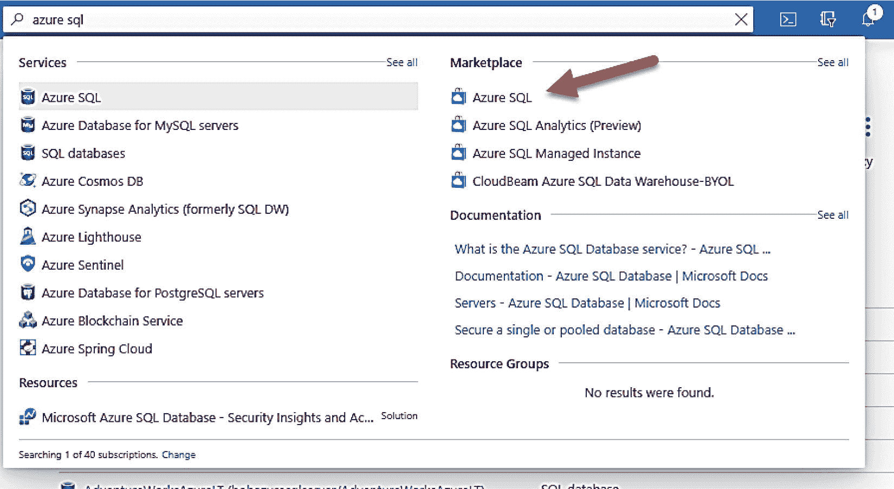

图 3-1
来自 Marketplace 的 Azure SQL

现在，系统会展示要部署的 Azure 服务类型的选择。在“SQL 虚拟机”下的下拉列表中选择 **SQL Server 2022 Enterprise on Windows Server 2022**，如图 3-2 所示。

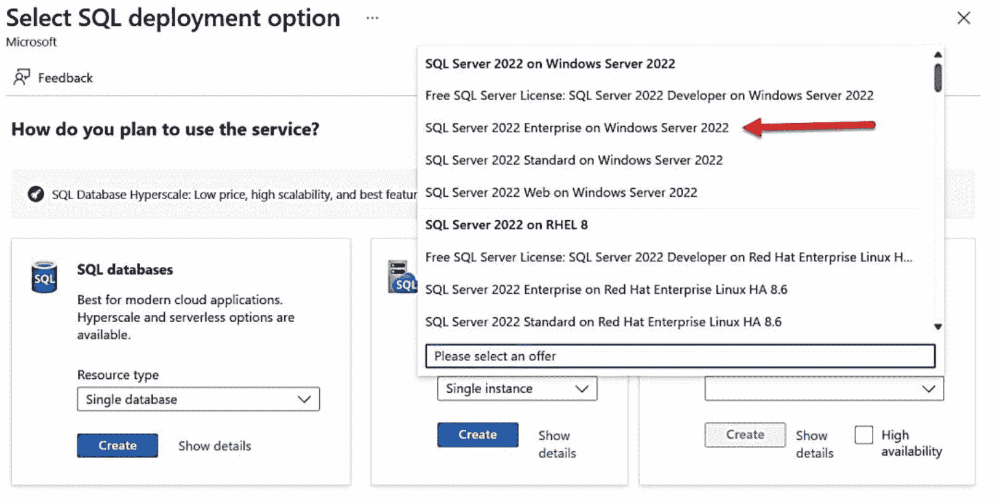

图 3-2
来自 Azure SQL 的 SQL Server 2022 库映像

出于本示例的目的，我将选择 SQL Server 2022 Enterprise。这使我能够在本章剩余部分向你展示一些配置选择。你本可以轻松选择 Free SQL Server 2022 Developer on Windows Server 2022。对于此映像选择，SQL Server 许可是免费的，但你只能将该 VM 用于开发目的。

选择此选项并点击 **Create** 按钮。你现在会看到一个屏幕，其中包含部署 VM 所需的一系列必填字段和选项，如图 3-3 所示。

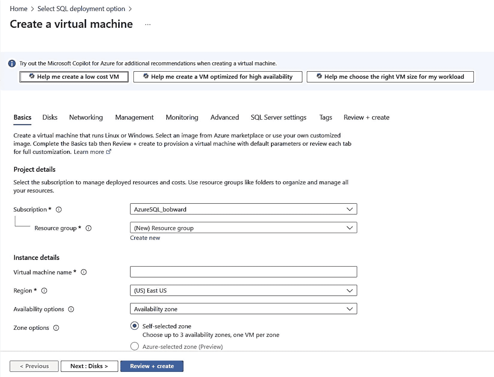

图 3-3
创建 SQL VM 屏幕的“基础”部分顶部

注意屏幕顶部的 Copilot for Azure 选项。此外，还有一系列名称（或部分），指示了你在部署过程中可以做出的几个选择。第一个屏幕被称为 **Basics**。并非所有部分中的所有字段都是必填的。“基础”屏幕拥有最多的必填字段。你可以点击这些部分中的任何一个，或使用底部的按钮在一系列选择中导航。

你的一些默认值会有所不同（例如，你的 Azure 订阅将被列为默认值；如果你有多个订阅，请在此处更改为 VM 部署所需的目标订阅），并且你将做出各种选择。让我们在部署过程和创建屏幕中逐步完成你的所有选择。

### 资源组、区域和可用性

你的前几个选项是需要提供的必填字段，包括资源组、名称和 Azure 区域。此外，你还可以选择一个可用性选项。

#### 资源组

正如我在本书第 2 章所述，资源组是组织和集中管理 Azure 资源的好方法。你将在本章中看到，默认情况下，会为你指定的新资源组创建一个虚拟网络，并且 VM 会自动添加到该虚拟网络中。出于本练习的目的，请选择 **Create New** 并为其命名。我将我的 VM 命名为 **bwsqlvmsrg**。

#### 虚拟机名称

这既是 Azure 资源的名称，也是 VM 内部客户机的主机名（你可以在部署后更改 VM 中的主机名）。请注意，不允许使用某些特殊字符，且名称长度不能超过 15 个字符。此名称在资源组内必须是唯一的。在本练习中，我输入名称 **bwsql2022**。

### 区域

这是 Azure 数据中心所在的区域。我在本书第 2 章介绍了 Azure 区域和数据中心。你选择的区域有几个因素需要考虑，包括可用的 VM 大小、合规性、价格以及到用户和应用程序的延迟。你可以在 [`https://www.cloudelicious.net/azure-region-and-datacenter-find-your-best-match/`](https://www.cloudelicious.net/azure-region-and-datacenter-find-your-best-match/) 阅读更多关于选择正确区域的信息。请注意，你的订阅也可能不支持某些 Azure 区域。如果你没有看到需要的选项，请咨询你的订阅所有者。我将选择 Central US 作为我的区域。

#### 可用性选项

这是部署期间的可选字段。只有当你计划将 SQL VM 连接到其他 VM 以实现高可用性和灾难恢复目的（如可用性组、故障转移集群实例等）时，才需要选择此选项。不幸的是，最好在部署期间决定要使用哪个选项。出于本示例的目的，请将此项保留为“不需要基础结构冗余”。我将在本章后面的“高可用性和灾难恢复”标题下讨论何时使用此处的某些选项。

注意
这并不意味着 *独立* SQL Server 没有基本的高可用性。Azure 可以处理在数据中心内因故障将你的 VM 迁移到主机（使用实时迁移）。此外，你的数据库的 Azure 存储还具有内置冗余。

#### 安全类型

Azure 虚拟机提供了新选项，可为 VM 提供更高级别的安全性。这对于 SQL Server 尤为重要，因为它可以为 VM 内部的 SQL 提供静态数据和内存中数据的安全级别。此安全性类型称为 **机密虚拟机**，由 AMD 处理器支持。另一种安全性类型是 **可信启动虚拟机**，它通过安全启动等功能保护虚拟机。出于本示例的目的，我不会使用这些选择，因此我将选择 **Standard**。

#### 映像

这里将填写你从 Azure SQL 屏幕所做的选择。在部署之前，你此时可以更改它。暂时保留 SQL Server 2022 Enterprise Windows Server 2022 的选择。

注意
你可以使用以下 PowerShell 命令获取特定区域中可用的 SQL Server 库映像的完整列表（用你选择的区域名称替换）：
`Get-AzVMImageOffer -Location ‘Central US’ -Publisher ‘MicrosoftSQLServer’`

#### VM 架构

Azure 虚拟机支持 x64 和 Arm64 架构。目前的 SQL Server 仅支持 x64。

### 竞价实例

Azure 竞价实例是一种可在虚拟机未持续使用时节省成本的概念。这个概念很棒，但可能不适用于你在 Azure 虚拟机中使用 SQL Server 的场景。

做出这些选择后，我的屏幕如图 3-4 所示。
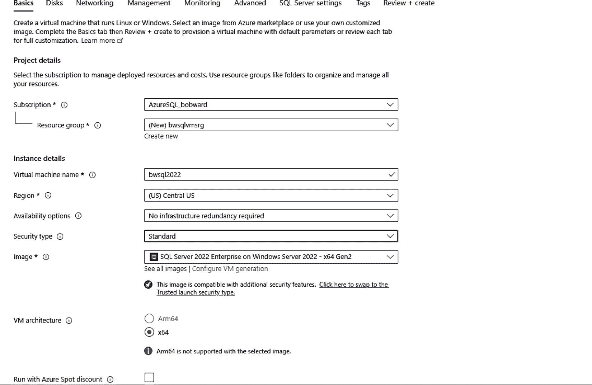
图 3-4
为“基础”部分指定资源组、区域、可用性及其他选项

你会注意到在我的选择中，镜像包含了 **`Gen2`** 这个词。第 2 代 (`Gen2`) 虚拟机是我们 SQL Server 镜像的默认选择。我强烈建议你坚持使用 `Gen2` 镜像，因为它提供了 `Gen1` 虚拟机无法实现的功能。你可以在 [`https://learn.microsoft.com/azure/virtual-machines/generation-2`](https://learn.microsoft.com/azure/virtual-machines/generation-2) 阅读更多信息。

### 虚拟机大小

你需要做出的最重要决定之一，就是为 Azure 中的 SQL Server 选择多大的虚拟机。大小本质上是 CPU、内存和 I/O 选项的组合。当你今天在数据中心将 SQL Server 部署到虚拟机或裸机时，你就在做这些选择。你选择 CPU 数量、CPU 速度、RAM、磁盘大小和磁盘速度。因此，你也需要能够在 Azure 中做同样的事情。

Azure 虚拟机大小按系列分类，并以字母代号（`B`、`D`、`E`、…）为人所知。如果你刚开始尝试在 Azure 虚拟机上使用 SQL Server，我的建议是选择一个合理的大小来测试 SQL Server 与成本的关系。如果你是为生产环境选择大小，则需要仔细审查大小选项。正如你所想，马力越大，成本越高。

随着 Azure 数据中心引入新型号的计算机以支持虚拟机和 Azure 资源，新的大小也支持不同的硬件代次。因此，你会看到像 `Ev4` 或 `Ev5` 这样的虚拟机大小。VM 大小由一系列字母和数字形式的几个选项组成，这些选项共同决定了 VM 性能和资源的特性。我称之为“虚拟机选择的字母表”。让我通过一个例子来说明。使用我上面展示的门户“基础”屏幕，你可以向下滚动查看默认选择的大小。然后，我将使用图 3-5 中所示的 **选择大小** 选项来调出选项列表。
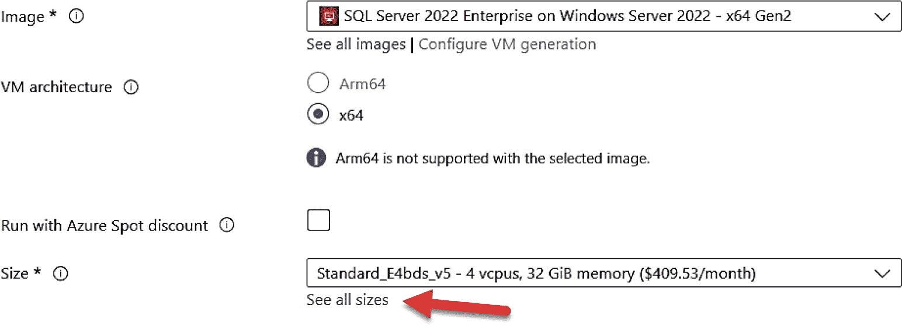
图 3-5
选择 VM 大小

你现在应该会看到一个提供 VM 大小选择的屏幕。这些表格看起来可能令人生畏，但它让你了解为什么选择特定大小，因为它决定了你的 VM 部署所获得的 CPU 数量、RAM、磁盘、IOPS 等。图 3-6 显示了我在“按 VM 大小搜索...”框中输入 `v5` 字符串后的结果，这向我展示了一些最新的 VM 硬件。
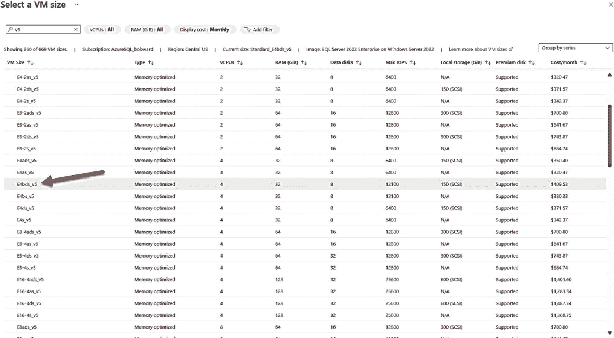
图 3-6
Azure 的 VM 大小选项

在搜索后我向下滚动，并指出了我将用于此 VM 部署的选择，名为 `E4bds_v5`。让我用这个例子来说明此屏幕关于我的选择展示了什么，以及一些字母选项的含义。

首先，你可以看到顶部的列，显示了你的选择的类型，然后是你获得的最大资源，包括 `vCPU`、`RAM`、`数据磁盘`、`最大 IOPS`、`本地存储`、`高级磁盘支持`和预估成本。**内存优化**类型指的是一个 VM 大小系列类别，它们具有最佳的内存与 `vCPU` 比例，因为 `vCPU` 的数量会影响你获得的 `RAM` 大小。对于 SQL Server，`RAM` 是一项重要资源，因此每个 `vCPU` 的内存越多，对 SQL Server 工作负荷越有益。你可以在 [`https://aka.ms/azurevmsizes`](https://aka.ms/azurevmsizes) 查看所有可用的 VM 类型。

我将选择 `E4bds_v5`，因为它有充足的 CPU 和 `RAM` 来满足我的需求，并支持我需要的几个选项，我稍后会描述。如果你看一下这个 VM 大小选择，以下是每个选项的含义：

*   `E` = `E` 是 E 系列系列，这是 SQL 生产工作负荷推荐的 VM 大小之一。E 系列具有一些最新的创新、最新的处理器，并针对需要内存的工作负荷（如 SQL Server）进行了优化。
*   `4` = 此选择的 `vCPU` 数量。
*   `b` = 选择 `b` 选项可为你提供更高的 I/O 核心比率（以 IOPS 形式）。如果你看看 VM 选择 `E4ds_v5`，它的最大 IOPS 是 6400，而 `b` 选项将此提升到 12100，成本仅略高。
*   `d` = VM 支持本地存储。本地存储是为 VM 提供的快速本地 SSD 驱动器。这对于 SQL Server 是一个关键选择，因为你可以将 `tempdb` 放在此驱动器上，而不必担心 I/O 性能。本地 SSD 驱动器也称为“临时”驱动器，因为如果 VM 故障转移到另一个主机，此驱动器上的任何数据都会丢失，但对于 `tempdb` 来说这没关系，因为我们在 SQL Server 启动时会重新创建它。你获得的本地存储量由你选择的 `vCPU` 数量定义。
*   `s` = 支持高级托管磁盘。你将在本章后面题为“最大化存储性能”的部分了解更多关于为什么高级托管磁盘对 SQL Server 很重要。
*   `v5` = 这是系列版本。微软总是在创新 VM 选择，因此任何重大的创新（通常是最新硬件的选择）都会以新的系列版本形式出现。在撰写本书时，E 系列的 `v6` 处于预览阶段。更多信息请访问 [`https://learn.microsoft.com/azure/virtual-machines/esv6-edsv6-series`](https://learn.microsoft.com/azure/virtual-machines/esv6-edsv6-series)。

提示
如果你正在寻找使用 AMD 处理器的 VM 选择，请查找 VM 大小中的字母 `a`。例如，我上面选择的 AMD 等价选项是 `E4ads_v5`。需要注意的是，用于更高 I/O 核心比率的 `b` 选项目前不适用于 AMD。

你可以在 [`https://aka.ms/sqlIaaSSizing`](https://aka.ms/sqlIaaSSizing) 了解有关 SQL Server 的最新微软 VM 大小建议。

注意
你可以在部署 VM 后更改其大小，而无需删除并重新创建它。这称为调整 VM 大小。这里有限制，并且会需要一些停机时间，但你可以在 [`https://learn.microsoft.com/azure/virtual-machines/sizes/resize-vm`](https://learn.microsoft.com/azure/virtual-machines/sizes/resize-vm) 阅读有关调整 VM 大小的更多信息。

### 账户、端口和操作系统许可

要完成在虚拟机中部署 SQL Server 的默认屏幕设置，你必须提供一个管理员账户和密码。对于 Windows，这将是本地管理员账户；对于 Linux，则是 root 用户。对于在 Windows 上部署的 SQL Server 库镜像，此本地管理员账户会自动添加到 `sysadmin` 角色（就像你在 SQL Server 安装过程中将自己添加进去一样）。管理员账户的密码长度应在 12 到 123 个字符之间，并且必须是强密码，包含以下字符类型中的至少 3 种：1 个小写字母、1 个大写字母、1 个数字和 1 个特殊字符。

下一个选择是决定是否为虚拟机打开任何端口以供入站流量访问。默认情况下，会选中由远程桌面连接（`RDP`）协议使用的端口 3389（对于 Linux，则是 `ssh` 协议的默认端口 22）。使用此选项最为灵活，但并非最安全的选择。我暂时先不选择此选项，但本章后面的“连接到你的虚拟机”一节中，我将讨论使用不同的安全选项。

最后一个选择涉及 Windows 部署的许可。当你选择带有 Windows 的 SQL Server 库镜像时，你的许可将是 SQL Server 和 Windows 的 `按需付费` 订阅。这基本上意味着你每月支付固定的 Windows 和 SQL Server 使用费。此外，你还需要根据 CPU 使用率和存储情况支付资源使用费。如果你已拥有 Windows Server 的现有许可，可以将这些许可应用于你的 Azure 虚拟机成本。你可以在 [`https://aka.ms/azurehybridbenefit`](https://aka.ms/azurehybridbenefit) 阅读更多关于将 Azure 混合权益用于 Windows Server 的信息。

图 3-7 显示了填写这些选项的门户屏幕的其余部分。

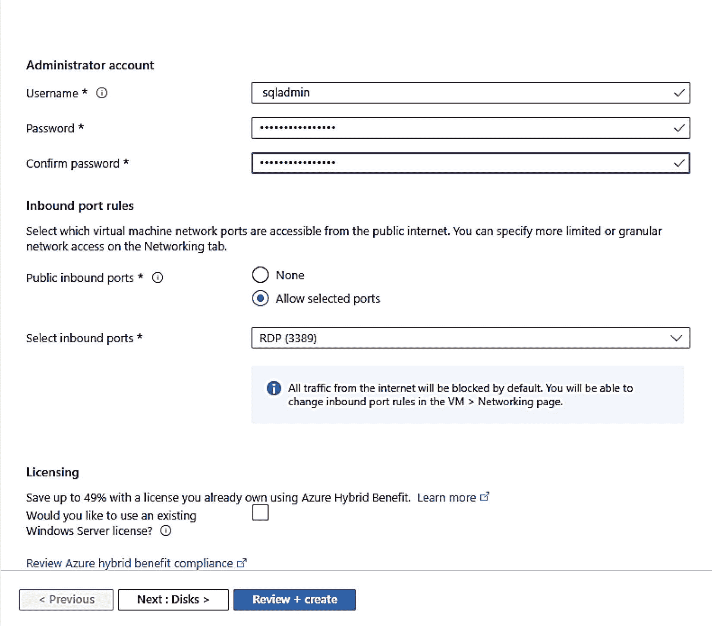

图 3-7：选择账户、端口和许可

在部署过程的这个阶段，你可以单击 `审阅+创建` 并使用其他默认选项部署你的虚拟机。但是，让我们看看其他一些部分以及你为何可能想使用它们，特别是 SQL Server 设置部分。

### 作为部署一部分进行配置选择

让我们看看在为 Azure 虚拟机部署 SQL Server 时可以选择的其他选项。

#### 操作系统磁盘

选择 `下一步: 磁盘 >` 以查看如图 3-8 所示的选项。

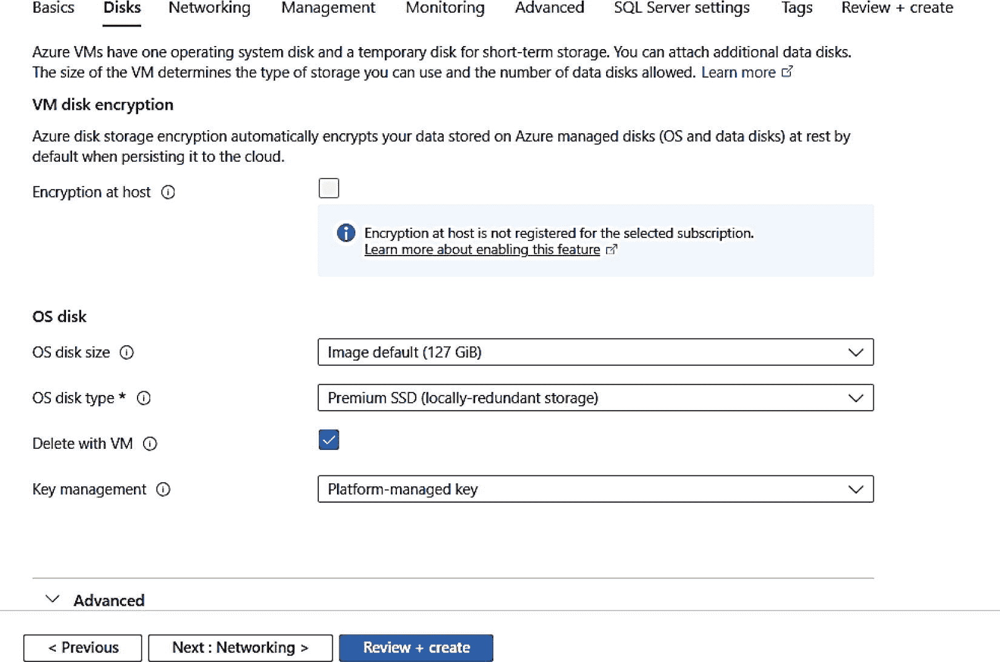

图 3-8：部署期间 Azure 虚拟机的磁盘选项

此处提供的磁盘选项涉及主机级别的加密以及支持操作系统和其他系统文件的磁盘选项。虽然对于所有 SQL Server 部署，我建议你选择此处提供的默认选项，包括高级托管磁盘，但值得研究一下名为 `主机加密` 的选项，它将加密主机上所有处于静态的磁盘。我将在本章后面的“最大化存储性能”一节中更多地讨论可用于 SQL Server Azure 虚拟机的不同类型的托管磁盘。我建议你为 SQL Server 使用托管磁盘，一个简单的优点是容错性，但你可能想阅读更多关于非托管磁盘和临时磁盘的信息。你可以在 [`https://learn.microsoft.com/azure/virtual-machines/managed-disks-overview`](https://learn.microsoft.com/azure/virtual-machines/managed-disks-overview) 阅读更多关于托管磁盘的信息。

**注意：** 如果你仅从市场安装操作系统镜像（例如，Windows Server），你将在此处获得添加数据磁盘的选项。对于 SQL Server 市场镜像，你将能够在下面的“SQL Server 设置”配置部分或部署完成后添加数据磁盘。

#### 网络

现在单击 `下一步: 网络 >`。在这里，你将看到一组选项来为虚拟机配置网络的各个方面，如图 3-9 所示。

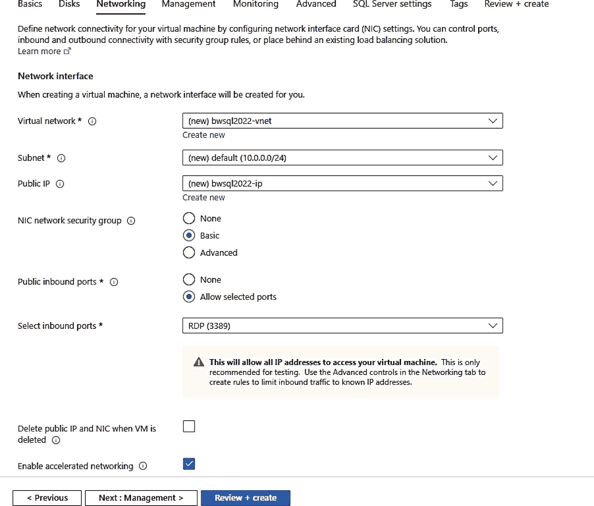

图 3-9：Azure 虚拟机部署期间的网络选项

你可能想考虑更改的两个选项是虚拟网络和子网，前提是此虚拟机需要包含在 `现有` 的 Azure 虚拟网络中。请注意，在此示例中，将创建一个新的虚拟网络，其名称包含我的新虚拟机。如果你在第一个部署屏幕上选择了现有的资源组，则将选择与该资源组关联的虚拟网络（如果存在）。我将在本章后面题为“网络”的一节中更详细地讨论 Azure 虚拟机的网络选项。

在此屏幕上，我想指出的另一个适用于你的 Azure 虚拟机 SQL Server 部署的选项是 `加速网络`。对于客户端应用程序必须通过虚拟网络与 SQL Server 通信的 SQL Server 部署，加速网络非常有益。因此，你可能想选择一个支持加速网络的 VM 大小（或具备所需 CPU 数量的 VM 大小）。如果你计划仅在虚拟机中部署 SQL Server 并在虚拟机内完成所有操作，则无需担心此选项。你可以在 [`https://learn.microsoft.com/azure/virtual-network/accelerated-networking-overview`](https://learn.microsoft.com/azure/virtual-network/accelerated-networking-overview) 阅读更多关于加速网络优势的信息。

**注意：** 你可以稍后更改虚拟机的大小，然后使用 PowerShell 启用加速网络。你可以在 [`https://learn.microsoft.com/azure/virtual-network/create-vm-accelerated-networking-powershell`](https://learn.microsoft.com/azure/virtual-network/create-vm-accelerated-networking-powershell) 阅读更多关于如何执行此操作的信息。

我这里没有显示的另一个选项叫做 `负载均衡选项`。虽然此选项可能对某些应用场景有帮助，但对于 SQL Server，即使对于 Always On 可用性组（AG），也不需要负载均衡器。我将在本章后面题为“HADR”的一节中更详细地讨论如何为 AG 设置连接。

## 管理

选择`Next: Management >`。图 3-10 展示了一些可能对你部署和使用 `Azure Virtual Machine` 上的 `SQL Server` 有用的选项。

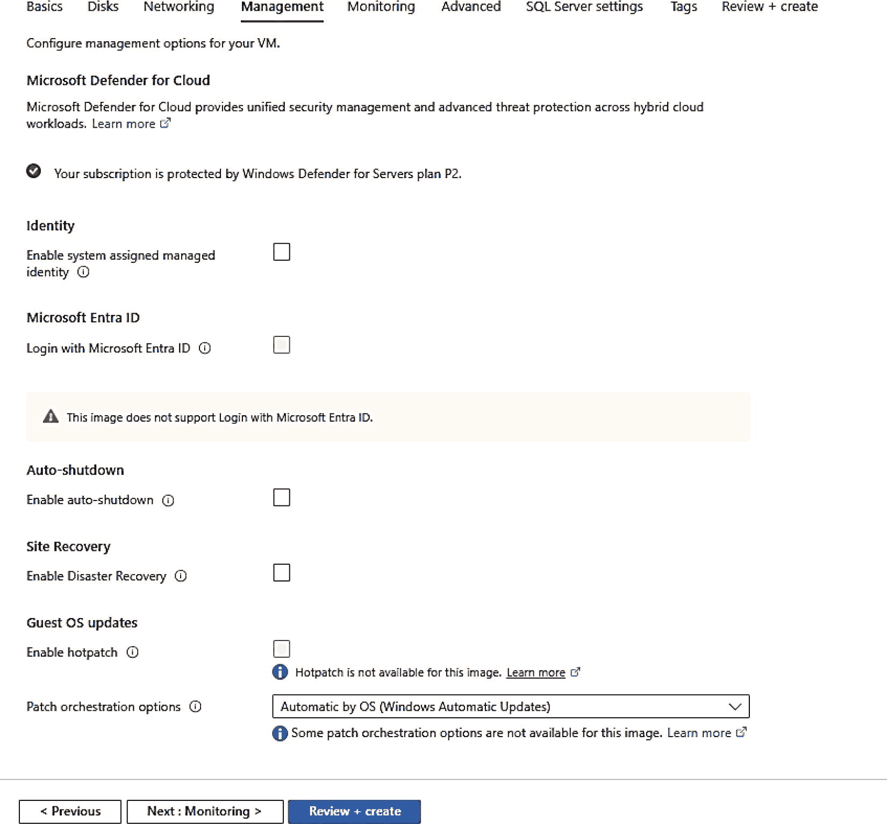

图 3-10

部署 `Azure Virtual Machine` 时的管理选项

我强烈建议你考虑 `Microsoft Defender for Cloud`。我的订阅启用了 Defender，因此它会自动为我的虚拟机启用。`Microsoft Defender for Cloud` 为你的虚拟机提供安全功能以及特定于 `SQL` 的功能。它提供了针对云中虚拟机潜在安全问题的高级威胁防护和漏洞评估。此外，`Microsoft Defender for Cloud` 还提供了针对 `Azure Virtual Machine` 上 `SQL Server` 的特定功能。我将在本章后面的“配置 `Azure Virtual Machine`”一节中详细讨论如何配置及其优势。

提示

在撰写本书时，微软发布了 `Copilot for Security in Defender for Cloud`。当你在以下网址启用 Defender 时，请尝试一下：`https://learn.microsoft.com/azure/defender-for-cloud/copilot-security-in-defender-for-cloud`。

`系统分配的托管标识` 是一个有趣的选择，它允许你在 `Microsoft Entra` 中创建一个标识用于身份验证，而无需在你的代码或应用程序中放置凭据。使用此功能与 `Azure Virtual Machine` 的一个很好的例子是，从虚拟机连接到 `Azure SQL Database` 而无需提示输入任何密码。你可以在以下网址阅读有关托管标识的更多信息：`https://learn.microsoft.com/entra/identity/managed-identities-azure-resources/overview`。

`启用自动关机` 提供了一个选项，虚拟机会在你选择的时间每天自动关闭。为什么你会为 `SQL Server` 部署选择这个？主要原因是你的 `SQL Server` 部署有一些可以承受的停机时间，并且你想节省成本。当虚拟机关闭时，你只需支付许可和存储费用。我将在本章后面的“配置”一节中更多地讨论停止和启动虚拟机。

`客户机操作系统更新` 提供了一个选项，可以自动将关键更新应用到虚拟机内的操作系统。你应该考虑一个名为 `Azure Update Manager` 的新选项，因为它允许你为 `Windows Server` 和 `SQL Server` 应用甚至非关键更新。我将在本章后面的“配置”一节中更详细地描述此功能。

## 监控

图 3-11 展示了监控选项。

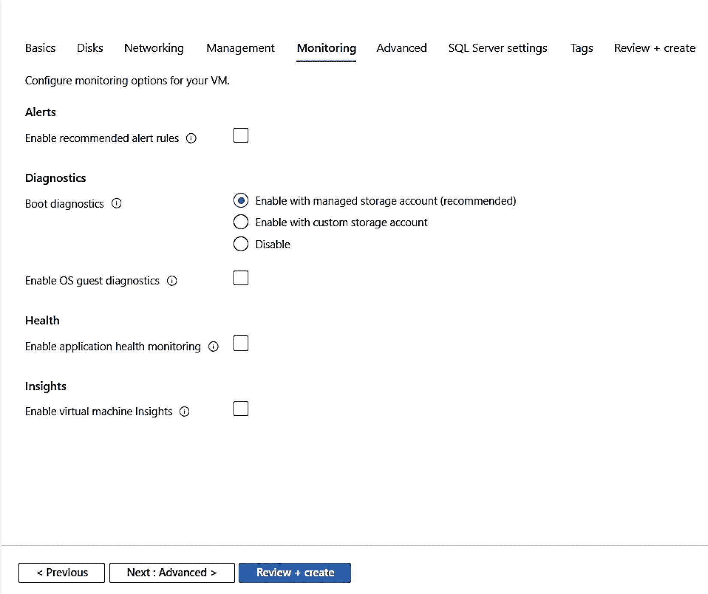

图 3-11

部署 `Azure Virtual Machine` 时的监控选项

`启动诊断` 非常有用，可以查看主机上虚拟机的串行输出屏幕。这类似于使用像 `Hyper-V Manager` 这样的工具查看启动屏幕。你可以在以下网址阅读有关启动诊断的更多信息：`https://learn.microsoft.com/azure/virtual-machines/boot-diagnostics`。

我个人建议你选择 `客户机操作系统诊断`。这将允许你在 `Azure Monitor` 等系统中查看来自客户操作系统的性能信息，甚至获取警报。我将在本章后面的“性能监控”一节中讨论如何使用此功能。

如果你部署了许多 `Azure Virtual Machine`，你应该考虑启用虚拟机洞察。这提供了监控虚拟机健康和性能关键信息的方法 *大规模地*。在以下网址了解更多信息：`https://learn.microsoft.com/azure/azure-monitor/vm/vminsights-overview`。

## 高级

选择这些选项后，单击 `Next: Advanced >`。顾名思义，这些是可能让你感兴趣的高级选项，如图 3-12 所示。

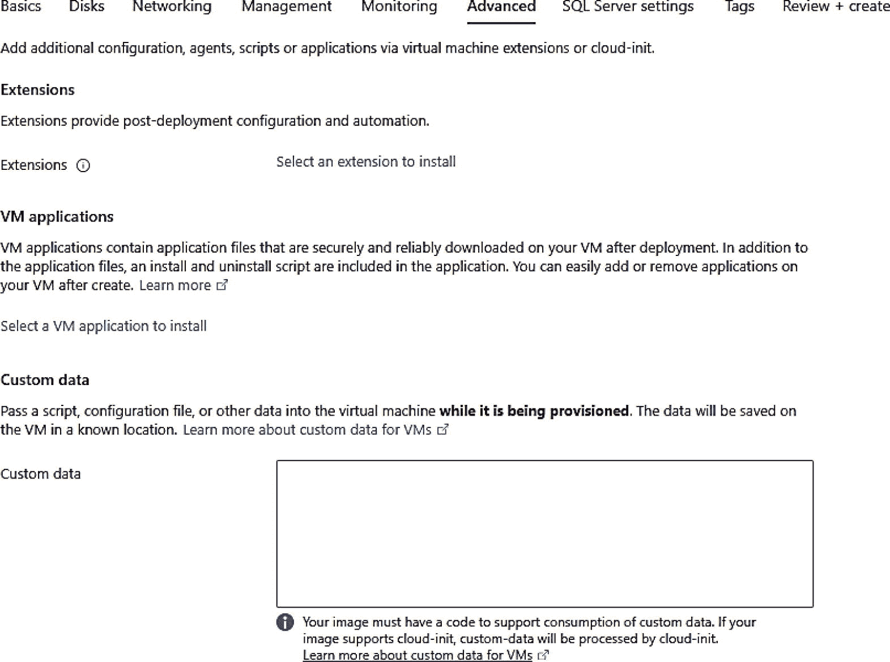

图 3-12

`Azure VM` 的高级选项

`扩展` 是在虚拟机内部运行的应用程序，可以提供部署后和自动化任务。`SQL Server` 库映像有一个扩展，如果你使用库映像（正如我这里做的），可用于自动配置 `SQL Server`。在以下网址可能有你想探索的其他扩展：`https://learn.microsoft.com/azure/virtual-machines/extensions/features-windows`。

如图 3-13 所示，还有其他高级选项。

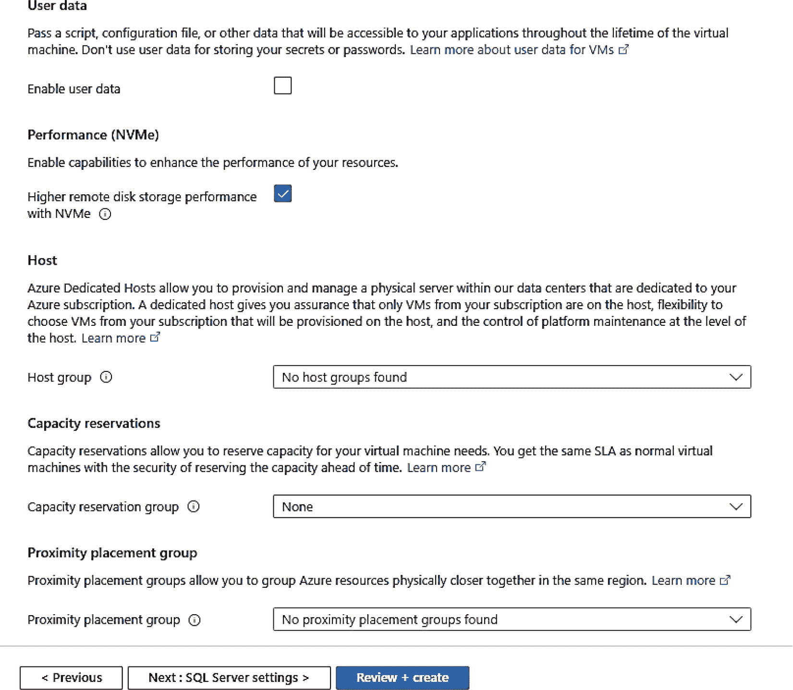

图 3-13

`Azure VM` 的其他高级选项

`主机组` 定义了一个用于你的虚拟机的 *Azure 专用主机*。`Azure 专用主机` 的主要好处是 *专用物理服务器*：该服务器由你的组织独占使用，确保没有其他客户共享相同的硬件。`容量预留` 允许你在不长期承诺的情况下，在特定的 `Azure` 区域或可用性区域预留计算容量。我将在本章后面题为“预留实例、专用主机和容量预留”的一节中更详细地讨论这些主题。

`邻近放置组` 是 `Azure` 中一个有趣的概念，它允许你请求多个 `Azure` 资源在 `Azure` 数据中心内尽可能靠近地放置，以提供尽可能低的网络延迟。如果连接到 `Azure Virtual Machine` 中 `SQL Server` 的应用程序将托管在 `Azure` 中，这可能是一个值得考虑的选项。

注意

我不建议为 `Azure Virtual Machine` 中的 `SQL Server`（例如可用性组）使用邻近放置组作为高可用性解决方案。在这种情况下，你将使用称为可用性集或可用性区域的概念。我将在本章后面题为“HADR”的一节中讨论这些概念。

单击 `Next: SQL Server Settings >` 查看下一组选项。

