# SQL Server 设置

到目前为止，所有的配置选项都与 SQL Server 无关。此屏幕提供了针对 SQL Server 特定部署的配置选项。如果您熟悉 SQL Server 的安装体验，我们在最新版本中提供了“在安装时配置”的选项。这意味着我们将通常在安装后配置的选项整合到了安装过程本身。我们现在正尝试在 Azure 虚拟机中提供相同的体验，同时也包含允许为 Azure 进行优化配置的选项。

让我们更详细地了解这些选项。图 3-14 显示了网络、安全和存储的选择。

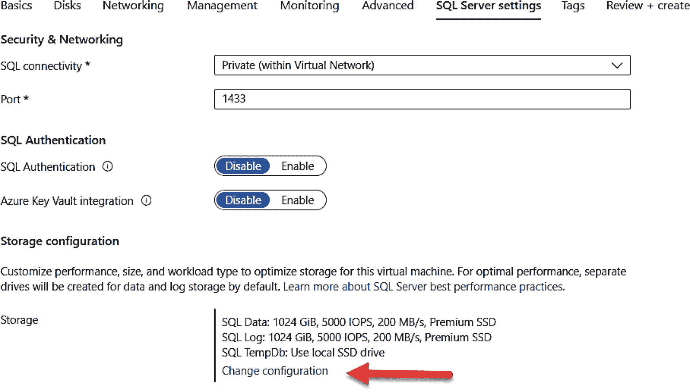

图 3-14
网络、安全和存储的 SQL Server 设置

注意
截至撰写本书时，SQL Server Linux 镜像在部署期间不支持 SQL Server 设置。

#### 网络

**网络** 提供了如何暴露 SQL Server 实例默认 TCP 端口 1433 的选择。可以将此选择视为使用防火墙。*专用* 意味着虚拟机虚拟网络内的任何 Azure 源都可以访问此端口。这是默认设置，也是我推荐您使用的选项。*本地* 意味着只允许在虚拟机内部访问。*公共* 意味着 TCP 端口在 Internet 上暴露。尽管使用公共选项以便您可以通过 SSMS 等工具从笔记本电脑连接到此部署的虚拟机可能很诱人，但我 **不建议** 使用此选项。

注意
我第一次使用公共选项在 Azure 虚拟机中部署 SQL Server 时，立即遭到了外部入侵者的攻击，他们尝试使用 `sa` 账户登录并猜测密码。当我在 `ERRORLOG` 中看到大量的登录失败消息时，我才发现这一点。这几乎是在部署虚拟机后立即发生的。

## SQL 身份验证

**SQL 身份验证** 的选择与为 SQL Server 启用混合模式安全相同。即使默认情况下 `sa` 登录是禁用的，如果您选择启用此选项，系统将提示您输入一个 SQL 登录名，该登录名将被授予部署的 SQL Server `sysadmin` 权限。

## Azure 密钥保管库集成

**Azure 密钥保管库集成** 是一个您可能想要启用的选项，但别担心，您可以在部署后启用它。Azure 密钥保管库集成可能有助于简化您在诸如透明数据加密 (`TDE`) 等场景中使用 Azure Key Value。您可以在 `https://learn.microsoft.com/azure/azure-sql/virtual-machines/windows/azure-key-vault-integration-configure` 阅读更多关于 Azure 虚拟机中 SQL Server 与 Azure 密钥保管库集成的信息。

## 存储配置

**存储配置** 可能是您为 Azure 虚拟机中的 SQL Server 所做的最重要选择之一，尤其是对于性能而言。让我们看看您可以做出哪些选择，以及我们如何提供引导式体验来为您的数据库配置存储。

注意
目前有一个预览版的新体验可以使用 Azure 高级 SSD v2 存储。我将在本章后面的“最大化存储性能”一节中更多地讨论此选项。

如果您点击 **更改配置**，您将看到如图 3-15 所示的选项。

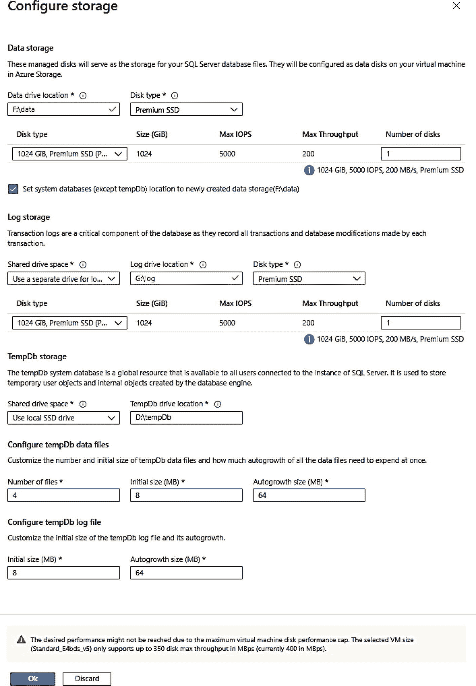

图 3-15
为 Azure 虚拟机中的 SQL Server 配置存储

此屏幕分为三个部分：(1) 数据库文件存储，(2) 事务日志文件存储，和 (3) `tempdb` 存储。

对于数据库和事务日志文件，您有位置、托管磁盘类型、磁盘大小类型和磁盘数量的选项。对于数据库，您还可以选择将系统数据库 (`master`、`model` 和 `msdb`) 从操作系统驱动器移动到放置数据库文件的驱动器。除非您只是做一些基本测试，否则我总是建议：

*   选择将数据和日志放在单独的驱动器上。
*   使用高级 SSD 磁盘类型。
*   选择足够大的磁盘大小类型，以处理您的应用程序 SQL Server I/O 所需的容量、IOPS 和吞吐量。

高级 SSD 磁盘类型有各种大小，从 4GB (`P1`) 到 32TB (`P80`) 标记为 `P<n>`。IOPS 和吞吐量方面的性能随着尺寸的增大而提高。您可能面临的一个问题是尝试将您需要的 IOPS 和吞吐量与您的最小尺寸要求对齐。这可能需要您 *超额配置* 尺寸（或多个磁盘）以获得所需的性能（如前所述，有一个名为高级 SSD v2 的新磁盘类型正在预览中，可以帮助解决此问题；您将在本章后面的“最大化存储性能”一节中了解它）。您可以在 `https://learn.microsoft.com/azure/virtual-machines/disks-types#premium-ssds` 阅读更多关于各种高级 SSD 磁盘类型的信息。

对于 `tempdb`，请注意建议将其放置在本地 SSD 驱动器上，并建议数据和日志的文件数量和大小，这与 SQL Server 当前的安装程序非常相似。

请注意屏幕底部的警告。它说配置的磁盘的性能向量超出了虚拟机大小的支持范围。这是一个重要的警告，因为它意味着您选择的虚拟机大小不支持足够的 IOPS 和/或吞吐量，即使您选择了满足您要求的存储。当它发生时，这是一个很难检测到的问题，因此现在正确设置虚拟机大小以满足您的存储性能要求非常重要。您需要先返回到“基础”屏幕更改虚拟机大小，然后返回此屏幕以确保警告消失。

## SQL Server 实例设置

在存储配置下方是能够更改 **SQL Server 实例设置**，如图 3-16 所示。

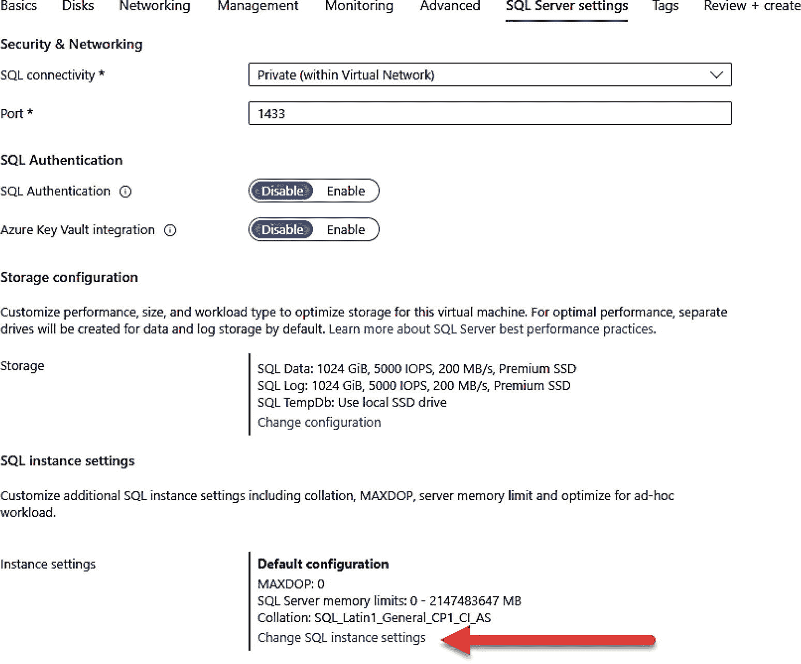

图 3-16
选择 SQL Server 实例设置

单击 **更改 SQL 实例设置**，您将获得如图 3-17 的屏幕。

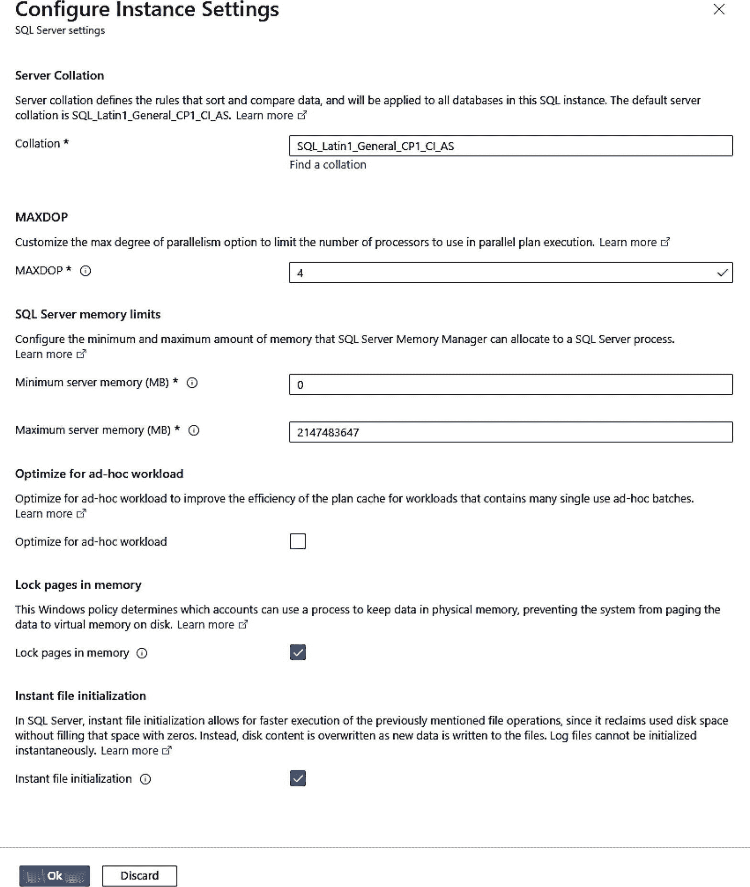

图 3-17
SQL Server 设置的附加选项

在此屏幕上，您可以看到在 SQL Server 安装过程中可以选择的各种选项（请记住，当您使用门户在 Azure 虚拟机中部署 SQL Server 时，我们会自动为您运行安装程序以安装所有内容！），例如服务器排序规则、`MAXDOP`、最大和最小内存，以及针对即席工作负载进行优化的设置。此外，我们还为您提供了两个流行的性能优化选项：**在内存中锁定页面** 和 **即时文件初始化**。您可以在部署后配置所有这些，但现在有机会进行设置可以节省您的时间和精力。

选择 **确定** 后，您还有其他选择，如图 3-18 所示。

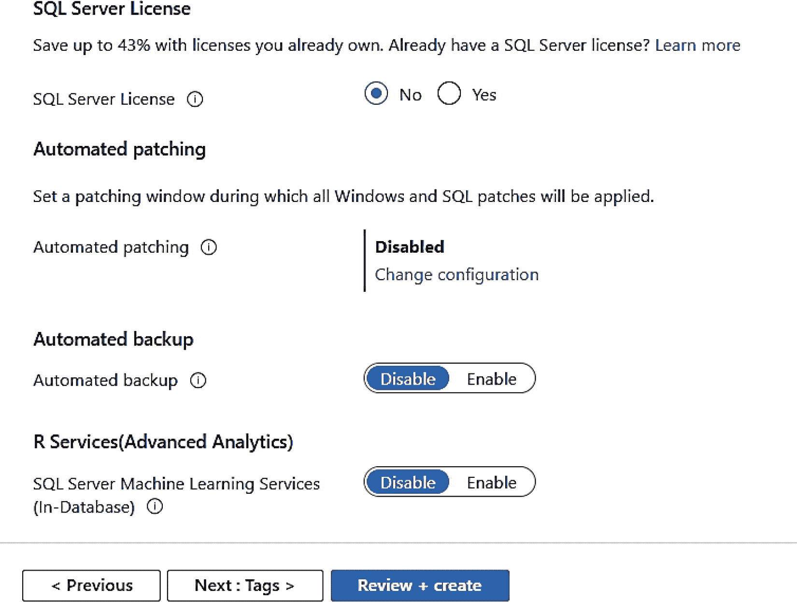

图 3-18
附加的 SQL Server 设置

## SQL Server 许可证

**SQL Server 许可证** 允许您证明您拥有现有的 SQL Server 许可证，可以将其用于 Azure 混合权益 (`AHB`)，就像 Windows 的选择一样。在将 SQL Server 用于 Azure 虚拟机时，这可以为您节省大量成本。

注意
如果您没有看到此选项可用，那是因为您选择了无法应用或已经选择了此选项的 SQL Server 镜像选择。例如，标题以 `BYOL`（这意味着自带许可证）开头的镜像已经意味着您只是在使用我们自己的许可证。开发人员版是免费的，因此不适用许可证。


我们还在 2019 年宣布了针对使用 Azure 虚拟机时的高可用性和灾难恢复场景的新许可权益。您可以在[`https://cloudblogs.microsoft.com/sqlserver/2019/10/30/new-high-availability-and-disaster-recovery-benefits-for-sql-server/`](https://cloudblogs.microsoft.com/sqlserver/2019/10/30/new-high-availability-and-disaster-recovery-benefits-for-sql-server/)阅读更多信息。

`自动修补`提供了针对何时部署 Windows 和 SQL Server 重要和关键更新的特定配置。Windows 和 SQL Server 的其他更新将取决于您如何在虚拟机内部配置 Windows Update。正如我之前提到的，有一个名为 Azure Update Manager 的新选项您应该考虑，因为它允许您为 Windows Server 和 SQL Server 应用非关键更新。我将在本章后面标题为“配置”的部分更详细地描述此功能。

`自动备份`使用作为 SQL Server 2016 一部分发布的托管备份到 Azure 功能。您的需求可能有所不同，但许多用户可能会发现此选项对于为 SQL Server 提供简单的自动化备份解决方案非常有用。启用此选项后，您有多个选择来配置如何执行备份。

注意
自动修补和自动备份选项可能在部署后不会立即显示为已启用。SQL IaaS 扩展在部署后在后台运行。

`R Services (高级分析)`是一个选项，用于在部署时安装 SQL Server 机器学习服务功能。我将在下一节“部署！”中描述通过 SQL Server 库映像安装的内容。

点击`下一步: 标签 >` 查看最后一个选项。

### 标签

在部署虚拟机之前的最后一个选项是可能使用一个`标签`，如图 3-19 所示。标签是 Azure 生态系统支持的一个概念，用于将字符串值分配给 Azure 中的资源，例如虚拟机，以组织您的资源。

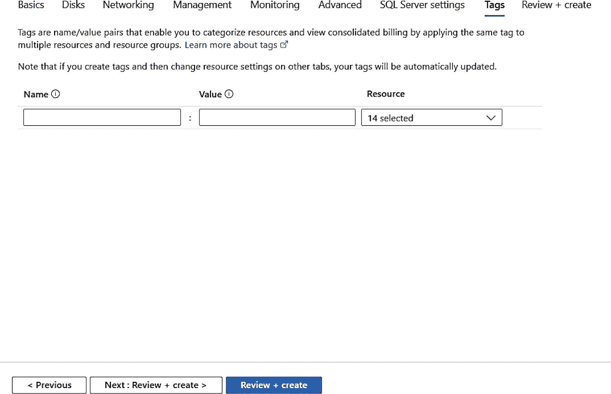

图 3-19

为 Azure 资源分配标签

点击`下一步: 审阅 + 创建 >` 以验证和部署虚拟机。

### 部署！

门户将获取您的所有选项，执行验证步骤，然后向您提供创建虚拟机的能力。图 3-20 显示了在您点击创建之前最终验证屏幕上的一些有趣信息。

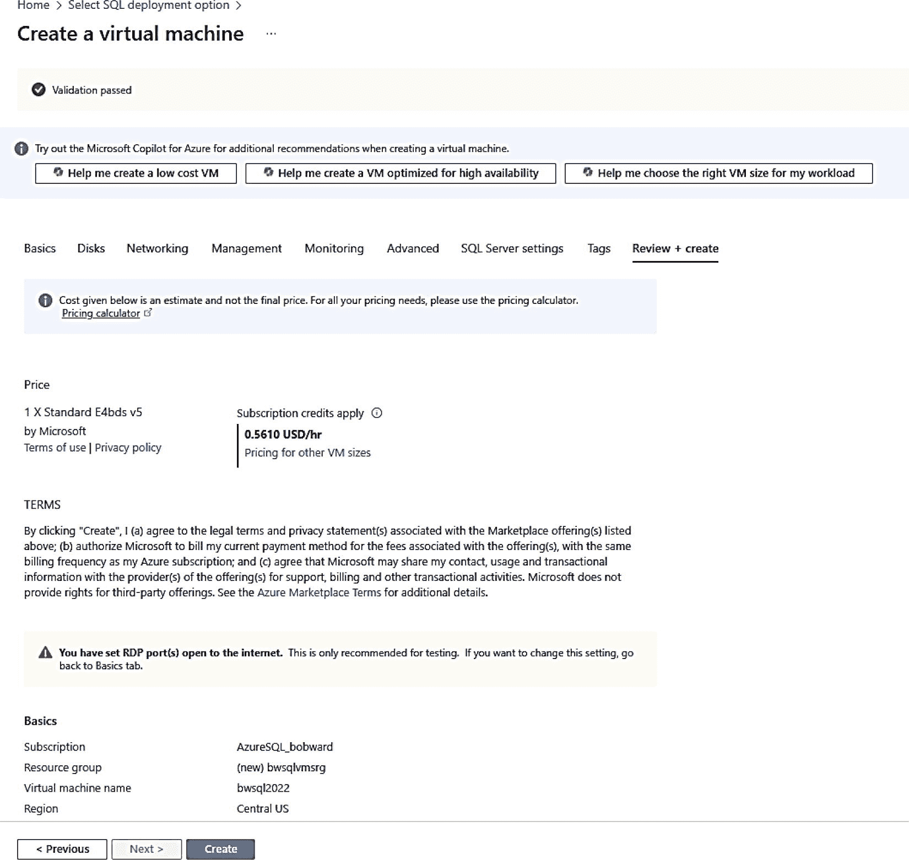

图 3-20

创建虚拟机前的验证

在此屏幕顶部，您可以看到您选择的虚拟机大小以及每小时的估计成本。另请注意`使用条款`和`隐私政策`。随 SQL Server 提供的最终用户许可协议（EULA）仍然适用于 Azure 虚拟机，因为这是一个完全许可的 SQL Server。但是，由于您在 Azure 中部署虚拟机，有一些条款和隐私政策您应该审阅。您可以在[`https://azure.microsoft.com/support/legal`](https://azure.microsoft.com/support/legal)阅读更多关于 Azure 使用条款的信息。隐私是一个非常重要的话题，由于 Microsoft 在云中托管您的虚拟机，您需要了解 Microsoft 收集的所有信息的详细信息。在[`https://privacy.microsoft.com/privacystatement`](https://privacy.microsoft.com/privacystatement)阅读更多。您对操作系统和/或 SQL Server 的库映像的使用也有称为 Azure Marketplace 条款的条款。您可以在[`https://azure.microsoft.com/support/legal/marketplace-terms/`](https://azure.microsoft.com/support/legal/marketplace-terms/)阅读更多信息。

您还会在此屏幕上注意到关于允许 RDP 端口暴露于互联网的警告。您将在下面标题为“连接到您的虚拟机”的部分了解更多关于如何控制访问和限制任何问题的信息。如果您在此屏幕上向下滚动，您将看到您选择部署虚拟机的所有选项的详细信息。另请注意屏幕底部的`下载自动化模板`选项。我将在本章后面标题为“使用 CLI 与 ARM 模板、Bison 和 Terraform”的部分讨论使用模板进行自动化。

点击`创建`按钮准备启动！虚拟机的部署是异步的，因此您甚至可以退出门户，部署在后台完成。但是，如果您保持门户屏幕打开，您可以实时跟踪进度。在点击创建后几秒钟内，我的屏幕如图 3-21 所示，以跟踪部署进度。

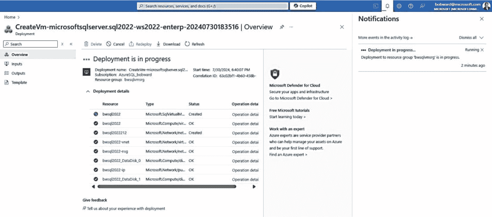

图 3-21

Azure 虚拟机部署进行中

不仅主屏幕在虚拟机创建时刷新，您还可以点击门户标题栏上的`通知`图标来跟踪进度。在我的示例中，大约十分钟后部署完成。图 3-22 显示了所有详细信息，包括来自`通知`图标的状态。

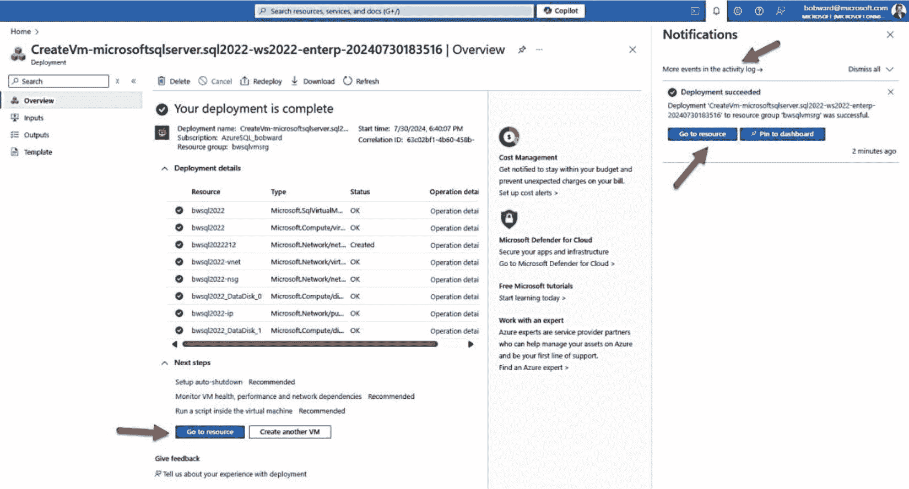

图 3-22

Azure 虚拟机中 SQL Server 的部署完成

您会注意到对于部署详细信息，部署的不仅是一个虚拟机，而是许多不同的资源，包括网络接口、磁盘、存储帐户、虚拟网络和安全性组。如果您想要更多关于部署的详细信息，可以点击`活动日志中的更多事件`。

如果您点击`转到资源`，您将看到虚拟机的概述屏幕。从 SQL Server 的角度，还有另一个视图我稍后将介绍。让我们参观一下如何导航 Azure 虚拟机的`概述`屏幕。


### 在门户中导航 Azure 虚拟机

在本书中，你会发现自己经常使用 Azure 虚拟机概述屏幕的多个方面。让我们来检查一下概述屏幕的主要区域，如图 3-23 所示。

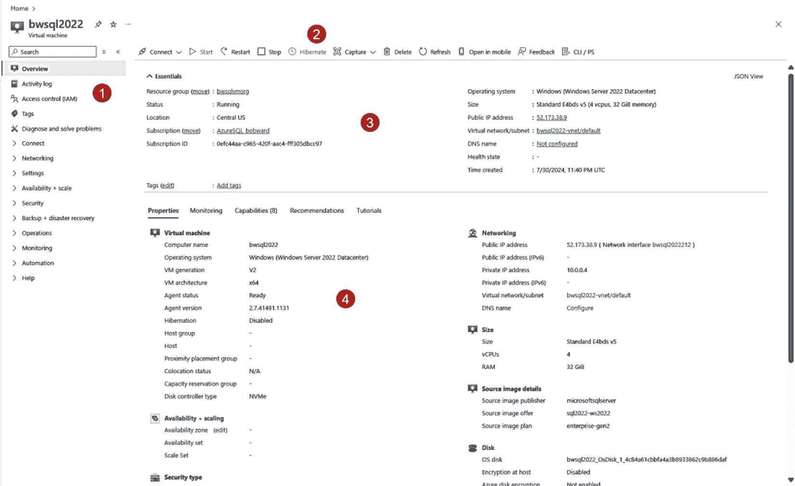

**图 3-23** Azure 虚拟机的概述屏幕

1.  **服务菜单**
    每个 Azure 资源都提供一系列选项来管理该资源。服务菜单的顶部对所有资源都是相同的。如果你在深入查看虚拟机的`blades or sections`详细信息时想要“找回方向”，你会需要使用`概述`选项。这一点非常重要，因为我经常点击屏幕右上角的 X，然后完全丢失了虚拟机的上下文。通过点击服务菜单上的`概述`，我可以保持该上下文。
    在`概述`下方，我们将看到查看与此特定虚拟机相关的活动日志条目的选项，能够使用 RBAC 控制*外部*对虚拟机的访问，设置新标签，或诊断问题。其下是一系列可展开的类别选项，例如`连接`以连接到虚拟机，`网络`以配置网络选项，或`设置`以配置虚拟机的特定方面。还有其他选项你可以探索。我不会在这里逐一介绍每个选项，但会在本章剩余部分使用其中几个选项。

2.  **命令栏**
    这些是允许你操作虚拟机的按钮。每个 Azure 资源都有其独特的按钮。你将使用最常见的按钮是`连接`、`启动`、`重新启动`和`停止`。我将在本章后面题为“停止与解除分配”的小节中更详细地介绍使用此选项停止虚拟机的意义。

3.  **基本信息**
    严格来说，这是工作窗格的一部分。此区域显示关于你虚拟机的关键信息，包括资源组、区域、状态、操作系统版本和虚拟机大小，但也能让你导航到虚拟机的某些方面，例如虚拟网络。

4.  **工作窗格**
    工作窗格包含用于查看虚拟机详细属性、通过运行状况事件、警报和性能指标进行监控、启用 Windows 管理中心等功能、建议和培训教程的部分。

在 [`https://learn.microsoft.com/azure/azure-portal/azure-portal-overview#getting-around-the-portal`](https://learn.microsoft.com/azure/azure-portal/azure-portal-overview%2523getting-around-the-portal) 探索更多关于如何在门户中导航的信息。

### 连接到你的虚拟机

现在你已经部署了虚拟机，首先要做的事情之一就是连接到它。对于 Windows 虚拟机，最流行的连接和使用方式是使用`远程桌面协议 (RDP)`。在虚拟机部署示例中你看到，我选择了向互联网开放 RDP 端口(`3389`)的选项。
要使用 RDP，请点击命令栏中的`连接`按钮并选择`连接`。你将看到如图 3-24 所示的连接选项。

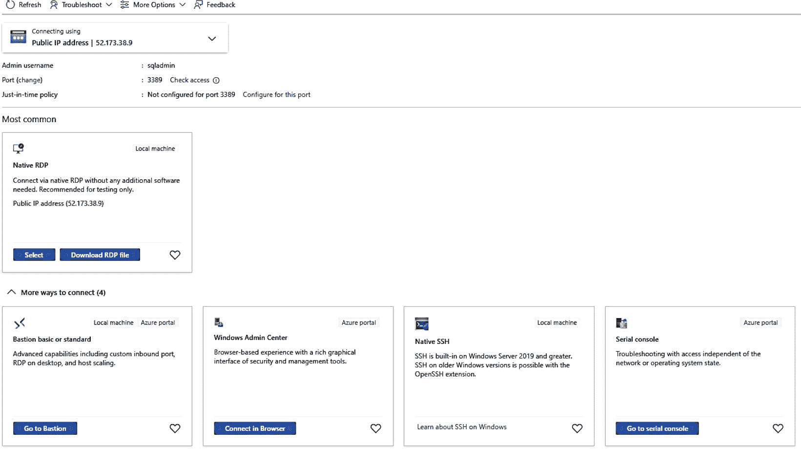

**图 3-24** 通过 RDP 连接到 Azure 虚拟机

你可以通过选择`下载 RDP 文件`来通过 RDP 连接。RDP 文件将被复制到你客户端机器的`下载`文件夹中。虚拟机的公共 IP 地址也显示在这里，如果你只想使用任何有效的 RDP 客户端直接连接到虚拟机。一旦连接，就像任何虚拟机或 Windows 计算机一样，系统会提示你输入凭据（你在部署时提供的），默认情况下是管理员组的成员。
注意：如果你注意到在`下载 RDP 文件`下方，有一些选项可以帮助你排查任何 RDP 连接问题，如果你遇到任何问题，我强烈建议你查看一下。

如果你使用`选择`，你还可以在此屏幕上看到一个建议，启用虚拟机的`即时访问`以提高安全性。即时访问是一种“按需”获取虚拟机 RDP 访问权限的方法，这样当你不使用虚拟机时，RDP 端口不会向互联网开放。这是一种允许你从任何客户端连接到虚拟机，同时限制 RDP 端口对所有人暴露的方法。你可以在 [`https://learn.microsoft.com/azure/defender-for-cloud/just-in-time-access-usage`](https://learn.microsoft.com/azure/defender-for-cloud/just-in-time-access-usage) 了解更多关于即时访问的信息。
你在此屏幕上看到的另一种方法是使用一种更安全的方法，称为`Azure Bastion`，你可以在 [`https://azure.microsoft.com/services/azure-bastion/`](https://azure.microsoft.com/services/azure-bastion/) 了解更多。我遇到过一些客户，他们的公司禁止在笔记本电脑上使用 RDP，因此这种基于浏览器的方法是一个极好的、更安全的选项，可用于连接到虚拟机。
你也可以使用标准的 SQL 工具（如`SSMS`）从你在同一 Azure 虚拟网络中部署的另一台 Azure 虚拟机进行连接。我经常会在同一虚拟网络中部署另一台“客户端”Azure 虚拟机，这样我就可以使用 SQL 工具私下连接到我的 SQL Server 部署。

### 探索 SQL Server 安装

我想你可能有兴趣了解当我们使用 SQL Server 库映像进行部署时，我们具体安装和配置 SQL Server 实例的内容。

#### 安装内容

SQL Server 库映像安装整个数据库引擎、`SQL Server Analysis Services`、`SQL Server Integration Services (SSIS)`、`MDS`和`DQS`。此外，我们还安装以下引擎功能：
* `SQL Server Agent`
* `SQL Server Replication`
* `全文搜索`
我们还安装客户端、工具、SDK 和`SQL Server Management Studio`。默认情况下，我们不安装`Polybase`。正如我在本章前面所述，你可以根据你选择的选项，在部署过程中安装`R Services`。
注意：你的许可证包括部署`SQL Server Reporting Services`的权限，但像 SQL Server 一样，我们不安装它。你可以使用 [`https://learn.microsoft.com/sql/reporting-services/install-windows/install-reporting-services`](https://learn.microsoft.com/sql/reporting-services/install-windows/install-reporting-services) 自行部署。此外，拥有 SA 协议的企业版客户有权安装`Power BI Report Server` ([`https://www.microsoft.com/power-platform/products/power-bi/report-server`](https://www.microsoft.com/power-platform/products/power-bi/report-server))。
对于 SQL Server 库映像，我们会复制 SQL Server 介质，因此你可以安装或删除任何你想要的功能。你可以在虚拟机中的`C:\SQLServerFull`文件夹中找到所有安装文件。图 3-25 展示了使用 SQL Server 2022 库映像默认安装的功能示例。

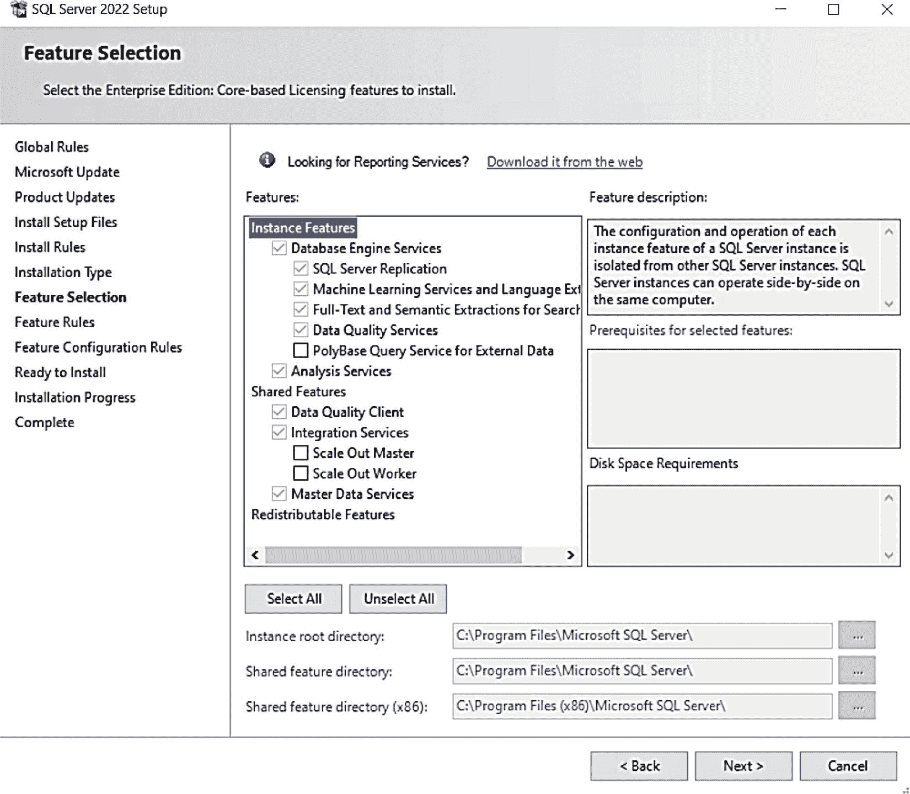

**图 3-25** 默认安装的 SQL Server 功能


#### 配置内容

以下是我们作为 SQL Server 库安装镜像过程的一部分所做出的配置选择列表：

*   `SQL Server`、`SQL Server Agent`、全文检索和 `SSIS` 服务设置为自动启动，并在部署后处于运行状态。所有服务均使用服务 SID。
*   您在部署期间指定的虚拟机管理员帐户将成为 SQL 系统管理员。
*   默认禁用文件流功能（但可以启用并支持）。
*   默认禁用始终启用可用性组（但可以启用并支持）。
*   为 SQL Server 启用了 TCP/IP 协议（即使开发版也是如此）。
*   我们通常会安装最新的累积更新（和/或安全更新），但可能并非确切的最新累积更新。您可以在 [`https://learn.microsoft.com/azure/azure-sql/virtual-machines/windows/sql-server-on-azure-vm-iaas-what-is-overview?view=azuresql#lifecycle`](https://learn.microsoft.com/azure/azure-sql/virtual-machines/windows/sql-server-on-azure-vm-iaas-what-is-overview?view=azuresql#lifecycle) 阅读更多关于我们如何保持镜像更新的信息。
*   默认启用 CEIP，但您可以将其禁用。请在 [`https://learn.microsoft.com/azure/azure-sql/virtual-machines/windows/sql-server-on-azure-vm-iaas-what-is-overview?view=azuresql#customer-experience-improvement-program-ceip`](https://learn.microsoft.com/azure/azure-sql/virtual-machines/windows/sql-server-on-azure-vm-iaas-what-is-overview?view=azuresql#customer-experience-improvement-program-ceip) 阅读更多信息。
*   默认安装 Microsoft SQL Server VSS Writer。

### 自行部署

如今，当我在 Hyper-V 虚拟机（通常只是在我的笔记本电脑上）中部署 SQL Server 实例时，我会经历为虚拟机选择某些选项（如逻辑 CPU 数量、内存、磁盘位置）的过程，然后安装操作系统，如 Windows Server 或 Linux（通常从 .ISO 文件安装）。完成后，我通常使用远程桌面（Windows）或 ssh（Linux）连接到虚拟机。对于 Windows，我会将 SQL Server 安装介质下载到本地驱动器，然后“复制并粘贴”到虚拟机中的文件夹。然后运行安装程序，开始部署 SQL Server。对于 Linux，我只需确保我的虚拟机连接到互联网，并运行 SQL Server on Linux 安装程序，该安装程序在安装过程中会下载软件包。

此过程与 SQL Server on Azure 虚拟机的“自行部署”选项几乎完全相同，只有一个例外。您将使用专为操作系统设计的库镜像之一来配置虚拟机并部署操作系统。您可以使用门户、az CLI 或 PowerShell 来选择虚拟机大小和操作系统，这与使用 SQL Server 库镜像非常相似，只是整个过程中不会包含 SQL Server 的所有选项。

我有时会使用这种技术，因为我可以完全控制 SQL Server 的安装方式和内容，而不是由库镜像决定。如果您使用此方法，有一个缺点。您无法立即利用 SQL 库镜像附带的选项，例如自动备份和安全更新。幸运的是，有一种解决方案可以使用这种自定义方法进行部署，同时又能利用自动化功能和许可选项。此解决方案称为 SQL Server IaaS 代理扩展（使用库镜像时默认安装）。我将在下一节中详细讨论此功能。

## SQL Server IaaS 代理扩展

使用 SQL Server 库镜像时，默认会安装 SQL Server IaaS 代理扩展。此扩展为您的 SQL Server 虚拟机提供自动化功能和许可选项。

### 使用 CLI 与 ARM 模板、Bison 和 Terraform

除了使用 Azure 门户，Azure 还提供了其他方式通过命令行界面（CLI）在 Azure 虚拟机上部署 SQL Server，例如使用 `az sql vm` 或 `az vm` CLI。此外还有 PowerShell 命令 `New-AzVM` 和 `New-AzSqlVM`。问题在于，所有这些方法都不支持像门户那样配置最优存储设置的方式。部署后您必须手动配置此设置。

Azure 提供了一种机制，通过称为 ARM 模板的概念，为任何 Azure 资源自动化使用 Azure CLI 工具。ARM 模板是一个 JSON 文件，以声明性方式描述了部署的配置和基础结构。

虽然您可以尝试从头学习构建模板，但我建议您获取一个示例。您可以从 [`https://learn.microsoft.com/samples/azure/azure-quickstart-templates/sql-vm-new-storage`](https://learn.microsoft.com/samples/azure/azure-quickstart-templates/sql-vm-new-storage) 下载并编辑一个 Azure 模板示例，以创建具有可配置存储设置的新的 Azure 虚拟机 SQL Server。Azure 模板不仅配置了创建虚拟机的所有属性，还支持参数，因此您可以使用模板，然后在运行时提供参数来自定义部署。此模板的链接还包括一个支持使用 Bison 在 Azure 上部署 SQL Server 虚拟机的文件。

Terraform 也可用于在 Azure VM 上部署 SQL Server。您可以在 [`https://registry.terraform.io/providers/hashicorp/azurerm/latest/docs/resources/mssql_virtual_machine`](https://registry.terraform.io/providers/hashicorp/azurerm/latest/docs/resources/mssql_virtual_machine) 阅读更多信息。


### 预留实例、专用主机和容量预留

为了节省 Azure 虚拟机的费用，你可以预付一段时间（一到三年）的费用，从而在部署时节省 Azure 虚拟机的计算成本。此选项称为 `Azure 预留虚拟机实例`。如果你计划部署许多 SQL Server Azure 虚拟机，可能应该研究此选项。在 [`https://azure.microsoft.com/pricing/reserved-vm-instances/`](https://azure.microsoft.com/pricing/reserved-vm-instances/) 了解更多关于预留实例的信息。

`容量预留` 允许你在 Azure 区域或可用区中预留计算容量，时长不限。这对于确保即使在高峰期也拥有关键工作负载所需的资源特别有用。`容量预留` 比 `预留实例` 更灵活，因为没有重大的长期承诺。它们几乎立即可用，并且你可以完全控制如何将预留目标用于关键工作负载。然而，`预留实例` 由于其长期承诺，比 `容量预留` 更便宜。你可以在 [`https://learn.microsoft.com/azure/virtual-machines/capacity-reservation-overview`](https://learn.microsoft.com/azure/virtual-machines/capacity-reservation-overview) 了解更多关于 `容量预留` 的信息。

你可能还记得在门户的部署示例中有一个名为 `专用主机` 的选项。`Azure 专用主机` 允许你为你和你的组织预留专用的物理服务器。虽然普通虚拟机专用于你的部署，但你通常与其它用户共享底层主机。专用主机可能会为你提供满足特定合规性要求所需的选项。此外，你对托管你的 VM 部署的基础设施的维护事件有更多控制权。你可以在 [`https://learn.microsoft.com/azure/virtual-machines/dedicated-hosts`](https://learn.microsoft.com/azure/virtual-machines/dedicated-hosts) 阅读更多关于专用主机的信息。此组中最大的虚拟机是 `Standard_E104ids_v5`，它提供 104 个 vCore 和 672 GiB 内存。此虚拟机之所以引人注目，是因为它是隔离的，这意味着它保证是主机上运行的唯一虚拟机，因此与其他客户工作负载隔离。

### 迁移至 Azure

你可能正在考虑将现有的 SQL Server 安装迁移到 Azure 虚拟机。以下选项可能有助于你的迁移计划。

#### Azure Arc 迁移评估

我在第 1 章中简要提到了将 SQL Server 连接到云的 Azure Arc 概念。虽然我将在本书第 10 章中更多讨论 Azure Arc，但我要在此提及，目前（在本书撰写时处于预览阶段）有一项创新可以帮助你评估当前的 SQL Server 部署，以查看其是否兼容迁移到云端，包括什么是正确的部署决策和资源选择。在 [`https://learn.microsoft.com/sql/sql-server/azure-arc/migration-assessment`](https://learn.microsoft.com/sql/sql-server/azure-arc/migration-assessment) 了解更多关于如何使用此功能。

#### 还原数据库

由于 Azure 虚拟机中的 SQL Server 是一个完整的 SQL Server 引擎，迁移现有 SQL Server 的一个简单方法就是直接还原现有数据库的备份。

由于目标 SQL Server 位于 Azure 基础设施中，你有几种方法可以执行此操作：

*   通过 RDP “复制和粘贴”备份文件。RDP 客户端允许你复制和粘贴文件，我已经为 Azure VM 做过很多次了。当然，这只对小的备份文件有意义（尽管我也处理过 1GB 大小的备份文件）。
*   使用 SQL Server 内的 `备份到 URL` 功能将数据库备份到 Azure 存储。然后在 Azure VM 中，从同一个 Azure 存储帐户还原备份。你可以在 [`https://learn.microsoft.com/sql/relational-databases/backup-restore/sql-server-backup-to-url`](https://learn.microsoft.com/sql/relational-databases/backup-restore/sql-server-backup-to-url) 阅读更多关于 SQL Server 备份到 URL 的信息。
*   使用 `Azure 文件`。可以将其视作在云端创建你自己的文件共享。你可以使用 `az` CLI 或工具将你的备份文件复制到 Azure 文件共享。然后你可以在 Azure VM 中挂载 Azure 文件共享（即，它在 VM 中看起来像网络共享）。在 [`https://learn.microsoft.com/azure/storage/files/storage-files-introduction`](https://learn.microsoft.com/azure/storage/files/storage-files-introduction) 阅读更多关于如何执行此操作的信息。我已多次对 Windows 和 Linux 的 Azure VM 使用此方法。
*   对于大型备份文件，请考虑 `Azure 导入/导出服务`。你实际上需要将硬盘安全地运送给微软（我们可以通过 Azure Data Box 磁盘为你提供方法），然后我们会将其导入 Azure 存储或 Azure 文件。你可以在 [`https://learn.microsoft.com/azure/import-export/storage-import-export-service`](https://learn.microsoft.com/azure/import-export/storage-import-export-service) 阅读更多相关信息。

#### Azure Migrate 和 Azure 数据库迁移服务

假设你想要更在线的迁移体验到 Azure 虚拟机。你可以使用 `Azure 数据库迁移服务` (DMS) 来实现此选项。DMS 是 Azure 中的一项托管服务，可协调迁移到 Azure SQL，包括 Azure 虚拟机。此迁移的选项之一是对 SQL Server 到 Azure VM 执行在线迁移。DMS 将使用日志传送技术来获取一系列连续的数据库完整备份和事务日志备份，并将其还原到已部署在 Azure VM 上的 SQL Server。在 [`https://learn.microsoft.com/data-migration/sql-server/virtual-machines/database-migration-service?tabs=online-with-extension`](https://learn.microsoft.com/data-migration/sql-server/virtual-machines/database-migration-service%253Ftabs%253Donline-with-extension) 查看如何使用此服务的示例。

如果你想评估和迁移 SQL Server ``大规模地``，请考虑使用 `Azure Migrate`。`Azure Migrate` 是一项 Azure 服务和一组客户端软件代理，用于评估和迁移在虚拟机和裸机服务器中运行的 SQL Server 到 Azure。`Azure Migrate` 可以与 `Azure 数据库迁移服务` 协调，以帮助你执行离线和/或在线迁移。在 [`https://learn.microsoft.com/azure/migrate/how-to-create-azure-sql-assessment`](https://learn.microsoft.com/azure/migrate/how-to-create-azure-sql-assessment) 开始使用。

#### 使用 Azure Migrate 服务器迁移

如果你想迁移整个物理服务器或虚拟机的安装，而不仅仅是数据，该怎么办？Azure 通过名为 `Azure Migrate 服务器迁移` 的服务支持此概念。这是一个真正的 `直接迁移` 操作。可以将其视作对你的机器或 VM 进行快照，然后从快照创建整个 VM。之后你再进行配置和优化。你可以在 [`https://learn.microsoft.com/azure/migrate/migrate-services-overview#azure-migrate-server-migration-tool`](https://learn.microsoft.com/azure/migrate/migrate-services-overview%2523azure-migrate-server-migration-tool) 阅读更多关于 `服务器迁移` 的信息。在 [`https://aka.ms/mechanicsazuremigrate`](https://aka.ms/mechanicsazuremigrate) 可以看到 Windows 传奇专家 Jeff Woolsey 展示的关于 VMware 安装如何工作的绝佳示例。

## SQL Server IaaS 代理扩展

到目前为止，我的示例和讨论都围绕着在基于 Windows Server 的 Azure 虚拟机中部署 SQL Server。

对于在 Linux 上运行的 SQL Server，选项和部署过程非常相似，但有一些显著差异：

*   镜像市场提供了适用于 Linux 发行版 Ubuntu、Red Hat Enterprise Server 和 SUSE 的镜像。如果 Linux 发行版要求，您需要为其许可证付费（Ubuntu 是免费许可证）。
*   我们在部署过程中不支持配置 SQL Server 设置。`SQL Server IaaS 代理扩展` 支持 Ubuntu 发行版，但在许可证方面提供有限支持。更多信息请访问 [`https://learn.microsoft.com/azure/azure-sql/virtual-machines/linux/sql-server-iaas-agent-extension-linux`](https://learn.microsoft.com/azure/azure-sql/virtual-machines/linux/sql-server-iaas-agent-extension-linux)。

使用 SQL Linux 镜像后，您会发现 `mssql-server`、`mssql-tools` 和 `mssql-ha` 包已安装。

SQL Agent 默认未启用，但您可以自行启用。您可以使用 `mssql-conf` 脚本在 Linux 上启用 SQL Server Agent，详细信息请访问 [`https://learn.microsoft.com/sql/linux/sql-server-linux-setup-sql-agent`](https://learn.microsoft.com/sql/linux/sql-server-linux-setup-sql-agent)。

部署后，您可以使用文档记录的方法安装其他 SQL Server Linux 包。例如，您可以阅读 [`https://learn.microsoft.com/sql/linux/sql-server-linux-setup-machine-learning`](https://learn.microsoft.com/sql/linux/sql-server-linux-setup-machine-learning) 来了解如何为 Linux 安装 SQL Server 机器学习服务。

### 部署 SQL Server 容器

在 Azure 虚拟机中部署 SQL Server 容器没有特殊的镜像或流程。您将使用与今天在虚拟机中部署 SQL Server 容器相同的流程。有关此过程的更多信息，请访问 [`https://aka.ms/sqlcontainers`](https://aka.ms/sqlcontainers)。

`Azure Kubernetes 服务` (AKS) 提供了一种利用 Kubernetes 的强大功能大规模部署容器的方法。您可以在 [`https://learn.microsoft.com/sql/linux/quickstart-sql-server-containers-azure`](https://learn.microsoft.com/sql/linux/quickstart-sql-server-containers-azure) 查看如何执行此操作的教程。

您在本章中已经看到了使用镜像在 Azure 虚拟机中部署 SQL Server 的特殊选项和优势的示例，包括许可、配置和自动化。这一切都是通过 `SQL 虚拟机资源提供程序` 使用 `SQL Server IaaS 代理扩展` 实现的。资源提供程序是在 Azure 中运行的软件，它启用了与 Azure 资源管理器集成的特定 SQL 功能。该扩展是在您的虚拟机中运行的一组代理，它们使用资源提供程序。

如果您使用 SQL Server 镜像进行部署，您只需利用资源提供程序所提供的功能，无需您进行任何操作。但是，如果您自行部署并希望获得这些优势（包括许可），则需要将您的 VM 注册为 SQL Azure VM。

首先，您需要确保您的 Azure 订阅已注册 `Microsoft.SqlVirtualMachine` 资源提供程序。您可以从 Azure 门户的订阅设置中完成此操作。或者，您可以使用以下 PowerShell 命令：

```
Register-AzureRmResourceProvider -ProviderNamespace Microsoft.SqlVirtualMachine
```

接下来，您需要使用资源提供程序注册您的虚拟机。注册 VM 会安装 `SQL Server IaaS 代理扩展`。您可以阅读 [`https://learn.microsoft.com/azure/azure-sql/virtual-machines/windows/sql-agent-extension-manually-register-single-vm`](https://learn.microsoft.com/azure/azure-sql/virtual-machines/windows/sql-agent-extension-manually-register-single-vm) 了解所有步骤。

一旦您的 VM 被注册或如果您使用了 SQL 镜像，您的 VM 现在就被视为既是 Azure 虚拟机资源，也是一个 `SQL 虚拟机`。这意味着搜索 `Azure SQL` 资源时，您的 VM 会出现。此外，根据本章前面所做的部署，门户将显示如图 3-26 所示的附加属性。

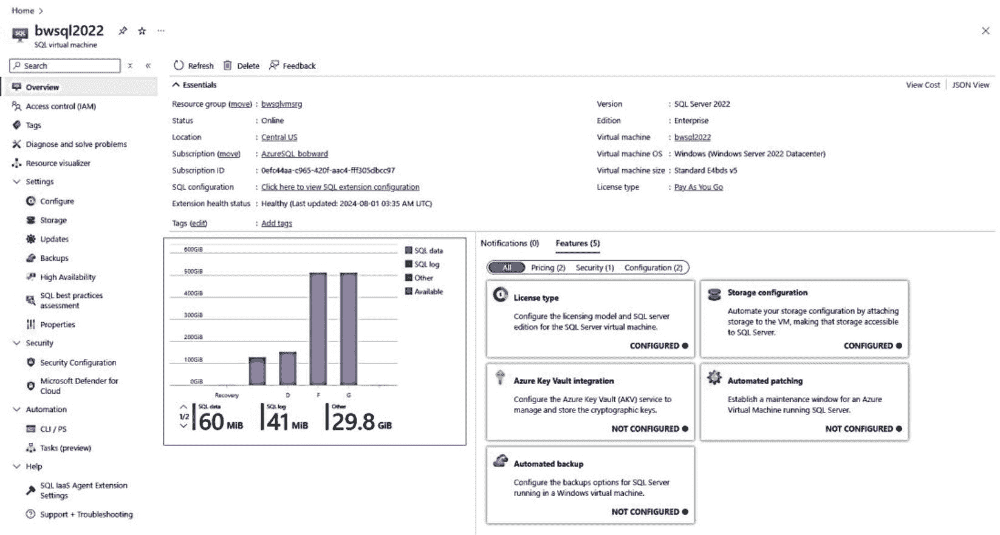

图 3-26：已注册的 SQL Azure 虚拟机

> **注意**
>
> 一个访问此概览页面的简便方法是：转到虚拟机的命令菜单，在 `设置` 下选择 `SQL Server 配置`。然后点击 `SQL Server 配置`。

您可以看到此屏幕看起来像一个 Azure 虚拟机，但包含特定于 SQL Server 的信息和选项。

您可以看到 `基本信息` 窗格包含有关 VM 的信息，也包含 SQL Server 的信息，包括版本、版本、许可类型和操作系统详细信息。在 `工作窗格` 下方是一个图表，显示数据库和日志文件的存储空间，以及您可以为 Azure VM 中的 SQL Server 启用的功能。`命令栏` 有一个选项可以删除（取消注册）SQL Server Azure 虚拟机并删除底层 VM。

`服务菜单`（在图 3-26 中展开）包含特定于在 Azure 虚拟机上运行的 SQL Server 的选项，包括以下两个主要类别。我认为您会发现其中许多选项对于帮助您管理 Azure 虚拟机上的 SQL Server 极其有价值。

### 设置

在 `设置` 下，您有以下选项。

#### 配置

此选项允许您指定 SQL 的许可证（`即用即付`、`Azure 混合权益` 或 `灾难恢复`）。

我在本章前面已经介绍过 `Azure 混合权益`。`即用即付` 是默认的计费方式，按月支付 SQL 许可证费用。`灾难恢复` 是一个新选项，如果 VM 中的 SQL Server 仅用于灾难恢复目的，则提供免费的 SQL Server 许可证。

此外，您可以指定 VM 使用的 SQL Server 版本。

#### 存储

此选项值得关注，因为它提供与 VM 上 SQL Server 相关的存储的分析、指标、评估和配置，如图 3-27 所示。

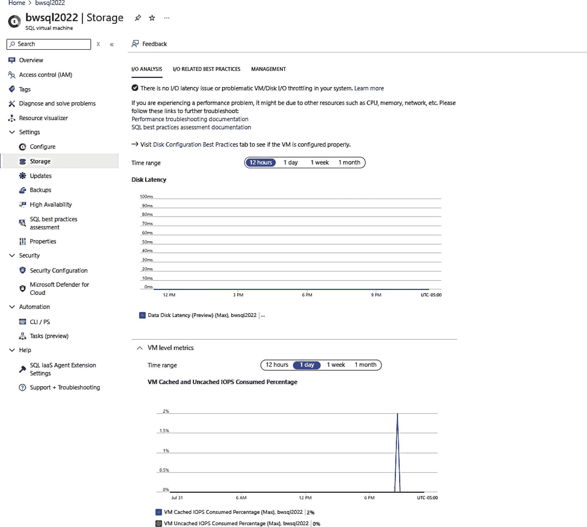

图 3-27：Azure VM 中 SQL Server 的存储辅助工具

#### 更新

这是另一个很好的选项，不仅可以管理安全更新，还可以管理 Windows 的其他更新和 SQL Server 的累积更新。您甚至可以大规模管理和安排更新。此功能基于 `Azure 更新管理器`。更多信息请访问 [`https://learn.microsoft.com/azure/azure-sql/virtual-machines/azure-update-manager-sql-vm`](https://learn.microsoft.com/azure/azure-sql/virtual-machines/azure-update-manager-sql-vm)。

### 备份

此功能允许您为 VM 中的 SQL Server 启用和禁用自动备份。此功能使用产品中已存在多个版本的功能，利用 SQL Server Agent 和备份到 URL。您可以了解更多： [`https://learn.microsoft.com/azure/azure-sql/virtual-machines/windows/automated-backup`](https://learn.microsoft.com/azure/azure-sql/virtual-machines/windows/automated-backup)。虽然我确实建议您查看此功能，但我发现在云端，客户通常会构建自己的自动备份系统（但使用 Azure 存储进行备份到 URL）或使用 `Azure 备份` 服务。

#### 高可用性

此选项帮助您为 Azure VM 上的 SQL Server 配置 Always On 可用性组。有关此选项的更多信息，请参阅本章后面的“高可用性与灾难恢复”部分。


